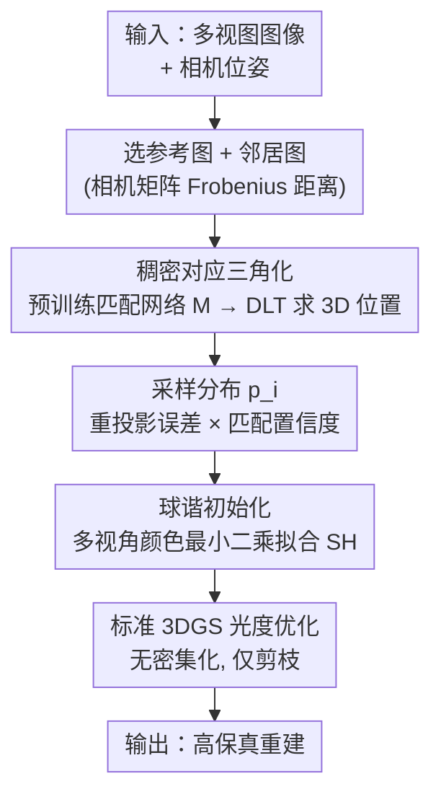

# EDGS: Eliminating Densification for Efficient Convergence of 3DGS

**会议**: CVPR 2026  
**论文**: [CVF Open Access](https://openaccess.thecvf.com/content/CVPR2026/html/Kotovenko_EDGS_Eliminating_Densification_for_Efficient_Convergence_of_3DGS_CVPR_2026_paper.html)  
**代码**: https://compvis.github.io/EDGS （项目页）  
**领域**: 3D视觉  
**关键词**: 3D高斯泼溅, 稠密初始化, 密集化, 三角化, 新视角合成

## 一句话总结
EDGS 把 3DGS 里"边训练边逐步加点（densification）"的慢过程整个删掉，改成一开始就用密集 2D 对应关系三角化出一大批位置/颜色/尺度都已知的高斯，从而在 15% 的训练时间里达到原版 3DGS 的质量、继续训练还能把 LPIPS 再降 35%。

## 研究背景与动机
**领域现状**：3D Gaussian Splatting（3DGS）是当前主流的显式场景表示。它从 SfM 给出的稀疏点云开始，把场景建模成一堆 3D 高斯（各自带位置、形状、颜色、不透明度），然后靠"自适应密集化"（Adaptive Density Control, ADC）在欠重建区域反复**分裂/复制**高斯，逐步把细节补出来。

**现有痛点**：这个"逐步加点"的过程又慢又不准。① 慢：每一步加点本身不贵，但模型必须先让现有高斯优化好几轮、确认某块区域确实欠拟合，才决定在那里加点，于是单个高斯要经历多次反复调整、走一条很长的优化路径，整体收敛被严重拖慢；② 不准：原版 3DGS 用光度损失的梯度范数来判断"哪里欠重建"，这个判据在高频区域（草地、碎石、纹理）经常失灵，也和人眼感知对不齐，导致高频细节始终糊。

**核心矛盾**：densification 把"几何在哪里需要更多基元"这件事，交给了一个**事后的、基于梯度的、串行的**探测过程——它既要等优化收敛才看得准，又只能局部地、增量地补点。慢和糊都源于此。

**本文目标**：能不能彻底绕过 densification？即：不靠训练过程慢慢长出高斯，而是在优化**开始之前**就一次性把稠密、信息充分的高斯铺好。

**切入角度**：作者注意到，多视图图像之间的**稠密像素对应**本身就编码了场景几何——给定相机位姿和匹配像素，三角化就能直接恢复 3D 点。与其等光度损失一点点把信息灌进去，不如一开始就把所有 2D 图像信息榨干。

**核心 idea**：用"密集对应三角化得到的稠密初始化"替代"增量密集化"。每个高斯一出生就带着来自输入 RGB 的位置、颜色、尺度，立刻被丰富的逐像素光度信号监督，优化路径被大幅缩短，densification 直接删除。

## 方法详解

### 整体框架
EDGS 不改 3DGS 的渲染和优化算法，只把**初始化**这一环彻底换掉。流程是：从训练集挑一张参考图 $I_i$，找出与它视野重叠最大的若干邻居图 $\{I_j\}$；对每个邻居用预训练稠密匹配网络 $M$（默认 RoMa）算出逐像素对应；把匹配像素对三角化成 3D 点，得到候选高斯位置；但稠密匹配会产生海量且含噪的点，于是用一个**采样分布** $p_i$ 同时衡量"几何一致性（重投影误差）"和"匹配置信度"，从中采样出一批可靠高斯；再为每个采样高斯用参考图颜色拟合球谐（SH）系数。最后这批已经"位置对、颜色对、尺度合理"的稠密高斯，直接进入**标准 3DGS 光度损失优化**，全程不做任何密集化。

### 关键设计

**1. 稠密初始化替代密集化：把几何"前置"到优化之前**

这是全文的核心。原版 3DGS 的痛点在于"何时何地加点"是个被光度损失梯度驱动的、事后的、串行的判断，既慢又在高频区失准。EDGS 的做法是：与其让模型在训练中慢慢发现"这里缺点"，不如一开始就用所有可用的 2D 信息把高斯铺满。具体地，它对多张输入视图计算**稠密**像素对应（不是稀疏关键点），三角化成 3D 点作为高斯初始位置，再从参考图直接读取颜色、由几何推出尺度。这样每个高斯从第 0 步就拿到了"well-informed"的位置/颜色/尺度，立刻被逐像素光度信号监督，优化路径大幅缩短（论文 Fig. 2/4 用位移和轨迹长度量化了这一点：高斯起点离终点更近，移动更少）。相比依赖稀疏关键点的初始化，稠密对应保证了**全场景均匀的细节密度**，连其他方法最头疼的高频区都被铺到点。而且所有高斯在起点**并行**初始化，不必像 densification 那样串行地等"加完一批、调一批"。

**2. 像素对的多视图三角化：从匹配恢复 3D 位置**

有了像素对应，还得把 2D 匹配变成可靠的 3D 坐标。对一对匹配像素 $(u^i_k, v^i_k)$ 与 $(u^j_k, v^j_k)$，已知两台相机的投影矩阵 $P^i, P^j$，每个投影方程给出形如 $[g^x_k\,1]P^i_{col,0} = w^i_k u^i_k$ 的约束；利用第三列 $[g^x_k\,1]P^i_{col,2}=w^i_k$ 把齐次标量 $w$ 消去，得到关于 3D 坐标 $g^x_k$ 的线性方程组 $A g^x_k = -b$，再以最小二乘求解：

$$g^x_k := \arg\min_{x}\,\|A x + b\|^2 .$$

这就是经典的 DLT（直接线性变换）三角化，对每个匹配像素对独立求一次，得到候选高斯的 3D 中心。它的价值在于：几何不再靠优化"摸索"出来，而是由相机几何**直接闭式解出**，这是初始化能这么"靠谱"的根基。

**3. 几何 × 置信度采样分布：从海量含噪匹配里选可靠点**

稠密匹配会产生远超可用规模的点，且很多是错配——直接全用既算不动又会污染初始化。作者为每个参考视图定义一个采样分布 $p_i$，从两个维度筛点：① **几何一致性**——把三角化点重投影回参考图，算重投影误差 $\eta^i_k = \|\pi(P^i, g^x_k) - (u^i_k, v^i_k)\|_2$（邻居视图同理，取两者最大值 $\eta^{ij}_k$），误差大说明跨视图不一致，应避开；② **匹配置信度**——匹配网络输出的 $c_{ij}$。两者各自转成阈值内的均匀分布 $p^{ij}_{corr}$、$p^{ij}_{proj}$，再逐元素相乘并对邻居取 max 得到 $p_i(k) \propto \max_{j}\big(p^{ij}_{corr}(k)\,p^{ij}_{proj}(k)\big)$，最后跨参考图聚合成全局分布 $p(k)\propto\prod_i p_i(k)$。直白说：**只有在多视图里既匹配得有把握、又三角化得几何自洽的点，才有高概率被采为高斯**。这一步是把"稠密但噪声大"的初始化变得鲁棒的关键，消融里去掉任一项都明显掉点。

**4. 球谐系数初始化：让颜色从一开始就视角自洽**

光有位置和单一颜色不够，3DGS 用球谐（SH）表达高斯的视角相关颜色。EDGS 为每个采样高斯，从它能被看到的 $n$ 个视角收集 $n$ 个 RGB 观测 $O_k$，构造各视角方向上 SH 基函数（到 3 阶、共 16 维）的矩阵 $Y_k$，用最小二乘拟合 SH 系数 $\hat H_k = \arg\min_H \|Y_k H - O_k\|_F^2$；当观测数 $n<16$（约束不足）时改用 Moore–Penrose 伪逆 $\hat H_k = Y_k^{+}O_k$ 保证稳定求解。这样高斯一出生颜色就已经"多视角自洽"，省去优化早期反复纠颜色的时间，消融显示它主要改善 LPIPS（感知质量）。

### 损失函数 / 训练策略
初始化完成后，**不引入任何新的损失或正则**，直接套用标准 3DGS 的光度损失继续优化高斯参数，并开启剪枝、关闭密集化（Tab. 1 设置）。值得注意的是高斯数在训练中**不增反降**：Mip-NeRF360 上从初始最多 3.6M 降到 5K 步的 2.6M、收敛时的 1.9M——错误初始化的高斯被逐渐剪掉。默认初始化预处理在单张 A100 上约 120s/场景（稠密匹配 76s、三角化 11s、SH 估计 15s），峰值显存 15GB，这部分时间已计入论文报告的训练耗时。

## 实验关键数据

### 主实验
在 Mip-NeRF360、Tanks&Temples、Deep Blending 三个数据集上评测（A100，竞品同硬件重测）。EDGS+3DGS 为完整 30000 步、无密集化版本。

| 数据集 | 指标 | EDGS+3DGS | 3DGS-MCMC | 原版 3DGS* |
|--------|------|-----------|-----------|------------|
| Tanks&Temples | SSIM↑ / PSNR↑ / LPIPS↓ | **0.868 / 24.28 / 0.132** | 0.863 / 24.22 / 0.158 | 0.853 / 23.76 / 0.169 |
| Mip-NeRF360 | SSIM↑ / PSNR↑ / LPIPS↓ | 0.839 / 28.02 / **0.141** | **0.842** / **28.15** / 0.176 | 0.816 / 27.49 / 0.215 |
| Deep Blending | SSIM↑ / PSNR↑ / LPIPS↓ | 0.904 / 29.81 / **0.223** | 0.902 / 29.56 / 0.244 | 0.908 / 29.77 / 0.242 |

EDGS 在三个数据集上几乎都拿到最优或次优，**LPIPS（感知质量）尤其领先**，且不做任何密集化、高斯数量更少（1.4–1.9M vs 竞品 2–6M）。

效率对比（Mip-NeRF360，早停设置）：

| 方法 | SSIM↑ | PSNR↑ | LPIPS↓ | 训练时间 |
|------|-------|-------|--------|----------|
| Taming 3DGS | 0.820 | 27.71 | 0.207 | 14m |
| MiniSplatting | 0.820 | 27.25 | 0.217 | 12m |
| **EDGS+3DGS 10K** | **0.834** | 27.54 | **0.154** | 12m |
| **EDGS+3DGS 5K** | 0.825 | 26.88 | 0.166 | **8m** |

即便只训练 5K 步（8 分钟），EDGS 在两个指标上仍超过所有高效方法。

兼容性（作为初始化插到其它密集化方法上，Tab. 3）：给 AbsGS / 3DGS-MCMC / Taming 3DGS 换上 EDGS 初始化，三者 LPIPS 分别再降约 6% / 10% / 14%，且不增加最终高斯数、不增加训练时间——说明 EDGS 是**正交、即插即用**的初始化组件。

### 消融实验
组件消融（Mip-NeRF360，Tab. 6）：

| 配置 | PSNR↑ | SSIM↑ | LPIPS↓ | 说明 |
|------|-------|-------|--------|------|
| EDGS (full) | **28.02** | **0.839** | **0.141** | 几何采样 + 置信采样 + SH 初始化全开 |
| w/o SH init | 27.80 | 0.840 | 0.175 | 去掉 SH 初始化，LPIPS 明显变差 |
| w/o $p^{ij}_{proj}$ | 27.72 | 0.830 | 0.179 | 去掉重投影几何筛选 |
| w/o $p^{ij}_{corr}$ | 27.55 | 0.829 | 0.197 | 去掉匹配置信筛选，掉点最多 |
| baseline（都去掉） | 27.43 | 0.822 | 0.202 | 退化到朴素稠密初始化 |

匹配算法消融（Tab. 5）：RoMa（默认）最好（PSNR 28.02 / LPIPS 0.141），DKM、LoFTR 也都可用；只有 RAFT 明显差（PSNR 26.90），因为它本是为相邻视频帧的光流设计、不擅长大视角差的匹配。

### 关键发现
- **置信度筛选（$p^{ij}_{corr}$）贡献最大**：去掉后 PSNR 从 28.02 掉到 27.55、LPIPS 从 0.141 升到 0.197，说明把错配高斯挡在初始化之外是质量的命脉。
- **SH 初始化主攻感知质量**：去掉它 SSIM 基本不变，但 LPIPS 从 0.141 恶化到 0.175，印证它解决的是颜色视角一致性。
- **EDGS 上再加密集化几乎没用**（Tab. 4：28.02→28.08，LPIPS 0.141→0.140），反向证明稠密初始化已经把 densification 该补的细节补齐了。
- **高斯数随训练下降**而非上升，意味着初始化"宁多勿缺"，优化阶段靠剪枝去伪，和传统"由少到多"的范式相反。

## 亮点与洞察
- **把"几何发现"从优化里搬出来**：3DGS 系工作大多在改进 densification 的判据（梯度、像素误差、MCMC），EDGS 直接质疑"还需不需要 densification"，用三角化把几何前置，是范式层面的换思路。
- **稠密 vs 稀疏初始化的关键差别在高频区**：用稀疏关键点初始化会在草地/碎石这类高频区留空，而稠密对应保证"每个有意义的位置都有一个高斯"，这正是 LPIPS 大幅领先的来源。
- **正交即插即用**：EDGS 不碰优化算法，可直接当作任意 ADC 方法的初始化，给现有 pipeline 免费涨点——这种"只换初始化"的低侵入设计很容易被社区采纳。
- **可迁移思路**：用预训练稠密匹配网络（RoMa 等）为几何重建提供强先验，可推广到稀疏视图重建、SLAM 等需要快速可靠初始化的场景。

## 局限与展望
- **依赖稠密匹配网络质量**：整套初始化建立在 RoMa 等匹配网络上，匹配网络在弱纹理、强反光、剧烈视角变化下若失效，初始化会随之退化（RAFT 的失败就是例证）。
- **预处理有固定开销**：每场景约 120s 的匹配+三角化+SH 预处理，在场景数极多或图像分辨率极高时会累积；峰值 15GB 显存对小显存设备不友好。
- **主要在密集视图设定下验证**：论文核心实验是密集视图重建，稀疏视图仅在补充材料涉及，极端稀疏/无重叠视角下三角化可靠性存疑。
- **改进方向**：把采样分布与下游优化联合（让优化反馈指导哪些初始化点该保留）、用更轻量的匹配/三角化降低预处理成本，是自然的延伸。

## 相关工作与启发
- **vs 原版 3DGS**：3DGS 从稀疏 SfM 起步、靠光度梯度增量加点；EDGS 从稠密对应三角化一次性铺满高斯、删除密集化。区别在"几何由优化逐步发现"还是"由三角化一次解出"，EDGS 因此更快且高频更细。
- **vs 3DGS-MCMC / AbsGS / Taming 3DGS**：这些方法改的是 densification 的**判据或采样过程**（MCMC、绝对梯度、像素误差），仍在 densification 框架内；EDGS 是改**初始化**、绕开 densification，且能反过来给它们当初始化继续涨点。
- **vs RAIN-GS（随机初始化）/ RadSplat（NeRF 点初始化）**：RAIN-GS 证明随机初始化也能追平 3DGS，RadSplat 用预训练 NeRF 提点但要 9 小时；EDGS 在"既高效又超过质量导向方法"上同时取胜。

## 评分
- 新颖性: ⭐⭐⭐⭐⭐ 直接删掉 3DGS 的密集化、用稠密对应三角化做初始化，是范式级换思路
- 实验充分度: ⭐⭐⭐⭐⭐ 三数据集主结果 + 早停效率 + 兼容性 + 组件/匹配算法多重消融，覆盖完整
- 写作质量: ⭐⭐⭐⭐ 动机递进清晰、公式完整，部分符号（DLT 推导）略密集
- 价值: ⭐⭐⭐⭐⭐ 低侵入、即插即用、对高频细节和训练速度都有实质提升，易被社区采用

<!-- RELATED:START -->

## 相关论文

- [\[CVPR 2026\] CaT-GS: Efficient 3DGS Rendering for Large-Scale Scenes with Inter-frame Caching and Tile Scheduling](cat-gs_efficient_3dgs_rendering_for_large-scale_scenes_with_inter-frame_caching_.md)
- [\[ICCV 2025\] RobustSplat: Decoupling Densification and Dynamics for Transient-Free 3DGS](../../ICCV2025/3d_vision/robustsplat_decoupling_densification_and_dynamics_for_transient-free_3dgs.md)
- [\[CVPR 2026\] VAD-GS: Visibility-Aware Densification for 3D Gaussian Splatting in Dynamic Urban Scenes](vad-gs_visibility-aware_densification_for_3d_gaussian_splatting_in_dynamic_urban.md)
- [\[CVPR 2026\] ObjectMorpher: 3D-Aware Image Editing via Deformable 3DGS](objectmorpher_3d-aware_image_editing_via_deformable_3dgs.md)
- [\[CVPR 2026\] GenSplat: Bridging the Generalization Gap in 3DGS Language Comprehension](gensplat_bridging_the_generalization_gap_in_3dgs_language_comprehension.md)

<!-- RELATED:END -->
