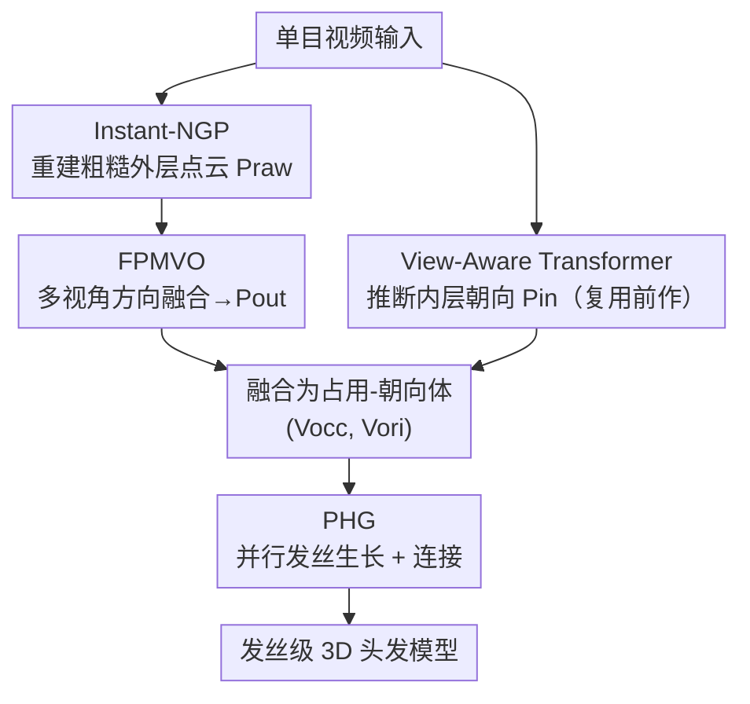

# EfficientMonoHair: Fast Strand-Level Reconstruction from Monocular Video via Multi-View Direction Fusion

**会议**: CVPR 2026  
**论文**: [CVF Open Access](https://openaccess.thecvf.com/content/CVPR2026/html/Li_EfficientMonoHair_Fast_Strand-Level_Reconstruction_from_Monocular_Video_via_Multi-View_Direction_CVPR_2026_paper.html)  
**代码**: 待确认  
**领域**: 3D视觉  
**关键词**: 头发丝级重建, 单目视频, 多视角方向融合, 并行生长, 隐式-显式混合

## 一句话总结
EfficientMonoHair 在 MonoHair 的隐式-显式混合管线基础上，用「多视角方向融合」(FPMVO) 一次性聚合多视角候选方向、替代逐视角穷举搜索，再用「并行头发生长」(PHG) 放松体素占用约束让上万根发丝在 GPU 上同时生长，把单目视频的发丝级头发重建从 4–9 小时压到约 23–50 分钟（外层方向优化阶段提速约 28×、整体约 6–8×），同时保持与 SOTA 相当的几何精度。

## 研究背景与动机

**领域现状**：从图像/视频重建「逐根发丝」(strand-level) 的头发几何，是数字人和虚拟化身的关键一环。和人脸、人体那种相对刚性、有标准化表示的几何不同，头发高度非刚性、拓扑复杂，一直是数字化里的硬骨头。主流路线有三类：早期显式几何优化（多视角图像 + 手工几何约束，精度高但要密集相机、人工标定、算力巨大）；隐式神经表示（从单图/视频学头发的形状和朝向分布，自动化快，但细粒度方向细节差，尤其卷发、交叉发丝会糊）；近年的混合显式-隐式框架（结合两者优点，但方向场优化耗时、跨视角发丝细节不一致）。

**现有痛点**：当前混合路线里最强的代表是 MonoHair——它只需单目视频，质量和多样性都明显超过 NeuralHaircut 等前作，但**重建一个发型要 4–9 小时**，而典型的多视角化身重建管线通常 30–60 分钟就能跑完。慢的根源在两个串行瓶颈：(1) 外层方向场用「逐视角穷举搜索」(exhaustive search) 迭代地为每根发丝挑最优朝向，计算开销极大；(2) 发丝生长用 CPU 串行积分，每根发丝要等前一根完成、并同步更新全局占用体素才能继续，天然无法并行，还要反复重建 KD-tree。

**核心矛盾**：精度、几何细节、计算效率三者之间难以兼得——显式优化精度高但慢，隐式生成快但细节糊；即便是 MonoHair 这种混合方案，也是用「串行换精度」，慢得没法实用。

**本文目标**：在**不牺牲发丝级保真度**的前提下大幅提速，具体拆成两个子问题——外层方向场怎么不靠逐视角穷举就能稳定求解？发丝生长怎么从串行变成大规模并行？

**切入角度**：作者观察到，MonoHair 慢的两处都源于「串行依赖」，而这两处依赖其实可以被「先融合、后约束」和「先放松、后修复」的思路打破——方向求解可以把多视角候选**先聚合成视角无关的候选集**再优化，生长可以**先放松体素互斥约束让大家并行长、再在连接阶段消解冲突**。

**核心 idea**：用「多视角方向融合 (FPMVO) + 并行发丝生长 (PHG)」替换 MonoHair 的「逐视角穷举 + 串行生长」，在混合显式-隐式框架内把两个串行瓶颈都并行化。

## 方法详解

### 整体框架
EfficientMonoHair 沿用 MonoHair 的三阶段混合管线，但把其中两个最慢的阶段换成了可并行的新模块。输入是一段单目视频，输出是可直接导入 Blender/Houdini 做渲染和物理仿真的、附着到头皮的发丝级 3D 头发模型。三个阶段是：

(a) **外层方向优化**：先用 Instant-NGP（配合 COLMAP 相机）从视频重建场景，取出粗糙的外层头发点云 $P_{raw}(p)$；再用本文的 **FPMVO** 做多视角 patch 级方向融合，得到稳定的、带方向的外层点云 $P_{out}(p, d_{out})$。

(b) **内层方向推断**：头发内部在单目视频里不可见，沿用 MonoHair 的做法——先渲染一张无方向发丝图 (undirectional strands map)，再用 View-Aware Transformer 推断内部点云的朝向 $P_{in}(p, d_{in})$。这一步基本复用前作（仅做少量性能优化），是脚手架而非本文创新。

(c) **头发生长**：把内外层方向场融合成统一的「占用-朝向体」$(V_{occ}, V_{ori})$，再用本文的 **PHG** 在这个体里**同时**生长大量发丝、连接成长发丝，得到最终模型。

### 关键设计

**1. FPMVO：用多视角方向融合替代逐视角穷举搜索**

外层方向场是整条管线最慢的一环。MonoHair 用 Gabor 滤波从每个视角抽 2D 朝向图 $O\in\mathbb{R}^{H\times W\times 2}$ 和置信度图 $C\in[0,1]^{H\times W}$，但这些方向稀疏、跨视角不一致，于是它对每根发丝逐视角穷举搜索最优朝向，开销极高。FPMVO 的核心是**把「逐视角迭代」变成「一次性多视角聚合」**，分三步走。

第一步「多视角方向采样」：对每个可见 3D 点 $p_i$、每个可见视角 $v$，先做可见性判定（比较 $p_i$ 到相机的距离与该视角深度图 $D_v$ 在投影位置 $u_i^v=\Pi_v(p_i)$ 处的值），然后沿图像平面的局部方向做偏移 $\check{u}_i^v = u_i^v + \lambda\, O_v(u_i^v)$，并在偏移点附近的深度上采 $S$ 个样本以容忍深度不确定性 $\check{z}_v^{(s)} = \check{z}_v + \delta^{(s)},\ \delta^{(s)}\in[-\Delta,\Delta]$（采样范围很窄，$2\Delta=10\text{mm}$）。把这些偏移点反投影回 3D，与原点 $p_i$ 作差归一化，就得到每个点的多视角候选方向集 $\text{Dir}(p_i)=\{d_v^{(s)}\}$。

第二步「Medoid 方向融合」：直接平均各视角候选方向会因视角差异、深度歧义、遮挡产生朝向模糊伪影。FPMVO 改为取置信度最高的 top-$K$ 视角（典型 $K=5$）的候选，在每个深度层内算两两方向相似度 $G_{ij}^{(s)} = |\langle d_i^{(s)}, d_j^{(s)}\rangle|$（取绝对值是因为发丝段没有唯一前后方向），再用置信度加权得到每个候选的一致性得分

$$\sigma_i^{(s)} = \frac{\sum_{j=1}^{K} w_j\, G_{ij}^{(s)}}{\sum_{j=1}^{K} w_j},$$

选得分最高者 $d_f^{(s)} = d_{i^*}^{(s)},\ i^* = \arg\max_i \sigma_i^{(s)}$ 作为该深度样本的融合方向。这本质上是在单位球上找「带权一致性最大的 medoid 方向」——选一个真实存在的候选而非平均值，因此既稳健又不引入平均伪影。

第三步「patch 一致性优化」：融合后的候选已经是视角无关的，于是直接在图像投影域做最终决策——把融合候选点重投影回最可信视角得到 2D 方向偏移 $r_v^{(s)} = \Pi_v(\check p_f^{(s)}) - \Pi_v(p_i)$，在以 $u_i^v$ 为中心的 $P\times P$ patch 里算双向相似度 $\text{sim}_p^{(s)} = \max(\langle r_v^{(s)}, O_p\rangle, -\langle r_v^{(s)}, O_p\rangle)$（对称形式消除前后向歧义），乘上置信度 patch 得 $L_p^{(s)}$，取 patch 内最大响应 $L_{patch}^{(s)} = \max_p L_p^{(s)}$，最后挑 patch 一致性最高的候选定出 $d_{out}$。整套流程把外层方向优化提速约 **28×**（见时间分解实验），且因为是「先聚合再约束」而非逐视角迭代，跨视角稳定性反而更好。

**2. PHG：放松体素占用约束让大规模发丝并行生长**

MonoHair 的串行生长是另一个瓶颈：它逐根发丝沿局部朝向场积分，每步依赖上一步、且必须**同步**更新全局占用体素以避免发丝重叠；段合并还要反复重建 KD-tree。这种严格的「步进占用检查」既无法并行，又会**放大局部方向误差**——一旦朝向场有噪声，硬约束会让发丝长歪还卡死。PHG 把生长重构成完全并行的体素追踪+连接管线，分两步。

「并行 guide 发丝初始化」：关键改动是**把占用标记的更新推迟到每个批次追踪步结束**，而不是每生长一步就同步锁体素。这样上万个头皮种子点 $h_i$（沿法向 $n_i$）能在 $V_{ori}$ 里**同时**追踪出大量 guide 发丝 $S_{root}$，彻底去掉同步壁垒、变成 SIMD 式批量追踪。放松约束会让多根发丝暂时挤进同一体素，但这种冲突留到后面的连接合并阶段、用相邻轨迹插值自然消解。更关键的是——消融实验显示，**允许更多发丝反而提升了鲁棒性**：当朝向体不准时，冗余的发丝候选能「投票式」地盖过局部错误方向。

「并行段生长与连接」：用一次性构建全局 KD-tree、对所有发丝端点做**向量化批量最近邻查询**，找同时满足空间邻近和方向一致的可合并段对：

$$\|p_i^{end} - p_j^{start}\| < \delta_d,\quad \langle d_i, d_j\rangle > \cos(\delta_\theta),$$

满足两条件的段被并成同一根发丝。最后再在头皮网格上建 KD-tree、把未附着端点投到最近头皮点（这步仍是串行，作者把它列为局限）。整套生长比 MonoHair 快 **2–3×**，且保留了发丝级连接性和形状保真。

> ⚠️ 框架↔图↔关键设计一致性说明：图中 FPMVO、PHG 两个贡献节点分别对应上面两个设计；Instant-NGP 粗几何、View-Aware Transformer 内层推断、占用-朝向体融合是复用前作或通用步骤的脚手架节点，不单列设计点（内层推断仅做了少量未在正文展开的性能优化，作者注明细节在附录）。

### 损失函数 / 训练策略
本文不是一个端到端可训练网络，而是一套优化 + 推断 + 几何生长的混合管线，FPMVO 和 PHG 都是确定性几何算法（无需训练损失）。唯一的可学习模块 View-Aware Transformer 直接复用 MonoHair/DeepMVSHair 的预训练权重。实验中所有 MonoHair 和本文方法都在单张 RTX 4090 上跑，DiffLocks 用官方实现在 A100 上评测。

## 实验关键数据

数据集：真实数据用 MonoHair 的多视角头发视频序列（短发/长发/卷发等）做定性对比；定量评测用合成数据集 **Hair20K**（由 USC-HairSalon 扩展而来，Blender 多视角渲染、有发丝级真值）。指标分两类：**占用精度**（重建发丝是否落在真值几何邻域，按体素尺寸 2/3/4mm 阈值算 Precision/Recall/F1）和**朝向精度**（同时比空间邻近和方向一致，按体素尺寸/角度阈值算）。主要对比 MonoHair（显式优化代表，patch 尺寸 $P=5$ 最高质量 / $P=1$ 最快）和 DiffLocks（单视角隐式生成代表）。

### 主实验
Hair20K 上的质量与速度（占用 F1 取体素 3mm、朝向 F1 取 3mm/30°；Speed 为相对 MonoHair P=5 的加速比）：

| 方法 | 占用 F1 (3mm) | 朝向 F1 (3/30) | 加速比 | 时间 |
|------|------|------|------|------|
| MonoHair (P=5) | 56.3 | 27.3 | 1× | 136m |
| MonoHair (P=1, 快版) | 50.4 | 22.2 | 1.2× | 111m |
| DiffLocks（隐式生成） | 39.6 | 17.6 | 818× | 10s |
| **Ours (full)** | **58.4** | 21.7 | **5.9×** | **23m** |

要点：Ours(full) 在**占用 F1 上反超** MonoHair(P=5)（58.4 vs 56.3，空间完整性更好），朝向 F1 达到其约 88%（21.7 vs 27.3），但速度快约 6×（23m vs 136m）；相比 MonoHair 的快版 P=1（为微弱提速大幅掉质量），本文给出明显更优的精度/速度权衡。DiffLocks 虽快几个量级，但各项指标全面落后。

### 消融实验
两大贡献单独拆开测（FPMVO only = 用 FPMVO 初始方向 + MonoHair 串行生长；PHG only = 用 MonoHair 原版 PMVO 初始方向 + PHG）：

| 配置 | 占用 F1 (3mm) | 朝向 F1 (3/30) | 加速比 | 时间 | 说明 |
|------|------|------|------|------|------|
| Ours (full) | 58.4 | 21.7 | 5.9× | 23m | FPMVO + PHG |
| Ours (PHG only) | **61.2** | **28.2** | 1.9× | 72m | MonoHair 方向 + PHG，精度最高 |
| Ours (FPMVO only) | 49.2 | 15.9 | 0.9× | 153m | FPMVO 方向 + 串行生长，精度崩 |

### 关键发现
- **PHG 是精度担当**：PHG only 配置（MonoHair 原方向 + PHG）在占用和朝向上都拿到最高分（61.2 / 28.2），说明 MonoHair 原版 PMVO 给的初始方向其实更准，而 PHG 的鲁棒性把它补得更好——PHG only 是「迄今最准」的发丝重建，还顺带 2× 提速。
- **FPMVO 的方向略糙，但 PHG 能兜底**：FPMVO only 用了 MonoHair 不鲁棒的串行生长，结果精度崩（朝向 F1 仅 15.9），证明 FPMVO 的初始方向精度稍逊；但在 full 配置里，PHG 对方向场噪声的容忍度让最终重建仍然准确（58.4/21.7）。这恰好验证两者**互补**：FPMVO 管效率、PHG 管鲁棒。
- **加速集中在外层方向优化**：分阶段时间分解（Fig. 6）显示，外层点云优化阶段（FPMVO）提速约 **28×**，是整体提速的主力；最后的「头皮附着」步骤因仍是串行 KD-tree 匹配而没加速。真实数据总时间从 MonoHair 的 5.80h 降到 0.86h，合成数据从 2.27h 降到 0.38h，GaussianHaircut 则要 7.30h。
- **定性上**：卷发等复杂发型上，本文能恢复清晰的发丝流向和分层结构；DiffLocks 在细尺度朝向上严重不一致，GaussianHaircut 甚至在若干短发/卷发上重建失败，凸显本文鲁棒性。

## 亮点与洞察
- **「先放松约束、后修复冲突」是并行化的通用钥匙**：PHG 把「每步同步锁体素」改成「批次结束再更新占用」，看似会让发丝乱挤，实则把冲突推迟到连接阶段用插值消解——这种「延迟一致性」思路可迁移到任何被全局同步卡住串行的几何生长/追踪任务。
- **冗余反而提鲁棒**：直觉上放松占用约束、允许更多发丝会引入噪声，但论文实验证明多出来的发丝候选能盖过局部方向误差，等于用「数量冗余」换「对噪声朝向场的容忍」，是个反直觉但漂亮的设计。
- **medoid 优于均值**：在单位球上选「带权一致性最大的真实候选」而非平均方向，避免了平均带来的朝向模糊——这个思路对任何方向/法向融合（点云法向、光流聚合）都通用。
- **诚实的消融**：作者大方承认 FPMVO 的初始方向其实不如 MonoHair 原版准（PHG only 才是精度天花板），把「效率贡献」和「鲁棒贡献」拆得很清楚，没有为了好看硬说每个模块都更准。

## 局限与展望
- 作者承认：继承了 MonoHair 的局限，对高度缠绕的发型（辫子、发髻/盘发、扎紧的发型）仍重建不好，需要更强的几何/物理先验显式建模发丝间依赖。
- 并行只做到了一半：最后「发丝端点连接到头皮」这步仍是逐根串行的 KD-tree 最近邻匹配，是剩下的串行瓶颈，作者把大规模并行化头皮附着列为未来工作。
- 自己观察：定量精度依赖合成数据集 Hair20K 的真值，真实数据只有定性对比（缺真值），所以「真实卷发上到底多准」其实没有数字支撑，⚠️ 以原文为准；另外 FPMVO 单独用会掉点，说明它对下游生长模块的鲁棒性有较强依赖，换个不鲁棒的生长器可能失效。

## 相关工作与启发
- **vs MonoHair**：同属单目视频混合显式-隐式路线，框架几乎一致（三阶段 + View-Aware Transformer）。区别在本文把外层方向优化从「逐视角穷举」换成「多视角融合」(FPMVO)、把发丝生长从「CPU 串行」换成「GPU 并行」(PHG)，整体提速 6–8×、外层阶段 28×，精度相当（占用甚至更好）。
- **vs DiffLocks**：DiffLocks 是单视角隐式扩散生成，快几个量级（10s）但朝向细节糊、各项指标全面落后；本文用多视角几何换来发丝级保真。
- **vs GaussianHaircut**：同为多视角高保真混合方法，但 GaussianHaircut 在卷发/短发上鲁棒性差、时间长达 7.3h，本文在鲁棒性和速度上都明显占优。

## 评分
- 新颖性: ⭐⭐⭐⭐ 不是全新框架（建立在 MonoHair 上），但 FPMVO 的 medoid 融合和 PHG 的延迟占用并行都是实打实有效的工程/算法创新。
- 实验充分度: ⭐⭐⭐⭐ 合成定量 + 真实定性 + 分阶段时间分解 + 模块隔离消融，证据链完整；缺真实数据的定量真值是小遗憾。
- 写作质量: ⭐⭐⭐⭐ 公式和管线讲得清楚，消融诚实拆分效率/鲁棒贡献。
- 价值: ⭐⭐⭐⭐ 把发丝级头发重建从「数小时」拉进「数十分钟」，对数字人/虚拟化身的实用化很有意义。

<!-- RELATED:START -->

## 相关论文

- [\[CVPR 2026\] Intrinsic Image Fusion for Multi-View 3D Material Reconstruction](intrinsic_image_fusion_for_multi-view_3d_material_reconstruction.md)
- [\[CVPR 2026\] SMVRT: Implicit Human 3D Modeling Using Sparse Multi-View Volumetric Reconstruction with Transformer Fusion](smvrt_implicit_human_3d_modeling.md)
- [\[CVPR 2026\] Scaling4D: Pushing the Frontier of Video Novel View Synthesis through Large-Scale Monocular Videos](scaling4d_pushing_the_frontier_of_video_novel_view_synthesis_through_large-scale.md)
- [\[CVPR 2026\] Mesh4D: 4D Mesh Reconstruction and Tracking from Monocular Video](mesh4d_4d_mesh_reconstruction_and_tracking_from_monocular_video.md)
- [\[CVPR 2026\] Illumination-Consistent Human-Scene Reconstruction from Monocular Video](illumination-consistent_human-scene_reconstruction_from_monocular_video.md)

<!-- RELATED:END -->
