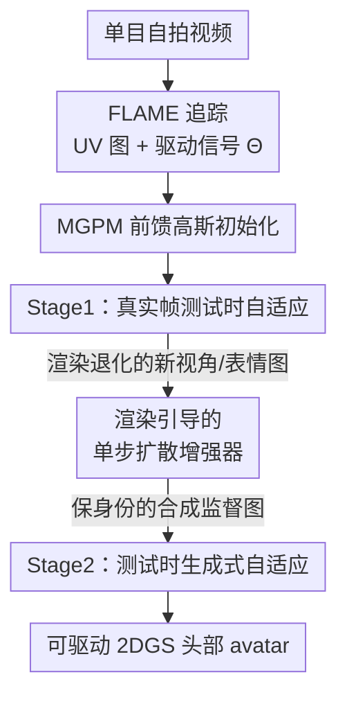

# ELITE: Efficient Gaussian Head Avatar from a Monocular Video via Learned Initialization and Test-time Generative Adaptation

**会议**: CVPR 2026  
**论文**: [CVF Open Access](https://openaccess.thecvf.com/content/CVPR2026/html/Youwang_ELITE_Efficient_Gaussian_Head_Avatar_from_a_Monocular_Video_via_CVPR_2026_paper.html)  
**代码**: [项目页](https://kim-youwang.github.io/elite)  
**领域**: 3D视觉  
**关键词**: 高斯头部avatar, 单目视频重建, 3D数据先验, 测试时自适应, 单步扩散增强

## 一句话总结
ELITE 从一段随手拍的单目视频里合成可驱动、照片级真实的 2D 高斯头部 avatar，核心是把"前馈 3D 数据先验初始化"与"渲染引导的单步扩散增强"耦合起来，让两类先验互补——前者给快速、保身份的初始化，后者补全没拍到的视角和表情，最终在画质和身份保持上超越现有方法，且比 2D 生成先验类方法快 60 倍。

## 研究背景与动机
**领域现状**：照片级的人头 avatar 是 VR/AR 远程临场、虚拟影视的基础组件。高保真重建传统上依赖标定好的多视角采集系统加上耗时的逐人优化，这对普通用户门槛太高。于是研究界转向更易获取的采集方式——比如手机自拍视频（单目）。但单目视频天生缺少多视角、多表情的观测，必须靠强先验来补。

**现有痛点**：目前补这块"缺失观测"有两条互不相通的技术路线，各有硬伤。一条是 **3D 数据先验**（如 HeadGAP、SynShot、Cao et al.）：在多视角采集数据集上训一个可泛化的先验模型，测试时从先验初始化 avatar 再做测试时自适应。但采集数据集规模难以扩大、测试时观测又有限，导致它在野外（in-the-wild）边缘场景上泛化差，比如长发、罕见表情；而且这类方法普遍不建模躯干肩膀、且闭源。另一条是 **2D 生成先验**（如 GAF、CAP4D）：用扩散模型生成未见视角/表情的人脸图当额外监督。泛化是改善了，但扩散从纯噪声出发，采样多步、慢（CAP4D 单张 18 秒、单人超过 6 小时），还会严重"幻觉身份"——生成的脸不像本人。

**核心矛盾**：3D 数据先验"快但泛化差"，2D 生成先验"泛化好但慢且会跑偏身份"，两者一直被当成相互独立的方向各自发展。

**切入角度**：作者观察到两者其实可以互补——(1) 3D 数据先验泛化差的毛病，可以用生成模型的合成图来补监督；(2) 2D 生成先验慢且幻觉的毛病，可以用 3D avatar 渲染图当"接地"（grounding）来缓解：与其从纯噪声生成，不如从一张已经有大致外观和几何的退化渲染图出发去增强。

**核心 idea**：系统性地把两类先验耦合起来——用前馈 3D 数据先验做快速保身份初始化，再用"以渲染图为条件的单步扩散增强器"补全缺失细节，并把增强出的合成图回灌做第二轮测试时自适应。

## 方法详解

### 整体框架
ELITE 的输入是一段随手拍的单目视频，输出是一个可被任意 FLAME 驱动信号驱动的 2D 高斯（2DGS）头部 avatar。整条管线是"先验初始化 → 真实帧自适应 → 生成增强 → 生成式自适应"的串行流程：先对视频做离线 FLAME 追踪拿到 mesh UV 图和逐帧驱动信号；前馈先验模型 MGPM 一次推理就给出初始 2DGS avatar；用视频里的真实帧微调（Stage 1），让 avatar 对齐到这个人；接着把 avatar 渲染到一些新视角/新表情下（这些渲染是退化的），用单步扩散增强器把它们"修干净"成保身份的监督图；最后把这些合成图和真实帧一起再微调一轮（Stage 2），让 avatar 泛化到没拍到的位姿、表情和视角。

### 关键设计

**1. MGPM 前馈高斯初始化：用一次推理把 mesh 翻译成可动的高斯 avatar**

3D 数据先验路线慢的根源在于每个新身份都要从头优化。ELITE 的对策是 Mesh2Gaussian Prior Model（MGPM）——一个前馈的 U-Net，输入是规范化 FLAME 的 UV 纹理图和几何图拼接 $[\mathbf{M}_\text{tex}, \mathbf{M}_\text{geo}] \in \mathbb{R}^{H\times W\times(3+3)}$，并通过 FiLM 层注入 FLAME 驱动信号 $\Theta=[\psi_\text{expr}, \theta_\text{jaw}, \theta_\text{eyes}, \theta_\text{neck}, \theta_\text{glob}, t]$（表情码、下巴/眼/颈关节、全局头部旋转、平移），输出一张 UV 对齐的 2DGS 参数图 $\mathbf{M}_{\text{gs}|\Theta}=\mathcal{F}_\phi([\mathbf{M}_\text{tex},\mathbf{M}_\text{geo}], \Theta)$。这张图 $\in\mathbb{R}^{H\times W\times 13}$，每个 UV 坐标 $(u,v)$ 上分通道存一个 2D 高斯的参数 $[\delta x, c, q, s, o]\in\mathbb{R}^{3+3+4+2+1}$——分别是相对模板网格表面的位置偏移、颜色、旋转、尺度、不透明度。

训练用的是多视角同步人脸采集数据集 NerSemble V2（约 400 个身份，含多样表情与视角）。把预测的 2DGS 用驱动信号和相机参数可微光栅化到图像空间，监督损失是 L1 光度损失加 LPIPS 感知损失，再加 2DGS 的几何正则（深度畸变损失 $\mathcal{L}_\text{depth}$、法向一致性损失 $\mathcal{L}_\text{normal}$）：$\mathcal{L}_\text{MGPM}=\mathcal{L}_{\ell 1}+\lambda_\text{lpips}\mathcal{L}_\text{LPIPS}+\lambda_\text{d}\mathcal{L}_\text{depth}+\lambda_\text{n}\mathcal{L}_\text{normal}$。这样 MGPM 学到了 identity/表情/视角条件下的形状与外观先验，测试时对未见身份"一次前馈"就能给出视觉合理的初始 avatar——这个好初始化正是后面测试时自适应又快又稳的前提。

**2. Stage1：真实帧测试时自适应——把通用先验微调成"这个人专属"**

MGPM 给的初始 avatar 虽然合理，但有缺细节、轻微身份漂移的问题。作者把原因归到训练集只有约 400 个身份、规模/多样性不足，且野外自拍视频和录影棚训练数据存在明显域差。Stage 1 的做法很直接：既然 MGPM 已经能从 mesh UV 图前馈出初始 avatar，那"测试时自适应"本质就是用观测到的视频帧去微调 MGPM 本身。

给定输入帧 $I_\text{real}$，先离线 FLAME 追踪得到规范 mesh UV 图和逐帧驱动信号，前馈得到初始 2DGS avatar，光栅化后用与训练相同的重建损失（Eq. 2）反传梯度，把通用先验 $\mathcal{F}_\phi$ 适配成身份专属先验 $\mathcal{F}^*_\phi$。为效率只采 $N_\text{real}=3$ 帧，学习率取 MGPM 训练阶段的 $0.05\times$。这一步主要解决"像不像本人"，让 avatar 在视频里见过的视角/表情上对齐到位。

**3. 渲染引导的单步扩散增强器：用退化渲染当条件，0.3 秒补全新视角细节**

Stage 1 后的 avatar 在见过的视角/表情上还行，但渲染到未见视角/表情时画质退化。这正是 2D 生成先验该补位的地方，但作者不想要 CAP4D 那种"从纯噪声全程去噪"的慢和幻觉。核心洞察是：退化的 avatar 渲染图虽然糊，但已经携带丰富的外观与几何，足以当生成模型的条件信号，而不必从纯噪声开始。于是把问题重述为"生成式图像增强"。

单步扩散增强器 $D_\xi$ 同时吃退化渲染 $I_\text{gen}\leftarrow\mathcal{F}^*_\phi([\mathbf{M}_\text{tex},\mathbf{M}_\text{geo}], \Theta_\text{rand})$（随机视角/表情渲染）和一张干净的输入帧参考图 $I_\text{real}$，去伪影、补细节，输出干净图 $I^\star_\text{gen}=D_\xi([I_\text{gen}, I_\text{real}])$。它基于单步图像翻译扩散模型 SD-Turbo 微调（思路受静态 3D 场景增强器 DIFIX 启发），训练用作者自制的三元组：退化 avatar 渲染、干净参考图、干净真值图。一个关键设计点是它要处理参考图和渲染图之间异质的视角/表情——单目场景下干净参考帧大多是正脸，而 avatar 渲染却横跨各种位姿表情。效果是：比全去噪方法快 60 倍（0.3 秒/张 vs CAP4D 18 秒/张），且身份保持显著更好（$\text{CSIM}=0.9725$ vs CAP4D 的 $0.5037$）。

**4. Stage2：测试时生成式自适应——把合成图回灌做第二轮微调**

光有增强出的图还不够，得让它们真正改进 avatar。Stage 2 把 $N_\text{gen}$ 张增强后的合成图 $\{I^\star_\text{gen}\}$ 加进测试时自适应数据集，用 $N_\text{real}+N_\text{gen}$ 张图再微调一轮先验模型 $\mathcal{F}^*_\phi\rightarrow\mathcal{F}^\star_\phi$。由于合成图是在采样好的视角和驱动信号下条件生成的，图像、相机参数、驱动信号天然精确对齐，可以直接像 Stage 1 那样前馈、光栅化、算重建损失。这一步专攻"泛化"：让 avatar 在没拍到的位姿/表情/视角上也保持高保真。最终得到的身份专属先验 $\mathcal{F}^\star_\phi$ 可以前馈地被任意 FLAME 驱动信号驱动，动画化目标身份的 2DGS avatar。

### 损失函数 / 训练策略
- **MGPM 预训练**：$\mathcal{L}_\text{MGPM}=\mathcal{L}_{\ell 1}+\lambda_\text{lpips}\mathcal{L}_\text{LPIPS}+\lambda_\text{d}\mathcal{L}_\text{depth}+\lambda_\text{n}\mathcal{L}_\text{normal}$，在 NerSemble V2 全部身份上训练。
- **测试时自适应（Stage 1 / Stage 2）**：复用同一套重建损失（Eq. 2），Stage 1 用 $N_\text{real}=3$ 真实帧、学习率为训练阶段 $0.05\times$；Stage 2 在此基础上加入 $N_\text{gen}$ 张增强合成图继续微调。
- **单步增强器**：在 SD-Turbo 基础上用"退化渲染 / 干净参考 / 干净真值"三元组微调（更多细节在补充材料）。

## 实验关键数据

实验在 NerSemble V2 上训练 MGPM，用 INSTA 数据集里的野外单目视频测试与对比。协议沿用 SynShot：只用 3 帧监督合成 avatar，排除最后 600 个测试帧；自重演（self re-enactment）用这 600 帧的驱动信号做定量评测，交叉重演（cross re-enactment）用其他序列的驱动信号。

### 主实验：INSTA 自重演对比

| 方法 | 类型 | 耗时 | PSNR ↑ | SSIM ↑ | LPIPS ↓ | CSIM ↑ |
|------|------|------|--------|--------|---------|--------|
| FlashAvatar | 过拟合 | 10 min | 20.875 | 0.8338 | 0.1420 | 0.5823 |
| SplattingAvatar | 过拟合 | 15 min | 24.838 | **0.8831** | 0.0893 | 0.6406 |
| CAP4D | 2D 生成先验 | 400 min | 19.478 | 0.8675 | 0.0992 | 0.7064 |
| **ELITE（本文）** | 双先验耦合 | 20 min | **25.220** | 0.8771 | **0.0732** | **0.7396** |

ELITE 在 PSNR、LPIPS、CSIM 上全面领先，SSIM 仅略低于 SplattingAvatar。值得注意的是身份保持指标 CSIM 上 ELITE 最高（0.7396），这对 avatar 个性化至关重要。INSTA 多为头部位姿变化小的说话视频，所以过拟合方法在指标上看着不错，但它们在未见视角/表情下会崩（见定性图）；CAP4D 虽画质强但单人要 6 小时以上、不实用。ELITE 在速度（20 分钟，接近过拟合方法）和保真度之间取得了好平衡。

### 生成图身份保持对比

| 方法 | 单张生成耗时 | 生成图 CSIM ↑ |
|------|------|--------|
| CAP4D（全去噪） | 18 s | 0.5037 |
| **ELITE（单步增强）** | **0.3 s** | **0.9725** |

CAP4D 从纯噪声生成，严重幻觉身份且慢；ELITE 以 avatar 渲染为锚的单步增强同时拿到高身份一致性和快速个性化，速度快 60 倍。

### 消融实验

| 配置 | 关键变量 | 结论 |
|------|---------|------|
| MGPM 训练身份数 | 334 IDs（最广） | 训练身份越多，自适应前后画质与泛化都更好 |
| 监督帧数 $N_\text{real}$ | 帧数增多 | 保真度提升但合成速度变慢（trade-off） |
| 模块逐个加 | MGPM → Stage1 → Stage2 | MGPM 给强初始化；Stage1 改善身份对齐；Stage2 带来高保真细节与泛化 |

### 关键发现
- **三个模块各司其职**：MGPM 负责"快且合理的初始化"，Stage 1（真实帧）负责"像本人"，Stage 2（合成图）负责"泛化到没拍到的视角/表情"。去掉任一环都会在对应维度退化。
- **速度优势来自"接地"而非"少算"**：ELITE 60× 提速的本质是把扩散从"纯噪声全去噪"换成"以退化渲染为条件的单步增强"，既快又因为有渲染锚点而不跑偏身份。
- **数据规模决定先验上限**：MGPM 训练身份从少到 334 单调改善质量，说明 3D 数据先验的泛化瓶颈确实在采集数据规模——这也正是引入 2D 生成先验来补的动机所在。

## 亮点与洞察
- **"两类先验互补"的系统性耦合**：以往 3D 数据先验和 2D 生成先验各自为政，ELITE 第一次把它们拧成一个闭环——3D 先验给生成模型一个保身份的"接地"图，生成模型反过来给 3D 先验补野外泛化的监督，互相弥补对方短板。
- **把"生成"重述为"增强"**：不从纯噪声出发，而是拿退化但已含外观/几何的 avatar 渲染当条件，单步扩散即可。这个视角转换同时解决了慢和幻觉两个问题，是可迁移到其他"3D 渲染 + 2D 生成监督"任务的通用思路。
- **测试时自适应 = 微调先验模型本身**：把"为某人定制 avatar"统一成"用真实帧/合成图微调 MGPM"，复用同一套重建损失，工程上干净；好初始化让微调既快又稳。

## 局限与展望
- **作者承认的局限**：对异常光照条件脆弱，未来可引入光照先验或材质纹理建模；目前不联合建模 avatar 与配饰（如眼镜），这是一个有价值的扩展方向。
- **自己发现的局限**：MGPM 训练依赖多视角录影棚采集数据（NerSemble V2 仅约 400 身份），数据规模是泛化上限的硬约束；合成图回灌做监督虽有效，但生成质量直接决定 Stage 2 上限，增强器在极端视角/表情下是否仍保身份缺少更系统的压力测试。
- **可改进思路**：把帧数 $N_\text{real}$、合成图数 $N_\text{gen}$ 做成自适应（按观测覆盖度动态决定要补多少视角），或在 Stage 2 引入对生成图的置信度加权，避免低质合成图污染先验。

## 相关工作与启发
- **vs 过拟合方法（FlashAvatar / SplattingAvatar）**：它们从模板网格锚定的 3D 基元从头优化、只用视频帧监督，每个新身份都要单独优化，缺少身份相关初始化，难泛化到复杂视角/未见表情。ELITE 有前馈学习初始化 + 合成图监督，泛化与完整性（含躯干）都更好。
- **vs 3D 数据先验方法（HeadGAP / SynShot / Cao et al.）**：它们有学习初始化但只用视频帧监督，野外边缘场景（长发、罕见表情）泛化差，且不建模躯干、闭源。ELITE 用 2D 生成先验补监督，缓解了泛化短板。
- **vs 2D 生成先验方法（GAF / CAP4D）**：它们从头优化 avatar、用多步扩散从纯噪声生成监督图，慢（CAP4D 单人 6 小时以上）且严重幻觉身份。ELITE 用学习初始化 + 以渲染为条件的单步增强，快 60 倍、CSIM 从 0.5037 提到 0.9725。

## 评分
- 新颖性: ⭐⭐⭐⭐⭐ 把两类长期割裂的先验耦合成互补闭环，并将"生成"重述为"以渲染为条件的单步增强"，视角新颖且自洽。
- 实验充分度: ⭐⭐⭐⭐ 主对比 + 身份保持 + 三组消融较完整，但部分对手（SynShot）因闭源只能比定性，野外评测集（INSTA）位姿变化偏小。
- 写作质量: ⭐⭐⭐⭐⭐ 动机推导清晰（先验互补的逻辑链很顺），图示与分阶段叙述到位。
- 价值: ⭐⭐⭐⭐⭐ 在保真度与速度间找到实用甜点（20 分钟级、快 60×），对单目可动 avatar 落地有直接意义。

<!-- RELATED:START -->

## 相关论文

- [\[CVPR 2026\] OMG-Avatar: One-shot Multi-LOD Gaussian Head Avatar](omg-avatar_one-shot_multi-lod_gaussian_head_avatar.md)
- [\[CVPR 2026\] Anatomical Domain Shifts: Test-time Heterogeneous Adaptation for 3D Human Pose Prediction](anatomical_domain_shifts_test-time_heterogeneous_adaptation_for_3d_human_pose_pr.md)
- [\[CVPR 2026\] Feed-forward Gaussian Registration for Head Avatar Creation and Editing](feed-forward_gaussian_registration_for_head_avatar_creation_and_editing.md)
- [\[NeurIPS 2025\] PointMAC: Meta-Learned Adaptation for Robust Test-Time Point Cloud Completion](../../NeurIPS2025/3d_vision/pointmac_meta-learned_adaptation_for_robust_test-time_point_cloud_completion.md)
- [\[CVPR 2026\] ZipMap: Linear-Time Stateful 3D Reconstruction via Test-Time Training](zipmap_linear-time_stateful_3d_reconstruction_via_test-time_training.md)

<!-- RELATED:END -->
