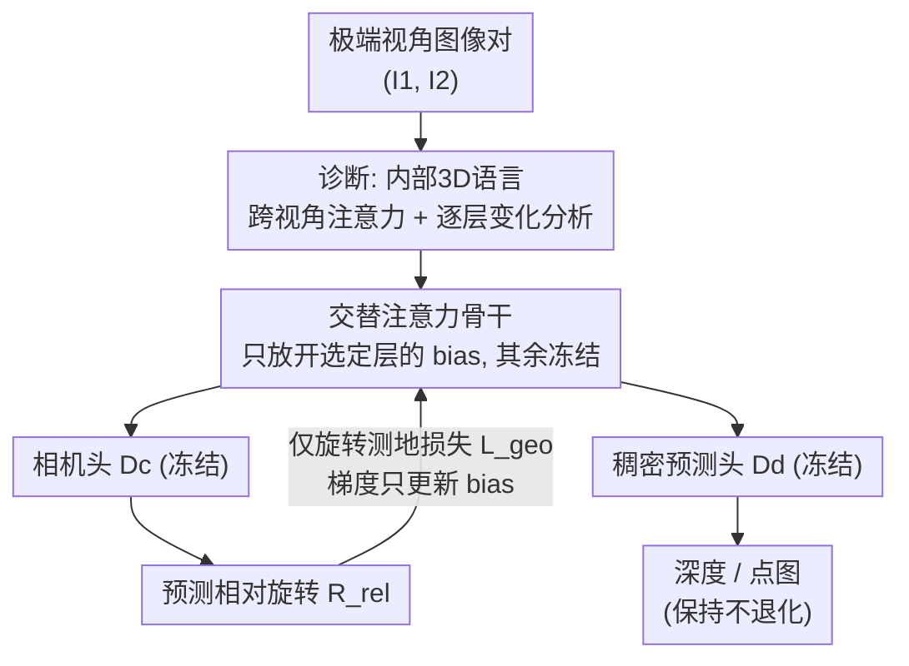

# Emergent Extreme-View Geometry in 3D Foundation Models

**会议**: CVPR 2026  
**论文**: [CVF Open Access](https://openaccess.thecvf.com/content/CVPR2026/html/Zhang_Emergent_Extreme-View_Geometry_in_3D_Foundation_Models_CVPR_2026_paper.html)  
**代码**: 无（项目页 https://ext-3dfms.github.io/ ）  
**领域**: 3D视觉  
**关键词**: 3D基础模型, 极端视角, 相对位姿估计, 偏置微调, 注意力分析  

## 一句话总结
作者发现像 VGGT 这类 3D 基础模型（3DFM）虽然只在有重叠的图像上训练，却"涌现"出了对极端/无重叠视角的几何理解，并据此提出只调骨干网络中约 8 万个偏置参数（冻结所有解码头）的轻量对齐方案，把无重叠图像对的中位旋转误差从 42.4°降到 13.1°，同时不损害深度和点图质量。

## 研究背景与动机

**领域现状**：传统三维视觉建立在一个"舒适假设"上——我们能拿到对场景密集采集、彼此大量重叠的图像，于是可以靠匹配像素、追踪特征、三角化点来恢复结构。近来的 3D 基础模型（3DFM，如 DUSt3R、VGGT、π³、WorldMirror）更进一步，用一个共享 backbone 在单次前向里同时回归相机位姿、深度和点图，彻底绕开了显式对应点估计。

**现有痛点**：但这些 3DFM 几乎都是在"有重叠/视角平滑变化"的数据上训练和评测的。而真实场景里——手机随手拍、历史档案、游客照集合——图像往往稀疏、视角之间几乎没有视觉重叠。这种"极端视角"下经典管线（特征匹配 + RANSAC）会直接崩，而 3DFM 在这种条件下的真实能力几乎没人研究过。

**核心矛盾**：极端视角没有可匹配的对应点，按理说位姿无从估计；可作者观察到一个反直觉现象（图 1）：把只见过重叠图像的预训练 VGGT 直接喂无重叠图像对，它竟然仍能给出"像样"的相对位姿，近一半图像对的旋转误差能压到 30°以内。这说明模型内部学到的东西远超出"显式像素对应"，但这种隐含能力既没被理解、也没被激发出来。

**本文目标**：(1) 搞清 3DFM 的共享 backbone 里到底编码了什么、是这种涌现能力的来源吗；(2) 在不破坏预训练多任务能力（深度/点图）的前提下，把这种极端视角能力进一步放大；(3) 提供一个未被现有 3DFM 见过的、专门评测极端视角的基准。

**切入角度**：作者提出一个关键假设——3DFM 的共享 backbone 里结晶出了一种"内部 3D 语言"（一种学到的几何表征），而各个解码头只是把这种语言"翻译"成显式的深度/点图/位姿。如果这个假设成立，那么要增强极端视角能力，就应该去对齐这门"内部语言"（即调 backbone），而不是去重训解码头。

**核心 idea**：冻结所有解码头，只用一个仅旋转的测地损失，去微调 backbone 中"选定层的偏置项"——用四个数量级更小的参数量（≈80k vs 十亿级）对齐内部 3D 表征，让极端视角位姿大幅变好而深度/点图不退化。

## 方法详解

### 整体框架
方法分两步走：先**诊断**再**对齐**。诊断阶段（§3.1）通过可视化 3DFM 共享交替注意力（Alternating Attention, AA）backbone 的跨视角注意力图，以及逐层分析"哪些层的表征变化最大"，论证"3D 语言确实编码在 backbone 而非解码头里"。对齐阶段（§3.2）据此设计一个极简的微调方案：输入一对极端视角图像 $(I_1, I_2)$，经过 AA backbone 得到 token，再由相机头 $\mathcal{D}_c$ 读出相对旋转；训练时**只对相机头施加一个仅旋转的测地损失**，并且**只更新 backbone 中选定层的偏置项**，相机头和稠密预测头 $\mathcal{D}_d$ 全程冻结。这样既校准了内部表征对极端视角的鲁棒性，又因为没碰解码头、没碰稠密监督，保住了深度/点图能力。

### 关键设计

**1. 揭示 3DFM 的"内部 3D 语言"：注意力图 + 逐层分析两条证据**

要支撑"调 backbone 而非调头"这个决定，作者先得证明几何表征确实住在 backbone 里。第一条证据是跨视角注意力图（图 2）：在 AA backbone 最后一层（跨视角信息已充分融合），取 $I_1$ 上某个 query 区域的向量 $q$，与 $I_2$ 全部 key 做注意力并对所有头求和，得到 $A_h^{(l)} = \mathrm{softmax}(QK^\top/\sqrt{d_h})$。结果显示：对有重叠区域，高注意力精确落在 $I_2$ 的对应位置（说明会找对应点）；对**无重叠**区域，注意力会落到"3D 世界里空间上最接近"的图像角落，呈现一种"近邻对应"理解；连根本没有近邻对应的 query，模型也学会去关注**对称性线索**（如拱门整体的弧度、装饰细节）。这说明 backbone 编码的远不止显式像素对应，而是一种隐含的空间关系/深度/位姿表征，解码头只是"格式转换器"。第二条证据是逐层分析：度量相邻 backbone 层之间的表征变化幅度，发现只有一小撮层变化显著，且这些层恰好与稠密预测头相连的跳连层重合——这直接告诉作者"该去微调哪些层"。

**2. 仅旋转的测地对齐目标：用稀疏监督唤醒密集表征**

痛点是：训练这些 3DFM 原本需要逐点的稠密标注，代价高；而极端视角下真正难的、也最值得修的是旋转。作者因此只用一个跨架构统一的仅旋转目标：

$$\mathcal{L} = \mathcal{L}_{\mathrm{geo}}\!\left(\mathbf{R}_{\mathrm{rel}}^{\mathrm{pred}}, \mathbf{R}_{\mathrm{rel}}^{\mathrm{gt}}\right) + \mathbb{1}_{a}\,\mathcal{L}_{\mathrm{geo}}\!\left(\mathbf{R}_{1}^{\mathrm{pred}}, \mathbf{I}\right)$$

其中相对旋转 $\mathbf{R}_{\mathrm{rel}}^{\mathrm{pred}} = \mathbf{R}_{2}^{\mathrm{pred}}(\mathbf{R}_{1}^{\mathrm{pred}})^\top$，$\mathcal{L}_{\mathrm{geo}}$ 是测地损失，度量 SO(3) 流形上两个旋转矩阵的最小角距离（即评测用的 $\arccos(\tfrac{1}{2}(\mathrm{tr}(\mathbf{R}_{\mathrm{pred}}^\top\mathbf{R}_{\mathrm{gt}})-1))$）。指示函数 $\mathbb{1}_a$ 控制是否启用"锚定项"：对假设固定参考系的架构（如 VGGT），强制第一张图对齐世界坐标系（$\mathbb{1}_a=1$）；对置换不变架构（如 π³），$\mathbb{1}_a=0$，损失退化为对称的相对旋转项。关键点在于：这种监督信号比逐点稠密标注稀疏得多，却足以"唤醒"backbone 里已有的密集几何表征——它不是在教模型新东西，而是在对齐已有的内部语言。

**3. 选定层 + 仅偏置的最小化微调：既改 backbone 又不让它过拟合**

仅旋转监督只作用在相机头上，会破坏头之间的几何一致性、连累依赖稠密输出的下游任务（实验里确实如此）。作者的解法是把"可训练的范围"压到极致：沿两个维度收缩——(1) 只动设计 1 里找出的那一小撮"变化显著"的层（layer-only, LO）；(2) 每层只更新**偏置项**（bias-only, BO），权重全冻结（前人已证明 Transformer 里 bias-only 微调常可媲美全量微调）。最终只更新约 80k 个参数（比全模型小四个数量级），在约 65k 个图像对上训练 2 个 epoch 即可。尤其要强调**解码头必须全冻结**：消融显示，一旦放开相机头，深度-位姿的预训练一致性就被打破，融合后的稠密重建会暴跌（VGGT 上从 +9.2% 改善变成 −90.3% 退化），所以"只改 backbone 偏置、绝不碰头"是这套方案保住多任务能力的命门。

**4. MegaUnScene 基准：给 3DFM 第一个"没见过"的极端视角考场**

现有 in-the-wild 数据集（MegaDepth、WikiScenes、MegaScenes、AerialMegaDepth）大多被拿去训练过、且没有专门的稠密预测测试划分，无法公平评测 3DFM 的泛化。作者据此构建 MegaUnScene：469 个现有 3DFM 未见过的互联网场景（用图像/场景名交叉核验排除 MegaScenes 重叠），重建管线用 Doppelgangers++ 消歧 + MASt3R-SfM 做更鲁棒的成对位姿。它含三个测试集：**UnScenePairs**（以旋转运动为主，K=5 近邻图，3854 对含 776 无重叠）、**UnScenePairs-t**（更大平移基线，K=50，2398 对含 756 无重叠，并用 MASt3R 匹配核验 None/Large/Small 重叠标签）、**UnSceneRecon**（100 个带米制尺度标注的稠密重建，人工借 Google Maps 距离定标尺）。

### 损失函数 / 训练策略
唯一训练损失就是上面的仅旋转测地损失（VGGT/WM 用锚定项，π³ 不用）。训练数据沿用 Bezalel 等人（ExRot）的方法，从 MegaScenes 的场景级 COLMAP 重建里采图像对，并刻意纳入比 ExRot 更大平移的对，以便泛化到带相机平移的情形。可训练参数视配置而定，最优配置（LO+BO）仅 0.07M。

## 实验关键数据

### 主实验：极端相对旋转估计（无重叠图像对）
指标为中位旋转误差 MRE（越低越好）和阈值 15°/30°下的相对旋转精度 RA15/RA30（越高越好）。下标 FT 为微调后版本，ExRot 是此前的 in-the-wild SOTA。

| 方法 | sELP MRE↓ | UnScenePairs MRE↓ | UnScenePairs-t MRE↓ | UnScenePairs-t RA30↑ |
|------|-----------|-------------------|----------------------|----------------------|
| ExRot | 13.23 | 28.48 | 42.45 | 43.8 |
| VGGT | 92.92 | 31.64 | 46.65 | 42.1 |
| **VGGT_FT** | 14.21 | **12.71** | **14.48** | **62.1** |
| WM | 68.96 | 19.25 | 21.52 | 57.4 |
| **WM_FT** | **9.74** | **11.75** | **13.13** | **64.5** |
| π³ | 45.24 | 17.66 | 21.62 | 56.8 |
| **π³_FT** | 11.96 | 12.92 | 13.31 | 65.5 |

三个 3DFM 微调后在所有测试集上一致大幅改善，刷新极端旋转 SOTA。一个有趣观察：预训练模型在不同测试集上方差极大（VGGT 在 sELP 92.92 vs UnScenePairs 31.64），原因是它们在以地标为中心的 MegaDepth 上预训练，不像 sELP 那种"前行、低视差"的轨迹；而微调后即使只用地标数据也把这个 gap 抹平了，说明泛化变好。摘要里强调的几组提升：sELP 13.2°→9.7°、in-the-wild 带/不带平移 42.4°→13.1°、28.4°→11.7°。

### 保持预训练能力：多视角位姿 + 稠密重建
微调只用旋转损失、只在图像对上训练，但要验证它没毁掉多视角和稠密能力。

| 任务/数据 | 指标 | VGGT | VGGT_FT |
|-----------|------|------|---------|
| ETH3D 多视角 | TA30↑ | 87.01 | **94.70** |
| ETH3D 多视角 | AUC30↑ | 72.52 | **79.30** |
| UnSceneRecon 重建 | ACC↓(均值) | 1.441 | **1.291** |
| ETH3D 重建 | ACC↓(均值) | 0.284 | **0.233** |

VGGT 作为最弱的初始模型，微调后在多视角和稠密重建上都拿到最大增益（说明"提升空间最大者获益最多"）；WM/π³ 本就强、接近天花板，多为持平或小幅波动。π³ 稠密重建出现轻微退化，作者归因于它缺少 VGGT/WM 那样的专用逐帧相机 token，相机信息被摊到所有图像 token 上，微调极端旋转时更易扰动内部语言。

### 消融实验（VGGT，△ROT 在 UnScenePairs、△REC 在 UnSceneRecon）

| 配置 | △ROT | △REC(融合) | #Params | 说明 |
|------|------|-----------|---------|------|
| 只调相机头 Dc | +6.8% | 0.0% | 216.2M | 头冻 backbone 不动，反而变差 |
| 放开 backbone+Dc | −74.3% | **+90.3%** | 820.9M | 旋转好但稠密重建暴跌 |
| 只放开 backbone(AA) | −69.8% | −9.2% | 604.7M | 旋转好且重建改善 |
| AA + LO+BO（最终） | −59.8% | −12.4% | **0.07M** | 选层+仅偏置，最佳权衡 |

### 关键发现
- **backbone 必须解冻**：只调相机头几乎无效（VGGT 甚至变差），因为冻结的 backbone 喂给稠密头的特征完全没变——证明 3D 表征整个住在 backbone 里。
- **相机头必须冻结**：放开它会破坏深度-位姿一致性，融合稠密重建从 +9.2% 改善变 −90.3% 退化。
- **选层 + 仅偏置是最佳权衡**：对已经很强的 WM，全量微调只换来边际旋转增益却明显伤重建（过拟合）；而 LO+BO 用 0.07M 参数拿到 39.0% 旋转误差下降、重建几乎不变（+2.9%）。
- **平移仍是难点**：旋转大幅改善，但中位平移误差仅从 37.28°微降到 35.79°，大平移位移本质上仍难，是未来方向。

## 亮点与洞察
- **"涌现 + 对齐"的研究范式很漂亮**：先用注意力可视化坐实"模型早就会、只是没被唤醒"，再用最小代价去对齐而非重训。这种"诊断驱动设计"的思路（逐层分析直接告诉你该调哪几层）可迁移到任何想低成本激发预训练模型隐藏能力的场景。
- **80k 参数撬动十亿级模型**：把可训练范围沿"哪些层 × 哪些参数"两个维度同时收缩到偏置，是极致 PEFT 在 3D 几何上的一次成功示范——稀疏的旋转监督足以对齐密集的几何表征。
- **"冻结解码头"是保多任务的命门**：一个反直觉但被消融钉死的结论——想保住深度/点图，恰恰不能去碰相机头，只能改 backbone 的内部语言。
- **基准的"未见性"设计**：MegaUnScene 刻意排除训练用过的场景、并提供专门的稠密测试划分和米制尺度，补上了"3DFM 在真正没见过的极端视角上到底行不行"这块评测空白。

## 局限与展望
- **平移估计提升有限**（作者承认）：大平移基线下视差挑战大，仅旋转监督帮不上多少，整位姿监督也没改善——这是方法的真实天花板。
- **只用地标中心数据训练**：训练对来自 MegaScenes 的地标场景，对非地标、强动态或纹理极端贫乏（平整涂漆面）的场景泛化性未充分验证。
- **架构依赖性**：π³ 因缺专用相机 token，稠密重建出现退化，说明该方案对"相机信息如何在 token 中组织"敏感，并非对所有 3DFM 一视同仁。
- **改进思路**：把对齐目标从仅旋转扩到"旋转 + 稀疏平移线索"，或为缺相机 token 的架构补一个轻量位姿读出模块，可能同时救平移和 π³ 这类模型。

## 相关工作与启发
- **vs ExRot（Bezalel 等）**：ExRot 为极端旋转任务专门设计框架并扩展到 in-the-wild，但在极端真实图像对上性能仍有限；本文不另起炉灶，而是直接把通用 3DFM 的几何表征对齐成对极端视角鲁棒，且一套方案适配 VGGT/WM/π³ 三种架构。
- **vs 头部微调类方法（如 Doppelgangers++ 思路下的 head-only 适配）**：以往常冻结共享 backbone、只微调头；本文反其道而行——只改 backbone（且只改偏置）、冻结所有头，并实验证明这才是在不损害其他 3D 任务前提下显著提升极端视角的正确做法。
- **vs 经典 SfM/MVS 与学习型匹配器**：经典管线和 SuperGlue 类匹配器都依赖视觉重叠，宽基线/无重叠下退化；3DFM 绕开显式对应、本文进一步把它推到极端视角域。

## 评分
- 新颖性: ⭐⭐⭐⭐⭐ "涌现能力诊断 + 偏置级对齐"的组合视角新颖，且把 PEFT 思路成功落到 3D 几何表征对齐上
- 实验充分度: ⭐⭐⭐⭐⭐ 三个 3DFM × 多基准（极端旋转/多视角/稠密重建）+ 双维度消融 + 新基准，论证链完整
- 写作质量: ⭐⭐⭐⭐ "内部 3D 语言"叙事清晰、图证有力；部分实现细节（选层标准、训练数据构造）甩到补充材料
- 价值: ⭐⭐⭐⭐⭐ 揭示 3DFM 未被开发的极端视角潜力，给出可复用的低参数对齐范式和一个真正未见的评测基准

<!-- RELATED:START -->

## 相关论文

- [\[CVPR 2026\] Emergent Outlier View Rejection in Visual Geometry Grounded Transformers](emergent_outlier_view_rejection_in_visual_geometry_grounded_transformers.md)
- [\[CVPR 2026\] Foundry: Distilling 3D Foundation Models for the Edge](foundry_distilling_3d_foundation_models_for_the_edge.md)
- [\[CVPR 2026\] Towards Foundation Models for 3D Scene Understanding: Instance-Aware Self-Supervised Learning for Point Clouds](towards_foundation_models_for_3d_scene_understanding_instance-aware_self-supervi.md)
- [\[CVPR 2026\] 3D-IDE: 3D Implicit Depth Emergent](3d-ide_3d_implicit_depth_emergent.md)
- [\[CVPR 2026\] AVA-Bench: Atomic Visual Ability Benchmark for Vision Foundation Models](ava-bench_atomic_visual_ability_benchmark_for_vision_foundation_models.md)

<!-- RELATED:END -->
