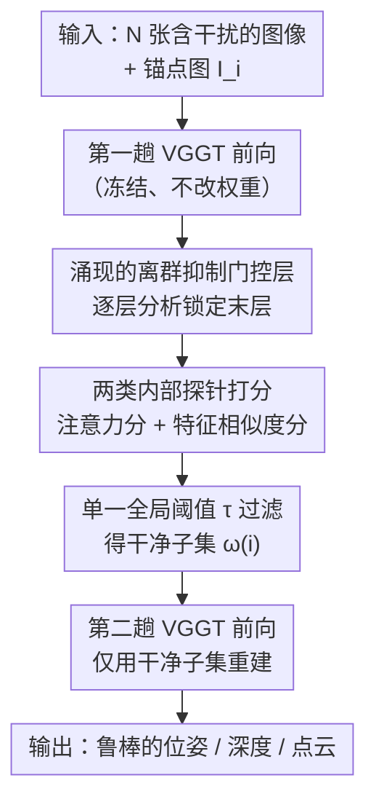

# Emergent Outlier View Rejection in Visual Geometry Grounded Transformers

**会议**: CVPR 2026  
**论文**: [CVF Open Access](https://openaccess.thecvf.com/content/CVPR2026/html/Han_Emergent_Outlier_View_Rejection_in_Visual_Geometry_Grounded_Transformers_CVPR_2026_paper.html)  
**代码**: https://cvlab-kaist.github.io/RobustVGGT （项目页）  
**领域**: 3D视觉  
**关键词**: 前馈式三维重建、离群视图剔除、涌现特性、VGGT、免训练  

## 一句话总结
作者发现前馈式三维重建模型 VGGT 在没有任何离群监督的情况下，其**末层的注意力/特征表示天然会压低无关的干扰视图**，于是直接用这些内部信号给每张视图打分、单一全局阈值过滤掉干扰图再重建，得到一套零参数、免训练的 RobustVGGT，在含噪的真实图像集合上稳定优于各种检索式预过滤基线。

## 研究背景与动机
**领域现状**：以 VGGT、DUSt3R、Pi3 为代表的前馈式三维重建模型，把一组图片一次性喂进 transformer，直接回归相机位姿、深度和点云，绕开了传统 Structure-from-Motion（SfM）里逐步迭代的特征匹配与捆绑调整，速度快、在精选 benchmark 上表现强。

**现有痛点**：真实世界的图像集合（比如用「自由女神像」做关键词搜来的网络图）常混入大量**干扰图（distractor）**——和主场景几乎没有视图重叠的无关照片、遮挡帧、瞬态物体。传统 COLMAP 这类 SfM 有几何验证、对极一致性检查、RANSAC 离群剔除等多级过滤，对脏数据天然鲁棒；但前馈模型**根本没有显式的视图过滤机制**，干扰图会一路穿过 pipeline，污染位姿估计、让重建几何出现明显伪影。

**核心矛盾**：前馈模型确实预测了 per-point 置信度，但它是**点级别、事后（post-hoc）**的信号——它只能下调单个 3D 点的权重，没法把一整张干扰**视图**剔除出去，系统仍然会去重建所有图像，污染照样发生。要补回鲁棒性，最直接的想法是在重建前用视觉位置识别（VPR）/检索做预过滤，但这类方法往往要逐场景调超参，且检索相似度反映的是「外观像不像」而不是「几何上能不能对上」，跨数据集泛化差。

**本文目标**：在**不重新训练、不改架构、不引入任何额外监督**的前提下，给前馈式三维重建补上「识别并丢弃无关视图」的能力。

**切入角度**：作者做了一个反直觉的观察——VGGT 虽然没被显式训练去做离群剔除，但为了优化多视图几何一致性，它内部可能**已经隐式学会了区分干扰视图**。于是逐层探针分析：测量「干净视图对」和「干净-干扰视图对」之间的注意力/特征相似度差距（gap）随网络深度的变化。

**核心 idea**：把 VGGT 自己内部表示里**涌现（emergent）的离群抑制信号**直接拿来当过滤器——找到那一层「几何门控」，用它的注意力分或特征相似度分给视图排序，单一固定阈值砍掉低分视图，再二次前向重建。

## 方法详解

### 整体框架
RobustVGGT 不训练、不改 VGGT 任何权重，它做的是「**先跑一遍 VGGT 探出每张图的相关性 → 阈值过滤 → 用干净子集再跑一遍 VGGT**」的两趟流程。给定 $N$ 张未标定图像 $\{I_1,\dots,I_N\}$，对任意一张作为锚点（query）的图像 $I_i$，目标是选出一个干净的上下文子集 $\{I_j\}_{j\in\omega(i)}$，再把这个子集重新喂回 VGGT 得到最终的位姿 $P_i$、深度 $D_i$、点云 $X_i$。

整套方法的关键不在「怎么过滤」（过滤本身就是一个阈值），而在**「过滤信号从哪来」**：作者先用一组逐层分析锁定 VGGT 中那个天然具备离群抑制能力的层（实验表明是**最后一层**），再从该层取两类内部信号——跨视图注意力、稠密特征相似度——构造打分函数。

### 关键设计

**1. 锁定「涌现的离群抑制门控层」：逐层分析定位末层**

痛点是：VGGT 是个黑盒，就算它真有隐式过滤能力，也不知道这能力藏在哪一层、强不强。作者把 VGGT 的交替注意力（alternating attention，由 frame-wise 与 global attention 交替组成）栈拆开，对每一层都构造同一个探测实验：喂进一张 query 图 + 一组混了干净和干扰的上下文图，分层测量两个量——（i）query 分给每张上下文图的注意力权重；（ii）query 特征图与每张上下文特征图的逐像素余弦相似度（在 $\ell_2$ 归一化特征上算、再按像素平均成一个标量）。对每一层分别报告「干净对」的平均分、「干扰对」的平均分以及二者之差（gap = clean − distractor）。

结论很干净：**早期层几乎区分不出干净和干扰（gap 接近 0），gap 随深度稳步增大，并在最后一层达到峰值**；特征探针给出的分离度甚至比注意力探针更大，说明末层特征是更强的「几何相关性判别器」。这意味着最后一层就是那扇区分「与场景几何一致 / 不一致」的门，而且这种行为**完全没有离群监督**，纯粹是优化多视图几何一致性时涌现出来的副产物。可视化也印证：末层里无关帧（非主场景、严重遮挡）拿到低注意力 + 弱特征相似度，几何一致视图则高度激活。这一步是整篇论文的地基——它把「黑盒里有信号」变成「就用第 $L$（末）层这个具体抓手」。

**2. 两类内部探针打分：注意力分与特征相似度分**

锁定末层 $L$ 之后，针对锚点图 $I_i$，对每张上下文图 $I_j$ 算一个相关性分 $r_{i\to j}$，作者给出两种互补的探针。

注意力分 RobustVGGT-A：取末层多头平均后的注意力 $A^{(\ell_L)}$，把锚点 $I_i$ 对 $I_j$ 的注意力在所有 token 上简单求平均：

$$r^{\text{att}}_{i\to j} = \frac{1}{HW}\sum_{u,v} A^{(\ell_L)}_{i\to j}(u,v),$$

其中 $u,v$ 是 2D 空间位置。直觉是：如果 $I_j$ 和 $I_i$ 几何上能对上，VGGT 在做跨视图推理时自然会把更多注意力分给它。

特征相似度分 RobustVGGT-F：取末层的稠密特征图 $F^{(\ell_L)}_i, F^{(\ell_L)}_j \in \mathbb{R}^{H\times W\times d}$，先在 $\ell_2$ 归一化特征上算逐像素相关图 $C_{i\to j}(u,v)=\tilde F^{(\ell_L)}_i(u)\cdot \tilde F^{(\ell_L)}_j(v)$，再对整张 $HW\times HW$ 相关图做空间平均：

$$r^{\text{feat}}_{i\to j} = \frac{1}{HW}\sum_{u,v} C_{i\to j}(u,v),$$

即两张图特征的平均余弦相似度。和检索式方法（NetVLAD / DINOv3 全局描述子）的本质区别在于：那些描述子是被「外观/语义」训练出来的，会把「长得像」的图聚到一起，却对「几何上有没有重叠」无感，所以长得像但不重叠的干扰图过滤不掉（实验里 DINOv3 的剔除成功率几乎为 0）；而 VGGT 的内部信号来自跨视图几何推理，捕捉的是「能不能对上」，这正是离群剔除真正需要的判据。

**3. 单一全局阈值过滤 + 二次前向重建：免训练落地**

有了分数，剔除就是一步硬阈值。上下文子集定义为

$$\omega(i) = \{\, j \mid j=i \ \text{或}\ r^{O}_{i\to j} \ge \tau^{O} \,\},\quad O\in\{\text{att}, \text{feat}\},$$

低于阈值的视图被丢掉。关键卖点是 $\tau^O$ 是**一个跨所有 benchmark 共享的固定全局值**（消融定出 RobustVGGT-A 用 $\tau=0.05$、RobustVGGT-F 用 $\tau=0.65$），不需要像 VPR 那样逐场景调参，也不需要预先知道干净图的数量。过滤完把干净子集 $\{I_j\}_{j\in\omega(i)}$ 重新喂回同一个 VGGT，得到只基于几何一致视图的 $(P_i, D_i, X_i, C_i)$。整个过程零新增参数、零监督、零微调，只多花一趟前向，几乎不损失前馈式重建的效率优势。

### 一个完整示例
以「自由女神像」关键词搜来的一批图为例：里面混着大量背景不同、视角不重叠的干扰照。直接喂 VGGT（基线），干扰图被一并重建，位姿被带偏，点云出现飘散的伪影。换成 RobustVGGT：第一趟前向后，取末层注意力/特征对锚点图打分——主场景的几张图拿到高分，无关照拿到明显低于 $\tau$ 的分，被一刀切掉；只留下几何一致的子集再跑第二趟，最终轨迹和深度都干净稳定。整个过程没有任何针对这张「自由女神像」场景的调参，阈值和别的数据集完全一样。

## 实验关键数据

### 主实验
评测设定：作者首次提出在**受控噪声水平**下评测前馈式重建——每次采样 $N_c=30$ 张同场景干净图，再从别的场景采 $N_n\in\{10,30,50\}$ 张干扰图（Small/Medium/Large），共 $\{40,60,80\}$ 张，每个设定换 10 个随机种子取均值。数据集覆盖 Phototourism、On-the-Go、RobustNeRF、ETH3D。任务为多视图位姿估计与多视图深度估计。

相机位姿估计（ATE / RPEtrans / RPErot，越低越好；下表为 Phototourism 的 Avg 列）：

| 方法 | ATE↓ | RPEtrans↓ | RPErot↓ |
|------|------|-----------|---------|
| MASt3R-SfM | 1.2856 | 2.3987 | 11.8354 |
| VGGT（基线，无过滤） | 0.3504 | 0.5172 | 1.1732 |
| MegaLoc + VGGT | 0.2965 | 0.4412 | 0.9809 |
| DINOv3 + VGGT | 0.3504 | 0.5315 | 1.1735 |
| **RobustVGGT-A** | 0.2818 | 0.4199 | 0.8945 |
| **RobustVGGT-F** | **0.2650** | **0.3953** | **0.8403** |

关键观察：基线 VGGT 随噪声从 Small→Large 单调变差（干扰越多越糟），而 RobustVGGT-F 几乎对噪声水平不敏感（Small 0.2641 / Large 0.2664），说明过滤真的把干扰挡在了重建之外。DINOv3+VGGT 形同没过滤（分数和裸 VGGT 几乎一样），印证「外观描述子干不了几何过滤这活」。

多视图深度估计（AbsRel↓、$\delta<1.25$↑）呈现同样趋势：无过滤的 VGGT / MASt3R-SfM 随干扰引入而退化，RobustVGGT-A/F 在所有噪声水平上最好。

### 消融实验
干扰剔除成功率（Success rate，越高越好，4 数据集 Average）：

| 数据集 | MegaLoc | DINOv3 | RobustVGGT-F | RobustVGGT-A |
|--------|---------|--------|--------------|--------------|
| Phototourism | 0.521 | 0.000 | 0.841 | **0.890** |
| On-the-Go | 0.425 | 0.261 | **0.936** | 0.884 |
| RobustNeRF | 0.104 | 0.014 | 0.586 | **0.641** |
| ETH3D | 0.298 | 0.034 | **0.985** | 0.914 |

阈值敏感性（Tab. 3）：RobustVGGT-A 在 $\tau=0.05$、RobustVGGT-F 在 $\tau=0.65$ 取得最佳，且这组值在 Phototourism 与 On-the-Go 上同时最优，因此被定为所有评测共享的全局阈值。

### 关键发现
- **末层是关键门控**：注意力/特征的 clean-distractor gap 随深度增大、末层峰值，特征探针分离度更强——这是整套方法成立的根因。
- **VGGT 内部信号完胜外观检索**：DINOv3 全局描述子剔除成功率近乎 0，因为它按「外观相似」聚类、对几何重叠无感；VGGT 的跨视图推理捕捉的是几何能否对上，这才是离群剔除需要的判据。
- **A 与 F 互补**：注意力分在 Phototourism/RobustNeRF 更稳，特征分在 On-the-Go/ETH3D 更强；二者各擅胜场但都远超基线。

## 亮点与洞察
- **「不造新模块，去挖现成模型里的涌现能力」**：本文最「啊哈」的点是把一个完全没为过滤训练过的模型，靠逐层探针找到它隐式学到的几何门控，零成本变成鲁棒重建器——这是把可解释性分析直接转化成实用能力的漂亮案例。
- **单一全局阈值的工程价值**：跨 4 个差异很大的数据集共享同一阈值就能稳定工作，省掉了 VPR 系最头疼的逐场景调参，部署极简。
- **可迁移思路**：这套「逐层测干净/干扰 gap → 锁定门控层 → 取内部信号当判据」的探针范式，可以平移到别的前馈几何模型（Pi3、DUSt3R）甚至别的「需要剔除离群输入」的多视图任务；作者还指出 VGGT 式视图选择可以反过来给检索结果重排，做「几何感知的位置识别」。

## 局限与展望
- 作者承认：在 RobustNeRF 上 MASt3R-SfM 的 ATE 反而低于本文方法，说明在某些受控干扰场景下显式 SfM 仍有优势，本文并非全面碾压。
- 自己发现的局限：方法的有效性完全依赖「末层确有涌现的离群抑制信号」这一前提——它绑定 VGGT 这类经过多视图几何一致性训练的架构，对没有这种内部信号的模型不一定成立；阈值虽全局共享，但仍是在 Phototourism/On-the-Go 上定出来的，迁到分布差异极大的场景未必最优。
- 规模差异：VGGT 一批只处理几十到上百张图，而 VPR 系统动辄上千张，本文的过滤更像「重建前的精筛」而非大规模检索替代品；作者提出的「VGGT 视图选择给检索候选重排」是更现实的落地路线。
- 改进思路：把 A/F 两类分数自适应融合、或让阈值随场景统计自动标定，可能进一步提升跨域稳定性。

## 相关工作与启发
- **vs 传统 SfM（COLMAP / MASt3R-SfM）**：它们靠几何验证、对极一致性、RANSAC 等多级显式过滤抗噪，鲁棒但依赖迭代优化、模块化、难与学习式 pipeline 紧耦合；本文不重建 SfM 那套流程，只借 VGGT 内部信号一次性筛图，保住前馈效率。
- **vs 检索/VPR 预过滤（MegaLoc / DINOv3+VGGT）**：它们用外观/语义描述子，对「几何重叠」不敏感、要逐场景调参；本文用几何推理产生的内部分数，跨数据集单阈值即可，剔除成功率显著更高。
- **vs VGGT 的 per-point 置信度**：那是点级、事后的信号，无法剔除整张视图；本文补上的正是「视图级、重建前」的过滤。

## 评分
- 新颖性: ⭐⭐⭐⭐⭐ 首次揭示并利用前馈重建模型内部涌现的离群抑制信号，视角新颖。
- 实验充分度: ⭐⭐⭐⭐ 4 数据集 × 3 噪声 × 2 任务 + 逐层分析 + 阈值/成功率消融，覆盖扎实；受控噪声协议为自定义。
- 写作质量: ⭐⭐⭐⭐ 从「黑盒里有信号」到「就用末层」的论证链清晰，图文对照充分。
- 价值: ⭐⭐⭐⭐⭐ 零训练、零参数、单阈值即插即用，实用性极强，且开辟了「挖现成模型涌现能力」的思路。

<!-- RELATED:START -->

## 相关论文

- [\[CVPR 2026\] Emergent Extreme-View Geometry in 3D Foundation Models](emergent_extreme-view_geometry_in_3d_foundation_models.md)
- [\[CVPR 2026\] Block-Sparse Global Attention for Efficient Multi-View Geometry Transformers](block-sparse_global_attention_for_efficient_multi-view_geometry_transformers.md)
- [\[ICLR 2026\] Quantized Visual Geometry Grounded Transformer](../../ICLR2026/3d_vision/quantized_visual_geometry_grounded_transformer.md)
- [\[CVPR 2026\] FlashVGGT: Efficient and Scalable Visual Geometry Transformers with Compressed Descriptor Attention](flashvggt_efficient_and_scalable_visual_geometry_transformers_with_compressed_descr.md)
- [\[CVPR 2026\] OmniVGGT: Omni-Modality Driven Visual Geometry Grounded Transformer](omnivggt_omni-modality_driven_visual_geometry_grounded_transformer.md)

<!-- RELATED:END -->
