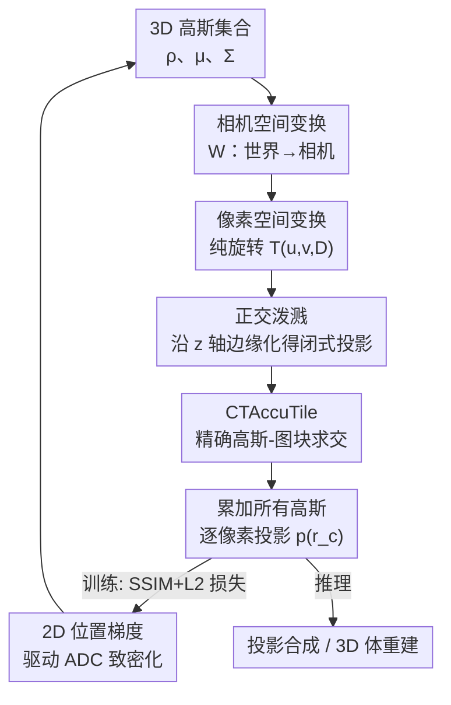

# Exact-GS: Mathematically Rigorous and Accurate 3D Gaussian Splatting for 3D X-ray Reconstruction

**会议**: CVPR 2026  
**论文**: [CVF Open Access](https://openaccess.thecvf.com/content/CVPR2026/html/Yang_Exact-GS_Mathematically_Rigorous_and_Accurate_3D_Gaussian_Splatting_for_3D_CVPR_2026_paper.html)  
**代码**: https://github.com/brucee1323/Exact-GS  
**领域**: 3D视觉 / 高斯泼溅 / X射线CT重建  
**关键词**: 3D Gaussian Splatting、CBCT 重建、精确泼溅、闭式投影、仿射近似误差

## 一句话总结
Exact-GS 推导出一个**无任何近似的闭式高斯泼溅投影公式**：把每个 3D 高斯按"逐像素的像素平面"做正交投影并解析积分，使泼溅渲染在数学上严格等价于光线追踪积分，从而既消除了传统 3DGS 的局部仿射近似误差（投影 PSNR 比 R2-GS 高约 94 dB），又比光线追踪快约 2×，用于 X 射线 CT 投影合成与体重建。

## 研究背景与动机
**领域现状**：锥束 CT（CBCT）和针孔相机共享同一套几何模型，核心难题是从稀疏角度的 2D 投影重建 3D 体。NeRF 类方法（IntraTomo、NAF、SAX-NeRF）能学到连续表示但体素巨大、渲染慢、显存高；3D Gaussian Splatting（3D-GS）凭 GPU 光栅化把效率提了上来，R2-GS 进一步把 3D-GS 搬到 CBCT 并修正了积分偏置（integration bias）。

**现有痛点**：所有主流 3DGS 方法都依赖一个"局部仿射近似"——它只取投影变换在高斯中心处泰勒展开的前两项，把 3D 高斯近似投到**同一张图像平面**上成为 2D 高斯。这个近似带来两个后果：① 投影本身有误差，不同角度的投影不一致，干扰优化收敛、在重建里引入伪影；② 把整个高斯压成一张图像平面上的 2D 高斯，会模糊边缘、削弱表达高频结构的能力。Optimal-GS 改用切平面、把误差推导到最小，但**也只在"光源→高斯中心"那条方向上无误差**。

**核心矛盾**：投影质量与渲染效率之间长期存在 trade-off。要"精确"，就得像 3DGRT / RaySplats / CT 域光线追踪那样沿光线做积分（无近似但前向/反向都极慢）；要"快"，就得用泼溅近似（快但带仿射误差）。没有方法能同时拿到两者。

**本文目标**：在**泼溅框架内**给出一个数学上严格、零近似的投影公式，使其渲染结果与光线追踪积分逐像素相等，同时保留泼溅可被 CUDA 硬件光栅化的速度优势，并支持端到端可微的 CT 重建。

**切入角度**：作者注意到，仿射近似的根源在于"所有高斯被强行投到同一张图像平面"。如果**为每个像素单独定义一个'像素平面'**，让光线恰好沿该坐标系的 z 轴方向，那么沿光线的积分就退化成多元高斯沿某一维的**边缘化（marginalization）**——而高斯的边缘分布仍是高斯、有闭式解。于是积分变成了解析表达式。

**核心 idea**：不再把高斯投到统一图像平面，而是用一个**纯旋转矩阵 $T$ 把每个高斯变到"该像素专属的像素平面"**，在那里做正交泼溅，用边缘化性质直接写出该像素的精确投影值——等价于光线追踪积分，但只需闭式计算。

## 方法详解

### 整体框架
Exact-GS 是一个面向 X 射线 CT 的可微高斯泼溅光栅器。物体被表示为一组各向异性 3D 高斯核 $G_i(x|\rho_i,\mu_i,\Sigma_i)$，每个核带可学习的位置 $\mu_i$、协方差 $\Sigma_i$（由旋转 $R_i$ 和尺度 $S_i$ 分解 $\Sigma_i=R_iS_iS_i^TR_i^T$）和中心密度 $\rho_i$；某点的总衰减是所有核的求和。整条渲染管线是：3D 高斯 →（世界到相机变换 $W$）相机空间高斯 →（按当前像素构造纯旋转 $T$）像素空间高斯 →（沿 z 轴正交泼溅 / 边缘化）该像素的精确投影值 → 累加所有高斯得到该像素读数。训练时用 SSIM+L2 复合损失、ADAM 优化 30k 步反传更新高斯参数。与之配套的两个工程件是：把高斯精确分配到图块的 **CTAccuTile**（让 GPU 并行光栅化只渲染真正有贡献的图块）和用于自适应密度控制（ADC）的 **2D 位置梯度** 累积。

### 关键设计

**1. 逐像素的像素空间变换：把仿射近似换成一个纯旋转**

仿射近似之所以有误差，是因为它用高斯中心处投影变换的雅可比 $J_i$ 去线性化整条投影，并把所有高斯压到同一图像平面。Exact-GS 改为：先沿用 R2-GS 的 CBCT 坐标系，把每个探测器像素 $x_d=[u,v]^\top$ 对应的相机空间光线写成 $r_c(t)=t\,d$，方向 $d=[u/l,v/l,D/l]^\top$、$l=\sqrt{u^2+v^2+D^2}$（$D$ 为光源到探测器距离）。然后为这个像素**定义一个"像素空间"**，其原点与相机空间重合、z 轴 $Z_p$ 正对该像素。关键在于构造一个**仅依赖像素位置和几何内参的纯旋转矩阵 $T(u,v,D)$**，把相机空间高斯整体旋转过去：$\mu_{i,p}=T\mu_{i,c}$、$\Sigma_{i,p}=T\Sigma_{i,c}T^\top$。$T$ 的目标是让该像素方向 $d$ 旋到相机空间竖直方向 $d_0=[0,0,1]^\top$（即 $d_0=Td$），用罗德里格旋转公式给出闭式：

$$T(u,v,D)=I+N\sin(\phi)+N^2(1-\cos(\phi)),$$

其中旋转轴 $n=(d\times d_0)/(\|d_0\|\|d\|\sin\phi)$、$\cos\phi=d\cdot d_0/(\|d_0\|\|d\|)$，$N=\lfloor n\rfloor$ 是 $n$ 的反对称矩阵。由于是纯旋转、不引入任何线性化截断，这一步**没有近似误差**，且 $T$ 有闭式表达可在 CUDA 里高效算出。这是整个精确性的几何根基。

**2. 正交泼溅：用高斯边缘化把光线积分写成闭式解**

在为该像素定义好的像素空间里，光线恰好与 z 轴正向重合：$r_p(t)=tTd=t\,d_0=t[0,0,1]^\top$。于是"沿光线积分"就变成对高斯沿 $z$ 维度的边缘化——丢掉无关分量后，剩下的边缘分布仍是高斯，可解析积分得到该像素投影：

$$p_i(r_p)=\frac{\rho_i(2\pi)^{1/2}|\Sigma_{i,p}|^{1/2}}{|\hat{\Sigma}_{i,p}|^{1/2}}\exp\!\left(-\tfrac{1}{2}\hat{\mu}_{i,p}^T\hat{\Sigma}_{i,p}^{-1}\hat{\mu}_{i,p}\right),$$

其中 $\hat{\mu}_{i,p}$、$\hat{\Sigma}_{i,p}$ 取 $\mu_{i,p}$ 前两个元素和 $\Sigma_{i,p}$ 前两行两列（即正交投影后落在像素平面上的 2D 高斯）。最终该像素读数是所有高斯的求和 $p(r_c)=\sum_i p_i(r_p)$。作者强调：这就是该像素沿方向 $r_c$ 的**数学精确投影，与光线追踪积分逐像素相等**。为什么仍比光线追踪快？因为光线追踪要沿射线对每个高斯做数值/解析积分采样，而这里直接利用多元高斯"边缘分布仍是高斯"的性质给出闭式表达，前向只需一次解析求值，反传也避免了光线追踪那种沿路径的复杂梯度——实测前向比光线追踪快约 2×，反传更是远快于光线追踪（其反传 $\gg44$ ms）。这正是"泼溅的高效 + 光线追踪的精确"的混合。

**3. CTAccuTile：按密度与积分偏置阈值做精确的高斯-图块求交**

GPU 并行光栅化要把每个高斯分配到它影响的图块（tile）。3D-GS 和 R2-GS 直接用 2D 高斯的 3-sigma 范围圈定影响区，但忽略了密度和积分偏置，会把很多其实贡献极小的图块也算进去、白白增加计算量。Exact-GS 基于 Speedy-Splat 实现 CTAccuTile，用 $\rho_i|\Sigma_{i,p}|^{1/2}|\hat{\Sigma}_{i,p}|^{-1/2}$（即该高斯在像素平面上的投影强度量级）作为求交阈值——**只有投影值大于该阈值的有效图块才会被渲染**。这样既精确刻画了高斯-图块求交，又把无效图块剔掉，使渲染更快更省。

**4. 2D 位置梯度：在像素平面上累积梯度以兼容并公平对标 R2-GS 的致密化**

3DGS 的自适应密度控制（ADC，即按梯度阈值做剪枝/分裂/克隆）需要一个位置梯度作指示器。3DGRT 用 3D 世界空间梯度，但为了和 R2-GS 公平对比，Exact-GS 仍采用图像平面上的位置梯度：它先把不同像素平面上 3D 高斯位置的梯度累积回相机空间，再按

$$\tau_i=\frac{1}{N}\sum_{j=0}^{N}\left\|\frac{\partial\mathcal{L}}{\partial\hat{\mu}_{(i,j),c}}\cdot\frac{\overline{\mu_{i,c}}}{D}\right\|$$

算出图像平面 2D 位置梯度幅值 $\tau_i$（$i,j$ 分别索引高斯核与投影，$\mathcal{L}$ 为损失）。这一步保证了致密化机制与现有 3DGS 流水线对齐，使精确投影的收益不被"换了致密化策略"这一混淆因素污染。

### 损失函数 / 训练策略
用 C++/CUDA 实现自定义 PyTorch 算子（基于 3D-GS 与 R2-GS），默认在单张 RTX 4090 上训练 30k 步，损失为 D-SSIM 结构相似损失加 L2 平方误差，ADAM 优化。合成数据上为消除 ADC 干扰、模拟真实连续积分，作者**自建了一个精确积分的光线追踪渲染器**来合成 ground-truth 投影（让损失成为拟凸函数、优化更可靠），并把高斯初始化为"参考值+误差"；真实数据上用 FDK 得到点云作初始表示，Exact-GS 与 R2-GS 用相同学习率与初始化配置。

## 实验关键数据

### 主实验

单高斯投影误差（以光线追踪积分为参考）：

| 方法 | PSNR-2D↑ | SSIM-2D↑ | LPIPS↓ |
|------|----------|----------|--------|
| R2-GS | 55.56 | 0.9988 | 1.59×10⁻⁵ |
| Optimal-GS | 50.43 | 0.9967 | 4.37×10⁻⁵ |
| **Exact-GS** | **149.64** | **1.0000** | **1.53×10⁻¹³** |

> Exact-GS 把投影 PSNR 从 ~55 dB 拉到约 149 dB（论文摘要表述为"较 R2-GS 提升 94 dB"），其残余误差仅来自 GPU 单精度浮点，即数学上已无近似误差。

合成数据集体重建（部分视角，PSNR-3D / SSIM-3D）：

| 方法 | 75 视角 PSNR-3D | 50 视角 PSNR-3D | 25 视角 PSNR-3D |
|------|-----------------|-----------------|-----------------|
| FDK | 28.11 | 25.31 | 20.77 |
| SART | 34.86 | 31.51 | 26.41 |
| NAF (14.27M) | 40.86 | 39.18 | 35.80 |
| TensoRF (12.64M) | 39.47 | 37.96 | 33.43 |
| R2-GS | 57.17 | 54.86 | 45.54 |
| **Exact-GS** | **59.17** | **56.89** | **45.83** |

75 视角下 Exact-GS 较 R2-GS 体重建提升约 1.9 dB；高斯类方法整体明显优于 NeRF 类（部分得益于更好的初始化）。

运行时（673434 个高斯实例，单张 RTX 4090，单位 ms）：

| 方法 | 前向 | 反向 | 总计 | 对 R2-GS 比 |
|------|------|------|------|-------------|
| R2-GS | 0.543 | 21.358 | 21.901 | 1.0 |
| 光线追踪 | 16.746 | ≫35.727 | ≫44.422 | ≫2.028 |
| **Exact-GS** | **8.695** | 35.727 | 44.422 | 2.028 |

Exact-GS 前向比光线追踪快约 2×，反传远快于光线追踪；整体重建耗时约为 R2-GS 的 2 倍、与 NAF 相当（28m26s vs 25m44s），但远快于 SAX-NeRF（7h22m）。

### 消融实验
不同初始化误差下（Case 编号越大初始误差越小）对比 R2-GS：

| 配置 | PSNR-2D↑ | PSNR-3D↑ | 说明 |
|------|----------|----------|------|
| R2-GS Case 1 | 61.84 | 43.88 | 大初始误差 |
| Exact-GS Case 1 | 61.84 | 43.95 | 略优 |
| R2-GS Case 3 | 64.42 | 47.62 | 中等误差 |
| Exact-GS Case 3 | 65.20 | 47.72 | 优 |
| R2-GS Case 4 | 70.28 | 57.08 | 小初始误差 |
| **Exact-GS Case 4** | **73.57** | **59.13** | 初始越准、领先越大 |

收敛性研究（单高斯、5 张投影训练）：Exact-GS 投影 PSNR-2D 达 147.28（R2-GS 66.36）、体重建 PSNR-3D 达 155.26（R2-GS 88.27）。损失曲线显示约 3600 epoch 后 Exact-GS 持续快速下降，而 R2-GS 先收敛到一个接近 GT 的错误值后剧烈振荡（位置参数 x、z 在 8000 步后明显抖动）。

### 关键发现
- **仿射近似是收敛不稳的元凶**：R2-GS 在单高斯上都会先收敛到错误值再振荡，证明局部仿射近似在每个投影角度引入了不同误差，破坏了优化收敛；Exact-GS 所有高斯参数都能精确收敛。
- **初始化越准，精确投影的收益越大**（Case 4 领先 ~3.3 dB PSNR-2D / ~2 dB PSNR-3D），说明误差消除主要在优化后期解锁高精度。
- **真实数据上 NeRF 指标更高但细节更差**：FIPS walnut 真实数据上 NeRF 类 PSNR 数值略好，但可视化里它们丢失高频细节、明显模糊；两个 3DGS 方法能清晰重建结构边缘，Exact-GS 用更少高斯（50010 vs R2-GS 50186）取得略高 PSNR-3D，且 2D 指标全面优于 R2-GS。
- **瓶颈在致密化**：现有 ADC 致密化下精确投影的领先被"光滑区出现条纹伪影、拖累全局 PSNR"部分抵消，真实数据上优势因此不显著。

## 亮点与洞察
- **把"积分"重新表述为"边缘化"**：核心洞见是为每个像素建一个让光线沿 z 轴的像素空间，使沿光线积分退化成高斯沿一维的边缘化——而高斯边缘分布仍是高斯、有闭式解。这一步把"精确"和"快"的矛盾化解掉了，是真正的"啊哈"点。
- **纯旋转 $T$ 而非雅可比线性化**：用罗德里格公式给出仅依赖像素位置和内参的闭式旋转，从几何上彻底绕开了泰勒展开的截断误差，残余误差只剩 GPU 单精度浮点（10⁻¹³ 量级）。
- **可迁移性强**：该精确泼溅思想不局限于 X 射线 CT，作者指出它能用于所有 3DGS 方法，例如自然光场景表示里透射率积分的计算——任何"沿光线对高斯积分"的场景都可用边缘化闭式替换。
- **工程层的精确化**：CTAccuTile 把"高斯影响哪些图块"也从 3-sigma 粗略框定换成按投影强度阈值精确求交，是精确性贯彻到光栅化实现层的体现。

## 局限与展望
- **作者承认**：① 致密化是瓶颈——3DGS 对优化局部极小敏感、依赖 ADC 的剪枝/分裂/克隆，当前致密化下 Exact-GS 在真实数据上没拉开显著差距，光滑区还会出现条纹伪影拉低全局 PSNR；② 只验证了精确性与收敛性，未探索 VKGS / NVIDIA OptiX 等硬件渲染平台或二阶优化来进一步提速。
- **自己发现的局限**：合成实验严重依赖"自建光线追踪渲染器合成 GT + 初始化为参考值+误差"这一受控设置（使损失拟凸），与真实临床扫描的噪声/运动差距较大；真实 FIPS 数据上对象在扫描中的相对运动并未补偿，且整体重建耗时约为 R2-GS 的 2 倍。
- **改进思路**：把精确投影与更鲁棒的致密化/正则（抑制条纹伪影）联合优化；或将闭式泼溅落到 OptiX/VKGS 硬件管线 + 二阶优化以摊薄 2× 的时间开销。

## 相关工作与启发
- **vs R2-GS**：R2-GS 首次把 3D-GS 搬进 CBCT 并修正积分偏置，但仍用局部仿射近似投到统一图像平面；Exact-GS 用逐像素像素空间 + 边缘化给出零近似闭式投影，投影 PSNR 高近 94 dB、收敛更稳，代价是整体重建慢约 2×。
- **vs Optimal-GS**：Optimal-GS 用切平面把仿射误差推到最小，但只在"光源→高斯中心"方向上无误差；Exact-GS 对每个像素方向都精确。
- **vs 光线追踪类（3DGRT / RaySplats / CT 域光追）**：它们沿光线积分得到精确结果但前向/反向都极慢；Exact-GS 在泼溅框架内拿到与之逐像素相等的精确结果，却保留 CUDA 光栅化速度，是"泼溅高效 × 光追精确"的混合。
- **vs NeRF 类（NAF / TensoRF / SAX-NeRF）**：NeRF 类体素表示渲染慢、显存高，真实数据上还易丢高频细节；高斯类初始化更好、边缘更清晰。

## 评分
- 新颖性: ⭐⭐⭐⭐⭐ 把光线积分重写为像素空间边缘化、给出零近似闭式泼溅，从根上消除了 3DGS 长期存在的仿射近似误差。
- 实验充分度: ⭐⭐⭐⭐ 合成+真实、投影+重建、收敛性+运行时+消融都覆盖，但真实数据优势不显著、依赖自建受控合成设置。
- 写作质量: ⭐⭐⭐⭐ 数学推导清晰、图示到位；部分公式与坐标系定义偏密，需对照附录。
- 价值: ⭐⭐⭐⭐⭐ 思想可迁移到所有 3DGS 渲染（含自然光场），为"精确泼溅"提供了通用数学基座。

<!-- RELATED:START -->

## 相关论文

- [\[CVPR 2026\] Stochastic Ray Tracing for the Reconstruction of 3D Gaussian Splatting](stochastic_ray_tracing_for_the_reconstruction_of_3d_gaussian_splatting.md)
- [\[CVPR 2026\] Geometric-Photometric Event-based 3D Gaussian Ray Tracing](geometric-photometric_event-based_3d_gaussian_ray_tracing.md)
- [\[CVPR 2026\] BA-GS: Bayesian Adaptive Gaussian Splatting for SFM-Free 3D Reconstruction](ba-gs_bayesian_adaptive_gaussian_splatting_for_sfm-free_3d_reconstruction.md)
- [\[CVPR 2026\] NG-GS: NeRF-Guided 3D Gaussian Splatting Segmentation](ng_gs_nerf_guided_3d_gaussian_splatting_segmentation.md)
- [\[CVPR 2026\] DropAnSH-GS: Dropping Anchor and Spherical Harmonics for Sparse-view Gaussian Splatting](dropping_anchor_and_spherical_harmonics_for_sparse-view_gaussian_splatting.md)

<!-- RELATED:END -->
