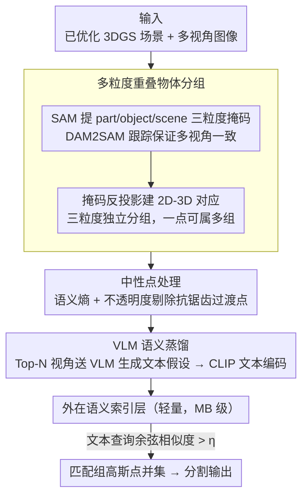

# ExtrinSplat: Decoupling Geometry and Semantics for Open-Vocabulary Understanding in 3D Gaussian Splatting

**会议**: CVPR 2026  
**arXiv**: [2509.22225](https://arxiv.org/abs/2509.22225)  
**代码**: 无  
**领域**: 3D Vision / 开放词汇3D场景理解  
**关键词**: 3D Gaussian Splatting, 开放词汇理解, 语义解耦, VLM, 文本假设

## 一句话总结

提出外在范式（extrinsic paradigm），将语义从3DGS几何中完全解耦，通过多粒度物体分组+VLM文本假设构建轻量语义索引层，实现无训练、低存储、支持多义性的开放词汇3D场景理解。

## 研究背景与动机

**领域现状**: 开放词汇3D场景理解是自动驾驶和机器人的关键能力，3DGS因高保真建模和实时渲染成为理想表征基础。

**现有痛点**: 主流方法采用"嵌入范式"（embedding paradigm），将高维语义特征直接注入每个高斯点，存在三个根本性缺陷：
   - **几何-语义不一致**：语义的基本单元应该是物体，而非高斯点。边界处的"中性点"（neutral points）被强行赋予语义标签，导致边界模糊
   - **语义膨胀**：注入GB级特征数据，存储和下游处理负担极重（每个场景约3GB CLIP特征）
   - **语义刚性**：一个高斯只能存一个特征向量，无法表达多义性（如"车窗"既是"窗"也是"车的一部分"）

**核心矛盾**: 嵌入范式将语义内嵌到几何中，但几何和语义的最小操作单元根本不同（点 vs 物体）

**本文目标**: 如何在不修改几何的前提下实现高效、准确、支持多义性的开放词汇3D理解

**切入角度**: 提出外在范式——语义作为独立的抽象索引层，引用而非嵌入几何

**核心idea**: 用多粒度物体分组替代逐点语义嵌入，用VLM生成的文本假设替代高维视觉特征

## 方法详解

### 整体框架

ExtrinSplat 针对的是开放词汇 3D 场景理解里"嵌入范式"的通病：把高维语义特征直接塞进每个高斯点，会带来几何-语义单元错位、GB 级存储膨胀，以及一个点只能存一个语义的刚性。它提出"外在范式"——语义不再嵌进几何，而是作为一个独立的、可查询的索引层去引用几何。

整个框架无需训练，输入一个已优化好的 3DGS 场景和对应的多视角图像，分四步组装出外在语义索引层：先提取多视角、多粒度的物体掩码并跟踪保持视角一致（数据准备）；把 2D 掩码反投影到 3D 高斯点做**多粒度重叠物体分组**，并通过**中性点处理**净化边界；再用 VLM 把每个物体组蒸馏成文本假设（**VLM 语义蒸馏**）；最后组装成可用文本查询的外在语义索引层。查询时只做文本对文本的余弦相似度匹配。

### 关键设计

**1. 多粒度重叠物体分组：让一个点能同时属于多个语义实体**

嵌入范式每个高斯只能存一个特征向量，表达不了"车窗既是窗也是车的一部分"这种多义性。ExtrinSplat 用 SAM 在 part/object/scene 三个粒度上各提一套掩码，并用 DAM2SAM 跟踪保证多视角一致，再通过掩码反投影建立 2D-3D 对应，前景概率为 $W_k(G_j) = \sum_{v \in \mathcal{V}} \sum_{r \in \mathcal{P}_v} \delta(m_v(r) - k) \cdot w_v(r, G_j)$。

关键在于三个粒度各自独立分组，所以同一个高斯点可以同时落进"窗"和"车"两个组——多义性成了框架的固有属性，而不是需要额外打补丁的特例。

**2. 中性点处理：剔除边界上既非前景也非背景的过渡点**

渲染里物体边界必然有一批用于抗锯齿的过渡性高斯点，嵌入范式假设每个点非前即后，强行给它们贴语义就会在边界引入噪声和模糊。ExtrinSplat 用多视角语义一致性来量化这种模糊：把每个视角看作给高斯点投一张前景/背景的票，算语义熵 $H(p) = -\left(\frac{V_f}{V}\log_2\frac{V_f}{V} + \frac{V_b}{V}\log_2\frac{V_b}{V}\right)$。

高熵点是候选中性点，但还要用不透明度 $\alpha$ 二次区分：高不透明度的高熵点其实是实体表面被误标的点，应保留分类；只有低不透明度的高熵点才是真正用于抗锯齿的过渡点，予以排除。这是首次把"中性点"这个边界问题明确定义出来并对症处理。

**3. VLM 语义蒸馏：把视角敏感的视觉特征换成稳定的文本表征**

CLIP 这类 2D 编码器有视角敏感性，同一物体在不同视角会产出差异很大的特征向量，直接聚合就不稳。ExtrinSplat 对每个物体组挑可见面积最大的 Top-N 视角掩码送进 VLM（如 Gemini 2.5 Pro），生成候选物体名称作为"文本假设"，再用 CLIP 文本编码器编码成特征。

这等于把不稳定的视觉外观"蒸馏"成稳定的文本描述，从根上消除跨视角语义不一致；附带的好处是文本只需 MB 级存储，相比 GB 级视觉特征直接降了约三个数量级。

### 损失函数 / 训练策略

ExtrinSplat 完全无需训练，不做对比学习或特征优化。查询时通过余弦相似度匹配文本查询与预计算文本特征：

$$\mathcal{I}_m = \{i \mid \max_{\mathbf{q} \in \mathbf{Q}_i} \text{sim}(\mathbf{s}, \mathbf{q}) > \eta\}$$

最终分割取所有匹配组的高斯点并集：$\mathcal{G}_{\text{final}} = \bigcup_{i \in \mathcal{I}_m} \mathcal{G}_i$。

## 实验关键数据

### 主实验（LERF数据集 - 开放词汇3D物体选择）

| 方法 | 范式 | Ramen | Teatime | Figurines | Waldo | Mean mIoU |
|------|------|-------|---------|-----------|-------|-----------|
| LangSplat (CVPR'24) | 嵌入 | 51.2 | 65.1 | 44.7 | 44.5 | 51.4 |
| OpenGaussian (NeurIPS'25) | 嵌入 | 31.0 | 60.4 | 39.3 | 22.7 | 38.4 |
| Dr.Splat (CVPR'25) | 嵌入 | 24.7 | 57.2 | 53.4 | 39.1 | 43.6 |
| LAGA (ICML'25) | 嵌入 | 55.6 | 70.9 | 64.1 | 65.6 | 64.0 |
| LUDVIG (ICCV'25) | 嵌入 | 42.3 | 58.6 | 58.0 | 42.8 | 50.4 |
| **ExtrinSplat (本文)** | **外在** | 45.6 | 72.7 | 63.1 | 68.2 | **62.4** |

### 效率对比

| 方法 | 场景优化 | 训练时间 | CLIP特征存储 | 峰值VRAM |
|------|----------|----------|--------------|----------|
| LEGaussians | 需要 | ~2h | ~3GB | ~20GB |
| LangSplat | 需要 | ~2h | ~3GB | ~20GB |
| Dr.Splat | 不需要 | ~1h | ~3GB | ~24GB |
| **ExtrinSplat** | **不需要** | **无** | **~3MB** | **~8GB** |

### 关键发现

- CLIP特征存储从GB级降低到MB级（降低约1000倍），VRAM使用最低（8GB vs 20-28GB）
- 在3D训练无关方法中取得最优性能，整体性能与最佳嵌入方法LAGA接近
- 中性点处理显著提升物体边界清晰度

## 亮点与洞察

- **范式创新**: 首次提出"外在范式"概念，将语义完全解耦为独立索引层，与嵌入范式形成鲜明对比
- **存储效率惊人**: 语义存储从3GB降至3MB，这在实际部署中意义重大
- **天然多义性支持**: 重叠分组设计使多义性成为框架的固有属性，而非需要额外处理的问题
- **VLM蒸馏思路**: 将不稳定的视觉特征蒸馏为稳定的文本表征，这个思路可推广到其他多视角理解任务

## 局限与展望

- 依赖SAM和DAM2SAM的掩码质量，复杂场景可能产生不完整分组
- VLM推理成本（Gemini 2.5 Pro）可能在离线端受限
- 分组粒度固定为SAM的三级，可能不适合所有语义查询粒度
- 未处理动态场景

## 相关工作与启发

- **OpenGaussian/Dr.Splat**: 代表嵌入范式的最新进展，通过特征聚合和量化优化效率
- **LUDVIG**: 无训练但仍嵌入CLIP特征，ExtrinSplat在相同无训练约束下显著超越
- **启发**: 外在范式的解耦思想可以推广到其他3D表征（如NeRF、点云），核心是"操作单元的对齐"——用物体作为语义单元，用点作为几何单元

## 评分

- 新颖性: ⭐⭐⭐⭐⭐ 外在范式是全新的设计理念，中性点概念有原创性
- 实验充分度: ⭐⭐⭐⭐ LERF和ScanNet两个benchmark，消融充分，但缺少大规模场景测试
- 写作质量: ⭐⭐⭐⭐⭐ 三个问题-三个解法的对应结构非常清晰
- 价值: ⭐⭐⭐⭐⭐ 存储降低1000倍且无训练，实用价值极高

<!-- RELATED:START -->

## 相关论文

- [\[CVPR 2026\] OnlinePG: Online Open-Vocabulary Panoptic Mapping with 3D Gaussian Splatting](onlinepg_online_open-vocabulary_panoptic_mapping_with_3d_gaussian_splatting.md)
- [\[CVPR 2026\] OVI-MAP: Open-Vocabulary Instance-Semantic Mapping](ovi-map_open-vocabulary_instance-semantic_mapping.md)
- [\[CVPR 2026\] EmbodiedSplat: Online Feed-Forward Semantic 3DGS for Open-Vocabulary 3D Scene Understanding](embodiedsplat_online_feed-forward_semantic_3dgs_for_open-vocabulary_3d_scene_und.md)
- [\[CVPR 2026\] LightSplat: Fast and Memory-Efficient Open-Vocabulary 3D Scene Understanding in Five Seconds](lightsplat_fast_and_memory-efficient_open-vocabulary_3d_scene_understanding_in_f.md)
- [\[CVPR 2026\] OpenVoxel: Training-Free Grouping and Captioning Voxels for Open-Vocabulary 3D Scene Understanding](openvoxel_training-free_grouping_and_captioning_voxels_for_open-vocabulary_3d_sc.md)

<!-- RELATED:END -->
