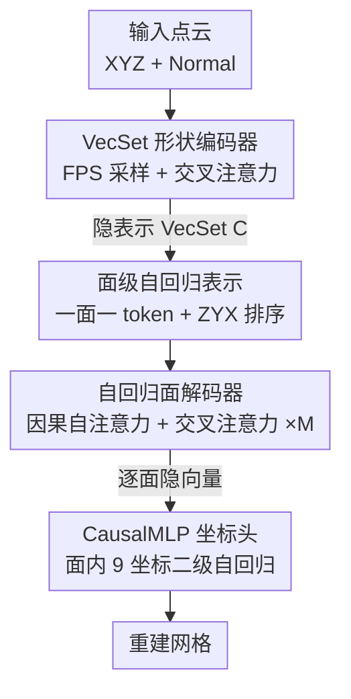

# FACE: A Face-based Autoregressive Representation for High-Fidelity and Efficient Mesh Generation

**会议**: CVPR 2026  
**论文**: [CVF Open Access](https://openaccess.thecvf.com/content/CVPR2026/html/Wang_FACE_A_Face-based_Autoregressive_Representation_for_High-Fidelity_and_Efficient_Mesh_CVPR_2026_paper.html)  
**代码**: 待确认  
**领域**: 3D视觉  
**关键词**: 网格生成, 自回归, 面级表示, VecSet, 序列压缩

## 一句话总结
FACE 把三角网格生成的"语义粒度"从顶点坐标抬到整个三角面，提出"一面一 token"策略，让自回归 Transformer 处理的序列长度直接缩短 9 倍、压缩比刷到 0.11（前 SOTA 的一半），同时配上 VecSet 编码器把重建质量也做到了 SOTA。

## 研究背景与动机

**领域现状**：三角网格（triangle mesh）是工业界 3D 内容的事实标准，直接生成"拓扑连贯的高保真网格"被视为图形学的"圣杯"。自 MeshGPT 以来，自回归（AR）模型成了端到端网格生成的主流范式——把网格拍平成一维的顶点坐标 token 序列，再像语言模型那样一个 token 接一个 token 地生成。

**现有痛点**：这条路有个致命短板——Transformer 自注意力对序列长度是 $O(N^2)$ 复杂度，而拍平后的坐标序列极长（一个面 3 个顶点 × 3 个坐标 = 9 个 token），导致生成上千面的网格在算力上几乎不可承受。为缓解，社区做了一大堆压缩工作：有的用复杂的图遍历算法优化顶点复用（EdgeRunner、MeshAnythingV2），有的改 tokenization 方案搞 block indexing（BPT、Nautilus）。但遍历类策略往往脆弱、会破坏网格全局结构，block 类则容易让词表爆炸。

**核心矛盾**：作者一针见血——这些方法都在"治标"（缩短序列长度），却没碰"病根"。真正的问题是**操作在了错误的语义层级上**：模型在低层的单个坐标上做生成，自然要面对超长序列。

**本文目标**：能不能换一个表示，让"压缩"不再是事后打补丁，而是从表示本身自然涌现？同时还不能牺牲重建质量，最好还能迁移到 image-to-mesh 这种下游任务。

**切入角度**：三角面才是网格的"基本构件"。如果把一整个面当作一个语义单元，序列长度天然就短了一个量级——这是表示层面的升维，而不是算法层面的修补。

**核心 idea**：用"一面一 token"（one-face-one-token）替代"一坐标一 token"，把自回归生成抬到面级；再套一个自回归自编码器（ARAE）框架——VecSet 编码器压点云成隐表示、面级解码器逐面重建网格，端到端联合训练。

## 方法详解

### 整体框架
FACE 要建模的是条件概率 $p(M|P)$：给定输入点云 $P$，生成对应的高保真三角网格 $M$。整体是一个**自回归自编码器（Autoregressive Autoencoder, ARAE）**：先用 Shape Encoder 把点云压成紧凑隐表示——一个 VecSet $C$；再用 Autoregressive Decoder 以 $C$ 为条件，把网格的面一个接一个地自回归生成出来。

关键在于"在哪个粒度上生成"。FACE 先把网格 $M$ 表示成一个有序的面序列 $F=(f_1, f_2, \dots, f_N)$，每个面 $f_i=(v_i^0, v_i^1, v_i^2)\in\mathbb{R}^9$（三个顶点拍平成 9 维向量），然后用"一面一 token"把整个 9 维向量塞进一个 token 喂给 Transformer。这样自注意力面对的序列长度从 $9\times|F|$ 降到 $|F|$，是全流程效率飞跃的源头。生成时还有一个两级自回归：Transformer 在**面级**自回归（逐面生成隐向量），CausalMLP 头在**坐标级**自回归（把一个面的 9 个坐标也按因果顺序逐个解码）。最后再把这套隐空间接上一个 image-conditioned 扩散模型，就能做单图到网格生成，验证隐空间的通用性。

### 关键设计

**1. 一面一 token：把生成抬到面级，序列长度直接缩 9 倍**

这是整个框架的基石，直击自回归网格生成"序列太长"的病根。标准做法把每个面拆成 9 个坐标 token，序列长度是 $9\times|F|$；FACE 反其道而行，把整个 9 维面向量 $f_i=(v_i^0, v_i^1, v_i^2)$ 当成**一个不可分的单元**，用一个轻量的嵌入层（Face Pooling 层，本质是个 MLP）投影成单个 $d_{model}$ 维 token：$t_{i-1}=\mathrm{MLP}_{\text{embed}}(f_{i-1})$。由于自注意力复杂度是 $O(S^2)$，序列长度从 $9|F|$ 缩到 $|F|$ 意味着理论上 $81\times$ 的计算量下降、配合 flash attention 约 $9\times$ 的显存下降。表 1 里实际压缩比（模型要处理的序列长度相对"一坐标一 token"基线的比值）做到了 **0.11**，是前最好的 0.22 的整整一半，而 Face Pooling 和后面的 CausalMLP 只增加了可忽略的线性 $O(N)$ 开销——压缩是从"架构的优雅"里自然出来的，不是有损的复杂压缩方案。

配套的面排序也刻意做得简单：与其用脆弱的图遍历，作者发现一个确定性的空间排序就很好用——按每个面"最小坐标顶点"的字典序 ZYX 排序。这给任意网格一个规范的、可复现的顺序，消掉了系统复杂度，消融实验证明并不牺牲质量。

**2. VecSet 形状编码器：把点云压成强条件信号**

面级解码器要逐面生成，必须有一个能抓住全局几何的条件信号。编码器把原始点云 $P\in\mathbb{R}^{m\times3}$ 映射成紧凑的隐 VecSet $C\in\mathbb{R}^{k\times d_{latent}}$，沿用 3DShape2VecSet 这套被验证过的架构。具体先用最远点采样（FPS）从输入里选出 $k$ 个有代表性的查询点，这些查询点通过交叉注意力去聚合整个点集的全局几何，得到初始表示 $C'=\mathrm{CrossAttn}(Q=Q, K=K_P, V=V_P)$；再经 $L_E$ 层标准 Transformer Encoder 精炼成最终的 $C=\mathrm{TransformerEncoder}_{L_E}(C')$。这个 $C$ 会作为全局条件，在解码器每一层注入，确保每一步的局部生成决策都被整体目标几何"看着"。消融（表 4）显示用下采样点云作 query 比用可学习 query 明显更好。

**3. 自回归面解码器：因果自注意力管连接性，交叉注意力注入全局形状**

解码器负责把面序列 $F$ 在 $C$ 的条件下生成出来，关键区别是它**自己学面的内部表示**、不像 MeshGPT 那样依赖一个单独训练的 VAE 做坐标 tokenization——整套编解码端到端一起训，表示直接为生成任务优化。每一步 $i$ 先把前缀里的真值面经 Face Pooling 嵌成 token，再进 $L_D$ 层 Transformer。每层做两件事：先 Causal Self-Attention $H'_l=\mathrm{CausalSelfAttn}(H_l)$，让模型看已生成的面 token $t_{<i}$，捕捉网格的局部结构和连接性；再 Cross-Attention $H_{l+1}=\mathrm{CrossAttn}(Q=H'_l, K=C, V=C)$，用自注意力输出当 query、VecSet $C$ 当 key/value，把全局形状上下文逐层注入。Transformer 在第 $i$ 步输出一个隐面向量 $h_i\in\mathbb{R}^{d_{model}}$。这种"局部自回归 + 全局条件"的组合，让每个局部生成决策都被整体几何约束着，是高保真重建的核心。

**4. CausalMLP 坐标头：面内再开一层自回归，比并行预测稳得多**

光有面级隐向量 $h_i$ 还不够，得把它解码回 9 个量化坐标 token。作者用一个轻量的 CausalMLP 头，在**面内部**又引入了第二级自回归：第 $j$ 个坐标 token 的预测不仅条件于 $h_i$，还条件于同一个面里**之前已预测的所有坐标 token**。这种面内因果依赖比"一次并行预测 9 个坐标"有效得多——消融（表 5）里 Parallel Decode（单 MLP 直接吐 $9\times|V|$ 张量）的 Hausdorff 距离高达 0.426，Attention-based 是 0.132，而 CausalMLP 只有 0.103，差距巨大。于是 FACE 形成了一个干净的层级结构：Transformer 在面级自回归、CausalMLP 在坐标级自回归，整体端到端训练。

### 损失函数 / 训练策略
整个框架用一个统一目标端到端训练：网格面的重建损失。对真值序列里每个面 $f_i$，CausalMLP 头预测 9 个量化坐标的 logit 向量 $(L_{i,1},\dots,L_{i,9})$，目标是最小化每个坐标预测的交叉熵之和、对所有面取平均：

$$\mathcal{L}=\frac{1}{N}\sum_{i=1}^{N}\sum_{j=1}^{9}\mathrm{CrossEntropy}(L_{i,j}, c_{i,j})$$

其中 $c_{i,j}$ 是第 $i$ 个面第 $j$ 个坐标的真值 token 索引。优化这个目标让编码器和解码器联合学到一个紧凑隐表示 $C$，从中能忠实重建原网格。基础模型 500M 参数、采用**非对称设计**（解码器比编码器大：编码器 8 层 hidden 768，解码器 24 层 hidden 1024），从 Objaverse 里挑面数 <4000 的约 13 万个网格训练，顶点量化到 $[0,127]$，用 Muon 优化器、lr=$6\times10^{-4}$、100K 步、8×A100 训练。image-to-mesh 用的 DiT 是 350M、flow matching 目标、DINOv3 抽图像特征、推理 100 步 Euler 采样。

## 实验关键数据

### 主实验

**token 效率（表 1）**：压缩比定义为模型要处理的序列长度相对"一坐标一 token"基线的比值，越低越好。

| 方法 | 压缩比 ↓ |
|------|---------|
| MeshXL / MeshAnything | 1.00 |
| MeshGPT / PivotMesh | 0.67 |
| EdgeRunner | 0.47 |
| MeshAnythingV2 | 0.46 |
| BPT | 0.26 |
| Mesh-Silksong / TreeMeshGPT | 0.22 |
| **Ours (FACE)** | **0.11** |

**重建质量（表 2）**：在三个训练时未见过的数据集上比 Hausdorff（最坏情况偏差）和 Chamfer（平均接近度），均越低越好。

| 数据集 | 指标 | FACE | 最优基线(BPT) | 说明 |
|--------|------|------|--------------|------|
| Objaverse | Hausdorff ↓ | **0.090** | 0.126 | FACE 全面领先 |
| Objaverse | Chamfer ↓ | **0.041** | 0.043 | |
| Toys4K | Hausdorff ↓ | **0.067** | 0.091 | 比最优基线低约 26% |
| Toys4K | Chamfer ↓ | **0.033** | 0.037 | |
| Famous | Hausdorff ↓ | **0.077** | 0.143 | 复杂/风格各异，体现泛化 |
| Famous | Chamfer ↓ | **0.049** | 0.061 | |

在 Famous 这种风格与训练数据差异大的复杂模型上仍拿到 SOTA，说明泛化能力强；定性上 FACE 产生的表面更干净、保留尖锐特征和细节，基线常出现孔洞、缺件或过度平滑。

### 消融实验

| 模块 | 配置 | Hausdorff ↓ | Chamfer ↓ | 说明 |
|------|------|------------|-----------|------|
| 面排序 | BFS | 0.728 | 0.528 | 图遍历，极差 |
| 面排序 | DFS | 0.171 | 0.077 | 图遍历 |
| 面排序 | ZYX-component | 0.110 | 0.045 | 先按连通分量再 ZYX |
| 面排序 | **ZYX**（采用） | 0.103 | 0.047 | 空间排序，更简单且最优 |
| 编码器 query | Learnable | 0.132 | 0.058 | 可学习 query |
| 编码器 query | **Downsample**（采用） | 0.103 | 0.047 | 下采样点云作 query 明显更好 |
| 坐标解码 | Parallel Decode | 0.426 | 0.239 | 并行吐 9 坐标，崩 |
| 坐标解码 | Attention-based | 0.132 | 0.064 | 注意力解码 |
| 坐标解码 | **CausalMLP**（采用） | 0.103 | 0.047 | 面内自回归，大幅领先 |

### 关键发现
- **面排序：空间排序 >> 图遍历**。BFS 直接崩到 HD 0.728，而简单的 ZYX 字典序只有 0.103——印证了作者"不需要复杂遍历算法"的判断，面级生成下空间排序就够好。
- **坐标解码头贡献最大**。把 CausalMLP 换成并行预测，HD 从 0.103 暴涨到 0.426，说明面内的二级自回归是高保真的关键，并行预测无法处理 9 个坐标间的依赖。
- **下采样 query 优于可学习 query**，与 3DShape2VecSet 的发现一致。
- **可扩展性**：把模型放大到 1.2B（Ours-large）、输入点增到 65,536、量化提到 $[0,1023]$、用 38 万高质量内部数据训练后，能重建出更精细的几何细节和尖锐特征，说明框架有良好 scaling 性质。

## 亮点与洞察
- **"病根 vs 症状"的诊断很漂亮**：作者没有继续在压缩算法上卷，而是指出问题出在"操作的语义层级"——把生成单元从坐标换成面，序列长度天然降一个量级，压缩从表示本身涌现而非事后打补丁。这种"换层级而非换算法"的思路可迁移到其他序列建模任务（如把 token 粒度抬高）。
- **两级自回归的层级设计很巧**：面级（Transformer）+ 坐标级（CausalMLP）的嵌套自回归，既享受了短序列的效率，又用面内因果依赖保住了坐标精度，消融数据（0.426→0.103）证明这一层不可或缺。
- **端到端、无独立 VAE**：解码器自己学面的内部表示，避免了 MeshGPT 那种"先训 VAE 再训生成"的两阶段误差累积，表示直接为生成优化。
- **隐空间的通用性被实打实验证**：不微调 FACE 解码器、只在前面接一个 image-conditioned DiT 就能做单图到网格，说明 ARAE 学到的是真正可泛化的 3D 形状表示，有做"3D 基础组件"的潜力。

## 局限与展望
- **作者承认的离散分辨率上限**：虽然能 scale 到 1024 分辨率，但离散量化表示终归有限，对可达细节级别仍有上界。
- **依赖输入点云的采样质量**：极细或极薄的结构（如自行车轮辐条）可能采样不足，导致这些区域重建不完整。
- **自己发现的局限**：① 重建质量评测都是从已知形状重建（point cloud → mesh），生成多样性 / 从噪声纯生成的能力没有量化评估；② image-to-mesh 因基线未放权重，只能和 EdgeRunner 的项目页定性比，缺乏定量对比；③ ZYX 排序虽简单有效，但对存在大量退化/重叠面的网格是否稳健没有讨论。
- **改进思路**：可探索连续/混合分辨率表示突破离散上界；对薄结构引入额外的拓扑先验或法向引导采样。

## 相关工作与启发
- **vs MeshGPT / MeshXL（一坐标一 token）**：它们把面拆成 9 个坐标 token，序列长 $9|F|$、压缩比 0.67–1.00；FACE 一面一 token，序列长 $|F|$、压缩比 0.11。本文优势是效率与质量双赢，且端到端无独立 VAE。
- **vs 遍历/block 压缩（EdgeRunner、BPT、TreeMeshGPT、Nautilus）**：它们在"治标"——靠复杂遍历或 block indexing 缩序列，常带来脆弱性或词表膨胀（压缩比止步 0.22）；FACE 从表示层级"治本"，用简单 ZYX 排序就把压缩比再砍一半，重建质量也全面更优。
- **vs 扩散类 face-per-token（PolyDiff、MeshCraft）**：它们也用"一面一 token"，但扩散的非序列特性难以生成变长输出、保证拓扑完整；FACE 是首个在**自回归**框架里成功落地 face-as-token 的工作，天然处理变长序列和顺序依赖。
- **vs 隐式表示 + Marching Cubes（SDF / Occupancy / TRELLIS 等）**：它们需要后处理抽取多边形网格，对面结构无细粒度控制、易引入伪影；FACE 直接生成显式网格，可控性更好。

## 评分
- 新颖性: ⭐⭐⭐⭐⭐ 首个把 face-as-token 落进自回归框架，"换语义层级"的诊断与解法都很本质。
- 实验充分度: ⭐⭐⭐⭐ 三数据集重建 + 三组消融 + scaling 都有，但生成多样性与 image-to-mesh 定量对比偏弱。
- 写作质量: ⭐⭐⭐⭐⭐ 动机—方法—实验逻辑清晰，"病根 vs 症状"的叙事很有说服力。
- 价值: ⭐⭐⭐⭐⭐ 压缩比翻倍 + 质量 SOTA + 隐空间可迁移，为高保真结构化 3D 生成显著降门槛。

<!-- RELATED:START -->

## 相关论文

- [\[CVPR 2026\] HyperGaussians: High-Dimensional Gaussian Splatting for High-Fidelity Animatable Face Avatars](hypergaussians_high-dimensional_gaussian_splatting_for_high-fidelity_animatable_.md)
- [\[CVPR 2026\] FHAvatar: Fast and High-Fidelity Reconstruction of Face-and-Hair Composable 3D Head Avatar from Few Casual Captures](fhavatar_fast_and_high-fidelity_reconstruction_of_face-and-hair_composable_3d_he.md)
- [\[CVPR 2026\] LATTICE: Democratize High-Fidelity 3D Generation at Scale](lattice_democratize_high-fidelity_3d_generation_at_scale.md)
- [\[CVPR 2026\] HiFi-BRep: High-Fidelity Latent Representation for Robust B-Rep Generation](hifi-brep_high-fidelity_latent_representation_for_robust_b-rep_generation.md)
- [\[CVPR 2026\] SketchFaceGS: Real-Time Sketch-Driven Face Editing and Generation with Gaussian Splatting](sketchfacegs_real-time_sketch-driven_face_editing_and_generation_with_gaussian_s.md)

<!-- RELATED:END -->
