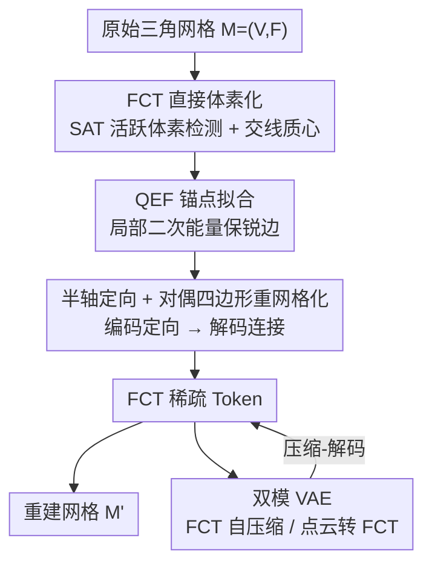

# Faithful Contouring: Near-Lossless 3D Voxel Representation Free from Iso-surface

**会议**: CVPR 2026  
**论文**: [CVF Open Access](https://openaccess.thecvf.com/content/CVPR2026/html/Luo_Faithful_Contouring_Near-Lossless_3D_Voxel_Representation_Free_from_Iso-surface_CVPR_2026_paper.html)  
**代码**: https://github.com/Luo-Yihao/FaithC  
**领域**: 3D视觉  
**关键词**: 体素表示, 网格重建, 无符号距离场, 锐边保持, VAE

## 一句话总结
本文提出 Faithful Contouring（FaithC），一种**绕开符号距离场（SDF）与 Marching Cubes 等值面提取**的稀疏体素表示：直接从原始三角网格在每个体素内拟合「锚点 + 连接关系」并存成 FCT token，支持 2048+ 分辨率，重建误差低到 $10^{-5}$ 量级，配套双模 VAE 在 Chamfer Distance 上比强基线降 93%、F-score 提升 35%。

## 研究背景与动机

**领域现状**：3D 重建与生成普遍依赖**体素化表示**——把不规则的网格/点云离散成规则栅格，方便张量化的深度网络训练。当前主流路线是先把网格转成距离场（occupancy / SDF），再用 Marching Cubes（MC）或其变体（Dual Contouring、FlexiCubes）从等值面抽取表面。近期的稀疏体素生成方法（Trellis、Sparc3D、SparseFlex、Ultra3D 等）几乎都站在这条「SDF → 等值面」流水线之上。

**现有痛点**：这条流水线的每一步都在丢信息。① **水密化（water-tightening）**：用 ε-ball 膨胀去封堵开口，会人为加厚外壳、改变拓扑；② **符号判定**：对非水密网格用 flood-fill / winding number / 光栅化统计来推内外，这些是**全局操作**，在非流形、开表面处不稳定，而且会直接抹掉内部空腔；③ **等值面提取**：MC 会过度平滑、削弱高频细节，留下阶梯状（stair-step）锯齿和栅格 bumping 伪影。结果就是锐边、内部结构频繁丢失，分辨率被卡在 1024 以下。

**核心矛盾**：距离场本质上是**全局且非线性**的——判断一个点的符号需要全局信息，无法靠局部、可并行的计算解决，这从根上限制了可扩展性、分辨率与保真度；同时隐式/渲染表示因为几何是隐式的，做选择性过滤、拆分、组合这类**结构化编辑**也很别扭。

**本文目标**：要一种**直接从原始网格得到**、不经过距离场转换的体素表示，能近乎无损地保住光滑、锐利与内部细节，同时保持体素规整性以支持结构化操作。

**切入角度**：作者回看 MC / Dual Contouring 的两个本质步骤——(i) 在等值面上**插值**重建顶点坐标，(ii) 根据符号变化**判定连接**生成面。于是反问：能不能**直接从原始网格在每个体素内提取候选顶点（锚点），再判定连接来完成 marching 式重网格**，从而跳过「转距离场 + 抽等值面」？

**核心 idea**：用「每体素局部拟合锚点 + 半轴定向判定连接」替代「全局 SDF + 等值面提取」，全程**局部、可 GPU 并行、无符号距离**，对开表面 / 非流形 / 多组件 / 内部空腔天然适配。

## 方法详解

### 整体框架

FaithC 把一个任意三角网格 $M=(V,F)$ 转成稀疏体素表示，再可逆地解码回网格，整体是一个 **Encoder–Decoder** 结构，外加一个用于压缩/学习的 **VAE**：

- **Encoder（编码）**：遍历体素网格 $G$，对每个与网格相交的活跃体素，依次完成「活跃体素检测 → 交线质心 → QEF 锚点拟合 → 半轴定向」，把结果打包成 **Faithful Contour Tokens（FCT）**——每个活跃体素一行，记录体素索引、主锚点 $(x^*, n^*)$、8 个对偶锚点 $\{m_d,(x_d,n_d)\}_{d=1}^{8}$、以及 6 个半轴的定向码 $\{\text{orient}_e\}$。
- **Decoder（解码）**：先把被多个主体素共享的对偶锚点全局聚合成统一顶点，再在每个主面上取 4 个相邻对偶锚点拼成四边形、按半轴码重定向、选法向偏差最小的对角线三角化，组装出重建网格 $M'$。
- **FCT 编辑 / 双模 VAE**：FCT 是规整 token，可直接做仿射变换、过滤、拼装、贴纹理等体素级编辑；并用一个双模 VAE（FCT 自压缩 / 点云转 FCT）验证它作为 3D 学习表示的有效性。

整条管线**无符号距离、无等值面提取、无需流形假设、无渲染优化**，纯局部并行。

### 关键设计

**1. FCT 直接体素化：跳过 SDF 与等值面，从原始网格拿到锚点**

针对「水密化加厚 + 全局符号判定丢内部结构」这个痛点，FaithC 干脆不构造距离场。Encoder 第一步用**分离轴定理（SAT）**判定三角形 $f$ 是否与体素 $v$ 相交：在 13 条轴（盒子 3 轴、三角形法向、9 条边-轴叉积）上做投影，只要某轴上投影分离即不相交，否则把 $v$ 标记为**活跃主体素**。第二步对每对相交的体素-三角形，用逐平面裁剪得到裁剪多边形 $Q_{v,f}=v\cap f$，再算其质心

$$c_{v,f} = \frac{1}{3A}\sum_{k=2}^{m-1} A_k\,(q_1+q_k+q_{k+1}),\quad A_k=\tfrac{1}{2}\lVert (q_k-q_1)\times(q_{k+1}-q_1)\rVert$$

由体素与三角面的凸性，质心保证落在体素内部；每个质心配上三角形法向 $n_f$，得到可靠的局部几何样本 $(c_{v,f}, n_f)$。这一步的关键在于：所有证据都来自**局部体素-三角相交**，不需要任何「这个点在物体内还是外」的全局判断，因此对开表面、内部空腔、非流形元素都成立——这正是它能保住内部结构、又能 GPU 并行扩到 2048+ 分辨率的根源。

**2. QEF 锚点拟合：用局部二次能量把锚点拉向锐边角点**

光有质心样本还不够，作者要在每个体素（及其 8 个对偶体素）内拟合出一个**能反映锐利几何**的锚点。沿用 Dual Contouring 的二次误差思想，对累积样本 $\{(c_i,n_i)\}$ 联合求解锚点位置与法向：

$$x^* = \arg\min_x \sum_i \big(n_i^\top (x-c_i)\big)^2 + \lambda\lVert x-\bar c\rVert^2,\qquad n^* = \arg\min_{\lVert n\rVert=1}\sum_i\big(n^\top(x^*-c_i)\big)^2 + \mu\lVert n-\bar n\rVert^2$$

其中 $\bar c,\bar n$ 是样本均值。位置项强制锚点满足各切平面约束（让它落在多张面的交线/角点上），质心正则项在病态情形下稳住解；法向项让朝向与局部偏移一致、并向平均法向正则。写成矩阵形式 $\min_x \lVert Mx-d\rVert_2^2+\lambda\lVert x-\bar c\rVert_2^2$（$M$ 堆叠 $n_i^\top$、$d_i=n_i^\top c_i$），其法方程 $(M^\top M+\lambda I)x^*=M^\top d+\lambda\bar c$ 因 $M^\top M+\lambda I\succ0$ 可用 Cholesky 稳定求闭式解；法向同理用 Tikhonov 正则的闭式 $\tilde n=(C+\mu I)^{-1}(\mu\bar n)$ 归一化得到，$C=\sum_i v_i v_i^\top,\ v_i=x^*-c_i$。这套联合优化能在**法向近乎平行**等病态情形下仍给出唯一良态的锚点，并主动把锚点偏向锐边和显著角点——所以即便在 $8^3$、$16^3$ 这种极低分辨率下也能保住整体形状与尖锐特征（论文 Fig. 4）。

**3. 半轴定向 + 对偶四边形重网格化：用局部定向码替代全局符号判定连接**

有了锚点还要确定面怎么连。Encoder 第四步沿体素的 6 个半轴 $\hat e\in\{\pm x,\pm y,\pm z\}$ 做 Möller–Trumbore 线段-三角相交测试，把定向编码为 $\text{orient}=\mathrm{sign}\langle n^*,\hat e\rangle\in\{-1,0,1\}$（0 表示不穿越或近平行），每个体素得到一个紧凑的半轴码。这 6 个 $\{-1,0,1\}$ 取值就是**局部版的「符号变化」**，替代了 MC 里依赖全局内外符号的连接判定。Decoder 据此重网格：先**全局聚合**——把被多个主体素共享的对偶体素锚点按相邻主体素求平均 $x_d=\frac{1}{|P(d)|}\sum_{p\in P(d)}x_d^{(p)}$，统一成单顶点集合 $V'$；再在每个主面上取 4 个相邻对偶锚点拼成四边形，按半轴码（若 $\langle n^*,\hat e\rangle<0$ 则反转锚点顺序）重定向，最后选**法向偏差最小**的对角线三角化：$\{d_i,d_j\}=\arg\min_{(1,3),(2,4)}\sum_{t\in T_{ij}}(1-\langle n^{(t)},n_{\text{avg}}\rangle)$。因为定向只看局部半轴穿越、聚合只在相邻体素间求平均，整个解码同样**无全局操作**，因而能把开表面表示成单层（而非 UDF 那种双层伪影），并避免 MC 的栅格 bumping。

**4. 双模 VAE：把 FCT 既能自压缩、又能从点云重建**

为验证 FCT 作为 3D 学习/生成表示的有效性，作者设计了一个变分自编码器：Encoder 是级联的稀疏 3D 卷积残差块 + 轻量局部 attention，逐级压成紧凑 latent；Decoder 对称地分层上采样并预测重建 FCT。关键是**双模输入**——既可输入 FCT 特征（auto-compression 模式：FCT→latent→FCT，做近无损压缩），也可输入从原始网格采样的点云（point-to-FCT 模式：在 Encoder 前加一层局部 attention 把点特征聚合到对应体素），从而**无需显式重网格就能把无结构点集变成结构化的轮廓体素表示**，弥合模态差异。训练用多项损失：锚点位置 MSE $L_x$、法向余弦相似 $L_n$、半轴码/对偶掩码/上采样占据的 BCE $L_{axis},L_{mask},L_{occ}$、以及 latent 的 KL $L_{KL}$，加权合成

$$L = \lambda_x L_x + \lambda_n L_n + \lambda_{axis}L_{axis} + \lambda_{mask}L_{mask} + \lambda_{occ}L_{occ} + \lambda_{KL}L_{KL}.$$

### 损失函数 / 训练策略
表示层（Encoder/Decoder 算法 1、2）的核心算子全部用自定义 PyTorch + CUDA kernel 实现以保证可扩展性：$\le 1024^3$ 在单张 RTX 3090（24GB）上跑，$2048^3$ 在 RTX A6000（48GB）上完成。VAE 跟随 SparC 把 FCT 压成 8× 下采样 latent，在 32 张 A100 上训练 200K 步；约 40 万 Objaverse-XL 网格作训练数据。

## 实验关键数据

### 主实验：表示保真度（Table 1）
在从 ABO / Objaverse 精选的高难度网格（含遮挡、复杂几何、开表面）上，与 UDF、Flood-fill、SparC（当前 SOTA）对比。指标：HD（×$10^{-2}$）、双向 Chamfer 的两个分量 CD$_{P\to G}$ / CD$_{G\to P}$（×$10^{-4}$，前者衡量是否冗余/过填，后者衡量细节是否被恢复）、F$_{0.01}$、NCD、ANC。

| 方法 | HD ↓ | CD$_{P\to G}$ ↓ | CD$_{G\to P}$ ↓ | F$_{0.01}$ ↑ | NCD ↓ |
|------|------|------|------|------|------|
| UDF 1024 | 0.20 | 1.61 | 0.42 | 99.15 | 0.88 |
| Flood 1024 | 0.75 | 1.68 | 1.16 | 98.85 | 0.80 |
| SparC 1024 | 0.71 | 0.30 | 1.19 | 98.50 | 0.46 |
| **Ours 1024** | **0.11** | 0.30 | **0.01** | 99.71 | **0.13** |
| **Ours 2048** | **0.11** | **0.24** | **<0.01** | **99.99** | 0.24 |

在 1024 分辨率下 FaithC 取得最低 HD（0.11）与最低 CD$_{G\to P}$（0.01），说明薄壁、锐利、被遮挡结构被准确恢复；2048 分辨率（先前体素方法因全局优化/显存无法企及）把所有误差进一步压低、F$_{0.01}$ 达 99.99，是唯一能在 $2048^3$ 做可扩展重建、且对所有基线实现 $<10^{-4}$ 双向 CD 的体素方法。

### VAE 重建质量（Table 2）
与 Craftsman、Dora、Trellis、XCube、3PSDF、SparseFlex、SparC 对比，CD（×$10^4$）、F-score（×$10^2$，阈值 0.001 / 0.01）。「/」左为全数据集、右为水密子集。

| 方法 | Toys4K CD ↓ | Toys4K F$_{0.01}$ ↑ | Dora CD ↓ | Dora F$_{0.01}$ ↑ |
|------|------|------|------|------|
| SparseFlex 1024 | 1.33/0.60 | 92.30/96.22 | 0.86/0.12 | 94.71/99.14 |
| SparC 1024 | 11.42/9.80 | 74.72/83.67 | 2.67/0.97 | 94.95/97.55 |
| Ours pc 512 | 0.59/0.20 | 97.06/98.98 | 0.09/0.06 | 99.76/99.93 |
| Ours 512 | 0.57/0.18 | 97.15/99.09 | 0.07/0.05 | 99.88/99.99 |
| **Ours 1024** | **0.46/0.13** | **97.89/99.39** | **0.06/0.05** | **99.97/99.99** |

相对 SparseFlex / Sparc3D，FaithC 约**降低 93% 的 CD、F-score 提升约 35%**。

### 关键发现
- **输入模态对比**：512 分辨率下，直接压缩 FCT 特征（Ours 512，CD 0.57/0.18）优于点云转 FCT（Ours pc 512，CD 0.59/0.20）——因为稀疏点云表达力有限、可用结构信息少，而 FCT 保留了完整几何信息。
- **低分辨率的高保真**：即便 512 分辨率的 FaithC 也显著超过 1024 分辨率的 SparseFlex / Sparc3D，体现锚点拟合对锐边/内部结构的强保持能力；分辨率升到 1024 还能进一步提升。
- **伪影对比**：UDF 产生特征性双层伪影，Flood-fill 导致表面加厚、内部结构丢失，SparC 即便用可微优化也难以重建开表面与人脸高细节，且都受 MC 的栅格 bumping 影响——FaithC 因用局部 QEF 求解而唯一地规避了这些问题。

## 亮点与洞察
- **范式级贡献**：据作者所知，这是**第一个同时去掉 SDF 转换与 Marching Cubes 依赖**的体素表示。把「全局符号 + 等值面」换成「局部锚点 + 半轴定向」，是个干净利落的重构思路，值得迁移到任何需要把网格离散成规则栅格的场景。
- **全局操作→局部并行**：所有几何证据都来自体素-三角局部相交，没有 flood-fill / winding number 这类全局步骤，因此天然可 GPU 并行、可扩到 $2048^3$，这是体素方法过去的硬天花板。
- **token 化带来的可编辑性**：FCT 是规整 token，仿射变换、过滤（射线投射估可见性后阈值剔除）、拼装（重叠体素 mean/max 聚合）、按 UV 最近三角投影贴纹理都能直接在 token 上做，无需重网格——把「表示」和「编辑」统一了。
- **双向 CD 拆分**：把 Chamfer 拆成 P→G（完整性/是否过填）和 G→P（细节恢复）两个分量，能精准刻画「会不会加厚 / 会不会丢内部空腔」，是评估保真度的好实践。

## 局限与展望
- 作者承认：严重自相交、多层极近薄壁会产生**歧义锚点**，导致小范围局部漂移。
- VAE 尚未充分发挥 FCT 的表达力，尤其对高度不规则结构；解码后的 FCT 在光滑度与锐利度上**略逊于**原始拟合结果。
- 笔者补充：表示侧达到 $10^{-5}$ 级误差，但 VAE 压缩后误差回升（CD 在 $10^{-1}\sim10^{-2}$ 量级），说明瓶颈已从「表示」转移到「学习/压缩」，下游生成要真正受益还需更强的 latent 设计。
- 未来工作：发展**可微 contouring/渲染**以接入梯度学习、动态分辨率在薄壁处分配容量、把 contour token 当作结构化 latent 推向高精度 3D 生成。

## 相关工作与启发
- **vs UDF / Flood-fill 等距离场**：它们都要先水密化再判内外再抽等值面，每步丢信息（双层、加厚、丢空腔）；FaithC 不构造距离场、不抽等值面，用局部 QEF 直接拟合锚点，从根上避免这些伪影。
- **vs SparC（当前 SOTA）**：SparC 在体素角点上用可微优化变形 SDF，仍受 MC 重网格的栅格 bumping 限制，且开表面/人脸高细节重建吃力；FaithC 不依赖可微渲染，靠半轴定向直接判连接，开表面表示成单层。
- **vs SparseFlex / Sparc3D / Trellis 等稀疏体素生成**：它们展示了高分辨率、任意拓扑生成能力，但底层仍是「隐式/显式 SDF + MC」，存在共同的表示瓶颈；FaithC 提供了一个可替换的、无 SDF 的底座表示。
- **vs Dual Contouring / FlexiCubes**：FaithC 借用了 DC 的二次误差锚点思想，但把「插值等值面顶点」改成「从原始网格局部拟合锚点」，并用半轴定向替代符号变化判连接，因而摆脱了对水密性与流形假设的依赖。

## 评分
- 新颖性: ⭐⭐⭐⭐⭐ 首个同时摆脱 SDF 转换与 Marching Cubes 的体素表示，范式级重构。
- 实验充分度: ⭐⭐⭐⭐ 表示与重建两层、多基线多数据集对比充分；若补 FaithC 各组件（QEF 正则项、半轴定向）消融会更完整。
- 写作质量: ⭐⭐⭐⭐ 动机层层递进、算法伪代码清晰；公式较密但自洽。
- 价值: ⭐⭐⭐⭐⭐ 直击体素表示的全局操作/分辨率天花板，且 token 化带来可编辑性，对 3D 重建与生成均有实用价值。

<!-- RELATED:START -->

## 相关论文

- [\[CVPR 2026\] MeshWeaver: Sparse-Voxel-Guided Surface Weaving for Autoregressive Mesh Generation](meshweaver_sparse-voxel-guided_surface_weaving_for_autoregressive_mesh_generatio.md)
- [\[CVPR 2026\] NeAR: Coupled Neural Asset–Renderer Stack](near_coupled_neural_asset-renderer_stack.md)
- [\[CVPR 2026\] ManifoldNeuS: Manifold-aware View Optimizability for Pose-Free Neural Surface Reconstruction](manifoldneus_manifold-aware_view_optimizability_for_pose-free_neural_surface_rec.md)
- [\[CVPR 2026\] VIAFormer: Voxel-Image Alignment Transformer for High-Fidelity Voxel Refinement](viaformer_voxel-image_alignment_transformer_for_high-fidelity_voxel_refinement.md)
- [\[CVPR 2026\] Distilling Unsigned Distance Function for Surface Reconstruction from 3D Gaussian Splatting](distilling_unsigned_distance_function_for_surface_reconstruction_from_3d_gaussia.md)

<!-- RELATED:END -->
