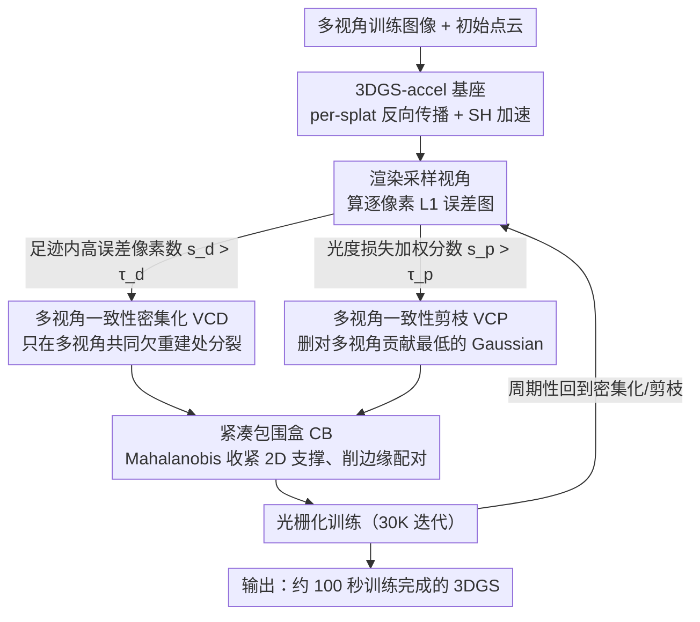

# FastGS: Training 3D Gaussian Splatting in 100 Seconds

**会议**: CVPR2026  
**arXiv**: [2511.04283](https://arxiv.org/abs/2511.04283)  
**代码**: [fastgs.github.io](https://fastgs.github.io)  
**领域**: 3D视觉  
**关键词**: 3D Gaussian Splatting, 训练加速, 多视角一致性, Gaussian 密度控制, 剪枝策略

## 一句话总结

提出 FastGS，一个基于多视角一致性的 3DGS 加速框架，通过多视角一致性密集化（VCD）和多视角一致性剪枝（VCP）策略精准控制 Gaussian 数量，在 Mip-NeRF 360 等数据集上实现约 100 秒完成场景训练，相比 vanilla 3DGS 加速 15× 以上，且渲染质量可比。

## 背景与动机

1. **3DGS 训练时间瓶颈**：vanilla 3DGS 通常需要数十分钟训练一个场景，其自适应密度控制（ADC）产生大量冗余 Gaussian，导致计算开销居高不下，限制了实际部署的用户体验。

2. **现有密集化策略不足**：Taming-3DGS 虽考虑了多视角信息，但其基于 Gaussian 关联属性（opacity、scale、gradient）的评分方式无法严格约束多视角一致性，仍然产生数百万冗余 Gaussian。

3. **现有剪枝策略效果有限**：Speedy-Splat 通过 Hessian 近似累积进行剪枝，间接利用多视角信息，导致渲染质量显著下降；其他方法基于 opacity 或 scale 的简单阈值同样无法有效消除冗余。

4. **缺乏严格的多视角一致性约束**：大量 Gaussian 仅在少数视角贡献渲染质量，却在其他视角几乎无用，也就是说它们并未满足"bundle adjustment"式的多视角一致约束。

5. **Budget 机制的局限性**：DashGaussian 等方法通过预算机制限制 Gaussian 数量，但场景仍需保留数百万 Gaussian 才能维持质量，实际加速效果有限。

6. **光栅化阶段仍有优化空间**：vanilla 3DGS 的 3-sigma 规则生成大量冗余 Gaussian-tile 配对，即使 Speedy-Splat 的精确 tile 交叉策略也未完全解决边缘 Gaussian 的无效覆盖问题。

## 方法详解

### 整体框架

FastGS 要解决的是 vanilla 3DGS 训练慢、Gaussian 冗余的问题。它的核心思路是把"多视角一致性"当成贯穿始终的统一标尺——在密集化和剪枝两端都只保留对多视角渲染真正有贡献的 Gaussian，再用更紧的光栅化包围盒削掉边缘的无效覆盖。整个框架建立在 3DGS-accel 之上，训练过程中周期性地用 VCD 决定哪些 Gaussian 该分裂、用 VCP 决定哪些该删除，最后由 CB 收紧每个 2D Gaussian 的有效支撑范围。

### 关键设计

**1. 多视角一致性密集化 VCD：只在多视角都欠重建的地方新增 Gaussian**

针对 ADC、Taming 那种基于 Gaussian 自身属性（opacity/scale/gradient）间接评分、仍然产生数百万冗余的痛点，VCD 直接从"多视角重建质量"出发判断一个 Gaussian 要不要密集化。它随机采样 $K$ 个训练视角渲染图像并算逐像素 L1 误差图，对误差图做 min-max 归一化后用阈值 $\tau$ 标出高误差像素；再把每个 Gaussian 投影到 2D 得到足迹区域 $\Omega_i$，统计足迹内高误差像素的平均数量作为重要性分数 $s_d^i$，只有 $s_d^i$ 超过阈值 $\tau_d$（实验取 5）才允许密集化。这样新增的 Gaussian 一定服务于多视角共同的欠重建区域，而不是只讨好个别视角，因此无需 budget 机制就能把数量压下来——消融里它单独就把 264 万 Gaussian 降到 53 万。

**2. 多视角一致性剪枝 VCP：删掉对多视角渲染质量贡献最低的 Gaussian**

Speedy-Splat 用 Hessian 近似间接利用多视角信息来剪枝，结果渲染质量明显下降。VCP 沿用 VCD 的评分思路，但换成以整体光度损失衡量"删掉它会让质量退化多少"：对每个采样视角算 L1+SSIM 组合的光度损失 $E_\text{photo}$，剪枝分数 $s_p^i$ 取该 Gaussian 在各视角高误差像素数与光度损失加权积的归一化值，当 $s_p^i$ 超过阈值 $\tau_p$（设 0.9）就剪除。相比 Hessian 近似的间接判据，这种直接基于渲染质量退化的评分更精准，能在保质量的前提下大幅瘦身。

**3. 紧凑包围盒 CB：收紧 2D Gaussian 的有效支撑、削掉边缘无效配对**

vanilla 3DGS 的 3-sigma 规则会生成大量冗余的 Gaussian-tile 配对，即使 Speedy-Splat 的精确 tile 交叉也没完全解决边缘 Gaussian 的无效覆盖。CB 在其基础上用 Mahalanobis 距离设更严格的有效区域阈值，并用缩放因子 $\beta$ 控制 2D Gaussian 的有效支撑范围；$\beta$ 越小椭圆越紧致，边缘无效配对越少，从而进一步压缩光栅化开销。

### 损失函数 / 训练策略

- 基座为 3DGS-accel（vanilla 3DGS + Taming 的 per-splat 反向传播 + SH 优化加速）
- 密集化每 500 次迭代执行一次，到 15K 停止
- 剪枝在 15K 前每 500 次、15K 后每 3000 次执行
- 总训练 30K 迭代，使用 Adam 优化器

## 实验关键数据

### 表1：静态场景训练速度与质量对比（RTX 4090）

| 方法 | Mip-NeRF 360 Time (min) | PSNR↑ | SSIM↑ | #Gaussian↓ | FPS↑ |
|------|------------------------|-------|-------|------------|------|
| 3DGS | 20.93 | 27.53 | 0.812 | 2.63M | 146 |
| Taming-3DGS | 5.36 | 27.48 | 0.794 | 0.68M | 221 |
| DashGaussian | 6.35 | 27.73 | 0.817 | 2.40M | 155 |
| Speedy-Splat | 13.38 | 26.91 | 0.781 | 0.30M | 552 |
| **FastGS** | **1.93** | 27.56 | 0.797 | **0.40M** | **579** |
| FastGS-Big | 3.58 | **27.93** | **0.820** | 1.15M | 469 |

### 表2：消融实验（Mip-NeRF 360）

| 方法 | Time (min)↓ | PSNR↑ | #Gaussian↓ | FPS↑ |
|------|------------|-------|------------|------|
| 3DGS-accel (baseline) | 7.10 | 27.46 | 2.64M | 182 |
| +VCD | 3.53 | 27.69 | 0.53M | 222 |
| +VCP | 5.32 | 27.70 | 1.96M | 285 |
| +CB | 6.13 | 27.44 | 2.78M | 303 |
| Full (VCD+VCP+CB) | **1.93** | 27.56 | **0.40M** | **579** |

VCD 是最大贡献者，将 Gaussian 数量从 264 万降到 53 万（降 80%），训练加速 2× 以上。

## 亮点

1. **极致训练速度**：最快 77 秒完成一个场景训练（Tanks & Temples），平均约 100 秒，远超现有 SOTA
2. **简单且通用**：VCD/VCP 不需要 budget 机制，可直接应用于动态重建、表面重建、稀疏视角重建、大尺度重建、SLAM 等多种任务，均实现 2-6× 加速
3. **多视角一致性理念深刻**：类比 bundle adjustment，要求每个 Gaussian 对多视角渲染均有正贡献，而非仅服务个别视角
4. **兼容多种 backbone**：Mip-Splatting 加速 8.8×、Scaffold-GS 加速 3.6×，均保持渲染质量
5. **FastGS-Big 变体超越 DashGaussian**：PSNR 高 0.2dB、训练时间减少 43.6%、Gaussian 数量减半

## 局限与展望

1. **不适用于 feed-forward 3DGS 后训练**：这类方法输出的 Gaussian 极为稠密，VCP 在短短数千次迭代内难以有效剪枝大量点，即使 3K 迭代的后训练仍需约 20 秒
2. **渲染质量非最优**：FastGS 默认配置在极致加速下 LPIPS 指标略逊于 DashGaussian 和 vanilla 3DGS
3. **阈值敏感性**：τ_d、τ_p、β 等超参数需要针对不同场景调节，论文未充分讨论其鲁棒性
4. **仅在 RTX 4090 上测试**：未展示不同 GPU 硬件上的加速效果迁移性
5. **重建质量与速度的 trade-off 仍存在**：FastGS-Big 质量更好但速度减半，说明两者之间的 Pareto 前沿仍有探索空间

## 与相关工作的对比

- **vs Taming-3DGS**：同样考虑多视角信息，但 Taming 基于 Gaussian 属性（opacity/scale/gradient）间接评估，约束不够严格，仍然需要 68 万 Gaussian。FastGS 直接评估对重建质量的贡献，40 万 Gaussian 即可达相近质量
- **vs Speedy-Splat**：其剪枝基于 Hessian 近似梯度，间接利用多视角一致性导致渲染质量严重下降（PSNR 26.91 vs FastGS 27.56）。FastGS 的 VCP 在保质量的同时剪枝更精准
- **vs DashGaussian**：当前 SOTA，通过分辨率调度维持质量，但仍需 240 万 Gaussian。FastGS-Big 以一半 Gaussian 数量超越其质量
- **vs Mini-Splatting**：基于交集保持的简化策略，Gaussian 数量虽低（53 万）但训练速度（17.69 min）远慢于 FastGS

## 启发与关联

- 多视角一致性评分的思想可推广至任何需要控制点云/primitive 数量的 3D 表示学习任务
- VCD/VCP 的"基于重建质量误差图"评分方式可与 importance sampling 结合用于 NeRF 加速
- CB 的 Mahalanobis 距离剪枝思路可迁移到其他 tile-based 光栅化方法

## 评分

- 新颖性: ⭐⭐⭐⭐ — 多视角一致性密集化/剪枝的思路简洁且有效，虽然各组件设计不复杂但组合效果强
- 实验充分度: ⭐⭐⭐⭐⭐ — 6 类任务 + 多种 backbone + 多数据集 + 消融实验非常全面
- 写作质量: ⭐⭐⭐⭐ — 动机分析清晰、图示对比直观，补充材料详实
- 价值: ⭐⭐⭐⭐⭐ — 100 秒训练 3DGS 具有重大实用价值，通用性强

<!-- RELATED:START -->

## 相关论文

- [\[CVPR 2025\] DashGaussian: Optimizing 3D Gaussian Splatting in 200 Seconds](../../CVPR2025/3d_vision/dashgaussian_optimizing_3d_gaussian_splatting_in_200_seconds.md)
- [\[CVPR 2026\] Speeding Up the Learning of 3D Gaussians with Much Shorter Gaussian Lists](speeding_up_the_learning_of_3d_gaussians_with_much_shorter_gaussian_lists.md)
- [\[CVPR 2026\] VarSplat: Uncertainty-aware 3D Gaussian Splatting for Robust RGB-D SLAM](varsplat_uncertainty-aware_3d_gaussian_splatting_for_robust_rgb-d_slam.md)
- [\[CVPR 2026\] Proxy-GS: Unified Occlusion Priors for Training and Inference in Structured 3D Gaussian Splatting](proxy-gs_unified_occlusion_priors_for_training_and_inference_in_structured_3d_ga.md)
- [\[CVPR 2026\] Rethinking Pose Refinement in 3D Gaussian Splatting under Pose Prior and Geometric Uncertainty](rethinking_pose_refinement_in_3d_gaussian_splatting_under_pose_prior_and_geometr.md)

<!-- RELATED:END -->
