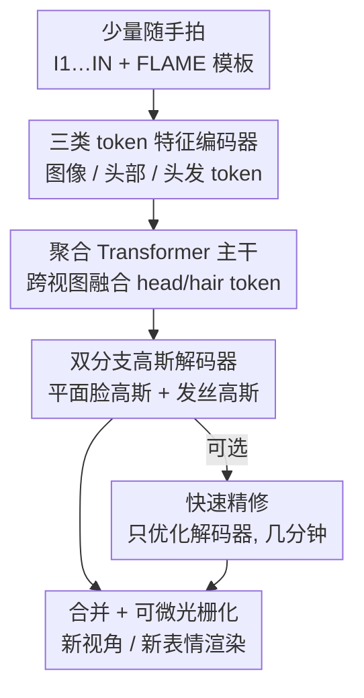

# FHAvatar: Fast and High-Fidelity Reconstruction of Face-and-Hair Composable 3D Head Avatar from Few Casual Captures

**会议**: CVPR 2026  
**论文**: [CVF Open Access](https://openaccess.thecvf.com/content/CVPR2026/html/Sun_FHAvatar_Fast_and_High-Fidelity_Reconstruction_of_Face-and-Hair_Composable_3D_Head_CVPR_2026_paper.html)  
**代码**: 待确认  
**领域**: 3D视觉  
**关键词**: 3D 头部 avatar、3D 高斯、人脸-头发解耦、发丝高斯、前馈重建

## 一句话总结
FHAvatar 用一个前馈聚合 Transformer，从手机随手拍的几张照片在几分钟内重建出「人脸与头发可拆分组合」的 3D 高斯头部 avatar——人脸用 UV 平面高斯、头发用绑在头皮上的发丝高斯，两者在纹理空间显式解耦，支持实时驱动、发型迁移和贴图风格化编辑。

## 研究背景与动机

**领域现状**：可驱动的逼真 3D 头部 avatar 一般靠 NeRF 或 3D Gaussian Splatting（3DGS）配合 FLAME 这类参数化几何模型来建模，近年质量提升明显。

**现有痛点**：两条路都不好走。其一，绝大多数高质量方法把头发当作头皮的「延伸/形变」，忽略了头发在风格、密度、长度上的剧烈差异和发丝级（strand-level）的精细几何，导致长发、卷发渲染糊成一团，也无法支持发型迁移、物理仿真这类下游应用；其二，质量好的方法大多是 identity-specific 的——依赖密集多视图采集和长时间逐人优化（动辄 1~5 小时），完全不适合消费级、手机随手拍的场景。最近一批前馈泛化模型（在大规模视频上训练）虽快，但往往限定单视图或固定视角输入，在稀疏输入下不鲁棒、还会引入 3D 不一致的伪影。

**核心矛盾**：人脸几何在不同身份间结构先验稳定、可以用模板高斯密铺；而头发千变万化、必须发丝级建模。把两者塞进同一套统一表示里，要么牺牲头发细节，要么牺牲效率与泛化。

**本文目标**：从任意数量（1~6 张甚至更多）、无序的随手拍照片，分钟级地前馈重建出人脸/头发显式分离、可实时驱动的高保真 3DGS 头像。

**切入角度**：既然人脸和头发的几何特性根本不同，就不要在统一建模里耦合它们，而是在纹理（UV）空间里**显式解耦**——人脸用平面高斯，头发用基于发丝的高斯，再用一个能吃任意视图数的聚合 Transformer 学跨视图先验把它们融起来。

**核心 idea**：用「平面高斯建脸 + 发丝高斯建发」的双表示替代统一头部表示，靠前馈聚合 Transformer 从少量随手拍中提取并融合多视图先验，一次前向 + 可选轻量精修即可成片。

## 方法详解

### 整体框架
FHAvatar 是一个端到端前馈 pipeline，全程在 FLAME 的 UV（纹理）空间里预测一颗「人脸+头发」组合的 3D 高斯头。给定几张无序输入图 $I=\{I_1,\dots,I_N\}$，模型先用**特征编码器**抽出三类 token（图像 token、头部几何 token、头发 token）；这些 token 送进**聚合 Transformer 主干**，以 head/hair token 作 query、对所有图像 token 做跨视图注意力，融合出几何感知的跨视图先验；最后由**双分支高斯解码器**分别解码出人脸的平面高斯和头发的发丝高斯，合并后按目标表情/视角做可微光栅化渲染。训练完成后，对新身份只需一次前向即可成片，再加一个**可选的快速精修**（只微调解码器，几分钟）进一步提个性化细节。

贯穿全流程的脊柱是「人脸/头发在纹理空间显式解耦」这一表示选择：它在编码器（独立的 hair token）和解码器（独立的双分支）两端都有体现，使得最终高斯天然分成可拆分的两组。

### 关键设计

**1. 纹理空间显式解耦人脸与头发：用两种几何表示匹配两种几何特性**

这是全文的根。以往方法把头发当头皮形变、和人脸共用一套统一高斯，长发/卷发就糊。FHAvatar 在 FLAME 的 UV 纹理空间里把两者拆开：**人脸用平面高斯（planar Gaussians）**——UV 图每个像素解一个高斯，绑到对应三角面上，靠 FLAME blendshape 跟随表情形变，密铺即可表达脸部相对稳定的几何；**头发用发丝高斯（strand-based Gaussians）**——头皮区域每个 UV 像素长出一整条由 $S=256$ 段连成的发丝，每段贴一个细长高斯，对齐真实头发的物理结构。两组高斯共用一套头皮 UV 空间但互相独立，这既让长发、卷发能被发丝几何精确刻画，又让「换发型」「编辑贴图」这类操作可以只动其中一支，是后续所有应用的基础。

**2. 三类 token 的特征编码器：把外观、头部结构、发型先验分别喂进 Transformer**

输入侧把信息拆成三路 token。**图像 token** 用冻结的 DINOv2 抽多尺度表示、再过可训练的简化版 DPTHead 精炼，$T_{image}=\mathrm{DPTHead}(\mathrm{DINOv2}(I))\in\mathbb{R}^{N\times P\times C}$，浅层带高频纹理、深层带全局外观先验。**头部几何 token** 来自 FLAME：把规范模板网格顶点的 3D 坐标投到 UV 得位置图，逐像素做位置编码后过 MLP，$T_{head}=\mathrm{MLP}(\gamma(X))\in\mathbb{R}^{H_{uv}\times W_{uv}\times C}$，提供头部结构先验。**头发 token** 先挑最接近正面的图 $I_f$，用在合成数据上预训练的单目发型模型 DiffLocks 抽出发型特征 $f_{hair}$；但单目估计常有结构误差，于是和图像 token 做跨注意力引入多视图一致性：$T_{hair}=\mathrm{CrossAttn}(T_{image},f_{hair})+T^{scalp}_{head}$，其中 $T^{scalp}_{head}$ 是头皮子集、当空间位置编码。三类 token 的分工，正好对应「外观 / 头部结构 / 发型」三种先验来源。

**3. 聚合 Transformer 主干：用 query 化的 head/hair token 吃下任意数量视图**

痛点是真实随手拍数量 $N$ 任意且无序，模型必须对视图数鲁棒。主干由若干「聚合块」堆叠：每块里 head（或 hair）token 作 query，对**所有**图像 token 做跨注意力，从而推断多视图间的投影关系、补偿与模板头网格的结构偏差；同时借鉴 VGGT，把 $N$ 张图 reshape 到 batch 维做帧内自注意力。以 head token 为例：

$$T_{head}\leftarrow \mathrm{CrossAttn}(T_{head},T_{image};\psi),\quad T_{image_i}\leftarrow \mathrm{SelfAttn}(T_{image_i},T_{image_i})$$

其中 $\psi$ 是从输入图跟踪到的 FLAME 表情参数，拼到图像 token 上。hair token 走同样流程，但 head 与 hair 的跨注意力层各自独立，而**自注意力层有一半共享**——既保住两支的差异，又促进头与发表示之间的一致性。这套设计让模型能同时从单目和多视图数据学先验，对输入帧数天然可变。

**4. 双分支高斯解码器 + 密度图自适应发丝采样：分别解码、按发型自适应控点数**

主干输出后由双分支解码。**人脸分支**：解码器共享卷积主干、各属性用独立 MLP 头，从 $T_{head}$ 解出每个 UV 像素一个高斯的位置偏移 $\Delta p$、协方差、旋转、不透明度、颜色，偏移是相对所绑三角面的局部位移，调 UV 分辨率即可调高斯总数、权衡质量与速度。**头发分支**：单像素一个高斯撑不起卷发/长发，于是每个头皮 UV 像素用冻结的 DiffLocks 发丝生成器（几层 modulated SIREN）解出 $S=256$ 个方向向量 $d_{1:S}=D_{dir}(\gamma T_{hair}+f_{hair})$（$\gamma$ 是修正项的正则系数），从头皮根点起逐段累加 $v_s=v_{s-1}+d_s$ 连成发丝；每段配一个发丝高斯，位置取段中点 $p_s=\tfrac12(v_{s-1}+v_s)$、长轴等于半段长、两短轴固定为小半径 $r$（$\sigma_s=(\tfrac12\|d_s\|_2,\,r,\,r)^\top$），颜色/透明度也从 $T_{hair}$ 解。为防高斯过多压垮渲染器，从 $T_{hair}$ 再解一张**头皮 UV 密度图**，按平均发长（短/中/长）自适应下采样发丝、并对每条减少段数 $S$：检测到短发就调小 $S$、增大半径 $r$ 以保持头皮覆盖。这一支是「质量 vs 渲染开销」之间的关键调节阀。

### 损失函数 / 训练策略
总损失 $L_{total}=L_{hair}+L_{photo}+L_{reg}$ 三项。**头发区域损失** $L_{hair}=\lambda_{hair}\|\hat I_{hair}-I_{hair}\|^2+\lambda_{seg}\|\hat I_{seg}-I_{seg}\|^2$：用解析 mask 取头发区，单独监督只由头发高斯渲出的图，再加双分支语义渲染的 L2 约束，专治短发时「人脸高斯爬到头顶占掉头发区」的问题，逼出干净的人脸/头发分离。**光度损失** $L_{photo}=L_1+\lambda_{ssim}L_{ssim}+\lambda_{lpips}L_{lpips}$ 在新视角/新表情下用 GT 监督。**正则项** $L_{reg}$ 对位置偏移与缩放各做阈值化 L2 惩罚，压住极端值以免重建/驱动时炸出伪影。权重 $\lambda_{hair}=\lambda_{seg}=0.3,\ \lambda_{ssim}=0.5,\ \lambda_{lpips}=0.02,\ \lambda_{pos}=\lambda_{scale}=0.1$。训练用 Adam + cosine 调度、初始 lr 1e-4、batch size 1、2 张 H20 上 5 万步约 4 天。**快速精修**：冻结编码器和主干，只联合优化预测出的 $T_{head},T_{hair}$ 与双分支解码器，对输入数据微调 100 个 epoch，几分钟内提升个性化保真度和对野外光照的适应。

## 实验关键数据

### 主实验
数据集为 NeRSemble（202 人、约 7 万帧、16 视角系统），训练 195 人、留 7 人测试，每样本随机取 1~6 张作输入、4 张不同视角/表情作监督；另自采约 4k 帧/6 人的手机野外数据作补充测试集。评测在单张 RTX 4090 上跑，指标含 PSNR/SSIM/LPIPS + 人脸专用的 AKD（关键点距离）和 CSIM（ArcFace 身份相似度）。下表摘取代表性输入设置（Ours 均为 full）：

| 输入帧数 | 方法 | PSNR↑ | SSIM↑ | LPIPS↓ | AKD↓ | CSIM↑ | 建模时间↓ | FPS↑ |
|--------|------|------|------|------|------|------|--------|------|
| 1 帧 | LAM | 16.41 | 0.662 | 0.409 | 48.64 | 0.461 | 0.31 s | 142.8 |
| 1 帧 | **Ours** | **22.80** | **0.797** | **0.303** | **3.66** | **0.665** | 49.0 s | 259.6 |
| 3 帧 | GaussianAvatars | 21.68 | 0.747 | 0.328 | 13.00 | 0.347 | ∼1.2 h | 47.2 |
| 3 帧 | **Ours** | **23.40** | **0.813** | **0.295** | **3.37** | **0.700** | 49.2 s | 258.2 |
| 6 帧 | GaussianAvatars | 23.44 | 0.784 | 0.300 | 7.41 | 0.465 | ∼1.5 h | 48.2 |
| 6 帧 | **Ours** | **23.71** | **0.825** | **0.296** | **3.08** | **0.721** | 52.2 s | 246.9 |
| 16 帧 | GaussianAvatars | 23.50 | 0.769 | **0.152** | 5.54 | 0.629 | ∼4.2 h | 32.8 |
| 16 帧 | **Ours** | **24.22** | **0.837** | 0.271 | **2.72** | **0.770** | 130.1 s | 242.2 |

PSNR 在 3/6/16 帧下分别领先次优 1.72 / 0.27 / 0.72。AKD 一项断层领先（单帧 3.66、多帧低至 2.72，对手普遍 5~85），说明表情/姿态重演极准。建模时间比优化类方法快 10×~100×（分钟级 vs 1~5 小时），并因把坐标计算与渲染解耦支持高达约 250 FPS 实时驱动。唯一例外是 16 帧下 GaussianAvatars 的 LPIPS 0.152 更低，但它要 4.2 小时优化、AKD/CSIM 仍逊。

### 消融实验
（注：消融表为单独设置，Full 的 PSNR 基准 25.14 与主表数值不同口径）

| 配置 | PSNR↑ | SSIM↑ | LPIPS↓ | 说明 |
|------|------|------|------|------|
| Full | 25.14 | 0.796 | 0.333 | 完整模型 |
| w/o Hair Branch | 23.32 | 0.782 | 0.421 | 去发丝分支，退回 FLAME UV 整头预测 |
| w/o Region Loss | 25.04 | 0.794 | 0.336 | 去头发区域损失 |
| w/o Finetune | 23.85 | 0.780 | 0.382 | 去快速精修（单次前向） |

### 关键发现
- **发丝分支贡献最大**：去掉后 PSNR/SSIM/LPIPS 掉 1.82 / 0.014 / 0.088，绑在 FLAME 模板上的高斯撑不起长发区、且前馈模型无法自适应高斯数量，头发糊成非发丝状几何——印证「柔性头发与固定人脸分开建模」是自然且有效的选择。
- **头发区域损失**虽对全局 PSNR 影响小（25.14→25.04），但去掉后头发（尤其头顶）无法和头皮清晰分离，直接伤害发型迁移等下游应用。
- **快速精修**带来 1.29 / 0.016 / 0.049 的 PSNR/SSIM/LPIPS 提升，在单次前向已成型的基础上进一步恢复个体细节。
- **增量重建**：输入从 1 帧涨到 6 帧时质量快速提升、6 帧后趋于平台，更多视图主要补眼窝、牙齿等动态细节，体现对任意帧数的灵活性。

## 亮点与洞察
- **「拆」得彻底**：不是简单地给头发加个 loss，而是从表示（平面高斯 vs 发丝高斯）、编码（独立 hair token）、解码（双分支）到 UV 绑定全链路把人脸/头发解耦，换来「发型可整支替换、贴图可直接 3D 编辑」的免优化应用，是最让人「啊哈」的地方。
- **借力而不重造轮子**：DINOv2 出图像先验、FLAME 出头部几何、DiffLocks 出发型先验、VGGT 式 batch 化自注意力吃任意视图——把多个成熟基础模型当先验拼成前馈管线，再用聚合 Transformer 做多视图一致化修正。
- **密度图自适应采样**是个可迁移的工程巧思：用一张轻量 UV 密度图按发长动态控发丝数与高斯半径，在「质量」和「渲染器负担」之间给了一个连续旋钮。
- **UV 空间绑定 = 2D 编辑直升 3D**：编辑纹理图就能 3D 一致地改 avatar，省掉再推理/迭代训练，对内容创作很友好。

## 局限与展望
- **依赖外部先验模型**：发型质量受 DiffLocks 上限制约（其发丝生成器被冻结），人脸几何受 FLAME 拓扑约束，遇到模板覆盖不到的极端发型/配饰可能力不从心。
- **训练成本不低**：虽然推理分钟级，但训练需 2×H20、约 4 天，且依赖 NeRSemble 这类多视图数据集学先验。
- **野外泛化仍靠精修兜底**：单次前向已不错，但适应真实光照/多样身份往往还要可选精修，纯零样本前向的天花板有待观察。⚠️ 论文未给精修前后在野外数据上的定量对比，以原文为准。
- **改进方向**：把发丝生成器也端到端可训、引入物理仿真约束、或扩展到全头（含眼镜/帽子等配件）的可组合解耦。

## 相关工作与启发
- **vs GaussianAvatars / FlashAvatar / MeGA（优化类）**：它们逐人优化、质量高但要密集多视图和 1~5 小时，稀疏输入下常拟合失败甚至塌陷；FHAvatar 前馈出片、分钟级、稀疏鲁棒，AKD/CSIM 全面更好。
- **vs GAGAvatar / LAM（前馈类）**：它们能从单图生成可驱动 avatar，但难维持多视图身份一致、对新姿态控制差（SSIM 尚可但 AKD/PSNR 明显更差）；FHAvatar 用聚合 Transformer 吃多视图、显式解耦头发，一致性与可控性更强。
- **vs DiffusionRig（扩散类）**：能合成相似人脸但分辨率低、常违反相机约束导致定位错位（AKD 高达 56）；FHAvatar 是显式 3DGS、几何一致。
- **vs Avat3r / 固定视角前馈**：它们限定固定数量/视角输入，FHAvatar 支持任意数量、无序的随手拍，更贴近消费级移动采集。

## 评分
- 新颖性: ⭐⭐⭐⭐⭐ 纹理空间显式解耦人脸/头发 + 前馈聚合 Transformer，组合解耦的可拆分 avatar 思路有辨识度
- 实验充分度: ⭐⭐⭐⭐ 多帧数设置 + 自采野外数据 + 完整消融，但消融与主表口径不一、野外定量略缺
- 写作质量: ⭐⭐⭐⭐ pipeline 与公式清晰，三类 token/双分支讲得明白
- 价值: ⭐⭐⭐⭐⭐ 分钟级、稀疏输入、实时驱动 + 发型迁移/贴图编辑，对消费级 avatar 创作落地价值高

<!-- RELATED:START -->

## 相关论文

- [\[CVPR 2026\] UIKA: Fast Universal Head Avatar from Pose-Free Images](uika_fast_universal_head_avatar_from_pose-free_images.md)
- [\[CVPR 2026\] FACE: A Face-based Autoregressive Representation for High-Fidelity and Efficient Mesh Generation](face_a_face-based_autoregressive_representation_for_high-fidelity_and_efficient_.md)
- [\[CVPR 2026\] ShapeR: Robust Conditional 3D Shape Generation from Casual Captures](shaper_robust_conditional_3d_shape_generation_from_casual_captures.md)
- [\[CVPR 2026\] HyperGaussians: High-Dimensional Gaussian Splatting for High-Fidelity Animatable Face Avatars](hypergaussians_high-dimensional_gaussian_splatting_for_high-fidelity_animatable_.md)
- [\[CVPR 2026\] Skullptor: High Fidelity 3D Head Reconstruction in Seconds with Multi-View Normal Prediction](skullptor_high_fidelity_3d_head_reconstruction_in_seconds_with_multi-view_normal.md)

<!-- RELATED:END -->
