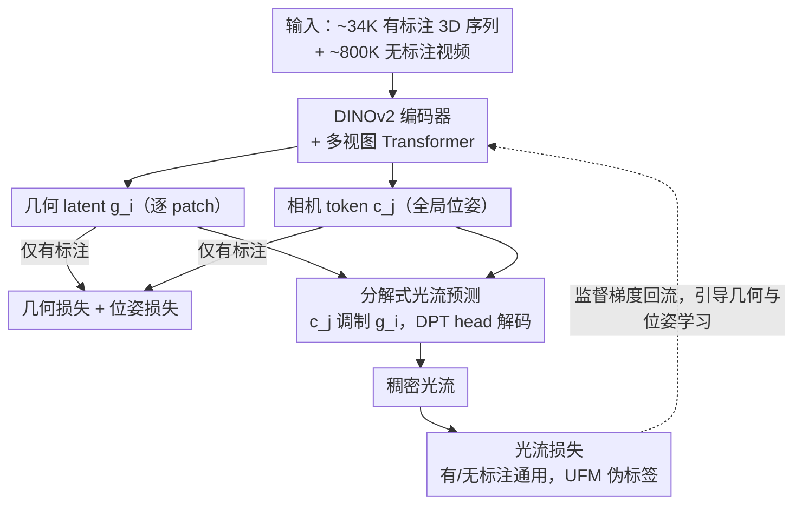

# Flow3r: Factored Flow Prediction for Scalable Visual Geometry Learning

**会议**: CVPR2026  
**arXiv**: [2602.20157](https://arxiv.org/abs/2602.20157)  
**代码**: [flow3r-project.github.io](https://flow3r-project.github.io/)  
**领域**: 3D视觉  
**关键词**: visual geometry, factored flow, 3D reconstruction, unlabeled video, correspondence learning, dynamic scenes

## 一句话总结

提出"分解式光流预测"（Factored Flow）模块，用源视图的几何 latent + 目标视图的位姿 latent 预测光流，使无标注视频可作为三维几何学习的监督信号，在静态/动态场景的 8 个基准上达到 SOTA。

## 背景与动机

1. **前馈式三维重建依赖昂贵标注**：DUSt3R、VGGT、π³ 等方法需要稠密深度 + 相机位姿的监督数据，获取代价极高，尤其在野外动态场景几乎不可得。
2. **标注数据无法大规模扩展**：不同于 LLM/ViT 可用自监督目标在海量无标注数据上训练，三维几何学习受限于标注规模，难以像语言/视觉那样有效 scaling。
3. **现有光流监督（VGGT tracking head）不够有效**：VGGT 采用基于 patch 特征匹配的跟踪头预测光流，但这仅鼓励视觉判别性特征，不能直接促进位姿和几何的学习。
4. **投影式光流不稳定且无法处理动态场景**：直接用预测的 pointmap 和相机参数做投影计算光流，对几何误差极为敏感，且无法建模场景运动。
5. **无标注视频是巨大的潜在资源**：互联网上有海量无标注单目视频，若能利用其中的 2D 对应关系作为监督，可极大扩展训练数据。
6. **2D 稠密对应模型已经成熟**：UFM、RoMa、CoTracker 等模型可为任意图像对提供高质量的伪标签光流，为利用无标注视频提供了基础。

## 方法详解

### 整体框架

Flow3r 想解决的是前馈三维重建依赖昂贵 3D 标注、无法像语言/视觉那样靠海量数据 scaling 的问题。它的做法是在标准多视图 Transformer（VGGT/π³）上加一个**分解式光流预测头**，让无标注视频里现成的 2D 稠密对应也能当作三维几何的监督信号。具体数据流是：每张输入图像先经 DINOv2 编码器和多视图 Transformer，输出逐 patch 的几何 latent $\mathbf{g}_i$ 和全局相机 token $\mathbf{c}_j$；有标注数据直接用 3D 标签监督这两路，无标注视频则进入分解式光流头——用目标视图的 $\mathbf{c}_j$ 调制源视图的 $\mathbf{g}_i$，经 DPT head 解码出稠密光流并由 UFM 伪标签监督。训练时把 ~34K 有标注 3D 序列和 ~800K 无标注视频混在一起联合优化，光流监督的梯度顺着这个头回流到几何分支和位姿分支。

### 关键设计

**1. 分解式光流预测：让无标注视频的光流监督直接喂给几何和位姿分支**

VGGT 的 tracking head 用两视图 patch 特征匹配预测光流，只增强视觉判别力、并不促进几何/位姿学习；直接拿预测的 pointmap 投影算光流又对几何误差极敏感、且只能处理静态场景。Flow3r 抓住一个观察：静态场景下从源视图到目标视图的光流，只取决于**源视图的场景几何**和**目标视图的相机位姿**。据此设计非对称预测

$$\hat{\mathbf{F}}_{i \rightarrow j} = \Phi_{\text{flow}}(\mathbf{g}_i, \mathbf{c}_j)$$

其中 $\mathbf{g}_i$ 是源视图经多视图 Transformer 输出的逐 patch 几何特征、$\mathbf{c}_j$ 是目标视图的相机 token（全局位姿特征），用 $\mathbf{c}_j$ 对 $\mathbf{g}_i$ 做调制后再经 DPT head 解码出稠密光流。这种非对称设计的好处是：光流的监督梯度被强制分流到几何分支和位姿分支，迫使前者学到真实三维结构、后者学到真实相机运动；又因为全程在 latent 空间操作、不依赖显式几何解码，比投影式更鲁棒，还能自然推广到动态场景（光流隐式编码了相机运动 + 场景运动）。代价是信息瓶颈让单独的光流精度不如 patch 匹配，但对几何的监督效果最优——这正是它和几种替代设计的根本区别：

| 设计 | 原理 | 缺陷 |
|------|------|------|
| flow-tracking (VGGT) | 用两视图 patch 特征匹配预测光流 | 仅增强视觉判别力，不促进几何/位姿学习 |
| flow-projective | 用预测的 pointmap + 相机参数做投影 | 对误差敏感、仅限静态场景 |
| **flow-factored (本文)** | 几何 latent + 位姿 latent 解码 | 信息瓶颈限制了单独的光流精度，但几何监督效果最优 |

### 损失函数 / 训练策略

监督信号分两部分：有标注数据用相机位姿损失 $\mathcal{L}_{\text{cam}}$ + 几何损失 $\mathcal{L}_{\text{geo}}$（含最优对齐的 pointmap loss）；光流损失对有/无标注都适用，用共视 mask 加权的鲁棒 Charbonnier 回归

$$\mathcal{L}_{\text{flow}} = \frac{1}{\sum_p \mathbf{C}[p]} \sum_p \mathbf{C}[p] \cdot \ell_{\text{robust}}(\|\hat{\mathbf{u}}_{i\to j}[p] - \mathbf{u}_{i\to j}[p]\|_2)$$

无标注数据的光流伪标签由预训练的 UFM 生成。训练分两阶段：先冻结 backbone、只训新增的光流预测头（在有标注数据上），再解冻全模型、用有标注 + 无标注数据端到端微调。

## 实验关键数据

### 动态场景（Tab. 2）

| 方法 | Kinetics RPE-t↓ | EPIC RPE-t↓ | Sintel MSE↓ | Bonn f-score↑ |
|------|:---:|:---:|:---:|:---:|
| DUSt3R | 0.063 | 0.110 | 0.622 | 0.800 |
| CUT3R | 0.027 | 0.081 | 0.676 | 0.899 |
| VGGT | 0.038 | 0.049 | 0.595 | 0.884 |
| π³ | 0.023 | 0.043 | 0.523 | 0.905 |
| **Flow3r** | **0.018** | **0.037** | **0.426** | **0.954** |

Flow3r 在全部 4 个动态数据集的全部指标上取得最优，位姿和几何均有显著提升。

### 静态场景（Tab. 3）

| 方法 | 7-Scenes RTA↑ | 7-Scenes MSE↓ | NRGBD f-score↑ | ScanNet RTA↑ |
|------|:---:|:---:|:---:|:---:|
| π³ | 87.69 | 0.169 | 0.983 | 91.14 |
| **Flow3r** | **91.66** | **0.102** | **0.992** | 92.89 |

动态数据带来的增益也迁移到了静态场景，7-Scenes 上 MSE 从 0.169 降到 0.102（↓40%）。

### 消融：Scaling 无标注数据（Tab. 4）

| 有标注 | 无标注 | RRA@30↑ | MSE↓ |
|:---:|:---:|:---:|:---:|
| 11K | 0 | 66.01 | 0.637 |
| 11K | 3K | 76.26 | 0.598 |
| 11K | 10K | 78.45 | 0.560 |
| 11K | 20K | 81.12 | 0.532 |
| 44K (纯有标注) | 0 | 78.68 | 0.565 |

1K 有标注 + 20K 无标注 > 4K 纯有标注，证明无标注视频通过光流监督可替代昂贵的 3D 标注。

### 消融：光流预测机制对比（Tab. 1）

- flow-tracking（VGGT 式）几乎不提升几何质量
- flow-projective 甚至导致性能下降
- flow-factored 在静态/动态场景上均一致优于基线和替代设计

## 亮点

- **分解式光流预测**是一个优雅且有效的设计，用信息瓶颈迫使几何 latent 学到真实的三维结构、位姿 latent 学到真实的相机运动
- 方法具有很好的**通用性**：可插入 VGGT 和 π³ 两种不同架构并均带来提升
- **Scaling 行为清晰**：无标注数据量与性能呈单调递增关系，证明方法的可扩展性
- 在 8 个涵盖静态/动态的基准上全面 SOTA，尤其在标注稀缺的野外动态视频上增益最大

## 局限与展望

- 依赖 UFM 等预训练模型提供光流伪标签，若 2D 对应模型在某些域失效则方法受限
- 对包含多个独立运动物体的复杂动态场景仍可能不鲁棒
- 当前实验规模 ~800K 序列，扩展到 10M-100M 量级的效果尚未验证
- 分解式光流本身的精度不如直接 patch 匹配（信息瓶颈的代价），无法作为独立光流估计器使用

## 与相关工作的对比

| 方法 | 监督类型 | 是否支持动态 | 是否需要位姿标注 | 核心思路 |
|------|---------|:-----------:|:--------------:|---------|
| DUSt3R | 全监督 | ✗ | ✓ | 双视图 pointmap 回归 |
| VGGT | 全监督 + tracking head | ✓ | ✓ | 多视图 Transformer + patch 匹配光流 |
| π³ | 全监督 | ✓ | ✓ | 局部坐标预测 + 置换等变 |
| CUT3R | 全监督 | ✓ | ✓ | 流式多视图推理 |
| MegaSAM | 优化式 | ✓ | ✗ | 单目深度先验 + 逐视频优化 |
| **Flow3r** | **半监督** | **✓** | **部分** | **分解式光流 + 无标注视频 scaling** |

## 评分

- 新颖性: ⭐⭐⭐⭐ — 分解式光流预测的 insight 简洁深刻，非对称设计有理论支撑
- 实验充分度: ⭐⭐⭐⭐⭐ — 8 个基准、3 种对比设计、scaling 曲线、多 backbone 验证、定性对比
- 写作质量: ⭐⭐⭐⭐ — 结构清晰，图表丰富，动机阐述到位
- 价值: ⭐⭐⭐⭐⭐ — 指出了三维几何学习 scaling 的可行路径，对领域有重要推动意义

<!-- RELATED:START -->

## 相关论文

- [\[CVPR 2026\] FlashVGGT: Efficient and Scalable Visual Geometry Transformers with Compressed Descriptor Attention](flashvggt_efficient_and_scalable_visual_geometry_transformers_with_compressed_descr.md)
- [\[CVPR 2026\] GAP: Action-Geometry Prediction with 3D Geometric Prior for Bimanual Manipulation](action-geometry_prediction_with_3d_geometric_prior_for_bimanual_manipulation.md)
- [\[CVPR 2026\] DVGT: Driving Visual Geometry Transformer](dvgt_driving_visual_geometry_transformer.md)
- [\[ICLR 2026\] Quantized Visual Geometry Grounded Transformer](../../ICLR2026/3d_vision/quantized_visual_geometry_grounded_transformer.md)
- [\[CVPR 2026\] Fast Spatial Tracking with Visual Geometry Transformer](fast_spatial_tracking_with_visual_geometry_transformer.md)

<!-- RELATED:END -->
