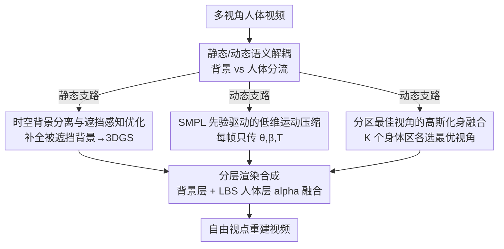

# GauMVC: Generative Decoupled Gaussian Representation for Human-centric Multi-view Video Compression

**会议**: CVPR 2026  
**论文**: [CVF Open Access](https://openaccess.thecvf.com/content/CVPR2026/html/Yan_GauMVC_Generative_Decoupled_Gaussian_Representation_for_Human-centric_Multi-view_Video_Compression_CVPR_2026_paper.html)  
**代码**: 待确认  
**领域**: 3D视觉 / 多视角视频压缩  
**关键词**: 多视角视频压缩, 3D 高斯泼溅, SMPL 人体先验, 语义解耦, 生成式压缩

## 一句话总结
GauMVC 把"以人为中心的多视角视频"显式拆成静态背景和动态人体两部分——背景用一次性的 3D 高斯场表示，人体只用少量关键视角 + 每帧 SMPL 姿态参数来驱动一个个性化高斯化身，从而把压缩从"去除像素冗余"转成"传语义参数再生成画面"，在极低码率下仍能合成高保真的自由视点视频。

## 研究背景与动机
**领域现状**：以人为中心的多视角视频（MVV）是沉浸式媒体（远程会议、虚拟课堂、自由视点导览）的基础。为了提升沉浸感就要堆更多相机视角，但数据量随视角数几乎线性增长，存储和传输成本爆炸。传统编码（MV-HEVC、3D-HEVC、MIV）靠帧间/视角间预测压缩，码率仍随视角数近似线性上升；近年的神经场景表示（NeRF、3DGS 及其动态扩展 4DGS）把整段视频建成一个统一的时变 3D 表示来去冗余，是更有希望的方向。

**现有痛点**：哪怕是把静态背景和动态前景分开建模的最新方法，对"动态部分"仍然是编码运动场（deformation field）或逐帧残差。问题在于：人的运动**不是任意的**，它被骨架运动学和人体解剖结构强约束，本质上落在一个由姿态和体型决定的低维空间里。用通用的逐点形变场去建模这种运动，等于完全浪费了它的低维结构先验。

**核心矛盾**：作者一针见血地指出——"关键问题不在于要不要分离（separation），而在于分离之后怎么压缩动态部分"。现有方法把人体运动当成一般形变/光流来编码高维运动信号，与人体运动的低维语义本质错配，导致巨大冗余和糟糕的率失真。

**本文目标**：把以人为中心 MVV 的压缩重新定义为"静态场景压缩 + 动态人体合成"的统一问题，用低维参数合成替代高维运动信号编码。

**切入角度**：既然人体运动可由 SMPL 这种参数化模型紧凑表达，那就不要再传运动场，而是只传"语义参数"，让解码端把画面生成出来。

**核心 idea**：编码端只发三样东西——背景高斯场、少量人体关键视角、每帧 SMPL 参数；解码端据此驱动 SMPL 化身并与背景融合，把压缩范式从"低级冗余去除"搬到"语义感知的生成式建模"。

## 方法详解

### 整体框架
GauMVC 输入是一段同步采集的多视角人体视频，输出是任意目标视角的重建视频，中间把整个场景**语义解耦**成两条互补的支路并分别压缩：

- **静态支路（Static Batch）**：从多视角序列里把被人遮挡过的背景"补全"出来，建一个时间一致的 3D 高斯背景场，再压成紧凑码流。它只编码一次。
- **动态支路（Dynamic Batch）**：用 SMPL 参数编码每帧姿态/体型（运动），用少量"关键视角"编码人的外观，解码端由此生成个性化高斯化身（avatar）。其中关键视角和体型也只传一次，只有 SMPL 姿态序列随帧数增长。

解码端做**分层渲染合成**：静态背景层直接渲染，动态人体层用解码出的 SMPL 参数对规范化身做线性混合蒙皮（LBS）变形后渲染出前景与 alpha 蒙版，最后按 $I_v^t = F_v^t \cdot \alpha_v^t + B_v^t \cdot (1-\alpha_v^t)$ 做 alpha 合成。由于背景和关键视角时间不变、只有 SMPL 流随时间增长，**总码率随帧数次线性增长**，而渲染像素数随帧数和视角数线性增长——这正是它在长序列、密采集场景下码率优势越来越大的根本原因。

### 关键设计

**1. 静态/动态语义解耦的压缩范式：把"传信号"改成"传语义再生成"**

这是全文的范式转变，针对的痛点是：把整段多视角视频当成单一表示去编码（或只做粗糙的前景/背景分离再编码运动场），会产生大量与人体运动低维本质错配的冗余。GauMVC 显式地把场景拆成"静态背景 + 动态人体"两个语义成分，编码端**只发三件东西**——背景高斯场、关键视角、SMPL 参数，完全不传任何低级运动残差。这样做的两个直接好处：一是码率大幅下降（高维运动场被低维参数合成替代）；二是带来语义可解释性——运动是用它的"成因"（姿态/体型）而非原始轨迹来编码的，因此天然支持内容编辑（换背景、换身份、动作重定向）。它和旧的"分离+编码运动场"方法的本质区别在于：旧方法分离后仍在压高维信号，GauMVC 分离后压的是低维语义并让解码端**生成**。

**2. 时空背景分离与遮挡感知优化：把被人挡掉的背景补干净再建高斯**

痛点很具体：人在动会不断遮挡背景，单帧根本拿不到干净背景，必须跨帧融合可见区域。静态支路是一个四阶段流水线。**(a) 时空静态区域提取**：对每个视角 $v$ 均匀抽关键帧，用预训练人体分割得到二值掩码 $M_v^t(p)$（1=可见背景，0=人），稍作膨胀防止人体边界泄漏，然后按时间把所有可见背景像素求平均得到融合背景 $B_v(p)=\frac{\sum_t M_v^t(p) I_v^t(p)}{\sum_t M_v^t(p)+\epsilon}$；同时算一个可见性掩码 $O_v(p)=1-\prod_t (1-M_v^t(p))$，把"在所有帧里都从未露出"的永久遮挡像素标为 0。**(b) 遮挡感知初始化**：只用静态区域跑 SfM 得稀疏点云并转成 3D 高斯 $\mathcal{G}=\{g_i\}$（每个含位置、协方差、不透明度、球谐系数），再用 $O_v$ 做投影过滤，只保留那些 2D 投影在所有视角都落在永久可见静态区的高斯 $\mathcal{G}_{\text{clean}} \leftarrow \{g_i \mid O_v(\pi(g_i))=1,\ \forall v\}$，剔除动态内容造成的鬼影点。**(c) 掩码引导优化**：直接拿整帧监督会把瞬态前景过拟合进背景，于是只在可靠背景像素上算损失 $\mathcal{L}_v = \sum_{p:O_v(p)=1}[(1-\lambda)\mathcal{L}_1(p) + \lambda \mathcal{L}_{\text{SSIM}}(p)]$（$\lambda=0.8$），梯度只来自静态内容。**(d) 高斯压缩**：先剪掉 $\alpha<\epsilon$ 的无效高斯，再按视觉敏感度做非均匀标量量化（位置/旋转精度高、高阶球谐激进量化），最后 Huffman 熵编码。整条链路保证背景既完整又干净，且压得很小。

**3. SMPL 先验驱动的低维运动压缩：每帧只传几十个参数而非整个运动场**

这一设计直接对应"动态部分怎么压"的核心矛盾。用逐帧/逐基元形变场建模人体运动既冗余又容易产生时间不一致或解剖学上不合理的结果；SMPL 则把体型和关节姿态压进一个低维参数空间。每帧用 $(\theta_t, \beta, T_t)$ 描述：$\theta_t \in \mathbb{R}^{72}$ 是关节旋转，$\beta \in \mathbb{R}^{10}$ 是时间不变的体型，$T_t \in SE(3)$ 是全局根变换。这样做有两个杀手锏：一是**消除跨视角冗余**——同一组参数能驱动所有视角的渲染，不必每个视角各存一份；二是**强制解剖学合理性**——蒙皮和姿态先验保证生成的人体不畸形。于是压缩退化为"编码一个体型向量 $\beta$ + 两个低维序列 $(\theta_t, T_t)$"，彻底避开高维运动场。参数从遮挡最少的视角初始化、再多视角联合优化，量化后运动的平滑性让整数流有强统计冗余，Huffman 编码进一步压缩。

**4. 分区最佳视角的高斯化身融合：靠多视角拼出无伪影的个性化外观**

SMPL 只给了运动，给不了个性化外观；而传完整多视角视频带宽受不了，单视角化身生成器又会在看不见的区域（后背、侧面）因视角外推误差产生严重伪影。作者的解法是**分区最佳视角融合**：把对齐到首帧的人体表面 $S$ 划成 $K$ 个区域 $\{P_r\}$（实验取 $K=5$）；对每个表面点 $p$ 和视角 $v$ 提深度特征 $z_{p,v}$，定义可见性置信分 $c_{p,v}=\|z_{p,v}\|_2$；每个区域选让该区聚合置信最大的最优视角 $v_r^* = \arg\max_v \sum_{p\in P_r} c_{p,v}$。这组稀疏关键视角用 VTM 压缩后传输（多个区域常共享同一最优视角，所以实际只传 3–5 张）。解码端把每张关键视角喂给生成器得到全身高斯场 $\mathcal{G}_{v_r^*}$，但**只保留该视角负责的那一块解剖区域**的高斯 $\mathcal{G}_r=\{g \in \mathcal{G}_{v_r^*} \mid p_g \in P_r\}$；区域交界处用距离加权混合（颜色、尺度等属性）做渐进平滑，拼成最终化身 $\mathcal{G}^*_{\text{fused}}$，再绑到 SMPL 骨架上用 LBS 驱动出时间连贯的动画。一句话：不依赖任何单一视角扛全身，而是"哪个视角看哪块身体最清楚就用哪个"。

### 损失函数 / 训练策略
背景优化用掩码引导的 L1 + SSIM 混合损失（见设计 2，$\lambda=0.8$，仅在可见背景像素上计算），用 Adam 优化 7000 步。整个流程是两阶段："静态背景优化一次 + 轻量 SMPL 估计驱动动态"，避免了 4DGS 那种对整段序列优化高维时变场的昂贵时序优化，因此训练效率显著更高。关键工程超参：每 $k=10$ 帧采一个关键帧，YOLOv8 出人体掩码并膨胀 50 像素；压缩时剪掉 $\alpha_i<0.005$ 的高斯，位置/尺度/旋转/不透明度/球谐分别量化到 8/6/4/4/4 比特后 Huffman 编码；SMPL 表面分 $K=5$ 区。

## 实验关键数据

### 主实验
数据集：真实数据 AvatarRex（约 2000 帧/序列，环绕多相机）、ENeRF-Outdoor（约 600 帧，半环绕前向），合成数据 Owlii-in-Scene（把动态人体网格放进 3D 室内场景，54 个虚拟相机渲染，含完整 GT）。对比方法：传统编码 MV-HEVC，以及 4DGS 系方法 HUST-4DGS、ADC-GS、SpaceGaussians、E-D3DGS。为公平，所有方法对齐到极低码率（MV-HEVC 设 CRF 40）。

ENeRF-Outdoor 的 Actor05 上的率失真对比（↑越高越好，↓越低越好；本文在感知指标上几乎全面最优，PSNR/SSIM 略低于用高得多码率的 E-D3DGS）：

| 方法 | SSIM↑ | PSNR(dB)↑ | VIFp↑ | DSS↑ | LPIPS↓ | DISTS↓ | PieAPP↓ |
|------|-------|-----------|-------|------|--------|--------|---------|
| MV-HEVC | 0.9064 | 26.52 | 0.2810 | 0.6257 | 0.1332 | 1.2499 | 0.0082 |
| HUST-4DGS | 0.8916 | 24.83 | 0.1885 | 0.4927 | 0.1465 | 1.5699 | 0.0255 |
| ADC-GS | 0.9332 | 26.85 | 0.2406 | 0.5781 | 0.1545 | 1.7236 | 0.0247 |
| SpaceGaussians | 0.9040 | 23.29 | 0.1993 | 0.4729 | 0.1337 | 1.5120 | 0.2805 |
| E-D3DGS | 0.9380 | 27.03 | 0.2541 | 0.6275 | 0.1299 | 1.3845 | 0.2849 |
| **Ours** | **0.9341** | 25.39 | **0.3099** | **0.6413** | **0.0862** | **0.8428** | **0.0042** |

⚠️ 表中 BPP（码率）列在原文 OCR 中未能清晰对齐，正文称本文码率为所有方法中最低、**不足次优方法的 1/3**；以原文为准。作者强调"传统像素级指标对生成式压缩有误导性"——E-D3DGS 虽 PSNR/SSIM 略高，但脸部明显模糊，故本文以感知指标为主指标。

人脸保真度对比（AvatarRex，用 DeepFace 评 Face Distance 与 Expression Similarity）：

| 方法 | BPP↓ | Face Distance↓ | Expression Similarity↑ |
|------|------|----------------|------------------------|
| MV-HEVC | 0.0062 | 0.2666 | 0.6974 |
| HUST-4DGS | 0.0061 | 0.8799 | 0.6155 |
| E-D3DGS | 0.1956 | 0.8781 | 0.4240 |
| **Ours** | **0.0012** | **0.2205** | **0.9448** |

本文在码率（0.0012，最低）、人脸距离（0.2205，最低）、表情相似度（0.9448，最高）三项上全部领先，说明在极低码率下仍保住了身份与表情线索。

### 消融实验
静态支路（ENeRF-Outdoor，定性，对应 Figure 5）：

| 配置 | 现象 |
|------|------|
| 完整模型 | 背景干净锐利，贴近 GT，无伪影 |
| w/o 间隔采样 | 背景模糊、丢失高频（如地面纹理），学不到一致的静态表示 |
| w/o 优化掩码 | 动态元素被烘焙进背景，出现大块暗斑 |
| w/o 掩码膨胀 | 运动边界覆盖不足，残留鬼影与模糊轮廓 |
| 采样间隔 T=100（过宽） | 动静难以分离，移走主体后仍有大块模糊阴影 |

动态支路（AvatarRex，对应 Figure 6）：只用单一固定视角（如正面）会逼生成器"脑补"看不见的区域，导致后背/侧面纹理严重失真；分区最佳视角融合则在各视角都保持外观一致。

### 关键发现
- 优化掩码和掩码膨胀是静态背景质量的关键：去掉前者直接把动态内容烤进背景（暗斑），去掉后者边界鬼影；采样间隔过宽则破坏动静分离。
- 分区最佳视角融合解决了单视角化身的"外推幻觉"问题——这是动态支路保真度的核心来源。
- 码率随序列变长/视角变密**单调下降**：背景与关键视角是一次性开销，只有 SMPL 流随帧数增长（次线性），而像素预算随帧数和视角数线性增长。短稀疏采集（如 10 视角/300 帧）时本文 bpp 反而高于 MV-HEVC（一次性静态开销摊不开），但在长密采集（如 50 视角/800 帧）时本文 bpp 远低于基线；4DGS 系方法则因逐帧建模导致显存无上限、扩展性受限。

## 亮点与洞察
- **范式转变的精准定位**："关键不是要不要分离，而是分离后怎么压动态"——这句话点破了前人"分离+编码运动场"的盲区，把高维运动信号编码换成低维参数合成，是这篇论文最让人"啊哈"的地方。
- **码率随序列长度单调下降**是一个很反直觉但很漂亮的性质：因为大头开销（背景+关键视角）一次性付清，长视频/密视角越多越赚，天然适合长时、密采集的沉浸式流媒体。
- **可迁移的设计**：分区最佳视角融合（按身体部位选最优观测视角再缝合）这一思路可迁移到任何"单视角生成易在不可见区幻觉"的任务，如单图重建、新视角合成；语义解耦码流的分层设计也直接带来比特流级别的编辑能力（换背景、换身份、动作重定向）。
- 把可见性置信分简单定义成深度特征的 L2 范数 $c_{p,v}=\|z_{p,v}\|_2$，用一个标量就完成"哪个视角看这块身体最靠谱"的选择，工程上很轻巧。

## 局限与展望
- 作者承认：当前设计主要面向**单人、人景分离干净**的场景；涉及人物-物体交互或多人场景时，分离假设会变得不可靠。展望是引入实例级分割或额外的"物体层"（用静态外观 + 刚体运动的专属先验压缩）。
- SMPL 虽是高效运动先验，但难以表达高度非刚性的效果（如宽松衣物的飘动）；需要更具表达力的形变模型来补这块细节，同时不牺牲码率。
- 自己发现的局限：方法重度依赖一连串预训练组件（人体分割 YOLOv8、SfM、单视角高斯化身生成器、SMPL 估计），任一环节失败都会传导到最终质量；且主结果的 BPP 列在公开版表格中标注不清晰，跨方法的码率对齐细节（CRF 40 vs 4DGS 对应点）需结合原文判断。

## 相关工作与启发
- **vs MV-HEVC / MIV 等传统编码**：它们靠视角间/帧间预测压缩，码率随视角数近似线性增长；本文用统一 3D 表示 + 语义参数，码率随序列次线性增长，极低码率区优势明显，但短稀疏场景下有一次性静态开销劣势。
- **vs 4DGS 系（HUST-4DGS / E-D3DGS / ADC-GS / SpaceGaussians）**：它们把动态内容当成通用形变场/逐帧高斯来编码，忽略人体运动的低维骨架结构，冗余大、长序列显存无上限；本文用 SMPL 先验把运动压成几十维参数，对齐人体运动的内在结构，长密采集下率失真和可扩展性都更优。
- **vs 单视角高斯化身生成器**：单视角生成在不可见区会幻觉伪影；本文用分区最佳视角融合，让每块身体都由"看得最清"的视角负责，缝合出无伪影化身。

## 评分
- 新颖性: ⭐⭐⭐⭐⭐ 把以人为中心 MVV 压缩重定义为"静态压缩 + 动态参数合成"，是干净利落的范式转变。
- 实验充分度: ⭐⭐⭐⭐ 覆盖真实/合成多数据集、丰富感知指标与码率-长度/视角分析；但消融多为定性、主表 BPP 列标注不清。
- 写作质量: ⭐⭐⭐⭐ 动机推导犀利、流水线清晰；个别表格/图注在公开版里不够明确。
- 价值: ⭐⭐⭐⭐⭐ 为长时、密采集的沉浸式人体视频流媒体提供了极低码率且可编辑的实用路线。

<!-- RELATED:START -->

## 相关论文

- [\[CVPR 2026\] Revisiting Token Compression for Accelerating ViT-based Sparse Multi-View 3D Object Detectors](revisiting_token_compression_for_accelerating_vit-based_sparse_multi-view_3d_obj.md)
- [\[CVPR 2026\] PhysHO: Physics-Based Dynamic 3D Gaussian Human and Object from Monocular Video](physho_physics-based_dynamic_3d_gaussian_human_and_object_from_monocular_video.md)
- [\[CVPR 2026\] GM-R²: Generative Matching Learning for Unsupervised Geometric Representation and Registration](gm-r2_generative_matching_learning_for_unsupervised_geometric_representation_and.md)
- [\[CVPR 2026\] Multi-view Consistent 3D Gaussian Head Avatars 'without' Multi-view Generation](multi-view_consistent_3d_gaussian_head_avatars_without_multi-view_generation.md)
- [\[AAAI 2026\] GaussianImage++: Boosted Image Representation and Compression with 2D Gaussian Splatting](../../AAAI2026/3d_vision/gaussianimage_boosted_image_representation_and_compression_with_2d_gaussian_spla.md)

<!-- RELATED:END -->
