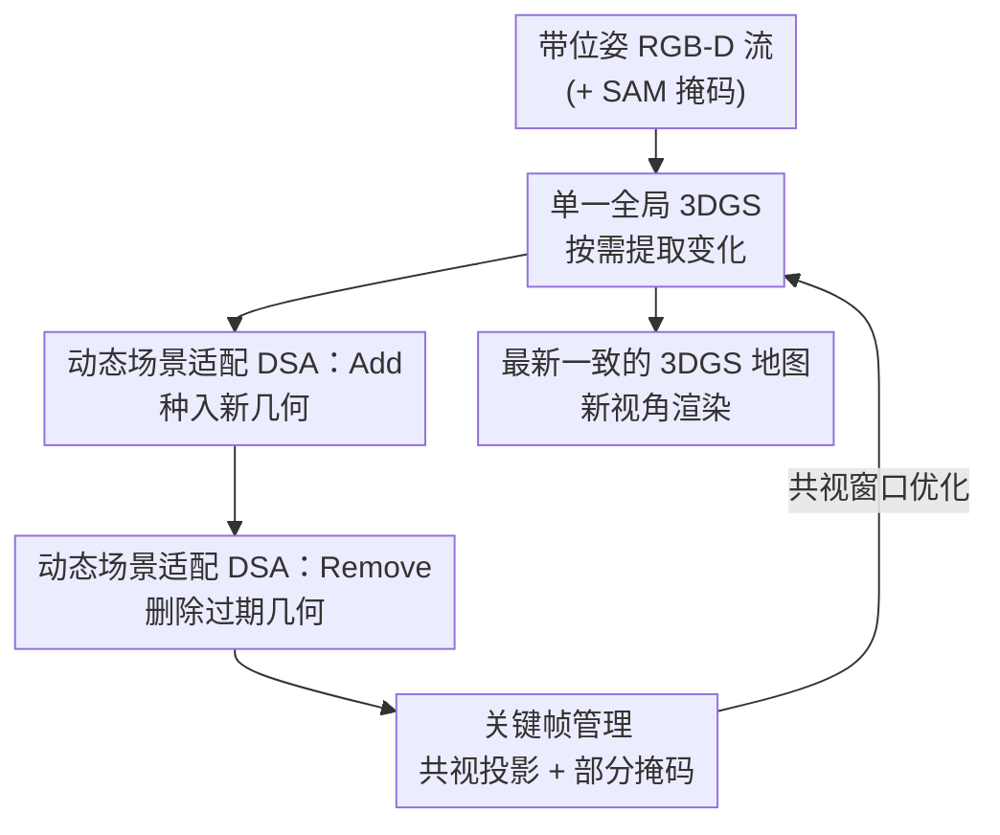

# Gaussian Mapping for Evolving Scenes

**会议**: CVPR 2026  
**论文**: [CVF Open Access](https://openaccess.thecvf.com/content/CVPR2026/html/Yugay_Gaussian_Mapping_for_Evolving_Scenes_CVPR_2026_paper.html)  
**代码**: https://vladimiryugay.github.io/game （项目页，开源）  
**领域**: 3D视觉  
**关键词**: 3D高斯泼溅, 稠密建图, 长期动态场景, 在线重建, 新视角合成  

## 一句话总结
GaME 是首个面向「长期动态场景」（相机视野**外**发生的结构变化）的支持新视角合成的稠密建图系统，通过动态场景适配（Add/Remove 算子）持续把场景变化增量写入一张全局 3DGS，并用关键帧部分掩码丢弃过期观测，在合成与真实数据上把 PSNR 提升约 29.7%、深度 L1 误差降到约 1/3。

## 研究背景与动机

**领域现状**：3D Gaussian Splatting（3DGS）已成为稠密建图 + 新视角合成（NVS）的主流表示，被广泛用于 AR/VR、机器人、自动驾驶。一批在线 RGB-D 建图方法（SplaTAM、MonoGS 等）用 3DGS 当场景表示，在**静态**场景里渲染质量很高。

**现有痛点**：现实环境几乎都是动态的，而动态分两类——短期动态（物体在相机视野**内**移动，已有 Wild-GS、DG-SLAM 等用分割模型抑制瞬态物体）和长期动态（场景在采集过程中、但**在相机视野外**发生结构性改变：椅子被搬走、画从墙上取下、桌上餐具被换）。长期动态几乎没人碰：3DGS 建图方法默认场景静态，多帧联合优化才良态；一旦地图过期、又把过期观测继续喂进优化，重建就会被污染、出现残影和错误几何。

**核心矛盾**：长期动态建图同时被两个问题卡住——**过期的地图**（old map，没反映最新变化）和**过期的观测**（stale observations，旧关键帧仍在约束已经不存在的几何）。已有的长期动态建图方法（Panoptic Multi-TSDF、Khronos 等）走对象级子图/对象图路线，能检测变化，但它们的地图表示**无法真实重渲染**，没法用在需要照片级渲染的 AR/VR 或数字地图里。

**本文目标**：在保留 3DGS 真实渲染能力的前提下，让在线建图系统能**随时**捕捉视野外发生的场景演化，并保持渲染质量。

**切入角度**：作者不去显式建模每个对象（在 3DGS 里把对象拆成独立实体既昂贵、又因泼溅机制天然耦合所有高斯而难以单独优化），而是维持**一张全局 3DGS**，只在「需要时」从渲染与观测的冲突中提取出变化区域。

**核心 idea**：把长期动态建图拆成两个原子操作——对全局 3DGS 做几何的「增（Add）」与「删（Remove）」，并配一套只屏蔽过期区域、不丢整帧的关键帧管理，用「过期地图」与「过期观测」两个抓手把问题分而治之。

## 方法详解

### 整体框架
GaME 接收单目 RGB-D 相机的带位姿彩色+深度图像流，目标是维护一张始终与最新观测一致、可从未见视角渲染的全局 3DGS 地图 $\{G_i\}_{i=1}^N$。系统是一个在线循环：每当一帧的平移/旋转超过阈值就被选为关键帧，触发**动态场景适配（DSA）**——先用 Add 把新出现的几何种进地图，再用 Remove 把过期几何删掉；删改完成后，**关键帧管理（KM）**把那些观测到「已变化几何」的旧关键帧的对应区域掩掉（而不是整帧丢弃），最后建图模块在一个共视窗口内用处理过的关键帧优化 3DGS 参数（颜色损失 + 深度损失）。整个流程让一张地图随场景持续滚动更新。

### 关键设计

**1. 单一全局 3DGS 表示 + 按需变化提取：不显式建对象，把变化当「冲突」检出**

长期动态建图的同行（Panoptic Multi-TSDF、Fu et al. 的对象图等）都走对象级路线——把场景拆成一个个可单独跟踪的实体，靠对象配置变化来判断改动。作者认为这条路在 3DGS 上行不通：3DGS 的渲染靠 alpha-blending 把所有高斯耦合在一起（见公式 $\alpha_j = o_j e^{-\sigma_j},\ \sigma_j = \tfrac12 \Delta_j^\top \Sigma_j^{-1}\Delta_j$），单独优化某个对象的高斯既不准、计算又贵。GaME 因此只维护**一张全局高斯集**，把对象级的复杂度甩掉，转而在「需要时」（每个关键帧触发 DSA）从「模型渲染出来的样子」和「当前观测」之间的不一致里提取变化几何。这是全篇的设计哲学：变化不是被显式跟踪的，而是被渲染-观测冲突隐式检出的。在线优化目标是颜色与深度的联合 L1（颜色项再混入 SSIM）：$L = L_\text{color}(\hat I, I) + L_\text{depth}(\hat D, D)$，并加各向同性正则防止高斯退化成针状。

**2. 动态场景适配（DSA）：用 Add 与 Remove 两个对称算子增删全局几何**

这是解决「过期地图」的核心。DSA 处理三类视野外变化——新增、移动、移除几何，但因为对象重定位不影响 NVS，问题被简化成两个原子操作。

*Add* 先检测「该有几何却没有」的地方：已重建高斯中，观测深度比渲染深度更近、且不透明度足够高的像素被判为新增几何 $\mathcal{G}_\text{add}=\{G_i \mid \alpha(p)\ge\epsilon_\text{opacity} \wedge \hat D(p) > D(p)+\epsilon_\text{depth}\}$；同时对「全新探索区域」$\mathcal{R}_\text{new}$（低不透明度、渲染深度大幅超出、或颜色误差高，三者取并）把 RGB-D 帧反投到 3D 当作新高斯的均值种入，再针对当前关键帧小迭代优化几步。

*Remove* 是 Add 的镜像：高不透明度、但颜色和几何都与新观测**冲突**的高斯被判为过期 $\mathcal{G}_\text{remove}$。关键差别有两处——一是深度判据符号**反转**（观测射线穿透进了模型几何，说明那里已经空了，这样还能避免「只是被遮挡」被误删）；二是额外加了**颜色冲突项**，于是连「画从墙上取下」这种几何上几乎无变化的改动也能检出（多数长期建图方法只用 3D 信息做不到这点）。但当前帧往往只看到待删对象的一部分，直接删会破坏场景一致性：DSA 把 $\mathcal{G}_\text{remove}$ 渲染到每个共视关键帧、找出冲突区域 $\mathcal{R}_\text{remove}^\text{KF}$，再用关键帧上稠密的 SAM 掩码挑出与冲突区相交的那些掩码，借 FlashSplat 把掩码**最优地**指派给高斯，从而把整个对象（即便此刻只看到一角）完整地删掉。注意这里 SAM 掩码无需语义标签，唯一作用是勾勒待删对象的完整轮廓。最终 $\mathcal{G}_\text{remove}\cup\bigcup_\text{KF} G_\text{remove}^\text{KF}$ 一并从全局模型删除并小迭代整合。

**3. 共视关键帧的部分掩码管理：只屏蔽过期区域，不丢整帧**

这是解决「过期观测」的核心。全帧联合优化算不动，所以只维护一小组关键帧 $W_k$（平移/旋转超阈值就新增）。问题在于：场景变了之后，旧关键帧里观测到「已变化几何」的部分会反过来把 3DGS 优化往错误方向拽。一个朴素做法是把这些「冲突关键帧」整帧丢掉——但消融显示这是灾难（深度 L1 飙到 764 cm），因为一帧里往往只有一小块变了、其余背景仍是宝贵的多视约束，整帧丢会让大片场景失去约束。GaME 因此**只掩掉帧内的过期区域**：在种入 $\mathcal{R}_\text{new}$ 或删除 $\mathcal{G}_\text{remove}$ 前，把它们渲染到共视关键帧上、用光度+几何损失评估冲突，高误差区即「地图已变但该帧没反映」的地方；为抑制渲染噪声，再把冲突区细化成对象对齐的区域（Remove 用相交的 SAM 掩码、Add 用重投影深度冲突的形态学闭运算），凡 SAM 掩码被误差区充分覆盖的就在优化中忽略，其余部分照常用掩码版损失优化。此外，共视判定用「3D 点重投影是否被遮挡」而非常规的「重渲染高斯计数」——后者在多房间环境里会因 alpha-blending 让别屋的高斯也显得可见，导致共视估计错误。

### 损失函数 / 训练策略
联合损失 $L = L_\text{color}(\hat I, I) + L_\text{depth}(\hat D, D)$。颜色项 $L_\text{color}=(1-\lambda)\tfrac1K\sum_p|\hat I(p)-I(p)| + \lambda(1-\mathrm{SSIM}(\hat I,I))$，深度项 $L_\text{depth}=\tfrac1K\sum_p|\hat D(p)-D(p)|$，$K$ 为渲染像素数，$\lambda$ 平衡 L1 与 SSIM，外加各向同性正则。关键帧管理阶段用上述损失的**掩码版**（忽略过期区域）。

## 实验关键数据

### 主实验
数据集：Flat（合成、含显著长期变化）、Aria（真实世界、两房间各取两段长期变化录制）、TUM-RGBD（三个静态场景，验证不退化）。评测协议把每个场景的多段 RGB-D 拼成单条连续序列以模拟真实演化行为，每 10 帧留作新视角测试。指标 PSNR/SSIM/LPIPS + 深度 L1（cm），报告为「输入视图 / 新视图」。

Flat 数据集渲染性能：

| 方法 | PSNR↑ | SSIM↑ | LPIPS↓ | 深度 L1[cm]↓ |
|------|-------|-------|--------|--------------|
| SplaTAM | 15.88 / 12.69 | 0.48 / 0.30 | 0.55 / 0.70 | 21.16 / 59.91 |
| MonoGS | 21.24 / 21.33 | 0.77 / 0.77 | 0.40 / 0.40 | 30.95 / 29.91 |
| DG-SLAM | 13.72 / 13.70 | 0.59 / 0.60 | 0.74 / 0.74 | 73.76 / 73.90 |
| **GaME (本文)** | **24.55 / 24.26** | **0.93 / 0.93** | **0.14 / 0.14** | **6.9 / 7.9** |

Aria 真实数据上 GaME 平均 PSNR 31.39/31.23、深度 L1 仅 1.22/1.24 cm，相对最强 baseline MonoGS（24.20/24.11、约 5 cm）几乎是数量级差距。论文宣称整体约 29.7% PSNR 提升、约 3× 深度误差改善（与最具竞争力 baseline 比）。

### 消融实验

DSA 算子消融（Flat）：

| 配置 | PSNR↑ | 深度 L1[cm]↓ | 说明 |
|------|-------|--------------|------|
| No DSA | 21.25 / 21.08 | 29.20 / 27.20 | 完全不做场景适配 |
| Add | 23.34 / 23.07 | 11.00 / 11.20 | 只增几何 |
| Remove | 24.13 / 23.89 | 9.50 / 8.20 | 只删几何 |
| **Add+Remove (本文)** | **24.55 / 24.26** | **6.9 / 7.9** | 完整 DSA |

关键帧管理消融（Flat）：

| 配置 | PSNR↑ | 深度 L1[cm]↓ | 说明 |
|------|-------|--------------|------|
| No KF Filtering | 23.57 / 23.31 | 6.70 / 7.20 | 不过滤，背景清晰但变化区有残影 |
| Full KF Filtering | 13.72 / 13.34 | 764.40 / 763.30 | 整帧丢弃，场景严重欠约束（崩） |
| **Partial Filtering (本文)** | **24.55 / 24.26** | 6.9 / 7.9 | 只掩过期区域 |

### 关键发现
- DSA 是渲染质量的主力：去掉 DSA 深度 L1 从 ~7 cm 恶化到 ~28 cm；Add 与 Remove 单独都有效，但合起来在深度上才最好（Remove 比 Add 更关键，删错误几何对深度收益更大）。
- 关键帧管理的「部分掩码」是分水岭：整帧丢弃（Full Filtering）直接把深度 L1 打到 764 cm 完全崩溃，说明背景多视约束绝不能丢；不过滤虽不崩但变化区有残影。只有「保背景、掩冲突」两头兼顾才最优。
- 鲁棒性：用现成 SLAM 估计的噪声位姿替代真值（Aria room0），性能几乎不掉（PSNR 31.54→31.45）；在 TUM-RGBD 静态场景上与 SOTA 持平，说明为动态设计的机制没有牺牲静态重建能力。

## 亮点与洞察
- **把「场景变化」当作渲染-观测冲突来隐式检出**，而非显式建模/跟踪对象——绕开了 3DGS 因 alpha-blending 耦合所有高斯而难以单独优化对象的根本困难，是很巧的问题重述。
- **Add/Remove 的对称设计 + 深度判据符号反转**：同一套不透明度/深度/颜色阈值，靠符号翻转就区分「该补的几何」与「该删的几何」，并天然规避「遮挡 ≠ 消失」的误删。
- **借 SAM 掩码 + FlashSplat 做「完整对象删除」**：即便当前帧只看到对象一角，也能通过共视关键帧上相交的 SAM 掩码把整个对象删干净，这个「部分观测→完整删除」的 trick 可迁移到任何需要在 3DGS 里做对象级编辑的任务。
- 「部分掩码而非整帧丢弃」这一条看似工程细节，消融却揭示它是崩与不崩的分界（764 cm vs 7 cm），提醒做长期动态建图时背景约束的价值被严重低估。

## 局限与展望
- 依赖 RGB-D（深度传感器）与已知/可估位姿，纯单目 RGB 场景不适用；Wild-GS 因依赖现成深度估计器与位姿不一致而无法在 Flat/Aria 上公平对比，说明该设定对输入质量有要求。
- DSA 与 Remove 严重依赖 SAM 掩码质量与多个阈值（$\epsilon_\text{opacity},\epsilon_\text{depth},\epsilon_\text{color},\tau$ 等），阈值在不同传感器噪声下的可迁移性未充分讨论。
- 只处理**刚性**几何的增删，对非刚性/形变物体、以及视野内的短期动态并未联合建模；评测场景以室内房间为主，大尺度户外长期动态未验证。
- 变化检测是「触发式」的——只有相机重新观测到某区域才会更新，长期未访问区域的过期信息无法主动清理。

## 相关工作与启发
- **vs Panoptic Multi-TSDF / Khronos（对象级长期动态建图）**：它们在子图/对象图层面推理变化，能检测改动但地图无法真实重渲染；GaME 用单一 3DGS 换来照片级 NVS，代价是不显式拥有对象级语义。
- **vs DG-SLAM / Wild-GS（短期动态 3DGS）**：它们用分割抑制视野**内**的瞬态物体，但视野外的长期演化会被过期观测污染（实验里 DG-SLAM 深度 L1 高达 60+ cm）；GaME 专攻视野外长期动态，二者解决的是互补问题。
- **vs SplaTAM / MonoGS（静态在线 3DGS 建图）**：同样用 3DGS 当表示，但默认场景静态；GaME 在它们之上加了 DSA + 关键帧部分掩码，把「静态假设」松绑为「持续演化」。

## 评分
- 新颖性: ⭐⭐⭐⭐⭐ 首个面向视野外长期动态的 NVS 稠密建图，把变化检测重述为渲染-观测冲突的思路清新。
- 实验充分度: ⭐⭐⭐⭐ 合成+真实+静态三类数据、DSA/KM/噪声位姿多组消融较完整，但场景偏室内、阈值敏感性分析不足。
- 写作质量: ⭐⭐⭐⭐ 问题拆解（过期地图 vs 过期观测）清晰，公式与图示对应良好。
- 价值: ⭐⭐⭐⭐⭐ AR/VR、机器人数字地图等真实场景刚需「随时更新且可渲染」的地图，落地价值高且开源。

<!-- RELATED:START -->

## 相关论文

- [\[CVPR 2026\] OnlinePG: Online Open-Vocabulary Panoptic Mapping with 3D Gaussian Splatting](onlinepg_online_open-vocabulary_panoptic_mapping_with_3d_gaussian_splatting.md)
- [\[CVPR 2026\] Uncertainty-driven 3D Gaussian Splatting Active Mapping via Anisotropic Visibility Field](uncertainty-driven_3d_gaussian_splatting_active_mapping_via_anisotropic_visibili.md)
- [\[CVPR 2026\] VAD-GS: Visibility-Aware Densification for 3D Gaussian Splatting in Dynamic Urban Scenes](vad-gs_visibility-aware_densification_for_3d_gaussian_splatting_in_dynamic_urban.md)
- [\[CVPR 2026\] Paparazzo: Active Mapping of Moving 3D Objects](paparazzo_active_mapping_of_moving_3d_objects.md)
- [\[CVPR 2026\] Scene Reconstruction as Mapping Priors for 3D Detection](scene_reconstruction_as_mapping_priors_for_3d_detection.md)

<!-- RELATED:END -->
