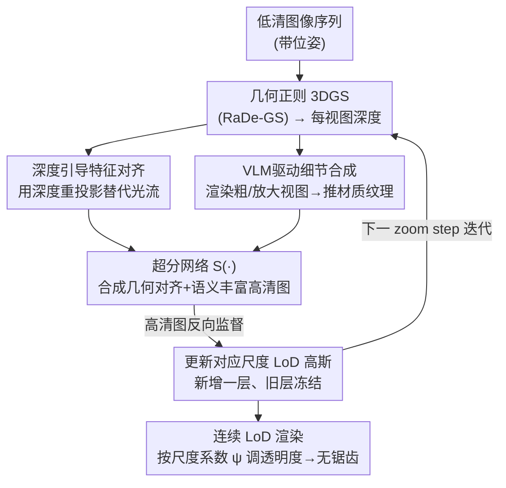

# GaussianZoom: Progressive Zoom-in Generative 3D Gaussian Splatting with Geometric and Semantic Guidance

**会议**: CVPR 2026  
**论文**: [CVF Open Access](https://openaccess.thecvf.com/content/CVPR2026/html/Shi_GaussianZoom_Progressive_Zoom-in_Generative_3D_Gaussian_Splatting_with_Geometric_and_CVPR_2026_paper.html)  
**代码**: 项目页 https://zju3dv.github.io/GaussianZoom/ （代码未明确开源）  
**领域**: 3D视觉  
**关键词**: 3D高斯泼溅, 超分辨率, 极端放大, VLM语义引导, Level-of-Detail  

## 一句话总结
GaussianZoom 把"从低清输入做 3D 场景极端放大"重新定义为渐进式生成问题，用深度引导的多视图一致超分 + VLM 推断的语义细节合成迭代优化 3DGS，并用可扩展的连续 Level-of-Detail 层级在 1× 到 64× 之间做无锯齿平滑渲染，在 Mip-NeRF360 / Tanks&Temples 上取得更好的感知质量和跨视图一致性。

## 研究背景与动机

**领域现状**：3D Gaussian Splatting（3DGS）已经能在实时渲染下做出高质量的场景重建，但它的细节上限被输入图像的分辨率死死卡住——当采集视角远、相机硬件差导致输入是低清图时，重建出来的场景纹理模糊、细结构丢失。

**现有痛点**：传统 3D 超分的套路是"先在 2D 图上做超分，再拿超分图去重建 3D"。但这条路有两个硬伤：① 单图超分（如 SRGS 用 SwinIR）独立锐化每一帧，**没有跨视图几何约束**，每帧各自变清楚但相互对不齐，重建出来全是闪烁鬼影；② 基于光流的视频超分（如 SuperGaussian、Sequence Matters）依赖光流对齐相邻帧，但**光流在遮挡、无纹理区、大视差下会崩**，对齐错了细节就生成错。更要命的是，所有这些方法**只能增强 LR 输入里已经能看到的内容，无法凭空生成合理的新细节**——而放大到 16×、64× 时，用户期待的恰恰是输入里根本没有的高频语义纹理。

**核心矛盾**：放大 3D 场景本质上是"从重建滑向生成"的连续过程，但单次上采样（single-shot upsampling）做不到这点。它既要锚定在几何上（保持精确 3D 结构和跨视图对齐），又要由高层场景理解去丰富语义合理的外观——这两个目标在已有的"一次性超分"框架里无法同时满足。

**本文目标**：把极端 zoom-in 拆成（a）如何保证跨视图几何一致地对齐特征、（b）如何生成 LR 里不存在的语义合理新细节、（c）如何在跨越巨大放大范围（1×→64×）时做无锯齿平滑渲染三个子问题。

**核心 idea**：用**渐进迭代的生成框架**——每一步用重建出的 3DGS 深度做几何引导的特征对齐（替掉不可靠的光流），用 VLM 推断该看到什么材质纹理来引导超分网络生成新细节，再用生成的高清图反过来监督下一步 3DGS 优化；同时把 Level-of-Detail 从"省算力的离散开关"升级成"随放大过程生长的连续生成脚手架"。

## 方法详解

### 整体框架

输入是一组带位姿的低分辨率图像序列，输出是能在大范围放大下保持多视图一致、细节丰富的 3D 高斯表示。整个系统是一个**渐进 zoom-in 循环**：先从 LR 图优化出一个几何正则化的粗糙 3DGS（用 RaDe-GS 的几何正则），得到可靠的每视图深度；然后在每个 zoom step 里，统一的多视图一致超分模块把"深度引导的特征 warping"和"VLM 驱动的语义细节合成"结合起来，合成既几何对齐又语义丰富的高清视图；这些高清图作为监督去更新对应尺度的高斯；与此同时，一个可扩展连续 LoD 层级把多尺度高斯组织起来、按尺度动态调透明度，实现跨缩放级别的无锯齿平滑渲染。每往前 zoom 一步就新增一层 LoD（填入语义生成的高频细节），旧层冻结保留粗外观和全局结构。

### 关键设计

**1. 深度引导的特征对齐：用重建几何取代不可靠的光流来做跨视图对应**

视频超分（VSR）框架靠光流（如 SpyNet 估计）把相邻帧对齐，但光流只看外观对应，遇到遮挡、无纹理、大视差就失效，导致特征对齐错、各视图生成的内容互相冲突。本文换成几何感知的深度 warping：先从 LR 图优化出一个几何一致的低清高斯模型 $G$，得到可靠的每视图深度图 $D_i$ 作为显式几何先验。给定两帧的内参 $K_i,K_j$ 和外参 $P_i,P_j$，视图 $j$ 里像素 $\mathbf{p}=(u,v,1)$ 到视图 $i$ 的投影 $\mathbf{p}'$ 的几何对应由重投影给出：

$$\mathbf{p}'^{\top}\mathbf{D}'_i = \mathbf{K}_i\,\mathbf{P}_i\mathbf{P}_j^{-1}\mathbf{K}_j^{-1}\mathbf{p}\,\mathbf{D}_j$$

其中 $\mathbf{D}'_i$ 是重投影到相机 $i$ 坐标系下的深度。这定义了一个稠密几何 warp $W_{j\to i}$，作用在特征图上得到对齐特征 $\tilde{\mathbf{F}}_i = W_{j\to i}(\mathbf{F}_j)$。因为对齐锚定在重建几何而非外观相似度上，它天然能处理遮挡和视差，跨视图特征传播稳定一致——消融里它把 FVD 从 168 降到 108（Mip-NeRF360），是多视图一致性的主要来源。

**2. VLM 驱动的语义细节合成：让模型"想象放大后该看到什么"，生成 LR 里不存在的合理高频细节**

深度 warping 解决了"对齐"，但仍然受限于 LR 输入里可见的内容——它没法凭空造出输入里根本没有的细节。本文在超分流水线里引入视觉语言模型作为语义先验：在每个 zoom step，渲染一张包含全局语义的粗尺度视图 + 一张高亮高频细节不足区域的放大视图，把这对渲染喂给 VLM（用 Chain-of-Zoom 微调过的 Qwen-VL2.5-3B-Instruct），让它推断出描述材质、纹理等细尺度属性的文本 $c$（如"木质花瓶、做旧桌面…"）。这个文本 $c$ 连同深度对齐特征 $\tilde{\mathbf{F}}_i$ 和原始特征 $\mathbf{F}_i$ 一起，给超分网络提供语义+几何双重条件：

$$I_i^{\mathrm{sr}} = \mathcal{S}\!\left(\mathbf{F}_i,\ \tilde{\mathbf{F}}_i,\ c\right)$$

合成的高清图 $I_i^{\mathrm{sr}}$ 既锐化可见结构，又注入与全局上下文和局部放大内容都一致的语义细节，然后作为监督更新对应 zoom 层的高斯。消融显示去掉 VLM 提示后，卡车表面会变成均匀的光泽面、丢掉输入里本有的锈迹纹理——说明没有语义条件时模型只会增强局部对比度，抓不住材质语义。

**3. 可扩展连续 Level-of-Detail：把 LoD 从"省算力的离散开关"升级成随放大生长的连续生成脚手架**

传统 LoD（八叉树/层级高斯）是为静态重建的渲染效率服务的，按相机距离在预定义层级间**硬切换**，跨尺度时会突变、产生锯齿。本文让每个高斯按其**尺度投影系数**动态调透明度，无需显式切换层级。尺度投影系数定义为

$$\psi = \frac{d}{f}$$

$d$ 是相机中心到基元中心的距离，$f$ 是焦距；$\psi$ 反映基元的世界尺度投到像平面上有多大，$\psi$ 越小说明该基元占的屏幕足迹越大、越该用更精细的高分量来表示。渲染时比较当前渲染相机下的 $\psi'$ 和基元创建时存的 $\psi$：若 $\psi'/\psi$ 超过 zoom factor $s$，说明该基元欠分辨、偏向更细层级；若 $\psi'/\psi$ 低于 $1/s$，说明它足够覆盖足迹、增大其贡献并抑制更细分量。为了平滑过渡，用对数衰减函数调透明度：

$$w(\psi'/\psi) = \max\big(0,\ 1-|\log_s(\psi'/\psi)|\big)$$

这给出在相邻 LoD 层之间自然饱和的连续权重，避免可见性突变。每往前 zoom 一步就引入一层新基元去重建外观细节，旧层冻结保留粗外观和全局结构，形成一个随放大过程自适应生长的生成层级。消融显示没有 LoD 时，在共享表示下联合优化不同尺度的超分图会因为尺度间轻微不一致而产生跨尺度冲突和锯齿；LoD 把不同尺度分配到独立高斯层、各管各的分辨率，有效抑制了层间干扰。

### 损失函数 / 训练策略

超分不可避免地会让合成的高清内容和 LR 输入里可见的结构产生偏差，这种不一致会跨 zoom 层累积、把重建带偏。为此本文加了一个**子采样的双尺度监督**：把渲染的高清图 $R_i^{\mathrm{hr}}$ 用 bicubic 下采样成 $R_i^{\mathrm{lr}}$，再和对应的 LR 输入 $I_i^{\mathrm{lr}}$ 对齐，强制"高清渲染投回 LR 域时不能偏离粗尺度外观"。总损失为

$$\mathcal{L} = \lambda_{\text{hr}}\mathcal{L}_{\text{rgb}}(I_i^{\text{hr}}, R_i^{\text{hr}}) + \lambda_{\text{lr}}\mathcal{L}_{\text{rgb}}(I_i^{lr}, R_i^{\text{lr}}) + \lambda_{\text{geo}}\mathcal{L}_{\text{geo}}$$

其中 $\mathcal{L}_{\text{rgb}}$ 是 3DGS 的 L1+D-SSIM 重建损失，$\mathcal{L}_{\text{geo}}$ 是 RaDe-GS 的几何正则损失。超参取 $\lambda_{\text{hr}}=0.6$、$\lambda_{\text{lr}}=0.4$、$\lambda_{\text{geo}}=0.05$，每步 zoom factor $s=4$。基础 3DGS 用 RaDe-GS 几何正则训 30K 步，VSR backbone 用 DLoRAL（把它原本的光流 warping 换成深度对齐），全程单张 RTX 4090。

## 实验关键数据

### 主实验

4× 超分基准（Mip-NeRF360 用 1/8→1/2，Tanks&Temples 用 1/4→1），全参考指标：

| 数据集 | 指标 | 本文 | 次优(Sequence Matters) | SRGS | 3DGS |
|--------|------|------|------|------|------|
| Mip-NeRF360 | PSNR↑ | **27.16** | 26.95 | 26.69 | 20.64 |
| Mip-NeRF360 | SSIM↑ | **0.781** | 0.771 | 0.761 | 0.634 |
| Mip-NeRF360 | LPIPS↓ | **0.261** | 0.276 | 0.301 | 0.385 |
| Mip-NeRF360 | FID↓ | **19.38** | 26.64 | 33.97 | 60.48 |
| Tanks&Temples | PSNR↑ | **23.40** | 23.39 | 23.29 | 19.63 |
| Tanks&Temples | LPIPS↓ | **0.265** | 0.270 | 0.276 | 0.337 |
| Tanks&Temples | FID↓ | **14.91** | 15.92 | 19.10 | 23.82 |

PSNR/SSIM 提升幅度温和（Tanks&Temples PSNR 仅 +0.01），但 **FID 大幅领先**（Mip-NeRF360 19.38 vs 26.64）——这正反映了深度对齐带来的跨视图高频细节稳定性和一致性，而非单纯的像素保真。

极端 zoom-in（16×/32×/64×，无 GT，用无参考感知指标）：

| 指标 | 放大 | 本文 | SRGS | Sequence Matters |
|------|------|------|------|------|
| CLIPIQA↑ | 64× | **0.436** | 0.346 | 0.302 |
| MUSIQ↑ | 64× | **42.21** | 17.27 | 15.44 |
| NIQE↓ | 64× | **5.53** | 15.54 | 15.25 |

放大倍数越大优势越明显：64× 下 MUSIQ 是竞品的 2.5 倍以上，竞品随放大变得模糊无纹理、细语义结构坍缩，本文仍保持锐利且语义一致的细节。

### 消融实验

用 Fréchet Video Distance（FVD，衡量超分图的时序/跨视图一致性）：

| 配置 | Mip-NeRF360 FVD↓ | Tanks&Temples FVD↓ | 说明 |
|------|------|------|------|
| SuperGaussian | 574.92 | 1941.06 | 光流 VSR baseline |
| Sequence Matters | 165.74 | 190.97 | 较强光流 baseline |
| Ours w/o depth warping | 168.36 | 180.45 | 去掉深度对齐 |
| **Ours (full)** | **107.99** | **79.98** | 完整模型 |

- **深度对齐贡献最大**：去掉它 FVD 从 79.98 飙到 180.45（Tanks&Temples），跨视图一致性显著退化，证明几何对齐确实优于光流对应。
- **VLM 引导**（图 6 定性）：去掉提示后卡车表面变成均匀光泽面、丢掉输入本有的锈迹纹理——模型只增强对比度、抓不住材质语义。
- **连续 LoD**（图 7 定性）：去掉后在共享表示下跨尺度联合优化产生锯齿和跨尺度冲突；LoD 把不同尺度分到独立高斯层、各专精一个分辨率，平滑了缩放过渡。

### 关键发现
- 三个模块各管一件事且互补：深度 warping 管"对齐"、VLM 管"造新细节"、LoD 管"跨尺度平滑"——任一去掉都掉在对应维度上。
- FID/FVD 这类分布/感知指标的提升远大于 PSNR/SSIM，说明本文的价值在于**生成式的高频细节质量与一致性**，而非传统超分的像素回归精度。

## 亮点与洞察
- **把 zoom-in 重新定义为"重建→生成"的连续过程**：很巧妙地点破了传统 3D 超分"只能增强已观测内容"的天花板，主张极端放大本质是渐进生成而非单次上采样，这个 reframing 是整篇工作的根。
- **用 3DGS 深度替光流做 warping**：这是一个可直接复用的 trick——任何依赖跨帧/跨视图对齐的 3D 生成/编辑任务，都可以拿重建几何的深度重投影替掉脆弱的光流，尤其在遮挡/大视差场景。
- **LoD 从效率工具变成生成脚手架**：尺度投影系数 $\psi=d/f$ + 对数衰减透明度 $w=\max(0,1-|\log_s(\psi'/\psi)|)$ 把离散层级切换变成连续可微的可见性调制，这个连续化思路可迁移到任何需要多尺度无锯齿渲染的高斯表示。
- **双尺度子采样监督**是个简单有效的防漂移正则：强制高清渲染下采样后要对齐 LR 输入，廉价地约束了生成细节不脱离原始证据，可直接搬到其他"超分+重建"耦合的 pipeline。

## 局限与展望
- **作者承认**：在极高放大（如 ×1024）时当前 VLM 难以推断出连贯结构，导致语义薄弱的纹理；未来想做更有内容创造力的 zoom-in，实现从宇宙尺度到微观分子场景的无缝过渡。
- **依赖外部预训练模型**：方法绑定了 RaDe-GS 几何正则、DLoRAL VSR backbone、Chain-of-Zoom 微调的 Qwen-VL——几何先验或 VLM 质量差时整条链路会受影响，且组件较重。
- **生成细节的"真实性"无 GT 可验**：极端放大场景下评价完全依赖无参考感知指标（CLIPIQA/MUSIQ/NIQE），合成的高频细节可能视觉可信但与真实物理结构不符，下游若需精确几何需谨慎。
- **逐步迭代 + 每步新增 LoD 层**可能带来累积的存储/优化开销，论文未充分讨论大场景或多目标 zoom 时的扩展成本。

## 相关工作与启发
- **vs SRGS / GaussianSR（单图 3D 超分）**: 他们独立锐化每帧、靠扩散先验或 SwinIR 提分辨率，但缺显式几何对齐，跨视图不一致；本文用深度 warping 直接锚定几何，FID/FVD 大幅更优。
- **vs SuperGaussian / Sequence Matters（光流视频 3D 超分）**: 他们用光流/PSRT 做跨帧传播，遮挡大视差下光流失败；本文用重建深度重投影做对齐，天然抗遮挡，是消融里一致性提升的主因。
- **vs Generative Powers of Ten / Chain-of-Zoom（2D 文本引导 zoom-in）**: CoZ 同样用 VLM 推断细尺度提示做渐进放大，但停留在 2D、单视图，跨视图一致难控；本文把同样的 VLM 语义引导搬进 3D 并提供多尺度几何上下文，实现几何+语义双一致。
- **vs 传统 LoD-GS（八叉树/层级高斯）**: 他们按相机距离选基元子集、目的是省算力、层级硬切换；本文的 LoD 强调尺度感知一致性，随 zoom 渐进引入更细基元、连续调透明度，是生成脚手架而非纯渲染优化。

## 评分
- 新颖性: ⭐⭐⭐⭐⭐ 把极端 zoom-in 重定义为渐进生成，深度替光流 + VLM 语义引导 + 连续 LoD 三件套各有巧思
- 实验充分度: ⭐⭐⭐⭐ 两数据集 + 4× 与极端 zoom 双设定 + FVD/定性消融较完整，但缺代码开源与更大场景的成本分析
- 写作质量: ⭐⭐⭐⭐ 动机推导清晰、图文对照充分，公式排版（CVF 抽取）略有噪声但不影响理解
- 价值: ⭐⭐⭐⭐ 为"生成式 zoom-in 3D 重建"立了一个强 baseline，深度 warping 和连续 LoD 两个 trick 可复用性高

<!-- RELATED:START -->

## 相关论文

- [\[CVPR 2026\] HeroGS: Hierarchical Guidance for Robust 3D Gaussian Splatting under Sparse Views](herogs_hierarchical_guidance_for_robust_3d_gaussian_splatting_under_sparse_views.md)
- [\[CVPR 2026\] ProgressiveAvatars: Progressive Animatable 3D Gaussian Avatars](progressiveavatars_progressive_animatable_3d_gaussian_avatars.md)
- [\[CVPR 2026\] AnchorSplat: Feed-Forward 3D Gaussian Splatting with 3D Geometric Priors](anchorsplat_feed-forward_3d_gaussian_splatting_with_3d_geometric_priors.md)
- [\[CVPR 2026\] Learning Differentiable Hierarchies in 3D Gaussian Splatting](learning_differentiable_hierarchies_in_3d_gaussian_splatting.md)
- [\[CVPR 2026\] GM-R²: Generative Matching Learning for Unsupervised Geometric Representation and Registration](gm-r2_generative_matching_learning_for_unsupervised_geometric_representation_and.md)

<!-- RELATED:END -->
