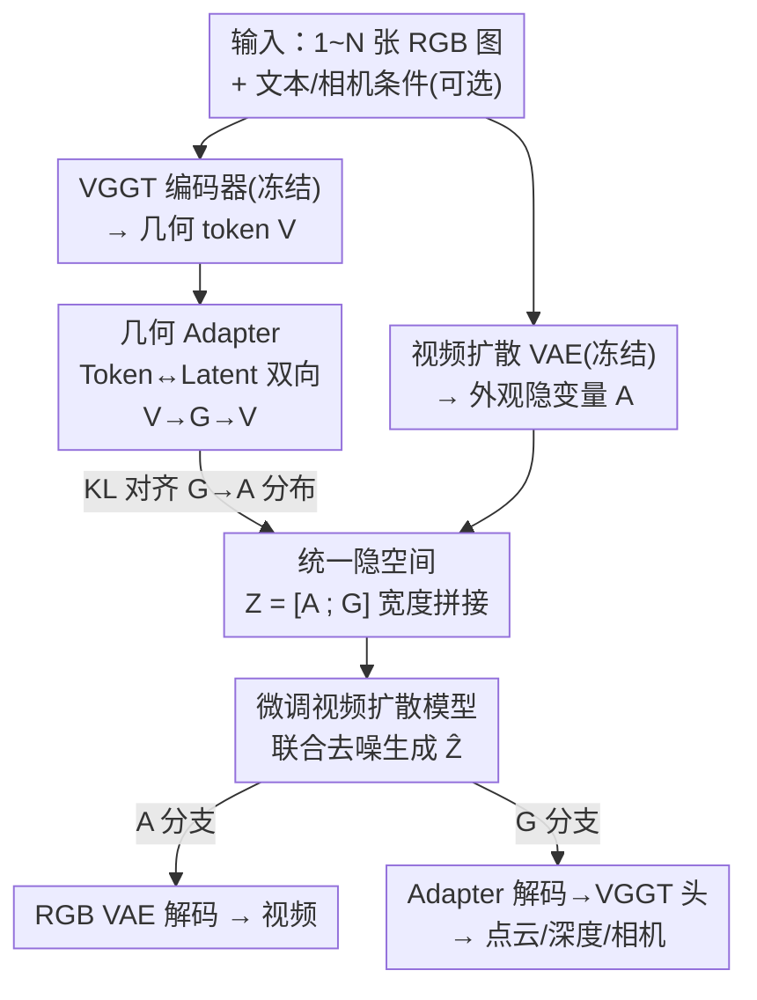

# Gen3R: 3D Scene Generation Meets Feed-Forward Reconstruction

**会议**: CVPR 2026  
**论文**: [CVF Open Access](https://openaccess.thecvf.com/content/CVPR2026/html/Huang_Gen3R_3D_Scene_Generation_Meets_Feed-Forward_Reconstruction_CVPR_2026_paper.html)（项目页 <https://xdimlab.github.io/Gen3R/>）  
**代码**: 无  
**领域**: 3D视觉 / 3D场景生成 / 视频扩散  
**关键词**: 3D场景生成, 前馈重建, VGGT, 视频扩散, 几何-外观联合隐空间

## 一句话总结
Gen3R 把前馈重建模型 VGGT 改造成一个"几何 VAE"，让它产出的几何隐变量和预训练视频扩散模型的外观隐变量对齐到同一个隐空间，然后微调视频扩散模型联合生成 RGB 视频 + 全局一致点云/深度/相机，在单图、双图条件下的 3D 场景生成都拿到 SOTA，还能反过来增强重建的鲁棒性。

## 研究背景与动机
**领域现状**：3D 场景生成主流有两条路。一条是借 2D 生成先验：用 SDS 把 NeRF/3DGS 优化到 2D 扩散分布上，或先用 2D 扩散合成多视角图再做重建/逐步外扩。另一条是前馈式：用 VAE 把 3D 场景压成紧凑隐空间，在隐空间里跑 latent diffusion 直接前馈生成（多数是生成 Gaussian + 可微渲染，靠 2D 监督训练）。

**现有痛点**：第一条路缺少显式 3D 推理，几何不一致、多视角保真度差、优化成本高；第二条路要训一个"几何中心"的 VAE，但场景级 3D 真值极度稀缺，只能用 2D 信号监督，导致几何质量和生成质量都受限。即便有工作去压缩 Dust3R/VGGT 这类重建模型的 3D 输出来造 VAE，也只是把它当成"出点云的黑盒"。

**核心矛盾**：一边是想要 3D 一致性却苦于没有 3D 真值的生成模型，一边是 VGGT 这类前馈重建模型**本身就已经在一个空间紧凑的 token 空间里编码了丰富的多视角几何**（深度、相机位姿、全局结构）。现有方法压缩的是重建模型的"最终输出"，却忽略了它"中间 token 隐流形"才是真正的几何先验富矿。

**本文目标**：能不能直接复用重建模型学到的内禀隐流形，把它当作 3D 场景生成的几何先验地基，而不是再费劲从零训一个几何 VAE？同时还要支持单图/多图、有无相机线索的灵活条件，并能顺手做重建。

**切入角度**：把 VGGT 看成一个**非对称的几何 VAE**——它的 encoder 已经现成（图像→几何 token），只要补一个 adapter 把 token 投影成扩散模型能用的低维隐变量、再投回去给原生 DPT 头解码，几何隐变量就有了；难点在于这套几何隐变量的分布和视频扩散模型的外观隐变量差异巨大，直接拼会让扩散训练不收敛。

**核心 idea**：用 adapter 把 VGGT token 压成几何隐变量，并用 KL 损失把它的分布**对齐**到预训练视频扩散模型的外观隐分布，从而得到"解耦但对齐"的统一隐空间，再微调视频扩散模型在这个空间里**联合生成外观+几何**——把重建模型的几何先验和视频扩散的 RGB 先验直接焊在一起。

## 方法详解

### 整体框架
Gen3R 要解决的是"给一两张图，生成既好看（RGB 视频）又几何一致（全局点云/深度/相机）的 3D 场景"。它分两步走：先**离线训一个几何 adapter**，把冻结的 VGGT 改造成能产出"可被扩散使用的几何隐变量 $G$"，并让 $G$ 的分布对齐到视频扩散 VAE 的外观隐变量 $A$；再**微调视频扩散模型**，在 $Z=[A;G]$ 这个拼起来的统一隐空间里联合去噪生成两种模态；推理时从噪声采样统一隐变量，分别用 RGB VAE 解码器和几何 adapter→VGGT 头解码出视频和几何。整条 pipeline 不需要显式 3D 真值监督，只靠重建 token 的自重建 + 分布对齐。

### 关键设计

**1. Token-to-Latent 几何 Adapter：把 VGGT 重铸成一个非对称几何 VAE**

痛点是：VGGT 的几何 token $V\in\mathbb{R}^{N\times L\times h_v\times w_v\times C}$（$C=2048$，取第 4/11/17/23 层共 $L=4$ 个中间 token）维度高、空间-时间分辨率也和视频扩散隐空间（$c=16$）对不上，没法直接拿来做扩散生成。Gen3R 不去重新设计几何 VAE，而是把现成的 VGGT 当 encoder，只补一对轻量 adapter $(E_{adp}, D_{adp})$：编码端 $E_{adp}: V\to G\in\mathbb{R}^{n\times h\times w\times c}$ 把高维 token 压到和视频扩散隐变量同分辨率、同维度；解码端 $D_{adp}: G\to \hat V$ 再投回 token 空间，交给 VGGT 原生的 DPT 头解出点云 $\hat P$、深度 $\hat D$、相机 $\hat T$。

这就是"非对称 VAE"的含义：encoder 是冻结的大模型 VGGT，只有 adapter 这层瓶颈是可训练的。训练用重建损失，既约束 token 本身一致、也约束解出来的多模态几何一致：

$$L_{rec}=\mathbb{E}\|\hat V-V\|^2+\mathbb{E}\|\hat T-T\|_1+\mathbb{E}\|\hat D-D\|^2+\mathbb{E}\|\hat P-P\|^2.$$

好处是几何先验（多种 3D 量、高层场景理解）几乎零成本继承下来，不用碰那个"没有 3D 真值就训不好"的老问题。

**2. KL 分布对齐：让几何隐变量"解耦但对齐"地长进外观隐空间**

光把 token 压小是不够的——作者实测发现，只有 $L_{rec}$ 时 adapter 确实能压缩几何 token，但**完全不约束映射后隐空间的形态**，几何隐变量 $G$ 的分布和外观隐变量 $A$ 差太远，直接拼进扩散训练会不收敛、生成质量崩。常规 LDM 用 VAE/VQ-VAE 的先验来正则隐空间，这里换了个更对路的做法：直接用 KL 损失把几何隐分布 $q_G$ 拉向预训练 RGB 隐分布 $q_A$：

$$L_{KL}=D_{KL}(q_G\,\|\,q_A).$$

adapter 总损失为 $L=\lambda_1 L_{rec}+\lambda_2 L_{KL}$。这一步是全文的关键——它保证了两个隐空间**兼容**，使得同一个扩散模型能同时对外观和几何分布建模。注意它强调的是"解耦但对齐"：$A$ 和 $G$ 仍是两路独立模态（解码器各管各的），但分布形态被对齐，所以能塞进同一个去噪过程。消融里 w/o $L_{KL}$ 几乎全线崩盘（见下表），正是这个设计撑起了整套方法。

**3. 统一隐空间里的几何感知联合生成：宽度拼接 + 多条件可控**

有了对齐的隐空间后，把外观隐 $A=E_W(I)$ 和几何隐 $G$ **沿宽度维拼接**成 $Z=[A;G]\in\mathbb{R}^{n\times h\times 2w\times c}$，微调预训练视频扩散模型 $G_\theta$ 在这个统一表示上联合去噪。沿宽度拼接而不是新增通道/分支，是为了**不引入额外可训练参数、保住预训练扩散模型原有的生成能力**。去噪过程吃多种条件：文本 $y$、条件图序列 $I_{cond}$（缺帧补零）、对应二值掩码 $M$、可选逐视角相机 $T_{cond}$：

$$G_\theta:(Z_t; t, y, I_{cond}, M, T_{cond})\to \hat Z_{t-1}.$$

关键细节是**不把几何隐变量当条件喂进去**，让模型只从输入图就能干各种活；训练时按 1/3 概率随机采样"首帧 / 首尾两帧 / 全序列"三种条件配置并相应调掩码，相机条件按 50% 概率丢弃、文本按 20% 概率丢（CFG）。这样一个模型就覆盖了单图生成、双图生成、前馈重建三种推理设置，且每种都能选择是否给相机。生成完用 RGB VAE 解码器 $D_W$ 解出视频、用 adapter→VGGT 头解出几何，并按 VGGT 习惯用生成的相机参数把深度反投影成最终几何。

### 损失函数 / 训练策略
两阶段训练：① adapter 用 $L=\lambda_1 L_{rec}+\lambda_2 L_{KL}$ 训（先 25 帧 560×560 训 15k 步、再 49 帧微调 6k 步，24 张 H20，总 batch 192，权重随机初始化）；② 扩散端微调一个图像-相机条件的 Wan2.1，49 连续帧 560×560、8k 步、batch 4。数据集混合 RealEstate10K、DL3DV-10K、ACID、TartanAir、KITTI-360、Waymo、Co3Dv2、MVImgNet、Virtual KITTI 2、WildRGB-D 共 30 万+ 多视角场景，文本由多模态 LLM 生成，**全程不需要显式 3D GT 表示**。

## 实验关键数据

### 主实验：外观 + 几何生成
外观生成（RealEstate10K / DL3DV-10K，1-view & 2-view）。下表节选 1-view 设置的关键指标，Gen3R 在 PSNR/SSIM/LPIPS 和 VBench 成像质量上大多领先：

| 设置 | 方法 | RE10K PSNR↑ | RE10K LPIPS↓ | DL3DV PSNR↑ | DL3DV LPIPS↓ |
|------|------|------|------|------|------|
| 1-view | Gen3C | 20.26 | 0.2302 | 16.21 | 0.4575 |
| 1-view | WVD | 17.62 | 0.3300 | 14.25 | 0.5063 |
| 1-view | **Ours** | **20.51** | **0.2281** | **16.38** | 0.4234 |
| 2-view | LVSM | 29.58 | 0.1060 | 18.80 | 0.3575 |
| 2-view | **Ours** | 27.05 | **0.1352** | 18.59 | **0.3416** |

> 注：2-view 下非生成式的 LVSM PSNR 更高（它本质是插值，擅长两视角间内插），但在 1-view 退化明显且过曝场景会糊；Gen3R 作为生成式方法在 LPIPS、跨数据集泛化和补全遮挡区上更稳。

几何生成（点云，CD 越低越好）。Gen3R 在 Co3Dv2 / WildRGB-D / TartanAir 的 CD 全面优于显式 3D 生成基线 Aether、WVD：

| 设置 | 方法 | Co3Dv2 CD↓ | WildRGB-D CD↓ | TartanAir CD↓ |
|------|------|------|------|------|
| 1-view | Aether | 1.9498 | 0.3066 | 3.8457 |
| 1-view | WVD | 1.6137 | 0.2635 | 3.7302 |
| 1-view | **Ours** | **1.1047** | **0.1992** | **2.7809** |
| 2-view | **Ours** | **0.9767** | **0.1426** | **1.9734** |

VGGT 作为纯重建参考 accuracy 更高，但 completeness 差（它不为新视角生成几何），CD 反而不如 Gen3R。

### 重建增强（生成先验反哺重建）
在前馈重建任务上，Ours (VAE only) 把 VGGT token 编码再解码，基本保住 VGGT 水平；而完整的 Ours（生成版）**反而把重建做得更好**——因为联合建模外观+几何让两种模态相互校正、修掉了 VGGT 的 floater 噪点：

| 方法 | Co3Dv2 CD↓ | WildRGB-D CD↓ | TartanAir CD↓ |
|------|------|------|------|
| VGGT | 0.9632 | 0.1165 | 1.5957 |
| WVD (VAE only) | 1.2080 | 0.1526 | 2.7867 |
| Ours (VAE only) | 0.9986 | 0.1165 | 1.6518 |
| **Ours (生成版)** | **0.9625** | 0.1260 | **1.5101** |

### 消融实验
两个核心消融：**2-Stage**（先生成 RGB 再用 VGGT 单独重建几何）和 **w/o $L_{KL}$**（去掉分布对齐损失）。

| 配置 | RE10K PSNR↑(1v) | RE10K CD↓→Co3Dv2(1v) | 说明 |
|------|------|------|------|
| 2-Stage | 17.38 | 1.6223 | 2D 生成与 3D 重建简单串联，误差累积 |
| w/o $L_{KL}$ | 16.31 | 1.9620 | 几何隐与外观隐分布偏离，难收敛、质量大降 |
| **Full** | **20.51** | **1.1047** | 完整模型 |

相机可控性（AUC@30）更能看出 $L_{KL}$ 的分量：w/o $L_{KL}$ 在 RealEstate10K 1-view 上只有 0.4100，而 Full 是 0.7443；2-Stage 0.6832 也明显低于 Full。

### 关键发现
- **$L_{KL}$ 分布对齐是命门**：去掉它不仅生成质量降，相机可控性几乎腰斩（0.74→0.41），证明"让几何隐长进外观隐分布"才是联合生成能跑通的前提，而非可有可无的正则。
- **联合生成优于两阶段**：2-Stage 把生成和重建naive串联会累积误差；联合去噪让外观/几何互相约束，外观、几何、相机三项都更好。
- **生成先验能反哺重建**：完整生成模型的重建 CD 甚至略优于纯 VGGT，说明耦合不是单向"重建帮生成"，而是双向受益。

## 亮点与洞察
- **"重建模型即几何 VAE"的视角转换**：别人压缩 VGGT 的最终输出（点云），Gen3R 直接复用它的中间 token 隐流形当几何先验，省掉了从零训几何 VAE 又没 3D 真值的死结——这是最"啊哈"的地方。
- **解耦但对齐 + 宽度拼接**：用 KL 把两路异质隐变量对齐分布、再宽度拼接塞进同一个扩散模型，既不加参数也不破坏预训练生成能力，是个很可复用的多模态联合生成 trick。
- **一个模型覆盖三种任务**：靠训练时随机采样条件配置（首帧/首尾/全序列 + 随机丢相机），单图生成、双图生成、前馈重建统一在一套权重里。
- 迁移性：这套"把某个领域基础模型的中间表征 adapter 进扩散隐空间 + KL 对齐"的范式，可推广到其它"有强先验基础模型但缺生成能力"的模态（如分割、法向、材质）。

## 局限与展望
- 强依赖 VGGT 与 Wan2.1 两个大基础模型，几何上限基本被 VGGT 锁死（accuracy 仍逊于纯 VGGT，靠 completeness 反超 CD）。
- 训练成本高（24×H20、30 万+ 场景），且几何细节、极端遮挡/大视角外推的质量未充分压力测试。
- 论文未开源代码（仅项目页），复现需自行实现 adapter 与拼接微调；WVD 基线也是作者自行复现，横向比较需留意实现差异。
- 改进方向：探索更轻量的几何 token 选层策略、把相机/深度以外的更多 3D 量（语义、材质）纳入统一隐空间。

## 相关工作与启发
- **vs Aether / WVD（显式 3D 生成）**：它们联合生成 RGB + 几何但走的是"压缩重建输出"的路；Gen3R 在隐空间对齐重建与生成，几何 CD 与相机可控性全面更优，证明"对齐隐流形"比"压缩输出"强。
- **vs Geometry Forcing (GF)**：GF 在扩散训练中把中间扩散特征对齐到重建模型；Gen3R 反过来，在扩散训练**之前**就把两个隐空间对齐，实测更有效、更稳。
- **vs VGGT（纯前馈重建）**：VGGT 只能从输入视角重建、不为新视角生成几何（completeness 差）；Gen3R 既能生成新视角几何，又能反哺修正 VGGT 的 floater 噪点。
- **vs 基于 SDS / 多视角合成的 3D 场景生成**：避开了逐场景优化的高成本和几何不一致，前馈一次出 RGB + 全局点云。

## 评分
- 新颖性: ⭐⭐⭐⭐⭐ "重建模型中间 token 即几何 VAE"+ KL 对齐两路隐空间，视角新且打通了重建与生成。
- 实验充分度: ⭐⭐⭐⭐⭐ 5 数据集、外观/几何/重建/相机四类指标、2-Stage 与 w/o $L_{KL}$ 双消融，论证扎实。
- 写作质量: ⭐⭐⭐⭐ 方法叙述清晰、动机递进自然，部分细节（adapter 结构、相机 token）转交补充材料。
- 价值: ⭐⭐⭐⭐⭐ 给"3D 场景生成无 3D 真值"的痛点提供了可复用范式，且生成能反哺重建有实际意义。

<!-- RELATED:START -->

## 相关论文

- [\[CVPR 2026\] Pano3DComposer: Feed-Forward Compositional 3D Scene Generation from Single Panoramic Image](pano3dcomposer_feed-forward_compositional_3d_scene_generation_from_single_panora.md)
- [\[CVPR 2026\] UniSH: Unifying Scene and Human Reconstruction in a Feed-Forward Pass](unish_unifying_scene_and_human_reconstruction_in_a_feed-forward_pass.md)
- [\[CVPR 2026\] PanoVGGT: Feed-Forward 3D Reconstruction from Panoramic Imagery](panovggt_feed-forward_3d_reconstruction_from_panoramic_imagery.md)
- [\[CVPR 2026\] TokenSplat: Token-aligned 3D Gaussian Splatting for Feed-forward Pose-free Reconstruction](tokensplat_token-aligned_3d_gaussian_splatting_for_feed-forward_pose-free_recons.md)
- [\[CVPR 2026\] ForeHOI: Feed-forward 3D Object Reconstruction from Daily Hand-Object Interaction Videos](forehoi_feed-forward_3d_object_reconstruction_from_daily_hand-object_interaction.md)

<!-- RELATED:END -->
