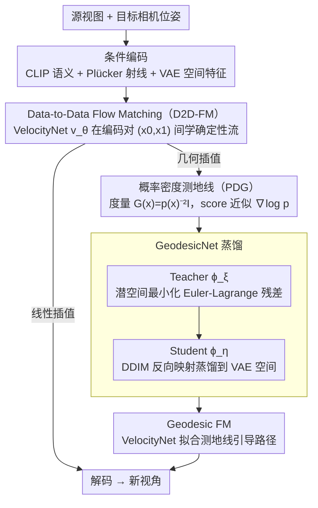

# GeodesicNVS: Probability Density Geodesic Flow Matching for Novel View Synthesis

**会议**: CVPR 2026  
**arXiv**: [2603.01010](https://arxiv.org/abs/2603.01010)  
**代码**: 无  
**领域**: 3D视觉  
**关键词**: 新视角合成, Flow Matching, 测地线, 概率密度流形, 数据到数据映射

## 一句话总结

提出概率密度测地线 Flow Matching (PDG-FM) 框架，通过数据到数据的确定性流匹配替代噪声到数据的扩散过程，并利用基于概率密度的测地线优化使插值路径沿数据流形高密度区域行进，实现更几何一致的新视角合成。

## 研究背景与动机

新视角合成 (NVS) 旨在从有限观测生成场景的未见视角。扩散模型虽然生成质量高，但依赖**随机的噪声到数据的转换**，这掩盖了确定性结构并导致跨视角预测不一致。Flow Matching 提供了确定性替代方案，但现有条件 Flow Matching (CFM) 大多使用**简单线性插值**连接源和目标数据，这无法忠实捕获潜在空间中数据流形的非线性几何，可能导致次优的视角转换。

核心问题：如何在生成过程中显式引入数据相关的几何正则化，使流匹配的中间插值遵循数据流形，从而提升视角一致性？

## 方法详解

### 整体框架

GeodesicNVS 要解决的是扩散式新视角合成靠"噪声到数据"的随机转换、跨视角预测不一致，而现有条件 Flow Matching 又只用简单线性插值、抓不住数据流形非线性几何的问题。它的 PDG-FM 框架按三步搭起来，分别对应下面三个关键设计：先用 **Data-to-Data Flow Matching（D2D-FM）** 在同一场景不同视角的编码对 $(x_0, x_1)$ 之间学一条确定性流、彻底甩掉噪声先验；再用 **概率密度测地线（PDG）** 定义一个与数据密度成反比的度量，把"好路径"刻画成沿流形高密度区行进的测地线；最后用 **GeodesicNet 蒸馏** 以 teacher-student 把这条测地线离线学出来、再当几何插值喂回 D2D-FM，让中间帧是真实的视角变换而非简单混合。

### 关键设计

**1. Data-to-Data Flow Matching：用数据到数据的确定性流取代噪声到数据的扩散**

扩散的随机噪声转换掩盖了确定性结构、导致跨视角不一致，D2D-FM 干脆直接在同一场景不同视角的编码对 $(x_0, x_1)$ 间建确定性流。速度网络 $v_\theta(x_t, t, q, c)$ 基于 U-Net，输入中间状态 $x_t$ 和时间 $t$，条件包括 Plücker 射线嵌入（目标相机位姿）、CLIP 编码的源视图语义特征（交叉注意力注入）、VAE 编码的源视图空间特征（与 $x_t$ 拼接输入）；用线性插值 $x_t = (1-t)x_0 + tx_1 + \sigma_{\min}\epsilon$、目标速度 $u_t = x_1 - x_0$ 监督。少步推理时这种确定性流的优势尤其明显，不像扩散在 10 步内 FID 急剧恶化。

**2. 概率密度测地线 PDG：让插值路径沿数据流形高密度区行进**

线性插值会笔直穿过流形的低密度"空洞"、产生不真实的中间状态。PDG 定义与数据密度反比的局部度量张量 $G(x) = p(x)^{-2}I$，把路径长度记为 $S[\gamma] = \int_0^1 \|\dot{\gamma}\|_{G(\gamma)} dt$——低密度区度量大、走起来"代价高"，于是最优路径自然绕向高密度区。该测地线满足 Euler-Lagrange 方程 $\ddot{\gamma} + \|\dot{\gamma}\|^2 (I - \hat{\dot{\gamma}}\hat{\dot{\gamma}}^\top)\nabla\log p(\gamma) = 0$，其中数据密度梯度 $\nabla\log p$ 用预训练扩散模型的 score function 近似，借 classifier-free guidance 在 DDIM 时间步 $\tau=0.6$ 估计。

**3. GeodesicNet 蒸馏：把 score 依赖的几何优化和高效路径生成解耦**

直接在推理时解 Euler-Lagrange 方程太贵，GeodesicNet 用 teacher-student 把几何优化离线化：teacher 网络 $\phi_\xi$ 在扩散潜在空间最小化 Euler-Lagrange 残差以求出测地线路径，student 网络 $\phi_\eta$ 再通过 DDIM 反向映射把它蒸馏到 VAE 空间。测地线插值参数化为 $x_t = (1-t)x_0 + tx_1 + \phi_\eta(x_0, x_1, t)$，其中 $\phi_\eta$ 满足边界约束 $\phi_\eta(x_0,x_1,0) = \phi_\eta(x_0,x_1,1) = 0$ 以保证端点不变。这种双阶段设计把 score 依赖的黎曼度量计算与流模型的训练/部署彻底分开，既享受测地线的几何收益又不拖慢推理。

### 损失函数 / 训练策略

三阶段训练：

1. **D2D-FM 训练**：$\mathcal{L}_{\text{CFM}}(\theta) = \mathbb{E}[\|v_\theta(x_t,t,q,c) - (x_1-x_0)\|^2]$，源视图用余弦调度增强
2. **GeodesicNet 蒸馏**：Teacher 最小化功能导数 $\ell^\tau(\xi) = \mathbb{E}_t[\text{StopGrad}(g_t) \cdot z_t]$；Student 最小化 MSE $\ell^0(\eta) = \mathbb{E}_t[\|x_t - \text{DDIM-B}(z_t,c,\tau)\|^2]$
3. **Geodesic FM 训练**：从预训练速度网络微调，目标速度含 $\phi_\eta$ 的时间导数 $v_{\text{target}} = x_1 - x_0 + \nabla_t\phi_\eta(x_0,x_1,t)$

- 优化器 AdamW，batch size 256，学习率 $1 \times 10^{-5}$，分辨率 256×256
- 训练数据：Objaverse（772k+ 3D 物体，每物体 12 视角渲染）

## 实验关键数据

### 主实验

| 数据集 | 指标 | D2D-FM(本文) | Naive FM | Free3D | Zero-1-to-3 |
|--------|------|-------------|----------|--------|-------------|
| Objaverse | FID↓ | **5.43** | 5.51 | 5.54 | 6.00 |
| Objaverse | PSNR↑ | **20.84** | 20.82 | 20.32 | 19.59 |
| Objaverse | SSIM↑ | **0.8634** | 0.8622 | 0.8537 | 0.8446 |
| GSO30 | FID↓ | **15.05** | 15.28 | 12.06 | 12.58 |
| Objaverse(10NFE) | FID↓ | **5.82** | 5.78 | 22.45 | - |

Geodesic FM vs Linear FM:

| 数据集 | 指标 | Geodesic FM | Linear FM |
|--------|------|-------------|-----------|
| Objaverse | FID↓ | **10.40** | 11.81 |
| Objaverse | SSIM↑ | **0.8768** | 0.8736 |
| Objaverse | LPIPS↓ | **0.0804** | 0.0809 |

### 消融实验

| 配置 | PPL↓ | AOFM↑ | 说明 |
|------|------|-------|------|
| Linear 插值 | **0.213** | 1.04 | 简单混合，几何运动最少 |
| DDIM 初始化 | 0.571 | 6.48 | 有运动但未优化 |
| Geodesic 插值 | 0.502 | **13.70** | 沿流形的几何一致运动最强 |

### 关键发现

- D2D-FM 相比 Noise-to-Data FM 在保真度和感知质量上始终更优，尤其在 FID 和 LPIPS 上
- 少步推理（10 NFE）时 D2D-FM 优势更明显：扩散模型（Free3D）FID 从 5.5 恶化到 22.5，而 D2D-FM 仅从 5.4 到 5.8
- Geodesic 插值的平均光流幅度 (AOFM) 是线性插值的 13 倍，表明其产生的是真实的视角变换而非简单混合
- Geodesic 路径具有更低的 Euler-Lagrange 残差，确认其遵循有意义的流形结构

## 亮点与洞察

- **理论优雅**：将概率密度测地线引入条件 Flow Matching，为生成模型的几何正则化提供了严格的数学框架
- **双阶段解耦设计**：GeodesicNet 蒸馏将 score-dependent 的黎曼度量与流模型训练/部署分离，计算高效
- **Data-to-Data 范式**：消除噪声先验，直接在结构化数据对间建立确定性流，少步推理时优势显著
- **AOFM 作为新评估指标**：PPL 低可能对应简单混合，AOFM 更能反映真实的视角变换质量

## 局限与展望

- 实验局限于单物体 NVS（Objaverse/GSO），未在场景级多视图数据上验证
- GeodesicNet 蒸馏需要预训练扩散模型的 score function，增加了训练复杂度和依赖
- 生成分辨率仅 256×256，与当前高分辨率生成需求有差距
- 评估主要聚焦于感知指标，缺少 3D 一致性的直接度量（如多视图重建质量）
- 测地线优化在高维潜在空间中可能面临局部最优问题

## 相关工作与启发

- **Riemannian Flow Matching** (RFM) 在固定几何上做流匹配，PDG-FM 进一步引入数据依赖的度量
- **Zero-1-to-3** 系列是 NVS 扩散方法的代表，本文在相同架构上展示了 Flow Matching 的优势
- **Metric Flow Matching** (MFM) 直接在训练中使用黎曼度量，本文的两阶段方法更高效
- **启发**：概率密度测地线的思路可扩展到视频生成、4D 场景建模等需要时空一致性的任务；score function 作为流形度量的代理是一个有价值的通用思路

## 评分

- 新颖性: ⭐⭐⭐⭐ 概率密度测地线 + Flow Matching 的结合新颖，理论贡献扎实
- 实验充分度: ⭐⭐⭐ 仅在单物体 NVS 评估，缺少场景级和高分辨率实验
- 写作质量: ⭐⭐⭐⭐ 数学推导严谨，框架清晰，图示直观
- 价值: ⭐⭐⭐⭐ 为 Flow Matching 的几何正则化开辟了新方向，对生成模型社区有启发
- 价值: 待评

<!-- RELATED:START -->

## 相关论文

- [\[CVPR 2026\] Optical Flow Matching: Reframing Optical Flow as Continuous Transport Dynamics](optical_flow_matching_reframing_optical_flow_as_continuous_transport_dynamics.md)
- [\[CVPR 2026\] From None to All: Self-Supervised 3D Reconstruction via Novel View Synthesis](from_none_to_all_self-supervised_3d_reconstruction_via_novel_view_synthesis.md)
- [\[CVPR 2026\] SmokeSVD: Smoke Reconstruction from A Single View via Progressive Novel View Synthesis and Refinement with Diffusion Models](smokesvd_smoke_reconstruction_from_a_single_view_via_progressive_novel_view_synt.md)
- [\[CVPR 2026\] RF4D: Neural Radar Fields for Novel View Synthesis in Outdoor Dynamic Scenes](rf4dneural_radar_fields_for_novel_view_synthesis_in_outdoor_dynamic_scenes.md)
- [\[CVPR 2026\] Charge: A Comprehensive Novel View Synthesis Benchmark and Dataset to Bind Them All](charge_a_comprehensive_novel_view_synthesis_benchmark_and_dataset_to_bind_them_a.md)

<!-- RELATED:END -->
