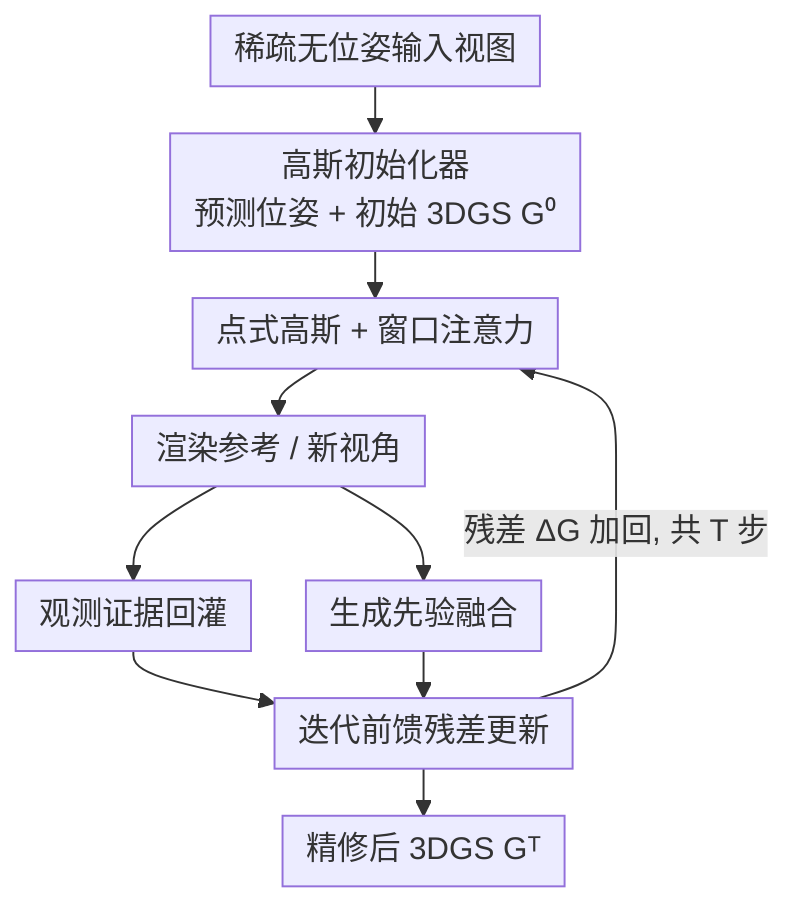

# GIFSplat: Generative Prior-Guided Iterative Feed-Forward 3D Gaussian Splatting from Sparse Views

**会议**: CVPR 2026  
**论文**: [CVF Open Access](https://openaccess.thecvf.com/content/CVPR2026/html/Chen_GIFSplat_Generative_Prior-Guided_Iterative_Feed-Forward_3D_Gaussian_Splatting_from_Sparse_CVPR_2026_paper.html)  
**代码**: [项目页](https://terencepp.github.io/gifsplat-project-page/)  
**领域**: 3D视觉  
**关键词**: 前馈高斯泼溅、稀疏视角重建、迭代残差精修、生成先验、扩散增强

## 一句话总结
GIFSplat 把前馈 3D 高斯泼溅从"一锤定音的单次预测"改成"多步纯前向残差精修"，每步用渲染-观测的特征差以及冻结扩散模型的增强差当作高斯级线索去预测残差更新，从而在不做任何测试时梯度优化、不需要相机位姿、保持秒级推理的前提下，把稀疏视角与跨域场景的重建质量在 DTU 上提升超过 2 dB。

## 研究背景与动机

**领域现状**：从多视角图像重建 3D 场景有两条主线。一条是逐场景优化（NeRF、3DGS 及其变体），靠成千上万步测试时梯度下降把光度误差压到很低，质量高但推理慢、且在稀疏视角下大幅掉点；另一条是前馈方法（DUSt3R、VGGT、NoPoSplat、AnySplat 等），用 ViT 一次前向就从 2D 图像里估出 3D 属性，推理只要毫秒到秒级。

**现有痛点**：前馈方法的"一次性预测"范式带来两个硬伤——其一，质量被模型容量死死框住，复杂场景保真度上不去；其二，缺乏针对单个场景的细化能力，残差误差留在那里没法纠正，连大模型也救不了。而要补质量，自然想到引入生成先验，但现有"扩散增强重建"管线（如 Difix3D+）都是优化式的：渲染临时视角 → 扩散模型增强 → 把增强视角塞回训练集再优化，形成一个反复迭代的反馈环。

**核心矛盾**：这个反馈环和前馈管线根本不兼容。合成视角集合越滚越大，时间和显存复杂度随之膨胀，再叠上 ViT 自注意力的昂贵开销，秒级推理就保不住了；更要命的是，前馈方法是直接从图像重建 3D、而不是在更新一个已有的场景表示，所以根本没有"在现有 3D 状态上迭代增强"的接口，更别说一步步注入生成先验。

**本文目标**：在纯前馈框架里实现三件以往只能二选一的事——前馈效率、场景自适应细化、可靠注入生成先验。

**切入角度**：作者借鉴了光流（RAFT）、视觉 SLAM（DROID-SLAM）里"迭代残差精修"的成功经验：与其一次预测到底，不如维护一个可更新的状态，用证据驱动地多步小幅修正。把这套思路搬到 3DGS 上——让模型反复读"当前渲染和真实/增强图像的差距"，前向地预测一个残差去更新高斯。

**核心 idea**：用"多步纯前向残差更新一组固定数量的高斯"替代"单次预测"，并把冻结扩散先验蒸馏成轻量的高斯级差异线索喂进更新环，既拿到生成先验又不让视角集合爆炸、不引入测试时反传。

## 方法详解

### 整体框架

给定一组无标定的多视角图像 $V=\{I_m\}_{m=1}^{M}$，目标是恢复一组 3D 高斯 $G=\{g_i\}_{i=1}^{N}$（每个高斯 $g_i=(x_i,s_i,r_i,c_i,\alpha_i)$ 含位置、尺度、朝向、颜色、不透明度），让它与输入光度一致、同时推理快、跨域鲁棒。整体分两阶段、三组件：第一阶段一次快速前馈给出可靠初始化 $G^{(0)}$；第二阶段用一个**权重共享的轻量残差头**做 $T$ 步纯前向更新，每步读"渲染 vs 观测"的特征差和"渲染 vs 扩散增强"的特征差作为线索，预测残差 $\Delta G$ 加回当前高斯。三组件分别是：(1) **高斯初始化器** $F_\phi$（直接拿 AnySplat 改造、去掉体素化模块、部分微调），预测相机位姿和初始 3DGS；(2) **迭代残差高斯头** $U_\theta$，跨所有步复用同一套权重；(3) **生成先验融合模块**，把扩散增强渲染转成高斯级线索。整条链路不需要相机位姿、不做测试时梯度优化，显存和时间随步数 $T$ 大致线性增长。

### 关键设计

**1. 迭代前馈残差更新：用多步前向逼近"梯度精修"，但不反传**

这是全文的骨架，直接针对前馈"一次性预测、无法吸收新证据"的痛点。优化式方法靠长时间梯度下降反复修高斯，前馈方法则缺乏吸收新证据的能力；作者要的是"前向的高效 + 自适应的细化"。具体地，迭代头在无测试时梯度的条件下，把初始 $G^{(0)}$ 经 $T$ 步前向逐渐变成 $G^{(T)}$，每步预测逐高斯残差并更新：

$$\Delta G^{(t)} \leftarrow U_\theta\big([\,G^{(t)} \,\|\, \{o_i\}^{(t)}\,]\big),\qquad G^{(t+1)} \leftarrow G^{(t)} + \Delta G^{(t)},\quad t=0,\dots,T-1.$$

从效果上看，它等价于前向地近似最小化特征空间的渲染-观测差异 $\|\psi(I_m)-\psi(R(G;\Pi_m))\|$（$\psi$ 是冻结特征提取器，$R$ 是可微光栅化器），但全程没有任何梯度回传。关键巧思是 $U_\theta$ **权重共享**：和并行工作 iLRM"把每步展开成独立参数的 transformer 层、参数随深度线性增长且推理步数固定"不同，GIFSplat 用单个共享模块让参数量恒定，迭代步数还能在推理时灵活调整。这一条对应的纯观测变体就是 IFSplat。

**2. 观测证据回灌：把像素级渲染误差软分配回每个高斯**

迭代头要"知道当前哪里渲染得不好"，但误差天然存在于像素上、而更新对象是高斯，需要一个把像素误差映射回高斯的桥梁。第 $t$ 步先对渲染图过 $\psi(\cdot)$ 算特征差 $O_m^{(t)}=\psi(I_m)-\psi(R_m^{(t)})$，再用光栅化的软分配权重把像素线索池化到高斯：

$$o_i^{(t)} \leftarrow \frac{\sum_{m\in S^{(t)}}\sum_u w_i(u)\,O_m^{(t)}(u)}{\sum_{m\in S^{(t)}}\sum_u w_i(u)+\varepsilon}.$$

其中 $w_i(u)=\alpha_i(u)\prod_{j=1}^{i-1}(1-\alpha_j(u))$ 正是深度排序后第 $i$ 个高斯在像素 $u$ 处的标准前到后混合权重——也就是说，"哪个高斯对这个像素贡献大、它就更多地接收这个像素的误差线索"。这样得到的 $o_i$ 与高斯一一对应，可以直接和高斯状态拼接喂进 $U_\theta$，让残差更新落在真正该修的高斯上。

**3. 生成先验融合：把冻结扩散增强蒸馏成高斯级线索，不让视角集合爆炸**

当观测线索本身很弱时（稀疏视角、域偏移、欠约束区域），纯观测精修补不出高频细节，需要生成先验。但作者刻意避开优化式管线"扩充增强视角集合再重优化"的老路——那会带来视角爆炸和昂贵计算。取而代之：对当前渲染 $R_m^{(t)}$ 用冻结的单步扩散增强器 $E_\phi$（基于 DiFiX/Difix3D+）得到增强图 $\tilde R_m^{(t)}=E_\phi(R_m^{(t)})$，在特征空间取增强差 $P_m^{(t)}=\psi(\tilde R_m^{(t)})-\psi(R_m^{(t)})$，再用和观测线索完全一样的软分配池化成高斯级先验线索 $p_i^{(t)}$。最后把观测线索和先验线索在高斯级拼接进同一个更新头：

$$\Delta G_i^{(t)} = U_\theta\big([\,g_i^{(t)} \,\|\, \{o_i\}^{(t)} \,\|\, \{p_i\}^{(t)}\,]\big).$$

整个过程对扩散器**不做任何梯度反传**，先验只当作前向线索使用——这正是它能保住秒级前馈推理、又能注入生成知识的原因。加上先验线索的完整模型就是 GIFSplat。

**4. 点式高斯 + 窗口注意力：让残差精修尊重真实 3D 邻域**

以往前馈方法（pixelSplat、MVSplat 等）用像素对齐高斯，把高斯绑死在图像网格上，既计算重、又和真实 3D 邻域错位，还容易在平滑区过密、在细节/遮挡区欠表达。GIFSplat 把像素对齐高斯转成**点式高斯**，并按相机投影对应预训练特征；同时在 $U_\theta$ 的注意力块里用**窗口注意力**，但作用域是 3DGS 空间里的局部邻域、而不是图像 token。这样既高效地建模了 3D 高斯之间的局部关系，又让每一步残差更新真正发生在几何邻域上，是迭代精修能稳步收敛的几何前提。消融里去掉窗口注意力会明显掉点，印证了"在 3D 点空间做交互"的价值。

### 损失函数 / 训练策略

采用两阶段训练。**阶段 1** 只训初始化器，用重建损失 + 几何蒸馏损失：$\mathcal{L}_{\text{stage1}}=\sum_{m}(\lambda_{\text{rec}}\mathcal{L}_{\text{rec}}+\mathcal{L}_{\text{dist}})$，前者逼渲染图匹配输入图、后者从预训练模型迁移几何线索，保证稀疏视角下几何也合理。**阶段 2** 冻结初始化器、展开 $T=3$ 步前向精修，逐步监督：$\mathcal{L}_{\text{stage2}}=\sum_{t=1}^{T}\omega_t\sum_m\|I_m-R_m^{(t)}\|^2$，步权 $\omega_t=[0.4,0.3,0.3]$ 偏向早期步（早期负责纠大残差、后期微调细节）。值得注意的是观测线索 $o_i^{(t)}$ 和先验线索 $p_i^{(t)}$ 都是训练时在线计算的，不预先构造 $\{o,p,G,\Delta G\}$ 监督元组，$\Delta G^{(t)}$ 通过展开的多步重建目标端到端学出来。

## 实验关键数据

训练集为 DL3DV 与 RealEstate10K（含室内外场景），DTU 用作跨域泛化测试。指标为 PSNR / SSIM / LPIPS，全程无需相机位姿、无测试时梯度优化，在 4×H200 上训练。IFSplat 为纯观测变体，GIFSplat 为加生成先验的完整版。

### 主实验

RealEstate10K 2-view 评测（按重叠率分 small/medium/large，下表为 Average 列）：

| 方法 | 位姿 | PSNR↑ | SSIM↑ | LPIPS↓ |
|------|------|-------|-------|--------|
| MVSplat | 需要 | 23.977 | 0.811 | 0.176 |
| NoPoSplat | 免位姿 | 25.033 | 0.838 | 0.160 |
| AnySplat | 免位姿 | 25.176 | 0.839 | 0.161 |
| IFSplat (本文) | 免位姿 | 26.291 | 0.854 | 0.145 |
| **GIFSplat (本文)** | 免位姿 | **26.559** | **0.867** | **0.138** |

DL3DV 8-view 评测 与 DTU 跨域泛化（模型仅在 RealEstate10K 上训练）：

| 方法 | DL3DV PSNR↑ | DL3DV LPIPS↓ | DTU PSNR↑ | DTU LPIPS↓ |
|------|-------------|--------------|-----------|------------|
| FLARE | 23.33 | 0.237 | 17.528 | 0.283 |
| AnySplat | 23.76 | 0.187 | 18.122 | 0.276 |
| IFSplat (本文) | 24.69 | 0.171 | 19.921 | 0.274 |
| **GIFSplat (本文)** | **24.91** | **0.164** | **20.214** | **0.251** |

GIFSplat 在三个数据集上全面超过近期前馈基线；摘要所称"提升最高 +2.1 dB"主要来自 DTU 跨域场景——GIFSplat 20.214 vs AnySplat 18.122 ≈ +2.09 dB，说明迭代残差 + 生成先验在跨域、欠约束场景收益最大。

### 消融实验

RealEstate10K 上逐组件消融（数值对应主表 Average 量级）：

| 配置 | PSNR↑ | SSIM↑ | LPIPS↓ | 说明 |
|------|-------|-------|--------|------|
| w/o Refinement（去阶段2迭代） | 24.901 | 0.831 | 0.164 | 退化最大，等价于只剩初始化 |
| w/o window att.（去窗口注意力） | 25.327 | 0.837 | 0.152 | 3D 点空间交互被破坏 |
| w/o Gen. Prior（去生成先验） | 26.291 | 0.854 | 0.145 | 主要伤 LPIPS / 感知质量 |
| **Full（GIFSplat）** | **26.559** | **0.867** | **0.138** | 三者互补 |

迭代步数分析（PSNR）：从初始 24.901 → 1 步 25.774 → 2 步 26.107 → 3 步 26.559（GIFSplat），4 步仅到 26.561，单调上升但 3 步后明显饱和，故主实验取 $T=3$ 作为精度-延迟折中。

### 关键发现
- **去掉迭代精修（阶段 2）掉点最狠**：从 26.559 跌到 24.901，证明"多步残差更新"才是质量提升的主引擎，单次前馈初始化远不够。
- **生成先验主要补感知质量**：去掉它 PSNR 从 26.559→26.291（约 -0.27 dB），但 LPIPS 从 0.138→0.145 退化更明显，说明先验线索主要在抑制伪影、补高频纹理，而非拉高像素级 PSNR。
- **收益随步数饱和**：3 步达到性价比最优，4 步几乎不再涨——印证残差精修的"边际递减"，也支撑了把步数固定在小值以保秒级推理的工程选择。
- **跨域增益最大**：DTU（仅在 RealEstate10K 训练）上超过 AnySplat 约 2 dB，远大于同域增益，说明"观测 + 生成先验"双线索在欠约束、域偏移场景下最能发挥。

## 亮点与洞察
- **把"优化式反馈环"折叠进"前馈残差头"**：传统扩散增强重建要不断扩张视角集合再重优化，GIFSplat 只取增强图与原渲染的特征差、池化成高斯级线索喂进下一步更新，既拿到生成先验又彻底避开视角爆炸和测试时反传——这是它能同时保住效率和质量的关键。
- **软分配权重一物两用**：同一套光栅化混合权重 $w_i(u)$，既用来池化观测误差、又用来池化生成先验差，把"像素世界的信号"干净地搬到"高斯世界"，工程上极简且对应明确。
- **权重共享让迭代步数变成推理时可调旋钮**：相比把每步展开成独立参数层的并行工作，参数量恒定、步数灵活，部署时可按延迟预算随时增减步数。
- **可迁移思路**：RAFT/DROID-SLAM 式的"维护可更新状态 + 证据驱动残差"范式被成功搬到 3DGS，这套"前向多步精修替代单次预测"对其他前馈几何预测任务（深度、点图、网格）同样有借鉴意义。

## 局限与展望
- 生成先验依赖现成的冻结扩散增强器 DiFiX，质量上限和偏差被它绑定；增强器在某些域上若引入幻觉纹理，可能被当成"高频线索"误导更新（论文未深入分析这种失败模式）。
- 迭代收益在 3 步后基本饱和，意味着该框架对"需要大幅几何改写"的极端稀疏场景能力仍有限——残差更新本质是局部小幅修正，初始化错得离谱时难以挽回。
- 每步要渲染参考/新视角并跑一次扩散增强，时间/显存随步数与每步视角预算线性增长；虽保住秒级，但相比纯单次前馈仍有数倍开销。
- 实验主要在 2-view 和 8-view 设置下验证，更大视角数、更复杂户外大场景下的可扩展性有待进一步检验。

## 相关工作与启发
- **vs 优化式扩散增强重建（Difix3D+ 等）**: 它们渲染→增强→塞回训练集→重优化，靠多步生成 + 长时间逐场景优化提质量；GIFSplat 把增强差蒸馏成高斯级前向线索、不反传不扩集合，保住秒级推理，区别在于"前馈一次性吸收先验"而非"优化式反复融合"。
- **vs iLRM（并行工作）**: iLRM 把迭代展开成多层非共享参数 transformer，参数随深度线性增长、推理步数固定；GIFSplat 用单个权重共享头，参数恒定、步数推理时可调。
- **vs ReSplat（并行工作）**: ReSplat 也做基于观测误差的迭代前馈精修，但依赖已知相机位姿；GIFSplat 免位姿，且独有"把即时生成扩散先验直接注入更新环"来应对欠约束稀疏视角。
- **vs AnySplat**: 本文初始化器正是去掉体素化的 AnySplat 微调版，可视作"在强单次前馈基线之上加一层迭代残差 + 生成先验"，IFSplat/GIFSplat 相对 AnySplat 的稳定增益直接量化了这层精修的价值。

## 评分
- 新颖性: ⭐⭐⭐⭐ 把"迭代残差精修"与"冻结生成先验前向蒸馏"同时塞进纯前馈 3DGS，思路清晰且填补了"前馈效率 vs 先验注入"的空白。
- 实验充分度: ⭐⭐⭐⭐ 三数据集、多重叠/多视角设置、逐组件消融 + 步数分析齐全，跨域增益有说服力；更大场景与失败模式分析略缺。
- 写作质量: ⭐⭐⭐⭐ 动机推导和公式定义清楚，框架图直观；个别表述/记号（如 N 与 T 混用步数）稍有瑕疵。
- 价值: ⭐⭐⭐⭐ 免位姿、秒级、无测试时梯度的稀疏视角重建对 AR/VR、机器人感知很实用，IFSplat/GIFSplat 两档变体也便于按需取舍。

<!-- RELATED:START -->

## 相关论文

- [\[CVPR 2026\] Z-Order Transformer for Feed-Forward Gaussian Splatting](z-order_transformer_for_feed-forward_gaussian_splatting.md)
- [\[CVPR 2026\] HeroGS: Hierarchical Guidance for Robust 3D Gaussian Splatting under Sparse Views](herogs_hierarchical_guidance_for_robust_3d_gaussian_splatting_under_sparse_views.md)
- [\[CVPR 2026\] iSplat: Iterative Learning for Fine-Grained Gaussian Splatting](isplat_iterative_learning_for_fine-grained_gaussian_splatting.md)
- [\[CVPR 2026\] AnchorSplat: Feed-Forward 3D Gaussian Splatting with 3D Geometric Priors](anchorsplat_feed-forward_3d_gaussian_splatting_with_3d_geometric_priors.md)
- [\[CVPR 2026\] Off The Grid: Detection of Primitives for Feed-Forward 3D Gaussian Splatting](off_the_grid_detection_of_primitives_for_feed-forward_3d_gaussian_splatting.md)

<!-- RELATED:END -->
