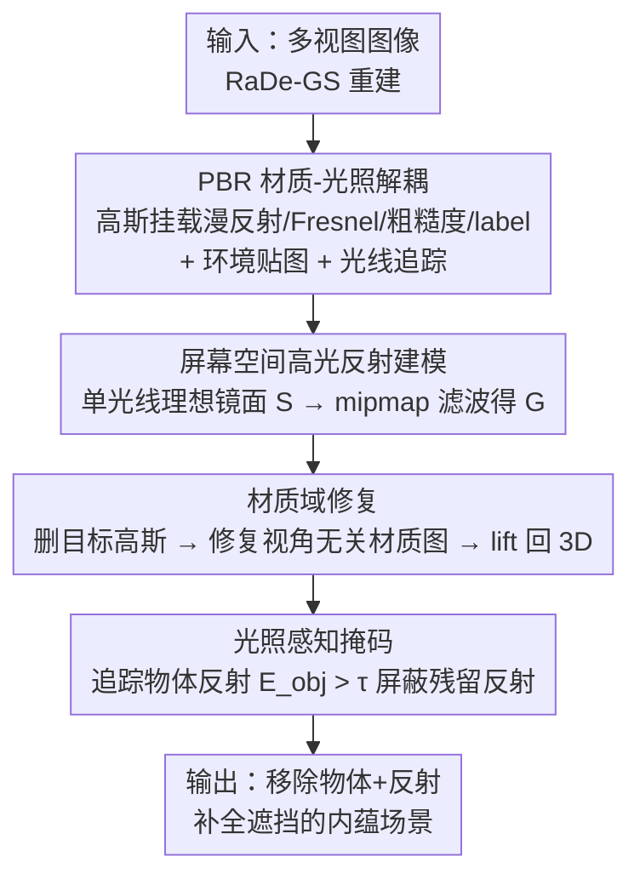

# GOR-IS: 3D Gaussian Object Removal In the Intrinsic Space

**会议**: CVPR 2026  
**论文**: [CVF Open Access](https://openaccess.thecvf.com/content/CVPR2026/html/Zhao_GOR-IS_3D_Gaussian_Object_Removal_In_the_Intrinsic_Space_CVPR_2026_paper.html)  
**代码**: https://applezyh.github.io/GOR-IS-project-page/  
**领域**: 3D视觉  
**关键词**: 3D高斯泼溅, 物体移除, 内蕴分解, 全局光照, 非朗伯表面

## 一句话总结
GOR-IS 把场景从 RGB 空间拆解到「材质 + 光照」的内蕴空间里做 3D 物体移除，先用 PBR 扩展的 3DGS + 显式光线传输把物体在玻璃/金属面上投下的反射一并算出来，再在视角无关的材质域里做补全并用「光照感知掩码」抹掉残留反射，从而第一个把"移除物体时要连它的反射一起移除"做对，在感知相似度 LPIPS 上比现有方法高 13%、PSNR 高 2dB。

## 研究背景与动机

**领域现状**：从多视图图像用 NeRF / 3DGS 重建 3D 场景已是标准做法，而从重建结果里移除一个物体（object removal）是 VR、具身智能里很基础的编辑需求——要求把物体原来遮挡的区域几何完整、外观无缝地补回来。由于缺少原生的 3D 修复模型，主流 pipeline 是「在 2D 单视图上修复 → 再 lift 回 3D」，这会带来多视图不一致，所以这类工作的核心战场一直是「跨视图几何 + 外观一致性」。

**现有痛点**：现有方法（3DGIC、AuraFusion360、GScream、GS Grouping 等）确实在一致性上做了大量努力，但有两个被集体忽视的硬伤。其一是**全局光照效应**——物体在光滑表面上投下的反射。移除物体时，它的反射也应该消失，否则会出现"物体没了、镜面里还映着它"的物理穿帮。其二是这些方法普遍依赖一个强假设：**被修复区域的颜色与视角无关**。这个假设在非朗伯（non-Lambertian）材质场景里频繁失效——3D 点的辐射随视角变化，直接套用就会出现模糊、鬼影。

**核心矛盾**：问题的根本在于这些方法都在 **RGB 像素空间**里做移除和修复，而 RGB 是材质、光照、几何耦合在一起的最终成像结果。在这个耦合空间里，你既无法单独"识别并删掉某个物体造成的反射"，也无法回避"颜色随视角变"的事实。

**本文目标**：把物体移除拆成两个可独立攻克的子问题——(1) 移除物体时保持全局光照效应一致（连反射一起删）；(2) 在非朗伯表面上做出视角一致的外观修复。

**切入角度**：作者的关键洞察是——**到内蕴空间（intrinsic space）里去做**。把场景分解成材质（反照率、粗糙度、Fresnel）和光照这些本征属性，并显式建模光线传输。因为材质属性天生与视角无关，在材质域修复就绕过了那个有缺陷的"视角无关颜色"假设；又因为显式建了光线传输，物体投在镜面上的反射就能被追踪、识别、删除。

**核心 idea**：用「内蕴空间分解 + 显式光线传输」代替「RGB 空间直接修复」，让全局光照一致性和非朗伯外观一致性都变得可解。

## 方法详解

### 整体框架
GOR-IS 把 3D 物体移除拆成「先解耦、再修复」两段。输入是一组预先标定好的多视图图像，输出是移除目标物体（及其反射）并补全遮挡区域后的 3D 场景。整条 pipeline 由两个核心模块串起来：**材质-光照解耦模块（Sec 3.2）**负责把场景拆进材质/光照域并显式算出光线传输，保证移除物体时全局光照效应一致；**内蕴空间修复模块（Sec 3.3）**则在材质域里做补全、并用光照感知掩码压住反射伪影，保证外观一致。底层 3D 表示用 RaDe-GS（一种能给出准确深度/法向的 3DGS 变体），并给每个高斯额外挂上 PBR 材质属性和一个标识目标物体的 label。

整体上数据是这样流转的：多视图图像 → 重建出带材质属性的高斯 + 可优化环境贴图 → 通过延迟着色（deferred shading）算出每像素的漫反射 + 高光反射，得到分解后的内蕴场景 → 删掉带目标 label 的高斯做粗移除 → 把材质图渲染到 2D、修复后 lift 回 3D → 用光照感知掩码屏蔽掉物体反射所影响的区域再做监督 → 得到干净的 inpainted 场景。

### 关键设计

**1. PBR 材质-光照解耦与显式光线传输：把"反射"变成可计算、可删除的量**

要做到"删物体连反射一起删"，前提是反射本身得是被显式算出来的、而不是 baked 进 RGB 里的。作者在 RaDe-GS 的原始高斯属性（协方差 $\Sigma$、位置 $\mu$、颜色 $c$、不透明度 $o$）之外，给每个高斯扩展出 PBR 材质：漫反射 $d\in\mathbb{R}^3$、Fresnel 项 $f_0\in\mathbb{R}^3$、粗糙度 $r\in\mathbb{R}$，外加一个用于识别目标物体的 label $l\in\mathbb{R}$。由于本任务光照固定，作者直接把漫反射当成内蕴材质属性以简化优化。光线传输则用「3DGS 光线追踪器算间接辐射 + 可优化环境贴图算直接辐射」来显式建模。具体着色采用延迟着色：先把法向 $n$、聚合后的漫反射 $d_{agg}$、Fresnel $f_0^{agg}$、粗糙度 $r_{agg}$ 光栅化到屏幕空间，再逐像素着色，把出射颜色拆成漫反射项 $D$ 与高光反射项 $G$：

$$C(\boldsymbol{x},\boldsymbol{\omega_o}) = D(\boldsymbol{x}) + G(\boldsymbol{x},\boldsymbol{\omega_o})$$

其中 $\boldsymbol{x}$ 是像素对应的着色点，$\boldsymbol{\omega_o}$ 是观察方向。这样一来，"物体投在镜面上的反射"就不再是一团无法分离的像素，而是 $G$ 项里一个可以被追踪到源头（哪个高斯发出）的可计算量——这正是后面能"识别并删掉反射"的物理基础，也是本文区别于所有只在 RGB 空间操作的前作的根本。

**2. 屏幕空间高光反射建模：用单光线 + mipmap 滤波近似一般光滑表面的反射**

精确算高光反射 $G$ 需要密集采样入射辐射并解渲染方程，计算量大到不可接受；而前人常用的"理想镜面"简化又只能处理完美镜面、handle 不了一般的粗糙光滑表面。作者的办法是引入一个**屏幕空间滤波器**。先算理想镜面反射 $S$：

$$S(\boldsymbol{x},\boldsymbol{\omega_o}) = F(\boldsymbol{x},\boldsymbol{\omega_r})\,L_i(\boldsymbol{x},\boldsymbol{\omega_r})$$

反射方向由观察方向和法向决定 $\boldsymbol{\omega_r}=\boldsymbol{\omega_o}-2(\boldsymbol{\omega_o}\cdot n)n$，Fresnel 项 $F$ 用 Schlick 近似（依赖 $F_0$，由聚合 Fresnel $f_0^{agg}$ 建模），入射辐射 $L_i$ 是环境贴图的直接辐射加上追踪高斯得到的间接辐射、按可见性加权。关键观察是：**中等粗糙表面的高光反射可以近似为理想镜面反射的"模糊版本"，模糊程度由粗糙度决定**。于是对 $S$ 施加一个滤波算子 $L[\cdot]$ 得到最终高光项：

$$G = L[S,R] = L\big[F(\boldsymbol{x},\boldsymbol{\omega_r})L_i(\boldsymbol{x},\boldsymbol{\omega_r}),\,R\big]$$

实现上 $L[\cdot]$ 用屏幕空间 mipmap 金字塔，按表面粗糙度 $R$（由 $r_{agg}$ 建模）自适应采样对应层级。这套做法每像素只追踪一条光线，避免了多光线追踪，大幅降低开销，同时保留了真实的光滑反射效果——是"realism vs 效率"权衡里很务实的一手。

**3. 材质域修复：在视角无关的材质属性上补全非朗伯表面**

常规 3D 修复流程是：用 label $l$ 找到目标物体对应的高斯并删除（粗移除），暴露出遮挡区域；从多视角渲染出 2D 图 $I_i$ 和修复掩码 $P_i$；用 2D 修复模型（本文用 LaMa）逐图补出 $\hat I_i$；挑几张高质量结果当 reference lift 回 3D。问题在于这套流程隐含假设"被遮挡区域颜色与视角无关"，在非朗伯表面上直接崩。作者的破解是：**不要只修 RGB 颜色图，而是去修材质图**——漫反射图 $D_i$、Fresnel 图 $F_i$、粗糙度图 $R_i$、法向图 $N_i$，用同样的掩码 $P_i$ 引导。因为材质属性天生与视角无关，在材质域做修复就把"修复过程"和"观察方向"解耦了，从而能对非朗伯表面做出视角一致的补全。这是把第一段"内蕴分解"的成果真正用在修复上的关键一步：分解不只是为了删反射，也让修复有了一个干净、视角无关的工作空间。

**4. 光照感知掩码：抹掉物体反射污染的监督区域，防止反射残留伪影**

即便物体的几何被删了，它在镜面上的反射仍可能残留——而现有方法用预定义物体掩码圈定修复区、其余区域照搬 GT 监督，会把这些残留反射当成"正确答案"学进去，造成伪影。作者注意到：**物体的影响范围可能超出它自身占据的像素区域**（因为有反射）。于是把每个高斯的 label 属性也喂进光线传输模型，沿反射方向 $\boldsymbol{\omega_r}$ 追踪源自目标物体的反射，得到入射 label 贡献 $E_i(\boldsymbol{x},\boldsymbol{\omega_r})$（算法和入射辐射一样，只是把辐射换成 label 属性），再像高光那样得到物体相关反射：

$$E_{\text{obj}}(\boldsymbol{x},\boldsymbol{\omega_o}) = L\big[F(\boldsymbol{x},\boldsymbol{\omega_r})E_i(\boldsymbol{x},\boldsymbol{\omega_r}),\,R\big]$$

反射强度高于阈值 $\tau$ 的像素被判定为反射污染区，得到掩码 $M_r=[E_{\text{obj}}>\tau]$。修复时用 $M_r$ 把这些区域从 GT 监督里排除掉，从而既删了物体、又不会被它残留的反射"带偏"，有效防止反射诱发的伪影。这个设计巧在它完全复用了设计 1/2 里建好的光线传输机制，只是把"传输辐射"换成"传输 label"。

### 损失函数 / 训练策略
两阶段训练。**第一阶段**用预先标定的多视图图像优化高斯基元和环境贴图，完成场景分解与显式光线传输构建，损失为：

$$\mathcal{L} = \mathcal{L}_{c} + \lambda_{d}\mathcal{L}_{d} + \lambda_{dn}\mathcal{L}_{dn} + \lambda_{n}\mathcal{L}_{n} + \lambda_{s}\mathcal{L}_{s} + \lambda_{\Omega}\mathcal{L}_{\Omega}$$

其中 $\mathcal{L}_c$ 是渲染图与 GT 的颜色损失，$\mathcal{L}_d$ 深度畸变损失，$\mathcal{L}_{dn}$ 渲染法向 $N$ 与深度算出法向 $N_d$ 的深度-法向一致损失，$\mathcal{L}_n$ 渲染法向与法向估计器给的参考法向 $N_{gt}$ 的法向损失，$\mathcal{L}_s$ 作用在材质/法向图上的双边平滑损失，$\mathcal{L}_{\Omega}$ 预测 label 与 GT label 的二元交叉熵。**第二阶段**固定环境贴图、在 2D 修复结果引导下继续优化高斯完成修复，需修复区域的损失为 $\mathcal{L}_{\text{inpaint}} = \lambda_A\mathcal{L}_A + \lambda_M\mathcal{L}_M$——$\mathcal{L}_A$ 是渲染图与修复图的外观损失（只作用在朗伯面），$\mathcal{L}_M$ 是材质损失（漫反射/Fresnel/粗糙度/法向，只作用在非朗伯面）。其余无需修复区域沿用第一阶段损失但去掉 $\mathcal{L}_s$ 和 $\mathcal{L}_{\Omega}$，并用光照感知掩码 $M_r$ 把反射影响区域排除出损失计算。

## 实验关键数据

### 主实验
作者自建了两套带强全局光照效应（每个场景含一个主要非朗伯表面）的数据集：合成集 GOR-IS-Synthetic（8 个场景，Blender Cycles 渲染，每场景 100 训练视图 + 100 新视角测试）和真实集 GOR-IS-Real（2 个场景，数码相机拍 ~300 张，SAM2 出掩码）；并在以朗伯面为主、几乎无全局光照效应的 SPIn-NeRF（10 场景）上测泛化。指标含 PSNR / SSIM / LPIPS / FID，外加只在物体占据区域算的 M-LPIPS / M-FID。

| 数据集 | 指标 (PSNR↑ / LPIPS↓) | 本文 | 次优 baseline | 提升 |
|--------|----------------------|------|--------------|------|
| GOR-IS-Synthetic | PSNR | **31.91** | 29.92 (GScream) | +1.99 dB |
| GOR-IS-Synthetic | LPIPS | **0.039** | 0.045 (GScream) | ↓13% |
| GOR-IS-Synthetic | M-LPIPS | **0.060** | 0.093 (GS-Grouping) | ↓35% |
| GOR-IS-Real | PSNR | **24.52** | 22.42 (GScream) | +2.10 dB |
| GOR-IS-Real | LPIPS | **0.101** | 0.109 (GScream) | ↓7% |
| SPIn-NeRF (朗伯) | PSNR | 20.15 | 20.55 (SPIn-NeRF) | 持平 SOTA |
| SPIn-NeRF (朗伯) | FID | **32.7** | 29.8 (GScream) | 接近最优 |

在两套带全局光照效应的数据集上，GOR-IS 在几乎所有指标上明显领先（合成集 PSNR 31.91 vs 次优 29.92，real 集 24.52 vs 22.42）；在 SPIn-NeRF 这种几乎没有全局光照效应的朗伯场景上，与 SOTA 持平，说明引入内蕴建模没有损害对"简单场景"的泛化能力。

### 消融实验
作者在 GOR-IS-Synthetic 上做了两组增量消融。第一组从 RaDe-GS baseline 逐步加上显式光线传输（ELT）和屏幕空间滤波：

| 配置 | PSNR | LPIPS | M-LPIPS | FID | 说明 |
|------|------|-------|---------|-----|------|
| Baseline (RaDe-GS) | 28.60 | 0.050 | 0.099 | 34.0 | 不建光线传输 |
| + ELT modeling | 31.44 | 0.043 | 0.064 | 25.7 | 加显式光线传输，PSNR +2.84 |
| + screen-space filtering | **31.91** | **0.039** | **0.060** | **23.4** | 再加屏幕空间滤波 |

第二组在完整模型上分别去掉内蕴修复的两个组件：

| 配置 | PSNR | LPIPS | M-LPIPS | FID | M-FID | 说明 |
|------|------|-------|---------|-----|-------|------|
| w/o LA masking | 31.64 | 0.040 | 0.060 | 24.1 | 65.8 | 去光照感知掩码 |
| w/o material inpainting | 31.31 | 0.041 | 0.075 | 24.0 | 71.4 | 去材质修复，M-LPIPS/M-FID 明显变差 |
| Full model | **31.91** | **0.039** | **0.060** | **23.4** | **65.0** | 完整模型 |

### 关键发现
- **显式光线传输是最大功臣**：从 baseline 加 ELT，PSNR 直接从 28.60 跳到 31.44（+2.84 dB），M-LPIPS 从 0.099 砍到 0.064，证实"把反射显式算出来"是物理一致性的关键来源；屏幕空间滤波再补一刀做精细高光。
- **材质修复主要救物体占据区**：去掉材质修复后，M-LPIPS（0.060→0.075）、M-FID（65.0→71.4）这类只看修复区域的指标退化最明显，说明它专门解决非朗伯表面的修复质量，而非整体画质。
- **光照感知掩码专治残留反射**：去掉后 PSNR/FID 小幅下降（31.91→31.64、23.4→24.1），作用是抑制反射诱发的模糊伪影，量级小但视觉上消除穿帮。
- **泛化无副作用**：在无全局光照效应的 SPIn-NeRF 上仍持平 SOTA，说明内蕴建模在"用不上"的场景里不会反噬。

## 亮点与洞察
- **"换空间"而非"换网络"的范式转移**：现有工作都在 RGB 空间里卷一致性，GOR-IS 把战场搬到内蕴空间，让"删反射""非朗伯修复"这两个在 RGB 空间里近乎无解的问题变得自然可解。这是最让人"啊哈"的地方——很多看似需要更强生成模型的问题，其实是工作空间选错了。
- **label 复用光线传输追踪反射**：把"是否属于目标物体"的 label 当成一种可传输的量沿反射方向追踪（$E_{obj}$ 与高光 $G$ 完全同构），优雅地把"哪些像素被物体反射污染"变成可计算的掩码，几乎零额外机制成本。
- **单光线 + mipmap 近似光滑反射**：用"高光=理想镜面的模糊版、模糊度由粗糙度定"这个观察，把昂贵的多光线追踪压成每像素一条光线 + mipmap 采样，是可迁移到其它实时 PBR 渲染的实用 trick。
- **可迁移到可重光照/场景编辑**：内蕴分解 + 显式光线传输这套底座不止能做移除，天然适配重光照、材质替换等下游编辑——本文只是把它用在了 removal 上。

## 局限与展望
- **未显式建模漫反射相关的全局光照**：作者承认这会在某些场景导致轻微不一致，未来需更先进的光线传输和更鲁棒的内蕴分解来补。
- **难处理多个非朗伯面互相反射**：为避免多次反弹路径追踪，框架直接在辐射场里追踪，代价是多个镜面互相映射的情形 handle 不了。
- **依赖准确的内蕴分解与材质估计**：整套方法建立在 RaDe-GS 的深度/法向和 PBR 材质估计之上，材质估错会直接传导到反射建模和材质域修复。⚠️ 这一条是笔者推断的连带风险，以原文为准。
- **数据规模偏小**：自建数据集合成 8 场景 + 真实 2 场景，真实场景尤其少，全局光照效应一致性的结论还需更大规模真实数据验证。

## 相关工作与启发
- **vs GScream / 3DGIC（参考视图修复）**：它们从一或几个 reference view 同时修 RGB 和深度来保跨视图一致，但完全在 RGB 空间操作、忽视全局光照，遇到镜面反射就穿帮；GOR-IS 在内蕴空间做、显式删反射，是它们的主要对照组也是被超越对象。
- **vs AuraFusion360 / InFusion / 扩散先验类方法**：这类用生成模型/扩散先验增强外观一致性，但仍假设颜色视角无关，非朗伯面上会糊；GOR-IS 用视角无关的材质域修复从根上绕开这个假设。
- **vs 内蕴分解/可重光照工作（NeRF/3DGS PBR 类）**：以往内蕴分解多用于造可重光照资产或增强 3D 表示（如建高频反射场景），GOR-IS 是首个把内蕴分解用于"物理一致 + 视觉连贯的物体移除"的工作。
- **vs SPIn-NeRF（NeRF baseline）**：早期 NeRF-based 移除方法，在带全局光照的场景上被大幅超越，但在它擅长的朗伯场景上 GOR-IS 仅与之持平，说明 GOR-IS 的增益精准来自"会建光照"的场景。

## 评分
- 新颖性: ⭐⭐⭐⭐⭐ 首个把全局光照一致性纳入 3D 物体移除、并整体迁到内蕴空间求解，范式层面的创新
- 实验充分度: ⭐⭐⭐⭐ 自建合成+真实数据 + SPIn-NeRF 泛化 + 两组增量消融对得很齐，但真实场景仅 2 个偏少
- 写作质量: ⭐⭐⭐⭐⭐ 动机→洞察→方法→消融逻辑闭环清晰，图 3/4/5 把 pipeline 讲得很直观
- 价值: ⭐⭐⭐⭐ 解决了物体移除里一个被长期忽视的真实痛点，对 VR/具身场景编辑有直接价值

<!-- RELATED:START -->

## 相关论文

- [\[CVPR 2026\] Towards Intrinsic-Aware Monocular 3D Object Detection](towards_intrinsic-aware_monocular_3d_object_detection.md)
- [\[CVPR 2026\] Intrinsic Geometry-Appearance Consistency Optimization for Sparse-View Gaussian Splatting](intrinsic_geometry-appearance_consistency_optimization_for_sparse-view_gaussian_.md)
- [\[ECCV 2024\] Learning 3D Geometry and Feature Consistent Gaussian Splatting for Object Removal](../../ECCV2024/3d_vision/learning_3d_geometry_and_feature_consistent_gaussian_splatting_for_object_remova.md)
- [\[CVPR 2026\] 3D-LATTE: Latent Space 3D Editing from Textual Instructions](3d-latte_latent_space_3d_editing_from_textual_instructions.md)
- [\[CVPR 2026\] Intrinsic Image Fusion for Multi-View 3D Material Reconstruction](intrinsic_image_fusion_for_multi-view_3d_material_reconstruction.md)

<!-- RELATED:END -->
