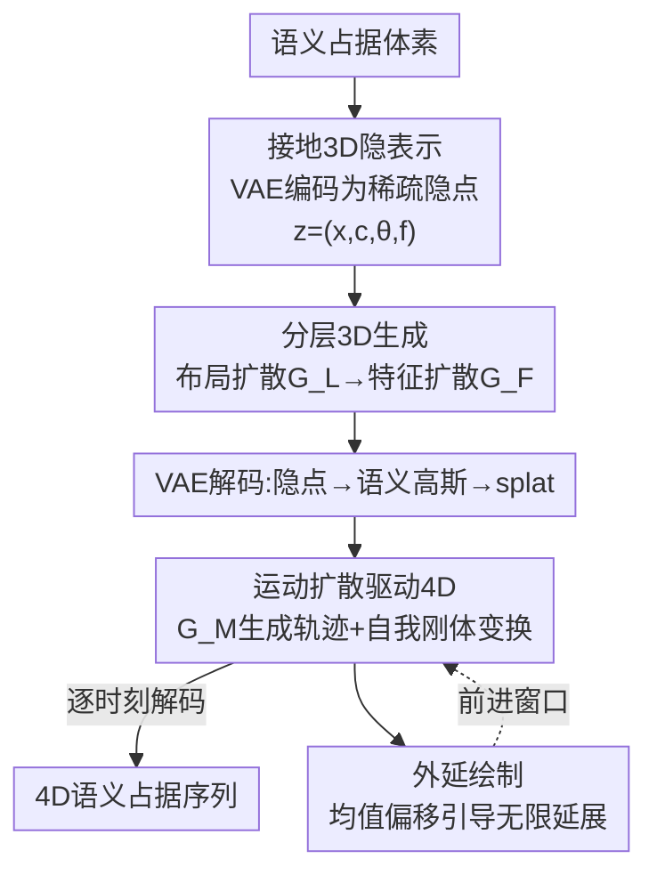

# Grounded Latents for Entity-Centric 4D Scene Generation

**会议**: CVPR 2026  
**论文**: [CVF Open Access](https://openaccess.thecvf.com/content/CVPR2026/html/Park_Grounded_Latents_for_Entity-Centric_4D_Scene_Generation_CVPR_2026_paper.html)  
**代码**: 待确认  
**领域**: 3D视觉 / 场景生成 / 自动驾驶  
**关键词**: 4D场景生成, 接地隐表示, 语义占据, 扩散模型, 实体中心建模

## 一句话总结
LatentWorld 把驾驶场景从"稠密体素体"换成"稀疏的、带 (X,Y,Z) 坐标和语义类别的接地 3D 隐点集"，用布局扩散 + 特征扩散生成可编辑的 3D 场景，再用运动扩散驱动这些持久隐点穿越时间，在 CarlaSC 和 Waymo 上拿到 SOTA 的 4D 占据生成质量，尤其大幅减少前景目标的合并/闪烁/分裂伪影。

## 研究背景与动机

**领域现状**：近期的 3D/4D 驾驶场景生成几乎都在**稠密体素/网格**表示上做去噪扩散（OccSora、DynamicCity、SemCity、PDD、XCube 等），把整个场景当成一个离散化体积来联合生成，场景级别效果不错。

**现有痛点**：稠密体素表示**没有显式的实体概念**——一辆车只是一团连续体素，和邻居没有清晰边界。这带来三个具体问题：(1) 前景目标（车、行人）不是独立参数化的，想放置或移动某个 actor 只能靠"粗粒度控制信号"条件化整个生成器，无法做可靠的、针对单个 actor 的精确调整；(2) 扩展到动态场景后，缺乏实体建模直接表现为序列中目标的**合并(merging)、闪烁(flickering)、分裂(splitting)**；(3) 计算被均匀摊到整个网格（包括大片空旷自由空间），分辨率越高代价越大，算力被浪费在没内容的地方。

**核心矛盾**：稠密网格把"全场景几何"和"单个实体的身份/运动"**纠缠**在一个离散体积里。想要细粒度可控就得提网格分辨率（代价爆炸），而提分辨率也救不了"实体边界不清"这个根本问题；自我运动(ego motion)只能通过全场景的隐式变化来表达，无法把 actor 运动和场景运动干净解耦。

**本文目标**：找一种表示，让 (a) 每个前景 actor 有独立、可直接编辑的身份；(b) 自我运动和 actor 运动都能显式、可靠地施加；(c) 算力自然集中在被占据的区域；(d) 同时支持 3D 静态生成和 4D 时序演化。

**切入角度**：作者的关键观察是——**场景应该围绕"实体"来分解，而不是围绕"网格单元"**。如果把场景写成一组稀疏的、grounded 在具体 (X,Y,Z) 位置的隐点，每个前景 actor 恰好对应一个隐点，那么"移动一个 actor"就退化成"直接编辑一个隐点的坐标和朝向"这种确定操作；自我运动则是对整个隐点集做一次刚体变换。

**核心 idea**：用一组**接地 3D 隐点 (grounded 3D latents)** $Z=\{(x_n, c_n, \theta_n, f_n)\}$ 取代稠密体素，把 4D 生成因式分解成"布局扩散（位置+类别+朝向）→ 逐隐点几何特征扩散 → 持久隐点上的运动扩散"三段，每个隐点再解码成一小簇语义高斯并 splat 回体素做训练/评测。

## 方法详解

### 整体框架
LatentWorld 的输入是语义占据网格（semantic occupancy），输出是可控、时序连贯的 3D/4D 语义占据序列。整条 pipeline 围绕一个**稀疏接地隐点集** $Z=\{z_n\}_{n=1}^{N}$，$z_n=(x_n, c_n, \theta_n, f_n)$：$x_n\in\mathbb{R}^3$ 是位置，$c_n$ 是语义类别，$\theta_n$ 是 BEV 偏航角（前景 actor 用），$f_n\in\mathbb{R}^D$ 编码局部几何。每个前景 actor 恰好分配一个隐点（保证身份不被拆散）；背景区域用可变数量的隐点覆盖以捕捉细节。

整体分四步：(1) 一个 VAE 编码器 $\mathcal{E}$ 把语义体素压成隐点集，解码器 $\mathcal{D}$ 把隐点解码成语义高斯再 splat 回体素；(2) 布局扩散 transformer $G_L$ 生成隐点的布局（位置/类别/朝向）；(3) 特征扩散 transformer $G_F$ 在布局条件下生成逐隐点的深层特征 $f$，解码得到完整 3D 场景；(4) 运动扩散 transformer $G_M$ 生成自我车和动态 actor 的未来轨迹，把同一批持久隐点推进到各个时刻并逐帧解码，得到 4D 占据序列。最后用一个外延绘制(outpainting)机制让场景随自我车前进无限延展。

### 关键设计

**1. 接地 3D 隐表示：用一个隐点代表一个实体，把"编辑实体"变成"编辑一个点"**

这一设计直接针对"稠密体素没有实体概念"的痛点。作者用 VAE 把语义占据网格 $V\in\{0,\dots,C\}^{X\times Y\times Z}$ 编码成稀疏隐点集：编码器先用带 shifted 3D windows 的稀疏体素 transformer 算逐体素特征 $F$，然后**对每个前景实例取其 3D 中心**作为隐点位置、**对背景体素做最远点采样(FPS)** 得到背景隐点，每个采样点索引对应体素特征得到 $f_n$，类别 $c_n$ 取自体素、前景隐点再取实例偏航 $\theta_n$。解码时，每个隐点经 transformer 预测一小簇高斯 $\{(\Delta m_{n,k}, r_{n,k}, s_{n,k}, a_{n,k})\}_{k=1}^{K_n}$（相对偏移、朝向、尺度、不透明度），背景隐点直接加偏移 $m_{n,k}=x_n+\Delta m_{n,k}$，**前景隐点则把偏航 $\theta_n$ 同时作用到偏移和朝向上**：$m_{n,k}=x_n+R(\theta_n)\Delta m_{n,k}$，$r_{n,k}=R(\theta_n)\circ \tilde r_{n,k}$。

这个"一个 actor 一个隐点"的约束是关键：作者明确指出，一个目标用多个隐点会在时间上被拆开(split)，一个隐点解释多个目标会让运动纠缠导致合并(merge)，所以严格用单隐点维持身份。它的好处是天然继承可编辑性——平移隐点就平移对应结构，调前景隐点的偏航就旋转其几何（图 3 展示了对车辆隐点直接转 yaw 实现可靠的航向控制），而背景细节靠隐点密度而非更高网格分辨率来表达。占据建模沿用 GaussianFormer 的语义高斯：体素 $x$ 的占据概率 $\alpha(x)=1-\prod_{i}\big(1-\exp(-\tfrac12 (x-x_i)^\top \Sigma_i^{-1}(x-x_i))\big)$，语义是邻近高斯按不透明度/密度加权的混合。VAE 用交叉熵 + Lovász + $\beta$ 加权 KL 训练：$L(\hat V, V)=L_{CE}+L_{Lovasz}+\beta L_{KL}(f)$。

**2. 分层 3D 生成：先扩散出可编辑的"布局"，再扩散出"几何细节"**

针对"既要可解释可控、又要高保真"这对需求，作者把 3D 生成拆成两个扩散阶段而不是一步到位。第一阶段布局扩散 $G_L$ 只生成隐点的粗布局——位置、类别、朝向。每个隐点编码为 $\bar z_{n,0}=(X_n, Y_n, Z_n, \sin\theta_n, \cos\theta_n, \mathrm{bits}(c_n))$，其中 $(X,Y,Z)$ 归一化到 $[-1,1]$，偏航编成 $(\sin\theta,\cos\theta)$，类别沿用 Bit Diffusion 转成 $\lceil\log_2 C\rceil$ 个比特。这一步很巧：因为布局里**同时有连续分量（坐标、三角函数偏航）和离散分量（类别）**，把类别转 bit 就能用**单一的连续扩散调度**统一建模，避免像 PDD 那样只在固定体素网格上做离散扩散、或像 DynamicCity 那样只在隐特征空间做连续扩散却没有显式类别。训练用 $\epsilon$-prediction：$L_{layout}=\mathbb{E}_{t,\epsilon}\|\epsilon - G_L(\bar z_{n,t}, t)\|_2^2$。

第二阶段特征扩散 $G_F$ 在布局条件下为每个隐点去噪生成深层特征 $f_n$：每个时间步它接收当前噪声特征 $\bar f_{n,t}$ 加上该隐点位置/朝向/类别的嵌入，去噪出 $f_n$ 而**保持布局不变**。分两阶段有三个理由：先结构后细节能提保真度（前人结论）；布局可被用户检视/移动/旋转后再生成跟随编辑的几何（图 4 手动排出复杂交通场景再采样两套特征解码）；同一布局可配多套细粒度生成，给"粗控制 + 细多样性"。

**3. 运动扩散驱动 4D：在持久隐点上显式施加自我变换和 actor 轨迹**

这一设计解决"稠密方法里运动被烤进体素、无法可靠控制"的问题。驾驶场景动态主要来自自我车运动和动态 actor 运动，作者用一个运动扩散 transformer $G_M$ 同时生成两者的轨迹，自我车也当作一个 agent。模型生成 $T=20$ 步、10Hz 的未来，对每个 agent $a$ 输出当前自我坐标系下的未来 waypoint 和航向 $\{(p_{a,t}, \phi_{a,t})\}_{t=1}^{T}$。每个 agent–timestep token 的输入特征是三项之和：待去噪的 $(p_{a,t},\phi_{a,t})$ 嵌入、时间步嵌入、来自隐点的 agent 身份 $(x_a,\theta_a,c_a,f_a)$；去噪器**交叉注意所有当前时刻隐点**（前景+背景）以获取场景上下文；自回归时每个 agent 用过去 10 步经 AdaLN 条件化，10% 概率丢弃做无条件采样。

生成 4D 时按"先更新 actor，再用自我变换推进整场"的顺序：动态隐点移到预测 waypoint/航向，背景隐点原地不动，自我刚体变换统一作用到所有隐点上——

$$(x_n^{t}, \theta_n^{t}) = \begin{cases} \big(R^{(t)}_{ego} p_{n,t}+t^{(t)}_{ego},\; \phi_{n,t}+\Delta\theta^{(t)}_{ego}\big) & \text{若 } n \text{ 为动态} \\ \big(R^{(t)}_{ego} x_n^{t-1}+t^{(t)}_{ego},\; \theta_n^{t-1}+\Delta\theta^{(t)}_{ego}\big) & \text{否则} \end{cases}$$

每个时刻用 $\mathcal{D}$ 把更新后的隐点解码成语义高斯再 splat 成占据。因为 actor 运动没被烤进体素，控制变得直接：把一个前景隐点放到目标 waypoint 和航向，那个 actor 就精确出现在那里——这是稠密体素生成器做不到的。

**4. 外延绘制：均值偏移引导让新隐点稳定地长在前进方向**

自我车前进后场景必须超出最初生成的窗口。网格方法可以固定 BEV crop 只对未知区域去噪，但点表示下"天真地去噪新隐点"会让它们出现在任意位置、可能干扰已生成内容、且新区域稀疏。作者的做法是**冻结已有隐点，只对新隐点去噪**来填充 BEV 窗口前进方向的前半，用后半作上下文；去噪中 (i) 把新隐点裁剪到前半、(ii) 施加一个远离边界的二次均值偏移引导（受 guided diffusion 启发）：设 $\tilde x$ 为新隐点的 x 坐标（自我车朝 +x），调整去噪器预测均值 $\mu'=\mu+\eta\lambda\big(1-\mathrm{clip}(\tilde x,0,1)^2\big)$，其中 $\eta$ 跟随扩散方差调度、$\lambda$ 是推力权重。这个在去噪循环内的均值偏移把新隐点聚到前半、同时不改上下文半区，实现自我车前进时自动、稳定的外延。

### 损失函数 / 训练策略
VAE 用 $L_{CE}+L_{Lovasz}+\beta L_{KL}(f)$ 训练 20 epoch；三个扩散生成器（布局 $G_L$、特征 $G_F$、运动 $G_M$）都用同一套 $\epsilon$-prediction 目标和调度，DiT 训 1200 epoch。VAE 隐藏维 384、编解码各 6 个 block；三个生成器隐藏维 384、各 12 个 DiT block。CarlaSC 用 768 个隐点、Occ3D-Waymo 用 1024 个。

## 实验关键数据

评测沿用前人协议：用预训练 3D autoencoder 比较生成场景与真实场景的特征分布，并做两点改进——**逐语义类别**算指标（减少背景偏置、保留实例级细节），以及用三套编码器（几何-only / 语义-only / 几何+语义联合）分别衡量形状保真、语义合理性和整体质量。分布差异用 **MMD（越低越好）**度量（前人指出 FID 在非高斯特征上不可靠）。CarlaSC 无实例轨迹故只评 3D 静态生成，4D 评在 Waymo 上。

### 主实验

CarlaSC 3D 场景生成（MMD↓，Avg 为逐类平均、All 为全局）：

| 指标类型 | 方法 | Avg↓ | All↓ |
|---------|------|------|------|
| Geometry | SemCity | 10.47 | 9.07 |
| Geometry | PDD | 12.36 | 8.83 |
| Geometry | DynamicCity | 20.45 | 19.66 |
| Geometry | **LatentWorld(本文)** | **6.44** | **3.89** |
| Geo+Sem | SemCity | 10.04 | 3.90 |
| Geo+Sem | PDD | 13.27 | 5.89 |
| Geo+Sem | DynamicCity | 9.98 | 4.13 |
| Geo+Sem | **LatentWorld(本文)** | **6.69** | **1.70** |

几何 Avg 从次优 SemCity 的 10.47 降到 6.44，联合指标 Avg 从 DynamicCity 的 9.98 降到 6.69；前景类（Pedestrian、Vehicle）增益尤其大——例如几何指标 Vehicle 一项本文 5.34 远好于 DynamicCity 的 25.09。

Waymo 4D 场景生成（MMD↓，对比 DynamicCity）：

| 指标类型 | 方法 | Avg↓ | All↓ |
|---------|------|------|------|
| Geometry | DynamicCity | 3.93 | 1.20 |
| Geometry | **LatentWorld(本文)** | **1.62** | **0.19** |
| Semantics | DynamicCity | 3.32 | 0.80 |
| Semantics | **LatentWorld(本文)** | **1.50** | **0.29** |
| Geo+Sem | DynamicCity | 2.61 | 1.63 |
| Geo+Sem | **LatentWorld(本文)** | **0.96** | **0.16** |

三种指标全面领先，前景类（Vehicle、Pedestrian、Motorcycle 等小/快目标）改善最明显：几何 Vehicle 0.92 vs 4.77、Pedestrian 0.26 vs 2.54。作者解释 DynamicCity 在 Building/Vegetation 等背景类还行，但缺显式 actor 因式分解导致时间上的空间漂移和前景模糊。

### 消融实验

隐点数量消融（CarlaSC，mIoU↑ 为重建、MMD↓ 为生成）：

| 隐点数 | mIoU↑ | Geo↓ | Sem↓ | Geo+Sem↓ |
|-------|-------|------|------|----------|
| 256 | 85.45 | 13.32 | 10.95 | 7.33 |
| 512 | 92.90 | 9.90 | 11.11 | 6.97 |
| **768** | 93.63 | 6.44 | 11.30 | **6.69** |
| 1024 | 94.71 | 6.38 | 12.36 | 7.30 |

外延推力权重 $\lambda$ 消融（MMD↓）：

| $\lambda$ | Geo↓ | Sem↓ | Geo+Sem↓ |
|-----------|------|------|----------|
| 0.0 | 3.98 | 3.56 | 2.31 |
| 0.5 | 1.81 | 1.81 | 1.07 |
| **1.0** | 1.57 | 1.86 | **1.04** |
| 1.5 | 1.63 | 1.85 | 1.09 |

### 关键发现
- **隐点数存在几何↔语义的权衡**：重建 mIoU 随隐点增多单调上升（瓶颈更宽），几何生成保真也随之改善；但语义-only 质量在隐点过多时变差——背景密集覆盖让小邻域内挤进多个隐点，类别监督混杂、预测不稳。作者据联合指标选 768。
- **外延引导确实有用且有最优值**：$\lambda=0$（无引导）时新隐点乱漂回已生成区、前半欠填充（联合 MMD 2.31）；$\lambda=1.0$ 达峰值 1.04，提供足够吸引又不过度聚集；$\lambda=1.5$ 把新隐点推太远、边界变稀疏（1.09）。
- **前景类增益是核心卖点**：定性上 DynamicCity 出现车辆闪烁、分裂/合并，且因 ego 运动只能隐式表达，在转弯时无法把 actor 运动和场景运动解耦；本文一 actor 一隐点 + 显式刚体变换，即便快速序列也能保身份、在拥挤场景给出精确行人轨迹。

## 亮点与洞察
- **"实体 = 一个可编辑隐点"是真正可迁移的抽象**：把"移动/旋转一个物体"从"条件化整个生成器并祈祷它听话"变成"对一个隐点的坐标和 yaw 做确定性编辑"，这种 grounded 表示思想可迁移到任何需要可控生成的结构化场景（室内、机器人占据地图等）。
- **Bit Diffusion 统一连续+离散**：把类别转 bit 塞进同一套连续扩散调度，干净地解决了"布局里坐标连续、类别离散"的混合建模问题，避免两套扩散流程，是个值得记住的小 trick。
- **算力随隐点数而非网格大小缩放**：复杂度集中到被占据区域，不像网格方法把算力浪费在空旷自由空间——这对高分辨率大场景是实打实的效率优势。
- **自我运动 = 对整个隐点集的一次刚体变换**，把全局运动建模简化成几何操作，而不是靠全场景体素变化间接表达，这也是前景稳定性的根源。

## 局限与展望
- **依赖实例级标注做前景隐点分配**：编码时前景隐点取自"实例 3D 中心"，所以 CarlaSC 因无实例轨迹只能评静态 3D、4D 只在 Waymo 评——缺实例标注的数据集上前景因式分解能力受限。
- **语义不稳定限制了隐点上限**：隐点过多时背景类别监督混杂，几何和语义的提升不能同时拿满，表示的 scalability 有天花板。
- **评测用 MMD on 预训练 autoencoder 特征**而非直接感知指标，且 Waymo 因算力被时序下采样到 2Hz 训练，绝对生成质量和实时性还需更多验证。
- 外延的均值偏移引导是手工设计的二次推力，$\lambda$ 需调；更自动/自适应的无限延展策略可探索。

## 相关工作与启发
- **vs DynamicCity**：两者都做 4D 占据生成，但 DynamicCity 把场景分解成 HexPlane 稠密特征、运动烤进体素、ego 运动隐式；本文用稀疏接地隐点、一 actor 一隐点、ego 显式刚体变换，前景保真和时序稳定性全面更好（Waymo 联合 MMD 0.96 vs 2.61）。
- **vs OccSora / UniScene**：它们把场景压成稠密 grid-aligned 隐点做去噪；本文的隐点 grounded 在显式 (X,Y,Z) 且可直接编辑，天然耦合运动扩散，无需外部启发式控制器。
- **vs SemCity / PDD / XCube**：这些是静态 3D 场景生成器，依赖 grid-aligned 中间表示、无显式实体因式分解；本文专为下游 4D 运动设计 grounded 隐表示，并用 Bit Diffusion 统一连续/离散布局。
- **vs DrivingSphere**：它先生成静态场景再用交通模拟器填充前景动态；本文把前景动态直接纳入运动扩散，端到端可学习而非依赖外部模拟器。

## 评分
- 新颖性: ⭐⭐⭐⭐⭐ 把驾驶 4D 生成从"稠密体素"范式切换到"实体中心接地隐点"，是表示层面的根本性转变。
- 实验充分度: ⭐⭐⭐⭐ CarlaSC+Waymo 双数据集、逐类 MMD、隐点数和外延权重消融齐全；但 4D 只在 Waymo 评、缺更多感知指标。
- 写作质量: ⭐⭐⭐⭐⭐ 动机—表示—三段扩散—外延逻辑清晰，图 2 总览和图 3-6 定性展示到位。
- 价值: ⭐⭐⭐⭐⭐ 可编辑、可控、算力集中在占据区，对自动驾驶仿真和世界模型有直接实用价值。

<!-- RELATED:START -->

## 相关论文

- [\[CVPR 2026\] PerpetualWonder: Long-horizon Action-conditioned 4D Scene Generation](perpetualwonder_long-horizon_action-conditioned_4d_scene_generation.md)
- [\[CVPR 2026\] Lighting-grounded Video Generation with Renderer-based Agent Reasoning](lighting-grounded_video_generation_with_renderer-based_agent_reasoning.md)
- [\[CVPR 2026\] Animator-Centric Skeleton Generation on Objects with Fine-Grained Details](animator-centric_skeleton_generation_on_objects_with_fine-grained_details.md)
- [\[CVPR 2026\] Native and Compact Structured Latents for 3D Generation](native_and_compact_structured_latents_for_3d_generation.md)
- [\[CVPR 2026\] UniPart: Part-Level 3D Generation with Unified 3D Geom-Seg Latents](unipart_part-level_3d_generation_with_unified_3d_geom-seg_latents.md)

<!-- RELATED:END -->
