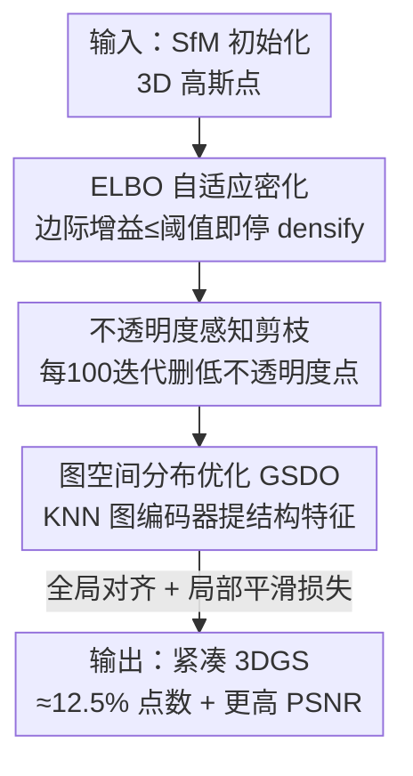

# GS²: Graph-based Spatial Distribution Optimization for Compact 3D Gaussian Splatting

**会议**: CVPR 2026  
**论文**: [CVF Open Access](https://openaccess.thecvf.com/content/CVPR2026/html/Yang_GS2_Graph-based_Spatial_Distribution_Optimization_for_Compact_3D_Gaussian_Splatting_CVPR_2026_paper.html)  
**代码**: https://github.com/BJTU-KD3D/GS-2  
**领域**: 3D视觉  
**关键词**: 3D高斯泼溅, 模型压缩, 点云剪枝, 图神经网络, 空间一致性  

## 一句话总结
GS² 针对 3DGS 剪枝后空间分布被破坏导致渲染伪影的问题，用「ELBO 自适应停densify + 不透明度感知剪枝 + 图编码器引导的空间重分布」三步，把高斯点数砍到原始 3DGS 的约 12.5%，PSNR 反而更高。

## 研究背景与动机

**领域现状**：3D Gaussian Splatting（3DGS）凭借实时渲染和高保真质量，已成为新视角合成的主流方案，它把 SfM 稀疏点云通过 densify（split / clone）膨胀成密集高斯点集来表达细节。

**现有痛点**：densify 过程极易过参数化——一个 Mip-NeRF 360 的 360° 无界场景往往要 300 万以上高斯点，显存开销巨大、渲染变慢。为压缩，大量工作走「剪枝」路线（手工重要度打分、可学习 mask），把高斯点数大幅削减。

**核心矛盾**：现有剪枝方法只关心「删哪些点」，却忽略了**删点之后剩余点的空间重排**。剪掉大量点后，留下的点会自发向空洞区域迁移去补偿缺失，但这个隐式重排没有全局/局部连续性约束——迁移方向可能不准、本该不动的点也跟着乱挪，于是破坏了空间一致性与连续性，出现明显的模糊伪影（如 LightGaussian）。作者实测：单纯剪枝会让 Mip-NeRF360 上 PSNR 掉最多 0.94，而单纯多训几轮迭代几乎救不回来。

**本文目标**：在把高斯点数压到极致的同时，显式地修复剪枝后被破坏的空间分布，使紧凑表示依然保持高渲染质量。

**切入角度**：把剪枝后的高斯点视为一张图（KNN graph），用图结构捕捉点之间的空间与特征关系，再用特征引导点的位移，从而恢复空间连续性——而不去改动 3DGS 原始 pipeline（不引入 anchor 等新表示）。

**核心 idea**：先「自适应控制 densify + 不透明度感知剪枝」得到紧凑点集，再用「图编码器 + 全局对齐损失 + 局部平滑损失」引导剩余点重新分布，让特征相似的点在欧氏空间也彼此靠近。

## 方法详解

### 整体框架
GS² 是一个三阶段串行的紧凑化框架，全程不改 3DGS 的高斯表示，只在「点数控制」和「点位优化」两件事上做文章。整体由两大模块组成：**ADP（Adaptive Densification and Pruning）** 负责减点，**GSDO（Graph-based Spatial Distribution Optimization）** 负责把减点后被破坏的空间分布修回来。

具体地，Phase 1 用 ELBO 信号自适应地决定何时停止 densify，避免简单场景里的点过度增长；Phase 2 每 100 次迭代按不透明度阈值动态剪掉低不透明度点，并配一个不透明度正则损失加速这一过程；Phase 3 把剩下的高斯点构成 KNN 图，用轻量图编码器提取结构特征，再以全局对齐损失 $\mathcal{L}_{cet}$ 和局部平滑损失 $\mathcal{L}_{smt}$ 引导点位重分布，同时联合更新颜色、尺度等其他属性。

### 关键设计

**1. ELBO 自适应密化：用边际收益信号决定何时停止 densify**

3DGS 原始的 densify 依赖人工设定的迭代阈值（如 15000 步内持续 densify），缺乏自适应性，在大面积平整室内墙面这种简单场景里会无脑生成冗余点。GS² 借鉴变分推断里的证据下界（ELBO）思想，把「渲染质量」和「模型复杂度」放进同一个目标里权衡：定义 $\mathcal{L}^{(t)}_{E} = -\mathcal{L}^{(t)}_{r} - \mathcal{L}^{(t)}_{KL}$，其中 $\mathcal{L}^{(t)}_{r}$ 是 3DGS 的渲染损失（L1 + D-SSIM），$\mathcal{L}^{(t)}_{KL} = \frac{1}{2}\left[\mathrm{tr}(\tilde{\Sigma}) - \log|\tilde{\Sigma}|\right] + \lambda_\xi \log(1+\xi)$ 用归一化协方差 $\tilde{\Sigma}$ 和归一化点密度 $\xi$ 刻画模型复杂度。

为抑制 ELBO 的短期抖动，作者用指数滑动平均（EMA）平滑：$\hat{\mathcal{L}}^{(t)}_{E} = \varepsilon\,\hat{\mathcal{L}}^{(t-1)}_{E} + (1-\varepsilon)\mathcal{L}^{(t)}_{E}$，再看 $w$ 步窗口内的相对变化 $\Delta_t = |(\hat{\mathcal{L}}^{(t)}_{E} - \hat{\mathcal{L}}^{(t-w)}_{E}) / \hat{\mathcal{L}}^{(t)}_{E}|$。当 $\Delta_t$ 收敛到阈值 $\tau$，说明再加点带来的质量提升已远不及复杂度增长，于是自动终止 densify。这一步在「点数还没爆炸前」就把闸门关掉——消融里它单独把 Mip-NeRF360 的点数从 3.12M 降到 2.82M、PSNR 几乎不动（27.71→27.73）。

**2. 不透明度感知渐进剪枝：用线性+高阶正则同时清低不透明度点和抑制异常高不透明度点**

即便停了 densify，仍残留大量低不透明度点——它们对渲染贡献微乎其微却占用大量显存（作者实测 Tanks & Temples 的 Lighthouse 场景中不透明度 ≤0.1 的点约占 40%）。GS² 引入不透明度感知正则损失 $\mathcal{L}_\alpha = \sum_{i=1}^{N}(\lambda_2 \rho_i^2 + \lambda_3 \rho_i)$，其中 $\rho_i$ 是第 $i$ 个高斯点的不透明度。线性项 $\lambda_3 \rho_i$ 鼓励低不透明度点更快收敛趋零，便于被剪掉。

关键在于作者发现：某些模糊伪影并非来自低不透明度点，而是来自**异常高不透明度点**，单靠线性项或调高剪枝阈值都压不住。为此加入二次项 $\lambda_2 \rho_i^2$ 对这类异常施加更强惩罚。配合每 100 次迭代按阈值动态剪枝，GS² 比 LightGaussian 删掉更多冗余点、同时抑制了高不透明度点造成的伪影。

**3. 图空间分布优化（GSDO）：把剪枝后的点建成图，用特征引导重分布并加全局/局部一致性约束**

这是修复空间一致性的核心。剪枝后点变得稀疏不均，剩余点该往哪挪、哪些该不动，原始 3DGS 优化无能为力。GS² 借鉴 4DGS 的图思路但去掉其时空依赖、做成轻量静态版：先用单层感知机把每个高斯中心 $x_i \in \mathbb{R}^3$ 映成初始嵌入 $f_i = \sigma(W_1 x_i + b_1)$，按嵌入构 KNN 图 $\mathcal{N}_k(i)$，算邻域残差 $\Delta_{ij} = f_i - f_j$ 并聚合 $r_i = \sum_{j \in \mathcal{N}_k(i)} \Delta_{ij}$，再经第二次变换 $h_i = \mathrm{ReLU}(W_2(f_i + r_i) + b_2)$ 得到残差增强的局部特征；同时对邻域做 max pooling 取 $m_i = \max_{j \in \mathcal{N}_k(i)} f_j$ 并求场景级全局特征 $\bar{m} = \frac{1}{N_{GS}}\sum m_i$。把 $h_i$ 与 $\bar{m}$ 拼接过两层全连接得到隐特征 $z_i$——这样每个点的更新既看局部邻域又看全局场景结构。

在此基础上设计两个无监督损失。**全局对齐损失**通过轻量投影 $\hat{x}_i = g(z_i)$ 把特征拉回 $\mathbb{R}^3$，约束 $\mathcal{L}_{cet} = \frac{1}{N_{GS}}\sum_i \|x_i - \hat{x}_i\|_2^2$，让特征空间与欧氏空间的质心对齐；**局部平滑损失** $\mathcal{L}_{smt} = \frac{1}{M(K-1)}\sum_m \sum_i \|z^{(m)}_i - z^{(m)}_{i+1}\|_2 \cdot \|x^{(m)}_i - x^{(m)}_{i+1}\|_2$ 惩罚相邻点在欧氏和特征空间的不一致，鼓励特征相似的点在空间上也靠近。最终损失 $\mathcal{L}_{final} = \lambda_c \mathcal{L}_{cet} + \lambda_s \mathcal{L}_{smt} + \mathcal{L}_r$ 联合优化点位与颜色、尺度等属性。相比 Gaussian Grouping 只在特征空间聚类、忽略欧氏全局分布，GSDO 同时管全局对齐与局部平滑，做到更整体的空间一致性。

### 损失函数 / 训练策略
- 渲染损失沿用 3DGS：$\mathcal{L}_r = (1-\lambda_1)\mathcal{L}_1 + \lambda_1 \mathcal{L}_{D\text{-}SSIM}$。
- ADP 阶段额外用不透明度正则 $\mathcal{L}_\alpha$；GSDO 阶段额外用 $\mathcal{L}_{cet}$ 和 $\mathcal{L}_{smt}$。
- 剪枝间隔固定为每 100 次迭代（实验表明对 100/200/400 间隔均鲁棒，无需按场景调参）。

## 实验关键数据

数据集：Mip-NeRF 360（9 个场景）+ Tanks & Temples（21 个场景），共 30 个真实场景，分室内 12 / 室外 18。指标：PSNR↑、SSIM↑、LPIPS↓、高斯点数 NGS↓（百万）。为公平比较，只比点数缩减，不含 SfM 初始化、属性量化、球谐蒸馏等附加组件。

### 主实验（All Scenes）

| 数据集 | 方法 | PSNR↑ | SSIM↑ | LPIPS↓ | NGS↓(M) |
|--------|------|-------|-------|--------|---------|
| Mip-NeRF360 | 3DGS | 27.71 | 0.83 | 0.20 | 3.12 |
| Mip-NeRF360 | LightGaussian | 27.35 | 0.82 | 0.23 | 1.07 |
| Mip-NeRF360 | MaskGaussian | 27.61 | 0.82 | 0.23 | 1.50 |
| Mip-NeRF360 | **GS²(本文)** | **27.74** | 0.82 | 0.23 | **0.30** |
| T&T | 3DGS | 24.19 | 0.84 | 0.19 | 1.57 |
| T&T | LightGaussian | 23.16 | 0.82 | 0.25 | 0.53 |
| T&T | MaskGaussian | 24.16 | 0.84 | 0.20 | 0.74 |
| T&T | **GS²(本文)** | **24.90** | **0.85** | 0.21 | **0.24** |

GS² 在两个数据集上 PSNR 都超过原始 3DGS，而仅用 9.62%（Mip-NeRF360）和 15.29%（T&T）的高斯点，平均约 12.5%。在 T&T 上增益尤为明显（24.19→24.90），作者归因于其室内场景占比大、有界环境的几何约束更利于空间分布优化。

### 消融实验（逐组件累加，Mip-NeRF360）

| 配置 | PSNR↑ | LPIPS↓ | NGS↓(M) | 说明 |
|------|-------|--------|---------|------|
| 3DGS | 27.71 | 0.20 | 3.12 | 基线 |
| + ELBO 密化 | 27.73 | 0.20 | 2.82 | 自适应停 densify，点数降、质量不变 |
| + 不透明度剪枝 | 26.79 | 0.26 | 0.30 | 点数骤降到 0.30M，但 PSNR 掉到 26.79 |
| + 增加迭代 | 26.98 | 0.26 | 0.30 | 单纯多训只回 0.19，救不回来 |
| + $\mathcal{L}_{smt}$ | 27.53 | 0.25 | 0.30 | 局部平滑损失回补质量 |
| Full Model | **27.74** | 0.23 | 0.30 | 全损失，超过原始 3DGS |

### GSDO 即插即用（Tab.3）

| 数据集 | 方法 | PSNR↑ | LPIPS↓ |
|--------|------|-------|--------|
| Mip-NeRF360 | LightGaussian | 27.35 | 0.23 |
| Mip-NeRF360 | LightGaussian + GSDO | **27.75** | 0.21 |
| T&T | LightGaussian | 23.16 | 0.25 |
| T&T | LightGaussian + GSDO | **23.97** | 0.22 |

GSDO 作为后处理插件接到 LightGaussian / MaskGaussian 上，在相同点数下一致提升渲染质量，证明其通用性。

### 关键发现
- **剪枝是「双刃剑」，重分布才是质量回补的关键**：消融里加完剪枝 PSNR 从 27.73 骤降到 26.79，单纯增加迭代只回到 26.98，而加上空间一致性损失后回到 27.74——说明掉点不是靠多训能救的，必须显式优化空间分布。
- **高/低不透明度都要管**：模糊伪影既来自低不透明度冗余点，也来自异常高不透明度点；二次正则项是后者的解药。
- **效率可接受**：GSDO 把训练时间从 10 分钟（仅 ADP）增到 16 分钟，渲染达 513 fps，仅次于 Mini-Splatting（576 fps）而优于其余基线。
- **超参鲁棒**：剪枝间隔 100/200/400 下 PSNR 仅 27.74→27.60，无需按场景调参，固定 100。

## 亮点与洞察
- **把「删点」和「补位」解耦成两件事**：以往剪枝方法把空间重排当成优化的隐式副产物，GS² 第一次明确指出「剪枝后的隐式重排不可靠」并用图结构 + 一致性损失显式接管，这个问题定位本身就很有价值。
- **ELBO 当作 densify 的「停表」很巧**：把渲染质量与模型复杂度统一进 ELBO，用边际增益收敛信号自动停 densify，省掉人工迭代阈值，思路可迁移到其他需要自适应控制点/参数增长的表示学习。
- **GSDO 是即插即用后处理**：不改原 pipeline、不引入 anchor，能直接挂到现有剪枝方法后面涨点，落地友好。
- **全局对齐 + 局部平滑的双约束**：相比 Gaussian Grouping 只在特征空间聚类，GS² 强调欧氏空间的全局质心对齐，对「整体连续性」更有保障。

## 局限与展望
- 作者承认：GSDO 的空间分布优化引入额外训练开销（10→16 分钟），如何降低这部分计算成本留作未来工作。
- 自己发现：方法仅在静态场景上验证，对动态/时变场景（4DGS 本来擅长的）能否迁移未知；ELBO 中复杂度项的归一化协方差/点密度定义、$\mathcal{L}_{KL}$ 的具体权重 $\lambda_\xi$ 等细节较多依赖经验设定。⚠️ 部分公式符号（如 $\mathcal{L}_{KL}$ 的精确形式）以原文为准。
- 改进思路：可探索把 GSDO 的图编码器做成共享/缓存形式以摊薄重分布开销，或把 ELBO 停止准则与剪枝预算联合优化成单一可微目标。

## 相关工作与启发
- **vs LightGaussian / EAGLES（手工重要度剪枝）**：它们靠重要度分数删点但忽略剩余点重排，导致空间不连续、出现伪影；GS² 在相同甚至更低点数下用 GSDO 修复分布，PSNR 更高（Mip-NeRF360 上 27.35→27.74）。
- **vs Mini-Splatting**：Mini-Splatting 通过 densify 改善空间分布、压缩点数，但缺少全局/局部连续性约束，空间一致性有限；GS² 用图结构 + 双一致性损失补上这块短板。
- **vs Compact3DGS / MaskGaussian（可学习 mask 剪枝）**：同属剪枝路线但同样未做显式空间重排；GS² 的 GSDO 还能作为后处理插件接到它们之上一致涨点。
- **vs 4DGS / Gaussian Grouping**：借用了 4DGS 的图编码思路（去掉时空依赖做轻量化）和 Gaussian Grouping 的空间约束思路（补上欧氏全局对齐），是两者在「静态压缩」场景下的针对性融合。

## 评分
- 新颖性: ⭐⭐⭐⭐ 首次把「剪枝后空间重分布」当成显式优化目标，ELBO 停 densify + 图引导重分布的组合较新颖
- 实验充分度: ⭐⭐⭐⭐ 两大数据集 30 场景、逐组件消融 + 即插即用 + 效率分析齐全，但缺动态场景验证
- 写作质量: ⭐⭐⭐⭐ pipeline 清晰、图表充分，部分 ELBO 公式符号偏简略
- 价值: ⭐⭐⭐⭐ 仅约 12.5% 点数即超原始 3DGS、GSDO 可即插即用，落地价值高

<!-- RELATED:START -->

## 相关论文

- [\[CVPR 2026\] Faster-GS: Analyzing and Improving Gaussian Splatting Optimization](faster-gs_analyzing_and_improving_gaussian_splatting_optimization.md)
- [\[CVPR 2026\] Urban-GS: A Unified 3D Gaussian Splatting Framework for Compact and High-Fidelity Aerial-to-Street Reconstruction](urban-gs_a_unified_3d_gaussian_splatting_framework_for_compact_and_high-fidelity.md)
- [\[CVPR 2026\] DirectFisheye-GS: Enabling Native Fisheye Input in Gaussian Splatting with Cross-View Joint Optimization](directfisheye-gs_enabling_native_fisheye_input_in_gaussian_splatting_with_cross-.md)
- [\[CVPR 2026\] Intrinsic Geometry-Appearance Consistency Optimization for Sparse-View Gaussian Splatting](intrinsic_geometry-appearance_consistency_optimization_for_sparse-view_gaussian_.md)
- [\[CVPR 2026\] Geometry-Aware Cross-Modal Graph Alignment for Referring Segmentation in 3D Gaussian Splatting](geometry-aware_cross-modal_graph_alignment_for_referring_segmentation_in_3d_gaus.md)

<!-- RELATED:END -->
