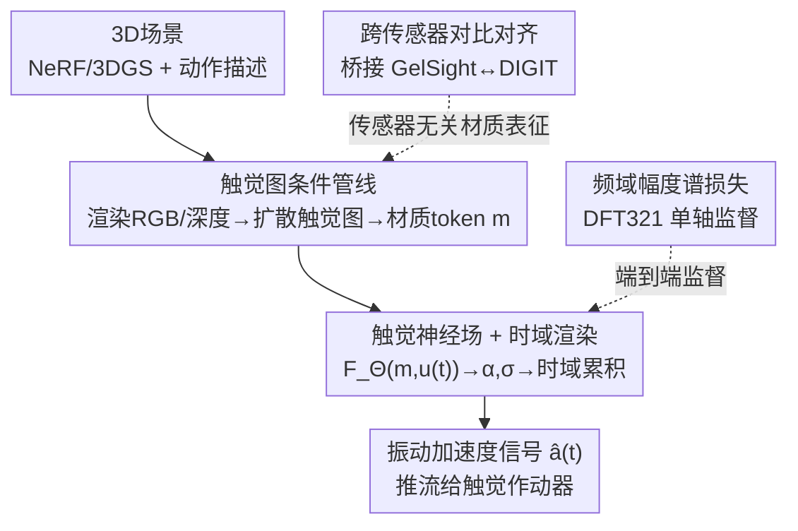

# Haptic Neural Fields: Bringing Tactile Interactions to 3D Rendered Scenes

**会议**: CVPR 2026  
**论文**: [CVF Open Access](https://openaccess.thecvf.com/content/CVPR2026/html/Stefani_Haptic_Neural_Fields_Bringing_Tactile_Interactions_to_3D_Rendered_Scenes_CVPR_2026_paper.html)  
**代码**: 项目页（论文提及，未给明确 GitHub 链接，⚠️ 以原文为准）  
**领域**: 3D视觉  
**关键词**: 触觉神经场, 振动触觉合成, 时域体渲染, 跨传感器对比, NeRF/3DGS交互

## 一句话总结
这篇论文提出 Haptic Neural Fields (HNF)，把 NeRF/3DGS 重建出的 3D 场景从"只能看"升级成"能摸"：给定接触轨迹与法向力，模型借鉴 NeRF 体渲染、但把累积从空间搬到时间，合成出指尖加速度计会真实测到的振动触觉信号，并用跨传感器对比空间桥接 GelSight 与 DIGIT 两类触觉传感器。

## 研究背景与动机

**领域现状**：NeRF、3DGS 等神经场方法已经能把真实场景重建成照片级逼真的可视化环境，后续工作还学会了动作条件下的视觉动态（开微波炉、用剪刀），让像素和几何随交互而变。但这些进展几乎都局限在**视觉通道**——场景看起来真，却没有任何"摸上去什么感觉"的信息。

**现有痛点**：让场景"可触"的早期尝试，要么把稀疏触觉测量配准进辐射场、查询某个位置的触感（Touch-GS、tactile NeRF），要么用触觉图（haptic map）编码空间上的材质属性（粗糙度、刚度）。问题是这些都是**静态描述子**：它们告诉你"这里是什么材质"，却给不出一次具体接触轨迹+施加力会激发出的**随时间变化的振动信号**（vibrotactile signal）。而真实触感恰恰由这种时变瞬态主导——蹭、滑、按时指尖感受到的 stick–slip、微碰撞才是真实反馈的来源。

**核心矛盾**：触觉响应本质是**动作条件**的——同一块材质，沿不同方向、不同速度、不同法向力去蹭，产生的振动谱完全不同（各向异性）。把"摸起来什么感觉"当成材质的内在静态标签，从根上就建模错了；它必须是动作 $u(t)$ 和局部上下文的函数。

**本文目标**：给 3D 场景重建赋予触觉感知能力——给定用户指定的接触轨迹 $p(t)$ 与法向力 $F_z(t)$，在运行时预测人手指（或工具）会经历的触觉加速度信号 $a(t)$。

**切入角度**：作者注意到 NeRF 的体渲染本质是"沿射线对发射量做透射率加权累积"。既然触觉信号也是"当前感受依赖于过去若干状态的累积"，那就可以把这套累积规则从**空间维度搬到时间维度**——这是把成熟的神经场机制迁移到触觉合成的关键观察。

**核心 idea**：用一个条件神经场 $F_\Theta(m, u(t))$，以场景导出的材质 token $m$ 和瞬时动作 $u(t)$ 为条件，输出局部发射加速度与触觉密度，再用"时域透射率累积"合成出振动触觉信号；同时用跨传感器对比学习把不同触觉传感器格式对齐，让方法能跨场景、跨传感器迁移。

## 方法详解

### 整体框架

HNF 要解决的是一条"看 → 动 → 感"（see → act → feel）的端到端链路：输入是一个重建好的 3D 场景（NeRF/3DGS）加一段用户指定的接触动作，输出是这段接触下指尖加速度计会测到的振动触觉信号 $\hat{a}(t)$。

整条管线分三个阶段。**第一阶段**给定相机位姿 $(R,T)$ 在场景中渲染出 RGB 视图 $x$ 和深度图 $x_d$，再用一个条件扩散模型 $D_\phi$ 把它们翻译成与视图共配准的触觉图 $I = D_\phi(x, x_d)$——触觉图把局部材质纹理和 3D 几何压进一张 2D 表征里。**第二阶段**把触觉图编码成材质 token $m = E(I)$，同时把用户给的语义动作（如"从左到右刮"）编码成动作向量，瞬时动作汇总为 $u(t) = [d(t), v(t), F_z(t)]$（方向、速度、法向力）。**第三阶段**核心预测器 HNF 在 $(m, u(t))$ 条件下合成加速度轨迹 $a(t)$，可直接推流给触觉作动器渲染给用户。

支撑这条链路的两个训练侧机关是：**跨传感器对比对齐**——因为 GelSight 和 DIGIT 两类触觉传感器格式不同，需要先学一个传感器无关的共享空间来桥接 HaTT 与 TaRF 数据集；以及 **频域幅度谱损失**——监督 HNF 输出时只盯人类真正能感知的幅度谱。

### 关键设计

**1. 触觉图条件管线：把"看"翻译成局部可触摸的材质表征**

要让任意 NeRF/3DGS 场景变得可触，第一步得回答"这个接触点是什么材质、几何如何"。作者复用一个条件扩散模型 $D_\phi$，从渲染出的 RGB 视图 $x$ 和深度图 $x_d$ 预测一张与视图共配准的触觉图 $I = D_\phi(x, x_d)$，再用编码器 $E(\cdot)$（沿用预训练 AlexNet）压成材质 token $m = E(I)$。这个 token 同时承载材质纹理与局部 3D 几何，是下游触觉合成的"材质条件"。动作侧则把用户的语义指令（"刮""蹭"）和几何参数编码成瞬时动作向量 $u(t) = [d(t), v(t), F_z(t)]$，其中 $d(t) = \dot{p}(t)/\|\dot{p}(t)\|$ 是面内单位方向、$v(t) = \|\dot{p}(t)\|$ 是速度、$F_z(t)$ 是法向力幅度。作者假设在接触尺度上纹理 $I$ 沿路径段近似空间均匀（必要时可沿 $p(t)$ 更新），于是同一材质上信号的时变只来自动作 $u(t)$——这正是后面把累积放到时间维的前提。

**2. 触觉神经场 + 时域渲染：把 NeRF 的体渲染从空间搬到时间**

这是全文最核心的创新。HNF 定义一个神经场 $F_\Theta(m, u(t)) \mapsto (\alpha(t), \sigma(t))$，用一个 $L$ 层、隐藏维 $H$、ReLU 激活的 MLP 实现。直觉上 $\alpha(t)$ 是当前交互状态对感知加速度的**短时发射贡献**，$\sigma(t) \in \mathbb{R}_{\geq 0}$ 是**触觉密度**，控制这份贡献在与邻近状态合成时被"放行"多少。

关键在于累积方式：NeRF 沿相机射线在**空间**上积分发射量，HNF 则沿**时间**累积。动机是当前感受到的加速度不仅取决于当前动作状态，也取决于过去若干状态。对每个输出样本 $i$（时刻 $t_i$），取一个步长为 $\Delta t$、长度 $N$ 的因果时间邻域（通过给 MLP 加独立线性头投影出 $N$ 维向量实现，密度头再加 SoftPlus 保证非负），评估得到 $\{\alpha_{i,n}, \sigma_{i,n}\}$ 后做时域渲染：

$$T_{i,n} = \exp\!\Big(-\sum_{j<n}\sigma_{i,j}\,\Delta t\Big), \qquad w_{i,n} = T_{i,n}\big(1 - \exp(-\sigma_{i,n}\,\Delta t)\big)$$

预测加速度是离散加权和 $\hat{a}(t_i) = \sum_{n=1}^{N} w_{i,n}\,\alpha_{i,n}$。这与 NeRF 的体渲染合成完全同构——只是把"距离"换成了"时间"，得到一个连续、可微、且自带短时记忆动态的渲染器。正因为条件里含完整动作 $u(t)$，HNF 学到的是**各向异性**映射：同一材质沿不同方向蹭会产生不同的谱（详见实验 Fig. 5），而旧方法对方向不敏感。

**3. 频域幅度谱损失 + DFT321：只监督人类真正感知的东西**

人类对高频纹理振动的**相位**基本不敏感，真正主导感知的是**幅度谱**。基于这一感知证据，作者不在时域做逐点回归，而把接触轨迹切成 $C$ 个短段 $\{S_c\}$，对每段计算 Hann 窗下 $K$ 个正频幅度，监督预测谱与真值谱的差：

$$\mathcal{L}_{\text{mag}} = \frac{1}{C\,K}\sum_{c=1}^{C}\sum_{k=1}^{K}\Big(\big|\mathrm{DFT}_K(\hat{a}_c)\big|_k - \big|\mathrm{DFT}_K(a_c)\big|_k\Big)^2$$

另一个细节是触觉刺激并非只由 $z$ 轴加速度决定，而是 $x,y,z$ 三轴的合成贡献：$z$ 分量主要编码表面粗糙度，$x,y$ 分量传达摩擦相关信息（来自 $xy$ 平面的接触轨迹 $p(t)$ 与 $z$ 平面的法向力 $F_z$）。作者沿用触觉领域常用的 **DFT321**，把三轴信号的频谱融合成单条代表性信号，承载完整触觉刺激后再做监督。这样既贴合感知，又避免了相位带来的虚假惩罚。

**4. 跨传感器对比对齐：用对比空间桥接 GelSight 与 DIGIT**

现实困境是没有任何单一数据集同时提供 RGB/深度、多传感器触觉图、时域加速度、力/力矩和密集动作轨迹。作者只能"缝合"多个数据集——但 GelSight（材质中心、常独立于全局几何）和 DIGIT（场景中心、稀疏但与重建表面共配准）的触觉图格式差异巨大（弹性体/光照、颜色编码、分辨率、视场都不同），直接混用会被格式鸿沟卡住。

解决办法是学一个**传感器无关的共享潜空间**。给定视觉样本与触觉样本，构造匹配对与不匹配对，用两个 ResNet-50 编码器映射到 $\ell_2$ 归一化嵌入（点积即余弦相似度），以对称对比目标（CMC）训练。视觉→触觉方向的 InfoNCE 损失为：

$$\mathcal{L}^{\mathrm{contrast}}_{X_I \to X_T} = -\log\frac{\exp\!\big(z_I^i \cdot z_T^i/\tau\big)}{\sum_{j=1}^{K}\exp\!\big(z_I^i \cdot z_T^j/\tau\big)}$$

其中温度 $\tau = 0.07$，反向损失 $\mathcal{L}^{\mathrm{contrast}}_{X_T \to X_I}$ 对称定义，总损失取二者之和。作者把配对策略从单传感器扩展到**跨传感器元组**——GelSight–RGB（来自 HaTT）和 DIGIT–RGB（来自 TaRF），让目标同时鼓励：(i) 每个传感器内的视觉–触觉对齐，(ii) GelSight 与 DIGIT 之间材质的传感器无关聚类。下游做材质分类时冻结编码器、只训一个线性探针。这个对齐空间正是后续把 HaTT 的 GelSight 元组扩成 RGB+GelSight+DIGIT 三元组（按共享特征空间最近邻关联 DIGIT patch）的桥梁，让 HNF 能在 3D 场景里跨传感器合成触觉。

### 损失函数 / 训练策略

HNF 用频域幅度谱损失 $\mathcal{L}_{\text{mag}}$（公式 4）端到端训练，逐材质训练（类比 per-scene NeRF）后跨所有材质评测取均值。对比对齐用对称 InfoNCE（公式 5、6）。实现细节：沿用预训练 AlexNet 作编码器，时间邻域 $N=5$、段数 $C=200$（窗长 1000 样本），1 kHz 低通；DFT 产生 $K=500$ 频点、保留前 $K=100$ 个正频；MLP $L=4$ 层、$H=1024$。单张 RTX 4090 训 100 epoch，Adam，学习率 $1\text{e}{-}2$ + 余弦退火。数据按每 10 个连续窗口 8/1/1 划分 train/val/test。

## 实验关键数据

评测用三个互补数据集：**HaTT**（含 GelSight 扩展，100 种材质，传感笔记录 6DoF 力/力矩+加速度+位姿，10 kHz）、**TaRF**（13 个日常 3D 场景、DIGIT 传感器、共 19.3k RGB–触觉配准对）、**Touch-and-Go (TnG)**（约 13.9k GelSight–RGB 视频元组、约 4000 种野外材质）。两个任务：(I) 跨域材质分类，(II) 动作条件振动触觉信号生成。信号生成指标为 ST-SIM（↑，感知质量 0–1）、LSD（↓，对数谱距离）、MSE（↓，正频幅度谱逐点偏差）。

### 主实验：材质分类（冻结编码器 + 线性探针）

| 模态头 | 方法 | 训练集 | TnG Acc↑ | HaTT Acc↑ |
|--------|------|--------|----------|-----------|
| – | Chance | – | 18.60 | 11.08 |
| Vision | TaRF | TnG | 54.70 | – |
| Vision | TaRF | TnG+TaRF | 57.60 | – |
| Vision | Ours | TnG+TaRF+HaTT | **76.16** | 68.75 |
| Vision | Ours | TnG(Balanced)+TaRF+HaTT | 75.47 | **97.19** |
| Haptic | GACM | HaTT(GelSight) | – | 77.29 |
| Haptic | Ours | TnG+TaRF+HaTT | 55.40 | 92.13 |
| Haptic | Ours | TnG(Balanced)+TaRF+HaTT | 67.73 | 96.44 |

混合域对比训练把 HaTT(GelSight) 在 haptic 头下从 GACM 的 77.29% 提到 92.13%，把 TnG/TaRF 评测在 vision 头下从 57.60% 提到 76.16%。关键是增益**跨传感器成立**（混训 GelSight+DIGIT、在任一传感器上测都涨），说明学到的空间确实传感器无关，可作触觉合成的桥梁。

### 主实验：动作条件信号生成（跨传感器）

| 方法 | GelSight ST-SIM↑ | GelSight LSD↓ | GelSight MSE↓ | DIGIT ST-SIM↑ | DIGIT LSD↓ | DIGIT MSE↓ |
|------|------|------|------|------|------|------|
| GACM | 0.85 | **0.80** | 6557.32 | – | – | – |
| HNF | 0.85 | 0.88 | **3443.15** | 0.86 | 0.89 | 4166.64 |
| HNF+ | – | – | – | **0.88** | 0.89 | **3764.00** |

在 GelSight 上 HNF 与 GACM 感知相似度持平（ST-SIM 0.85 vs 0.85），谱失真略高（LSD 0.88 vs 0.80），但 MSE 从 6557.32 降到 3443.15（约 47% 下降），说明对真值幅度谱拟合更紧、过平滑更少。DIGIT 上无 GACM 可比，HNF 取得 ST-SIM 0.86 / LSD 0.89；MSE 偏高是因为 DIGIT 训练图来自 3D 渲染场景、变异度更大、任务更难，但高 ST-SIM 表明仍抓住了结构信息。

### 消融实验：动作增强（HNF → HNF+）

| 配置 | DIGIT ST-SIM↑ | DIGIT MSE↓ | 说明 |
|------|------|------|------|
| HNF | 0.86 | 4166.64 | 仅原始 HaTT 圆周划动 |
| HNF+ | 0.88 | 3764.00 | 额外加 8 类合成动作样本训练 |

HaTT 主要是无约束圆周笔触，方向/力–速效应覆盖不足。作者用 8 个人类可解释原语增强动作集：左→右刮（软/硬）、上→下刮（软/硬）、对角刮（软/硬）、随机蹭（慢/快），每个由切平面 2D 路径 + 法向力剖面定义，投影到表面切 frame 执行。HNF+ 在 DIGIT 上 ST-SIM 从 0.86 升到 0.88、MSE 从 4166.64 降到 3764.00，说明合成样本可信、能提升对未见轨迹的泛化。

### 关键发现
- **跨传感器混训是材质分类涨点的最大来源**：单看 GACM 的 77.29% 与 Ours 的 92.13%，增益主要来自把 GelSight+DIGIT 拉进同一对比空间，而非更大模型。
- **HNF 的真正优势是各向异性**：Fig. 5 显示同一材质两条不同方向的刮，HNF 给出方向特异的谱（重分布能量、揭示各向异性），而 GACM 对两个方向给出几乎相同的低通谱——这是动作条件建模相对静态描述子的本质区别。
- **GelSight 上 LSD 略逊于 GACM 是失真–感知的权衡**：HNF 在 MSE/感知结构上更优，但对数谱距离吃了点亏，需结合多指标看而非单看一项。

## 亮点与洞察
- **把体渲染从空间搬到时间**是最漂亮的一步：NeRF 的透射率累积本是为"沿射线的几何遮挡"设计的，作者发现"沿时间的触觉记忆累积"在数学上同构，于是几乎免费复用了一套可微、连续、带短时记忆的渲染器——这种"换坐标轴复用成熟机制"的思路可迁移到任何"当前感受依赖历史状态"的时序合成任务。
- **只监督幅度谱**体现了对感知先验的尊重：与其在时域硬拟合相位（人根本感知不到），不如用 DFT321 融三轴 + 频域幅度损失，把模型容量花在真正影响触感的地方。
- **跨传感器对比空间**把"没有大一统数据集"这个工程死结，转成了一个表示学习问题——用对比对齐缝合 GelSight 与 DIGIT，这套桥接思路对任何多传感器/多格式的具身感知数据都有借鉴价值。

## 局限与展望
- 作者承认进展受**数据限制**：没有单一数据集同时对齐 RGB/深度、多传感器触觉图、时域加速度、力/力矩与密集动作轨迹，只能靠对比匹配缝合，导致动作多样性和覆盖受限。
- **评测受限**：大规模头显内用户研究难做（共定位、延迟、作动器限制），只能用客观信号指标和识别代理替代，缺真实人类感知验证。
- 自己发现的局限：HNF 逐材质训练（类比 per-scene NeRF），扩到大规模场景时训练/存储成本与泛化是个隐忧；纹理"接触尺度近似空间均匀"的假设在强非均匀表面上可能不成立。
- 改进方向（作者）：扩充动作词表与多轴传感；做受控 VR 用户研究量化感知真实度与任务效用。

## 相关工作与启发
- **vs GACM（动作条件触觉合成基线）**: GACM 用 AlexNet+线性做材质分类、MLP 做加速度合成，但本质方向不变（同材质不同探索模式给出相似信号）；HNF 用时域神经场显式条件化方向/速度/力，能产生方向特异的各向异性谱，MSE 在 GelSight 上降约 47%。
- **vs 触觉辐射场（Touch-GS / tactile NeRF [3,30]）**: 它们把稀疏触觉测量配准进辐射场、查询某位置的静态触感或触觉图；HNF 直接合成时变振动加速度，且显式条件化接触轨迹与法向力，从"静态描述子"跨到"动作相关的时域信号"。
- **vs Scene2Hap 等 LLM 触觉系统**: 后者从物体语义与场景上下文合成貌似合理的振动模式，但缺显式动作/力条件、难复现真实瞬态；HNF 用频域监督 + 动作条件直接对齐真值谱。

## 评分
- 新颖性: ⭐⭐⭐⭐⭐ 首次把动作条件触觉合成做进重建 3D 场景，并把 NeRF 体渲染创造性地迁移到时间维。
- 实验充分度: ⭐⭐⭐⭐ 三数据集、两任务、跨传感器验证齐全，但缺真实人类感知用户研究、部分指标互有取舍。
- 写作质量: ⭐⭐⭐⭐ 动机链清晰、机制讲透，公式与图配套；个别工程细节（项目页/代码）略含糊。
- 价值: ⭐⭐⭐⭐⭐ 为 XR、机器人、触觉仿真打开"看→动→感"的端到端可触场景路径，方向开创性强。

<!-- RELATED:START -->

## 相关论文

- [\[CVPR 2026\] RF4D: Neural Radar Fields for Novel View Synthesis in Outdoor Dynamic Scenes](rf4dneural_radar_fields_for_novel_view_synthesis_in_outdoor_dynamic_scenes.md)
- [\[CVPR 2026\] Evidential Neural Radiance Fields](evidential_neural_radiance_fields.md)
- [\[CVPR 2026\] Bringing Your Portrait to 3D Presence](bringing_your_portrait_to_3d_presence.md)
- [\[CVPR 2026\] InfiniDepth: Arbitrary-Resolution and Fine-Grained Depth Estimation with Neural Implicit Fields](infinidepth_arbitrary-resolution_and_fine-grained_depth_estimation_with_neural_i.md)
- [\[CVPR 2026\] LangField4D: Learning Identity-Adaptive and Spatio-Temporal Continuous 4D Language Fields for Dynamic Scenes](langfield4d_learning_identity-adaptive_and_spatio-temporal_continuous_4d_languag.md)

<!-- RELATED:END -->
