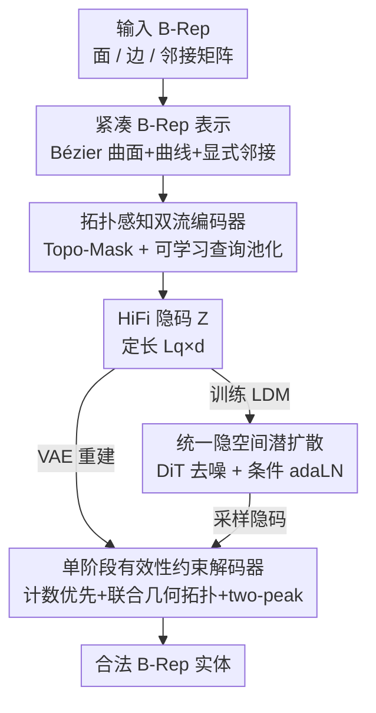

# HiFi-BRep: High-Fidelity Latent Representation for Robust B-Rep Generation

**会议**: CVPR 2026  
**论文**: [CVF Open Access](https://openaccess.thecvf.com/content/CVPR2026/html/Hou_HiFi-BRep_High-Fidelity_Latent_Representation_for_Robust_B-Rep_Generation_CVPR_2026_paper.html)  
**代码**: https://github.com/1nnoh/HiFi-BRep  
**领域**: 3D视觉 / CAD生成  
**关键词**: B-Rep生成, 边界表示, 拓扑感知编码, 单阶段解码, 可微有效性约束

## 一句话总结
HiFi-BRep 用一个"无填充噪声的拓扑感知编码器 + 单阶段联合解码几何与拓扑的解码器"构建高保真隐空间，把"每条边恰好属于两个面"的流形约束变成可微训练目标，从而在 CAD 边界表示（B-Rep）生成上同时拿到更高的结构有效性、更小的"可编译却不合法"差距，以及 2–7 倍的推理加速。

## 研究背景与动机

**领域现状**：B-Rep（Boundary Representation，边界表示）是 CAD 的标准格式，用参数化的面（surface）、边（curve）、顶点及它们之间的拓扑连接来精确编码 3D 形状，是工业设计与制造的基础。近年深度生成模型在网格、点云上很成功，于是自然想问：能不能直接生成高质量且结构合法的 B-Rep？

**现有痛点**：B-Rep 是连续几何与离散拓扑混合、且受严格有效性规则约束的对象，哪怕一个小错误都会级联放大、让整个模型作废。作者把已有方法的"脆弱性"归纳成两类：一是 **表示脆弱性（representation brittleness）**——早期方法用 padding 处理变长图元，引入统计噪声、训练不稳；有的方法引入拓扑先验却做多跳邻居传播，反而把无关信息污染进特征里。二是 **生成脆弱性（generation brittleness）**——主流流水线把几何与拓扑拆成多阶段级联生成，信息只能单向流动，早期决策不可逆；而且很多方法不把拓扑有效性当成显式训练目标，而是推到不可微的后处理里强制满足，造成训练-推理不一致。

**核心矛盾**：现有方法在"表示保真度"和"结构有效性"之间各有妥协。DTGBrepGen 把有效性约束整进表示里，代价是复杂的多阶段级联，难优化；HoLa 简化了流水线、用局部相交范式保证流形边，却牺牲了表达力，学不出"两个面之间有多条边"这类结构，也学不好全局拓扑。

**本文目标**：要一个**统一且并行**的方案，同时做到——紧凑高保真的表示、几何与拓扑联合生成、以及可微地强制拓扑有效性。

**切入角度**：作者的关键洞察是，理想的表示应当在"表达力"和"可学习性"之间取得平衡，**并把有效性约束变成可学习的目标**，而不是事后修补。

**核心 idea**：用拓扑感知编码器造一个无填充噪声、拓扑/有效性都"内嵌"的高保真隐空间，再用单阶段解码器把几何与拓扑一次性并行解出来，并把流形约束写成可微 loss——一句话就是"把后处理里的硬约束搬进可微训练目标，把级联生成换成单阶段联合生成"。

## 方法详解

### 整体框架

HiFi-BRep 把一个 B-Rep 实体 $\mathcal{B}$ 定义为三元组：$n_f$ 个参数面集合 $F$、$n_e$ 个参数边集合 $E$、以及一个二值的边-面邻接矩阵 $A \in \{0,1\}^{n_e \times n_f}$，目标是建模联合分布 $p(\mathcal{B}) = p(F, E, A)$ 并满足流形、水密等有效性约束。

整体是一个**围绕高保真隐空间的两段式流水线**。第一段训练一个 VAE：拓扑感知编码器把变长的 B-Rep 输入压成定长隐序列 $Z$，单阶段解码器再从 $Z$ 并行重建几何与拓扑。第二段在学好的隐空间上训练一个潜扩散模型（DDPM / DiT），把"表示学习"和"分布建模"解耦——VAE 负责捕捉复杂 B-Rep 的隐结构，扩散模型只需在这个"性质良好"的隐空间里学怎么采样。推理时从扩散模型采一个隐码，再用预训练 VAE 解码器一次性解出 B-Rep，支持无条件生成，也支持类别标签 / 点云 / 图像条件生成。

下面四个关键设计沿"输入表示 → 编码成隐空间 → 解码重建 → 在隐空间上扩散生成"这条主线自上而下排列，框架图节点名与关键设计名一一对应：

### 关键设计

**1. 紧凑且充分的 B-Rep 表示：让有效性"长在表示里"**

针对表示脆弱性的根子，作者先不急着设计网络，而是先设计一个"自带有效性"的表示。每个面建模为 Bézier 曲面（用包围盒 $F_p$ 和控制网格 $F_z$ 的嵌入相加得到面特征），每条边建模为 Bézier 曲线（用包围盒 $E_p$、控制点 $E_z$ 和显式端点 $E_v$ 的嵌入相加），全局拓扑则用一个显式的边-面关联矩阵 $A$ 表示。这个表示的妙处在于把两条硬约束直接编进结构里：Bézier 曲线天然带两个端点，自动满足"每条边连接恰好两个不同顶点"的顶点连接约束；而显式的全局边-面邻接矩阵天然编码"每条边恰好被两个面共享"的流形约束，还能容纳"两面之间多条边"这类复杂结构——这正是 HoLa 的局部相交范式学不出来的。为稳定训练，作者按图元包围盒中心做字典序规范化排序，并把序列对齐到数据集最大面/边数 $(F_{\max}, E_{\max})$；由于流形实体里边数 $n_e$ 与面数 $n_f$ 近似线性，这个预算"够用且不冗余"。这个表示既是编码时的拓扑引导，也是解码时的直接监督目标。

**2. 拓扑感知双流编码器：用 Topo-Mask 防污染、用可学习查询去 padding 噪声**

编码器要同时解决两类表示噪声：远处图元的污染、以及 padding 引入的噪声。做法是把面和边分成两条独立流，并把跨流交互**严格限制在拓扑相邻的对**上。初始 token 嵌入 $X^{(0)}_E = \phi_E(E_p, E_z, V) \in \mathbb{R}^{n_e \times d}$、$X^{(0)}_F = \phi_F(F_p, F_z) \in \mathbb{R}^{n_f \times d}$ 经过若干 BiModalBlock，每个 block 在各自流内做自注意力、在相邻面-边对之间做双向交叉注意力，关键是注意力打分加了一个由邻接矩阵导出的 Topo-Mask 偏置 $S$：

$$\mathrm{Attn}(Q,K,V;S) = \mathrm{softmax}\!\Big(\tfrac{QK^\top}{\sqrt{d}} + S\Big)V,\quad S[u,i] = \begin{cases} 0, & A[u,i]=1,\\ -\infty, & \text{otherwise,}\end{cases}$$

其中 $u$ 索引边、$i$ 索引面。也就是说不相邻的面-边对被 $-\infty$ 直接屏蔽，信息只在真实的一阶邻接上传播，避免了多跳传播把无关信息污染进来。堆 $L$ 个 block 后，再用 $L_q$ 个可学习查询 $Q_{enc} \in \mathbb{R}^{L_q \times d}$ 去注意拼接后的特征 $[X^{(L)}_E, X^{(L)}_F]$，把变长 token 池化成定长隐码 $Z \in \mathbb{R}^{L_q \times d}$（实验里 $L_q=48$）。这一步用"查询池化"替代了"padding 后做全局摘要"，从根上消除了 padding 噪声，得到的隐码同时是高保真、拓扑感知、有效性感知的，给后续单阶段解码和扩散提供稳定接口。

**3. 单阶段有效性约束解码器：计数优先 + 几何拓扑联合 + two-peak 可微流形目标**

针对级联误差传播与事后修补造成的生成脆弱性，解码器把"计数、几何、邻接"放在**一个阶段**里解，让拓扑与几何全程互相指导。流程是计数优先：先用两个可学习的计数查询预测面数、边数的 logits（$\{0,\dots,F_{\max}\}$ 和 $\{0,\dots,E_{\max}\}$）；训练时用真值计数 $(n_f, n_e)$、推理时用预测计数 $(\hat n_f, \hat n_e)$ 生成硬 padding 掩码，先把"序列长度的歧义"解决掉再去解图元。随后初始化面查询 $Q_F$、边查询 $Q_E$，经过一叠 DecBiBlock（查询对隐码 $Z$ 的交叉注意力、流内掩码自注意力、面-边流间双向交叉注意力、FFN）得到拓扑感知特征 $H_F, H_E$。几何头从特征回归面/边控制参数（包围盒预测中心和尺寸、用 softplus 保证正尺寸再转角点，边端点直接回归）。拓扑头则把 $H_E, H_F$ 投到共享邻接空间 $U = \psi_e(H_E) \in \mathbb{R}^{E_{\max}\times d_{adj}}$、$W = \psi_f(H_F) \in \mathbb{R}^{F_{\max}\times d_{adj}}$，算缩放双线性分数 $S = (UW^\top)/\sqrt{d_{adj}}$，对每行做 softmax，用一个 **two-peak（双峰）目标分布**监督——它把概率质量均分给每条有效边的两个关联面，从而把"每条边恰属两个面"的流形先验变成可微训练目标。推理时对每条有效边按分数选 top-2 合法面。这样几何与拓扑双向优化、误差不再级联，训练目标也和流形实体的物理约束对齐了。

**4. 统一隐空间里的潜扩散：把表示学习和分布建模解耦**

学好 VAE 的高保真隐空间后，作者在定长隐码上训练一个 DDPM。设序列化隐码为 $z_0$，前向过程 $q(z_t|z_0) = \mathcal{N}(\sqrt{\bar\alpha_t}z_0, (1-\bar\alpha_t)I)$，用一个 Diffusion Transformer（DiT）去噪器 $\epsilon_\theta(z_t,t;c)$ 最小化 $\mathbb{E}\|\epsilon - \epsilon_\theta(z_t,t;c)\|_2^2$。条件 $c$ 可选，存在时通过自适应 LayerNorm（adaLN）注入——一个线性头把 $c$ 映射成每个 block 的缩放/平移参数 $(\gamma,\beta)$；图像条件用预训练 DINOv2 编码，点云条件用 PointNet++ 编码。推理时从 $z_T\sim\mathcal{N}(0,I)$ 出发，在选定条件（或无条件用空嵌入）下迭代去噪得到 $z_0$，再交给预训练 VAE 解码器一次解出 B-Rep。把分布建模放在"性质良好"的隐空间，扩散就不必再操心几何-拓扑的有效性，那已由 VAE 负责。

### 损失函数 / 训练策略

掩码几何重建损失对各几何分量做 MSE：

$$\mathcal{L}_{\text{geom}} = \mathrm{MSE}(\widehat{F}_z,F_z) + \mathrm{MSE}(\widehat{E}_z,E_z) + \mathrm{MSE}(\widehat{F}_p,F_p) + \mathrm{MSE}(\widehat{E}_p,E_p) + \mathrm{MSE}(\widehat{\mathcal{V}},\mathcal{V})$$

总目标把 KL、计数交叉熵、几何重建、行级邻接损失加权求和：

$$\mathcal{L} = \lambda_{\mathrm{KL}}\mathcal{L}_{\mathrm{KL}} + \lambda_{\mathrm{len}}\big[\mathrm{CE}(\hat n_f,n_f)+\mathrm{CE}(\hat n_e,n_e)\big] + \lambda_{\mathrm{geom}}\mathcal{L}_{\text{geom}} + \lambda_{\mathrm{adj}}\,\mathcal{L}_{\mathrm{row\text{-}wise}}(S)$$

其中 $\mathcal{L}_{\mathrm{row\text{-}wise}}$ 即上面的行级双峰邻接损失，所有项只在有效（非 padding）槽位上计算，标签平滑和损失权重在所有实验中固定。VAE 与 DiT 分别约 304.7M / 193.4M 参数，在 2×RTX 4090 上分别训练 3000 / 1000 epoch（encoder/decoder 宽 $d=768$、各 6 个 block、$L_q=48$、18 层 DiT）。

## 实验关键数据

数据集为 B-Rep 生成的两个标准公开基准 DeepCAD 和 ABC，去重并按面/边数封顶后训练集分别为 83,611 / 186,148 个形状。评测既看分布保真（COV 覆盖率、MMD-CD、JSD），也看 CAD 级有效性（Novel、Unique、Compilability、Valid）。其中 Compilability 衡量生成模型能否被 OpenCascade 导出成 STEP 文件，Valid 进一步要求导出实体水密且流形一致——两者之差衡量"能构造出文件、却过不了内核级有效性检查"的频率。

### 主实验

无条件生成结果（MMD-CD、JSD ×100）：

| 数据集 | 方法 | COV↑ | MMD-CD↓ | JSD↓ | Compilability%↑ | Valid%↑ |
|--------|------|------|---------|------|------------------|---------|
| DeepCAD | DeepCAD(程序基线) | 76.67 | 1.09 | 0.77 | 88.46 | 68.20 |
| DeepCAD | BRepGen | 47.03 | 1.51 | 3.12 | 20.91 | 20.76 |
| DeepCAD | BrepDiff | 45.03 | 1.32 | 2.39 | 63.69 | 63.69 |
| DeepCAD | DTGBrepGen | 73.50 | 1.06 | 0.98 | 92.48 | 43.20 |
| DeepCAD | **HiFi-BRep** | 70.40 | **1.05** | 1.72 | 90.38 | **72.20** |
| ABC | BRepGen | 34.73 | 2.08 | 5.72 | 20.77 | 20.19 |
| ABC | BrepDiff | 41.59 | 1.72 | 2.39 | 22.05 | 20.05 |
| ABC | DTGBrepGen | 70.63 | 1.30 | 1.55 | 50.55 | 24.88 |
| ABC | **HiFi-BRep** | 57.93 | 1.45 | 1.81 | 35.61 | **32.66** |

在 DeepCAD 上 HiFi-BRep 拿到最高 Valid（72.20%）和最低 MMD-CD（1.05），COV 接近程序化的 DeepCAD 基线；在 ABC 上 DTGBrepGen 分布对齐最好（COV 最高、MMD-CD/JSD 最低），但 HiFi-BRep 拿到最高 Valid（32.66%）。最能说明问题的是 **Compilability→Valid 的差距**：DeepCAD 上 HiFi-BRep 是 90.38→72.20（差 18.18），DTGBrepGen 是 92.48→43.20（差 49.28）；ABC 上 HiFi-BRep 是 35.61→32.66（差 2.95），DTGBrepGen 是 50.55→24.88（差 25.67）——说明单阶段、有效性感知的解码器产出的不只是能编译、更是更频繁流形一致的实体。

### 消融实验

DeepCAD 重建上的消融（Face/Edge Acc 为计数精度，Adj Acc 为边-面邻接矩阵精度）：

| 配置 | Face Acc%↑ | Edge Acc%↑ | Adj Acc%↑ | Valid%↑ |
|------|-----------|-----------|-----------|---------|
| HiFi-BRep (full) | 100.0 | 99.5 | 97.5 | 95.2 |
| w/o Topo-Mask（编码器） | 99.3 | 98.7 | 92.7 | 89.5 |
| w/o two-peak | 99.3 | 98.5 | 90.4 | 87.2 |
| w/o 单阶段解码（geom→adj） | 98.6 | 98.2 | 73.2 | 69.3 |

去掉单阶段解码、改成"先用 VAE 解几何、再喂给单独的拓扑预测器推邻接"的级联方式掉得最狠（Valid 95.2→69.3、Adj Acc 97.5→73.2），印证级联会放大几何到拓扑的误差累积、并造成训练-推理错位；把行级 two-peak 目标换成独立 BCE 会丢掉每行竞争，分数标定变差、top-2 内误排增多，Adj Acc/Valid 双降；去掉编码器 Topo-Mask 则稀释了跨流信噪比，在计数精度相近时 Valid 仍下降。

### 关键发现

- **单阶段联合解码贡献最大**：去掉它 Valid 从 95.2% 掉到 69.3%，是所有消融里最大跌幅，说明几何-拓扑双向优化、避免级联是有效性的核心来源。
- **重建有效性对面数分布鲁棒**：尽管 DeepCAD 的面数严重不均衡（6–12 面占主导、长尾到 29 面），在罕见的高面数 bin 里有效率仍 ≥61.5%，说明无填充隐码 + 拓扑约束注意力学到的是内在的拓扑-几何耦合，而非过拟合高频区间。
- **推理最快**：单形状端到端延迟（DeepCAD 1000 次平均）。

| 方法 | 总时间(s) | 后处理(s) |
|------|-----------|-----------|
| BRepGen | 8.09 | 0.32 |
| BrepDiff | 26.28 | 23.07 |
| DTGBrepGen | 23.55 | 12.83 |
| **HiFi-BRep** | **3.83** | 0.53 |

HiFi-BRep 总时间 3.83 s/形状，比 BRepGen 快 2.1×、比 DTGBrepGen 快 6.2×、比 BrepDiff 快 6.9×；虽然后处理（0.53 s）略长于 BRepGen（0.32 s，因控制点参数化导出曲面/曲线时要短暂采样拟合），但单阶段流水线省掉多趟解码，总时仍最低。

## 亮点与洞察
- **把硬约束"内嵌进表示"而非事后修补**：用 Bézier 曲线自带端点满足顶点连接、用显式邻接矩阵承载流形约束，这种"让有效性长在表示里"的思路，比在网络后面加规则修补更稳，也避免了训练-推理不一致。
- **two-peak 目标是点睛之笔**：把"每条边恰属两个面"这条离散流形规则，写成"每行 softmax 把质量均分给两个面"的可微目标，巧妙地把不可微的拓扑约束变成可学习信号；这个"离散约束→行级双峰分布"的转写思路可迁移到其他带固定度数/配对约束的图结构生成。
- **Compilability–Validity gap 作为评测视角**：单独看 Compilability 容易高估方法，作者用"能编译但不合法"的差距来暴露真实的结构质量，是个值得借鉴的诊断指标。
- **计数优先消歧**：先定面/边数再解图元，把变长生成的"长度歧义"前置解决，简单但显著稳住了变长解码。

## 局限与展望
- **作者承认的局限**：只针对封闭、水密、固定面/边预算的 B-Rep 实体，尚未覆盖开边界零件、大型装配体、非流形结构；one-shot 解码器依赖准确的掩码与合并容差，仍有残余失败——修剪不一致会丢面、顶点合并后出现 T 型结/非流形边、病态控制点产生狭长/自交面片，这些正是 Compilability–Validity 差距的部分来源（精确曲面-曲线求交与修剪仍交给 CAD 内核）。
- **自己发现的局限**：在 ABC 上分布对齐（COV/MMD-CD/JSD）不如 DTGBrepGen，方法主打的是有效性而非分布保真，两者间存在取舍；评测里 Valid 绝对值（ABC 仅 32.66%）整体偏低，说明 B-Rep 生成离"可直接用"还有距离。
- **改进思路**：作者提出动态容量解码（变长查询应对长尾拓扑）、可微可行性投影（抑制修剪/结点错误），并计划扩展到开边界模型与装配体、加入显式顶点约束与全局一致性检查。

## 相关工作与启发
- **vs DTGBrepGen**: 它也把有效性约束整进表示，但用复杂的多阶段级联流水线，难优化、推理慢（23.55 s）；本文用单阶段联合解码 + 可微 two-peak，Compilability–Validity 差距远更小（DeepCAD 18.18 vs 49.28），且快 6.2×。
- **vs HoLa**: 它用紧凑整体表示 + 局部相交范式保证流形边，简化了生成，但表达力受限（学不出两面间多条边、全局拓扑弱），且仍受 padding 噪声困扰；本文用显式全局邻接矩阵 + Topo-Mask，既保流形又能表达复杂结构。
- **vs BRepGen / SolidGen**: 早期多阶段方法靠 padding 处理变长、靠后处理重建拓扑，引入冗余且学不到拓扑有效性；本文用可学习查询池化去 padding 噪声、把有效性变成训练目标。
- **vs BrepDiff**: 同为单阶段，但它把有效性强制推到后处理（网格化 + 求交恢复边/顶点，后处理 23.07 s），造成训练-推理不一致；本文在解码内即用可微目标强制流形。

## 评分
- 新颖性: ⭐⭐⭐⭐⭐ 把表示/生成两类脆弱性同时解决，two-peak 可微流形目标 + 拓扑感知池化是实打实的新设计。
- 实验充分度: ⭐⭐⭐⭐ 双基准 + 完整消融 + 运行时 + 重建鲁棒性分析齐全，略缺条件生成的定量对比。
- 写作质量: ⭐⭐⭐⭐⭐ 问题拆解（两类脆弱性）清晰，动机到方法一气呵成。
- 价值: ⭐⭐⭐⭐⭐ 在结构有效性与效率上同时领先，为可靠可扩展的神经 CAD 生成打下基础。

<!-- RELATED:START -->

## 相关论文

- [\[CVPR 2026\] AutoRegressive Generation with B-rep Holistic Token Sequence Representation](autoregressive_generation_with_b-rep_holistic_token_sequence_representation.md)
- [\[CVPR 2026\] PP-Brep: Few-Shot B-rep Classification with Hybrid Graph Representation](pp-brep_few-shot_b-rep_classification_with_hybrid_graph_representation.md)
- [\[CVPR 2026\] FACE: A Face-based Autoregressive Representation for High-Fidelity and Efficient Mesh Generation](face_a_face-based_autoregressive_representation_for_high-fidelity_and_efficient_.md)
- [\[CVPR 2026\] LATTICE: Democratize High-Fidelity 3D Generation at Scale](lattice_democratize_high-fidelity_3d_generation_at_scale.md)
- [\[CVPR 2026\] HyperGaussians: High-Dimensional Gaussian Splatting for High-Fidelity Animatable Face Avatars](hypergaussians_high-dimensional_gaussian_splatting_for_high-fidelity_animatable_.md)

<!-- RELATED:END -->
