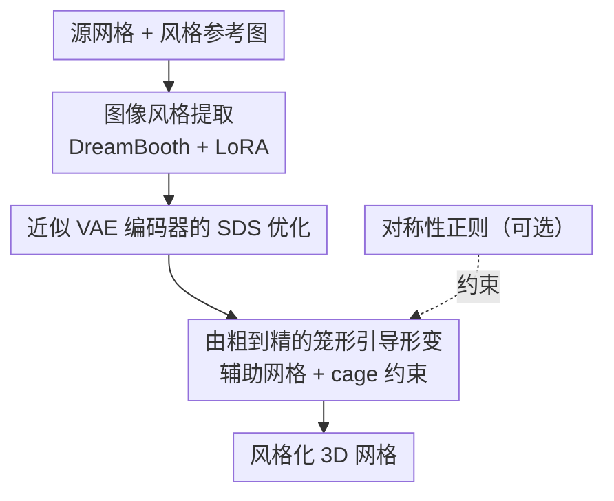

# Image-Guided Geometric Stylization of 3D Meshes

**会议**: CVPR 2026  
**论文**: [CVF Open Access](https://openaccess.thecvf.com/content/CVPR2026/html/Choi_Image-Guided_Geometric_Stylization_of_3D_Meshes_CVPR_2026_paper.html)  
**代码**: [项目页 GeoStyle](https://changwoonchoi.github.io/GeoStyle)  
**领域**: 3D视觉  
**关键词**: 几何风格化, 网格形变, SDS, 扩散先验, 由粗到精

## 一句话总结
给定一张参考图片和一个源 3D 网格，本文用 DreamBooth+LoRA 把参考图的"几何风格"抽成扩散模型权重，再用 SDS loss（配一个近似 VAE 编码器）驱动**逐面 Jacobian** 形变，通过"由粗到精 + 笼形约束 + 可选对称性"让网格在保持原有拓扑与部件语义的前提下，大幅变形以表达参考图的姿态、轮廓等高层几何特征。

## 研究背景与动机

**领域现状**：3D 生成模型已经能造出视觉上合理的物体，3D 风格迁移也很成熟——但绝大多数风格迁移（无论是基于点云、网格、NeRF 还是 3DGS）都聚焦在**表面纹理/外观**这种高频信息上：换颜色、换笔触、换材质，几何骨架几乎不动。

**现有痛点**：真正的"风格"远不止纹理。比如布尔乔亚的蜘蛛雕塑那种细长张牙舞爪的轮廓、消防栓那种敦实刚硬的结构感，这些**几何层面的风格**无法用局部纹理统计描述。少数尝试几何风格迁移的工作，要么局限在图像域、要么只能处理特定物体类别，要么只能做高频几何细节（局部顶点位移），做不出大尺度的结构变形。

**核心矛盾**：用文字来描述这种几何风格本身是不可靠的——"白兔坐在木桌上"这类文本提示很难精确传达作者想要的轮廓、比例、姿态（论文 Fig. 2 显示文本驱动形变常常抓不住几何意图）。同时，想做大尺度形变又容易破坏网格拓扑、丢掉部件语义。

**本文目标**：把"几何风格化"形式化为**对用户给定网格的形变任务**——既要能从一张图里抽出抽象的几何风格，又要能做剧烈但合法的形变（保持流形拓扑、保持部件语义）。

**切入角度**：作者不从零生成几何，而是**形变已有网格**。理由很实际：从合法的网格拓扑出发，可以保留 UV 贴图、骨骼绑定等宝贵资产，也兼容平滑/上采样/重网格化等成熟几何处理管线；而体素/隐式表示虽然渲染方便，却缺乏严格的拓扑结构。

**核心 idea**：把参考图的风格用预训练扩散模型抽成 LoRA 权重作为"风格优化器"，再用 SDS 把这个风格"蒸馏"到逐面 Jacobian 参数化的网格形变上，配合由粗到精的笼形约束完成既大胆又合法的几何风格迁移。

## 方法详解

### 整体框架
输入是一个源网格和若干张风格参考图，输出是一个被"风格化"的网格——它保留源网格的粗结构与部件语义，但把参考图蕴含的几何特征（姿态、轮廓、结构）注入进去。整条管线分两步走：先**抽风格**，再**驱动形变**。

抽风格阶段：用 DreamBooth 式目标在参考图上训一个 LoRA，把图片的抽象风格固化进 SDXL 这个隐空间扩散模型里。驱动形变阶段：不直接优化顶点坐标（不稳、易碎裂），而是优化**逐面 Jacobian** $J_i \in \mathbb{R}^{3\times3}$，由 Poisson 方程从形变映射恢复顶点位置；优化信号来自风格注入后的扩散模型给出的 SDS loss，而 SDS 需要把渲染图编码进隐空间——这里用一个**近似 VAE 编码器**让梯度又快又稳地回传到几何。形变本身采用**由粗到精**策略：先在辅助网格（球体采样）上用笼形（cage）做大尺度、部件级的语义形变，再逐渐切换到逐面 Jacobian 做精细调整，并可选地施加对称性约束。

### 关键设计

**1. 图像风格提取：把"说不清的几何风格"抽成 LoRA 权重**

几何风格难以用文字定义，作者干脆借扩散模型的生成先验来"抽象"它。具体用 DreamBooth：在一小组参考图（4–12 张）上微调预训练扩散模型，使其捕获定义该主体外观的独特属性，目标函数为
$$L_{\text{DreamBooth}} = \mathbb{E}_{x,c,\epsilon,t}\big[w_t\,\lVert \hat{x}_\theta(\alpha_t x + \sigma_t \epsilon, c) - x \rVert_2^2\big].$$
关键点在于：DreamBooth 抓住的不只是表面纹理，还包括连贯的形状、比例等**结构性特征**，这正好对应几何风格化既要局部细节又要全局形状先验的需求。为降低开销，作者只更新插入 U-Net 的低秩适配器（LoRA，rank 16），把风格压成一组紧凑权重，作为后续几何要去对齐的"风格化目标"。这一步把一个本来无法精确表达的概念（几何风格）变成了可微优化能利用的信号。

**2. 近似 VAE 编码器的 SDS 优化：让梯度高效、稳定地回传到几何**

网格形变靠 Score Distillation Sampling（SDS）驱动：沿用 DreamFusion 的做法，SDS 梯度对逐面 Jacobian 表示为
$$\nabla_{J_i} L_{\text{SDS}} = \mathbb{E}_{c,\epsilon,t}\Big[w_t\big(\epsilon_\theta(z_t,c,t)-\epsilon\big)\frac{\partial z_t}{\partial J_i}\Big],$$
其中 $z_t$ 是渲染图编码进隐空间后的带噪隐变量。痛点在于：SDXL 这类隐空间扩散模型虽然先验强，但它庞大的 VAE 编解码器会让梯度回传对几何优化变得很低效——作者实测原生 SDXL VAE 甚至连文本驱动的形变都做不动（Fig. 4）。解决办法是用一个**仿射线性近似**替代 VAE 编码器：把渲染图 $x$ 拼一个全 1 通道得到 $\bar{x}=[x;1]$，拟合矩阵 $A\in\mathbb{R}^{4\times4}$ 使 $z \simeq A\bar{x}$，用 $N=500$ 组渲染图-隐变量对做最小二乘
$$A^* = \arg\min_A \sum_{i=1}^N \lVert z_i - A\bar{x}_i \rVert_2^2.$$
这个近似看似简单却是成败关键——没有它，连文本引导的形变都会失败；有了它，SDXL 才能稳定地把语义对齐的形变蒸馏到几何上。

**3. 由粗到精的笼形引导形变：先大改结构再抠细节，且不破坏语义**

直接用逐面 Jacobian 一步到位做剧烈形变，当参考图与初始几何差异很大时会把整体结构搞坏。作者提出由粗到精：**粗阶段**先在一个由原网格顶点采样得到的球体组成的"辅助网格"上做大尺度形变——用 PartField 把网格切成语义部件，对每个部件拟合朝向包围盒（OBB）$\{C_l\}$，以缩放 $s_l$、旋转 $R_l$、平移 $T_l$ 参数化粗形变，球心按 $p' = s_l R_l p + T_l$ 更新。再通过笼形系数 $W_i=[w_{i1},\dots,w_{i8}]^\top$（满足 $v_i=\sum_j w_{ij}c_{lj}$、$\sum_j w_{ij}=1$）把辅助网格的部件级变换传到源网格，并用
$$L_{\text{cage}} = \frac{1}{L}\sum_{l=1}^L \frac{1}{|C_l|}\sum_{v_i\in C_l}\lVert W_i^{\text{aux}}-W_i^{\text{tgt}}\rVert_2^2$$
约束目标网格的笼形系数去跟随辅助网格，从而保持部件级语义、稳住大形变。随后**逐渐衰减** $L_{\text{cage}}$ 的权重（$\lambda_6(t)=\lambda_6(1-0.99\,t/N_1)$），把优化重心交给逐面 Jacobian 的 $L_{\text{SDS}}$ 去做精细几何。粗阶段目标 $L^{\text{aux}}=\lambda_1 L^{\text{aux}}_{\text{SDS}}+\lambda_2 L^{\text{aux}}_{\text{sym}}$，细阶段目标 $L_{\text{tgt}}=\lambda_3 L_{\text{SDS}}+\lambda_4 L_{\text{reg}}+\lambda_5 L_{\text{sym}}$，其中 $L_{\text{reg}}$ 是 TextDeformer 的 Jacobian 正则（鼓励 $J_i$ 接近单位阵，防止过度偏离源网格）。这个"辅助网格 + 笼形 + 权重退火"的组合是它既能大改又不崩的核心。

**4. 对称性正则：可选地保住源网格的内在对称结构**

很多物体本身有反射对称，剧烈形变后容易破坏这种对称、产生违和结果。作者对源网格顶点做 PCA 得到主轴 $\{a_k\}$，对每个轴定义过质心的反射平面 $\Pi_k$，把每个顶点镜像后找最近邻，当镜像误差同时满足逐点阈值 $\tau_1$ 和总和阈值 $\tau_2$（式 8）时认定 $\Pi_k$ 为有效对称面，并收集对称对集合 $P_k$。检测到对称后引入两项损失：一项让对称对中点落在公共平面上 $L_{\text{mid}}=\sum_k \frac{1}{|P_k|}\sum |\tilde{n}_k^\top(m_{i,k}-\bar{v})|^2$，另一项让对称对方向向量正交于平面法线 $L_{\text{dir}}=\sum_k \frac{1}{|P_k|}\sum (1-|\tilde{n}_k^\top \hat{d}_{i,k}|)$，合成 $L_{\text{sym}}=L_{\text{mid}}+L_{\text{dir}}$，同样作用到辅助网格。这是个**可选**约束，只在源网格与目标形变本身具有对称结构时打开，能让结果更协调一致。

### 损失函数 / 训练策略
- 风格提取：DreamBooth 目标式 (1) 训练 rank-16 LoRA，参考图 4–12 张。
- 粗阶段（$t\in(0,N_1]$）：$L^{\text{aux}}=\lambda_1 L^{\text{aux}}_{\text{SDS}}+\lambda_2 L^{\text{aux}}_{\text{sym}}$ 优化笼形 OBB 参数，再算 $L_{\text{cage}}$，目标网格用 $L_{\text{tgt}}(t)=\lambda_3 L_{\text{SDS}}+\lambda_4 L_{\text{reg}}+\lambda_5 L_{\text{sym}}+\lambda_6(t)L_{\text{cage}}$，$\lambda_6$ 线性退火。
- 细阶段（$t\in(N_1,N_2]$）：去掉笼形约束，$L_{\text{tgt}}=\lambda_3 L_{\text{SDS}}+\lambda_4 L_{\text{reg}}+\lambda_5 L_{\text{sym}}$。
- 其它：可微光栅化渲染，源网格约 2k–20k 顶点；近似编码器用 $N=500$ 对样本最小二乘拟合。

## 实验关键数据

> ⚠️ 本文实验以**用户研究排名**和**定性对比图**为主，正文未给出可直接列入表格的数值结果；下列表格为对论文 Fig. 5/6/8 等定性结论的归纳，具体数值以原文为准。

### 主实验（用户研究，3 项标准对比）
32 名参与者对 8 组样本按三项标准对各方法输出排序，名次转分。对比基线包括 Paparazzi、Neural 3D Mesh Renderer、MeshUp、Text2Mesh、TextDeformer（其中 Text2Mesh/TextDeformer 把 CLIP 文本嵌入换成参考图的 CLIP 图像嵌入以适配本任务）。

| 评测标准 | 本文（Ours） | 基线表现 | 说明 |
|----------|--------------|----------|------|
| 几何对齐 (Geometry Alignment) | 最佳 | 普遍较弱 | 本文能把参考图的姿态/轮廓真正变到网格上 |
| 美学风格迁移 (Aesthetic Style Transfer) | 最佳 | 普遍较弱 | 本文风格传达最到位 |
| 内容保持 (Content Preservation) | 较好但非第一 | 部分基线更高 | ⚠️ 基线分高是因为它们几乎没形变、网格仍贴近源网格 |

### 消融实验（定性，去掉各组件的效果）

| 配置 | 关键现象 | 结论 |
|------|---------|------|
| Full model | 大尺度合法形变 + 细节 + 保语义 | 完整模型最佳 |
| w/o 近似 VAE 编码器（用原生 SDXL VAE） | 无法产生合理形变、网格基本不动 | 近似编码器对"驱动出有意义的形变"至关重要 |
| w/o 辅助网格 / 笼形系数正则 | 几何扭曲、抓不准参考图几何风格 | 笼形约束既助力大形变又稳定整体过程 |
| w/o 对称性损失 | 本身对称的物体形变后失去对称、协调性差 | 对源网格+目标皆对称时该约束有益 |

### 关键发现
- **近似 VAE 编码器是隐形的命门**：不是锦上添花，而是没它连文本驱动形变都做不动——它让 SDXL 的强先验真正可用于几何优化。
- **逐面 Jacobian 优于直接优化顶点**：Text2Mesh 直接优化顶点坐标会产生噪声伪影，TextDeformer 虽用 Jacobian 但靠 CLIP 引导抓不住复杂几何风格，说明"好的形变参数化 + 好的风格信号"缺一不可。
- **内容保持指标要谨慎读**：基线在"内容保持"上分更高，恰恰是因为它们没做出该有的形变，这是一个需要 caveat 的反向信号，不能简单理解为基线更好。
- **额外可控性**：方法可叠加文本条件（如把源网格变成"长颈鹿"同时迁移雕塑风格），也可只对 PartField 选中的部件做局部形变（只对选中部件的 Jacobian 回传梯度），其余区域保持不变。

## 亮点与洞察
- **把"几何也是风格"这件事做实了**：跳出纹理迁移的惯性，明确用大尺度几何变形（轮廓、姿态、结构）承载风格，且用图片而非文本作为更具体的风格描述媒介，定位清晰。
- **用 LoRA 当"风格优化器"**：DreamBooth+LoRA 不只是省显存的工程手段，更是把无法言说的几何风格转成可微梯度源的关键一招，思路可迁移到其它"难以文字描述的目标"驱动的优化任务。
- **仿射线性近似 VAE 编码器**：用一个 $4\times4$ 矩阵最小二乘拟合就替代庞大 VAE 编码器，既加速又稳定 SDS，是个简单到容易被忽视、却决定成败的 trick，值得复用到其它 SDS×隐空间扩散的几何优化里。
- **由粗到精 + 笼形退火**：先在球体辅助网格上做部件级粗变形、再退火交给逐面 Jacobian 抠细节，这种"大改不崩、细抠到位"的解耦策略，对任何需要大幅但合法形变的任务都有借鉴价值。

## 局限与展望
- **依赖部件分割与对称检测的质量**：粗形变靠 PartField 的语义部件和 OBB，对称约束靠 PCA + 阈值检测，若分割或对称检测失败，笼形/对称约束的收益会打折。
- **评测偏定性**：主要靠用户研究排名与定性图，缺少标准化的定量几何指标（如形变合理性、风格一致性的客观度量），跨方法的"硬数据"对比有限。⚠️ 以原文为准。
- **优化式而非前馈**：每个网格-风格对都要跑一遍 SDS 优化（含 LoRA 训练 + 粗到精两阶段），单次生成成本不低，难以实时；近似编码器虽加速但整体仍是 per-instance 优化。
- **风格的"几何 vs 纹理"边界**：方法专注几何形变，不处理纹理；当用户想要的风格同时含特定材质/纹理时，需要额外手段配合。

## 相关工作与启发
- **vs 图像/3D 纹理风格迁移（Gatys 等、各类 NeRF/3DGS 风格化）**: 他们匹配 patch 统计、迁移高频外观（颜色/纹理/笔触），保持几何骨架不动；本文反过来**主攻几何形变**、让结构本身承载风格，互为补充而非替代。
- **vs Text2Mesh / TextDeformer（文本驱动网格形变）**: 它们用 CLIP 文本/图像嵌入引导，本文换成 SDXL+LoRA 的 SDS 引导。Text2Mesh 直接优化顶点产生伪影，TextDeformer 用 Jacobian 但 CLIP 引导抓不住复杂几何；本文用更强的扩散先验 + 近似编码器 + 由粗到精，做出更大胆且语义一致的形变。
- **vs MeshUp**: 同样用 SDS，但它依赖像素级扩散模型（DeepFloyd-IF）且缺少本文的近似编码器与笼形/对称约束等精细设计，结果次优；本文的差异主要来自"SDXL + 近似 VAE + 由粗到精正则"这一整套配方。
- **vs 手工正则驱动的大形变方法**: 早期工作靠手工启发式正则项做大尺度形变，只能表达特定风格；本文从参考图自动抽风格，泛化到多样几何风格。

## 评分
- 新颖性: ⭐⭐⭐⭐⭐ 把"几何即风格 + 图像驱动 + 网格形变"三者打通，定位与切入角度都新颖
- 实验充分度: ⭐⭐⭐ 定性对比与用户研究充分，但缺标准化定量指标，硬数据偏少
- 写作质量: ⭐⭐⭐⭐ 动机层层递进、方法各组件交代清晰，公式完整
- 价值: ⭐⭐⭐⭐ 为参考图驱动的 3D 内容创作提供了实用框架，近似 VAE 编码器等 trick 可复用

<!-- RELATED:START -->

## 相关论文

- [\[CVPR 2026\] MatE: Material Extraction from Single-Image via Geometric Prior](mate_material_extraction_from_single-image_via_geometric_prior.md)
- [\[CVPR 2026\] WorldStereo: Bridging Camera-Guided Video Generation and Scene Reconstruction via 3D Geometric Memories](worldstereo_bridging_camera-guided_video_generation_and_scene_reconstruction_via.md)
- [\[CVPR 2026\] Radiance Meshes for Volumetric Reconstruction](radiance_meshes_for_volumetric_reconstruction.md)
- [\[CVPR 2026\] Parallelised Differentiable Straightest Geodesics for 3D Meshes](parallelised_differentiable_straightest_geodesics_for_3d_meshes.md)
- [\[CVPR 2026\] SGSoft: Learning Fused Semantic-Geometric Features for 3D Shape Correspondence via Template-Guided Soft Signals](sgsoft_learning_fused_semantic-geometric_features_for_3d_shape_correspondence_vi.md)

<!-- RELATED:END -->
