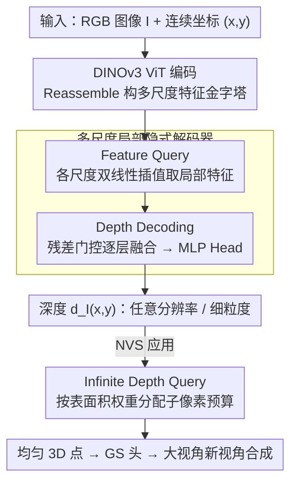

# InfiniDepth: Arbitrary-Resolution and Fine-Grained Depth Estimation with Neural Implicit Fields

**会议**: CVPR 2026  
**论文**: [CVF Open Access](https://openaccess.thecvf.com/content/CVPR2026/html/Yu_InfiniDepth_Arbitrary-Resolution_and_Fine-Grained_Depth_Estimation_with_Neural_Implicit_Fields_CVPR_2026_paper.html)  
**代码**: https://github.com/zju3dv/InfiniDepth  
**领域**: 3D视觉  
**关键词**: 单目深度估计, 神经隐式场, 任意分辨率, 细粒度几何, 新视角合成

## 一句话总结
InfiniDepth 把深度从"离散网格上的逐像素值"改成"连续 2D 坐标到深度的神经隐式场"，用一个多尺度局部隐式解码器在任意 $(x,y)$ 处查询深度，从而摆脱训练分辨率限制、直接预测任意分辨率且细节锐利的深度图，并配套一个按表面积分配采样预算的查询策略来改善大视角新视角合成。

## 研究背景与动机

**领域现状**：单目深度估计的主流做法（DepthAnything、MoGe、Marigold 等）都把深度图建模成一张和输入图像同尺寸的**离散 2D 网格**，因为这种表示天然适配卷积/Transformer 的张量计算。

**现有痛点**：离散网格表示带来两个根本限制。其一是**分辨率被训练尺寸锁死**——网络只能在固定网格位置出深度，要出更高分辨率只能靠卷积上采样或从 latent 线性投影到深度 patch；前者会把边缘抹平产生平滑过度，后者难以刻画局部几何变化，两者都牺牲了高频细节。其二是在**几何剧烈变化的区域**（薄结构、边缘、遮挡边界）预测不准，点云一拉近就糊。

**核心矛盾**：高分辨率 + 细粒度几何 与 离散网格表示 之间存在本质冲突——只要深度还被钉死在固定网格点上，输出分辨率就受限于训练图尺寸，细节就被采样精度卡住。

**本文目标**：让深度预测既能输出任意分辨率，又能在细节区域保持锐利几何，还能反过来帮助下游 3D 任务（如新视角合成）。

**切入角度**：隐式神经表示（NeRF、LIIF、PiFU）早已证明"把信号建模成连续坐标的函数"可以在分辨率无关的前提下刻画细粒度几何。作者把这套思路从 3D 重建/图像超分迁移到深度估计：既然深度本质上是图像平面上的连续函数，为什么要把它离散成网格？

**核心 idea**：用神经隐式场代替离散网格来表示深度——把深度估计写成一个映射 $d_I(x,y)=N_\theta(I,(x,y))$，对任意连续坐标 $(x,y)$ 都能查询出深度值，从根上解除分辨率和细节的双重约束。

## 方法详解

### 整体框架

给定一张 RGB 图像 $I$ 和图像平面上**任意**一个连续坐标 $(x,y)\in[0,W]\times[0,H]$，InfiniDepth 直接输出该点的深度 $d_I(x,y)$，而不是一次性输出整张网格深度图。整条流水线是：图像先过 DINOv3 ViT 编码器，经一个 reassemble 块抽取多层特征并构造成多尺度特征金字塔；对查询坐标 $(x,y)$，在金字塔每一尺度上用双线性插值取出局部对齐特征（Feature Query）；再把多尺度局部特征从浅（高分辨率/细节）到深（低分辨率/语义）逐层残差门控融合，最后一个轻量 MLP Head 把融合特征解码成深度（Depth Decoding）。想要多大分辨率，就密集采多少个坐标——分辨率彻底和网络解耦。

这套"连续坐标查询 → 局部特征 → MLP 出深度"的范式还带来一个副产品：因为深度场对图像坐标可微，可以用 autograd 直接求法向，进而设计一个按表面积分配子像素采样预算的 **Infinite Depth Query**，让反投影出来的点云在物体表面均匀分布，从而显著改善大视角下的新视角合成（NVS）。

### 关键设计

**1. 把深度建模为神经隐式场：用连续函数取代离散网格**

这一步直接针对"分辨率被训练尺寸锁死、细节被网格采样卡住"的根本痛点。隐式神经表示把信号 $y$ 写成连续坐标 $x$ 的函数 $y=F_\theta(x)$（$F_\theta$ 通常是 MLP），相比 voxel/网格那种"保真度随离散精度走"的显式表示，它能用更少参数、在分辨率无关的前提下刻画细粒度几何。作者把这个概念搬到深度上，定义

$$d_I(x,y)=N_\theta\big(I,(x,y)\big),\quad (x,y)\in[0,W]\times[0,H],$$

即给定输入图像 $I$，任意连续坐标都能查询出深度。与离散网格方法最本质的区别在于：旧方法是"一次出一整张固定尺寸的图"，本文是"按需在任意坐标点出深度"——要 4K 就在 4K 个网格点查询，要 16K 就查 16K 个点，模型本身不用重训、也不受训练分辨率约束。局部化的逐点预测还天然更擅长捕捉几何突变，因此细节区域的点云更锐利（论文 Fig. 1b）。

**2. 多尺度局部隐式解码器：浅层细节与深层语义的残差门控融合**

光有"连续坐标 → 深度"的范式还不够，关键是 $N_\theta$ 怎么实例化才能既保细节又有全局语义。作者把 $N_\theta$ 实例化成一个由 **Feature Query** 和 **Depth Decoding** 两块组成的轻量解码器。Feature Query 这一侧：图像过 ViT 后，reassemble 块从多个层抽特征并投影到不同隐维度，把浅层特征（细节）上采到更高空间分辨率、深层特征（语义）保持原分辨率，构成金字塔 $\{f^k\}_{k=1}^L$。对查询坐标先按尺度映射 $(x_k,y_k)=\big(x\cdot\frac{w_k}{W},\,y\cdot\frac{h_k}{H}\big)$，再在四邻域内双线性插值得到该尺度的局部特征 $f^k_{(x,y)}$。Depth Decoding 这一侧：从最浅（最高分辨率/细节）尺度的 $h_1:=f^1_{(x,y)}$ 出发，逐尺度做残差门控融合

$$h_{k+1}=\mathrm{FFN}_k\big(f^{k+1}_{(x,y)}+g_k\odot\mathrm{Linear}(h_k)\big),$$

其中 $g_k\in(0,1)^{C_{k+1}}$ 是可学习的逐通道门，$\odot$ 是逐元素相乘，$\mathrm{FFN}_k$ 是两层带非线性的前馈网。这样从 $k=1$ 融到 $L-1$，得到最深尺度的融合特征 $h_L$，最后由 MLP Head 出深度 $d_I(x,y)=\mathrm{MLP}(h_L)$。"从高分辨率往低分辨率逐层融合 + 门控"的设计意图很明确：让细节特征主导、再用语义特征做条件约束，既保住局部高频几何又不丢全局结构——这正是离散网格上卷积上采样/线性投影做不到的。实现上用 DINOv3 ViT-Large，取第 4/11/23 层、投影到 256/512/1024 维，第 4、11 层分别上采 4× 和 2×。

**3. Infinite Depth Query：按 3D 表面积分配子像素查询预算，得到均匀点云**

这一设计针对的是下游 NVS 的痛点：把"逐像素离散深度图"反投影成点云时，由于透视投影和表面朝向，点云密度严重不均——远处和斜面区域单像素覆盖的真实表面更大，导致大视角下出现空洞和伪影。作者的洞察是：每个像素对应的 3D 表面微元 $\Delta S(x,y)$ 取决于两个几何因子——**深度平方缩放**（远处像素覆盖面积 $\propto d^2$）和**表面朝向**（法向偏离视线方向时投影被压缩，单像素覆盖更大表面）。于是给每个像素分配一个自适应权重

$$w(x,y)=\frac{d_I(x,y)^2}{\,\lvert n(x,y)\cdot v(x,y)\rvert\,}+\varepsilon\ \propto\ \Delta S(x,y),$$

其中 $d_I(x,y)^2$ 对应深度平方缩放、$\lvert n(x,y)\cdot v(x,y)\rvert$ 补偿表面朝向，$v$ 是单位视线方向，$\varepsilon$ 是数值稳定项。关键妙处在于法向 $n(x,y)$ 不是另估的，而是利用隐式深度场对连续图像坐标可微，直接对反投影点 $X(x,y)$ 求 Jacobian 得到：

$$n(x,y)=\frac{\partial_x X(x,y)\times\partial_y X(x,y)}{\lVert\partial_x X(x,y)\times\partial_y X(x,y)\rVert}\in\mathbb{R}^3.$$

按 $w(x,y)$ 给每个像素分配子像素查询预算、在像素 patch 内均匀撒连续坐标查询深度再反投影，就得到表面覆盖近似均匀的点云（论文 Fig. 3b）。把这些均匀点当作 Gaussian 中心喂给一个轻量 GS 头，就能在大视角下渲出更完整、空洞更少的新视角。这个设计能成立的前提，恰恰是设计 1 的"连续坐标可查询 + 可微"——离散网格深度做不到子像素查询，也拿不到解析法向。

### 损失函数 / 训练策略

因为深度是隐式场、可以只监督稀疏采样点而非整张图，作者每次随机取 $N$ 个坐标-深度对，算 $\ell_1$ 损失：

$$L=\frac{1}{N}\sum_{i=1}^{N}\lvert d_i-\hat d_i\rvert,$$

$d_i$ 为真值、$\hat d_i$ 为预测。为追求细粒度几何，模型**只在合成数据上训练**（真实数据深度噪声大、不完整），用 Hypersim、VKITTI、TartanAir、IRS 以及高分辨率的 UnrealStereo4K、UrbanSyn 等。优化器 AdamW，学习率 $1\times10^{-5}$，8 张 A800、每卡 batch 4，训练 800k 步。度量深度版本（Ours-Metric）借用 PromptDA 的 depth prompt 模块接入稀疏深度输入。

## 实验关键数据

评测分两类任务：仅 RGB 输入的**相对深度估计**，和加稀疏深度的**度量深度估计**。除 KITTI/ETH3D/NYUv2/ScanNet/DIODE 五个真实数据集外，作者自建 **Synth4K**——取自 5 款游戏的 4K RGB-D 数据（Synth4K-1~5），并用多尺度 Laplacian 能量图构造高频（HF）mask 专测细节区域。$\delta_t$ 指满足 $\max(d/d^*,d^*/d)<1.25^t$ 的像素占比。

### 主实验

Synth4K 上相对深度（$\delta_1$，%；Full = 整张 4K 图，HF = 高频细节区）：

| 区域 | 方法 | S4K-1 | S4K-2 | S4K-3 | S4K-4 | S4K-5 |
|------|------|-------|-------|-------|-------|-------|
| Full | DepthAnything | 83.8 | 88.2 | 88.6 | 92.8 | 93.0 |
| Full | MoGe-2 | 84.2 | 86.6 | 85.3 | 95.3 | 92.4 |
| Full | **Ours** | **89.0** | **92.2** | **93.9** | **95.5** | **96.3** |
| HF | MoGe-2 | 66.5 | 62.5 | 63.4 | 78.2 | 77.3 |
| HF | **Ours** | **67.5** | **65.6** | **69.0** | **78.2** | **79.5** |

整图上每个子集都领先，细节区（HF）优势更明显——例如 S4K-3 的 HF $\delta_1$ 从 MoGe-2 的 63.4 提到 69.0，正好印证"局部化连续预测更擅长几何突变"的论点。

Synth4K 上度量深度（$\delta_{0.01}$，更严阈值 $1.01$）：

| 区域 | 方法 | S4K-1 | S4K-2 | S4K-3 | S4K-4 | S4K-5 |
|------|------|-------|-------|-------|-------|-------|
| Full | PromptDA | 65.0 | 66.3 | 72.0 | 78.8 | 69.2 |
| Full | **Ours-Metric** | **78.0** | **76.6** | **83.8** | **87.2** | **83.1** |
| HF | PromptDA | 21.1 | 15.3 | 24.7 | 32.0 | 27.3 |
| HF | **Ours-Metric** | **33.2** | **24.0** | **37.2** | **45.5** | **38.8** |

度量任务上提升幅度比相对任务更大：HF 区 $\delta_{0.01}$ 几乎相对 PromptDA 翻倍（如 S4K-4 从 32.0 到 45.5）。这与作者解释一致——稀疏深度大幅降低了度量歧义，本文表示带来的精度增益就更能体现出来。

真实数据集上，相对任务（$\delta_1$）InfiniDepth 与 MoGe-2 等 SOTA 基本持平（如 ETH3D 99.1 略高），因为 RGB-only 相对深度歧义大、指标趋于饱和；而度量任务（$\delta_{0.01}$）则全面领先：

| 任务 | 方法 | KITTI | ETH3D | NYUv2 | ScanNet | DIODE |
|------|------|-------|-------|-------|---------|-------|
| 度量 $\delta_{0.01}$ | PromptDA | 58.3 | 92.8 | 83.6 | 87.0 | 97.3 |
| 度量 $\delta_{0.01}$ | **Ours-Metric** | **63.9** | **96.7** | **86.9** | **90.4** | **98.4** |

### 消融实验

在度量深度（$\delta_{0.01}$）上逐组件消融（部分数据集）：

| 配置 | S4K-1 | KITTI | ETH3D | NYUv2 | ScanNet | DIODE |
|------|-------|-------|-------|-------|---------|-------|
| Full Model | 72.7 | 61.7 | 93.9 | 84.7 | 88.5 | 97.6 |
| w/o Neural Implicit Fields | 62.4 | 49.0 | 88.9 | 81.2 | 84.2 | 95.4 |
| w/o Multi-Scale Query | 66.6 | 59.7 | 88.7 | 82.5 | 86.2 | 95.6 |
| w/o DINOv3 | 63.8 | 57.9 | 90.1 | 80.8 | 83.2 | 95.8 |

"w/o Neural Implicit Fields"是把隐式表示换成 DPT 离散网格解码器（编码器/训练数据相同），掉点最狠（S4K-1 72.7→62.4，KITTI 61.7→49.0），直接证明隐式表示本身是性能主力；多尺度查询和 DINOv3 编码各自也贡献明显。

### 关键发现
- **隐式表示是性能的根基**：换回离散网格（w/o NIF）在度量任务上掉点最多，且作者指出相对任务上增益较温和、度量任务上增益大——因为稀疏深度降低歧义后，表示带来的细节精度才不会被歧义"淹没"。
- **多尺度残差门控融合有效**：只用编码器最后单尺度特征（w/o Multi-Scale Query）在所有数据集都掉点，说明"浅细节 + 深语义"逐层融合是刻画细粒度几何的关键。
- **细节区收益最大**：HF mask 区域的领先幅度远大于整图，与"连续局部预测擅长几何突变"的核心主张吻合。
- **隐式场可微带来法向"白拿"**：法向直接由深度场对坐标求 Jacobian 得到（Fig. 4 显示法向图质量很高），无需额外法向网络，这也是 Infinite Depth Query 能均匀采样的前提。
- **下游 NVS 受益**：相比预测逐像素深度的 ADGaussian，用均匀点云做 Gaussian 中心后，大视角下空洞与伪影明显减少（Fig. 1c、Fig. 8）。

## 亮点与洞察
- **把"深度估计"重新定义为隐式函数查询**：最大的"啊哈"在于跳出"深度图 = 一张固定尺寸张量"的思维定式——既然深度是图像平面上的连续量，就该按坐标查询而非按网格输出，分辨率与细节的双重约束一并解除。
- **可微表示的衍生红利**：因为 $d_I(x,y)$ 对坐标可微，法向用 autograd 解析求出，再据此设计按表面积分配的采样预算——一个表示选择顺手解决了点云密度不均这个看似无关的 NVS 难题，设计闭环漂亮。
- **稀疏点监督的灵活性**：隐式场可只监督随机采样的 $N$ 个点，天然适配高分辨率训练、降低显存压力，这是网格表示难以做到的。
- **可迁移思路**：这套"多尺度局部特征 + 坐标隐式查询"的解码范式，可迁移到法向估计、表面重建、语义分割等任何"图像平面上的连续场预测"任务。

## 局限与展望
- **作者承认的局限**：只在单视角深度数据上训练，应用到视频时不显式约束时序一致性，可能出现帧间闪烁；未来计划扩到多视角设置以提升时序稳定与 3D 一致性。
- **仅用合成数据训练**：为追求细粒度几何故意只用合成数据，真实场景的域差距、复杂材质/透明物体下的表现仍需更多验证（论文主要在合成 Synth4K 上展示细节优势）。
- **细节设计进了 supp.**：偏移学习 vs 双线性插值、cross-attention vs 共享 MLP、GS 头结构、计算量/参数量等关键对比都放在补充材料，正文无法直接核对，复现时需查 supp.（⚠️ 以原文为准）。
- **改进思路**：把 Infinite Depth Query 的表面积权重显式纳入训练损失（而非仅推理期采样），或与多视角几何约束联合，可能进一步压缩大视角伪影。

## 相关工作与启发
- **vs DepthAnything / MoGe / MoGe-2（离散网格相对深度）**：它们用 ViT + 卷积解码器回归固定尺寸网格深度，泛化强但受限于训练分辨率、细节区糊；本文改成连续隐式场查询，整图持平、细节区显著更优。
- **vs Marigold / PPD（扩散式深度）**：扩散方法建模深度图分布、靠预训练先验或语义 prompt 细化边界，但仍是离散网格，分辨率可扩展性受限；Marigold-DC 还受 VAE 量化损失拖累度量精度。
- **vs PromptDA / PriorDA / Omni-DC（稀疏深度补全/度量）**：它们用 depth prompt 或稀疏输入提升度量精度但细粒度几何仍难恢复；本文接同样的 prompt 模块后（Ours-Metric），在 HF 细节区 $\delta_{0.01}$ 大幅领先。
- **vs LIIF / AnyFlow / DeFiNe（隐式表示迁移）**：LIIF 做连续图像超分、AnyFlow 做任意尺度光流、DeFiNe 做隐式多视角场景但受架构限制只能低分辨率输出；本文把隐式场专门适配到深度，配多尺度局部解码器实现了真正的任意分辨率 + 细粒度。

## 评分
- 新颖性: ⭐⭐⭐⭐⭐ 把深度估计从离散网格范式整体迁移到神经隐式场，并衍生出可微法向与均匀采样，思路自洽且有冲击力。
- 实验充分度: ⭐⭐⭐⭐ 合成 Synth4K + 5 个真实集、相对/度量双任务、HF 细节专项 + NVS 应用都覆盖，唯部分关键设计对比进了 supp.。
- 写作质量: ⭐⭐⭐⭐⭐ 动机—表示—解码器—查询策略层层递进，图示（Fig. 2/3/4）把抽象机制讲得很清楚。
- 价值: ⭐⭐⭐⭐⭐ 提供了一种可直接复用的"连续场深度"范式与 4K 细粒度评测基准，对高分辨率 3D 感知/重建有实际推动。

<!-- RELATED:START -->

## 相关论文

- [\[CVPR 2026\] iSplat: Iterative Learning for Fine-Grained Gaussian Splatting](isplat_iterative_learning_for_fine-grained_gaussian_splatting.md)
- [\[CVPR 2026\] Animator-Centric Skeleton Generation on Objects with Fine-Grained Details](animator-centric_skeleton_generation_on_objects_with_fine-grained_details.md)
- [\[CVPR 2026\] LiteSense: Lifting Lightweight ToF with RGB for High-Resolution Metric Depth Estimation](litesense_lifting_lightweight_tof_with_rgb_for_high-resolution_metric_depth_esti.md)
- [\[CVPR 2026\] Fresco: Frequency-Spatial Consistent Optimization for Fine-Grained Head Avatar Modeling](fresco_frequency-spatial_consistent_optimization_for_fine-grained_head_avatar_mo.md)
- [\[CVPR 2026\] NTK-Guided Implicit Neural Teaching](ntk-guided_implicit_neural_teaching.md)

<!-- RELATED:END -->
