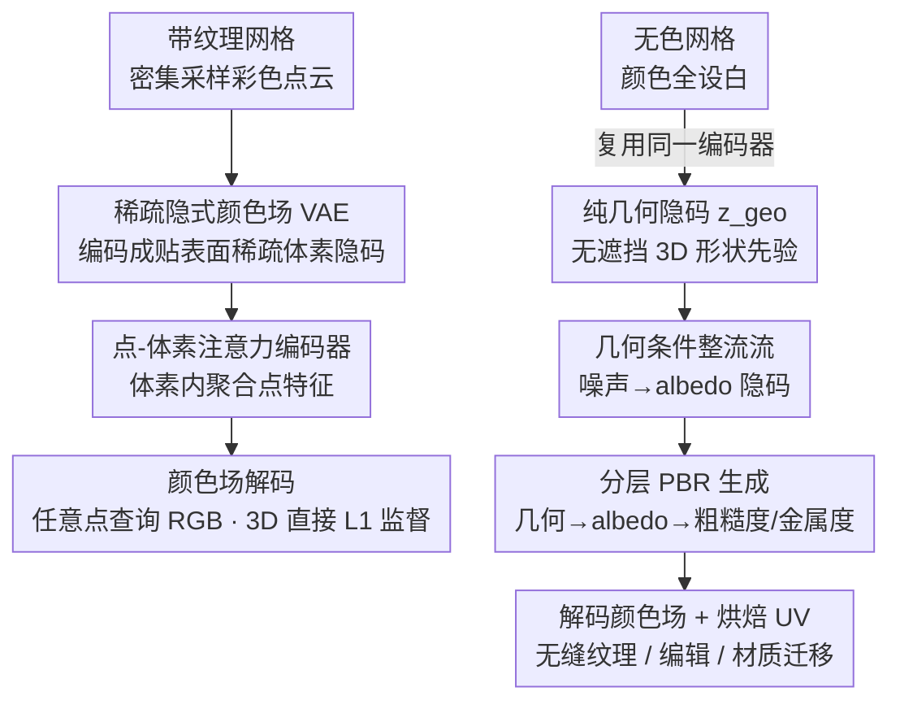

# Lafite: A Generative Latent Field for 3D Native Texturing

**会议**: CVPR 2026  
**论文**: [CVF Open Access](https://openaccess.thecvf.com/content/CVPR2026/html/Chen_Lafite_A_Generative_Latent_Field_for_3D_Native_Texturing_CVPR_2026_paper.html)  
**代码**: 无  
**领域**: 3D视觉  
**关键词**: 3D纹理生成, 稀疏隐空间, 变分自编码器, 整流流, PBR材质  

## 一句话总结
Lafite 把 3D 纹理建模成一个「稀疏隐式颜色场」——先用 VAE 把网格表面采样的彩色点云压成贴着表面的稀疏体素隐码、再解码成可在任意点查询的连续颜色场（重建 PSNR 比此前 SOTA 高 10 dB 以上），然后用整流流（Rectified Flow）在这个隐空间里、以「纯几何隐码」为条件生成新纹理，彻底绕开多视图投影与 UV 展开的接缝/畸变问题。

## 研究背景与动机
**领域现状**：给 3D 网格上纹理，目前主流是两条 2D 思路。一是「多视图投影」：从多个视角用 2D 扩散模型画出图，再投回网格表面；二是「UV 空间生成」：先把网格展开成 2D UV 图，直接在 UV 平面上画纹理。

**现有痛点**：这两条路都是从 2D 范式继承来的，各有先天缺陷。多视图投影要把多张相互不一致的 2D 图（遮挡、视角相关光照）调和成一张连贯的 3D 表面，本质是个病态问题，结果总会出现显眼的接缝和伪影，需要复杂后处理去补。UV 生成则严重依赖网格的 UV 参数化，而 UV 既不唯一又常带强烈畸变，导致纹理被拉扯或在 UV 岛边界出现接缝。它们都是「对症」而非「治本」。

**核心矛盾**：真正治本的办法是直接在 3D 空间生成纹理（native texturing），天然保证空间连贯与无缝。但 native 路线一直没能主导，根本卡点在于**缺少一个合适的 3D 纹理表征**：理想表征要同时满足三点——足够表达力以捕捉高频细节、与网格拓扑/UV 解耦、且紧凑结构化到能被生成模型有效学习。现有 native 方法（mesh 表面学习、3D 纹理场、彩色点云/3DGS）都被各自表征的能力上限卡住，要么细节糊、要么 token 爆炸。

**本文目标**：先造出一个高保真、拓扑无关、可生成的 3D 纹理表征，再在它之上做条件纹理生成。

**切入角度**：作者的核心观察是「强大的纹理生成模型，必须先学到强大的纹理表征」。于是先把全部精力压在表征上——用 VAE 学一个**稀疏隐式颜色场**；并发现同一个编码器在喂入「无色点云」时能顺带产出干净的几何隐码，正好当生成条件。

**核心 idea**：把纹理建成「3D 生成式稀疏隐式颜色场」，用 VAE 从密集彩色点云学其结构，再用整流流在该隐空间里以纯几何隐码为条件合成纹理。

## 方法详解

### 整体框架
Lafite 分两大块。**上半部（表征）**：把一个带纹理网格密集采样成彩色点云（位置+法向+颜色），喂进 VAE 编码器，压成贴着物体表面的稀疏体素隐码 $\{z_k\}$；解码端再从隐码重建出连续颜色场 $C(p)$——给空间中任意查询点 $p$，返回它的 RGB。这个 VAE 就是 Lafite 的「表征底座」，重建保真度决定了后续生成的上限。**下半部（生成）**：要给一个新的无纹理网格上色时，先把它采成**无色点云**（颜色全设白），用同一个编码器抽出**纯几何隐码** $z_{geo}$；再用一个条件整流流模型，以 $z_{geo}$（外加文本/图像提示）为条件，从高斯噪声里采样出一个新的纹理隐码，最后解码并烘焙成最终纹理。整条链路里纹理和几何始终活在同一个隐空间、天然对齐，不需要额外的几何编码器。

### 关键设计

**1. 稀疏隐式颜色场 VAE：把纹理从拓扑和 UV 里彻底解放出来**

痛点是：2D 投影/UV 表征要么受视角不一致和投影歧义所累，要么被网格的 UV 参数化绑死。Lafite 改成在 3D 里直接表征——把空间离散成体素网格，**只在物体表面附近的活跃体素**里存信息（稀疏），每个活跃体素内用一个连续隐式函数定义局部颜色场。VAE 编码器 $E$ 把密集彩色点云映成稀疏隐码 $E:\{\{x_j\}_{j=1}^{N_i}\}_{i=1}^{L}\to\{z_k\}_{k=1}^{L}$，解码器 $D$ 给定查询点反查颜色 $D:\{z_k\}\times p_j\to c_j$。这种「稀疏 + 局部连续」结构把建模容量集中在表面附近，能在任意点查询出高频细节，且与离散的网格连接性、UV 坐标完全解耦——这正是它重建 PSNR 比投影式表征高 10 dB 以上的根因。

**2. 点-体素注意力编码 + 直接喂点云：不再投影 2D 特征，从源头无偏捕捉表面外观**

此前 3D 生成模型（如 TRELLIS）的纹理编码是把预训练 2D 特征（DINO 等）从多个相机视角投到表面体素上，作者点名它三个硬伤：投影依赖视角、遮挡区有歧义；2D 特征分辨率有限、限制高频细节；特征绑在 2D 基础知识上、未必适配 PBR 这类精细 3D 属性。Lafite 改成**直接用从带纹理网格密采的彩色点云** $P=\{x_i=(p_i,n_i,c_i)\}$ 当输入，提供原生、无遮挡、视角无关的表面信息。编码器沿用 SparseFlex 结构但把 PointNet 换成**点-体素注意力**：先做体素内自注意力，让同一体素内的点互相聚合局部几何与外观，$\tilde{x}_i=\sum_{j=1}^{n}\mathrm{softmax}(Q_{x_i}K_{x_j}^{T}/\sqrt{d})\cdot V_{x_j}$；再做点-体素交叉注意力，用一个可学习体素特征 $v_k$ 去 attend 体素内全部点特征、汇成体素级特征 $\tilde{v}_k=\sum_{i=1}^{n}\mathrm{softmax}(Q_{v_k}K_{\tilde{x}_i}^{T}/\sqrt{d})\cdot V_{\tilde{x}_i}$。相比 PointNet 的平均池化，注意力能更稳健地保住局部表面外观而非把它抹平。消融里去掉点注意力，PSNR 从 32.69 掉到 30.83。

**3. 隐式几何编码：同一个编码器顺手产出无遮挡几何条件，省掉独立几何网络**

生成时需要给模型一个 3D 形状先验当条件。常规做法是再训一个几何编码器，或用 2D 位置/法向图投影（又回到遮挡和跨视角不一致的老问题）。作者的巧招是：纹理编码器在编码颜色的同时，**点云位置本身就已隐式编码了高保真几何**。于是把输入彩色点云的颜色全置成白色 $(1,1,1)$，相当于「抹掉纹理只留形状」，同一个 $E$ 跑出来的就是**纯几何隐码** $z_{geo}=E(\{p_i,n_i,1\})$。它无遮挡、且和纹理隐码活在同一隐空间、天然对齐，等于不花额外代价就拿到一个完美的几何条件——这也是「统一框架」的核心：编码器一物两用。

**4. 几何条件整流流 + 分层解耦 PBR：先几何→albedo，再 albedo→材质**

有了表征，生成端用条件整流流在隐空间里采样纹理隐码。albedo（基色）生成以 $z_{geo}$ 为主条件、用条件流匹配目标 $L_{albedo}=\mathbb{E}\lVert v(x_t;t,z_{geo})-(\epsilon-x_0)\rVert$，其中 $x_t=(1-t)x_0+t\epsilon$，$z_{geo}$ 与 $x_t$ 拼接后逐步去噪；训练用渐进课程，先在 $64^3$ 体素分辨率训、再 fine-tune 到 $128^3$。PBR 材质（粗糙度/金属度 RM）则用**分层解耦**生成：作者发现 RM 在物理上和 albedo 强相关，所以不再只条件几何，而是 fine-tune 出一个以 **albedo 隐码 $z_{albedo}$ 为条件**的 RM 生成器，形成「几何→albedo→RM」的层级链，更忠实地刻画物理依赖。实现上直接复用纹理 VAE，把三个颜色通道换成「粗糙度、金属度、补零」即可，几乎零额外结构。

### 损失函数 / 训练策略
VAE 端到端训练，目标是 3D 体内的重建 L1 加 KL 正则：$L=\mathbb{E}_{x_i\sim M}[|D(E(\{\hat{x}_i\}),p_j)-\hat{c}_j|]+L_{KL}$，其中 $\hat{x}_i=(p_i,n_i,\hat{c}_i)$、$\hat{c}_i=c_i+\epsilon$ 是加了微弱高斯噪声增强的颜色（鼓励学到鲁棒的高频表征）。作者刻意**不用基于渲染的损失**（LPIPS/SSIM），因为它们会引入模糊与偏置；监督直接在 3D 体里做，保证表征忠实于表面纹理。数据侧有一套「Principled Data Curation」：消解材质歧义（自发光面用 emission 当基色、半自发光面用 tone mapping 合成）、剔除非标准几何（描边外壳等会污染采样的壳）、并用高密度表面采样（VAE 训练 200 万点、扩散训练缓存 500 万点的隐码）来逼近无损 GT。

## 实验关键数据

### 主实验
在约 800 个由商用 AI 工具生成的「野外」网格 + 200 张提示图上做条件纹理生成评测，指标为 FID / FD / KD（CLIP、DINO 特征空间），分 Unshaded / Shaded，越低越好。

| 设置 | 方法 | FID↓ | FD_CLIP↓ | FD_DINO↓ | KD_CLIP↓ | KD_DINO↓ |
|------|------|------|----------|----------|----------|----------|
| Shaded | SyncMVD*（Text） | 119.38 | 66.87 | 80.99 | 0.058 | 0.047 |
| Shaded | UniTEX*（Image） | 105.75 | 51.62 | 69.65 | 0.038 | 0.034 |
| Shaded | MaterialMVP（Image） | 101.66 | 48.71 | 66.83 | 0.035 | 0.032 |
| Shaded | **Lafite（Image）** | **101.91** | **46.28** | **64.19** | **0.026** | **0.027** |

Lafite 在图像条件任务上几乎所有指标取得最优或次优，shaded 设置下 FD_CLIP / KD_DINO 明显领先。用户研究（20 人 600 次评测）中，Lafite 被选为最佳的比例 58.5%，远超 MaterialMVP（24.7%）与 UniTEX（16.8%）。

VAE 重建保真度（对比投影式 TRELLIS）：

| 方法 | PSNR↑ | SSIM↑ | LPIPS↓ |
|------|-------|-------|--------|
| TRELLIS-RF128* | 23.07 | 0.880 | 0.127 |
| **Ours-128** | **34.62** | **0.967** | **0.039** |

PSNR 高出 10 dB 以上，直接验证「直接编码无瑕 3D 彩色点云」远胜「投影聚合 2D 特征」。

### 消融实验

| 配置 | PSNR↑ | SSIM↑ | LPIPS↓ | 说明 |
|------|-------|-------|--------|------|
| Full model | 32.69 | 0.962 | 0.063 | 完整 VAE |
| w/o point attn | 30.83 | 0.952 | 0.071 | 去点-体素注意力，PSNR −1.86 |
| w/o augmentation | 31.62 | 0.958 | 0.067 | 去颜色加噪增强，PSNR −1.07 |

监督方式消融（Fig. 7）：直接 3D 颜色监督相比对中间渲染（3DGS、NeRF）监督，收敛更快、最终 PSNR 更高，说明 3D 直监督是更稳定无偏的信号。点密度消融（Tab. 3）：从 2 万点到 400 万点，PSNR 从 26.07 一路升到 34.45，证明表征能吃下更密输入、可扩展。

### 关键发现
- 贡献最大的是**表征本身**：VAE 重建 10 dB 的领先是整个 pipeline 的根基；点-体素注意力（−1.86）比颜色增强（−1.07）更关键。
- **不用渲染损失反而更好**：LPIPS/SSIM 类渲染监督带模糊和偏置，3D 体内直接 L1 监督收敛更快、更准。
- 表征对采样密度敏感且单调受益，这把「密采样」从工程细节抬成了高保真的必要条件。

## 亮点与洞察
- **「先表征后生成」的方法论**：作者把整个难题归结为「缺一个好表征」，并真的把主力压在 VAE 上，再让生成模型坐享其成——这种把瓶颈定位清楚再各个击破的思路很值得借鉴。
- **编码器一物两用**：同一个编码器，喂彩色点云得纹理隐码、喂白色点云得几何隐码，免费换来一个无遮挡、天然对齐的几何条件，省掉独立几何网络，非常优雅。
- **分层 PBR 顺物理依赖建模**：把材质生成拆成「几何→albedo→RM」而非一股脑条件几何，且只靠替换 VAE 的三个通道复用结构，几乎零成本扩展到 PBR。
- **稀疏隐式场可迁移**：这种「只在表面体素存隐码、任意点查询连续值」的表征，可迁移到其他需要表面属性场的任务（如表面材质、法向、语义场）。

## 局限与展望
- **作者承认**：3D-native 缺少大规模 2D 模型的语义先验，难以生成像文字这类特定 2D 图案；未来想把 2D 知识蒸馏进 3D 表征，兼顾几何完整性与语义丰富度。
- **算力门槛高**：VAE 训 600K 步用 16×A100、albedo 整流流 500K 步用 32×A100，加上每个资产 200 万–500 万点采样与隐码缓存，复现成本不低。
- **依赖高质量带纹理网格做 GT**：整套表征学习建立在密采彩色点云能无损刻画表面之上，对扫描噪声、薄壳、半透明等非标准资产的鲁棒性主要靠数据 curation 启发式规则保障，泛化边界值得进一步验证。

## 相关工作与启发
- **vs 多视图投影（SyncMVD / MaterialMVP / UniTEX）**：他们在多个 2D 视图里画再投回表面，要调和视图不一致、易出接缝；Lafite 直接在 3D 隐空间生成，从源头免疫遮挡与跨视图歧义，烘焙 UV 时只需查询连续场即无缝。
- **vs UV 空间生成（TEXGen / SeqTex）**：他们绑死在网格的 UV 参数化上、受畸变与岛边界接缝所累；Lafite 的隐式颜色场与 UV 完全解耦，UV 只在最后烘焙时作为查询坐标出现。
- **vs 投影式 3D 表征（TRELLIS）**：同为稀疏体素隐码，但 TRELLIS 把 2D DINO 特征投到体素当输入，受 2D 分辨率/视角所限；Lafite 直接编码彩色点云，重建 PSNR 高 10 dB，是「表征输入端」的关键区别。

## 评分
- 新颖性: ⭐⭐⭐⭐⭐ 首个用 VAE 学「生成式 3D 隐式颜色场」做 native texturing，编码器一物两用产几何条件的设计很巧
- 实验充分度: ⭐⭐⭐⭐ 主结果 + VAE 重建 + 多组消融 + 用户研究齐全，但缺代码、且评测网格多来自 AI 生成而非真实扫描
- 写作质量: ⭐⭐⭐⭐⭐ 问题定位（表征瓶颈）清晰，方法叙述层层递进，图表配合到位
- 价值: ⭐⭐⭐⭐⭐ 把 native texturing 的天花板抬高一截，且表征/编辑/材质迁移等下游应用通用性强

<!-- RELATED:START -->

## 相关论文

- [\[CVPR 2026\] UniTEX: Universal High Fidelity Generative Texturing for 3D Shapes](unitex_universal_high_fidelity_generative_texturing_for_3d_shapes.md)
- [\[CVPR 2026\] TEXTRIX: Latent Attribute Grid for Native Texture Generation and Beyond](textrix_latent_attribute_grid_for_native_texture_generation_and_beyond.md)
- [\[CVPR 2026\] Native and Compact Structured Latents for 3D Generation](native_and_compact_structured_latents_for_3d_generation.md)
- [\[CVPR 2026\] PointCNN++: Performant Convolution on Native Points](pointcnn_performant_convolution_on_native_points.md)
- [\[CVPR 2026\] NaTex: Seamless Texture Generation as Latent Color Diffusion](natex_seamless_texture_generation_as_latent_color_diffusion.md)

<!-- RELATED:END -->
