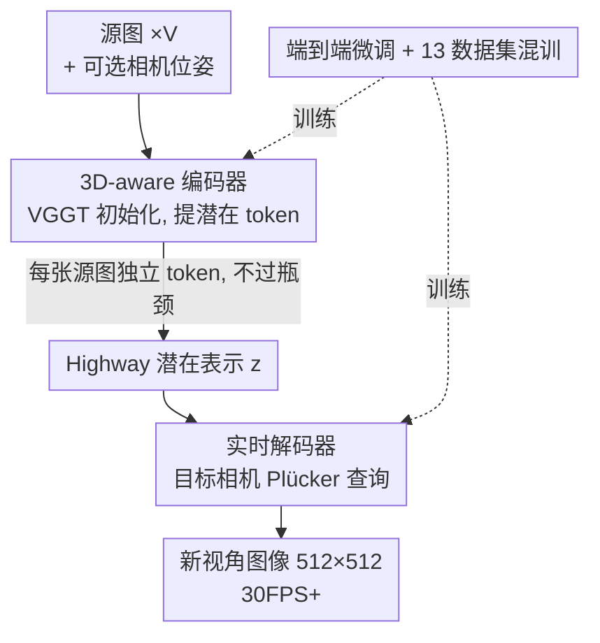

# LagerNVS: Latent Geometry for Fully Neural Real-time Novel View Synthesis

**会议**: CVPR 2026  
**论文**: [CVF Open Access](https://openaccess.thecvf.com/content/CVPR2026/html/Szymanowicz_LagerNVS_Latent_Geometry_for_Fully_Neural_Real-time_Novel_View_Synthesis_CVPR_2026_paper.html)  
**代码**: https://szymanowiczs.github.io/lagernvs （项目页，含代码/模型）  
**领域**: 3D视觉  
**关键词**: 新视角合成, 前馈渲染, 隐式几何, VGGT, 实时渲染

## 一句话总结
LagerNVS 不做显式三维重建，而是把一个为三维重建预训练好的网络（VGGT）当编码器、提取「3D-aware」的潜在特征，再配一个轻量解码器端到端微调，直接用神经网络渲染新视角——在 RealEstate10k 上做到 31.4 PSNR（比前 SoTA LVSM 高 +1.7dB），512×512 分辨率下单卡 H100 实时（30FPS+），且无论是否提供相机位姿都能用，还能换上扩散解码器做生成式外推。

## 研究背景与动机

**领域现状**：新视角合成（NVS）的主流路线是先用优化（NeRF、3DGS）把场景的**显式三维表示**拟合出来，再从目标视角渲染。这条路质量好但慢，且在源视图很少时容易过拟合。近年的前馈（feed-forward）方法用一个网络一次性预测三维表示（如逐像素 3D Gaussian），快了很多。更激进的一步是 SRT/LVSM/RayZer 这类「重建无关」方法——干脆**跳过三维重建**，让网络直接吐出新视角。

**现有痛点**：作者的观察是，跳过显式三维重建**不等于**可以丢掉所有三维归纳偏置。LVSM 这类纯重建无关模型，三维先验只剩「怎么编码相机参数」这一点，特征本身是通用的二维特征（如 DinoV2），并没有被三维任务雕琢过；同时它的「瓶颈式」编解码或「解码器单干」结构，要么把信息压进固定维度的瓶颈、限制表达力，要么每渲染一个新视角都要把整网跑一遍、拖慢速度。

**核心矛盾**：质量（强三维先验、信息不被压缩）和速度（解码器要轻、编码只跑一次）之间存在 trade-off，而纯神经渲染想同时拿到「显式重建那样的几何感」又「不付显式表示的代价」，缺一个把三维知识注入潜在特征的途径。

**本文目标**：(1) 在不做显式三维重建的前提下，把强三维偏置注入网络；(2) 在多种编解码架构里找出质量/速度最优的那一种；(3) 把解码器做到真·实时，且对是否有相机位姿、对野外数据都鲁棒。

**切入角度**：既然有现成的、用显式三维监督训出来的重建网络 VGGT，不如**不用它的显式输出（深度、相机），而是借它中间层的潜在特征**——这些特征虽不是显式「3D」，却是被三维任务训练过的，天然带几何感。

**核心 idea**：用「3D-aware 潜在特征 + highway 编解码 + 轻量解码器」替代「显式三维重建 + 渲染」，把三维先验藏进潜空间，实现既准又快的纯神经 NVS。

## 方法详解

### 整体框架

NVS 的形式化目标：给定 $V$ 张源图 $I_1,\dots,I_V \in \mathbb{R}^{3\times H\times W}$ 以及目标相机参数 $g$（相对参考图 $I_1$ 表达），输出目标视角图像 $I=f(g; I_1,\dots,I_V)$；若源相机已知则 $I=f(g; I_1,g_1,\dots,I_V,g_V)$。相机用 11 维向量 $g=(q,t,k,w)$ 参数化：$q\in S^3$ 旋转四元数、$t\in\mathbb{R}^3$ 平移、$k\in\mathbb{R}^2_+$ 水平/垂直视场角、$w$ 为场景尺度辅助参数。

LagerNVS 是一个 **encoder-decoder**：编码器 $e$ 把所有源图（含可选相机）一次性编码成潜在表示 $z=(z_1,\dots,z_V)$，解码器 $h$ 再按目标相机 $g$ 逐视角渲染 $I=h(z;g)$。这样编码的成本可以在多个目标视角间**摊销**——编码只跑一次（数秒），解码实时（30FPS+）。整条管线的三个关键判断是：编码器用**预训练三维网络初始化**（注入隐式几何）、潜在表示走 **highway**（每张源图保留独立 token、不过瓶颈）、解码器**轻量且按相机查询**（保证速度）。

### 关键设计

**1. 3D-aware 隐式几何编码器：用 VGGT 中间特征代替显式三维重建**

针对「纯神经 NVS 缺三维先验」的痛点，作者没有像 AnySplat 那样把 VGGT 接一个 Gaussian 渲染器去做显式重建，而是**只取 VGGT transformer backbone 最后几层的 token**作为潜在特征。具体地，对每张源图 $I_i$，从 VGGT 的「最后一层局部注意力」和「最后一层全局注意力」各取一组 token，去掉相机 token，沿通道维拼接，过一个线性层投到解码器期望的维度 $C$，再用 LayerNorm 归一化以稳训练，得到 $z_i\in\mathbb{R}^{P\times C}$。这些特征「不是显式 3D」，但因为 VGGT 是用显式三维监督预训练的，所以隐含了深度、多视匹配这类几何知识——消融显示，相比从零训（+2.9dB PSNR）或用通用二维特征 DinoV2，3D 预训练特征收益巨大。

对于相机已知的场景，由于 VGGT 本身不吃相机输入，作者加了一个 2 层 MLP 把相机参数 $g$ 投成 1024 维 token，**加到 VGGT 默认的相机 token 初值上**再喂进 backbone；相机缺失时把 $g$ 置零（仅保留尺度 $w$）。这一改造让同一套参数既能用相机、也能无相机推理。

**2. Highway 编码-解码架构：让源图信息不被瓶颈压扁**

作者系统对比了三种前馈 NVS 架构（图 4），痛点是它们在「表达力」和「速度」上各有短板：解码器单干（decoder-only）每个新视角都要重跑整网，慢；瓶颈式编解码（bottleneck）把潜在 token 压到与源图数无关的固定维度，信息被掐断。LagerNVS 选择 **highway 编解码**——名字取自 Highway Network 的「非衰减信息流」，潜在表示 $z=(z_1,\dots,z_V)$ **为每张源图保留各自的特征向量**，解码器能直接访问所有源图特征，不过任何瓶颈。

它的优势是双重的：一方面没有瓶颈、又能用上 VGGT 的 3D-aware 特征，表达力强；另一方面把「与目标视角无关」的计算都摊给只跑一次的编码器，解码器在固定算力预算下能学得更精。消融里（同样轻量解码器预算下）highway 显著优于 decoder-only 和 bottleneck 两种 LVSM 同款结构。

**3. 实时解码器：Plücker 射线查询 + 两种注意力变体权衡速度**

解码器 $h(g;z_1,\dots,z_V)$ 的痛点是要既能精确渲染又跑得动实时。目标相机 $g$ 不是当成向量喂，而是**稠密化成 Plücker 射线图**：每个像素存其对应射线 $(r_d,r_m)$（方向 + moment），构成 $6\times H\times W$ 图像，再用 kernel/stride $r'=8$ 的卷积压成 $HW/r'^2$ 个 token，拼上 4 个 register token，得到目标相机 token 集 $s$。解码器是 transformer，让 $s$ 去「注意」编码后的源图 token，输出端丢掉 register token、把稠密 token 线性投成 $8\times 8$ patch 拼回原图。

作者给两种注意力变体权衡质量与速度：**full attention** 变体把 $(s,z_1,\dots,z_V)$ 全拼起来做自注意力，复杂度 $O(V^2)$、质量略高；**cross-attention** 变体只在 $s$ 内部做自注意力，再与场景 token 做两层交叉注意力（$q_1=s,\,k_1=v_1=z$；$q_2=z,\,k_2=v_2=s$），复杂度降到 $O(V)$。后者让实时（30FPS+）渲染能撑到 9 张源图，full 变体只到 6 张；值得注意的是解码器是**标准神经网络**，不靠自定义 CUDA kernel 或 JIT 编译就能实时。

**4. 端到端微调 + 13 数据集混训：把 VGGT 从「只懂几何」掰成「也懂外观」**

只换架构还不够。作者发现**必须解冻整个 VGGT 端到端微调**，而不能只训新加的解码器参数——因为 VGGT 只被训练去重建几何，把颜色、反射、透明这些 NVS 关键的外观属性当噪声忽略了；冻结 backbone 会导致渲染缺反射、纹理糊，也更难学会理解输入相机。消融里 E2E 微调相比冻结 backbone 有明显增益（21.02 vs 19.01 PSNR）。训练损失是 L2 + 感知损失的组合 $\mathcal{L}=\lambda_2\mathcal{L}_2+\lambda_p\mathcal{L}_p$。数据上仿照 VGGT，用 13 个多视数据集混训（RealEstate10k、DL3DV、WildRGBD 等），规模/多样性大致对齐 VGGT——这正是它能泛化到野外照片、360°、非正方形长宽比、单视角、无相机位姿的来源。

> ⚠️ 此外，LagerNVS 的解码器可被**改造成扩散模型**做生成式 NVS：冻结编码器，只微调解码器（输入层加噪声图通道 + adaLN-zero 注入去噪时间步），用去噪扩散目标微调约 60k 步即可，在像素空间（非 latent diffusion）、仅 12 个 transformer block 就能幻想出遮挡/外推区域的合理内容。这部分是演示性实验，细节以原文为准。

## 实验关键数据

### 主实验

**与前 SoTA（LVSM）对比**（RealEstate10k，2 源视图，256×256，遵循 LVSM 协议）。"Batch" 列为训练 batch size：

| 方法 | 架构 / Batch | PSNR ↑ | SSIM ↑ | LPIPS ↓ |
|------|--------------|--------|--------|---------|
| LVSM | 瓶颈编解码 / 64 | 28.32 | 0.888 | 0.117 |
| LVSM | 解码器单干 / 64 | 28.89 | 0.894 | 0.108 |
| Ours | highway·cross-attn / 64 | 30.11 | 0.912 | 0.089 |
| Ours | highway·full / 64 | 30.48 | 0.918 | 0.086 |
| LVSM | 瓶颈编解码 / 512 | 28.58 | 0.893 | 0.114 |
| LVSM | 解码器单干 / 512 | 29.67 | 0.906 | 0.098 |
| Ours | highway·cross-attn / 512 | 31.06 | 0.924 | 0.080 |
| **Ours** | **highway·full / 512** | **31.39** | **0.928** | **0.078** |

在 batch 512 设置下，本文 full 变体 31.39 PSNR 比 LVSM 最好的解码器单干变体（29.67）高 **+1.7dB**，与摘要宣称的「31.4 PSNR、+1.7dB margin」一致。

**与前馈 3DGS 方法对比**（部分有相机/部分无相机，覆盖 DL3DV / Re10k / CO3D）：

| 设置 | 方法 | 测试数据 | PSNR ↑ | SSIM ↑ | LPIPS ↓ |
|------|------|----------|--------|--------|---------|
| 有相机 | DepthSplat | DL3DV 4-view | 22.30 | 0.765 | 0.189 |
| 有相机 | **Ours** | DL3DV 4-view | **27.56** | **0.869** | **0.095** |
| 有相机 | DepthSplat | DL3DV 6-view | 23.47 | 0.812 | 0.154 |
| 有相机 | **Ours** | DL3DV 6-view | **29.45** | **0.904** | **0.068** |
| 无相机 | NopoSplat | Re10k 2-view | 24.06 | 0.820 | 0.178 |
| 无相机 | **Ours** | Re10k 2-view | **26.07** | **0.846** | **0.151** |
| 无相机 | AnySplat | CO3D 9-view | 15.87 | 0.526 | 0.423 |
| 无相机 | **Ours** | CO3D 9-view | **22.37** | **0.697** | **0.352** |

隐式潜在表示全面超过显式 3DGS 方法，尤其在 CO3D 360° 大遮挡场景（22.37 vs AnySplat 15.87）——因为像素对齐 Gaussian 在任何源图都看不到的区域会彻底失败，而本文解码器能在一定程度上「想象」简单区域（如地板）。

### 消融实验

DL3DV split，2 源视图、已知相机，256×256 center-crop。"E2E" = 是否端到端微调，"X-attn" = 是否用交叉注意力，"Pre-Tr." = 编码器预训练类型：

| 配置 | E2E | X-attn | Pre-Tr. | PSNR ↑ | 说明 |
|------|-----|--------|---------|--------|------|
| (a) Highway | ✓ | ✓ | 3D | 21.02 | 完整模型（cross-attn） |
| (b) Highway | ✓ | ✗ | 3D | 21.30 | full attention，质量略高 |
| (c) Decoder-only | ✓ | ✗ | — | 18.39 | 换解码器单干 |
| (d) Bottleneck | ✓ | ✗ | — | 17.53 | 换瓶颈编解码 |
| (e) Highway | ✓ | ✓ | — | 18.03 | 从零训，掉 ~2.9dB |
| (f) Highway | ✓ | ✓ | 2D | 18.17 | 用 DinoV2 二维特征 |
| (g) Highway | ✗ | ✓ | 3D | 19.01 | 冻结 VGGT，不微调 |

### 关键发现
- **3D 预训练贡献最大**：(a) 21.02 vs (e) 从零 18.03，差约 +2.9dB；而二维预训练（DinoV2，18.17）几乎没用——说明收益来自「三维监督」而非「特征更强」本身。
- **必须端到端微调**：(a) 21.02 vs (g) 冻结 19.01；冻结时缺反射、纹理差，因为 VGGT 只学了几何、把外观当噪声。作者建议未来的重建模型训练时加渲染头/渲染损失以保留外观信息。
- **highway 架构最优**：在同等轻量解码器预算下，highway（a/b）> decoder-only（c）> bottleneck（d）；瓶颈唯一优势是解码速度与源图数无关。
- **速度/质量权衡**：full attention 质量略高但 $O(V^2)$，实时上限 6 视图；cross-attn 为 $O(V)$，实时上限 9 视图，渲染 56–30 FPS（1–9 视图）。

## 亮点与洞察
- **「借特征不借输出」的复用范式**：不用 VGGT 的显式深度/相机，而是劫持它的中间 token，把三维知识当成隐式偏置注入。这个思路可迁移到任何「有强预训练几何模型、但下游不要显式三维」的任务（如可微渲染、场景编辑）。
- **highway vs bottleneck 的洞见**：作者把 NVS 架构梳理成三类并实证「非衰减信息流 + 摊销编码」是质量/速度甜点，这种「先把设计空间列清楚再选」的做法本身很有参考价值。
- **一个模型吃所有输入**：同一套参数同时支持有/无相机、单视到 9 视、正方形/非正方形/360°，靠的是训练期随机采样视图数、随机丢相机 token、随机长宽比的增广——把鲁棒性「训进去」而非「分头建模」。
- **预训练模型快速学扩散**：冻结编码器、只微调解码器 60k 步、像素空间 12 个 block 就能做生成式补全，说明 3D-aware 潜在表示对生成同样是好底座。

## 局限与展望
- **确定性回归的固有缺陷**：作者承认像 LVSM 一样用回归损失，在源图未覆盖区域会「回归到均值」产生模糊；虽然扩散变体能缓解，但论文里只是初步演示，未做系统的生成质量评测。
- **依赖 VGGT 这一外部强模型**：整个方法的几何先验来自 VGGT，性能上限与 VGGT 绑定；VGGT 本身没有外观/渲染损失，得靠端到端微调「补课」，作者也把「未来重建模型该加渲染头」列为期望。
- **实时性条件较硬**：30FPS+ 是在单卡 H100、≤9 源图、512×512 下达成，更多视图或更高分辨率时 $O(V^2)$/$O(V)$ 的代价如何，需看补充材料（⚠️ 具体 FPS-视图曲线见原文 Tab. A3，以原文为准）。

## 相关工作与启发
- **vs LVSM**：同样用基于 transformer 的潜在三维表示，但本文 (1) 改了编码器信息流（highway 而非瓶颈），(2) 用三维重建预训练网络初始化编码器；两点叠加带来 +1.7dB，且支持无序图像集合。
- **vs RayZer**：RayZer 能在无相机标签下训练，但要求有序图像集合；本文可处理无序集合，且靠三维预训练拿到更强几何。
- **vs AnySplat / DepthSplat / Flare（显式 3DGS）**：它们重建显式三维表示（Gaussian/深度），本文用隐式潜在表示直接渲染；在反射、薄结构、遮挡区域更好——尤其 CO3D 大遮挡下显式像素对齐 Gaussian 完全失败，而本文能部分补全。
- **vs SVSM（并行工作）**：SVSM 分析编解码 NVS transformer 的 scaling law 以最大化训练效率；本文架构相近，但聚焦三维预训练的作用及其带来的有/无相机推理与泛化。

## 评分
- 新颖性: ⭐⭐⭐⭐ 「劫持三维重建网络的中间特征做隐式几何偏置」是个干净有力的角度，highway 架构梳理也清晰，但单点创新更偏巧妙组合而非全新范式。
- 实验充分度: ⭐⭐⭐⭐⭐ 三大对比（vs LVSM、vs 3DGS、消融）+ 多数据集泛化 + 速度分析 + 扩散扩展，覆盖很全且数字自洽。
- 写作质量: ⭐⭐⭐⭐⭐ 把 NVS 架构空间讲得很透，图文对照清楚，动机—设计—验证一条线。
- 价值: ⭐⭐⭐⭐⭐ 实时、泛化、无需相机位姿、可接扩散，工程实用性强，且开源代码模型。

<!-- RELATED:START -->

## 相关论文

- [\[CVPR 2026\] RF4D: Neural Radar Fields for Novel View Synthesis in Outdoor Dynamic Scenes](rf4dneural_radar_fields_for_novel_view_synthesis_in_outdoor_dynamic_scenes.md)
- [\[CVPR 2026\] GeodesicNVS: Probability Density Geodesic Flow Matching for Novel View Synthesis](geodesicnvs_probability_density_geodesic_flow_matching_for_novel_view_synthesis.md)
- [\[CVPR 2026\] From None to All: Self-Supervised 3D Reconstruction via Novel View Synthesis](from_none_to_all_self-supervised_3d_reconstruction_via_novel_view_synthesis.md)
- [\[CVPR 2026\] SmokeSVD: Smoke Reconstruction from A Single View via Progressive Novel View Synthesis and Refinement with Diffusion Models](smokesvd_smoke_reconstruction_from_a_single_view_via_progressive_novel_view_synt.md)
- [\[CVPR 2026\] Charge: A Comprehensive Novel View Synthesis Benchmark and Dataset to Bind Them All](charge_a_comprehensive_novel_view_synthesis_benchmark_and_dataset_to_bind_them_a.md)

<!-- RELATED:END -->
