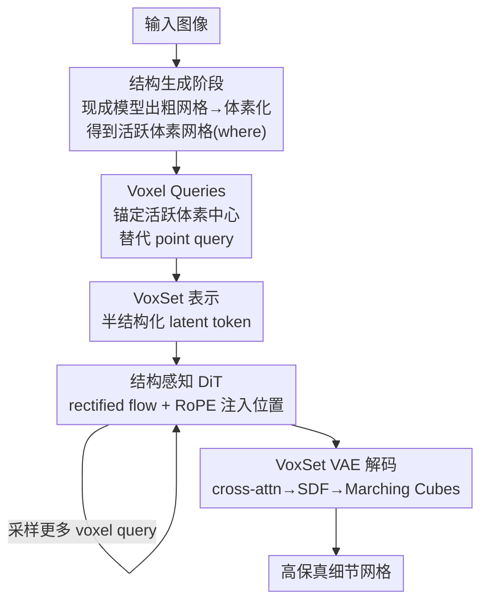

# LATTICE: Democratize High-Fidelity 3D Generation at Scale

**会议**: CVPR 2026  
**论文**: [CVF Open Access](https://openaccess.thecvf.com/content/CVPR2026/html/Lai_LATTICE_Democratize_High-Fidelity_3D_Generation_at_Scale_CVPR_2026_paper.html)  
**代码**: https://lattice3d.github.io （项目页）  
**领域**: 3D视觉 / 3D生成 / 扩散模型  
**关键词**: 3D生成, 半结构化latent, VecSet, 体素查询, test-time scaling

## 一句话总结
LATTICE 提出一种半结构化的 3D latent 表示 VoxSet——把 VecSet 那套紧凑的 latent token 锚定到粗体素网格上，从而能给扩散 transformer 注入位置信息；配合"先生成粗结构、再细化几何"的两阶段 pipeline，用纯 transformer 架构把 image-to-3D 模型规模化到 4.5B，同时实现了 3D 生成里少见的 token-level test-time scaling，在重建/生成质量上超过此前 SOTA。

## 研究背景与动机
**领域现状**：原生 3D 扩散生成目前主要围绕"用什么 latent 表示 3D 资产"这件事打转，主流是两条路线。一条是 **Sparse Voxel**（XCube、Trellis/SLAT），把特征锚定在物体表面附近的活跃体素上，天然带空间结构、利于编辑和泛化；另一条是 **VecSet**（3DShape2VecSet、Hunyuan3D-2、TripoSG），通过点云与一组查询 token 之间的 cross-attention，把整个 3D 物体压成几千个 latent 向量，紧凑、优雅、且全部用标准 self/cross-attention 实现，scalability 好。

**现有痛点**：Sparse Voxel 即便利用了 3D 稀疏性，活跃体素序列长度仍然爆炸（64³ 分辨率下 active voxel 超过 20,000），不得不上稀疏卷积、稀疏注意力等复杂系统设计，能不能 scale 仍是开放问题。VecSet 虽然紧凑高效，但长期被认为"全局建模、丢细节"，质量上落后于 2D latent diffusion。两条路线整体都明显落后 2D 图像生成。

**核心矛盾**：作者把 3D 落后 2D 的根因归到**生成任务被怎样定义**这件事上。2D 图像合成里，空间网格是预先给定的——模型只需在固定像素坐标上推断 RGB 值（这是一个被忽略却极大简化去噪过程的"秘密条件"）。而 3D 生成是开放式任务：既要决定**在哪里**放内容、又要决定放**什么内容**（SDF、RGB）。这种对"结构 + 内容"的联合推理把搜索空间炸大、引入歧义，让优化更难、scaling 行为更不可预测。

**本文目标**：从"对扩散生成器本身而言，什么才是好的 3D 表示"这个**生成中心**视角出发，把 3D 生成里"where"与"what"的预测解耦，像 2D 那样用结构/位置去引导原本无结构的 VecSet 生成。

**切入角度**：作者观察到 VecSet 用 point query 编码出来的 latent 其实**偷偷带有位置信息**——每个 latent 都和它对应 point query 附近的区域强相关（FlashVDM 指出过）。但这个信息在生成时用不上，因为 point query 采在表面、测试时位置未知。

**核心 idea**：真正重要的不是"局部性（locality）"而是"可定位性（localizability）"。于是用 **Voxel Query 代替 Point Query**——锚定在与表面相交的粗活跃体素中心上，测试时通过一个廉价的粗结构生成阶段就能拿到这些位置，从而给 VecSet 注入显式结构，得到半结构化表示 VoxSet。

## 方法详解

### 整体框架
LATTICE 的核心是 VoxSet 表示，外加一条"粗结构 → 细几何"的两阶段 coarse-to-fine pipeline。**第一阶段（结构生成）**：拿一张输入图，直接用任意现成 3D 生成器（Hunyuan3D-2、Trellis 等）生成一个质量不完美的粗网格，再把它体素化（voxelize），得到一组稀疏的活跃体素网格——这一步只负责给出"where"，即把内容该放在空间哪些位置定下来。**第二阶段（几何细化，即 LATTICE 本体）**：以这些活跃体素中心作为 Voxel Query，在 VoxSet VAE 的 latent 空间里用 rectified-flow transformer（DiT）去噪生成细节几何的 VoxSet token，每个 token 通过 RoPE 注入对应体素的位置，最后由 VAE decoder（以 SDF 网格坐标为 query 做 cross-attention）解出 SDF、经 Marching Cubes 提取出带高频细节的网格。整条 pipeline 不含任何稀疏卷积/稀疏注意力，纯 transformer，因而可以从 0.6B 平滑 scale 到 4.5B，并支持任意 token 数（任意分辨率）解码与 test-time scaling。

### 关键设计

**1. VoxSet：给 VecSet 的 latent 加上半结构化的坐标骨架**

VoxSet 要解决的是"VecSet 紧凑但无结构、Sparse Voxel 有结构但序列太长"这对矛盾。它沿用 3DShape2VecSet 的做法，用 VAE 对输入点云 $P \in \mathbb{R}^{N\times 7}$（每个点编码 3D 坐标、法向、以及标记是否落在尖锐边上的二值 sharpness 指示位）做 cross-attention，压成一串紧凑 latent token，保留 VecSet 的压缩与简洁优势；但关键改动是让**每个 latent 都锚定在一个规则体素网格的格点上**，从而把位置信息变成可直接注入 DiT 的显式结构。这样既不像 Sparse Voxel 那样序列爆炸（仍是几千 token 量级），又不像原始 VecSet 那样 latent 完全无序。更妙的是，由于 latent token 本质上编码的是全局信号、可以用任意长度序列表示同一物体，VoxSet 天然支持**任意分辨率编解码**与**progressive token scaling**——从 1024 token 起步预训练、逐步加到更多，训练成本大幅下降。

**2. Voxel Query：把"测试时位置未知"的 point query 换成可获取的体素中心**

这是 VoxSet 区别于 VecSet 的命门。VecSet 里查询集有两种：learnable query（编码全局统计、好训但难 scale）和 point query（在表面做最远点采样、编码局部信息、支持任意分辨率、且 latent 强相关于其位置）。point query 看似理想，但它采在物体表面上，**测试时表面未知 ⇒ 位置未知**，所以那份"偷偷编码的位置信息"在生成时根本用不上。作者改用 Voxel Query——锚定在与表面相交的**活跃体素中心**：这些坐标在测试时通过粗结构生成阶段就能轻松拿到；而且体素中心和具体表面"解耦"（一个体素中心不绑死某条曲面），缩小了 training-test gap，显著提升测试时泛化。一句话：用"可定位的体素坐标"换掉"测试时拿不到的表面坐标"，让位置引导真正落地。

**3. 给扩散 transformer 注入结构（RoPE）：用位置嵌入救活 3D 去噪轨迹**

光有结构化表示还不够，得让 DiT 真正用上结构。作者在 rectified-flow transformer 的**每个噪声 latent token 上加 RoPE 旋转位置嵌入**，把 VoxSet 的体素坐标喂给生成器。这个改动看着不起眼，但对收敛极其关键，原因有二：其一，3D 数据量远小于 2D 图像/视频，latent 空间严重"占用不足"，没有位置先验时去噪很难收敛；其二，几何生成本身比图像生成更稀疏更难——3D 表面只占包围盒一小块，而图像每个像素都有 RGB 值，此前只用单张图做 condition 的方法很难把去噪轨迹引导到细节几何上。RoPE 注入的位置正好补上了 2D 里"预定义网格"那个被忽视的秘密条件。

**4. Query Jitter + 渐进式训练 + token-level test-time scaling：低成本训练与训练后免费涨点**

为支持多分辨率体素结构，作者不去随机采样各种分辨率的 voxel query，而是用更简单的 **Query Jitter**：训练时给 point query 加一个小随机偏移 $\epsilon \sim \mathcal{U}\!\left(-\tfrac{1}{2R}, \tfrac{1}{2R}\right)$（$R$ 是想支持的最小分辨率），测试/扩散训练时即可在任意大于 $R$ 的分辨率上采样 voxel query。训练侧再叠两招降本：去噪时**随机采样固定数量的结构 token**（远少于 sparse voxel 方法），以及 **progressive training**——先在 1024 token 训、逐步 scale 到 6144 token。最终模型在 6144 token 上训练，**测试时直接把 token 数加到 12288、24576 乃至 30720 都能持续涨质量**（token-level test-time scaling，见下文实验），这是 3D 生成里很罕见的性质，也是 VoxSet 结构化设计带来的红利。

### 损失函数 / 训练策略
- VAE 阶段：标准的几何 VAE 重建（编码点云、重建 SDF，Marching Cubes 提网格），其余设置与 Hunyuan3D-2 一致，但只从均匀采样点云里取 query。
- 生成阶段：rectified flow（整流流）训练 VoxSet DiT；图像条件用 Dinov2-Giant 最后一层（去掉 class token），分辨率提到 1022（Hunyuan3D-2 为 518）以保细节，物体按二值 mask 裁剪保持长宽比、不额外加位置嵌入。
- 规模：训练 0.6B–4.5B 一族模型；2B 基座可在 64 GPU 上 < 24 小时训完且仍超过此前方法。

## 实验关键数据

### 主实验
重建（LATTICE-Bench(R)，CD ×10⁴、F1 ×10²）：LATTICE 用更紧凑的 latent 就拿到最佳重建。

| 方法 | Latent Size | CD(↓) | F1(↑) |
|------|-------------|-------|-------|
| Hunyuan3D-2 | 64×4096 | 12.35 | 82.78 |
| Hunyuan3D-2 | 64×8192 | 9.157 | 91.57 |
| SparseFlex (1024) | 8×196028 | 2.972 | 97.76 |
| Direct3D-s2 (1024) | 64×46592 | 4.987 | 97.46 |
| **LATTICE** | 64×4096 | 5.321 | 95.31 |
| **LATTICE** | 64×8192 | 2.909 | 98.53 |
| **LATTICE** | 64×20480 | **1.893** | **99.59** |

生成（image-to-geometry，ULIP/Uni3D 相似度，越高越好）：

| 方法 | ULIP-T | ULIP-I | Uni-T | Uni-I |
|------|--------|--------|-------|-------|
| Trellis | 0.076 | 0.126 | 0.249 | 0.311 |
| Hunyuan3D 2.0 | 0.077 | 0.130 | 0.251 | 0.315 |
| Hi3DGen | 0.066 | 0.112 | 0.246 | 0.299 |
| Direct3D-s2 | 0.074 | 0.122 | 0.247 | 0.314 |
| **LATTICE-1.9B** | **0.078** | **0.130** | **0.254** | **0.315** |

LATTICE-1.9B（与对手体量最接近）在四项指标上全面领先或持平最优。

### 消融实验
VAE 训练策略消融（统一用 4096 token + voxel query 测试，节选不同分辨率列）：

| 配置 | CD(↓) | F1(↑) | 说明 |
|------|-------|-------|------|
| Baseline（point-query VAE，换 voxel query 测） | 10.7 | 85.3 | 训练-测试 query 不一致，严重退化 |
| + Fixed Train（固定分辨率训练） | 5.73~5.69 | 94.5~94.7 | 改善但缺乏分辨率灵活性 |
| + Query Jitter | 5.32 | 95.3 | 最优，且任意分辨率可用 |

Voxel Query / VoxSet VAE 增量消融（Fig.10）：逐个加入 voxel query、VoxSet VAE，伪影逐步减少、细节增多——voxel query 因缩小 domain gap 减少伪影，VoxSet VAE 因更强重建带来更多细节。

### 关键发现
- **可定位性 > 局部性**：把 point query 换成 voxel query 是涨质量的关键，验证了"测试时拿得到的结构位置"才是核心，而非传统认为的 sparse voxel 局部性。
- **Query Jitter 是训练-测试对齐的关键开关**：原始 point-query VAE 换成 voxel query 测试会大幅掉点（CD 10.7 / F1 85.3），加了 jitter 后 CD 降到 5.32、F1 升到 95.3，且支持任意分辨率。
- **test-time scaling 真实存在**：6144 token 训练的模型，测试时把 token 加到 20480 重建 CD 从 ~2.9 降到 1.893、F1 升到 99.59，免训练就涨质量。
- 用户研究中对四个商业模型的 Overall 胜率差全部为正（约 +19.6% ~ +26.5%），主体/场景类目同样领先。

## 亮点与洞察
- **重新定义"好的 3D 表示"的判据**：从生成器视角指出 3D 落后 2D 的根因是缺少 2D 那种"预定义空间网格"的秘密条件，并用 VoxSet 把这个条件补回来——这是把问题框架本身讲清楚的洞察，比单纯堆模块更有启发。
- **"localizability not locality"这句口号很有迁移价值**：很多 3D/4D 表示之争都纠结于局部建模能力，本文点明真正卡脖子的是"测试时能不能拿到位置"，这个判据可以迁移去审视其它隐式表示。
- **token-level test-time scaling 几乎是白送的红利**：因为 latent 编码全局信号 + 体素锚定支持任意分辨率，训练后只要多采 voxel query 就能涨点，工程上极具性价比。
- **纯 transformer + 廉价训练**：2B 模型 64 GPU < 24h，证明不靠稀疏卷积/稀疏注意力这些复杂系统也能做高保真 3D，降低了规模化门槛（呼应标题 "Democratize"）。

## 局限与展望
- **强依赖第一阶段的现成结构生成器**：粗体素来自 Hunyuan3D-2/Trellis 等外部模型，若粗结构本身缺失或错位（如薄结构、被遮挡部分），第二阶段的细化能补救的程度未充分讨论；作者把"图像不对齐/缺失"列入 mesh/part refinement 应用，但量化评估有限。
- **只做几何、未联合纹理/外观**：全文聚焦 geometry（SDF/mesh），RGB/材质生成不在范围内。
- **评测指标偏间接**：生成质量主要靠 ULIP/Uni3D 相似度与用户研究，缺少更直接的几何细节定量指标；与闭源商业模型仅做用户研究胜率对比（因获取大量结果昂贵）。
- **改进思路**：把结构生成阶段端到端联合进来、或引入对粗结构错误更鲁棒的细化机制；把 localizable code 思想推广到纹理、4D 动态等。

## 相关工作与启发
- **vs VecSet / Hunyuan3D-2**：都把 3D 压成紧凑 latent token，但 Hunyuan3D-2 的 latent 无显式结构、只靠单图 condition；LATTICE 给 latent 加体素锚定 + RoPE，把"位置"显式注入 DiT，因而细节与可 scale 性更强（重建 F1 82.78→98.53 同 4096/8192 量级）。
- **vs Sparse Voxel（XCube / Trellis / Direct3D-s2 / SparseFlex）**：它们靠空间局部性保细节，但序列长、需稀疏卷积/注意力；LATTICE 用半结构化 VoxSet 在远更紧凑的 latent（64×4096 vs 64×46592 等）下达到相当或更优的重建，且架构是纯 transformer。
- **vs FlashVDM**：FlashVDM 指出 point-query latent 偷偷带位置且可 test-time scale，但没解决"测试时位置未知"；LATTICE 用 voxel query 把这条洞察真正用进生成。

## 评分
- 新颖性: ⭐⭐⭐⭐⭐ "localizability not locality" + VoxSet/voxel query 把 VecSet 与结构两全，视角与机制都新
- 实验充分度: ⭐⭐⭐⭐ 重建/生成/消融/用户研究齐全，但生成指标偏间接、闭源对比仅用户研究
- 写作质量: ⭐⭐⭐⭐⭐ 把"3D 为何落后 2D"的问题框架讲得透彻，动机与方法衔接清晰
- 价值: ⭐⭐⭐⭐⭐ 纯 transformer 低成本 scale 到 4.5B + test-time scaling，对规模化高保真 3D 生成有实际推动

<!-- RELATED:START -->

## 相关论文

- [\[CVPR 2026\] FACE: A Face-based Autoregressive Representation for High-Fidelity and Efficient Mesh Generation](face_a_face-based_autoregressive_representation_for_high-fidelity_and_efficient_.md)
- [\[CVPR 2026\] MetroGS: Efficient and Stable Reconstruction of Geometrically Accurate High-Fidelity Large-Scale Scenes](metrogs_efficient_and_stable_reconstruction_of_geometrically_accurate_high-fidel.md)
- [\[CVPR 2026\] HiFi-BRep: High-Fidelity Latent Representation for Robust B-Rep Generation](hifi-brep_high-fidelity_latent_representation_for_robust_b-rep_generation.md)
- [\[CVPR 2026\] Extend3D: Town-Scale 3D Generation](extend3d_town-scale_3d_generation.md)
- [\[CVPR 2026\] UniTEX: Universal High Fidelity Generative Texturing for 3D Shapes](unitex_universal_high_fidelity_generative_texturing_for_3d_shapes.md)

<!-- RELATED:END -->
