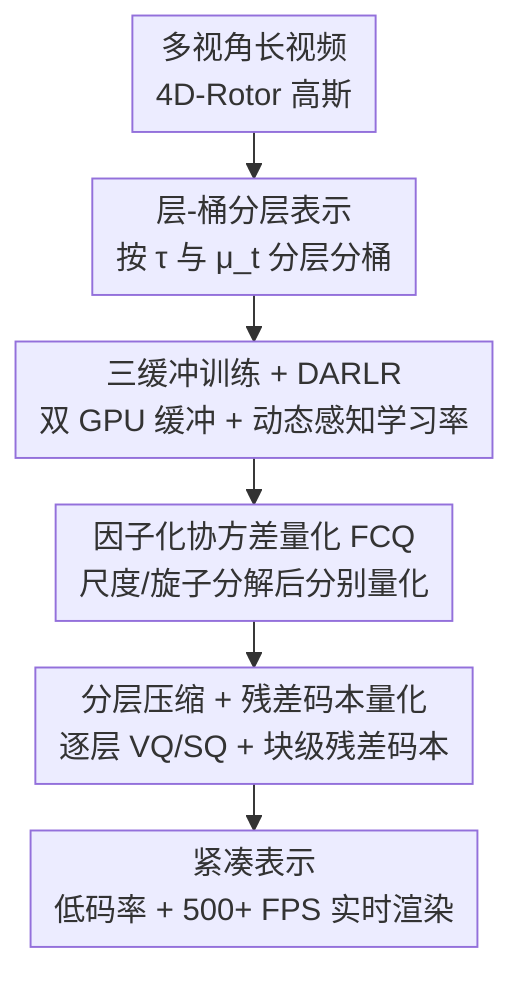

# Layered 4D-Rotor Gaussian Splatting: A Compressed Representation for Long Dynamic Scenes

**会议**: CVPR 2026  
**论文**: [CVF Open Access](https://openaccess.thecvf.com/content/CVPR2026/html/Xu_Layered_4D-Rotor_Gaussian_Splatting_A_Compressed_Representation_for_Long_Dynamic_CVPR_2026_paper.html)  
**代码**: [项目页](https://m1sak1mei.github.io/layered-4d-rotor/)  
**领域**: 3D视觉  
**关键词**: 4D高斯泼溅, 动态场景重建, 长视频, 表示压缩, 实时渲染

## 一句话总结
本文提出 Layered 4D-Rotor Gaussian Splatting（L4DRotorGS），把 4D 高斯按时间跨度组织成"层 + 桶"结构、配合三缓冲训练框架与一套面向分层结构的量化压缩（因子化协方差量化 + 分层压缩 + 残差码本量化），让分钟级长动态场景的重建在保持高保真和 500+ FPS 实时渲染的同时，把存储压到最高 22.3× 压缩比、低于 1 MB/s 码率。

## 研究背景与动机
**领域现状**：从多视角视频重建动态场景、合成新视角，是 AR/VR、影视、交互娱乐的基础能力。NeRF 系方法靠 deformation field 把时变几何映射回 canonical 空间，质量不错但体渲染慢；3D Gaussian Splatting（3DGS）凭 tile-based 光栅化把渲染做到实时，后续工作把它扩到 4D（XYZT 各向异性高斯，按时间切片得到当前帧的 3D 高斯），在短视频上表现亮眼。

**现有痛点**：这些 4D 方法几乎都卡在"短、大、占显存"三件事上——时长普遍 < 10 s，存储 > 500 MB，且 GPU VRAM 占用高。原因是随着视频变长，高斯数量爆炸式增长，存储和显存都顶不住。最近的 Temporal Gaussian Hierarchy（TGH）尝试把 4D 高斯扩到长视频，但它达不到实际部署所需的低带宽要求（如 < 1 MB/s），在移动端等带宽受限场景难以落地。

**核心矛盾**：长动态场景里，不同区域的运动尺度天差地别（从静止背景到快速人物运动），高斯的时间跨度横跨毫秒到分钟好几个数量级；而 4D 协方差又与尺度成二次关系，导致数值范围被放大到 10 个数量级以上。直接对这种"分布极度异质 + 数值病态"的 4D 高斯做向量量化（VQ）会彻底崩掉。这就是"压缩友好"与"长视频高保真"之间的根本张力。

**本文目标**：在一个统一框架里同时拿下三件事——(1) 把长视频的训练/渲染显存压下来；(2) 把存储压到 < 1 MB/s 码率而几乎不掉质量；(3) 保持 500+ FPS 实时渲染。

**切入角度**：作者观察到 TGH 那种"把高斯硬塞进固定时间段"的分层会把跨段边界的短跨度高斯下推、和几何完全不同的内容混在一层，反而让压缩更难；而真正的可压缩性来自"同层内时间一致、统计性质相近的高斯组"。于是从"为压缩重新设计分层结构"出发。

**核心 idea**：用"层 + 左右桶"的分层表示让同层高斯时序一致，再针对这种分层结构量身定制三套量化（FCQ / 分层压缩 / RCQ），把长动态场景压成低码率、可实时渲染的紧凑表示。

## 方法详解

### 整体框架
L4DRotorGS 建立在 4D-Rotor Gaussian Splatting 之上：每个 4D 高斯由 4D 中心 $\mu_{4D}=(\mu_x,\mu_y,\mu_z,\mu_t)$ 和 4D 协方差 $\Sigma_{4D}=R_{4D}S_{4D}S_{4D}^T R_{4D}^T$ 描述，其中 4D 旋转用 8 系数的 rotor 表示（前 4 编码空间旋转、后 4 编码时空旋转）。给定时刻 $t$，对 4D 高斯切片得到 3D 高斯 $G_{3D}(x,t)=e^{-\frac{1}{2}\lambda(t-\mu_t)^2}e^{-\frac{1}{2}[x-\mu(t)]^T\Sigma_{3D}^{-1}[x-\mu(t)]}$；离 $t$ 太远的高斯（$\lambda(t-\mu_t)^2>16$）被可见性门剔除，其有效时间跨度为 $\tau=2\sqrt{16/\lambda}$。

整条管线分三步走：先把所有 4D 高斯按时间跨度 $\tau$ 和均值时刻 $\mu_t$ 组织成**层 + 桶**结构，渲染某时刻时只加载当前桶及其邻桶，从源头压住显存；训练时用**三缓冲框架 + DARLR** 把 CPU↔GPU 的搬运开销和静态区不稳定都解决掉；最后对这个分层表示套用**因子化协方差量化 + 分层压缩 + 残差码本量化**三件套，把存储压到极致。层数自适应设为 $L=\lceil\log_2 n\rceil+1$（$n$ 为帧数）。

### 关键设计

**1. 层-桶分层表示：让同层高斯时序一致，从源头压显存又便于压缩**

针对长视频高斯数量爆炸、TGH 固定时间段切割反伤压缩的痛点，本文沿用 TGH "按时间跨度 $\tau$ 把高斯分到多层（长跨度→缓变区，短跨度→快变区）"的思路，但把每个 TGH 段进一步拆成**左右两个桶（bucket）**，并且**允许高斯跨桶边界**——每个高斯只按自身的均值时刻 $t$ 和时间尺度 $\tau$ 被分配，不做人为裁剪。这样同一层内得到的是时间上更连贯、统计性质更接近的高斯组，下游量化时码本更紧、误差更小。渲染时对查询时刻 $t$，每层只加载当前桶及其相邻桶，既保证可见性又把显存压到最低（N3DV 上训练峰值显存仅 2 GB）。相比 TGH 把跨界短高斯下推到低层、和几何迥异的内容混在一起，本设计正是后续高压缩比能成立的结构前提。

**2. 三缓冲训练框架 + 动态感知 Rotor 学习率（DARLR）：搬运不卡、静态区不抖**

长视频训练的两个隐患：一是高斯多到 GPU 放不下，CPU↔GPU 频繁搬运成主要瓶颈（这正是 TGH 的痛点）；二是 4D-Rotor 高斯里若给静态高斯的时间分量 rotor 用大学习率，会在优化中引发不稳定，在远离均值时刻处产生大幅位置漂移——短片影响小，长视频上被显著放大。本文用 **Triple-buffer 策略**（一个 GPU 双缓冲 + 一个 CPU 桶缓冲）：每步采样时刻 $t$ 的训练图，先做逐步自适应密度控制（剪枝/稠密化），再把 $t$ 时可见的高斯从 CPU 桶载入 GPU 渲染缓冲、把若干步未用到的高斯回卸到 CPU，最后前/反向 + 优化器一步；GPU 双缓冲让"载入下一步所需"与"计算当前步"重叠，大幅削减搬运成本。同时 **DARLR** 给时间跨度 $\tau$ 越大的高斯分配越小的时间-rotor 学习率，专门稳住静态场景区域——消融显示去掉 DARLR 后静态区纹理会被过度平滑、丢高频结构。

**3. 因子化协方差量化（FCQ）：拆解尺度与旋子，治住 4D 协方差的数值病态**

直接像 C3DGS 那样对归一化 4D 协方差做 VQ 会失败：4D 高斯的空间与时间尺度横跨 $10^{-3}\sim10^3$ 多个数量级，而协方差与尺度成二次关系（见 $\Sigma_{4D}=R_{4D}S_{4D}S_{4D}^T R_{4D}^T$），有效数值范围被放大到 10 个数量级以上，远超 VQ 的表示精度。FCQ 的做法是**分而治之**：① 尺度分解——把 4D 尺度归一化为"尺度因子 + 归一化尺度"，尺度因子用标量量化（SQ，且作用在激活前值上以避免 8-bit SQ 在大动态范围下的精度损失），归一化尺度用 VQ；② 旋子分解——静态区 rotor 的空间分量与四元数同构、时间分量通常接近零，于是对空间/时间分量各自独立 VQ，解码时用两个索引分别查空间、时间码本，再合并归一化复原完整 rotor。VQ 重要性权重沿用 C3DGS：渲染全部训练图、用每个高斯的像素贡献（反传梯度）作为量化权重。消融里 FCQ 把 PSNR 从 11.35 直接拉到 22.09、存储从 29.03 MB 降到 16.22 MB，是整套压缩里增益最大的一步。

**4. 分层压缩 + 残差码本量化（RCQ）：分布差异逐层处理，再用块级残差冲压缩上限**

长视频里不同层的时间跨度跨多个数量级，导致尺度因子、归一化尺度、rotor 空间/时间分量在层间分布差异极大；若用共享码本联合量化，会码本爆大、误差激增。**分层压缩**因此对"层间分布差异大"的分量做**逐层量化**（每层在自己的分布范围内更准更省），而对"层间分布稳定"的分量（如 SH 球谐系数、不透明度）用**全局 VQ/SQ**（不透明度对 sigmoid 后落在 [0,1] 的值做 SQ），尤其大幅压低 SH 码本存储；末尾高斯很少的层还会合并以去冗余。在此之上，**RCQ** 进一步冲压缩上界：每层全局 VQ 后，把桶分成多个 bucket block，对每块再做一次 VQ 得到块专属码本，但不单独存每块码本，而是用一个轻量**残差码本**量化"块码本与层全局码本之差"，得到同时引用全局码本与残差码本的索引表；解码时取全局码本向量加对应残差即重建块码本。layer 0 因时间变化少、收益小而被排除在 RCQ 之外。消融显示 RCQ 在码本尺寸 64~1024 间几乎不影响存储与质量，鲁棒性好。

## 实验关键数据

### 主实验
N3DV 数据集（6 个动态场景，19–21 相机，1352×1014，10 s），RTX 3090 上评测：

| 方法 | PSNR↑ | SSIM↑ | LPIPS↓ | Train↓ | FPS↑ | Storage |
|------|-------|-------|--------|--------|------|---------|
| RealTime4DGS | 31.57 | 0.97 | 0.16 | 8 h | 72.80 | 3128 MB |
| STG | 32.05 | 0.95 | 0.14 | 1.3 h | 140 | 200 MB |
| Ex4DGS | 32.11 | 0.94 | 0.14 | 0.6 h | 120.6 | 115 MB |
| TGH† | 29.44 | 0.945 | 0.214 | 2.1 h | 550 | 90 MB |
| **Ours** | **32.23** | 0.941 | 0.153 | 0.5 h | 351.12 | 180.7 MB |
| **Ours Large** | 32.06 | 0.939 | 0.153 | 0.6 h* | 661.93 | 13.8 MB |
| **Ours Small** | 31.84 | 0.937 | 0.156 | 0.6 h* | 660.79 | 8.8 MB |

未压缩的 Ours 以 32.23 PSNR 取得最佳视觉质量；Ours Large 用约 4 分钟压缩阶段换来 13.1× 存储缩减、约 90% 更快渲染（661.93 FPS），PSNR 仅降 0.17 dB；Ours Small 把压缩比推到 20.5×、码率压到 < 1 MB/s，质量仍与强基线相当。相比 RealTime4DGS 的 3128 MB、STG 的 200 MB，本文在同等甚至更高质量下存储小一两个数量级。（注：原文正文用 (l)/(m)/(n) 指代 Ours/Large/Small，与表 1 的 ID m/n/o 存在一处错位，⚠️ 以原文为准；此处数值按表 1 取。）

SelfCap 数据集（6 个大运动长序列，1–10 min，4K，18–22 相机），RTX 5090 上评测：

| 方法 | PSNR↑ | FPS↑ | Train↓ | Storage↓ |
|------|-------|------|--------|----------|
| Ours | 24.64 | 854.21 | 7.2 h | 928.8 MB |
| Ours Large | 24.49 | 1190.15 | 7.9 h | 48.4 MB |
| Ours Small | 24.41 | 1193.50 | 7.9 h | 41.8 MB |

长序列上压缩几乎不掉质量却带来约 40% FPS 提升，Ours Small 把压缩比推到 19.1×；定性上 Ours Large 与未压缩版几乎不可分辨。

### 消融实验
压缩各组件消融（N3DV Flame Salmon，RCQ 码本设 256）：

| 配置 | PSNR | Storage | 说明 |
|------|------|---------|------|
| (a) Cov4D VQ | 11.35 | 29.03 MB | 直接量化 4D 协方差，几乎崩掉 |
| (b) + FCQ | 22.09 | 16.22 MB | 因子化协方差量化，增益最大 |
| (c) + Layer Structure | 28.90 | 15.93 MB | 分层压缩，保留细粒度结构 |
| (d) + RCQ | 28.92 | 16.73 MB | 残差码本，小幅再增益 |

### 关键发现
- **FCQ 与分层结构贡献最大**：从直接量化 4D 协方差（11.35 PSNR）到加 FCQ（22.09）是质的飞跃，再加分层结构跳到 28.90；RCQ 是锦上添花的小幅提升（28.92），但能在极长场景顶住容量瓶颈。
- **SH 码本最划算**：把各属性 VQ 码本从 1,024 调到 16,384，存储随之上升，但 SH VQ 的"每 MB 质量增益（PSNR/MB）"最高；调 VQ 阈值也是同样规律——降低 SH 特征阈值给出最佳质量-存储折中。
- **RCQ 对码本尺寸不敏感**：码本从 64 到 1024，PSNR 稳定在 28.919~28.923、存储 16.73~16.74 MB 几乎不变，说明该模块鲁棒。
- **DARLR 保静态细节**：去掉后静态区纹理被过度平滑、丢高频结构。
- **跨时长稳定**：Bike 场景按 1/2.5/5/10 min 递增评测，训练随时长增加仍保持稳定。

## 亮点与洞察
- **"为压缩重新设计分层"是点睛之笔**：层-桶 + 允许跨桶让同层高斯时序一致，这一结构性改动直接决定了后续 FCQ/分层压缩能不能成立——压缩友好性不是后处理出来的，而是表示设计出来的。
- **因子化是治数值病态的通用思路**：4D 协方差跨 10 个数量级根本没法直接 VQ，把尺度拆成"因子(SQ) + 归一化(VQ)"、把 rotor 拆成"空间/时间分量分别 VQ"，本质是按"分布差异/数值范围"切分后再各自量化，这一思路可迁移到任何属性分布极度异质的表示压缩。
- **残差码本是"码本的码本"**：RCQ 不为每个块存独立码本，而是存"块码本相对全局码本的残差"，用一张索引表同时引用全局与残差码本——在几乎不增存储的前提下做细粒度精修，是很巧的工程化压缩技巧。
- **三缓冲 + 自适应密度控制耦合**：把高斯的载入/回卸和剪枝/稠密化合到一起做，GPU 双缓冲让搬运与计算重叠，把 TGH 的主要瓶颈（CPU-GPU 拷贝）摊平。

## 局限与展望
- 作者承认：**压缩过程仍然耗时**（N3DV 上约 4 分钟，长序列更久），且当前框架**不支持在线训练**，在流式采集场景适应性受限。
- 长序列重建质量本身偏低（SelfCap PSNR 仅 ~24.5），且 Table 3 中 5 min（28.58）反而高于 1 min（26.45）/10 min（24.90），说明场景内容差异对绝对 PSNR 影响很大，跨时长数值不宜直接横向比大小。
- SelfCap 缺开源长视频基线，只能自比未压缩/压缩变体，与同行长视频方法的横向对比不充分（仅在 1 s 片段与短序列基线比，放在补充材料）。
- 改进方向：把压缩并入训练（边训边压）、引入在线/流式训练以支持实时采集与传输。

## 相关工作与启发
- **vs TGH（Temporal Gaussian Hierarchy）**：同样把 4D 高斯按时间跨度分层，但 TGH 把高斯硬塞进固定时间段、跨界短高斯被下推混入异质内容，难压缩且达不到 < 1 MB/s；本文用层-桶 + 允许跨桶让同层时序一致，并配套三件量化，实现 22.3× 压缩与低码率。
- **vs RealTime4DGS / STG / Ex4DGS（4D/动态高斯）**：它们在短片上质量高但存储大（200~3128 MB）、且基本只处理 ~10 s；本文在同等甚至更高 PSNR 下存储小一两个数量级，并把时长扩到分钟级。
- **vs C3DGS（高斯压缩）**：C3DGS 对归一化 3D 协方差直接 VQ，搬到 4D 会因数值范围放大而失败；本文的 FCQ 正是针对 4D 协方差病态做的因子化改造，并复用了 C3DGS 的梯度像素贡献作量化权重。
- **vs TC3DGS / Light4GS / QUEEN / 4DGS-1K / 4DGC（动态高斯压缩）**：这些从剪枝、轨迹插值、熵约束 SH、帧间残差等角度压缩，但常在通用性/延迟/解码成本上有取舍；本文以"分层结构 + 三件量化"在长动态场景上同时拿下高压缩比与实时渲染。

## 评分
- 新颖性: ⭐⭐⭐⭐ 层-桶分层 + 面向分层的三件量化（FCQ/分层压缩/RCQ）组合解决长视频 4D 高斯压缩，结构-压缩协同设计有新意。
- 实验充分度: ⭐⭐⭐⭐ N3DV/SelfCap 双数据集 + 充分消融与超参分析；但长视频缺开源横向基线，只能自比变体。
- 写作质量: ⭐⭐⭐⭐ 动机-方法-实验链条清晰，公式与图示到位；表 1 ID 与正文标号有一处错位。
- 价值: ⭐⭐⭐⭐ 把动态高斯从 < 10 s/>500 MB 推到分钟级 + < 1 MB/s 码率 + 500+ FPS，对移动端/带宽受限部署有实用价值。

<!-- RELATED:START -->

## 相关论文

- [\[CVPR 2026\] MotionScale: Reconstructing Appearance, Geometry, and Motion of Dynamic Scenes with Scalable 4D Gaussian Splatting](motionscale_reconstructing_appearance_geometry_and_motion_of_dynamic_scenes_with.md)
- [\[CVPR 2026\] FastEventDGS: Deformable Gaussian Splatting for Fast Dynamic Scenes from a Single Event Camera](fasteventdgs_deformable_gaussian_splatting_for_fast_dynamic_scenes_from_a_single.md)
- [\[CVPR 2026\] MoRel: Long-Range Flicker-Free 4D Motion Modeling via Anchor Relay-based Bidirectional Blending with Hierarchical Densification](morel_long-range_flicker-free_4d_motion.md)
- [\[CVPR 2026\] 4C4D: 4 Camera 4D Gaussian Splatting](4c4d_4_camera_4d_gaussian_splatting.md)
- [\[CVPR 2026\] Space-Time Forecasting of Dynamic Scenes with Motion-aware Gaussian Grouping](space-time_forecasting_of_dynamic_scenes_with_motion-aware_gaussian_grouping.md)

<!-- RELATED:END -->
