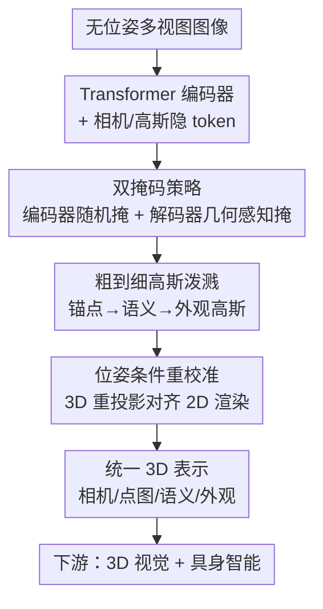

# Learning 3D Representations for Spatial Intelligence from Unposed Multi-View Images

**会议**: CVPR 2026  
**论文**: [CVF Open Access](https://openaccess.thecvf.com/content/CVPR2026/html/Zhou_Learning_3D_Representations_for_Spatial_Intelligence_from_Unposed_Multi-View_Images_CVPR_2026_paper.html)  
**代码**: https://bobochow.github.io/UniSplat （项目页）  
**领域**: 3D视觉  
**关键词**: 3D表示学习, 前馈高斯泼溅, 无位姿多视图, 自监督, 具身智能

## 一句话总结
UniSplat 是一个从「无相机位姿的稀疏多视图图像」直接前馈学习统一 3D 表示的框架，用双掩码强化几何归纳、用粗到细高斯泼溅弥合「语义粗 / 外观细」的粒度错配、用位姿条件重校准把几何与语义对齐，在 ScanNet 的新视图合成 / 开放词汇分割 / 深度估计上全面超过无位姿基线 LSM，并作为具身智能视觉骨干在 268 个任务上拿到 62.5 的平均分。

## 研究背景与动机
**领域现状**：空间智能（spatial intelligence）需要一种同时承载「几何布局 + 语义上下文 + 视觉细节」的统一 3D 表示，作为具身智能体导航、操作、规划的感知底座。如何从最廉价、最易获取的输入——**没有标定相机位姿的多视图图像**——直接学到这种表示，是当前的开放难题。

**现有痛点**：监督式前馈重建（NeRF、3D Gaussian Splatting 及各种语义/几何变体）要么依赖标定相机、要么依赖真值几何，而且把几何、外观、语义当成相互独立的任务分头预测，缺乏统一表示。自监督方法虽然摆脱了昂贵的 3D 标注，但大多假设稠密视频监督，在稀疏视图下退化；即便是最新的无位姿自监督方法（RayZer、SelfSplat），仍普遍存在三个老毛病：**几何归纳弱、外观细节有限、几何与语义不一致**。

**核心矛盾**：根因在于这三种属性在「粒度」和「监督信号」上天然冲突——语义场本质上是粗的，外观场却需要稠密细粒度的基元；而当各任务头各自为政时（conventional multi-task），几何预测和语义预测会在 3D 空间里漂移、对不齐，没有一个一致的 3D 参考系把它们绑在一起。

**本文目标**：在无位姿、稀疏视图输入下，学到一个对三种属性都鲁棒、且能跨任务泛化的统一 3D 表示，分解为三个子问题——(1) 怎么从不完整视觉线索逼出几何结构；(2) 怎么调和语义粗 / 外观细的粒度错配；(3) 怎么强制几何与语义跨任务一致。

**切入角度**：作者观察到，要让模型「学会推理 3D 结构」而不是「记纹理」，就得故意藏掉那些几何信息最丰富的区域，逼它从稀疏证据里补全；而要让几何和语义对齐，最可靠的裁判是把 3D 预测用估计的相机参数重投影回 2D 图像平面，和 2D 渲染结果逐像素比对。

**核心 idea**：把「双掩码 + 粗到细高斯泼溅 + 位姿条件重校准」三件套塞进一个前馈框架 UniSplat，并以自监督 + 知识蒸馏（从冻结的 LSeg / VGGT 教师拿语义和几何先验）联合训练，无需任何 3D 真值标注就得到统一表示。

## 方法详解

### 整体框架
UniSplat 的输入是一组无位姿多视图图像 $I=\{I_v\}_{v=1}^V$，输出是一套统一的 3D 表示（相机参数 + 3D 点图 + 外观高斯 + 语义高斯），可直接喂给下游 3D 视觉任务和具身智能策略。骨架是一个 **Transformer 编码器 + 多头解码器**：图像先切 patch token，连同可学习的相机 token 和高斯隐 token 一起送进编码器；中间经过双掩码（编码器随机掩 + 解码器几何感知掩）逼出几何感知特征；解码器用粗到细的层级高斯头把隐表示解码成「锚点高斯 → 语义高斯 → 外观高斯」三级；最后位姿条件重校准把 3D 点图/语义图重投影回 2D，与渲染结果对齐，闭合几何-语义一致性。整套流程一次前馈完成，不需要逐场景优化。

### 关键设计

**1. 双掩码策略：靠藏掉「几何关键区」逼模型从稀疏证据里推结构**

针对「几何归纳弱、模型只会补局部纹理」这个痛点，UniSplat 不止在编码器掩码，还在解码器再掩一次，且第二次专门瞄准几何信息最丰富的区域。第一阶段（初始掩码 + 增广编码）对每个视图的 patch token $X^v$ 施加随机掩码 $M^v_{enc}(\rho_e)$，得到可见 token $X^v_{vis}=(1-M^v_{enc})\odot X^v$，并按 RayZer 的做法给编码器额外拼上可学习相机 token $T_{cam}$ 和高斯隐 token $T_{coarse}$，一起过编码器 $[Y_{vis}, T'_{cam}, T'_{coarse}]=\text{Enc}([X_{vis}, T_{cam}, T_{coarse}])$。

第二阶段（高斯引导几何掩码）才是精髓：先用更新后的相机 token 过 Coarse Camera Head 得到粗相机参数 $C_{coarse}\in\mathbb{R}^9$（内参+外参），再用 $T'_{coarse}$ 和 $C_{coarse}$ 过 Coarse Gaussian Head 形成一个初步几何高斯场 $G_{geo}(\mu,\sigma,r,s,\beta)$，其中 $\beta$ 是可学习的重要性分数。然后通过 alpha 混合渲染出一张几何重要性图：

$$J = \sum_{i=1}^{N_g}\sigma_i\beta_i\prod_{j=1}^{i-1}(1-\sigma_j)$$

对每个 patch 在 $J$ 上池化得到平均重要性分，超过阈值 $\rho_d$ 的 patch 被选中构成几何感知掩码 $M^v_{dec}(\rho_d)$，再施加到第一阶段的可见 token 上：$Z^v_{vis}=(1-M^v_{dec})\odot Y^v_{vis}$。这等于**有选择地把「结构最关键的特征」藏起来**，逼解码器从稀疏证据里靠 3D 空间推理重建它们，而不是靠局部纹理补全——消融显示几何感知掩码确实把分割和合成都拉了一档。

**2. 粗到细高斯泼溅：用三级高斯层级弥合「语义粗 / 外观细」的粒度错配**

语义场天生粗、外观场需要稠密细粒度基元，单一尺度高斯无法同时照顾两者。UniSplat 让解码器吐出精炼的高斯隐 token $T''_{coarse}$，再用层级高斯头从粗到细分三级展开。第一级 Anchor Gaussian Head 预测锚点高斯 $G_{anchor}(\mu',\epsilon,\gamma)$（中心位置、几何特征 $\epsilon\in\mathbb{R}^{11}$、语义特征 $\gamma\in\mathbb{R}^{64}$），仿 Scaffold-GS 思路让每个锚点作为派生多个高斯的基座。第二级 Semantic Gaussian Head 把每个锚点扩展成语义高斯 $G_{sem}$，预测偏移 $\Delta'$、粗外观属性和语义特征 $\gamma'$，可栅格化成 2D 语义图：

$$S = \sum_{i=1}^{N_s}\sigma'_i\gamma'_i\prod_{j=1}^{i-1}(1-\sigma'_j)$$

其中 $N_s=10N_g$（每个锚点派生 10 个）。第三级让每个语义高斯再当锚点，扩散出更稠密的细粒度外观高斯 $G_{app}$。整条链路是 $G_{anchor}\Rightarrow G_{sem}\Rightarrow G_{app}$ 的逐级精炼，**先定结构再补语义再补纹理**，从而让粗语义和细外观各取所需、不互相拖累。消融里这一步对 PSNR/mIoU 都有稳定增益（单尺度 → 仅语义粗到细 → 完整粗到细逐级抬升）。

**3. 位姿条件重校准：把 3D 预测重投影回 2D 当裁判，强制几何-语义一致**

多任务头各自独立时，几何头和语义头的 3D 预测会在空间里对不齐。UniSplat 的解决办法是：用 Point Head（基于 DPT）回归逐视图 3D 点图 $P$、用 Camera Head 预测精修相机参数 $C_{final}$，然后把 3D 输出（外观高斯 $G_{app}$、语义高斯 $G_{sem}$、点图 $P$）用 $C_{final}$ 重投影回 2D 图像平面，与渲染结果逐像素比对，谁不一致就罚谁。投影坐标 $Q$ 是连续值，用可微双线性采样得到 warp 结果 $I_{proj}$，再和高斯渲染结果 $I_{rend}$ 比。几何重校准用重投影损失：

$$\mathcal{L}_{recalib}^{geo}=\sum_{v=1}^{V}\sum_{j=1}^{H\times W}\|I^v_{rend,j}-\text{Proj}(C^v_{final}, P^v_j)\|$$

语义重校准则构造 3D 语义点图 $P_{sem}$、投影出语义图 $F_{proj}$，与渲染语义图 $F_{rend}$ 比余弦相似度：

$$\mathcal{L}_{recalib}^{sem}=\sum_{v=1}^{V}\sum_{j=1}^{H\times W}\Big(1-\frac{F^v_{proj,j}\cdot F^v_{rend,j}}{\|F^v_{proj,j}\|\cdot\|F^v_{rend,j}\|}\Big)$$

总重校准目标 $\mathcal{L}_{recalib}=\mathcal{L}_{recalib}^{geo}+\mathcal{L}_{recalib}^{sem}$。这一步**把「几何说的」和「语义说的」强行拉到同一个 2D 图像平面上对质**，是消融里最后一档增益的来源（PSNR 24.96→25.65、mIoU 0.5377→0.5625），也是和「各头独立的传统多任务」最本质的区别。

### 损失函数 / 训练策略
总目标是四项加权和 $\mathcal{L}_{total}=\mathcal{L}_{rgb}+\mathcal{L}_{sem}+\mathcal{L}_{geo}+\mathcal{L}_{recalib}$，核心是**自监督 + 知识蒸馏**双管齐下、绕开 3D 真值标注：

- **光度重建损失** $\mathcal{L}_{rgb}=\sum_v(\|I^v_{rend}-I^v\|+\text{LPIPS}(I^v_{rend},I^v))$，L1 + 感知度量保证渲染外观贴近输入视图。
- **语义蒸馏损失** $\mathcal{L}_{sem}$：从冻结 VLM（LSeg）抽语义特征图蒸馏进 3D 语义高斯，用 1 减余弦相似度对齐。
- **几何先验损失** $\mathcal{L}_{geo}=\lambda_{pose}\mathcal{L}_{pose}+\lambda_{point}\mathcal{L}_{point}$：从冻结 VGGT 教师拿伪真值相机参数 $\tilde C$ 和点图 $\tilde P$，相机用 Huber 损失、点图用置信度加权 L1（$\lambda_{pose}=10.0,\lambda_{point}=1.0$）。

实现上骨干为在 ScanNet/ScanNet++ 上预训练的 ViT-L，AdamW、基础学习率 $1\times10^{-4}$、30 epoch warm-up、共 300 epoch、8×A100，输入 256×256，双掩码编/解码器掩码比均为 0.5，每个锚点派生 10 个高斯，粗高斯 token 数 $N_g$ 对应 256。

## 实验关键数据

### 主实验
ScanNet 上同时评新视图合成（NVS）、开放词汇分割（OVSS）、深度估计（DE）。UniSplat 不需要 SfM、不需要逐场景拟合，重建耗时仅 0.041s，全面超过无位姿基线 LSM 和各监督基线：

| 任务 / 指标（目标视图） | 本文 UniSplat | LSM（无位姿 SOTA） | 提升 |
|--------|------|----------|------|
| OVSS mIoU↑ | 0.5625 | 0.5078 | +5.5 |
| OVSS mAcc↑ | 0.8334 | 0.7686 | +6.5 |
| NVS PSNR↑ | 25.65 | 24.39 | +1.26 |
| NVS SSIM↑ | 0.8782 | 0.8072 | +0.071 |
| NVS LPIPS↓ | 0.1353 | 0.2506 | −0.115 |
| DE Abs Rel↓（源视图） | 3.10 | 3.38 | 更优 |

具身智能侧，用 UniSplat 预训练 ViT 编码器作冻结特征骨干，在覆盖 8 个模拟器、268 个任务的 benchmark 上拿到平均 62.5，超过此前最强的具身专用方法 SPA（59.6）：

| Benchmark（任务数） | 本文 | SPA | InternViT |
|--------|------|------|------|
| Franka Kitchen (5) | 57.7 | 56.3 | 55.6 |
| Meta-World (5) | 89.3 | 87.5 | 86.4 |
| RLBench (18) | 26.7 | 24.2 | 22.8 |
| LIBERO (130) | 72.1 | 68.1 | 67.3 |
| **Average** | **62.5** | 59.6 | 57.6 |

### 消融实验
逐个加回三大组件（ScanNet，NVS + OVSS）：

| 配置 | PSNR↑ | mIoU↑ | 说明 |
|------|---------|------|------|
| baseline | 22.83 | 0.4901 | 三件套全去 |
| + 双掩码 | 24.17 | 0.5132 | 几何归纳 |
| + 粗到细高斯 | 24.96 | 0.5377 | 弥合粒度错配 |
| + 重校准（Full） | 25.65 | 0.5625 | 几何-语义一致 |

掩码策略对比（Table 4）：No Masking 22.83 → Encoder-only 23.74 → Decoder Random 24.05 → Dual（几何感知）24.17 PSNR，验证「在解码器再掩一层、且瞄准几何关键区」比单纯编码器掩码更强。高斯策略对比（Table 5）：单尺度 24.17 → 仅语义粗到细 24.61 → 完整粗到细 24.96，逐级精炼确有用。

### 关键发现
- 三大组件叠加单调抬升，**重校准贡献了最后一档最大的语义增益**（mIoU +0.0248），印证「跨任务一致性」是无位姿统一表示的关键瓶颈。
- 跨数据集泛化（ScanNet 训、ScanNet++ 测）：PSNR 24.12 vs LSM 22.87 vs pixelSplat 21.34，说明学到的是可迁移的结构先验而非过拟合。
- 学到的特征作冻结骨干在具身任务上压过 DINOv2、CLIP、VC-1、SPA 等通用/具身专用表示，说明「带几何/语义一致性的 3D 表示」对机器人控制策略是更好的视觉底座。

## 亮点与洞察
- **几何引导的二次掩码**很巧：第一次随机掩只是常规 MAE，第二次用初步高斯场渲染出「重要性图」再掩，等于让模型自己标注「哪里最该藏」，把掩码从盲目变成有的放矢——这个「先粗估再据此掩码」的思路可迁移到任何需要 hard example mining 的自监督预训练。
- **把多任务一致性问题转成 2D 重投影对齐**是最优雅的一步：不在 3D 空间里直接约束（难且不稳），而是统一投回 2D 图像平面逐像素比对，几何头和语义头被同一把 2D 尺子量，自然对齐。
- **三级高斯锚点扩散**（锚点→语义→外观，每级当下一级的锚）让一套表示同时服务粗语义和细外观，避免了为不同任务训不同分辨率的场。

## 局限与展望
- 自监督但**重度依赖知识蒸馏**：语义靠 LSeg、几何靠 VGGT 提供伪真值，本质是把两个强教师的能力前馈蒸馏进来，教师的偏差/盲区会被继承，「无 3D 标注」不等于「无强先验」。
- 评测集中在 ScanNet/ScanNet++ 室内场景 + 256×256 低分辨率，**室外大场景、高分辨率、动态场景**的鲁棒性未验证。
- 重校准需要可微重投影 + 双线性采样，每步要渲染多级高斯并多次投影，**训练开销不小**（300 epoch / 8×A100），论文未给训练总时长和显存占用。
- 双掩码比、阈值 $\rho_d$、每锚点派生数等超参对结果敏感度只给了少量消融，缺乏系统的敏感性分析。

## 相关工作与启发
- **vs LSM [13]**：同为无位姿前馈、把 2D 语义 lift 到 3D，但 LSM 几何归纳弱、几何语义易漂移；UniSplat 用双掩码强化几何、用重校准强制一致，在 ScanNet 各项全面领先（mIoU +5.5、PSNR +1.26）。
- **vs RayZer [22] / SelfSplat [24]**：都做无位姿联合相机-场景估计，但只到几何+外观，不涉及语义统一与几何-语义一致；UniSplat 显式耦合几何/外观/语义/相机四者，并蒸馏 VLM 语义。
- **vs UniForward / Uni3R [46, 48]**：同样想统一三种属性，但它们是「posed 训练 + unposed 推理」会留残差不一致；UniSplat 全程无位姿、用 2D 重投影对齐显式消除不一致。
- **vs Scaffold-GS [34]**：借用了锚点高斯派生子高斯的思路，但 UniSplat 把它扩成「锚点→语义→外观」三级、并接入自监督前馈框架而非逐场景优化。

## 评分
- 新颖性: ⭐⭐⭐⭐ 三件套各自有针对性，「几何引导二次掩码 + 2D 重投影对齐多任务」组合很有想法，但单看每件都建立在已有思路（MAE/Scaffold-GS/重投影一致性）之上。
- 实验充分度: ⭐⭐⭐⭐ 3D 视觉五任务 + 268 个具身任务 + 跨数据集 + 三组消融，覆盖面广；但缺室外/高分辨率、训练开销与超参敏感性分析。
- 写作质量: ⭐⭐⭐⭐ 动机-方法-实验链条清晰，公式完整，三组件分工讲得明白；个别记号（$N_g$ 与 token 数 256 的关系）需对照原文。
- 价值: ⭐⭐⭐⭐ 无位姿统一 3D 表示对具身智能是刚需，作为冻结骨干压过 DINOv2/CLIP/SPA 的结果很有说服力，迁移价值高。

<!-- RELATED:START -->

## 相关论文

- [\[CVPR 2026\] Uni3R: Unified 3D Reconstruction and Semantic Understanding via Generalizable Gaussian Splatting from Unposed Multi-View Images](uni3r_unified_3d_reconstruction_and_semantic_understanding_via_generalizable_gau.md)
- [\[CVPR 2026\] Learning Multi-View Spatial Reasoning from Cross-View Relations](learning_multi-view_spatial_reasoning_from_cross-view_relations.md)
- [\[CVPR 2026\] Learning Scene Coordinate Reconstruction from Unposed Images via Pose Graph Optimization](learning_scene_coordinate_reconstruction_from_unposed_images_via_pose_graph_opti.md)
- [\[CVPR 2026\] Learning Compact 3D Representations from Feed-Forward Novel View Synthesis](learning_compact_3d_representations_from_feed-forward_novel_view_synthesis.md)
- [\[CVPR 2026\] PromptDepth: Efficient and Promptable Geometric 3D Vision Model for Embodied Intelligence](promptdepth_efficient_and_promptable_geometric_3d_vision_model_for_embodied_inte.md)

<!-- RELATED:END -->
