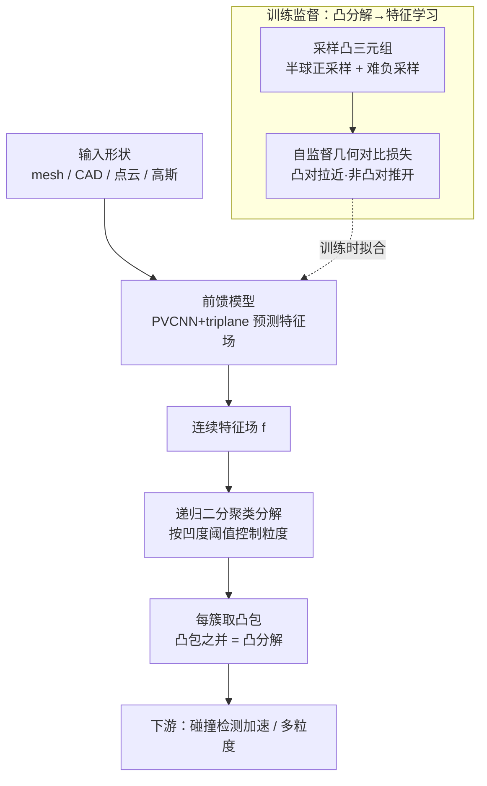

# Learning Convex Decomposition via Feature Fields

**会议**: CVPR 2026  
**论文**: [CVF Open Access](https://openaccess.thecvf.com/content/CVPR2026/html/Yang_Learning_Convex_Decomposition_via_Feature_Fields_CVPR_2026_paper.html)  
**代码**: 无（项目页 <https://research.nvidia.com/labs/sil/projects/learning-convex-decomp/>）  
**领域**: 3D视觉  
**关键词**: 凸分解, 特征场, 自监督对比学习, 三维形状, 物理仿真加速

## 一句话总结
把"把 3D 形状分解成若干凸体"这个 NP-hard 的组合搜索问题，重述成"在形状表面学一个连续特征场、再聚类"的特征学习问题，并设计了一个源自凸性几何定义的自监督对比损失，从而训出**首个前馈、开放世界**的凸分解模型，在凹度与重建误差上全面超越 V-HACD / CoACD 等经典方法，且能直接泛化到 mesh、CAD、点云、3D 高斯。

## 研究背景与动机
**领域现状**：凸分解（convex decomposition）是把复杂的非凸 3D 形状用一组凸体近似覆盖，是物理仿真里碰撞检测、有符号距离计算、动画绑定等环节的关键几何加速结构。传统做法分两派：计算几何派（V-HACD、CoACD）用分支定界 / 启发式在"所有可能切分"的空间里搜索，使凹度低于阈值；学习派（BSP-Net、Cvx-Net）用一组固定半平面、靠重建目标自监督地拼出形状。

**现有痛点**：经典搜索派的搜索空间是对所有 partition 的组合枚举，即便加上轴对齐切割、体素化等近似仍然很慢，而且轴对齐假设会把倾斜的凸区域切碎（如蟹壳被切成一堆不必要的小块）。学习派则被"重建目标"卡死了上限——固定半平面 + reconstruction loss 在 ShapeNet 这种窄类目数据上还行，但放到开放世界（Objaverse 这种拓扑/几何剧烈变化的数据）就泛化崩塌。此外过去几乎只针对 mesh，而如今几何越来越多来自 3D 高斯、扫描这类不精确表示。

**核心矛盾**：凸分解本质是 NP-hard 的组合覆盖问题。直接在离散的"切分集合"上优化既难又不可扩展；而学习派为了可微，用"重建形状"当代理目标，但**重建好 ≠ 分得凸**，代理目标本身偏离了"凸"这个真正的诉求。

**本文目标**：要训出一个能直接前馈输出高质量凸分解、且能在开放世界数据上自监督学习、还能跨模态泛化的模型，需要一个既贴合凸性本质、又对大规模随机优化友好的连续目标。

**切入角度**：作者回到凸性的经典几何定义——"形状是凸的，当且仅当任意两点连线都落在形状内部"。由此可以判定任意一对表面点是不是"凸对"（connecting line 不穿出形状）。一个好分解，应该让尽量多的凸对落进同一个分量。

**核心 idea**：不直接学/优化离散的凸体集合，而是在形状表面学一个**连续特征场**，让"凸对"在特征空间里靠得近、"非凸对"被推开；这样凸分解就 relax 成一个特征 embedding 问题，再用现成聚类把特征切开、取每簇凸包即得分解。

## 方法详解

### 整体框架
输入是从形状表面采样的点云，模型前馈预测一个定义在整个物体上的连续特征场 $f:\mathcal{M}\to\mathbb{R}^k$；训练时这个特征场用源自凸性定义的自监督几何对比损失来拟合，推理时对特征聚类把形状切成若干分量，每个分量取凸包，凸包之并即为凸分解。整条 pipeline 把一个组合优化问题拆成"学特征 → 聚类 → 取凸包"三段，关键在于中间的特征既来自纯几何监督（无需任何人工标注的"最优分解"），又能被前馈模型在 34 万形状上学出来，从而获得开放世界泛化与跨模态能力。

### 关键设计

**1. 把凸分解重述为特征学习：用"凸对同簇"代替"组合切分"**

痛点是直接在离散 partition 上最大化"同簇凸对数"是 NP-hard 的组合问题。作者先形式化这个目标：定义凸对集合 $\mathrm{ConvexPairs}(\mathcal{M})=\{(x,y):\lambda x+(1-\lambda)y\in\mathrm{Vol}(\mathcal{M}),\forall\lambda\in[0,1]\}$，好分解应最大化落进同一分量的凸对数量

$$\max_{\{S_i\}}\iint_{x,y\in\mathrm{ConvexPairs}(\mathcal{M})}\mathbf{1}_{G(x)=G(y)}\,dx\,dy$$

其中 $G$ 是把表面点映到所属分量的分配函数。直接优化它是不可解的组合划分，于是作者把"硬分配"松弛成"连续特征距离"：学一个特征场 $f$，让凸对的特征距离 $d(f_x,f_y)$ 小。但只拉近会塌缩到 $f\equiv$ 常数，所以再加一项把非凸对推开

$$\min_f\iint_{x,y\in\mathrm{ConvexPairs}}d(f_x,f_y)-\iint_{x,y\notin\mathrm{ConvexPairs}}d(f_x,f_y),\quad\|f\|=1$$

这一步是全文枢纽：组合搜索 → 连续 embedding，从此可微、可随机优化、可被前馈网络学习。和学习派旧方法的本质区别在于，监督信号直接来自"凸性"本身（凸对/非凸对由射线测试判定），而不是"重建形状"这个偏离目标的代理。

**2. 自监督几何对比损失 + 凸三元组采样：让监督既贴合凸性又高效**

上面的 embedding 目标虽然 well-posed，但作者改写成相对对比（contrastive）形式，更适合高维随机优化、且不强加度量结构。具体收集三元组 $(x,p,n)$：$x,p$ 构成正（凸）对、$x,n$ 构成负（非凸）对，要求正对距离小于负对距离，损失为对数归一化的平衡式

$$\mathcal{L}_{cc}=-\tfrac12\Big[\log\tfrac{\mathrm{sim}(f_x,f_p)}{\mathrm{sim}(f_x,f_p)+\mathrm{sim}(f_x,f_n)}+\log\tfrac{\mathrm{sim}(f_p,f_x)}{\mathrm{sim}(f_p,f_x)+\mathrm{sim}(f_p,f_n)}\Big]$$

其中相似度取球面归一化特征的指数余弦 $\mathrm{sim}(x,y)=\exp(x\cdot y/\tau)$，$\tau$ 是类 softmax 温度。

采样是这一设计的另一半精髓，也是后面消融证明有效的两处：① **半球正采样**——给定锚点 $x$，沿其表面法向的反方向（指向形状内部）的半球随机投射射线，取射线穿出表面的点作为 $p$，这样几乎一定是真凸对，省去大量拒绝采样；② **难负采样**——负样本 $n$ 用拒绝采样在表面生成并测试 $x\!-\!n$ 连线是否穿出形状，但**偏好空间上靠近 $x$ 的点**，按 $P(n)\propto1/\|n-x\|^2$ 采样。靠得近却非凸的对是最难、信息量最大的样本，能显著提升优化效率。这些几何查询只需采点和投射射线，可用 Embree / OptiX 硬件加速，支持训练时即时生成三元组。

**3. 前馈模型（PVCNN + triplane）：把单形状优化升级成开放世界泛化**

上面的损失其实可以直接对单个形状优化特征场就得到分解，但作者更进一步训一个前馈网络在 34 万形状上自监督学习。痛点是单形状优化每来一个新形状都要现优化，且要求 watertight mesh、对噪声/缺失敏感。前馈模型带来三个好处：(a) 快速推理；(b) 特征场更平滑、对噪声和不完整几何更鲁棒；(c) 跨模态泛化——推理时可直接吃 mesh、CAD、点云、3D 高斯而无需水密网格。架构上输入是表面采样点云：先用 PVCNN 编码器提取逐点特征，正交投影到三个轴对齐 2D 平面（均值规约）形成初始 triplane，经 2D CNN 下采样、reshape 后过 transformer、再转置 CNN 上采样得到最终 triplane；任意 3D 查询点的特征由对应 triplane 聚合得到。正是第 1 点把任务重述成特征学习、第 2 点提供纯几何自监督，才让"无最优分解标注也能在大规模开放世界数据上训"成为可能。

**4. 递归二分聚类分解：用凹度阈值在同一特征场上自由控制粒度**

推理时特征场已经把"该在一起的表面区域"在特征空间聚到一起，但聚成几类没有显然答案。作者用分治：维护一个按凹度排序的最大堆，每次取出凹度最高的分量，若其凹度已低于用户阈值 $\varepsilon$ 就收作结果，否则二分聚类成两块再各自递归，直到所有分量达标或到达上限组件数 $K$（见 Algorithm 1）。mesh 输入按面采特征、用带连通性的层次聚类；点云等模态则混合特征距离与欧氏距离做 k-means。关键好处是**粒度只在后处理时设定**——同一套学好的特征可以输出任意粒度的分解，调高阈值得到少而粗的分量、调低得到多而细的分量，无需重训。

### 损失函数 / 训练策略
唯一训练目标就是上面的对比损失 $\mathcal{L}_{cc}$，球面归一化约束 $\|f\|=1$ 防止特征无界增长。训练数据为 Objaverse 过滤后约 34 万形状，归一化到 $[-1,1]^3$、每形状采 10 万点输入；每形状生成 1 万个三元组，每个三元组取 64 正样本、512 负样本。特征维度 448，triplane 分辨率 $512\times512\times128$ 通道，transformer 6 层；在 8 张 A100 上训 60 万步约一周，batch size 每卡 2。推理时生成特征约 5s、递归分解约 13s。

## 实验关键数据

### 主实验
在 V-HACD（61 个模型）、PartObjaverse-Tiny（200 个）、ShapeNet（13 类抽 900 个）三个数据集上，按凹度（concavity，分量与其凸包的表面/体积 Chamfer 距离最大值）和重建误差（输入形状与所有凸包之并的 Chamfer 距离）评测，**越低越好**，且在相近组件数下比较。

| 方法 | VHACD 凹度↓ | VHACD 重建↓ | PartObj 凹度↓ | ShapeNet 凹度↓ |
|------|------------|-------------|---------------|----------------|
| V-HACD | 0.1176 | 0.0213 | 0.1800 | 0.1155 |
| CoACD | 0.1095 | 0.0321 | 0.1388 | 0.0746 |
| BSP-Net (ShapeNet) | 0.2249 | 0.1227 | 0.2593 | 0.2107 |
| BSP-Net (Objaverse) | 0.1857 | 0.0297 | 0.1964 | 0.1592 |
| Cvx-Net (Objaverse) | 0.2880 | 0.0373 | 0.2970 | 0.2191 |
| **本文** | **0.0973** | **0.0180** | **0.1257** | **0.0656** |

在三个数据集上，相近甚至更少的组件数下，本文凹度和重建误差都全面最低。经典方法因轴对齐切割假设会把倾斜凸区域切碎（蟹壳）、本文则更好地保留大凸结构（潜艇）、分开相邻凸部件（大象）、在少量组件下也表现好（飞机）；学习派 Cvx/BSP 即便用更多凸体、即便换到 Objaverse 训练，重建仍远不理想，说明它们扩展不到开放世界。

### 消融实验
在 V-HACD 与 Objaverse-Tiny 上逐项移除组件（凹度/重建，越低越好）：

| 配置 | VHACD 凹度 | VHACD 重建 | Obj 凹度 | 说明 |
|------|-----------|-----------|----------|------|
| − 难负采样 | 0.0993 | 0.0186 | 0.1293 | 去掉 hard-negative |
| − 半球正采样 | 0.0999 | 0.0219 | 0.1286 | 去掉 hemisphere 正采样 |
| − 递归聚类 | 0.1292 | 0.0191 | 0.1375 | 换成平铺聚类 |
| 单形状优化 | 0.1134 | 0.0198 | 0.1300 | 不用前馈、逐形状优化 |
| **完整模型** | **0.0973** | **0.0180** | **0.1257** | — |

### 关键发现
- **递归二分聚类贡献最大**：去掉后 VHACD 凹度从 0.0973 涨到 0.1292（最大退化），说明"按凹度优先级分治"比平铺聚类显著更优，且是粒度可控的关键。
- **前馈模型优于单形状优化**：单形状优化凹度 0.1134 明显高于完整 0.0973，前馈不仅快，还因特征更平滑而质量更好——反直觉地，学一个泛化模型比逐形状专门优化还好。
- **两种采样策略都有用**：去掉难负或半球正采样都会让凹度/重建变差，难负采样对"分开相邻凸部件"尤其重要。
- **凸感知特征 ≠ 语义分割特征**：把递归算法套到 3D 分割模型 PartField 的特征上，因其特征反映语义结构（L 形面几乎全红、特征均匀），凸分解质量差；本文特征是凸感知的。
- **下游加速实测**：用本文凸分解在 Newton 引擎做碰撞检测，仿真单步 8ms vs 直接用原 mesh 的 40ms，约 5× 加速。

## 亮点与洞察
- **把 NP-hard 组合问题 relax 成特征 embedding** 是最漂亮的一招：凸性的经典几何定义（连线在内部）→ 凸对/非凸对 → 对比学习，一条逻辑链把"分得凸"直接写进损失，绕开了学习派"重建当代理"的根本缺陷。
- **纯几何自监督，零分解标注**：凸对由射线测试判定，监督信号完全来自形状几何本身，这正是它能在 34 万开放世界形状上 scale、并跨模态泛化的根因。
- **难负采样按 $1/\|n-x\|^2$ 偏好近邻**：把"对比学习里 hard negative"的通用 trick 落到几何上——空间靠近却非凸的点对最有信息量，这个 insight 可迁移到任何"形状/表面对比学习"任务。
- **粒度后处理可调**：同一特征场配不同凹度阈值即得不同粗细的分解，无需重训，对实际内容生产（按需 LOD）很实用。

## 局限与展望
- 作者承认：模型在干净的物体级数据上训练，不一定泛化到场景级或高度残缺的几何；对细薄结构（如风扇骨架）也会失效。改进路线是在场景数据和注入噪声的数据上训练。
- 自己发现的局限：凹度评测沿用 CoACD 的定义并以"相近组件数"对齐比较，但不同方法在不同组件数下的曲线形状可能不同，单点对比需谨慎；前馈模型一周 8×A100 的训练成本不低，复现门槛高（且未开源代码）。
- 展望：作者提出可进一步学习"语义感知 / 适配物体可能运动"的凸代理，把凸分解从纯几何推向带语义/动力学先验的方向。

## 相关工作与启发
- **vs V-HACD / CoACD（经典搜索派）**：它们在 partition 空间搜索并用凹度阈值剪枝，受轴对齐切割/体素化拖累而慢、会切碎倾斜凸区；本文前馈一次出结果（特征 5s + 分解 13s），质量更高且不靠轴对齐假设。
- **vs BSP-Net / Cvx-Net（学习派）**：它们用固定半平面 + 重建目标自监督，重建好 ≠ 分得凸，开放世界泛化崩塌；本文把监督换成源自凸性定义的对比损失，直接对齐"凸"这个目标，因而能 scale 到 Objaverse 并跨模态。
- **vs PartField（3D 分割）**：分割特征反映语义、对凸划分不合适；本文特征是凸感知的，说明"该不该在同一凸体"和"是不是同一语义部件"是两件不同的事，给同类几何任务一个清晰的区分。

## 评分
- 新颖性: ⭐⭐⭐⭐⭐ 把凸分解重述为特征学习、用凸性几何定义构造自监督对比损失，首个前馈开放世界凸分解模型，formulation 层面的真创新。
- 实验充分度: ⭐⭐⭐⭐ 三数据集对比 + 四项消融 + 跨模态/碰撞加速展示，较充分；但凹度对齐组件数的横向比较略粗，缺更细的曲线级统计。
- 写作质量: ⭐⭐⭐⭐⭐ 逻辑链清晰，从凸性定义一路推到对比损失与前馈模型，图示到位。
- 价值: ⭐⭐⭐⭐⭐ 物理仿真/机器人/生成资产对凸分解需求强烈，5× 碰撞加速 + 跨模态泛化实用性高。

<!-- RELATED:START -->

## 相关论文

- [\[CVPR 2026\] From Feature Learning to Spectral Basis Learning: A Unifying and Flexible Framework for Efficient and Robust Shape Matching](from_feature_learning_to_spectral_basis_learning_a_unifying_and_flexible_framewo.md)
- [\[ICML 2026\] Convex Distance Operator Transport: A Convex and Geometry-Preserving Formulation](../../ICML2026/3d_vision/convex_distance_operator_transport_a_convex_and_geometry-preserving_formulation.md)
- [\[CVPR 2026\] QuadSync: Quadrifocal Tensor Synchronization via Tucker Decomposition](quadsync_quadrifocal_tensor_synchronization_via_tucker_decomposition.md)
- [\[CVPR 2026\] LuxRemix: Lighting Decomposition and Remixing for Indoor Scenes](luxremix_lighting_decomposition_and_remixing_for_indoor_scenes.md)
- [\[ECCV 2024\] SlotLifter: Slot-guided Feature Lifting for Learning Object-centric Radiance Fields](../../ECCV2024/3d_vision/slotlifter_slot-guided_feature_lifting_for_learning_object-centric_radiance_fiel.md)

<!-- RELATED:END -->
