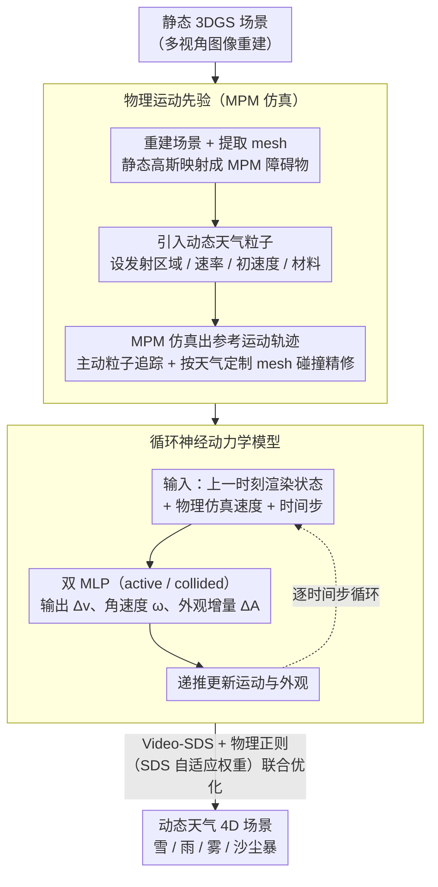

# Let it Snow! Animating 3D Gaussian Scenes with Dynamic Weather Effects via Physics-Guided Score Distillation

**会议**: CVPR2026  
**arXiv**: [2504.05296](https://arxiv.org/abs/2504.05296)  
**代码**: [项目主页](https://galfiebelman.github.io/let-it-snow/)  
**领域**: 3D视觉  
**关键词**: 3D Gaussian Splatting, 动态场景编辑, 天气效果, 物理仿真, Score Distillation Sampling, MPM

## 一句话总结

提出 Physics-Guided Score Distillation 框架，利用物理仿真（MPM）作为运动先验引导 Video-SDS 优化，在静态 3DGS 场景中生成具有物理合理运动和真实感外观的动态天气效果（降雪、降雨、雾、沙尘暴）。

## 研究背景与动机

**静态场景动态编辑需求大**：3D Gaussian Splatting 已能高效重建静态场景，但向其中添加时间维度的动态效果（如天气）仍是手工操作，门槛高。

**静态编辑方法无法建模时间演化**：ClimateNeRF、GaussCtrl 等只能做静态外观修改，无法表达持续的粒子发射与累积过程。

**物理仿真缺乏真实感外观**：PhysGaussian、PAC-NeRF 等基于物理的方法能提供合理运动，但无法为新引入的动态元素合成逼真外观。

**数据驱动 4D 生成运动不可控**：DreamGaussian4D、Animate124 等依赖扩散模型生成运动，在需要连续粒子发射的复杂多粒子场景中运动不连贯。

**运动和外观的根本矛盾**：物理仿真给出强运动先验但不够真实，Video-SDS 能生成真实感外观但无法独立学习复杂运动——两者需要统一。

**现有 4D 编辑方法作用于固定高斯集合**：不支持天气效果所需的粒子持续发射、累积和移除机制。

## 方法详解

### 整体框架

这篇论文要解决的是：在已经重建好的静态 3DGS 场景里，添加降雪、降雨、雾、沙尘暴这类需要粒子持续发射和累积的动态天气效果，且既要运动物理合理、又要外观真实。难点在于物理仿真能给出合理运动却不够逼真，视频扩散（Video-SDS）能生成真实外观却学不会复杂的多粒子运动——二者各有一半。

本文的做法是把两者串成两阶段：先用 Material Point Method（MPM）物理仿真把动态粒子的参考运动轨迹算出来当先验，再训练一个循环神经动力学模型，通过 Physics-Guided Score Distillation 在这个先验的"软约束"下联合优化运动和外观。

### 关键设计

**1. 物理运动先验：用 MPM 仿真给天气粒子一条物理合理的运动轨迹**

Video-SDS 单独无法学会"粒子从哪发射、怎么下落、如何堆积"这类持续多粒子运动，因此先用物理仿真把运动骨架定下来。具体是先对静态场景做 3DGS 重建并提取 mesh，把静态高斯映射成 MPM 粒子当作障碍物；再引入动态粒子（设定发射区域、速率、初速度、材料属性），用 MPM 仿真出运动轨迹。为支撑大规模粒子，设计了主动粒子追踪——粒子静止或出界后自动从仿真中移除。针对 MPM 粗网格表达碰撞不足，还按天气定制了 mesh 碰撞精修：雪投影到表面并插值附近高斯实现自然堆积，雨用 3D 湿度网格追踪水分、带高斯平滑与时间衰减，沙尘沿法线位移并各向异性缩放。

**2. 循环神经动力学模型：在物理先验之上联合修正运动与外观**

物理轨迹解决了"动得合不合理"，但新引入的粒子还没有真实外观，仿真轨迹与扩散模型期望的画面之间也需要弥合。该模型以上一时刻的渲染状态（位置、旋转、外观）、物理仿真速度和时间步为输入，为 active 和 collided 两种物理状态分别配一个 MLP（位置/速度用 Fourier 特征编码、时间用正弦编码），输出速度修正 $\Delta\mathbf{v}$、角速度 $\boldsymbol{\omega}$ 和外观增量 $\Delta\mathcal{A}$；运动按 $\mathbf{v}_g(t)=\mathbf{v}_g^{\text{init}}(t)+\Delta\mathbf{v}_g$、$\mathbf{x}_g(t)=\mathbf{x}_g(t{-}1)+\mathbf{v}_g(t)$ 递推更新，外观参数则由 LLM 依据天气文本描述初始化。这样物理先验只作为可被网络微调的"软约束"，既保住运动合理性，又让 Video-SDS 能把外观推向真实。

### 损失函数 / 训练策略

总损失为

$$\mathcal{L}_{\text{total}} = \mathcal{L}_{\text{Video-SDS}} + \lambda_{\text{xyz}}\mathcal{L}_{\text{xyz}} + \lambda_{\text{vel}}\mathcal{L}_{\text{vel}} + \lambda_{\text{rot}}\mathcal{L}_{\text{rot}} + \lambda_{\text{app}}\mathcal{L}_{\text{app}}$$

其中 Video-SDS 损失借文本-视频扩散模型提供真实感监督；$\mathcal{L}_{\text{xyz}}$、$\mathcal{L}_{\text{vel}}$ 分别把学习到的轨迹、速度用 L2 拉向仿真值，$\mathcal{L}_{\text{rot}}$ 用四元数角距离防旋转漂移，$\mathcal{L}_{\text{app}}$ 惩罚过大的外观增量以抑制循环累积误差。关键的一招是 SDS 自适应权重：所有正则项权重都乘上 $|\mathcal{L}_{\text{Video-SDS}}|$ 动态缩放——扩散模型不确定时加强物理引导，确信时放松约束，免去手工调参。

## 实验

### 实验设置

- **数据集**：MipNeRF 360 (Garden, Bicycle, Stump) + Tanks and Temples (Playground, Truck)，共 5 个场景
- **天气效果**：降雪、降雨、雾、沙尘暴 + 创意文本变体（紫色雪、闪光黄沙、魔法粒子）
- **评估指标**：CLIP_Sim、CLIP_Dir、VQAScore、ViCLIP-T、VE-Bench

### 与基线对比 (Table 1)

| 方法 | CLIP_Sim↑ | CLIP_Dir↑ | VQAScore↑ | ViCLIP-T↑ | VE-Bench↑ |
|------|-----------|-----------|-----------|-----------|-----------|
| ClimateNeRF (F+S) | 0.23 | 0.07 | 0.87 | 0.15 | 0.28 |
| GaussCtrl (F+S) | 0.25 | 0.08 | 0.71 | 0.16 | 0.24 |
| **Ours (F+S)** | **0.29** | **0.12** | **0.92** | **0.20** | **0.45** |
| GaussCtrl (All) | 0.24 | 0.07 | 0.64 | 0.15 | 0.21 |
| **Ours (All)** | **0.28** | **0.11** | **0.89** | **0.19** | **0.41** |

在所有图像和视频指标上全面超越静态编辑方法，VE-Bench 提升尤为显著（+61%）。

### 消融实验 (Table 2)

| 变体 | CLIP_Sim | CLIP_Dir | VQAScore | ViCLIP-T | VE-Bench |
|------|----------|----------|----------|----------|----------|
| w/o 碰撞处理 | 0.24 | 0.10 | 0.83 | 0.16 | 0.34 |
| w/o 外观优化 | 0.25 | 0.10 | 0.82 | 0.16 | 0.37 |
| w/o 运动仿真 | 0.18 | 0.03 | 0.35 | 0.08 | 0.13 |
| w/o 物理引导 | 0.26 | 0.10 | 0.85 | 0.17 | 0.37 |
| **完整方法** | **0.28** | **0.11** | **0.89** | **0.19** | **0.41** |

### 关键发现

- **去掉运动仿真 (w/o Motion) 退化最严重**：Video-SDS 单独无法学习多粒子连续发射的物理运动，VQAScore 从 0.89 降至 0.35
- **物理引导是联合优化的关键**：固定物理运动不做联合优化 (w/o PG) 也会阻碍 Video-SDS 外观优化
- **碰撞处理不可或缺**：去掉后粒子悬浮于表面上方，无法实现自然堆积
- **SDS 自适应权重优于固定权重**：固定权重无论大小都有问题——太小产生噪声伪影，太大过约束阻碍外观精修
- 与 4D 编辑基线 Instruct-4DGS 对比，后者缺乏物理先验导致运动不连贯（VQAScore 0.57 vs 0.89）

## 亮点

- **核心洞察优雅**：物理仿真作为"可软约束的运动先验"而非"硬约束"，完美调和了物理合理性与视觉真实感的矛盾
- **SDS 自适应权重**：根据扩散模型不确定度动态调节物理约束强度，免去繁琐的权重调参
- **通用天气框架**：同一框架支持雪/雨/雾/沙尘暴四种截然不同的天气效果，还能响应创意文本提示
- **完整的消融体系**：对碰撞处理、运动/外观优化、物理引导、自适应权重、各正则项逐一消融，论证充分

## 局限性

- **无双向交互**：动态粒子不会引起静态场景元素的形变或运动
- **静态高斯外观不更新**：不会反映天气带来的环境光照/阴影变化
- **轨迹漂移阈值**：若优化轨迹偏离物理先验过远，引导速度信号变得不可靠
- **依赖 MPM 仿真质量**：物理先验的好坏直接影响最终效果
- **计算开销**：MPM 仿真 + Video-SDS 优化的双阶段流程较重

## 相关工作

- **静态 3D 编辑**：ClimateNeRF (ICCV'23) 添加静态天气效果但无时间动态；GaussCtrl (ECCV'24) 文本引导编辑高斯但限于外观修改
- **物理驱动动画**：PhysGaussian (CVPR'24) 用 MPM 驱动已有场景元素运动但无法合成新元素外观；RainyGS 专注降雨但不能泛化到其他天气
- **4D 生成/编辑**：Gaussians2Life、Instruct-4DGS 等基于 Score Distillation 做 4D 编辑，但在多粒子连续发射场景中运动不可控
- **本文定位**：首次将物理仿真先验与 Video-SDS 统一到同一优化框架，填补了"动态天气场景编辑"这一空白

## 评分

- 新颖性: ⭐⭐⭐⭐ — 物理先验引导 SDS 的统一框架思路新颖，SDS 自适应权重设计巧妙
- 实验充分度: ⭐⭐⭐⭐⭐ — 5 场景 × 4 天气 × 多视角，消融极为详尽（碰撞、运动、外观、物理引导、自适应权重、各正则项、轨迹漂移）
- 写作质量: ⭐⭐⭐⭐ — 结构清晰，图表配合好，问题动机阐述到位
- 价值: ⭐⭐⭐⭐ — 为 3DGS 动态编辑开辟新方向，框架可扩展到更多动态效果场景

<!-- RELATED:START -->

## 相关论文

- [\[CVPR 2026\] GaussianFluent: Gaussian Simulation for Dynamic Scenes with Mixed Materials](gaussianfluent_gaussian_simulation_for_dynamic_scenes_with_mixed_materials.md)
- [\[CVPR 2026\] Write Where It Matters: Policy-Guided Watermarks for 3D Gaussian Splatting](write_where_it_matters_policy-guided_watermarks_for_3d_gaussian_splatting.md)
- [\[ICCV 2025\] Stable Score Distillation](../../ICCV2025/3d_vision/stable_score_distillation.md)
- [\[CVPR 2026\] RAP: Fast Feedforward Rendering-Free Attribute-Guided Primitive Importance Score Prediction for Efficient 3D Gaussian Splatting Processing](rap_fast_feedforward_rendering-free_attribute-guided_primitive_importance_score_.md)
- [\[CVPR 2026\] PhysHO: Physics-Based Dynamic 3D Gaussian Human and Object from Monocular Video](physho_physics-based_dynamic_3d_gaussian_human_and_object_from_monocular_video.md)

<!-- RELATED:END -->
