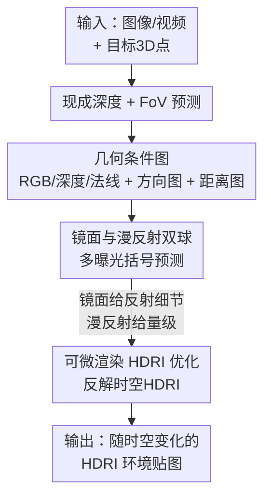

# Lighting in Motion: Spatiotemporal HDR Lighting Estimation

**会议**: CVPR 2026  
**论文**: [CVF Open Access](https://openaccess.thecvf.com/content/CVPR2026/html/Bolduc_Lighting_in_Motion_Spatiotemporal_HDR_Lighting_Estimation_CVPR_2026_paper.html)  
**代码**: 待确认  
**领域**: 3D视觉 / 逆向渲染 / 计算摄影  
**关键词**: HDR光照估计, 时空光照, 扩散模型, 光探针, 可微渲染

## 一句话总结
LIMO 把单张图像/视频里某个 3D 点的光照估计，转化为"用扩散模型在该点 inpaint 出不同曝光的镜面球和漫反射球"，再用可微渲染把这堆球融成一张 HDRI，从而同时做到空间定位准、随时间变化、全 HDR 量级准确、室内外通用、反射细节真实——五个能力首次在一个框架里全占齐。

## 研究背景与动机
**领域现状**：往图像里插入虚拟物体（影视合成、AR）要想看起来"贴得进去"，必须给物体配上和场景一致的光照。传统做法是物理摆放光探针（mirror/diffuse 球）拍 HDR 照片，得到 HDRI 环境贴图喂给渲染管线。光照估计就是想让计算机从一张图自动恢复这种 HDRI。

**现有痛点**：作者把"一个真正通用的光照估计方法"拆成五条能力——(1) 能 grounding 到场景里**指定 3D 位置**（光照随位置/遮挡而变）；(2) 能随**时间**变化（相机移动揭出新光源、物体移动造成遮挡、灯光本身在变）；(3) 预测**准确的 HDR 量级**（既要大面积间接光，也要亮上几个数量级的集中光源）；(4) **室内近场光 + 室外远场光**都能估；(5) 生成**既有高频细节又有低频方向性**的合理光照分布。已有方法各只占其中一小撮（见表 1）：单图/单视频出一个全局光照的、只管室内或只管室外的、做空间变化但缺时间维度的；近期做时空变化的（如 4D Lighting [42]）又在"把预测准确锚定到局部场景上下文"这件事上吃力。

**核心矛盾**：高频反射真实度 与 HDR 量级准确度 这两件事在表征上是冲突的。镜面球能给出漂亮的反射细节，但集中光源的亮度只落在极少数像素上，要靠很多档曝光才能估准；而把光照锚定到具体 3D 位置，仅靠深度图根本不够——深度相同、但相对场景元素的方向/距离不同，光照可以天差地别。

**本文目标**：在一个框架里同时满足上述五条能力，输出可直接喂进现成合成管线的显式 HDRI。

**切入角度**：与其回归一张抽象的光照表征，不如让强大的图像/视频扩散先验去"**在指定 3D 点画出一颗球该长什么样**"——这正是预训练扩散模型擅长的 inpainting/生成任务；再把不同曝光、不同材质的球**反解**成一张物理 HDRI。

**核心 idea**：用扩散模型在场景指定 3D 位置 inpaint 出"多曝光 × 镜面/漫反射"的球阵，配上专门设计的几何条件图做精确空间锚定，最后用可微渲染把这堆球融成一张时空 HDRI。

## 方法详解

### 整体框架
LIMO 的输入是一张图像（或一段视频）外加场景里一串目标 3D 点；输出是这些点上随时间变化的 HDRI 环境贴图。整条管线分三步串起来：

1. **条件图计算**：先用现成深度预测器 [5] 拿到逐像素深度，再用现成 FoV 估计器 [44] 拿到相机视场角，由此算出一组喂给扩散模型的条件图——RGB 图（球的区域涂黑防止背景渗入）、深度图、球的法线图，以及两张本文新提出的几何图（方向图 $I_{dir}$、距离图 $I_{dist}$），用来把"场景表面"和"球的位置"关联起来。
2. **多曝光球预测**：把这些条件图拼到输入噪声上，喂进一个被微调过的扩散模型；用文本提示词指定"画哪种球 + 哪档曝光"（形如 `"Diffuse sphere [EV0]"`），模型就在目标 3D 点 inpaint 出对应的球。反复查询 `{镜面, 漫反射} × {EV 0,-3,-6,-9,-12}` 这些组合，得到一摞曝光括号球。
3. **HDRI 优化重建**：用可微渲染，把这摞球当作"在某 HDRI 光照下渲染出来的观测"，反解出能同时解释所有曝光/材质/帧的那张 HDRI，并加时序约束保证视频帧间一致。

> 图中 `几何条件图`、`镜面与漫反射双球` 与 `可微渲染 HDRI 优化` 三个贡献节点，正对应下面三个关键设计；`深度+FoV 预测` 是现成脚手架，不单列设计。

### 关键设计

**1. 几何条件图：让深度之外的"相对位置"把光照锚到具体 3D 点**

最棘手的痛点是空间 grounding：同一个像素深度下，球被推到场景深处（从阴影进到阳光直射）时，光照应当剧变，但只给深度做条件的话，网络画出来的两颗球几乎一模一样（图 6）。作者据此论证"仅靠深度不足以锚定"，引入两张新几何图。对图中像素 $i$，定义它到球心的方向 $I_{dir,i}$ 和距离 $I_{dist,i}$：

$$I_{dir,i} = \begin{cases} \dfrac{p_i - c}{\lVert p_i - c\rVert}, & \text{不在球面上} \\ v_i - 2(v_i \cdot n_i)\,n_i, & \text{在球面上} \end{cases}, \qquad I_{dist,i} = \lVert p_i - c\rVert$$

其中 $p_i$ 是像素的世界坐标（由深度和视线方向 $v_i$、相机 FoV 算出），$c$ 是球心坐标。对球面上的像素用反射光线方向（由球面法线 $n_i$ 和视线 $v_i$ 算出）。直觉上，这张方向图让模型把"球面上某像素的反射方向"和"场景里位于球心同一方向上的点"对应起来，从而知道这个方向的入射光来自场景哪块。距离图 $I_{dist}$ 做 log 归一化。所有图 $\{I_{rgb}, I_n, I_d, I_{dir}, I_{dist}\}$ 各自用预训练 VAE 编码到 latent、再按通道拼接；去噪网络的 patch embedding 卷积通过"复制初始权重并按新增通道数除一下"来扩展输入通道。消融里去掉几何图，掉点比去掉漫反射球还狠（见表 4），坐实了它对空间锚定的关键作用。

**2. 镜面 + 漫反射双球、离散多曝光：分工解决"细节真实"与"量级准确"的两难**

只用镜面球（如 [6,31]）的问题在于：集中光源的能量只落在极少像素上，要估准就得很多档曝光 [38]。LIMO 同时预测**漫反射球**——漫反射表面把集中光源的能量积分到中等曝光级，使少量曝光档就能把亮度估准 [10]；镜面球则继续负责高频反射细节。曝光维度上，作者不像 [31,42] 那样在两个极端曝光间插值，而是把 EV 当**离散文本提示**喂给预训练文本编码器（借鉴 [3]），实测离散 EV 集 $\{0,-3,-6,-9,-12\}$ 能让 EV 预测更准；训练时把对应 EV 的目标球作为监督，球外区域保持原始 EV0。再加一个"画镜面还是漫反射"的文本条件，提示词形如 `"{sphere type} [EV{value}]"`。消融显示去掉漫反射球后**颜色（角度误差）明显变差**，说明漫反射球主要在帮忙把动态范围/色彩估准。

**3. 可微渲染的时空 HDRI 优化：把一摞球反解成一张物理一致、时序稳定的 HDRI**

有了"镜面/漫反射 × 多曝光 × 多帧"的一堆球预测后，怎么融成一张 HDRI？作者定义渲染函数 $R(L_t, m)$——在 HDRI 光照 $L_t$ 下、材质 $m \in \{\text{mirror}, \text{diffuse}\}$、第 $t$ 帧渲染出一颗球，然后求解

$$\arg\min_{L} \sum_{t\in T}\sum_{e\in E}\sum_{m\in M} \ell\big(\mu(e,m,t) - e\,R(L_t, m)\big)$$

其中 $\mu(e,m,t)$ 是微调后扩散模型在第 $t$ 帧、曝光 $e$、材质 $m$ 下生成的球。损失 $\ell = \ell_2(\hat{y}_t, y_t) + \tfrac{\lambda}{2}\big(\ell_1(\hat{y}_t,\hat{y}_{t-1}) + \ell_1(\hat{y}_t,\hat{y}_{t+1})\big)$，第一项让渲染对上预测、后两项是相邻帧的时序平滑约束。$L$ 是一个时空 HDRI 体，初始化为常数灰（0.5），用 Adam 梯度下降优化。$R$ 在 PyTorch 里实现为反射/漫反射双模渲染器，带余弦与光源多重重要性采样；实际优化时每步随机在曝光/材质里抽一个组合（而非全求和），并用 Laplacian 金字塔 [18] 表示 $L$ 加速收敛。这一步是把"生成出来的外观观测"显式反演回物理光照，保证输出能直接进现成合成管线。

### 损失函数 / 训练策略
训练数据完全用合成：Blender [7] + BlenderKit [12] 资产程序化生成室内外场景，每次渲染摆一格球阵（互不可见、固定图像空间大小、随机深度）拿到多个训练样本，但训练/推理时网络一次只回归一颗球。球深度按 $d = d_{min} + (d_{max}-d_{min})u^{\gamma}$（$d_{min}{=}0.25, d_{max}{=}0.98, \gamma{=}0.4, u\sim U(0,1)$）采样，再乘球覆盖区最小深度得场景尺度深度。每颗球用完美镜面（roughness=0, metallic=1）和完美漫反射（roughness=1, metallic=0）两种材质渲染成 float16 EXR 保留 HDR。视频数据分三种动画场景：动态球位置、动态相机、动态光照（随机旋转 HDRI 方位角/改光强/转太阳光）。模型层面微调两个：图像模型用 Flux.1 Schnell [22]（12896 张图、512×512、150k 步），视频模型用 Wan2.2 5B [43]（30,096 段 21 帧序列、512×512、250k 步），均配色彩/曝光/退化增强，8×A100E 上分别训 50h 和 188h。

## 实验关键数据

### 主实验（单图，表 2）
在合成 Infinigen Indoor [32]、真实 Laval Indoor SV [17]、Laval Outdoor [21] 三套数据上，用四种测试球（镜面/漫反射/光泽/哑光）重打光后算指标，与 DiffusionLight [31]、4D Lighting [42] 对比。下表摘镜面/漫反射两材质的 RMSE↓、SI-RMSE↓、SSIM↑、角度误差↓：

| 数据集 | 方法 | RMSE(Mirr/Diff)↓ | SI-RMSE(Mirr/Diff)↓ | SSIM(Mirr/Diff)↑ | Ang.Err(Mirr/Diff)↓ |
|--------|------|------|------|------|------|
| Infinigen | DiffusionLight | 0.40 / 0.47 | 1.52 / 0.70 | 0.68 / 0.83 | 14.3 / 9.7 |
| Infinigen | 4D Lighting | 0.34 / 0.36 | 1.36 / 0.62 | 0.72 / 0.86 | 14.7 / 11.2 |
| Infinigen | **LIMO (image)** | **0.25 / 0.16** | **0.41 / 0.11** | **0.78 / 0.95** | **4.4 / 2.3** |
| Infinigen | LIMO (video) | 0.26 / 0.22 | 0.42 / 0.13 | 0.79 / 0.95 | 4.4 / 2.7 |
| Laval Indoor SV | 4D Lighting | 0.35 / 0.27 | 0.91 / 0.22 | 0.80 / 0.94 | 6.8 / 5.0 |
| Laval Indoor SV | **LIMO (image)** | **0.30 / 0.20** | **0.60 / 0.17** | **0.81 / 0.97** | **4.6 / 2.6** |
| Laval Outdoor | 4D Lighting | 0.37 / 0.25 | 0.69 / 0.12 | 0.77 / 0.97 | 7.4 / 2.9 |
| Laval Outdoor | **LIMO (image)** | **0.27 / 0.12** | **0.37 / 0.07** | **0.79 / 0.99** | **3.9 / 1.2** |

图像版 LIMO 在三套数据、几乎所有材质/指标上都最优，视频版紧随其后。作者把图像版略强归因于模型容量更大（12B vs 视频 5B）以及视频优化要兼顾时间一致性。角度误差从 4D Lighting 的 14.7（Infinigen 镜面）降到 4.4，是颜色重建上的大幅改善。

### 视频实验（表 3）
自建视频测试集（5 个增广的 Blender demo），四类场景：动态物体、动态相机、动态光照、组合。逐帧指标上图像版 LIMO 依旧领先、视频版第二；但三个时序指标（T-LPIPS↓、T-LPIPS-Diff↓、Warped Err↓）上视频版反超图像版：

| 场景 | 方法 | T-LPIPS-Diff(Mirr)↓ | Warped Err(Mirr)↓ | RMSE(Mirr)↓ |
|------|------|------|------|------|
| 动态物体 | 4D Lighting | 0.0418 | 0.0439 | 0.39 |
| 动态物体 | LIMO (image) | 0.0886 | 0.1887 | 0.28 |
| 动态物体 | **LIMO (video)** | **0.0227** | 0.0589 | 0.30 |
| 动态光照 | 4D Lighting | 0.0067 | 0.0158 | 0.39 |
| 动态光照 | **LIMO (video)** | **0.0065** | **0.0108** | 0.34 |

作者指出 T-LPIPS 本身有误导性（视频本就该有运动），故用 T-LPIPS-Diff（预测与 GT 的 T-LPIPS 之差）来衡量"该变多少有没有变够"——在镜面渲染上 4D Lighting 几乎不随场景变化（变化量不足），LIMO 视频版更贴近 GT。4D Lighting 在某些 Warped Err 上更低，作者归因于其 MLP 表征过度平滑，反而在需要"光照突变/不连续"的动态光照场景里被 LIMO 时序指标反超。

### 消融实验（表 4，Infinigen，图像模型）

| 配置 | RMSE(Diff)↓ | Ang.Err(Diff)↓ | 说明 |
|------|------|------|------|
| w/o Diffuse, Geo | 0.210 | 3.60 | 同时去掉漫反射球和几何图 |
| w/o Diffuse | 0.207 | 3.39 | 只去漫反射球 |
| w/o Geo | 0.229 | 3.13 | 只去几何图（RMSE 反而最差） |
| **LIMO (full)** | **0.160** | **2.25** | 完整模型 |

### 关键发现
- **几何图比漫反射球更关键**：单独去掉几何图（w/o Geo, RMSE 0.229）比单独去掉漫反射球（w/o Diffuse, 0.207）掉得更多，说明空间锚定的核心是新几何条件图。
- **一个反直觉现象**：同时去掉几何图 + 漫反射球（0.210）反而比只去几何图（0.229）略好。作者解释：漫反射球只在"几何信息被正确理解时"才帮得上忙——几何图缺失导致空间理解错乱时，漫反射球反而帮倒忙，所以两个一起去掉比单去几何图更"自洽"。
- **漫反射球主管颜色/量级**：去掉它后角度误差（颜色）明显变差，印证其作用是把动态范围和色彩估准。

## 亮点与洞察
- **把"光照估计"重述为"在指定点 inpaint 一颗球"**：巧妙借力图像/视频扩散先验擅长的生成/inpainting 能力，绕开了直接回归抽象光照表征的难题，还天然支持任意 3D 点查询。
- **几何条件图直击"深度不够"的盲点**：用"像素到球心的方向 + 距离"两张图，把"反射方向"与"场景同方向上的点"对齐，是让空间 grounding 真正生效的关键 trick，可迁移到任何需要把图像内容锚定到 3D 位置的条件生成任务。
- **镜面/漫反射分工 + 离散多曝光**：镜面管细节、漫反射管量级，离散 EV 当文本提示而非两端插值——这套"用不同物理表面分摊不同频段信息"的思路对 HDR 重建很有启发。
- **可微渲染做后端融合**：把一堆生成观测显式反演回物理 HDRI，既保住了生成的真实感，又保证输出能直接进生产级合成管线，兼顾了"学习"与"可控"。

## 局限与展望
- 作者承认：数据集里的球是有非零尺寸的 3D 物体渲染出来的，部分样本违反"方向性光照"假设（如阴影直接打在球上），使 HDRI 优化变成病态问题。
- LIMO 没被训练去利用某些光照线索（如视频里常见的人脸），未来可改用真正基于点的光照表征，并引入已知光照的人脸数据集。
- 自己观察：训练全靠合成数据（Blender），尽管在真实 Laval 数据上泛化不错，但合成-真实域差仍是潜在风险；视频版受限于 5B 模型容量，逐帧质量略逊图像版，是质量与时序一致性之间的现实折中。
- 推理需对"双材质 × 5 档曝光 × 多帧"反复查询扩散模型再做可微优化，计算开销不小，实时性是改进方向。

## 相关工作与启发
- **vs DiffusionLight [31]**: 它只用镜面球、且不适应球的 3D 位置，故空间变化场景得分明显偏低；LIMO 用双球 + 几何图做到了空间锚定与 HDR 量级双准。
- **vs 4D Lighting [42]**: 同样基于扩散生成多球，但它进一步用 NeRF 式隐式表征在视频上建统一表示，结果偏过度平滑、抓不住光照动态；LIMO 用每点独立 HDRI + 时序约束，时序指标（T-LPIPS-Diff）上"该变多少变多少"更贴 GT。
- **vs 仅用镜面球的方法 [6]**: LIMO 论证漫反射球对集中光源量级估计的不可替代性，是物理准确度提升的来源。
- **vs 基于扩散渲染的物体插入 [28,46,49]**: 那类方法直接学合成、绕开 HDR 估计，但缺乏传统 IBL 管线的艺术可控性；LIMO 坚持显式恢复 HDRI，可无缝接入现成合成框架。

## 评分
- 新颖性: ⭐⭐⭐⭐⭐ 首个在单框架内同时满足五大光照能力，几何条件图与双球多曝光设计都很扎实
- 实验充分度: ⭐⭐⭐⭐ 室内外 + 合成/真实 + 单图/视频 + 消融齐全，但真实视频评测较少、缺真实物理探针的时空数据
- 写作质量: ⭐⭐⭐⭐⭐ 五能力框架清晰，方法与消融解释（含反直觉现象）到位
- 价值: ⭐⭐⭐⭐⭐ 直接对接影视/AR 生产级合成管线，实用性强

<!-- RELATED:START -->

## 相关论文

- [\[CVPR 2026\] UniLight: A Unified Representation for Lighting](unilight_a_unified_representation_for_lighting.md)
- [\[CVPR 2026\] Lighting-grounded Video Generation with Renderer-based Agent Reasoning](lighting-grounded_video_generation_with_renderer-based_agent_reasoning.md)
- [\[CVPR 2026\] OLATverse: A Large-scale Real-world Object Dataset with Precise Lighting Control](olatverse_a_large-scale_real-world_object_dataset_with_precise_lighting_control.md)
- [\[CVPR 2026\] LuxRemix: Lighting Decomposition and Remixing for Indoor Scenes](luxremix_lighting_decomposition_and_remixing_for_indoor_scenes.md)
- [\[CVPR 2026\] Disco-GS: Gaussian Splatting in Dynamic Color Lighting](disco-gs_gaussian_splatting_in_dynamic_color_lighting.md)

<!-- RELATED:END -->
