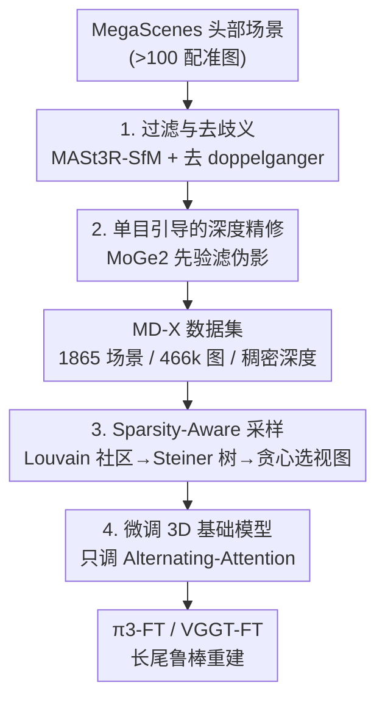

# Long-Tail Internet Photo Reconstruction

**会议**: CVPR 2026  
**论文**: [CVF Open Access](https://openaccess.thecvf.com/content/CVPR2026/html/Li_Long-Tail_Internet_Photo_Reconstruction_CVPR_2026_paper.html)  
**代码**: https://megadepth-x.github.io（项目页，含数据集/模型/代码）  
**领域**: 3D视觉  
**关键词**: 互联网照片重建、长尾分布、前馈3D基础模型、稀疏视图、数据采样

## 一句话总结
针对绝大多数互联网地标只有稀疏、噪杂、视角不均图片这一"长尾"困境，本文构造了一个干净、稠密深度、规模 8× 于 MegaDepth 的数据集 MegaDepth-X，并提出"从头部稠密场景里子采样出长尾式视图分布"的 sparsity-aware 采样策略，微调 π3、VGGT 等前馈基础模型后，在极端稀疏与对称/重复（doppelganger）场景上的重建鲁棒性大幅提升，同时不损害在标准稠密基准上的泛化能力。

## 研究背景与动机

**领域现状**：从 2D 图像恢复 3D 几何是计算机视觉的基石。经典路线是 SfM（如 COLMAP）+ MVS，靠特征匹配求相机位姿与点云；近两年兴起"前馈 3D 重建"范式——DUSt3R 从图像对回归像素对齐的点图，MASt3R 增强但仍逐对处理，VGGT、Fast3R、FLARE 用大 transformer 一次吃进上百张图同时预测相机参数/深度/点图，π3 进一步用置换等变架构去掉参考帧偏置、预测仿射不变位姿与尺度不变局部点图。这些模型在小规模、稠密拍摄、条件良好的场景上表现很好。

**现有痛点**：互联网照片集呈现极端长尾分布。少数名胜（罗马斗兽场、巴黎圣母院）被从各个角度密集拍摄，能被标准 SfM 精确重建；但全世界绝大多数地标在网上只有寥寥几张稀疏、噪杂、视角不均的照片。作者用 MegaScenes 统计：成功配准 >50 张图的"头部"场景仅 6,985 个，而配准 <50 张的"长尾"场景多达 418,056 个。在长尾场景上，COLMAP 常因跨稀疏、不重叠、宽基线视图找不到对应而完全失败（某些场景配准 0 张图）；前馈模型虽有强先验，但它们几乎都在受控、干净、稠密、均匀采样的数据上训练，迁移到稀疏不均的互联网照片时往往恢复不出一致几何。

**核心矛盾**：要在长尾场景上学会重建，需要长尾场景的 3D 监督；但长尾场景本身因重叠视图太少而无法被可靠重建出真值——这是一个"先有鸡还是先有蛋"的死结。用现成重建器（COLMAP/VGGT）从长尾自然数据里抠伪真值的常规做法，在这里恰恰不成立。

**本文目标**：(1) 形式化并刻画互联网照片的 3D 长尾问题；(2) 造一个能提供可靠长尾监督的数据基础；(3) 让前馈基础模型在不牺牲标准基准性能的前提下，对极端稀疏、宽基线、对称重复场景变得鲁棒。

**切入角度**：作者的关键观察是——虽然没法从稀疏场景直接拿真值，但可以**用从头部、被充分重建的地标里子采样稀疏子集来"模拟"长尾**，并直接从完整重建里继承真值监督。这类似自动驾驶里"模拟罕见事件来扩增训练数据"的思路。

**核心 idea**：一句话——"造一个干净稠密的头部数据集（MD-X），再从中按长尾的视图图结构子采样训练 batch，让基础模型在继承可靠监督的同时见到它训练分布里缺失的稀疏弱连接观测模式"。

## 方法详解

### 整体框架
本文不改模型架构，而是从**数据侧**两步解决长尾重建：第一步构造高质量监督源 **MegaDepth-X（MD-X）**——从 MegaScenes 里挑出可靠重建的头部场景，做去歧义清洗与稠密深度精修，得到 1,865 个场景、466k 张图、带干净稠密深度的真值；第二步是 **sparsity-aware 采样**——在 MD-X 这些"稠密好图"上，按真实长尾场景的视图图统计特性子采样出"稀疏、宽基线、弱连接但局部仍可重建"的训练 batch，从而在保留可信监督的同时，把长尾观测模式喂给模型。最后用这两个组件微调 π3、VGGT（只调 Alternating-Attention，冻结点云/相机解码器），得到 π3-FT / VGGT-FT。

整条管线是"清洗 → 深度精修 → 长尾采样 → 微调"的串行流程，其中长尾采样内部又是"社区检测 → Steiner 树骨架 → 贪心采样"三段子流程，画成框架图如下：

### 关键设计

**1. 过滤与去歧义：把"看起来重建好了其实是错的"头部场景剔掉**

要从头部场景继承真值，前提是这些重建本身可靠，但 MegaScenes 里即便配准 >100 张图的"良好重建"也有两类隐藏错误：一是动态/拥挤内容（人群、雕像、飞机等显著非静态物体）让特征匹配锁到运动物体上，产生碎裂、几何不一致的点云；二是 doppelganger 问题——视觉相似但地理上相隔很远的图（如建筑正反两面）被错误配准到一起。本文先以 MegaScenes 中配准 >100 张图的子集为起始池（2,474 个候选场景），人工剔除被人群/运动物体主导的场景；再用 **MASt3R-SfM 替换默认 COLMAP 重建**（基于 MASt3R 描述子构图），配合 **Doppelganger 分类器** 识别并剪掉可疑的伪对应边；最后把重建结果与 Google Maps、卫星影像等外部参考逐一人工核对，凡与鸟瞰图对不上的场景一律丢弃。这一步过滤掉 609 个场景，是后续一切监督可信度的地基——消融里不过滤的 DIRTY 变体点图精度甚至掉到比预训练模型还差，印证了"脏监督有害"。

**2. 单目引导的深度精修：在 MegaDepth 老配方之上再补一刀，去除残留深度伪影**

有了可靠稀疏重建后要生成稠密深度做监督。先跑标准 MVS，但 in-the-wild 数据的几何深度图常有两类伪影：深度溢出（背景深度渗进前景）、瞬态物体（人、车）处的噪声与闪烁。本文先套用 MegaDepth 的完整精修策略（改良 MVS 传播时保守保留最小深度、稳定性滤波去闪烁像素、语义滤波排除瞬态类别），但发现仍不够：改良 MVS 还是会溢出，语义滤波依赖手工指定的类别列表也不理想。于是新增一步**单目深度引导滤波**——用 MoGe2 预测的单目深度 $D_{mono}$ 作序数先验。先按有效像素中位数把几何深度 $D_{geom}$ 对齐到单目：$D'_{geom}(p)=s\cdot D_{geom}(p)$，其中 $s=\mathrm{med}\{D_{mono}\}/\mathrm{med}\{D_{geom}\}$；再算归一化深度差异 $\Delta(p)=\frac{|D'_{geom}(p)-D_{mono}(p)|}{D'_{geom}(p)}$，超过阈值 $\tau_{depth}$ 的像素丢弃；并算两图梯度的差异 $\Delta(p_{grad})=\big|\frac{|\nabla D_{mono}|}{D_{mono}}-\frac{|\nabla D'_{geom}|}{D'_{geom}}\big|$ 做边缘感知滤波，超过 $\tau_{grad}$ 的也丢弃。好处是无需手工类别列表就能同时压住溢出伪影和瞬态噪声。

**3. Sparsity-Aware 采样：用头部稠密场景"伪造"出长尾的视图图分布**

有了干净监督后，剩下的是**监督覆盖**问题——基础模型几乎只见过头部那种"图多、冗余、视觉强连通"的分布，而真实互联网集大多落在长尾：视图稀疏、分布不均、只弱连接。作者先用 SfM 视图图统计刻画长尾的两个特性：①更稀疏的连通性（低配准率场景里度 ≤2 的相机占 8%，头部仅 3%）；②更弱的连接（连通图对的平均几何验证匹配数 294.8 vs 头部 395.3）。据此提出采样要满足视角多样性、稀疏性、局部可重建性三条要求，并把任务形式化为"采 $N$ 个视图、最多形成 $N_{cc}$ 个连通分量"。具体三段：(a) **图社区**——把场景表示为视图图 $G=(V,E)$，边权 $w_{ij}$ 为特征匹配数，剪掉 $w_{ij}<50$ 的弱边得 $G'$，再用 Louvain 社区检测得到视点群 $C_k$（捕捉不同视觉区域）；(b) **最小连通子图**——每个社区随机选一个代表视图 $v_k$ 作为终端集 $T=\{v_k\}$，用近似 **Steiner 树**连成跨所有社区、只引入必要中间节点的紧凑子图 $G_{sub}$，既保全局连通又保稀疏；(c) **贪心视图采样**——在 $G_{sub}$ 上迭代扩展采样集，每步按"社区新颖性（优先没见过的社区）+ 空间距离（优先离当前更远以拉宽基线）"两个准则做字典序排序，选 top 邻居，重复 $D$ 次（搜索深度）。$D$ 控制稀疏度：$N=24,N_{cc}=1$ 时，$D=24$ 全靠贪心搜索分布更均匀，$D=12$ 则一半贪心一半从邻域局部补、分布更集中。采样离线预生成 24 节点 mini-batch，训练时再 DFS 子采样 2–24 张成 batch，避免训练时昂贵的图加载。

**4. 冻结解码器的轻量微调：保住预训练几何保真度，只让注意力适配长尾**

直接全量微调容易破坏 π3/VGGT 已学到的几何先验。本文只微调 **Alternating-Attention 模块**，冻结点云解码器与相机解码器，并沿用 π3/VGGT 各自原本的损失函数。这样模型只在"如何跨稀疏弱连接视图聚合信息"这一层适配长尾，而点图/相机的输出头保持原状——既拿到了长尾鲁棒性，又把对标准稠密基准的回退控制到很小（实验里 RealEstate10K/CO3Dv2 基本持平，VGGT 甚至略升）。

### 损失函数 / 训练策略
不引入新损失，直接复用 π3、VGGT 原始训练目标。训练数据用 MD-X 清洗集 + MIXED 采样（$D\in[5,24]$、$N_{cc}\in[1,4]$ 混合稠密与稀疏 batch）。对照变体：DENSE（$D=5,N_{cc}=1$）、SPARSE（$D=24,N_{cc}=4$）、RANDOM（随机采样），以及不做 3.1 过滤的 DIRTY 变体用于检验对标签噪声的鲁棒性。

## 实验关键数据

### 主实验
在 MD-X 测试集（127 个保留场景，每场景采 24 张图）上评相机位姿与点图，分 easy（$D=5,N_{cc}=1$）/ hard（$D=24,N_{cc}=4$）两档难度。位姿用 RRA@5/RTA@5/AUC@5（越高越好）、MRE/MTE（越低越好）；点图用 Acc/Comp（越低越好）、NC（越高越好）。

| 难度 | 方法 | RRA@5↑ | RTA@5↑ | AUC@5↑ | MRE↓ | Acc(Mean)↓ | NC(Mean)↑ |
|------|------|--------|--------|--------|------|-----------|-----------|
| easy | π3 | 88.97 | 68.79 | 45.84 | 4.12 | 0.055 | 0.712 |
| easy | **π3-FT** | **95.64** | **76.85** | **55.58** | **1.64** | **0.035** | **0.724** |
| easy | VGGT | 84.17 | 58.47 | 35.32 | 4.55 | 0.093 | 0.695 |
| easy | **VGGT-FT** | **92.41** | **71.12** | **48.78** | **2.70** | **0.050** | **0.719** |
| hard | π3 | 75.31 | 59.16 | 36.93 | 12.21 | 0.101 | 0.689 |
| hard | **π3-FT** | **86.40** | **71.00** | **47.93** | **5.72** | **0.068** | **0.713** |
| hard | VGGT | 70.98 | 52.98 | 29.10 | 13.20 | 0.149 | 0.675 |
| hard | **VGGT-FT** | **81.07** | **65.59** | **41.49** | **7.22** | **0.089** | **0.709** |

微调对两个 backbone 都有显著且一致的提升，且**越难（越稀疏）的 hard 子集涨幅越大**：π3-FT 在 hard 上 AUC@5 从 36.93→47.93（+11.0）、MRE 从 12.21→5.72（腰斩），点图 Acc 从 0.101→0.068。

### 标准基准泛化
为验证"学长尾不会伤标准场景"，在 RealEstate10K、CO3Dv2 上测相对位姿：

| 数据集 | 方法 | RRA@5↑ | RTA@5↑ | AUC@5↑ |
|--------|------|--------|--------|--------|
| RealEstate10K | π3 | 98.79 | 79.61 | 62.82 |
| RealEstate10K | π3-FT | 98.80 | 77.78 | 60.01 |
| CO3Dv2 | π3 | 93.24 | 84.47 | 57.12 |
| CO3Dv2 | π3-FT | 93.97 | 84.50 | 57.61 |
| CO3Dv2 | VGGT | 96.97 | 86.19 | 67.84 |
| CO3Dv2 | VGGT-FT | 97.11 | 86.27 | 67.81 |

微调后两 backbone 基本持平，VGGT 在 CO3Dv2 上还略有改善——说明从稀疏 in-the-wild 学到的鲁棒性没有牺牲对标准稠密基准的泛化。点图基准 DTU 大体保持，ETH3D 因域差异略降（作者归因于与互联网影像的域不匹配）。

### 消融实验
在 MD-X 上对比数据质量与采样方案（以 π3 为底）：

| 难度 | 配置 | RRA@5↑ | AUC@5↑ | MRE↓ | Acc(Mean)↓ | 说明 |
|------|------|--------|--------|------|-----------|------|
| hard | π3 (预训练) | 75.31 | 36.93 | 12.21 | 0.101 | 基线 |
| hard | π3-FT (清洗+MIXED) | 86.40 | 47.93 | 5.72 | 0.068 | 完整模型，最佳 |
| hard | π3-DIRTY | 81.10 | 43.74 | 11.86 | 0.130 | 不过滤脏数据：点图比预训练还差 |
| hard | π3-RANDOM | 85.93 | 47.17 | 6.53 | 0.071 | 随机采样：位姿尚可、点图改善有限 |
| hard | π3-DENSE | 85.82 | 47.47 | 6.04 | 0.071 | 稠密 batch：易场景好、稀疏场景弱 |
| hard | π3-SPARSE | 85.97 | 47.13 | 6.05 | 0.070 | 纯稀疏：单用不是最佳权衡 |

### 关键发现
- **数据清洗比采样更关键**：DIRTY 变体在 easy/hard 的点图估计上都掉到比预训练 π3 还差（hard Acc 0.130 > π3 的 0.101），说明脏监督直接有害，干净监督是鲁棒泛化的前提。
- **混合采样最优**：RANDOM 位姿还行但点图改善有限（强调训练 batch 需要足够共视）；DENSE 易场景好、稀疏场景弱；纯 SPARSE 暴露了更难样本但单用不是最佳权衡；MIXED 在各难度上综合最好。
- **越难涨越多**：所有指标在 hard 子集上的提升都大于 easy，正切中"长尾"目标——模型最该补强的就是稀疏弱连接场景。
- **真实长尾定性**：在真实长尾场景里（如 Novo-Znamenka Manor 66 图仅 13 配准、Saint Andrew's 教堂 94 图 COLMAP 0 配准），COLMAP 几乎全失败、预训练 π3 给低置信碎片，本文模型仍能恢复连贯全局几何并以更高置信度化解 doppelganger 歧义。

## 亮点与洞察
- **用"子采样头部"绕开长尾真值缺失的鸡生蛋死结**：长尾场景拿不到真值，那就从能拿到真值的头部里"伪造"长尾视图分布——把数据增强里"模拟罕见事件"的思路迁移到 3D 重建，干净利落地把无监督难题转成有监督。
- **长尾被重新定义为"图结构"而非"图数量"问题**：作者用视图图统计（低度节点占比、平均匹配数）证明长尾的本质是稀疏弱连接的观测图，而非单纯图少；这个刻画直接催生了基于社区+Steiner 树的采样设计，是把问题诊断转成方法的范例。
- **Steiner 树 + Louvain 社区 + 贪心采样的组合很巧**：用社区保证视角多样性、用 Steiner 树保最小连通、用贪心兼顾"社区新颖+空间远"，三者各管一条采样要求（多样/稀疏/局部可重建），可迁移到任何"想从稠密图里采出受控稀疏子图"的任务。
- **冻结解码器只调注意力**：把"长尾适配"局限在信息聚合层，是保住预训练几何先验、避免灾难性遗忘的轻量微调范式，值得在其他基础模型微调里复用。

## 局限与展望
- **依赖头部数据的覆盖**：模拟长尾的前提是头部场景在视角/外观上足够丰富；若某类长尾结构在头部根本没有相似样本（如极罕见建筑形态），子采样也造不出对应监督。
- **域偏移仍存在**：ETH3D 上点图精度下降，作者承认是与互联网影像的域不匹配——说明在互联网照片上微调会让模型对受控扫描类数据略有漂移。
- **采样超参需调**：$N_{cc}$、搜索深度 $D$、剪边阈值（$w_{ij}<50$）、深度差异阈值 $\tau_{depth}/\tau_{grad}$ 等都需经验设定，论文给了 easy/hard 用的配置但缺系统的敏感性分析（部分细节在补充材料，⚠️ 以原文为准）。
- **清洗含人工环节**：过滤动态场景、与卫星图核对都涉及人工验证，规模化到更大数据集时人力成本是瓶颈。

## 相关工作与启发
- **vs 经典 SfM（COLMAP）**：COLMAP 靠特征对应求位姿，跨稀疏/宽基线/不重叠视图时找不到匹配而失败（长尾场景常配准 0 张）；本文用前馈模型 + 长尾监督直接回归几何，在 COLMAP 全失败的场景仍能重建。
- **vs 前馈基础模型（DUSt3R/VGGT/π3）**：它们提供强先验但训练分布偏头部稠密，迁移到长尾稀疏数据失效；本文不改架构，只通过 MD-X 数据 + sparsity-aware 采样微调就补上了缺失的稀疏弱连接观测模式。
- **vs MegaDepth / MegaScenes**：MegaDepth 干净但小，MegaScenes 大但噪杂且无深度图；MD-X 取两者之长——规模 8× 于 MegaDepth、带干净稠密深度、经人工核对，专为微调 3D 基础模型而造。
- **vs Doppelganger 处理工作（Cai et al.）**：前人训分类器在 SfM 阶段剪除假匹配以解对称歧义；本文把 Doppelganger 分类直接用进数据清洗，并让微调后的模型在推理时也对 doppelganger 场景更鲁棒。

## 评分
- 新颖性: ⭐⭐⭐⭐⭐ 把长尾问题从"图量"重定义为"图结构"，并用子采样头部巧妙绕开真值缺失，问题定义与解法都很原创。
- 实验充分度: ⭐⭐⭐⭐ 两 backbone × 两难度 + 采样/数据消融 + 标准基准泛化覆盖全面，缺超参敏感性分析（在补充材料）。
- 写作质量: ⭐⭐⭐⭐⭐ 动机推导清晰，长尾统计刻画与采样三段流程讲得很透。
- 价值: ⭐⭐⭐⭐⭐ 直指 3D 基础模型下一前沿，数据集+模型+代码全开源，对真实世界重建落地价值高。

<!-- RELATED:START -->

## 相关论文

- [\[CVPR 2026\] AnyLift: Scaling Motion Reconstruction from Internet Videos via 2D Diffusion](anylift_scaling_motion_reconstruction_from_internet_videos_via_2d_diffusion.md)
- [\[CVPR 2026\] Photo-Guided Tooth Segmentation on 3D Oral Scan Model](photo-guided_tooth_segmentation_on_3d_oral_scan_model.md)
- [\[CVPR 2026\] Long-SCOPE: Fully Sparse Long-Range Cooperative 3D Perception](long_scope_fully_sparse_long_range_cooperative_3d_perception.md)
- [\[CVPR 2026\] tttLRM: Test-Time Training for Long Context and Autoregressive 3D Reconstruction](tttlrm_test-time_training_for_long_context_and_autoregressive_3d_reconstruction.md)
- [\[CVPR 2026\] Lifting Unlabeled Internet-level Data for 3D Scene Understanding](lifting_unlabeled_internet-level_data_for_3d_scene_understanding.md)

<!-- RELATED:END -->
