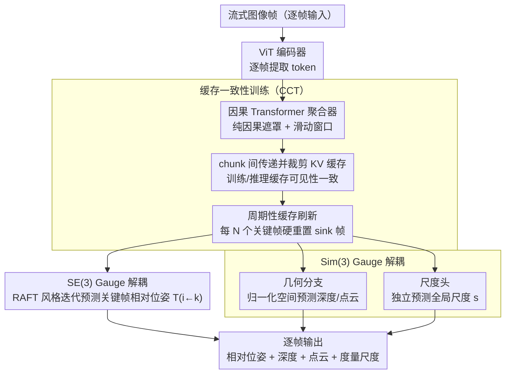

# LongStream: Long-Sequence Streaming Autoregressive Visual Geometry

**会议**: CVPR 2026  
**arXiv**: [2602.13172](https://arxiv.org/abs/2602.13172)  
**代码**: [项目页](https://3dagentworld.github.io/longstream/)  
**领域**: 3D视觉  
**关键词**: 流式3D重建, 自回归模型, 位姿估计, KV缓存, 长序列

## 一句话总结

提出LongStream，一种gauge-decoupled的流式视觉几何模型，通过关键帧相对位姿预测、正交尺度学习和缓存一致性训练，实现千帧级别稳定的度量尺度实时（18 FPS）场景重建。

## 研究背景与动机

长序列流式3D重建是视觉几何中的重大开放难题。现有自回归流式模型（如Stream3R、StreamVGGT）在处理长序列时严重退化：

- **根本原因——gauge-coupled设计**：现有模型将位姿锚定到第一帧坐标系，回归绝对位姿。这使得长序列预测变成一个越来越困难的外推问题——训练时只见短索引，推理时要预测大索引，产生"train-short, test-long"的域差距
- **注意力衰减**：随着序列变长，注意力机制过度依赖第一帧token（attention sink），导致关键帧跳变和位姿误差累积
- **尺度漂移**：几何形状和度量尺度的学习纠缠在一起，导致Sim(3)尺度渐进漂移
- **KV缓存污染**：长期累积的KV缓存中包含过时或退化信息，进一步加剧几何漂移

现有流式方法在几十米范围内就会崩溃，而自动驾驶等应用需要公里级稳定重建。

## 方法详解

### 整体框架

LongStream基于ViT编码器+因果Transformer聚合器+任务头的架构，输入流式图像帧，对每帧预测：关键帧相对位姿 $\mathbf{T}_{i \leftarrow k}$、深度图、点云图、全局尺度因子。聚合器在训练和推理时共享同一套KV缓存布局（由缓存一致性训练保证），位姿头走SE(3)解耦预测关键帧相对位姿，几何与尺度分支走Sim(3)解耦各自独立预测。

### 关键设计

1. **SE(3) Gauge解耦——关键帧相对位姿**：丢弃固定的第一帧锚定，改为预测每帧相对于最近关键帧的位姿：

$$\mathbf{T}_{i \leftarrow k} = \mathbf{T}_i \circ \mathbf{T}_k^{-1}$$

该公式在任意世界坐标系重参数化 $S \in SE(3)$ 下不变。核心效果是将长程外推问题（大索引范围）转化为恒定难度的局部估计任务（有界索引间隔 $i - k$），同时消除对第一帧的固有偏差。位姿头融合当前帧和关键帧特征，采用RAFT风格的迭代更新 $\mathbf{p}^{(t+1)} = \mathbf{p}^{(t)} + \Delta\mathbf{p}^{(t)}$。

2. **Sim(3) Gauge解耦——正交尺度学习**：采用尺度不变(SI-Log)思想，在架构和目标层面分离几何学习和度量尺度估计：

    - **几何分支**：在归一化空间优化，损失为 $\mathcal{L}_{geom} = \|\tilde{X}_{pred} - \tilde{X}_{gt}\|_1$，其中 $\tilde{X} = X / \text{Norm}(X)$，确保 $\partial\mathcal{L}/\partial s = 0$
    - **尺度头**：独立预测全局尺度因子 $s = \exp(\mathbf{w}^\top \mathbf{h}_{scale})$，仅在有度量标定的数据上训练
    - 尺度只影响平移、深度和点云，旋转和视场角不受影响，实现完全解耦

3. **缓存一致性训练 (Cache-Consistent Training, CCT)**：解决注意力sink依赖和KV缓存污染问题：

    - 训练时移除常量sink token，使用纯因果遮罩+滑动窗口
    - 在训练的chunk之间显式传递和裁剪KV缓存，使训练时的缓存可见性与推理完全一致
    - 对超长序列，引入**周期性缓存刷新**：每N个关键帧硬重置sink帧和KV缓存（类似SLAM中的状态边缘化）——因为整个模型在关键帧相对坐标下运行，刷新不破坏一致性

### 损失函数 / 训练策略

联合概率框架最大化后验：

$$\mathcal{L} = \mathcal{L}_{geom} + \mathcal{L}_{depth} + \mathcal{L}_{pose} + \mathcal{L}_{scale}$$

- $\mathcal{L}_{pose}$：迭代更新中对旋转(四元数)、平移(归一化空间)、焦距偏移的L1损失，带衰减权重 $\gamma^{t-1}$
- $\mathcal{L}_{geom}$：归一化点云L1（尺度不变）
- $\mathcal{L}_{depth}$：深度监督
- $\mathcal{L}_{scale}$：对数空间度量尺度L1 $\|\log\hat{s} - \log s_{gt}\|_1$（仅用于有标定数据）

## 实验关键数据

### 主实验

| 数据集 | 指标 | LongStream | 之前最佳流式方法 | 提升 |
|--------|------|-----------|-----------------|------|
| KITTI (11序列) | 平均ATE↓ | **51.90** | 177.73 (TTT3R) | -70.8% |
| KITTI seq00 (3.7km) | ATE | **92.55** | 190.93 (TTT3R) | -51.5% |
| KITTI seq04 (0.4km) | ATE | **1.95** | 11.62 (TTT3R) | -83.2% |
| TUM-RGBD | ATE | 最佳 | Stream3R/StreamVGGT崩溃 | — |
| Waymo | ATE | 最佳 | 现有方法严重漂移 | — |

注：18 FPS实时推理，内存和延迟在长序列上保持稳定（不像VGGT等会OOM）。

### 消融实验

| 配置 | 关键指标 | 说明 |
|------|---------|------|
| 无CCT + 因果推理 | 强attention sink，精度差 | 训练推理不一致导致退化 |
| 无CCT + 滑窗推理（保留sink） | sink放大，精度降 | 滑窗放大了sink偏差 |
| 有CCT + 因果推理 | sink强烈抑制，精度最佳 | CCT消除了对sink的依赖 |
| 有CCT + 滑窗推理 | sink同样抑制，精度优良 | CCT在所有推理模式下有效 |

### 关键发现

- 现有流式方法在几十米内就崩溃，而LongStream在公里级序列上保持稳定
- Attention sink不是有用的特征——是训练推理不一致的副产物；CCT消除后性能反而大幅提升
- 关键帧相对位姿将外推问题转化为内插问题，这是长序列稳定性的理论基础
- 周期性缓存刷新与关键帧相对坐标系天然兼容，无需额外对齐

## 亮点与洞察

- **Gauge解耦思想**：从理论层面识别了长序列退化的两个根本自由度（SE(3)坐标和Sim(3)尺度），并分别给出优雅的解决方案
- **重新理解Attention Sink**：指出sink不是流式Transformer的必需品，而是train-inference gap的症状。CCT直接消除此gap
- **周期性缓存刷新**：借鉴SLAM中的状态边缘化思想，与关键帧相对坐标系完美配合
- **实用性突出**：18 FPS + 公里级稳定 + 度量尺度，真正可用于自动驾驶等场景

## 局限与展望

- 关键帧选择策略未详细讨论，对于快速运动或纹理贫乏场景可能需要自适应关键帧
- 尺度头仅在有度量标定数据上训练，非标定数据的尺度质量取决于训练数据分布
- 周期性缓存刷新的N值选择可能需要根据场景调整
- 室内小规模场景（如TUM-RGBD）上的优势不如室外明显
- 未讨论动态物体处理——对于有大量运动物体的场景可能需要额外处理

## 相关工作与启发

- **VGGT/StreamVGGT**：LongStream的直接基线，证明了绝对位姿回归在长序列上必然失败
- **DUSt3R/MASt3R**：离线重建方法，LongStream将其思想扩展到流式场景
- **CUT3R**：RNN式流式重建，LongStream用Transformer+KV缓存替代RNN实现更好的长期依赖
- 关键帧相对位姿的思想可推广到其他需要长序列处理的视觉任务
- CCT的训练推理一致性思想对所有使用KV缓存的流式模型都有参考价值

## 评分

- **新颖性**: ⭐⭐⭐⭐⭐ Gauge解耦+CCT+周期刷新三重创新，理论动机清晰，每个组件都有独立贡献
- **实验充分度**: ⭐⭐⭐⭐ 覆盖室内外多数据集，可视化充分，包含注意力图分析
- **写作质量**: ⭐⭐⭐⭐⭐ 问题定义精准，理论推导清晰，图表信息量大
- **价值**: ⭐⭐⭐⭐⭐ 首次实现公里级实时流式重建，对自动驾驶/机器人的实际部署有重要意义
- 价值: 待评

<!-- RELATED:START -->

## 相关论文

- [\[ICCV 2025\] LONG3R: Long Sequence Streaming 3D Reconstruction](../../ICCV2025/3d_vision/long3r_long_sequence_streaming_3d_reconstruction.md)
- [\[CVPR 2026\] AutoRegressive Generation with B-rep Holistic Token Sequence Representation](autoregressive_generation_with_b-rep_holistic_token_sequence_representation.md)
- [\[CVPR 2026\] tttLRM: Test-Time Training for Long Context and Autoregressive 3D Reconstruction](tttlrm_test-time_training_for_long_context_and_autoregressive_3d_reconstruction.md)
- [\[CVPR 2026\] Stabilizing Streaming Video Geometry via Dynamic Feature Normalization](stabilizing_streaming_video_geometry_via_dynamic_feature_normalization.md)
- [\[CVPR 2026\] DVGT: Driving Visual Geometry Transformer](dvgt_driving_visual_geometry_transformer.md)

<!-- RELATED:END -->
