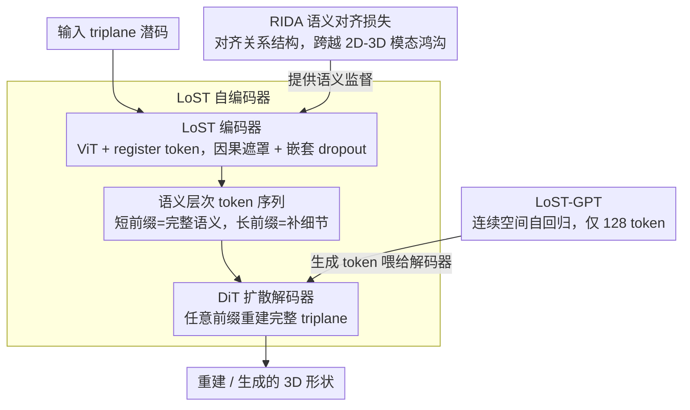

# LoST: Level of Semantics Tokenization for 3D Shapes

**会议**: CVPR 2026  
**arXiv**: [2603.17995](https://arxiv.org/abs/2603.17995)  
**代码**: [项目页](https://lost3d.github.io)  
**领域**: 3D视觉  
**关键词**: 3D生成, 形状分词, 自回归模型, 语义层次, 扩散解码

## 一句话总结

提出Level-of-Semantics Tokenization (LoST)，按语义显著性排序3D形状token，使短前缀即可解码出完整且语义合理的形状，配合RIDA语义对齐损失和GPT式自回归生成，仅用128个token即显著超越现有需数万token的3D AR方法。

## 研究背景与动机

Token化是自回归(AR)生成模型的基础，决定了生成质量和效率。3D形状分词的现状：

- **平坦元素流**（如MeshGPT、Llama-Mesh）：直接将顶点/面序列化为token流，序列极长（数千至数万），二次注意力代价高，且早期前缀无法解码为有意义的形状
- **几何LoD层次**（如OctGPT、VertexRegen）：基于八叉树或渐进网格的粗到细空间层次，源自渲染和压缩领域，但存在两个系统性问题：
    - **粗层级token膨胀**：即使经过几何简化，早期阶段仍需大量空间token才能勾勒基本结构
    - **早期解码不可用**：激进的几何简化导致粗层级形状在几何和语义上都不像最终结果

**核心观察**：几何LoD是为渲染/压缩设计的，不是为AR建模设计的。AR模型的理想token序列应该是：短前缀=完整+语义合理, 长前缀=细节精确。这正是**语义显著性**排序而非空间细节排序。

## 方法详解

### 整体框架

三阶段训练系统：
1. **RIDA预训练**：训练3D语义提取器，将triplane潜空间与DINO语义空间对齐
2. **LoST自编码器**：ViT编码器将triplane压缩为语义层次token序列 + DiT扩散解码器从任意前缀重建完整triplane
3. **LoST-GPT**：GPT式Transformer在连续token空间做自回归生成

### 关键设计

1. **LoST编码器——语义层次token序列**：基于ViT编码器处理patchified triplane（768 token），引入最多512个可学习的**register token** $\mathcal{T}_R$，通过注意力机制从原始triplane token中提取信息。关键机制：

    - **因果遮罩**：register token之间使用因果注意力，迫使信息从前到后层次化组织
    - **嵌套dropout**：训练时随机保留长度为 $[1, 2, 4, 8, ..., k]$ 的前缀，丢弃其余，迫使模型将最重要的信息前置
    - 语义/几何层次的类型由训练损失决定：几何损失→频率层次（低频到高频），语义损失→语义层次
    - 编码后仅保留register token（投影到32维），丢弃原始triplane token，实现信息瓶颈

2. **RIDA——3D语义对齐损失 (Relational Inter-Distance Alignment)**：2D领域的REPA损失直接用DINO特征做对齐，但3D形状没有直接的语义特征提取器。RIDA不直接回归DINO特征（模态差异太大），而是对齐**关系结构**：

    - 训练一个"学生"Transformer $f_\theta$ 将triplane映射到语义空间
    - **全局关系对比** $\mathcal{L}_{global}$：用DINO特征的相似度挖掘正负样本对，在学生空间做Multi-positive InfoNCE
    - **实例间排序蒸馏** $\mathcal{L}_{rank}$：保留DINO空间中连续的成对距离结构（受RKD启发）
    - **空间结构蒸馏** $\mathcal{L}_{spatial}$：对齐token级别的亲和度矩阵
    - 总损失 $\mathcal{L}_{RIDA} = 1.0 \cdot \mathcal{L}_{global} + 1.0 \cdot \mathcal{L}_{rank} + 0.5 \cdot \mathcal{L}_{spatial}$

3. **LoST-GPT——连续空间自回归生成**：保持token在连续空间（不量化），使用LlamaGen架构(depth 24, 16 heads, dim 1024)做自回归next-token预测。每个位置用小MLP扩散头建模条件分布（来自MAR），避免了VQ的信息损失。条件生成使用OpenCLIP嵌入。仅需128个token即完成高质量生成。

### 损失函数 / 训练策略

- LoST自编码器：$\mathcal{L} = \mathcal{L}_{denoise} + 1.0 \cdot \mathcal{L}_{semantic}$，其中语义损失 $\mathcal{L}_{semantic} = 1 - \langle f_\theta(\hat{\mathbf{X}}_0), f_\theta(\mathbf{X}_0) \rangle$
- DiT解码器：depth 24, dim 1024, 16 heads，2×2 patchification
- 训练数据：自建300K形状数据集（Gemini 2.5 Pro生成prompt → Flux.1生成图 → Direct3D生成3D）
- LoST训练250 epochs，RIDA训练100 epochs，均在8×A100上

## 实验关键数据

### 主实验

| 方法 | Token数 | CD(×10⁻²)↓ | FID↓ | DINO↑ |
|------|---------|------------|------|-------|
| OctGPT (最佳层) | ~61962 | 0.533 | 100.78 | 0.619 |
| VertexRegen (最佳层) | ~7530 | 0.034 | 86.10 | 0.791 |
| **LoST (64 tokens)** | 64 | 0.382 | 21.13 | 0.880 |
| **LoST (512 tokens)** | 512 | 0.234 | 13.59 | 0.921 |
| LoST (1 token) | 1 | 2.271 | 31.65 | 0.731 |

AR生成：

| 方法 | Token数 | FID↓ | DINO↑ |
|------|---------|------|-------|
| OctGPT | ~50000 | 66.93 | — |
| ShapeLLM-Omni | 1024 | 48.70 | 0.680 |
| **LoST-GPT** | **128** | **34.25** | **0.758** |

### 消融实验

| 配置 | 关键指标 | 说明 |
|------|---------|------|
| 仅几何损失（无RIDA） | FID高、DINO低 | 缺乏语义指导，前缀解码语义差 |
| 加入RIDA语义损失 | FID和DINO显著改善 | 语义对齐是LoS层次的关键 |
| 1 token解码 | DINO 0.731, FID 31.65 | 已优于OctGPT的最佳层（~62K tokens） |
| 4 tokens解码 | DINO 0.765, FID 29.26 | 语义保真度进一步提升 |

### 关键发现

- LoST仅用1个token就能解码出完整、可辨识的形状（如椅子/汽车的基本语义），而LoD方法在数千token时仍是不可用的几何原始体
- 128 token的AR生成全面超越需要50000 token的OctGPT，token效率提升约400倍
- 语义层次（LoS）显著优于几何层次（LoD）用于AR建模——因为语义前缀可生成完整结构
- RIDA通过对齐关系结构而非绝对值，成功跨越了2D DINO特征与3D triplane潜空间的模态鸿沟

## 亮点与洞察

- **核心洞察深刻**：几何LoD为渲染设计，语义LoS才适合AR生成，这一观察改变了3D分词的思路
- **RIDA的巧妙设计**：不直接回归跨模态特征（会失败），而是对齐关系拓扑结构，这是一个通用的跨模态知识迁移思路
- **极端token效率**：1个token=一个完整形状，128个token超越50000 token的方法
- **前缀解码的语义渐进**：从"通用类别"到"特定实例细节"，如从"通用山"到"有人脸的山"
- 连续token + 扩散损失避免了VQ的信息损失，是AR生成的有效替代范式

## 局限与展望

- 基于VAE triplane潜空间，未来需扩展到其他3D表示（如Gaussian Splats）
- 扩散解码器增加了推理成本，不如纯AR解码高效
- 极少token时仍可能有伪影（2D语义分词也有此问题）
- AR生成器目前使用固定目标长度，未实现自适应EOS停止
- 训练数据为合成生成（Direct3D pipeline），真实扫描数据可能需要额外适配
- 未探索条件控制（如部件级编辑）

## 相关工作与启发

- **FlexTok/Semanticist**（2D）：直接启发了LoST，将语义层次分词的思想从2D推广到3D
- **RKD**：关系知识蒸馏启发了RIDA的关系对齐策略
- **MAR**：连续空间自回归建模启发了LoST-GPT的扩散损失设计
- **Direct3D**：VAE提供了triplane潜空间基础
- LoST思想可推广到视频分词（时间语义层次）或场景级3D分词

## 评分

- **新颖性**: ⭐⭐⭐⭐⭐ 从LoD到LoS的范式转变，RIDA跨模态关系对齐，连续AR生成——三个独立创新点
- **实验充分度**: ⭐⭐⭐⭐ 分词重建和AR生成分别评估，与多个SOTA对比，有语义检索下游任务
- **写作质量**: ⭐⭐⭐⭐⭐ 论文结构清晰，LoD vs LoS的对比直观有力，图表精美
- **价值**: ⭐⭐⭐⭐⭐ 大幅提升3D AR生成效率（400倍token压缩），定义了3D分词的新方向
- 价值: 待评

<!-- RELATED:START -->

## 相关论文

- [\[CVPR 2026\] Residual Primitive Fitting of 3D Shapes with SuperFrusta](residual_primitive_fitting_of_3d_shapes_with_superfrusta.md)
- [\[CVPR 2026\] UniTEX: Universal High Fidelity Generative Texturing for 3D Shapes](unitex_universal_high_fidelity_generative_texturing_for_3d_shapes.md)
- [\[CVPR 2026\] Fusion of Depth and Semantics for Probabilistic Floorplan Localization](fusion_of_depth_and_semantics_for_probabilistic_floorplan_localization.md)
- [\[ICCV 2025\] Can3Tok: Canonical 3D Tokenization and Latent Modeling of Scene-Level 3D Gaussians](../../ICCV2025/3d_vision/can3tok_canonical_3d_tokenization_and_latent_modeling_of_scene-level_3d_gaussian.md)
- [\[CVPR 2026\] ExtrinSplat: Decoupling Geometry and Semantics for Open-Vocabulary Understanding in 3D Gaussian Splatting](extrinsplat_decoupling_geometry_and_semantics_for_open-vocabulary_understanding_.md)

<!-- RELATED:END -->
