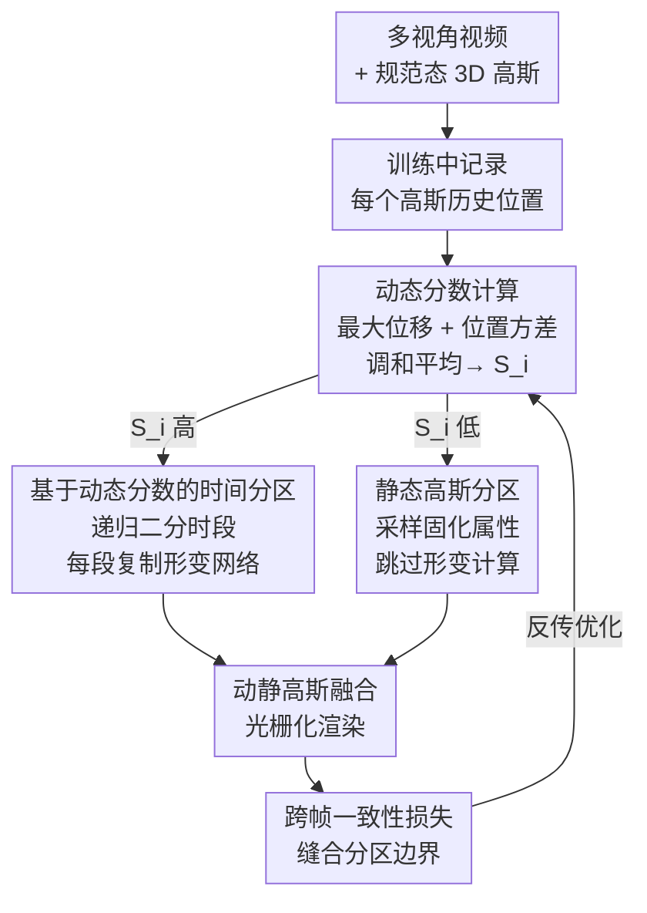

# MAPo: Motion-Aware Partitioning of Deformable 3D Gaussian Splatting for High-Fidelity Dynamic Scene Reconstruction

**会议**: CVPR 2026  
**论文**: [CVF Open Access](https://openaccess.thecvf.com/content/CVPR2026/html/Jiao_MAPo_Motion-Aware_Partitioning_of_Deformable_3D_Gaussian_Splatting_for_High-Fidelity_CVPR_2026_paper.html)  
**代码**: 无  
**领域**: 3D视觉  
**关键词**: 动态场景重建, 可变形高斯泼溅, 动态分数, 时间分区, 跨帧一致性

## 一句话总结
MAPo 给每个 3D 高斯算一个"动态分数"，据此把高动态高斯沿时间轴**递归二分**并为每段复制一份独立形变网络（专门拟合各时段运动），把低动态高斯直接固化为静态省算力，再用跨帧一致性损失缝合分区边界，在 N3DV 上把 PSNR 从 E-D3DGS 的 30.79 提到 31.33，且算力开销基本持平。

## 研究背景与动机
**领域现状**：从多视角视频重建动态 3D 场景，主流路线是「可变形 3D 高斯泼溅」——维护一组**规范态（canonical）3D 高斯**，再学一个全局共享的**形变场（deformation field）**，把这组高斯随时间 $t$ 映射到当前帧的状态（位置、旋转、缩放、不透明度等）。D3DGS、4DGaussians、E-D3DGS 都属此类，因表示紧凑、渲染实时而成为主流。

**现有痛点**：这类方法在**复杂或剧烈运动**的区域（快速挥动的手、细微的面部表情）会糊掉、丢失运动细节（论文 Fig.1）。根因是「单一统一模型」：一组规范高斯 + 一个全局形变网络要同时拟合整段时间里**所有彼此冲突的运动模式**，被迫收敛到一个"对所有时刻都折中"的解，也就是**时间平均（temporal averaging）效应**——渲染结果在视觉上趋近于把所有时刻平均后的样子（Fig.2），凡是偏离这个平均的突变和细节就被抹平。

**核心矛盾**：表达能力和计算/工程成本之间的 trade-off。要避免时间平均，一种思路是像 SWinGS 那样把序列切成独立窗口、各训一个模型，但它的分区是**粗粒度的窗口级**、依赖 2D 光流先验、还要繁琐的前后处理；另一边，静态区域的高斯**仍在反复参与形变网络计算**，纯属浪费。

**本文目标**：① 在高动态区做**细粒度、按 3D 运动驱动、端到端**的时间分区，破除时间平均；② 识别静态高斯免去冗余形变计算；③ 消除分区带来的边界跳变。

**切入角度**：与其让一个网络硬扛所有运动，不如**按运动强度自适应地分配建模容量**——动得越剧烈的高斯，就给它越多套"专属网络 + 专属高斯副本"去分时段精细拟合；动得少的就固化。关键前提是要有一个能量化"每个高斯运动强度"的指标。

**核心 idea**：用每个 3D 高斯的历史轨迹算一个**动态分数**，据此**递归时间二分**高动态高斯（每分一段复制一份形变网络），并把低动态高斯转为静态，最后用跨帧一致性损失缝合边界。

## 方法详解

### 整体框架
MAPo 建立在 E-D3DGS 的**双形变范式**之上：每个高斯有一个可学习嵌入 $z_g$，每个时刻 $t$ 有一对时间嵌入（粗 $z_{t_c}$ 抓低频运动、细 $z_{t_f}$ 抓高频细节），由粗形变网络 $\mathcal{F}$ 和细形变网络 $\mathcal{F}_\theta$ 预测形变，最终形变是二者之和：

$$(\Delta\mu, \Delta q, \Delta s, \Delta\alpha, \Delta sh) = \mathcal{F}(z_g, z_{t_c}) + \mathcal{F}_\theta(z_g, z_{t_f})$$

在此之上，MAPo 整条管线是：训练中**记录每个高斯的历史位置 → 算动态分数 → 高分者沿时间递归二分并复制形变网络、低分者固化为静态 → 动静高斯融合渲染 → 在分区边界附近施加跨帧一致性损失**。它不是改 loss 的小修小补，而是一个「自适应给运动分配建模容量」的多模块协同框架，因此配框架图。

### 关键设计

**1. 动态分数：用历史轨迹给每个高斯量化运动强度**

时间分区要先知道"哪些高斯该分、哪些该固化"，缺一个可靠的逐高斯运动强度指标。作者在训练中为每个高斯 $G_i$ 记录 $m$ 个历史位置 $\{\mu_{ij}\}_{j=1}^m$（$m=300$），并指出**单看最大位移不够**：短时高速但长期静止的物体最大位移大、方差却小；持续小幅振荡的物体最大位移小、方差却大——两类都是"难拟合的复杂运动"。所以他们同时用两个量：最大位移 $r_i$（取历史位置轴对齐包围盒对角线长度，高效计算运动峰值幅度）和位置方差 $v_i$（围绕均值位置 $\bar\mu_i$ 的离散度）：

$$r_i = \big\| \max_j \mu_{ij} - \min_j \mu_{ij} \big\|, \quad v_i = \sum_{j=1}^m \frac{\|\mu_{ij} - \bar\mu_i\|^2}{m}$$

两者先做**百分位归一化**映射到 $[0,1]$（$\tilde r_i = \sum_{k=1}^{100} \frac{\mathbf{1}(r_i \ge q_r(k))}{100}$，$\tilde v$ 同理，$q_r(k)$ 是 $\{r_i\}$ 的第 $k$ 百分位），再用**调和平均**融合得最终动态分数：

$$S_i = \frac{2}{\frac{1}{\tilde r_i + \varepsilon} + \frac{1}{\tilde v_i + \varepsilon}}, \quad \varepsilon = 10^{-6}$$

之所以用调和平均而非算术平均，是因为它**要求两个输入都高才输出高**——只有"既位移大又方差大"的高斯才被判为真正剧烈复杂的运动，避免被单一维度误判，这也是消融里加入方差（1.2 +Var）能再涨点的原因。

**2. 基于动态分数的时间递归分区：给剧烈运动复制专属网络**

这是破除时间平均的核心。痛点是单个高斯 + 单个形变网络拟合不了长程复杂运动。MAPo 的做法是**沿时间轴递归二分**：每个高斯维护两个属性——分区层级 $l$（初始 0）和时段范围 $[t_{\text{start}}, t_{\text{end}}]$（初始 $[0,T]$，左闭右开）。记 $G_{[t_{\text{start}},t_{\text{end}}]}$ 为该时段的高斯集合，$F_{[t_{\text{start}},t_{\text{end}}]}$ 为负责形变它们的网络。当某层级 $l$ 的高斯在其时段内动态分数超过该层阈值 $\tau_l$ 时，就在时间中点 $t_{\text{mid}} = (t_{\text{start}} + t_{\text{end}})/2$ 处一分为二：原高斯保留前半段 $[t_{\text{start}}, t_{\text{mid}}]$ 并升到层级 $l{+}1$，**复制一个属性相同的副本**承担后半段 $[t_{\text{mid}}, t_{\text{end}}]$；与此同时，形变网络 $F_{[t_{\text{start}},t_{\text{end}}]}$ 也被复制成 $F_{[t_{\text{start}},t_{\text{mid}}]}$ 和 $F_{[t_{\text{mid}},t_{\text{end}}]}$，各自拟合本子段的时空形变。这个过程在每个新子段内**递归进行**（主实验最大层级取 3）。

这样一来，原本被一个网络折中的剧烈运动，现在由**多套网络 + 多套高斯副本分时段各管一段**，每段只需拟合更短、更一致的运动，自然能保住细节、缓解时间平均。与 SWinGS 这类窗口级分区的本质区别在于：MAPo 是**逐高斯的细粒度分区**、由 **3D 运动直接驱动**（而非 2D 光流先验）、且**端到端集成进单次训练**，不需前后处理。消融里它甚至显著优于"把视频均匀切三段各训一个 E-D3DGS"的朴素基线（Baseline seg）。

**3. 静态高斯分区：把低动态高斯固化以省算力**

针对"静态区域高斯仍反复参与形变计算"的浪费。动态分数低于预设阈值 $\tau_{\text{static}}$ 的高斯被判为静态：它们的属性用所属形变网络在**随机采样某一时刻**的输出**一次性初始化固定**，此后渲染时**跳过形变网络计算**，但属性本身仍可继续优化。这等于把"不怎么动的东西"从昂贵的逐时刻形变里摘出来，直接降训练时间、存储和提渲染速度。消融（2.0 +Static）显示加入它后存储从 67MB 降到 48MB、FPS 从 54.56 提到 92.59，而 PSNR/SSIM 几乎不掉——说明对静态区"动"的假设是冗余的，固化无损质量。

**4. 跨帧一致性损失：缝合时间分区造成的边界跳变**

时间分区虽好，但相邻两个时段由不同网络/高斯负责，在**分区边界**会出现帧间视觉跳变（论文用 tOF 指标证实边界处一致性恶化）。损失 $\mathcal{L}_{\text{cross}}$ 含两项。第一项 $\mathcal{L}_{\text{current}}$ 约束边界两侧**同一帧同一视角的两次渲染应尽量一致**：

$$\mathcal{L}_{\text{current}} = \big\| I_t(G_t, V) - I_t(G_{t'}, V) \big\|_1$$

其中 $t'$ 是离 $t$ 最近的邻接时段的时刻，$G_t$ 含静态高斯和当前时刻活跃的动态高斯。但作者发现**只用 $\mathcal{L}_{\text{current}}$ 会出问题**：它只强制相邻段彼此自洽、没有外部参照，持续优化会让两段一起收敛到"一致但过度平滑"的糊状态。于是补第二项 $\mathcal{L}_{\text{gt}}$，把邻接时段的高斯渲染**直接对齐当前帧真值**，注入当前帧的时空上下文、强迫它学到锐利细节：

$$\mathcal{L}_{\text{gt}} = \big\| I_t(G_{t'}, V) - I^{\text{GT}} \big\|_1$$

总损失 $\mathcal{L}_{\text{cross}} = 0.5 \cdot \mathcal{L}_{\text{current}} + \mathcal{L}_{\text{gt}}$，且**只在帧索引距任一分区边界 5 帧以内的训练视角**上施加。它既消跳变又借相邻帧上下文反过来提升保真度——消融里加 $\mathcal{L}_{\text{current}}$ 把边界 tOF 从 0.081 压到 0.074，再加 $\mathcal{L}_{\text{gt}}$ 进一步压到 0.072 且 PSNR 涨回 26.72，印证了"既缝合又增质"的双重作用。

### 损失函数 / 训练策略
整体在 E-D3DGS 原有重建损失基础上叠加 $\mathcal{L}_{\text{cross}}$。关键超参：历史位置记录数 $m=300$，最大分区层级取 3（消融表明层级 3 后质量收益递减、成本却持续涨）；动态分区阈值 $\tau_l$ 分层设定、静态阈值 $\tau_{\text{static}}$ 单独设定（完整设置在附录）。实验在 NVIDIA RTX A6000 上完成。

## 实验关键数据

### 主实验
数据集：N3DV（20 相机、30FPS、下采样到 1352×1014）和 Meet Room（13 相机、1280×720、30FPS）。所有 3DGS 基线用相同点云初始化以求公平。

| 数据集 | 指标 | MAPo（本文） | E-D3DGS | 提升/对比 |
|--------|------|------|----------|------|
| N3DV | PSNR↑ | **31.33** | 30.79 | +0.54 |
| N3DV | SSIM↑ | **0.944** | 0.934 | +0.010 |
| N3DV | LPIPS↓ | **0.044** | 0.051 | -0.007 |
| N3DV | 存储↓ | 65 MB | 73 MB | 更省 |
| N3DV | 训练时间↓ | 1h52m | 2h41m | 更快 |
| N3DV | FPS↑ | 75.64 | 37.51 | ~2× |
| Meet Room | PSNR↑ | **26.72** | 26.24 | +0.48 |
| Meet Room | SSIM↑ | **0.903** | 0.896 | +0.007 |
| Meet Room | LPIPS↓ | **0.066** | 0.081 | -0.015 |

MAPo 在两数据集上质量全面 SOTA，同时训练时间、存储、FPS 均优于或持平 E-D3DGS，没有付出"分区→成本爆炸"的代价。

### 消融实验（Meet Room，渐进式叠加）

| 配置 | PSNR↑ | LPIPS↓ | 存储↓ | FPS↑ | 边界 tOF↓ | 说明 |
|------|------|--------|-------|------|-----------|------|
| Baseline (E-D3DGS) | 26.24 | 0.081 | 28MB | 90.26 | 0.074 | 单一统一模型 |
| Baseline (seg) | 26.31 | 0.073 | 89MB | 85.20 | 0.185 | 朴素均匀切三段独立训练，边界跳变剧烈 |
| 1.1 +最大位移 | 26.52 | 0.070 | 65MB | 55.21 | 0.084 | 仅用 $r_i$ 算分数做时间分区 |
| 1.2 +方差 | 26.63 | 0.067 | 67MB | 54.56 | 0.082 | 加入 $v_i$，分数更准 |
| 2.0 +静态分区 | 26.60 | 0.066 | 48MB | 92.59 | 0.081 | 质量不掉、存储与速度大幅改善 |
| 3.1 +$\mathcal{L}_{\text{current}}$ | 26.49 | 0.071 | 48MB | 92.88 | 0.074 | 边界一致性改善但质量略降（过平滑） |
| 3.2 +$\mathcal{L}_{\text{gt}}$（Full） | **26.72** | 0.066 | 49MB | 92.21 | 0.072 | 锚定真值，质量与一致性双赢 |

### 关键发现
- **动态分数的"双指标"是有效的**：仅最大位移（1.1）已超朴素切段基线，加入方差（1.2）再涨 0.11 PSNR，验证调和平均融合两指标能更准识别复杂运动。
- **静态分区几乎"白嫖"效率**：从 1.2 到 2.0，存储 67→48MB、FPS 54.56→92.59，而 PSNR 几乎不变——证明静态区固化无损质量。
- **$\mathcal{L}_{\text{current}}$ 单用会过平滑**：3.1 边界 tOF 降了但 PSNR 反掉到 26.49；必须配 $\mathcal{L}_{\text{gt}}$ 锚定真值（3.2）才把质量提回 26.72。这是论文一个诚实且重要的观察。
- **分区层级收益递减**：层级 0→4 质量单调升但 3 之后增益变小、成本持续涨；层级 4 存储仅为层级 0 的两倍，说明递归二分的成本可控，最终取层级 3 平衡。
- **细粒度 vs 窗口级**：MAPo（逐高斯、3D 运动驱动）显著优于 Baseline(seg)（窗口级均匀切分），后者边界 tOF 高达 0.185，印证粗粒度切分会引入严重跳变。

## 亮点与洞察
- **"按运动强度分配建模容量"是个很直觉又好用的思路**：动态分数把"该花多少网络去拟合"和"这块到底动得多剧烈"挂钩，递归二分让容量自适应增长，比一刀切的窗口分区优雅得多。
- **调和平均的用法很巧**：要"两个都高才高"的语义，调和平均天然满足，比加权和更能筛掉单维度误判——这个 trick 可迁移到任何需要"多条件同时满足"的打分场景。
- **$\mathcal{L}_{\text{current}}$ 会过平滑、必须用真值锚定**：这是个反直觉但很有价值的观察——纯自洽约束会把两段一起拉向糊。任何"让两个分支彼此一致"的一致性损失设计，都该警惕这种"一致但塌缩"的失败模式。
- **静态/动态解耦省算力的思想**可迁移到其他动态表示（NeRF、4D 高斯），核心是"别让不动的东西反复过形变网络"。

## 局限与展望
- **依赖历史位置记录**：动态分数需在训练中累积 $m=300$ 个历史位置，对在线/流式重建（边采边重建）不友好，且 $m$ 的取值会影响分数稳定性。
- **阈值与层级需手调**：分层阈值 $\tau_l$、静态阈值 $\tau_{\text{static}}$、最大层级都是超参，跨场景的鲁棒性和自动化程度论文未充分讨论。
- **复制网络带来增长**：高动态区递归二分会复制高斯和形变网络，虽论文称成本可控（层级 4 存储约层级 0 两倍），但在运动极其密集的长序列上，分区数可能膨胀。
- **建立在 E-D3DGS 之上**：方法与双形变范式强绑定，迁移到其他形变骨架是否同样有效尚未验证。
- 改进思路：把动态分数做成可在线增量更新的形式以支持流式重建；用可学习/自适应阈值替代手调阈值。

## 相关工作与启发
- **vs E-D3DGS**：E-D3DGS 是其骨架（双形变 + 逐高斯/时间嵌入），但仍是单一统一模型，受时间平均之苦。MAPo 在其上加动态分数分区，把单模型拆成多套时段专属网络，质量全面超越且效率更好。
- **vs SWinGS（窗口分区）**：SWinGS 把序列切成滑动窗口各训独立模型、靠 2D 光流引导、需前后处理。MAPo 是**逐高斯细粒度、3D 运动驱动、端到端**，避免粗粒度切分的边界跳变（消融中 Baseline-seg 边界 tOF 0.185 vs MAPo 0.072）和繁琐流程。
- **vs Swift4D（动静分离）**：Swift4D 用 2D RGB 分动静、只对动态高斯建形变。MAPo 的静态判定来自 **3D 运动的动态分数**，更直接，且静态分区只是其副产品，主创新在高动态区的递归时间分区。
- **vs 4D Gaussian / 曲线类方法**：4D 高斯类（如把 4D 分解为 3DG + 1D 边缘高斯）给出直接时空表示但算力高；曲线类用参数曲线建模属性随时间变化但复杂运动下会漂移、存储大。MAPo 用紧凑形变场 + 静态固化规避这些开销。

## 评分
- 新颖性: ⭐⭐⭐⭐ 「动态分数驱动的逐高斯递归时间分区 + 复制形变网络」组合新颖、动机扎实，单项技术多有渊源但整合得当。
- 实验充分度: ⭐⭐⭐⭐ 两数据集 SOTA、渐进式消融完整、还分析了分区层级与 tOF 边界一致性；但仅两个真实数据集，长序列/在线场景未覆盖。
- 写作质量: ⭐⭐⭐⭐ 动机（时间平均）讲得清楚，$\mathcal{L}_{\text{current}}$ 过平滑的诚实观察是加分项。
- 价值: ⭐⭐⭐⭐ 在动态高斯泼溅这个活跃方向给出质量与效率兼得的实用方案，思路（按运动分配容量、调和平均打分）可迁移。

<!-- RELATED:START -->

## 相关论文

- [\[CVPR 2026\] FastEventDGS: Deformable Gaussian Splatting for Fast Dynamic Scenes from a Single Event Camera](fasteventdgs_deformable_gaussian_splatting_for_fast_dynamic_scenes_from_a_single.md)
- [\[CVPR 2026\] Catalyst4D: High-Fidelity 3D-to-4D Scene Editing via Dynamic Propagation](catalyst4d_highfidelity_3dto4d_scene_editing_via_d.md)
- [\[CVPR 2026\] 3D Gaussian Splatting with Self-Constrained Priors for High Fidelity Surface Reconstruction](3d_gaussian_splatting_with_self-constrained_priors_for_high_fidelity_surface_rec.md)
- [\[CVPR 2026\] AeroGS: Scale-Aware Gaussian Splatting for Pose-Free Dynamic UAV Scene Reconstruction](aerogs_scale-aware_gaussian_splatting_for_pose-free_dynamic_uav_scene_reconstruc.md)
- [\[CVPR 2026\] SpeeDe3DGS: Speedy Deformable 3D Gaussian Splatting with Temporal Pruning and Motion Grouping](speede3dgs_speedy_deformable_3d_gaussian_splatting_with_temporal_pruning_and_mot.md)

<!-- RELATED:END -->
