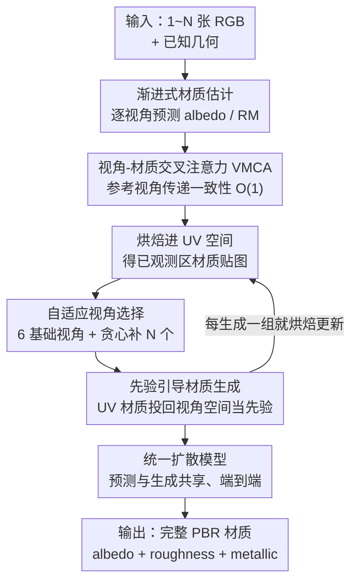

# MatMart: Material Reconstruction of 3D Objects via Diffusion

**会议**: CVPR 2026  
**论文**: [CVF Open Access](https://openaccess.thecvf.com/content/CVPR2026/html/Wu_MatMart_Material_Reconstruction_of_3D_Objects_via_Diffusion_CVPR_2026_paper.html)  
**代码**: 无  
**领域**: 3D视觉  
**关键词**: 材质重建, PBR材质, 扩散模型, 逆向渲染, 多视角一致性

## 一句话总结
MatMart 用单个扩散模型把"从输入图像精确预测 PBR 材质"和"为未观测区域生成材质"两步统一在一个端到端框架里，并配合渐进式推理 + 视角-材质交叉注意力（VMCA），实现了对任意数量、任意分辨率输入的高保真、可扩展材质重建。

## 研究背景与动机
**领域现状**：从 RGB 图像恢复 3D 物体的 PBR 材质（反照率 albedo、粗糙度 roughness、金属度 metallic）一直是视觉与图形学的难题。传统做法靠可微渲染做逐物体优化，需要大量拍摄图像、效率低且不稳定；近期则转向用扩散模型直接预测或生成材质贴图，给逆向材质分解带来了新思路。

**现有痛点**：作者指出基于扩散的框架仍有三个具体短板。其一，高保真重建既要材质估计准、又要忠实保留输入图像里的细节，而文字、logo 这类有意义的纹理用现有生成模型很难复刻。其二，要实用就得能吞下不同数量、高分辨率的输入，但现有方法常被网络设计和显存卡死——为了多视角一致性它们要把所有视角拼接做 cross-view attention，空间复杂度是 $O(N^2)$，视角一多或分辨率一高就扛不住。其三，很多方法依赖额外预训练模型或串多个模型，既增加训练/部署复杂度，又因模型间的域差异降低稳定性。

**核心矛盾**：保真度（保留输入细节）、可扩展性（任意视角数与高分辨率）、稳定性（少依赖外部模型）三者很难同时满足，现有方案往往顾此失彼——要么靠拼接所有视角换一致性但牺牲扩展性，要么靠多模型流水线换效果但牺牲稳定性。

**本文目标**：构建一个能同时做到高保真、可扩展、稳定的材质重建框架，把材质预测与生成统一起来。

**切入角度**：作者观察到——已观测视角应"尽量精确预测、保留细节"，未观测/遮挡区域才需要"生成补全"；而预测与生成的输出都是 PBR 材质，本质同构，可以共享一个模型。再者，不必把所有视角一次塞进网络，改成一轮轮渐进推理、只靠一个参考视角传递一致性信息，就能把复杂度压到常数。

**核心 idea**：用"先预测后生成"的两阶段流程 + 渐进推理 + VMCA，把材质预测与生成统一进单个扩散模型，端到端优化，从而在任意输入规模下既准又稳。

## 方法详解

### 整体框架
MatMart 要解决的是"给一张到多张 RGB 图、外加已知几何，输出整个 3D 物体的 PBR 材质"。它把任务拆成两个阶段：**第一阶段**对所有输入图像做渐进式材质预测（带 VMCA 保证跨视角一致），把预测结果烘焙（bake）进 UV 空间；**第二阶段**对 UV 上仍缺失的遮挡/未观测区域，自适应挑选生成视角，把已烘焙材质投影回视角空间当作"材质先验"，再用同一个扩散模型在视角空间里生成补全，生成一批就烘焙一批，交替推进直到 UV 覆盖足够。两个阶段的预测与生成都跑在同一个扩散模型上，端到端联合优化。

### 关键设计

**1. 两阶段重建：先精确预测保细节，再先验引导补未观测**

痛点直指"高保真要求估计准 + 细节全保留"，而纯生成式方法（如直接在 UV 空间生成的 TEXGen）因为 UV 空间语义弱，常产生模糊、artifact（如蓝色包上的红绳被生成成别的颜色）。MatMart 的做法是把"看得见"和"看不见"分开处理：第一阶段只对真实输入图像做材质**预测**，最大限度保留输入里的纹理细节，并烘焙进 UV；第二阶段才对 UV 上的空洞区域做**生成**，且生成发生在语义更丰富的视角空间（而非 UV 空间），生成时把第一阶段已经烘焙好的材质投影回当前视角作为"材质先验"喂给网络。这样生成不是从零脑补，而是被已知材质牢牢约束，跨视角更一致。消融证明：去掉第一阶段烘焙、全靠生成（W/o stage1 baking），albedo SSIM 从 0.945 掉到 0.917、渲染 FID 从 26.20 恶化到 42.40，说明"预测打底 + 生成补缺"显著优于纯生成。

**2. 视角-材质交叉注意力 VMCA：把跨视角一致性的复杂度从 $O(N^2)$ 压到 $O(1)$**

这是可扩展性的核心。传统方法为保证多视角一致要拼接所有视角做 cross-view attention，复杂度 $O(N^2)$，输入一多或分辨率一高就爆显存。MatMart 改成**渐进推理**：一轮只处理少量视角，但这样视角间就断了信息交换。为接回一致性，每轮额外引入一个"参考视角"（即上一轮的预测结果），于是每次推理有两类输入——待估计的目标视角（target）和带已知材质信息的参考视角（reference）。VMCA 在隐空间对二者做交叉注意力：

$$\mathbf{Z} = \left(\operatorname{Softmax}\!\left(\frac{\mathbf{Q}_\mathrm{Tgt}\cdot \mathbf{K}_\mathrm{Tgt+Ref}^T}{\sqrt{d}}\right)\cdot \mathbf{V}_\mathrm{Tgt+Ref}\right) \oplus \mathbf{V}_\mathrm{Ref}$$

其中 Query 只来自目标视角、Key/Value 来自目标+参考拼接，$\oplus$ 表示在序列维拼接。关键巧思是：参考视角**不希望被目标视角反向污染**，所以它不参与 Query、而是直接以 $\mathbf{V}_\mathrm{Ref}$ 原样输出。由于每轮 target 与 reference 数量固定、与输入总数 $N$ 无关，VMCA 的空间复杂度是 $O(1)$，于是能在有限显存下处理任意多输入和更高分辨率。实验里输入从 1 张涨到 20 张，峰值显存稳定在 24.03 GB 不变。

**3. 自适应视角选择 + 交替烘焙的分组生成：用最少视角覆盖最大区域，并始终用最新先验**

第二阶段要补 UV 上的空洞，得先决定"从哪些视角生成"。MatMart 先固定 6 个沿坐标轴分布的基础视角（信息量最大），再用贪心策略补选 $N$ 个：在球面上均匀采样 300 个候选视角，每轮挑那个能让 UV texel 覆盖率提升最多的，直到覆盖率达目标 $\rho=0.95$ 或视角数达 $N=10$ 为止。挑完后还按各视角的生成 mask 排序——待生成像素越少的视角越先生成，让早期生成尽量基于充分先验。生成时**交替烘焙**：每生成一组视角材质就立刻投影回 UV 更新贴图，更新公式为

$$\mathbf{T} \leftarrow \frac{\mathbf{T}'\cdot \mathbf{W}' + \mathbf{T}\cdot \mathbf{W}}{\mathbf{W}'+\mathbf{W}}, \quad \mathbf{W}'=\mathbf{S}'^{\lambda}, \quad \mathbf{W}\leftarrow \mathbf{W}'+\mathbf{W}$$

其中 $\mathbf{S}'$ 是表面法线与相机反向轴的余弦相似度（用来削弱掠射角处的材质贡献），$\lambda=6$ 调节其影响。这样下一组生成总能拿到"刚刚更新过"的最新材质先验。为效率起见每步生成一组（实验设组大小为 3），并用第一阶段材质当参考视角、配 VMCA 增强组间一致。消融显示：去掉材质先验（W/o mat. priors）会让各视角生成的 albedo 互相打架、烘焙后 UV 混乱，渲染 FID 从 26.20 恶化到 34.93。

**4. 统一单扩散模型架构：预测与生成共用一套权重、端到端优化**

很多方法靠多模型/预训练模型串流水线（如 Material Anything 先用预训练扩散模型生成 RGB 再预测材质），带来域差异和不稳定。MatMart 利用"两阶段输出都是 PBR 材质、都用 VMCA"这一共性，把预测与生成塞进**同一个**基于 Stable Diffusion 的扩散模型。为对齐两个任务的输入张量形状，缺失输入在特征空间用零填充——这个零填充同时充当任务指示器，让模型区分"现在是预测还是生成"。每个 attention block 含三种注意力：A 与 RM 之间交换信息的 cross-component attention、增强一致性的 VMCA、以及用文本 prompt 控制输出材质类型（albedo 还是 roughness&metallic）的 cross-attention。训练时在预测与生成任务间交替优化，用 v-prediction 为目标。不依赖任何外部预训练模型，从根上消除了模型间域差异引入的不稳定。

### 损失函数 / 训练策略
训练用 16 张 NVIDIA H20，在预测与生成任务间交替优化。每次迭代用 2 个目标视角 + 1 个参考视角（训练时参考视角设为真值材质）；生成任务里用基于深度的 warping 来得到材质先验与生成 mask 以提效；由于渐进估计的首个视角没有参考视角，额外加入"无参考视角"的预测训练。数据集沿用 IDArb（含 ABO、G-Objaverse、Arb-Objaverse）。先在 $256\times256$ 上训 20K 步（batch 16），再到 $512\times512$ 训 50K 步（batch 4），优化器 AdamW，学习率 $1\times10^{-4}$，目标为 v-prediction。推理可在单张 V100 上跑，借 Stable Diffusion 本身的高分辨率推理能力直接在 $1024^2$ 出结果，每个物体约 9–23 分钟（取决于选取视角数 $N$）。

## 实验关键数据

### 主实验
测试集为 Objaverse 子集 100 个物体，每物体随机环境光渲 9 视角，单视角用 1 张、多视角用 3 张输入，其余作评测。指标：albedo 用尺度不变 PSNR/SSIM，roughness/metallic 用 MSE，渲染图用 FID/LPIPS。

| 设置 | 方法 | Albedo SSIM↑ | Albedo PSNR↑ | Metallic MSE↓ | Roughness MSE↓ | Render FID↓ | Render LPIPS↓ |
|------|------|------|------|------|------|------|------|
| 单视角 | Material Anything | 0.879 | 25.97 | 0.036 | 0.014 | 54.16 | 0.111 |
| 单视角 | MaterialMVP | 0.901 | 27.57 | 0.026 | 0.013 | 38.27 | 0.089 |
| 单视角 | **Ours (1024²)** | **0.931** | **29.89** | **0.017** | **0.007** | **31.49** | **0.066** |
| 多视角 | Material Anything | 0.897 | 27.19 | 0.038 | 0.013 | 47.27 | 0.099 |
| 多视角 | MaterialMVP | 0.902 | 27.61 | 0.026 | 0.013 | 38.00 | 0.088 |
| 多视角 | **Ours (1024²)** | **0.945** | **32.10** | **0.015** | **0.008** | **26.20** | **0.052** |

MatMart 在单/多视角设置下、几乎所有指标上都领先；多视角时提升更明显（充分利用多视角信息），且分辨率从 512 升到 1024 进一步显著提升各项指标，验证了高分辨率推理对细节对齐的价值。真实数据集 StanfordORB 上也优于 MaterialMVP / Material Anything（后两者在强反光、跨视角接缝处易出问题）。

### 消融实验
多视角设置下：

| 配置 | Albedo SSIM↑ | Albedo PSNR↑ | Render FID↓ | Render LPIPS↓ | 说明 |
|------|------|------|------|------|------|
| Ours (full) | **0.945** | **32.10** | **26.20** | **0.052** | 完整模型 |
| W/o VMCA | 0.941 | 31.78 | 28.58 | 0.055 | 去掉视角-材质交叉注意力 |
| W/o mat. priors | 0.929 | 29.85 | 34.93 | 0.071 | 生成时不给材质先验 |
| W/o stage1 baking | 0.917 | 28.14 | 42.40 | 0.091 | 跳过第一阶段烘焙、全靠生成 |

### 关键发现
- **第一阶段烘焙贡献最大**：去掉后 FID 从 26.20 恶化到 42.40（掉点最猛），印证"预测打底"比"纯生成"对保真度至关重要。
- **材质先验次之**：去掉后跨视角生成不一致、烘焙后 UV 混乱，FID 升到 34.93。
- **VMCA 主要保一致性**：去掉后指标小幅下降（FID 28.58），但定性上 barrel 等物体的 albedo/roughness 出现明显跨视角不一致。
- **可扩展性实证**：输入视角 1→20，FID 从 37.39 降到 27.71 且在 10 个视角后趋于平台（更多视角主要帮重度自遮挡物体），而峰值显存恒为 24.03 GB，证明对任意输入规模的扩展性。

## 亮点与洞察
- **"预测+生成"用同一个扩散模型统一**：靠"两阶段输出都是 PBR 材质"这一同构性，把通常要多模型串联的任务收进单模型端到端训练，用零填充当任务指示器，既简化部署又消除模型间域差异——这个"用统一表征撑起多任务"的思路很可迁移。
- **VMCA 把一致性约束从 $O(N^2)$ 降到 $O(1)$**：核心是"参考视角只当 Key/Value、不当 Query，原样透传"，既传递一致性又不被目标视角污染。任何需要渐进/流式处理又要跨步一致的生成任务（视频、长序列纹理）都能借鉴。
- **交替烘焙保证"始终用最新先验"**：生成一组就回写 UV，下一组立刻基于更新后的材质继续，避免了一次性生成所有视角导致的相互冲突，是渐进式补全里很实用的工程范式。

## 局限与展望
- 作者承认：材质分解本身存在固有歧义，可能导致预测 albedo 出现整体色彩缩放（scaled color）。
- 强自遮挡物体需要更多视角才能补全，单/稀疏视角下未观测区域仍依赖生成质量。
- 自己观察：推理每物体需 9–23 分钟，相比纯前馈预测仍偏慢；评测仅用 100 个 Objaverse 物体 + StanfordORB，规模偏小，对极端材质（透明、各向异性、次表面散射）的覆盖未充分验证。
- 改进思路：可引入显式的尺度/光照解耦约束缓解 albedo 色彩缩放；或对自遮挡严重区域结合几何补全先验，减少所需生成视角数。

## 相关工作与启发
- **vs Material Anything**: 它用预训练扩散模型先为选定视角生成 RGB、再预测材质；MatMart 反过来先预测输入图材质再生成。生成 PBR 材质比生成 RGB 更简单（不必建模反射、光照变化），且不依赖预训练模型，避免了生成 RGB 与材质预测训练数据间的域差异——后者会拉低预测精度。
- **vs MaterialMVP**: 它从固定视角条件生成、视觉上好看但难保留输入外观（如蓝色包上的图标会丢）；MatMart 靠第一阶段预测 + 烘焙牢牢锁住输入纹理。
- **vs TEXGen**: 它直接在 UV 空间生成纹理，但 UV 语义弱、网络生成的 UV 贴图分辨率受限导致模糊与 artifact；MatMart 选择在语义更丰富的视角空间生成再烘焙回 UV。
- **vs NvDiffRec（逆向渲染）**: 逐物体优化、稀疏视角下难解耦材质与光照，新光照下渲染含噪；MatMart 是数据驱动的前馈式扩散框架，稀疏甚至单视角也能稳定出结果。

## 评分
- 新颖性: ⭐⭐⭐⭐ 两阶段统一 + VMCA 的 $O(1)$ 一致性约束是扎实且巧妙的组合创新，单点新意中等但工程整合度高。
- 实验充分度: ⭐⭐⭐⭐ 单/多视角 + 真实数据 + 完整消融 + 视角数/显存扩展性都有，唯测试集规模偏小。
- 写作质量: ⭐⭐⭐⭐ 动机—方法—实验逻辑清晰，框架图与公式到位。
- 价值: ⭐⭐⭐⭐ 高保真 + 任意视角可扩展 + 单模型部署，对 3D 资产材质生产实用性强。

<!-- RELATED:START -->

## 相关论文

- [\[CVPR 2026\] Intrinsic Image Fusion for Multi-View 3D Material Reconstruction](intrinsic_image_fusion_for_multi-view_3d_material_reconstruction.md)
- [\[CVPR 2026\] ICTPolarReal: A Polarized Reflection and Material Dataset of Real World Objects](ictpolarreal_a_polarized_reflection_and_material_dataset_of_real_world_objects.md)
- [\[CVPR 2026\] Material Magic Wand: Material-Aware Grouping of 3D Parts in Untextured Meshes](material_magic_wand_material-aware_grouping_of_3d_parts_in_untextured_meshes.md)
- [\[CVPR 2026\] DuoMo: Dual Motion Diffusion for World-Space Human Reconstruction](duomo_dual_motion_diffusion_for_world-space_human_reconstruction.md)
- [\[CVPR 2025\] Material Anything: Generating Materials for Any 3D Object via Diffusion](../../CVPR2025/3d_vision/material_anything_generating_materials_for_any_3d_object_via_diffusion.md)

<!-- RELATED:END -->
