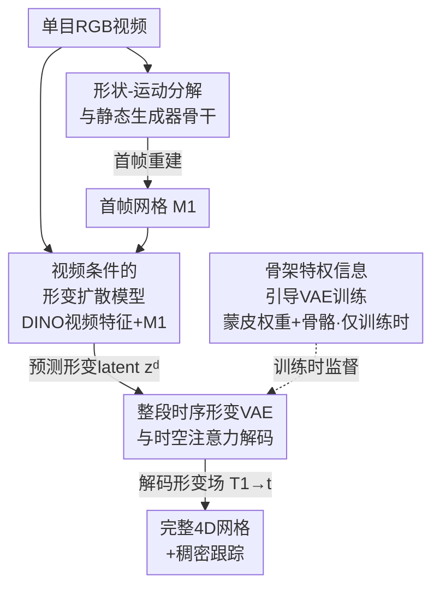

# Mesh4D: 4D Mesh Reconstruction and Tracking from Monocular Video

**会议**: CVPR 2026  
**论文**: [CVF Open Access](https://openaccess.thecvf.com/content/CVPR2026/html/Jiang_Mesh4D_4D_Mesh_Reconstruction_and_Tracking_from_Monocular_Video_CVPR_2026_paper.html)  
**代码**: mesh-4d.github.io（项目页，论文称代码/模型/benchmark 已开源）  
**领域**: 3D视觉  
**关键词**: 单目4D重建, 网格形变场, 时空注意力, 骨架先验, 潜在扩散

## 一句话总结
Mesh4D 是一个前馈式单目 4D 网格重建模型：把动态物体表示为「首帧静态网格 + 一段贯穿整个视频的形变场」，用一个由骨架信息监督、带时空注意力的 VAE 把整段形变压进紧凑 latent，再训练一个以视频和首帧网格为条件的潜在扩散模型一次性预测这段 latent，从而恢复出完整 3D 形状、运动和稠密跟踪，在 Objaverse 重建与新视角合成 benchmark 上超过此前 SOTA。

## 研究背景与动机

**领域现状**：单目 4D 重建要从一段普通 RGB 视频里同时恢复动态物体的 3D 形状和运动，应用于动画自动化、图形、机器人等。传统做法是 analysis-by-synthesis（逐帧拟合 NeRF / 3D Gaussian），近年兴起的前馈方法（DUSt3R/MonST3R 系、Cut3R、Geo4D、4DGT 等）能一次推理出动态场景的几何与帧间运动。

**现有痛点**：优化类方法只能重建视频里**可见**的那部分表面，遮挡和歧义会带来噪声，且逐场景优化慢。前馈类方法大多只在**两帧之间**估运动、只恢复可见点，无法拿到整段序列上完整物体的 4D 结构。另一类基于 3D-GS 的生成方法（L4GM、GVFD）追求的是「看起来合理的新视角图像」，并不真正关心几何与跟踪是否准确，大运动下还会出现 ghost 伪影。还有些方法（如 V2M4、ShapeGen4D）逐帧独立出网格再做时序对齐，没有显式建模运动，纹理也难以跨时间一致。

**核心矛盾**：要重建并跟踪视频里**看不见**的几何部分，必须有强 3D 与物理先验，而这种先验只能从数据里学——这正是潜在 3D 生成模型擅长的（它能在静态情形下脑补出完整物体）。问题是：这类生成先验能不能扩展到 4D，并且把目标从「好看的图」校准回「准确的形状与运动」？

**本文目标**：① 设计一个能把整段动画运动编码进紧凑 latent 的表示；② 在 4D 训练数据稀缺的前提下，借静态 3D 生成器的先验保证泛化；③ 建立一个真正衡量 3D 几何与运动质量（而非只看渲染图）的 benchmark。

**切入角度**：作者主张运动应当**从视频头到尾整体（holistically）建模**，而不是逐帧或逐两帧拼接；同时把物体表示**分解**为「首帧网格 + 形变场」，让形状和运动解耦。

**核心 idea**：用「首帧网格 $M_1$ + 贯穿全程的形变场 $\{T_{1\to t}\}$」表示 4D 物体，用一个骨架监督、带时空注意力的 VAE 把整段形变压成 latent，再用视频条件的扩散模型一次性生成它。

## 方法详解

### 整体框架

给定单目视频 $I=\{I_t\}_{t=1}^{T}$，Mesh4D 要输出首帧 3D 网格 $M_1=\langle V_1,F_1\rangle$ 和一组稠密形变场 $\{T_{1\to t}\}_{t=1}^{T}$，其中 $T_{1\to t}$ 给出网格上所有点从时刻 1 到时刻 $t$ 的位移，于是任意时刻的网格写成 $M_t=\langle V_1+T_{1\to t}(V_1),\,F_1\rangle$。这种「形状 + 形变」的分解让网格拓扑固定、顶点天然对应，从而免费得到稠密跟踪，也能让纹理跨时间一致。

整个系统有三块串起来：先用一个**现成的图像到 3D 生成器**（Hunyuan3D 2.1）从首帧 $I_1$ 重建静态网格 $M_1$（脚手架，不是本文贡献）；再用一个**形变 VAE** 把整段网格序列的形变编码进紧凑 latent $z^d$、并能从 $z^d$ 解码回顶点位移；最后用一个**形变扩散模型**，以视频 $I$ 和首帧网格 $M_1$ 为条件，前馈地生成这个 $z^d$。训练时 VAE 编码器吃到真值网格序列与骨架等「特权信息」学好 latent 空间；推理时编码器不参与，由扩散模型从视频直接产出 $z^d$，再走 VAE 解码器得到形变场。

### 关键设计

**1. 形状-运动分解与静态生成器骨干：把不可见几何交给预训练 3D 先验**

为应对单目视频信息有限、又要恢复看不见的几何，作者把问题拆成「先拿首帧的完整静态形状，再在它上面叠运动」。首帧网格 $M_1$ 不从零学，而是直接用在上百万 3D 样本上预训练的 Hunyuan3D 2.1：它基于 VecSet 表示，先从网格均匀采点云 $P$（带法向 $n$），编码出形状 latent $z^s=E_s(P;n)$，再由解码器 $D_s(Q;z^s)$ 在网格查询点上算 SDF、经 marching cubes 转成三角网格；纹理则用其材质生成模型从首帧贴出。借这个静态生成器的先验，模型能对各种类别的物体「脑补」出完整形状并保持鲁棒泛化——这是 4D 数据稀缺下能 work 的前提。与逐帧独立出网格的做法（V2M4、ShapeGen4D 等）相比，这里只用骨干重建**一次**首帧，后续完全靠形变场带动，运动被显式建模而非隐含在一串独立网格里。

**2. 整段时序形变 VAE 与时空注意力：把整段运动压成一个紧凑可扩散的 latent**

这是本文核心贡献。形变场 $T_{1\to t}$ 和 SDF 一样是无穷维对象，作者用一个 VAE 把它压进紧凑 latent：编码器 $z^d\sim E_d(\{M_t\}_{t=1}^{T};n,w,b)$ 吃整段网格序列，解码器 $T_{1\to t}(V_1)=D^d_t(V_1;z^d)$ 在顶点处恢复位移。关键是「整段一起编码」：先把首帧采点云 $P_1$ 用重心坐标映射到各帧得到逐帧对应点云 $\{P_t\}$，再把对应点拼接投影 $h_t=f_l(\mathrm{PE}(P_1)\oplus n_1\oplus \mathrm{PE}(P_t)\oplus n_t)$——因为点跨时间对应，这种拼接能直接喂给网络「这个点是怎么动的」。之后用一个 transformer，每个 block 依次做**空间注意力**（同帧内点之间）、**时间注意力**（同点跨帧）、**全局注意力**（所有帧所有 token），时间/全局注意力上还叠 1D RoPE 位置编码，从而关联不同点在整段时间上的轨迹。由于对所有点所有帧做注意力代价过高，先用 FPS 把点降采样、再 cross-attention 得到稀疏 latent token，经 $L=8$ 层交替注意力后投影出每帧 latent 分布的均值方差并采样得到 $z^d$；解码端再用 16 层时空注意力增强、最后以首帧顶点 $V_1$ 作 query 做 cross-attention 恢复形变场。训练损失为

$$L_{VAE}=\sum_{t=1}^{T}\big\|(V_t-V_1)-D^d_t(V_1;z^d)\big\|_2^2+\lambda L_{KL},$$

即顶点位移重建误差加上对 latent 空间正则的 KL 项（为效率只在随机顶点子集上算）。相比 Motion2VecSet 一次只处理两帧，整段联合编码被实验证明更稳更准（见消融）。

**3. 骨架特权信息引导 VAE 训练：用蒙皮权重和骨骼约束可能的形变空间**

注意编码器吃的信息比解码器输出的多——解码器只输出顶点位移，编码器却额外吃法向 $n$、蒙皮权重 $w\in\mathbb{R}^{M\times B_{\max}}$（$B_{\max}=64$，未用骨骼权重置零）和骨骼 $b$。这是「特权信息」：训练时可用来学到更好的 latent 空间，推理时**完全不需要**（那时 latent 由扩散模型从视频产出）。骨架以两种方式注入：一是给自注意力加偏置——按蒙皮相似度构造掩码 $M^s$，当两点蒙皮权重内积 $ww^\top>\epsilon_s$ 时允许互相注意、否则置 $-\infty$，

$$\hat h_t=\mathrm{softmax}\!\Big(\tfrac{h_t h_t^\top+M^s}{\sqrt{c}}\Big)h_t+h_t,$$

让属于同一刚性部件的点更倾向于一起运动；二是把每根骨骼的头尾位置 $b^h_t,b^t_t$ 投影成骨骼特征，再让点特征对骨骼特征做带掩码 cross-attention（掩码同样由蒙皮权重决定）。直觉上骨架给出了「哪些点会刚性地一起动」的强先验，使学到的形变更符合物理；消融显示去掉骨架信息会让刚性变换变差（如棍状物被扭曲）。⚠️ 公式中阈值与掩码细节以原文为准。

**4. 视频条件的形变扩散模型：从视频一次性生成形变 latent**

有了形变 VAE 的紧凑 latent 空间，重建就转化为「在给定视频和首帧网格时采样出 $z^d$」。作者在 Hunyuan3D 2.1 的形状扩散模型上扩展，让它学一个速度场 $v^d_\theta$，采用 flow-matching 目标

$$\min_{\theta}\ \mathbb{E}_{(z,I),t,\epsilon\sim\mathcal N(0,1)}\big\|v-v_\theta(z_t,t,\cdot)\big\|_2^2,\quad z_t=t\,z+(1-t)\,\epsilon,$$

推理时从高斯噪声出发用一阶 Euler ODE 迭代去噪得到 $\hat z^d$。条件信号有三路：视频特征用 DINO-Giant 逐帧提取、由 latent token 通过 cross-attention 融入；空间嵌入 $p_1$（取自首帧、训练时用 FPS 稀疏特征的位置、推理时对重建的 canonical mesh 做 FPS）给初始噪声空间感知、提升空间一致；以及额外的时间嵌入提升时序一致，并用首帧网格的高维形状特征 $z^s$ 做细节条件。相比 GVFD 只用空间嵌入，这里多了时间嵌入与形状特征条件，使运动和外观跨帧更一致。

> 自检：整体框架点名的三块——静态生成器骨干、形变 VAE、形变扩散模型——分别对应关键设计 1/2/4，骨架特权信息对应设计 3；框架图节点名与四个关键设计标题逐一同名同序（B↔1、E↔2、G↔3、D↔4，C/F/A 为输入/中间/输出脚手架），一致。

### 损失函数 / 训练策略
- **VAE 阶段**：最小化 $L_{VAE}$（顶点位移 L2 重建 + KL 正则，$\lambda$ 权重），只在随机顶点子集上评估以省算力；编码器吃法向、蒙皮权重、骨骼等特权信息。
- **扩散阶段**：flow-matching 速度预测目标（Eq. 2 形式），条件为 DINO 视频特征 + 首帧网格 $M_1$ 的空间/时间嵌入与形状特征 $z^s$。
- **数据**：从 Diffusion4D 整理过的 Objaverse-1.0 取动画资产，抽取骨架、蒙皮权重和带对应顶点的网格序列，过滤掉顶点/骨骼过多者，保留约 9k 实例，每个渲成最多 100 帧的正面视频。

## 实验关键数据

### 主实验

几何与跟踪评测（Objaverse 子集 benchmark，50 个测试序列）。IoU 越高越好，P2S / Chamfer / ℓ₂-Corr 越低越好；3D-GS 类方法不显式定义内外表面、且逐帧独立预测，故部分指标 N/A。

| 方法 | IoU ↑ | P2S ↓ | Chamfer ↓ | ℓ₂-Corr ↓ |
|------|-------|-------|-----------|-----------|
| HY3D 2.1 | 0.3071 | 0.0376 | 0.0370 | N/A |
| L4GM | N/A | 0.0459 | 0.0505 | N/A |
| GVFD | N/A | 0.0345 | 0.0378 | 0.0514 |
| **Ours** | 0.3731 | 0.0287 | 0.0273 | 0.0384 |
| **Ours (Aligned)** | **0.3949** | **0.0261** | **0.0243** | **0.0338** |

Mesh4D 在所有几何与跟踪指标上均为最优：相比此前最好的 GVFD，Chamfer 从 0.0378 降到 0.0273（Aligned 进一步到 0.0243），跟踪 ℓ₂-Corr 从 0.0514 降到 0.0384（Aligned 0.0338）；逐帧 HY3D 因缺时序信息姿态/形状常错。

新视角合成评测（同 benchmark）。PSNR/SSIM/CLIP 越高越好，LPIPS/FVD 越低越好。

| 方法 | PSNR ↑ | SSIM ↑ | LPIPS ↓ | CLIP ↑ | FVD ↓ |
|------|--------|--------|---------|--------|-------|
| HY3D 2.1 | 19.14 | 0.8976 | 0.1195 | **0.9174** | 692.2 |
| L4GM | 18.07 | 0.8939 | 0.1453 | 0.8954 | 747.3 |
| GVFD | 17.31 | 0.8912 | 0.1459 | 0.8802 | 905.0 |
| **Ours** | 19.67 | 0.9018 | 0.1087 | 0.9141 | 601.9 |
| **Ours (Aligned)** | **19.88** | **0.9030** | **0.1052** | 0.9141 | **572.7** |

除 CLIP 略低于 HY3D 外，其余全部最优；FVD 从 HY3D 的 692.2 降到 572.7，时序一致性明显更好。⚠️ CLIP 略低的原因是本文纹理只来自首帧、HY3D 逐帧重新生成纹理，因此这项不可直接当作劣势比较。

### 消融实验

形变 VAE 的关键设计消融（测试时用真值首帧网格作 canonical mesh，故数值整体高于主表）。

| 配置 | IoU ↑ | P2S ↓ | Chamfer ↓ | ℓ₂-Corr ↓ | 说明 |
|------|-------|-------|-----------|-----------|------|
| w/o temp & global attention | 0.6328 | 0.0153 | 0.0113 | 0.0160 | 去掉时间+全局注意力 |
| w/o skeleton information | 0.6704 | 0.0148 | 0.0107 | 0.0138 | 去掉骨架特权信息 |
| **Full (Ours)** | **0.7039** | **0.0144** | **0.0099** | **0.0117** | 完整 VAE |

### 关键发现
- **时空注意力贡献最大**：去掉时间+全局注意力后 IoU 从 0.7039 跌到 0.6328、ℓ₂-Corr 从 0.0117 升到 0.0160（跟踪误差增约 37%），可视化上脚部出现 jitter、误差变大——说明整段相关建模对稳定运动至关重要。
- **骨架信息次之但明显**：去掉后 IoU 跌到 0.6704、跟踪 0.0138，棍状刚性物体被扭曲，印证骨架给的「哪些点刚性同动」先验有效。
- **整段编码 > 逐两帧编码**：相比 Motion2VecSet 一次两帧，整段联合编码在重建与跟踪上更优（设计动机即来源于此）。
- **canonical mesh 质量是瓶颈**：GVFD/L4GM 常恢复不出准确首帧形状，而依托大规模 3D 生成器能避免「极端错误的 canonical mesh」，这是高质量 4D 重建的前提。

## 亮点与洞察
- **「首帧网格 + 形变场」的分解表示很优雅**：拓扑固定使顶点天然对应，稠密跟踪和跨时间一致纹理几乎免费得到，比逐帧独立出网格再对齐干净得多。
- **特权信息（骨架）只在训练时用**：把蒙皮权重/骨骼当作「训练期可见、推理期不需要」的监督来塑形 latent 空间，是一个可迁移的范式——推理时仍只需单目视频，却享受到了刚性先验。
- **整段 holistic 建模而非逐两帧拼接**：时空注意力（空间/时间/全局 + RoPE）让模型看到完整轨迹，消融显示这是掉点最狠的部件，提示「运动要整体看」这个直觉确实成立。
- **校准评测目标**：作者特意建了一个聚焦 3D 几何与运动质量（而非只看渲染图）的 benchmark，纠正了此前 4D 生成偏向「好看」的评测偏差。

## 局限与展望
- **依赖高质量 canonical mesh**：整条管线建立在首帧静态重建之上，首帧错了后续全错；对静态生成器骨干能力有强依赖。
- **无法表达拓扑变化**：固定首帧网格拓扑、只叠形变场，因此分裂/融合/穿洞这类拓扑改变无法表示。
- **强非刚性物体困难**：训练依赖带骨架的刚性/准刚性动画资产，对高度非刚性（如流体、布料大变形）对象重建困难。
- **训练数据需骨架/蒙皮标注**：依赖从 Objaverse 过滤出的带骨架动画资产（约 9k），数据获取受限可能影响类别覆盖。
- 可改进方向：放开拓扑约束（允许 time-varying topology）、把骨架先验泛化到无骨架资产、或对静态首帧重建错误做闭环修正。

## 相关工作与启发
- **vs GVFD**：GVFD 把 4D 网格嵌进 Gaussian Variation Field、从视频推 latent，但目标是「合理的新视角图」、几何不准；Mesh4D 直接在 4D 网格上做时空 transformer，几何/跟踪指标全面更优，并额外引入时间嵌入与形状特征条件。
- **vs L4GM**：L4GM 用 ImageDream 补缺失视角再训前馈 4D Gaussian 重建器，几何/canonical 形状常失真、大运动有 ghost；Mesh4D 靠网格 + 形变场显式建模运动，无 ghost 且跟踪准确。
- **vs V2M4 / ShapeGen4D**：它们逐帧独立出网格或只与首帧共享查询点对齐 latent、不直接预测稠密对应；Mesh4D 整段联合编码并以首帧顶点为 query 直接恢复稠密形变场，天然支持跟踪。
- **vs Motion2VecSet**：后者一次只编码两帧网格，Mesh4D 整段序列联合编码，被证明对长程运动更稳更准。
- **vs HY3D 2.1（逐帧）**：作为骨干被复用，但逐帧独立推理缺时序、姿态/形状易错、纹理 flicker；Mesh4D 在其上加时空注意力与形变场，把它从静态升级到时序一致的 4D。

## 评分
- 新颖性: ⭐⭐⭐⭐ 「整段形变 VAE + 骨架特权信息 + 视频条件扩散」组合新颖，分解表示干净，但各组件多为已有思想的巧妙拼装。
- 实验充分度: ⭐⭐⭐⭐ 几何/跟踪/NVS 三类指标齐全、与三个 SOTA 对比、两项关键消融到位；不足是仅在自建 Objaverse 子集评测、缺真实世界视频验证。
- 写作质量: ⭐⭐⭐⭐ 动机清晰、图文对应好、贡献明确；部分注意力掩码与符号细节偏密。
- 价值: ⭐⭐⭐⭐ 把单目 4D 重建从「好看」校准回「几何/运动准确」，分解表示与特权信息范式对后续工作有借鉴意义。

<!-- RELATED:START -->

## 相关论文

- [\[CVPR 2026\] 4DEquine: Disentangling Motion and Appearance for 4D Equine Reconstruction from Monocular Video](4dequine_disentangling_motion_and_appearance_for_4d_equine_reconstruction_from_m.md)
- [\[CVPR 2026\] V-DPM: 4D Video Reconstruction with Dynamic Point Maps](v-dpm_4d_video_reconstruction_with_dynamic_point_maps.md)
- [\[CVPR 2026\] Illumination-Consistent Human-Scene Reconstruction from Monocular Video](illumination-consistent_human-scene_reconstruction_from_monocular_video.md)
- [\[CVPR 2026\] GP-4DGS: Probabilistic 4D Gaussian Splatting from Monocular Video via Variational Gaussian Processes](gp-4dgs_probabilistic_4d_gaussian_splatting_from_monocular_video_via_variational.md)
- [\[ICCV 2025\] Vivid4D: Improving 4D Reconstruction from Monocular Video by Video Inpainting](../../ICCV2025/3d_vision/vivid4d_improving_4d_reconstruction_from_monocular_video_by_video_inpainting.md)

<!-- RELATED:END -->
