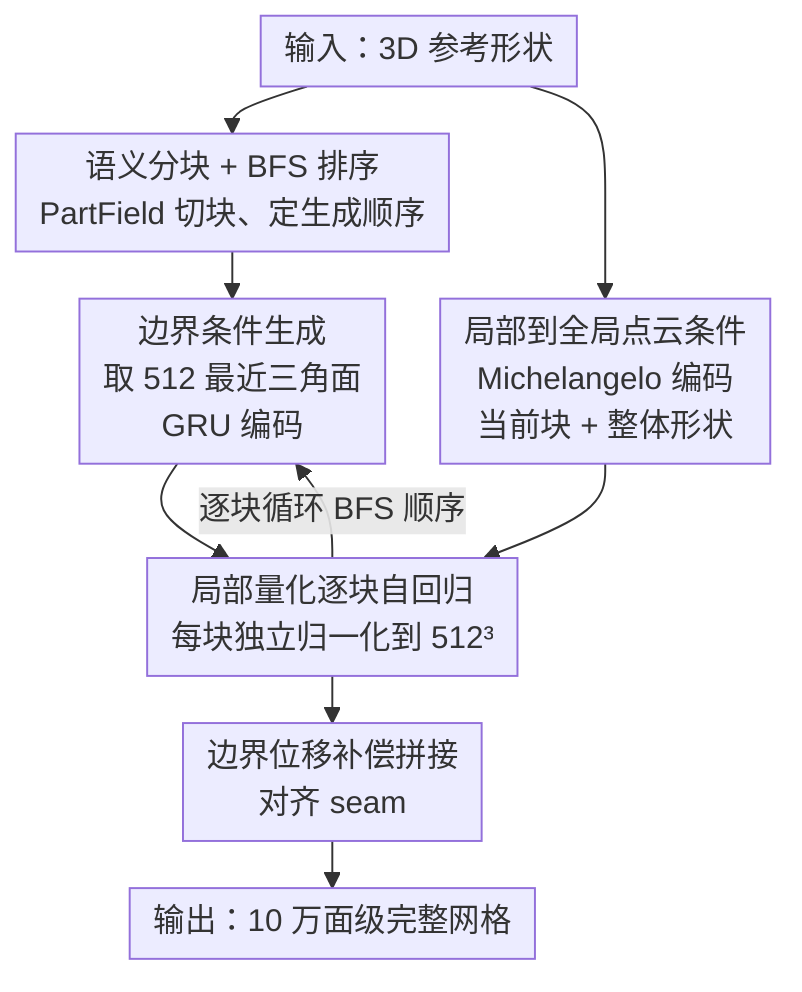

# MeshMosaic: Scaling Artist Mesh Generation via Local-to-Global Assembly

**会议**: CVPR 2026  
**论文**: [CVF Open Access](https://openaccess.thecvf.com/content/CVPR2026/html/Xu_MeshMosaic_Scaling_Artist_Mesh_Generation_via_Local-to-Global_Assembly_CVPR_2026_paper.html)  
**代码**: [项目页](https://xrvitd.github.io/MeshMosaic/index.html)  
**领域**: 3D视觉  
**关键词**: 艺术家网格生成、自回归、局部到全局、边界条件、局部量化

## 一句话总结
MeshMosaic 把"整张网格一口气自回归生成"换成"先切块、逐块生成、再无缝拼接"的局部到全局策略，靠共享边界条件 + 逐块独立量化突破了序列长度和量化分辨率两大瓶颈，用 0.5B 小模型就把艺术家网格规模从约 8K 面拉到 10 万面以上，几何保真度和用户偏好都全面超过现有 SOTA。

## 研究背景与动机

**领域现状**：艺术家手工建模的三角网格（artist mesh）是影视、游戏、AR/VR 的基石，它的特点是拓扑风格化、边流有方向、三角面密度不均、有锐边和对称结构。继 MeshGPT 之后，主流做法是把无序网格"序列化"成 token，用 GPT 式自回归 transformer 来逐 token 预测三角面，代表作有 MeshAnythingV2、BPT、TreeMeshGPT、DeepMesh 等。

**现有痛点**：这类自回归方法卡在两个地方。其一是**长序列瓶颈**——整张网格序列化后 token 数巨大，transformer 难以处理，导致只能生成约 8K 面级别的网格；而生产级角色或主角资产动辄 10 万面以上，差了一个数量级。其二是**量化分辨率受限**——为了把坐标塞进有限词表，整张网格被统一量化（如 DeepMesh 用 $512^3$ 网格量化整体），小物体的细节被粗糙的全局网格抹平，锐边和精细结构难以还原。

**核心矛盾**：想要高面数 + 高细节，就需要长序列 + 高量化分辨率；但 transformer 的算力和词表又把序列长度和量化粒度死死压住。"整张网格一次建模"这个范式本身把分辨率和规模耦死了。

**本文目标**：在不暴涨 token 序列、不牺牲量化粒度的前提下，把艺术家网格生成规模拉到 10 万面以上，同时保证跨区域的连续性、对称性和密度结构。

**切入角度**：作者从经典**马赛克镶嵌艺术**得到启发——整幅马赛克的全局复杂性和连贯性，是由一块块精致的局部瓷砖拼装出来的。网格也可以这样：把整张网格切成语义有意义的小块（patch），每块单独自回归生成、单独全分辨率量化，再靠共享边界把它们缝起来。

**核心 idea**：用"局部到全局的分块生成 + 拼接"代替"整体一次性生成"——每块 patch 用完整点云、全分辨率量化独立生成，相邻块之间共享边界条件保证无缝衔接，从根本上绕开长序列瓶颈并提升有效量化分辨率。

## 方法详解

### 整体框架
给定一个 3D 参考形状，目标是生成一张艺术家风格的三角网格。MeshMosaic 把这件事拆成"逐块生成"：推理时先用 PartField 对输入形状做**语义分割**得到若干 patch，并确定它们的生成顺序；然后**逐块自回归生成**，每块在生成时都接收来自已生成相邻块的**边界条件**、当前块与整体形状的**局部到全局点云特征**，并在该块自己的归一化坐标系里做**局部量化**；最后把各块按边界位移补偿**拼接（gluing）**成一张干净、高细节的完整网格。整条流水线把"分辨率"和"规模"解耦：序列长度由单块大小决定（不再随整体面数爆炸），量化粒度则因为每块独立归一化到 $[0,1]$ 而获得更高的等效合并分辨率。

### 关键设计

**1. 局部到全局的语义分块与 BFS 生成顺序：把"整张长序列"拆成可管理的小块**

直接自回归生成整张网格，会同时撞上长序列和低量化分辨率两堵墙。MeshMosaic 的第一招是把形状切成多个 patch、逐块生成，这样每块的输入 token 数可控，又能在块内保留精细粒度。推理时用 **PartField** 做语义分割——它把形状表示为连续特征场，能产出贴合曲率流、语义对齐的边界，既利于真实感也方便后续编辑。切完块后还要定顺序：两个 patch 若有一对分属不同 segment 的相邻三角面就算相邻，于是从空间最低的 patch 出发做**广度优先搜索（BFS）**，当前块有多个邻居时优先选坐标最低的那个，保证排序唯一确定。BFS 的关键作用是——除了新连通分量，每个后续块都至少连接到一个已生成块，从而能把关键的边界信息一路传播下去，维持结构的对称与平滑。

**2. 共享边界条件与 GRU 注入：让相邻块"看见"邻居，避免断边、密度跳变、对称丢失**

如果对每块都用同一套网络、不管它和邻居的连接关系，就会出现断裂边界、密度不规则、对称丢失等连续性问题。为此，生成某块时，作者把**已生成相邻块的三角面当作边界条件**喂进来。具体做法：对当前块只挑空间上**最近的 512 个三角面**（数据集里没有分割块的边界三角面超过这个数），避免序列过长导致的低效和信息稀释；这些三角面经 tokenizer 编码后，送进一个 **GRU（门控循环单元）** 网络得到边界 embedding。选 GRU 而非简单池化或定长编码器，是因为不同 patch 的边界长度随几何复杂度变化，GRU 能处理变长序列、捕捉时序依赖并选择性保留长上下文里的边界信息。拿到边界 embedding 后，作者把它**拼接到目标块 token 序列的最前面**，让自注意力同时作用于边界 token 和块内 token，使共享边界处的三角面自然延伸、融入邻块。对第一个块（没有任何先验边界），则喂入一段全是终止符的占位 token 作为中性起始上下文。

**3. 逐块局部量化与边界位移补偿拼接：在不涨词表的前提下拿到更高有效分辨率，并消除 seam 错位**

这是突破量化分辨率瓶颈的核心。以往方法（如 DeepMesh）对整张网格统一用 $512^3$ 量化，小物体细节被全局网格抹平。MeshMosaic 改成**每块独立归一化到 $[0,1]$ 再用 $512^3$ 量化**——因为每块只覆盖局部空间，归一化后同样的 $512^3$ 词表对应到原始尺度上就是更细的格子，等效合并分辨率更高，锐边和精细结构得以保留。每块还配 16,384 个采样点作为输入（baseline 是对整体只采一组 16,384 点），既提分辨率又提供更丰富的条件信息。但局部量化会给每块带来微小位置偏移，若不处理，patch 接缝处会出现不连续。作者的解法是**位移补偿拼接**：计算当前块所引用的边界条件面，与它们在已拼装块中对应的原始量化位置之间的位移，然后把整个当前块按这个位移平移，精确对齐到已有部分。由于块间边界三角面是被精确复制的，这个 gluing 过程稳定且计算高效，最终拼出统一、细节丰富的完整网格。

**4. 局部到全局点云条件 + 训练期随机分块：用全局上下文锚住局部生成，并提升泛化与多样性**

边界条件只保证了**局部连续**，要保证**全局协调**还得给网络全局视野。作者在生成每块时，同时条件化于**当前块点云**和**整体形状点云**两组特征，二者都用冻结的 **Michelangelo 编码器**提取，再与 GRU 边界特征拼接，作为 transformer 的最终条件输入——这样每块既知道自己长什么样，也知道它在整体里该是什么样。训练侧则有意区别于推理：语义分割较慢且会降低多样性，所以训练时改用**随机分块**。给定有 $N_f$ 个面的网格 $M$，patch 数设为 $N_{seg} = \frac{N_f}{2000} \times \lambda_{rand}$，其中 $\lambda_{rand}$ 在 $[0.5, 2.5]$ 间随机采样以增加多样性；分母 2000 是为了让每块 token 化后的序列长度接近 9K 的窗口大小，利于高效训练。具体用最远点采样选 $N_{seg}$ 个聚类中心，再用 Voronoi 分解按中心把网格切成块，BFS 排序取边界。作者还额外整理了一批带高质量连通分量标注的网格，直接用每个连通分量当一块，支撑更规整一致的分块并训练语义推理能力。推理时块数不显式约束，由 PartField 默认配置决定，模型能灵活适配从单块到几百块的情形。

### 损失函数 / 训练策略
实现基于已开源的 0.5B 参数 **DeepMesh** 模型微调：通过零初始化的线性层渐进融合新引入的 GRU 边界编码器和全局点云特征，局部点云特征直接映射到原始输入点云上。训练数据是精选的 **310K** 网格（其中约 90K 带连通分量信息），在 **32 张 NVIDIA H20 96GB GPU** 上训练 7 天，余弦学习率从 $1\times10^{-4}$ 衰减到 $1\times10^{-5}$，截断窗口大小沿用 DeepMesh 的 9K（50% 重叠）。训练和推理都用 KV-caching，采样温度 0.5 以保证生成稳定。

## 实验关键数据

### 主实验
在 ShapeNet、Thingi10K、Objaverse 三个公开数据集各随机取 100 个样本，与 MeshAnythingV2、BPT（0.5B，与本文同规模）、TreeMeshGPT、DeepMesh 对比，用 Hausdorff 距离（HD）、Chamfer 距离（CDL1/CDL2）、法向一致性（NC）、F-score（F1），以及专门衡量锐边保持的 Edge Chamfer Distance（ECD）和 Edge F-score（EF1）。

| 数据集 | 方法 | HD ↓ | CDL1 ↓ | NC ↑ | F1 ↑ | ECD ↓ | EF1 ↑ |
|--------|------|------|--------|------|------|-------|-------|
| ShapeNet | BPT | 0.017 | 0.003 | 0.962 | 0.875 | 0.040 | 0.159 |
| ShapeNet | DeepMesh | 0.037 | 0.004 | 0.967 | 0.791 | 0.056 | 0.177 |
| ShapeNet | **Ours** | 0.037 | **0.003** | **0.973** | **0.929** | **0.052** | **0.211** |
| Thingi10K | BPT | 0.157 | 0.035 | 0.875 | 0.496 | 0.051 | 0.179 |
| Thingi10K | DeepMesh | 0.165 | 0.026 | 0.853 | 0.321 | 0.031 | 0.137 |
| Thingi10K | **Ours** | **0.051** | **0.004** | **0.942** | **0.746** | **0.017** | **0.271** |
| Objaverse | BPT | 0.151 | 0.034 | 0.846 | 0.502 | 0.027 | 0.164 |
| Objaverse | DeepMesh | 0.111 | 0.016 | 0.866 | 0.471 | 0.021 | 0.168 |
| Objaverse | **Ours** | **0.072** | **0.007** | **0.919** | **0.785** | **0.006** | **0.348** |

可以看到：在简单的 ShapeNet 上本文与 BPT 互有胜负但综合最优（F1 0.929、EF1 0.211 均第一）；而一旦形状变复杂（Thingi10K、Objaverse），本文优势急剧拉大——Thingi10K 上 HD 从 BPT 的 0.157、DeepMesh 的 0.165 降到 0.051，F1 从 ~0.5 提到 0.746；Objaverse 上 ECD 低到 0.006、EF1 高到 0.348，锐边保持遥遥领先。这印证了局部量化对细节和锐边的增益在复杂形状上最明显。

### 用户研究
采样 10 个测试模型，27 位有计算机图形学/3D 建模专长的专业用户匿名对 5 种方法在四个维度打分（每类只给前三名打 3/2/1 分，其余 0 分）。

| 方法 | Neatness ↑ | Artistry ↑ | Similarity to GT ↑ | Detail Recovery ↑ |
|------|-----------|-----------|--------------------|--------------------|
| MeshAnythingV2 | 0.864 | 0.780 | 0.612 | 0.628 |
| BPT | 1.040 | 0.932 | 1.072 | 1.084 |
| TreeMeshGPT | 0.696 | 0.684 | 0.600 | 0.512 |
| DeepMesh | 0.712 | 0.808 | 0.772 | 0.848 |
| **Ours** | **2.780** | **2.785** | **2.912** | **2.912** |

本文在四个维度全部第一，且分数（约 2.8–2.9）远高于第二名 BPT（约 1.0–1.1）——专业用户的偏好与几何指标趋势一致。作者解释，竞品分数低主要是因为单遍自回归模型在长而复杂的网格上经常"卡住"或失败，产出不完整网格；BPT 输出更稳定故排第二，但整体质量和细节仍不如本文。

### 关键发现
- **复杂形状上优势最大**：三个数据集复杂度递增，本文领先幅度也随之扩大；对一架复杂战斗机模型，本文能用近 3 万面重建出精细细节，而其他方法通常只能产出几百到几千面。
- **锐边/边缘指标提升最显著**：ECD、EF1 这类专测锐边的指标领先最多（Objaverse ECD 0.006、EF1 0.348），说明逐块局部量化的"高有效分辨率"主要兑现在高频细节和锐边上。
- **小模型大效果**：仅 0.5B 参数就超过同规模 BPT-0.5B，几何完整性甚至超过未公开规模的商业版 Hunyuan3D。
- ⚠️ 各项条件（边界条件、不同分割输入、文本/图像输入、运行时间、多样性等）的消融实验在原文 Appendix A.2，正文未给消融表格，具体数字以原文附录为准。

## 亮点与洞察
- **"分块 + 局部归一化量化"是提分辨率的免费午餐**：不改词表、不增加单块序列长度，仅靠把每块独立归一化到 $[0,1]$ 再 $512^3$ 量化，就换来更高的等效合并分辨率——这个思路可迁移到任何受词表大小限制的结构化 3D 自回归生成。
- **GRU 处理变长边界条件很巧**：边界三角面数量随几何复杂度浮动，用 GRU 而非定长/池化编码，天然吃变长序列又能选择性记忆，是个轻量但贴合问题的选择。
- **位移补偿拼接把"局部量化的副作用"反过来利用**：局部量化必然引入接缝错位，作者不回避，而是用复制的边界面算位移、整块平移对齐，既消错位又因边界精确复制而稳定高效。
- **训练随机分块、推理语义分块的解耦**：训练用随机 Voronoi 分块提多样性和泛化，推理用 PartField 语义分块求质量与可编辑性——同一框架两套分块策略，是很实用的工程洞察。
- 最"啊哈"的地方：把困扰自回归网格生成多年的长序列瓶颈，用"马赛克式分块拼装"这一范式级转变彻底绕开，而不是在 tokenizer/注意力上做边际优化。

## 局限与展望
- **远距离对称耦合弱**：边界条件本质是局部的，距离较远的对称部件之间耦合不足。如原文 Fig.10 所示，人物两条手臂在连通性和密度合理的情况下仍出现轻微不对称；作者建议引入全局感知机制来耦合远距离部件。
- **依赖外部分割质量**：推理时块的划分完全交给 PartField 默认配置，分割边界的好坏会直接影响拼接质量和最终网格结构（⚠️ 不同分割输入的影响在附录，具体以原文为准）。
- **生成速度与成本**：逐块自回归仍是串行过程，10 万面级网格的生成耗时未在正文给出；作者把多节点同步生成、自适应量化列为未来工作以进一步提速提质。
- 训练成本不低（32×H20 训 7 天），复现门槛较高。

## 相关工作与启发
- **vs DeepMesh / BPT（整体自回归）**: 它们都把整张网格序列化后一次性自回归，受长序列和统一量化双重限制，约 8K 面封顶；本文恰恰是基于 DeepMesh-0.5B 微调，但改成分块生成 + 局部量化，规模直接拉到 10 万面以上，且同参数量下质量更高。
- **vs Meshtron（滑窗 hourglass）**: Meshtron 用 hourglass + 50% 重叠滑窗把长序列切成定长窗口来缓解长度问题，本文沿用了 9K 窗口设定，但更进一步从"切序列"上升到"切几何块"，并配套边界条件和局部量化，解决的是分辨率而不只是序列长度。
- **vs 基于分割的部件生成（PartCrafter / PartField）**: 它们把分块/部件作为结构先验用于可控合成或重建，本文把语义分割（PartField）当作生成顺序和量化粒度的组织工具，目的不是"生成部件"而是"为高分辨率自回归网格生成解耦规模与分辨率"。

## 评分
- 新颖性: ⭐⭐⭐⭐⭐ 从"整体一次生成"到"局部到全局分块拼装"的范式级转变，彻底绕开长序列瓶颈
- 实验充分度: ⭐⭐⭐⭐ 三数据集 + 6 项几何指标 + 27 人专业用户研究都很扎实，但正文未放消融表（在附录）
- 写作质量: ⭐⭐⭐⭐⭐ 动机—方法—实验逻辑清晰，马赛克类比贴切，图示丰富
- 价值: ⭐⭐⭐⭐⭐ 把艺术家网格生成推到 10 万面级且小模型可用，对游戏/影视生产管线有直接价值

<!-- RELATED:START -->

## 相关论文

- [\[CVPR 2026\] MeshRipple: Structured Autoregressive Generation of Artist-Meshes](meshripple_structured_autoregressive_generation_of_artist-meshes.md)
- [\[CVPR 2026\] LoG3D: Ultra-High-Resolution 3D Shape Modeling via Local-to-Global Partitioning](log3d_ultra-high-resolution_3d_shape_modeling_via_local-to-global_partitioning.md)
- [\[ICCV 2025\] MeshAnything V2: Artist-Created Mesh Generation with Adjacent Mesh Tokenization](../../ICCV2025/3d_vision/meshanything_v2_artist-created_mesh_generation_with_adjacent_mesh_tokenization.md)
- [\[CVPR 2026\] Mesh-Pro: Asynchronous Advantage-guided Ranking Preference Optimization for Artist-style Quadrilateral Mesh Generation](mesh-pro_asynchronous_advantage-guided_ranking_preference_optimization_for_artis.md)
- [\[CVPR 2026\] ActivePolicy: Active Gaussian Reconstruction and Optimization Strategy Based on Global-Local Information Gain](activepolicy_active_gaussian_reconstruction_and_optimization_strategy_based_on_g.md)

<!-- RELATED:END -->
