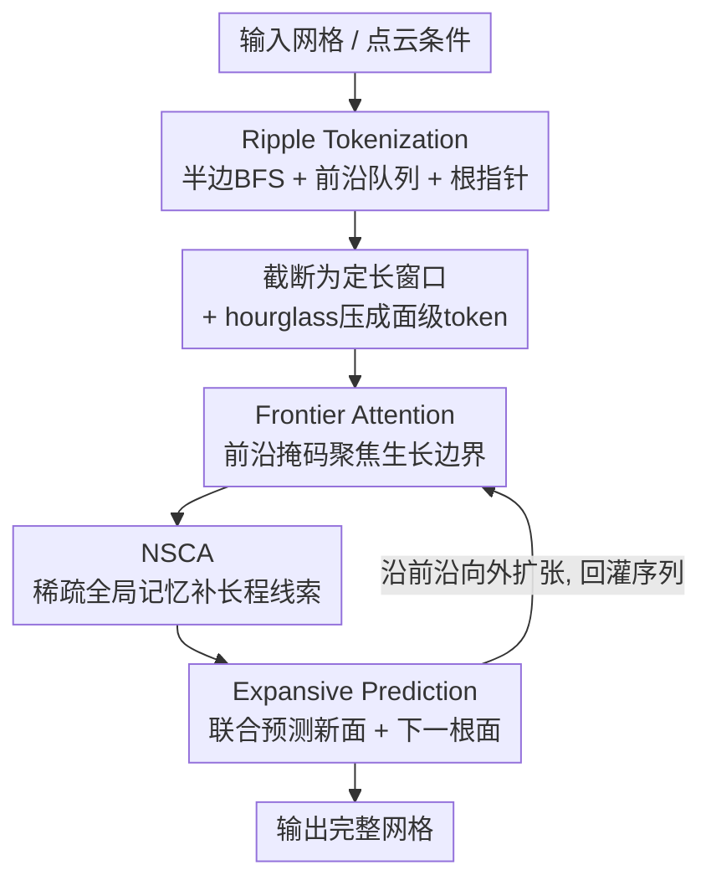

# MeshRipple: Structured Autoregressive Generation of Artist-Meshes

**会议**: CVPR 2026  
**论文**: [CVF Open Access](https://openaccess.thecvf.com/content/CVPR2026/html/Lin_MeshRipple_Structured_Autoregressive_Generation_of_Artist-Meshes_CVPR_2026_paper.html)  
**代码**: 无（项目页 https://maymhappy.github.io/MeshRipple/ ）  
**领域**: 3D视觉  
**关键词**: 3D网格生成, 自回归, 网格分词, 拓扑对齐, 稀疏注意力

## 一句话总结
MeshRipple 让自回归网格生成像水面涟漪一样从一条「活动生成前沿」向外扩张：通过一种「前沿感知的 BFS 分词」把下一个面的相关上下文锁死在序列尾部，使截断训练窗口天然覆盖到该有的局部邻域，再配合「联合预测面+下一根面」的扩张式解码和一个稀疏全局记忆模块，从根本上缓解了现有方法生成网格时频繁出现的破洞和碎片，在艺术家网格生成上全面超过近期强基线。

## 研究背景与动机

**领域现状**：把网格直接生成出来主要有两条路。一条是用扩散模型在隐空间生成连续场、再用 Marching Cubes 抽表面（如 3DShape2VecSet、CLAY、Trellis），几何还行但拓扑不可控——抽出来的网格过密、不规则、不符合艺术家习惯，要大量后处理。另一条是自回归（AR）路线：把网格按面/顶点序列化成 token，学一个尊重网格连通性的 next-token 分布（MeshGPT、MeshAnythingV2、BPT、DeepMesh 等），输出更结构化、更接近生产可用的「艺术家网格」。

**现有痛点**：大而精细的网格序列化后 token 流极长，AR 训练根本喂不下。于是 SOTA 普遍用「截断训练」：把序列切成固定长度窗口，每个窗口独立训练，推理时用滚动 KV cache 近似更长上下文。问题在于——现有分词方案（坐标排序、深度优先扩张、块/patch 编码）**都不保证下一个面真正相关的邻域 token 落在这个截断窗口里**。模型经常被迫在「看不到正确局部邻域」的情况下预测连通关系，结果就是破洞、断面、碎片化的组件。推理时滚动 KV cache 也救不了，因为模型从来没在「真实上下文」下被一致地训练过。DeepMesh、MeshRFT、QuadGPT 用强化学习/偏好微调改善拓扑质量和风格，但并没有从机制上解决连通性错误。

**核心矛盾**：截断窗口（受显存约束、必须有限）和「下一个面的拓扑相关上下文到底在序列哪个位置」之间是错位的——分词顺序由几何/坐标决定，而不是由「谁和当前要生成的面相邻」决定，所以相关 token 可能散落在窗口之外。

**本文目标**：设计一种分词 + 模型，使得（1）任意要预测的下一个面，它的相关邻域**始终**落在序列尾部、被截断窗口覆盖；（2）解码过程被约束在「沿一个连贯表面生长」而不是自由乱采三角面；（3）在不爆显存的前提下还能用到对称/重复这类长程线索。

**切入角度**：作者观察到，如果让面的生成顺序紧贴网格表面的拓扑、像涟漪一样从一条「活动前沿」向外推进，那么「下一个面相邻的那些面」自然就是最近刚生成的那批，永远在序列尾部。

**核心 idea**：用「前沿感知的半边 BFS 遍历」把分词顺序和表面拓扑对齐，让截断窗口天然包含正确局部上下文，再用扩张式解码把生成限制在前沿连通生长上，并用稀疏全局注意力补长程依赖。

## 方法详解

### 整体框架

MeshRipple 要解决的是「截断 AR 训练下生成大而拓扑完整的网格」。整体转法是：输入网格（或点云条件）先经 **Ripple Tokenization** 序列化成 token 序列，再切成固定长度截断窗口喂给一个结构化 AR Transformer；模型两端用 hourglass 层在坐标级↔顶点级↔面级 token 之间转换，主干是 2×N 个相同 block，每个 block 含一层 **Frontier Attention**（前沿掩码）、一层 self-attention、一层点云条件 cross-attention（图中省略）和一层 **NSCA**（稀疏全局记忆）；最后用 **Expansive Prediction** 头联合预测「从当前根面长出的新面」和「下一个要扩张的根面」，逐步把表面向外推。

### 关键设计

**1. Ripple Tokenization：把拓扑相关上下文锁死在序列尾部**

这是全文的根。针对「相关 token 落在截断窗口外」这个根本痛点，作者放弃坐标排序/深度优先这类与拓扑脱钩的遍历，改用**基于半边的广度优先（BFS）面遍历 + 一个显式动态维护的前沿队列**。给定三角网格 $M=(V,F)$，先把顶点坐标归一化到标准包围盒并量化（256 bins），每个面 $F_i=[v_0^i,v_1^i,v_2^i]$ 按外法线逆时针定向，得到三条有向半边 $(v_0\!\to\!v_1),(v_1\!\to\!v_2),(v_2\!\to\!v_0)$；两个面若共享一对互为孪生（twin）的半边则相邻。从种子面 $F_s$ 出发做半边 BFS：对每个面按固定（逆时针）顺序看三条半边，若孪生侧的相邻面未访问，就标记访问、追加到序列 $S$、并排队等待扩张，于是新面严格按其根面的局部半边顺序被发现，得到确定性的、尊重拓扑的 BFS 顺序。

关键在于「前沿队列 + 根指针」：为每个面 $F_i$ 维护一个 FIFO 前沿队列 $B_i$，当面 $F_i$ 被追加进 $S$ 时记录一个根索引 $r_i\in\{1,\dots,|S|\}$，表示它是从队列中哪个面 $F_{r_i}\in B$ 上长出来的（即哪条共享边把它接上）；若某根面所有邻居都已访问就把它弹出队列。由 BFS 性质，$F_{r_i}$ 永远是 $B_i$ 里的第一个面。这样每个面都带着 $F_i\leftarrow\{r_i,B_i\}$ 的结构信息，**活动前沿永远在序列末尾附近**——覆盖最后 $L$ 个 token 的截断窗口就必然包含预测下一个面所需的局部上下文，直接消解了拓扑–上下文错位。此外根索引 $r_i$ 把采样限制在合法的边界位置，大幅减少拓扑歧义和破面。它对非流形也很友好：非流形边的所有孪生都被记录、每个相邻面都当合法邻居处理，非流形顶点则自然被切成不连通组件；多组件网格各自独立 BFS，组件之间插一个特殊控制 token $N$。和并发工作 Mesh Silksong（也用 BFS）相比，本文不对顶点和边一起分词（避免词表爆炸），而是显式维护「边界面前沿集合」，预测空间更简、还天然支持非流形。

**2. Frontier Attention：把注意力强约束到生长边界**

光有分词顺序还不够，模型在窗口内仍可能去关注那些和「当前要长的面」无关的 token。针对这一点，作者在面级 token 上加了一层前沿注意力：对位置 $i$ 的 query，只有属于其前沿队列 $B_i$ 且不超过当前位置的面才给非负 logit，其余全部屏蔽：

$$M^b_{i,j}=\begin{cases}0, & F_j\in B_i \text{ 且 } j\le i\\ -\infty, & \text{otherwise}\end{cases}$$

这样模型预测下一个面时主要盯着「活动生长边界」上那批结构上真正负责连通性的面，梯度也被路由到这些 token 上。它和 Ripple Tokenization 配套——分词保证相关面在尾部，前沿注意力进一步把算力和梯度聚焦到其中真正可生长的那几个面，而不是平均分散到整个窗口。

**3. Native Sparse Contextual Attention（NSCA）：有界显存下的「无限感受野」**

前沿注意力给的是精确的局部结构，但很多网格有对称、重复这类**长程**规律，截断窗口看不到。传统滑窗推理用滚动 KV cache 近似长程，会带来训练–推理不一致。作者提出 NSCA：一个因果、显存可控的机制，让 query 能访问「整段网格历史」。具体地，对完整面序列先得到坐标级嵌入、聚合成顶点级、再沿通道拼接成每面一个 token、用小 MLP 投到隐维；把完整面序列切成不重叠的块。注意 query 来自截断窗口、而 NSCA 的 key/value 来自完整序列，长度不同，所以在块级和 token 级都构造因果掩码：任何含「当前步之后位置」token 的块整块置 $-\infty$。沿用 DeepSeek 的 Native Sparse Attention，每个合法块压成一个压缩 KV 对；用主模型隐状态当 query 给每个压缩块算重要度分数、选 top-k 块、再取回这些块未压缩的原始 KV；同时为每个 token 保留一个标准局部窗口。最后一个轻量 router 学习加权融合三路——压缩块 token、top-k 选中块的细节 token、局部窗口——融合结果作为 query 要注意的上下文记忆。它和局部截断窗口互补：既能用上全局长程线索，又把计算和显存压在常数级（实测见表 4，50K/100K 面时朴素全注意力直接 OOM，NSCA 仍跑得动）。

**4. Expansive Prediction：联合预测「新面 + 下一根面」，强制前沿连通生长**

普通 AR 模型只预测下一个面 token，无法保证生成的面真的接在合法边界上。作者改成扩张式解码：每步**联合**预测「从当前根面长出的新面」和「下一个要在前沿上扩张的根面」。后者不直接预测下一根面的 token，而是预测「沿 FIFO 前沿从当前根面往前走几步」。形式上设序列中相邻两面 $F_i,F_{i+1}$ 的根索引为 $r_i,r_{i+1}$，定义偏移步数 $\Delta_{i+1}=r_{i+1}-r_i$（若两面共根则 $\Delta=0$）。一个轻量指针头在中间层隐状态上注意、输出 $p_\theta(\Delta_{i+1})$，根损失为标准交叉熵：

$$L_{root}=-\sum_i \log p_\theta(\Delta_{i+1}\mid F_t, t\le i)$$

总训练目标 = 下一根面预测损失 + 标准下一面预测损失。推理时维护动态 FIFO 前沿队列 $B$、已生成序列、当前根面 $F_r$；预测下一个面时**屏蔽所有不接在 $F_r$ 上的候选面**，从剩下的候选里采样得到 $F^*$，把 $F^*$ 同时追加进完整序列（供 NSCA）和 AR 输入、并入前沿队列；根指针头预测 $\Delta$、沿前沿前移 $\Delta$ 步选出下一根面 $F'_r$，把 $F'_r$ 之前的面全弹出队列、更新两套掩码后进入下一轮。预测相对偏移而非绝对坐标这一点很关键（见表 3），它把「下一根面」从一个大坐标空间的预测变成一个小整数偏移的分类，更稳更准。

### 损失函数 / 训练策略
总损失把「下一面预测」（标准 AR 交叉熵）和「下一根面偏移预测」$L_{root}$（式 3）相加。沿用 MeshTron/DeepMesh 的截断训练：把网格序列切成定长窗口、不足补 padding。架构为 [4,4,9] 的 hourglass 配置、嵌入维 1024、100 类下一根预测头、顶点量化 256 bins；点云条件用 Michelangelo 编码器把每网格采 40,960 点中随机选 16,384 点编码后经 cross-attention 注入。最大网格长度 20k 面、输入序列 1k 面。AdamW + cosine 学习率从 $1\times10^{-4}$ 衰减到 $1\times10^{-5}$、weight decay 0.1。16 张 A800 训练 16 天。

## 实验关键数据

数据集由 Objaverse-XL、G-Objaverse、ShapeNet、Toys4K、3D-FUTURE 构建，过滤掉面数 >20k 或 <500、离散化伪影严重、连通组件 >20 或自交比 >10 的网格，约 30 万网格。评测时对生成网格和 GT 各均匀采 1024 点，报告 Chamfer Distance (CD)、Hausdorff Distance (HD)、Normal Consistency (NC)。

### 主实验

| 数据集 | 方法 | CD(↓, ×10³) | HD(↓) | NC(↑) |
|--------|------|------|------|------|
| Dense | DeepMesh | 50.27 | **0.0893** | 0.6025 |
| Dense | **Ours** | **48.73** | 0.1057 | **0.6280** |
| Artist | FastMesh | 47.26 | 0.0972 | 0.0106 |
| Artist | DeepMesh | 51.11 | 0.1023 | 0.3174 |
| Artist | **Ours** | **46.68** | **0.0938** | **0.5166** |

艺术家网格上 CD/HD/NC **三项全 SOTA**；稠密网格上 CD/NC 最好、HD 略逊于 DeepMesh。值得注意的是算力悬殊：DeepMesh 用 128 张 A100 预训练 4 天外加 DPO 后训练，本文仅 16 张 A800 训练 16 天，仍取得更优或相当的结果。定性上（图 4），BPT/MeshAnythingV2/FastMesh/Mesh Silksong 常丢失精细拓扑、出现破洞或碎片，本文同时比它们更精细、又比 DeepMesh 更结构稳定。

### 消融实验

5k 面网格、128 网格验证子集上：

| 配置 | CD | ΔCD | HD | ΔHD | 说明 |
|------|----|----|----|----|------|
| Full Model (Ours) | 52.67 | — | 0.1058 | — | 完整模型 |
| w/o Root Constraint | 65.08 | **+12.41** | 0.1180 | +0.0122 | 去掉根面约束，掉点最狠 |
| w/o Context Injection | 60.56 | +7.89 | 0.1176 | +0.0118 | 只用局部窗口、无历史上下文 |
| w/o Non-manifold | 57.75 | +5.08 | 0.1193 | +0.0135 | 去非流形编码 |
| w/o Frontier Mask | 54.79 | +2.12 | 0.1199 | +0.0141 | 去前沿掩码 |
| w/o NSCA | 52.43 | −0.24 | 0.1025 | −0.0033 | 换成稠密全注意力（精度微升但显存爆） |

根面预测策略（表 3）：预测相对偏移显著优于预测绝对坐标——MMD 15.26 vs 19.26、1-NAA 50.73 vs 71.71、COV 58.29 vs 47.56。

显存/时间（表 4，NSCA kernel 32、stride 16、压缩块 64、top-16 块）：50K 面（窗口 5K）和 100K 面时朴素全注意力直接 **OOM**，NSCA 分别 1.229s/48.46GB、1.275s/49.19GB 仍可运行。

### 关键发现
- **根面约束贡献最大**：去掉后 CD 暴涨 +12.41，说明「把生成限制在合法前沿边界上」是连通性和拓扑完整性的命门，远比单纯的注意力机制重要。
- **NSCA 是「用极小精度换巨大显存」**：去掉 NSCA（换稠密全注意力）CD 反而微降 0.24、HD 微降 0.0033，但稠密注意力在 ≥50K 面时 OOM；NSCA 让方法能 scale 到 100K 面，这是规模化生成的关键使能件。
- **上下文注入价值显著**：只用局部窗口不带历史上下文 CD 掉 +7.89，印证对称/重复等长程线索确实重要。
- **预测偏移优于预测坐标**：把下一根面从大坐标空间预测改为小整数偏移分类，三项指标全面提升，是个简单但有效的设计选择。

## 亮点与洞察
- **「让分词顺序去贴拓扑」这个视角很妙**：以往大家盯着「怎么压缩 token 减显存」，本文换了个角度——既然窗口必然有限，那就让分词保证「该看的东西永远在窗口里」。这把一个被当成模型/显存问题的难题，转成了一个数据排序（tokenization）问题。
- **前沿队列 + 根指针是连接「分词」和「训练/推理一致性」的胶水**：FIFO 前沿天然把相关上下文顶到序列尾部，根指针又把采样空间约束在边界面上，一举同时改善训练对齐和推理稳定。
- **NSCA 把「无限感受野」和「有界显存」解耦**：压缩块 + top-k 选取 + 局部窗口 + gated 融合的三路结构，是一个可直接迁移到其它超长序列 AR 任务（长视频、长文档生成）的通用记忆模式。
- **场景级生成的扩展很优雅**：把组件控制 token $N$ 替换成 CABINET/BED/CHAIR 等语义 token，先从户型图生成房间外壳、预测带类别的包围盒占位，再逐个独立生成家具网格插入——展示了前沿机制对多组件、非流形、拓扑多变场景的天然适配。

## 局限与展望
- 作者承认：大量标签噪声或极端配置会拖垮模型表现。
- 当前坐标量化分辨率（256 bins）和最大面数（20k 训练 / 实验到 100k）仍有限，未来计划提高量化分辨率、scale 到 100K 面、扩展到四边形网格、并与 RL 偏好微调结合。
- 自己发现的局限：消融中「去掉 NSCA 精度反而微升」说明 NSCA 主要价值是显存而非精度，在小网格场景它带来的近似可能是净负担；方法重度依赖输入网格能被干净地半边遍历，对破损/退化网格（非流形已处理但严重缺陷未必）的鲁棒性未充分验证。图像条件生成是「TRELLIS 先出网格→抽点云→再喂本文」的两阶段拼接，并非端到端，质量受第一阶段瓶颈。

## 相关工作与启发
- **vs DeepMesh / MeshRFT / QuadGPT**：它们用 RL/偏好微调在已有分词上「事后修」拓扑质量和风格，但没解决「相关上下文落在窗口外」的根因；本文从分词机制上对齐拓扑与截断训练，从源头减少破面，且算力低一个量级。
- **vs Mesh Silksong（并发工作）**：同样用 BFS 遍历，但 Silksong 对顶点和边一起分词导致词表巨大、且要为非流形做预处理；本文只显式维护「边界面前沿集合」，预测空间更简、天然支持非流形。
- **vs MeshGPT / MeshAnythingV2 / BPT / EdgeRunner**：这些以坐标排序、EdgeBreaker 遍历或块/patch 编码为主、主打压缩，不保证截断窗口含正确邻域；本文以拓扑对齐为第一目标，连通性更好。
- **vs 扩散+Marching Cubes（CLAY/Trellis/Sparc3D）**：那条路几何质量高但拓扑过密不可控、要重后处理；本文直出艺术家风格、拓扑优化的网格。

## 评分
- 新颖性: ⭐⭐⭐⭐⭐ 「前沿感知 BFS 分词把相关上下文锁到序列尾部」是对截断 AR 网格生成的根因级新解法，视角独到。
- 实验充分度: ⭐⭐⭐⭐ 两类网格 + 5 基线 + 完整消融 + 显存对比 + 场景级扩展，覆盖全面；稠密网格 HD 略逊、图像条件为两阶段拼接是小缺口。
- 写作质量: ⭐⭐⭐⭐ 「涟漪」隐喻贴切，方法逻辑清晰，图 2/3 把分词和模型讲得很直观。
- 价值: ⭐⭐⭐⭐⭐ 显著降破面、低算力达 SOTA，且 NSCA 记忆模式与场景级生成有很强可迁移性，对 3D 内容生产实用价值高。

<!-- RELATED:START -->

## 相关论文

- [\[CVPR 2026\] MeshMosaic: Scaling Artist Mesh Generation via Local-to-Global Assembly](meshmosaic_scaling_artist_mesh_generation_via_local-to-global_assembly.md)
- [\[CVPR 2026\] FlashMesh: Faster and Better Autoregressive Mesh Synthesis via Structured Speculation](flashmesh_faster_and_better_autoregressive_mesh_synthesis_via_structured_specula.md)
- [\[CVPR 2026\] FACE: A Face-based Autoregressive Representation for High-Fidelity and Efficient Mesh Generation](face_a_face-based_autoregressive_representation_for_high-fidelity_and_efficient_.md)
- [\[CVPR 2026\] PointNSP: Autoregressive 3D Point Cloud Generation with Next-Scale Level-of-Detail Prediction](pointnsp_autoregressive_3d_point_cloud_generation_with_next-scale_level-of-detai.md)
- [\[CVPR 2026\] Repurposing 3D Generative Model for Autoregressive Layout Generation](repurposing_3d_generative_model_for_autoregressive_layout_generation.md)

<!-- RELATED:END -->
