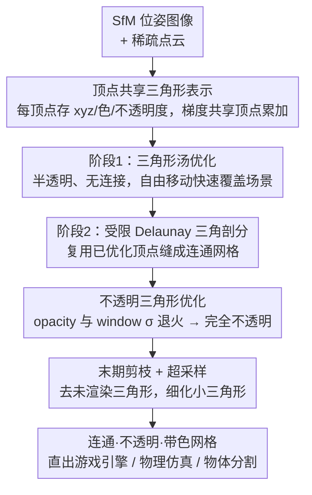

# MeshSplatting: Differentiable Rendering with Opaque Meshes

**会议**: CVPR 2026  
**论文**: [CVF Open Access](https://openaccess.thecvf.com/content/CVPR2026/html/Held_MeshSplatting_Differentiable_Rendering_with_Opaque_Meshes_CVPR_2026_paper.html)  
**代码**: 无（仅项目页 https://meshsplatting.github.io/）  
**领域**: 3D视觉  
**关键词**: 新视图合成, 可微渲染, 三角网格, 受限 Delaunay 三角剖分, 不透明基元

## 一句话总结
MeshSplatting 把 3DGS/三角形 splatting 的"点云/三角形汤"思路改成端到端优化一张**连通、不透明、带顶点色**的三角网格——通过顶点共享 + 受限 Delaunay 三角剖分 + 不透明度/平滑度调度，直接产出可塞进 Unity 等游戏引擎免后处理的网格，在 MipNeRF360/T&T 上 PSNR 提升 +0.69 dB，训练快 2×、显存省 2×。

## 研究背景与动机
**领域现状**：3D Gaussian Splatting（3DGS）用数百万各向异性高斯基元实现了实时、高保真的新视图合成，是当前主流。后续工作要么改进基元（2D 高斯、广义高斯、凸体、线性基元、体素场），要么把训练好的高斯场**转换**成网格（2DGS、RaDe-GS 用 TSDF，GOF 用 Marching Tetrahedra）。

**现有痛点**：高斯这类点状/半透明基元和**经典图形管线**（游戏引擎、模拟器、AR/VR）天生不兼容——它们依赖深度缓冲和遮挡剔除，而高斯渲染要靠排序 + alpha 混合，没法直接用。把高斯转成网格的路线又有两大毛病：① 转换是**非可微的后处理**，几何提取和颜色烘焙各跑一遍，必然损失视觉质量、还拖慢整体时间；② Held et al. 的 Triangle Splatting 虽然把基元换回三角形，但产出的是**互不相连的"三角形汤"**且三角形在训练后并非真正不透明——一旦进游戏引擎按不透明渲染，画质明显掉，也没法做物理仿真。

**核心矛盾**：神经渲染追求的"可微、易优化"要求基元在训练早期保持**半透明、无约束**（这样梯度能穿过遮挡、三角形能自由移动快速覆盖场景）；而下游图形管线要求最终基元是**不透明、连通的流形网格**。两个目标在优化的两端互相打架。

**本文目标**：不做事后转换，而是**直接端到端优化一张网格**——既要连通、要不透明、要带色，又要保住新视图合成的画质和高效训练。

**切入角度**：早期训练用宽松的无结构表示更好优化，到后期再逐步施加连通性和不透明约束。作者用一套"先汤后网格 + 不透明度/平滑度随时间退火"的调度，把这两个矛盾目标在时间轴上分开。

**核心 idea**：用**顶点共享的三角形**替代孤立三角形/高斯，先优化半透明三角形汤、再用**受限 Delaunay 三角剖分**把它"缝"成连通网格，并通过不透明度与窗口参数的退火调度把三角形推向完全不透明，从而免后处理直出游戏引擎可用的网格。

## 方法详解

### 整体框架
MeshSplatting 的输入是 SfM 给出的位姿图像 + 稀疏点云，输出是一张连通、不透明、带顶点色的三角网格。整条管线沿用 Triangle Splatting 的可微体渲染原语，但把表示和优化策略重写为两阶段：**阶段 1** 从 SfM 点云初始化半透明、无连接的三角形汤并自由优化，快速覆盖场景几何与外观；**阶段 2** 对这堆三角形跑一次受限 Delaunay 三角剖分恢复全局连通性，再继续微调顶点位置与外观。贯穿两阶段，每个顶点被相邻三角形**共享**（梯度在共享顶点处累加），同时不透明度参数 $o$ 和窗口平滑度 $\sigma$ 按时间退火，把三角形从"半透明、易优化"逐渐逼到"完全不透明、可直出引擎"。训练末期再做一遍剪枝去掉从未被渲染到的三角形。

### 关键设计

**1. 顶点共享的三角形表示：把"三角形汤"变成可微的流形网格**

Triangle Splatting 里每个三角形 $T_m$ 由三个**独立**顶点 $v_i\in\mathbb{R}^3$ 加上颜色 $c_m$、平滑度 $\sigma_m$、不透明度 $o_m$ 定义，三角形之间不共享顶点——这导致两个硬伤：相邻三角形各自为政产生缝隙、且 $\sigma$ 与 $o$ 作为独立自由参数训练后无法逼到完全不透明。MeshSplatting 改成维护一个**全局共享顶点集** $V=\{v_i\}$，每个顶点 $v_i=(x_i,y_i,z_i,c_i,o_i)$ 同时存位置、颜色、不透明度；一个三角形只用三个**顶点索引**表示，其不透明度取三顶点最小值 $o_{T_m}=\min(o_i,o_j,o_k)$，三角形内部颜色由三顶点色按**重心坐标插值**得到。

这样做的关键收益在反向传播：一个顶点被多个相邻三角形共享，反传时来自所有相邻面的梯度**累加到同一个顶点**上，迫使该顶点按所有入射三角形一致地更新——这正是"流形/连通"能被优化出来的物理基础，而三角形汤里每个三角形顶点各收各的梯度，永远长不到一起。参数量上也更省：球谐 3 阶下每顶点 51 个参数（48 球谐 + 3 位置）+ 每三角形 3 个索引，而单个 3D 高斯要 59 个参数。

**2. 从三角形汤到连通网格的两阶段优化：用受限 Delaunay 把汤"缝"成网格**

直接从头优化一张带连通约束的网格很难收敛（约束太强、初值敏感，这也是早期 Kato/Liu 等可微网格方法只能做物体级、需精心初始化的原因）。MeshSplatting 利用"早期无结构表示更好优化"这一观察，把优化拆成两段。**阶段 1** 从 SfM 每个 3D 点初始化一个等边三角形（尺寸正比于到三个最近邻的平均距离、随机朝向、初始半透明 $o_i=0.28$），完全不加连通/流形约束，每个三角形像点基元一样自由移动，快速贴合可见场景的几何与外观——注意这里已经在优化三角形内**插值的**顶点量，而不是 Triangle Splatting 那样保持均匀。

**阶段 2** 对优化好的三角形汤跑一次**受限 Delaunay 三角剖分**：先做标准 Delaunay 四面体化，再挑出其对偶 Voronoi 边与三角形汤表面相交的四面体面，得到一张近似该表面、局部满足 Delaunay 高质量网格性质的连通网格。关键在于它**不引入新顶点、不挪动顶点位置**，而是直接复用已优化好的顶点，从而保住了之前学到的空间精度和外观。拿到连通拓扑后继续微调顶点位置和外观，凭顶点共享让相邻面梯度在共享顶点累加。因为阶段 1 已经把三角形铺得足够密，这里无需再加面/顶点；训练最后几轮开启**超采样**，让小三角形也能收到梯度被正确优化。

**3. 不透明三角形优化：用不透明度与窗口参数的双退火把半透明推到完全不透明**

"只用不透明三角形"给优化带来新难题——若一上来就不透明，梯度无法穿过遮挡，表示根本优化不动。所以必须让表示在训练早期保持半透明，再平滑地逼向不透明，靠两个自由度的调度实现。**不透明度调度**：前 5k 次迭代自由优化 $o$；之后重参数化为 $o'(o)=O_t+(1-O_t)\cdot\mathrm{sigm}(o)$，其中 $O_t$ 随时间从 0 线性升到 1——$O_t=0$ 时 sigmoid 把不透明度平滑映射到 $[0,1]$，$O_t=1$ 时所有不透明度被强制拉到 1（完全不透明），由此平滑地把所有三角形推向不透明。**窗口参数调度**：窗口函数

$$I(p)=\left[\mathrm{ReLU}\frac{\phi(p)}{\phi(s)}\right]^{\sigma}$$

中 $\sigma$ 控制三角形从内心（值为 1）到边界（值为 0）的过渡软硬。MeshSplatting 把 $\sigma$ 设成**所有三角形共享的单一参数**，从 $1.0$（线性软过渡，保证早期梯度流强）线性退火到 $0.0001$（趋近实心硬三角形）——这与 Triangle Splatting 让每个三角形各自优化自己的 $\sigma$ 形成对比，共享 + 退火既稳了早期梯度又保证末期收敛到不透明。

> 框架↔图↔关键设计三者一致：图中"顶点共享表示 / 阶段1三角形汤 / 阶段2受限 Delaunay / 不透明三角形优化"四个贡献节点分别对应设计 1、设计 2（含两阶段）、设计 3；初始化、剪枝/超采样、下游应用为脚手架节点，在训练策略与应用部分交代。

### 损失函数 / 训练策略
**致密化**：借鉴 3DGS-MCMC，按三角形不透明度 $o$ 构造 Bernoulli 概率分布采样候选三角形，对选中的三角形做**中点细分**（连接三条边中点分成 4 个小三角形），新中点加入顶点集并取相邻两顶点的平均色与不透明度。得益于连通性，一次细分在连通设定下只新增 **6 个顶点**（三角形汤设定下要 12 个）。

**剪枝**：第 5k 次迭代（不透明度调度开始前）剪掉所有 $o<0.2$ 的三角形，约去掉 70% 基元；阶段 1 剩余阶段监控各视图下的体渲染混合权重 $w=T\cdot o$，当 $w<O_t$ 时剪掉被遮挡三角形；阶段 2 关闭剪枝，训练结束再对所有训练视图做一遍剪枝，去掉从未被渲染的三角形。

**训练损失**：组合 3DGS 的光度 $L_1$ 与 $L_{D\text{-}SSIM}$、不透明度损失 $L_o$、深度对齐损失 $L_z$、法向损失 $L_n$、深度损失 $L_d$：

$$L=L_{3DGS}+\beta_o L_o+\beta_z L_z+\beta_n L_n+\beta_d L_d$$

其中**深度对齐损失** $L_z=\frac{1}{N}\sum_i|z_i-z_i^*|$ 把每个被渲染顶点的预测深度 $z_i$ 与渲染深度图采样值 $z_i^*$ 对齐，**逐顶点独立**作用（不依赖局部网格连通性，区别于法向一致性/Laplacian 这类需要连通的正则），用来促进流形生成；深度用 Depth Anything v2 做尺度-平移对齐，法向可由外部法向网络或 2DGS 自监督法向正则监督（实验中两者都用，仅 DTU 网格质量评估时纯自监督）。

**渲染方程**：像素颜色按深度顺序累积所有重叠三角形 $C(p)=\sum_n c_{T_n}o_{T_n}I(p)\prod_{i<n}(1-o_{T_i}I(p))$；训练结束因三角形已不透明，化简为 $C(p)=c_{T_n}I(p)$，每像素只需一次评估（零 over-draw），大幅加速渲染。

## 实验关键数据

数据集：MipNeRF360、Tanks&Temples（NVS），DTU（表面重建，Chamfer 距离）；指标 PSNR/LPIPS/SSIM + 顶点数 $|V|$、训练时间、显存、FPS。任务定位为 **Mesh-Based Novel View Synthesis**（衡量重建网格渲染与参考图的视觉一致性）。

### 主实验：Mesh-based NVS（Mip-NeRF360 / T&T）

| 方法 | Mesh | Ready | PSNR↑ (360) | LPIPS↓ (360) | SSIM↑ (360) | \|V\|↓ (360) | PSNR↑ (T&T) | LPIPS↓ (T&T) | SSIM↑ (T&T) |
|------|------|-------|------|------|------|------|------|------|------|
| 2DGS | ✗ | ✓ | 15.36 | 0.474 | 0.498 | 2M | 14.23 | 0.485 | 0.569 |
| GOF | ✗ | ✓ | 20.78 | 0.465 | 0.573 | 33M | 21.69 | 0.326 | 0.690 |
| RaDe-GS | ✗ | ✓ | 23.56 | 0.361 | 0.668 | 31M | 20.51 | 0.344 | 0.659 |
| MiLo | ✓ | ✓ | 24.09 | 0.323 | 0.688 | 7M | 21.46 | 0.348 | 0.706 |
| Triangle Splatting† | ✓ | ✓ | 21.05 | 0.462 | 0.558 | 3M | 17.27 | 0.402 | 0.600 |
| **MeshSplatting** | ✓ | ✓ | **24.78** | **0.310** | **0.728** | **3M** | 20.52 | **0.287** | **0.745** |

> † 仅不透明三角形版本。"Ready"指无需自定义渲染 shader 即可直入游戏引擎。MeshSplatting 在 LPIPS（最贴近人眼感知）和 SSIM 上全面领先；相比 2DGS/Triangle Splatting 用相近顶点数却高 4–10 dB PSNR；相比 GOF/RaDe-GS/MiLo 用 **2–10× 更少顶点**仍拿到更高 SSIM、更低 LPIPS。T&T 上 GOF/MiLo 的 PSNR 略高，但 SSIM 明显更低、LPIPS 更高——说明它们网格细节多但伪影也多，感知质量更差。

### 训练速度与显存（Mip-NeRF360）

| 方法 | 训练↓ | FPS↑(HD) | FPS↑(Full HD) | 显存↓ |
|------|------|------|------|------|
| GOF | 74m | OOM | OOM | 1.5GB |
| RaDe-GS | 84m | OOM | OOM | 1.1GB |
| MiLo | 106m | 170 | 160 | 253MB |
| **MeshSplatting** | **48m** | **220** | **190** | **100MB** |

> MeshSplatting 训练仅 48 分钟（比同类产网格方法快 35–55%），网格仅 100MB（比同类小 2.5–15×）；受限 Delaunay 只跑一次、用时不到 2 分钟（MiLo 每次迭代都跑 Delaunay 故慢到 106m）。在消费级 M4 MacBook 上渲染快约 25%，GOF/RaDe-GS 直接 OOM。

### 消融实验（Mip-NeRF360，相对 Baseline 的变化量）

| 配置 | PSNR | LPIPS | SSIM | 说明 |
|------|------|------|------|------|
| Baseline（Full） | 24.78 | 0.31 | 0.728 | 完整模型 |
| w/o SH（改纯 RGB） | −2.07 | +0.06 | −0.069 | 掉约 2 PSNR，表达性颜色对不透明网格至关重要 |
| w/o $L_d$ | +0.05 | −0.04 | +0.006 | 视觉略升但几何变差 |
| w/o $L_z$ | +0.02 | −0.01 | +0.002 | 同上，深度对齐牺牲少量画质换几何 |
| w/o $L_n$ | +0.10 | −0.02 | +0.004 | 同上，法向损失换更光滑表面 |

### 关键发现
- **球谐颜色是不透明网格保画质的命门**：去掉 SH 改纯 RGB 掉约 2 PSNR。因为完全不透明 + 共享顶点几何被锁死后，颜色无法再靠"把三角形摆到非物理位置"去 cheat 局部纹理，只能靠表达性更强的外观模型补偿——作者据此提出未来可用神经纹理解耦几何与外观。
- **几何正则与视觉保真度存在 trade-off**：$L_d/L_z/L_n$ 会略降 PSNR/SSIM，但显著提升几何精度、产出更光滑表面；正则越强几何越平滑、画质越掉。
- **连通性确实建起来了**（Garden 场景，表 3）：受限 Delaunay 后约 92% 三角形已有 ≥3 邻居；末期剪枝后平均每三角形连接约 3.7 个邻居，孤立三角形 <2%——印证"先汤后缝 + 末期剪枝"能产出真·连通网格。
- **DTU 表面重建**：纯自监督设定下，15 个场景里 5 个取得最低 Chamfer 距离，说明虽为大场景 NVS 设计，几何质量也能和专门做表面重建的方法持平。

## 亮点与洞察
- **把"易优化"和"可部署"在时间轴上解耦**：半透明→不透明、无连接→连通都做成随训练退火/分阶段的过程，而不是硬约束。这种"先松后紧"的调度思路可迁移到任何"训练友好表示 ≠ 部署友好表示"的场景。
- **受限 Delaunay 三角剖分复用顶点而不新增顶点**——一行设计同时保住了空间精度和已学外观，避开了传统重建"提取新网格→重新学颜色"的非可微断层；且只跑一次（对比 MiLo 每迭代一次）直接把训练时间砍到一半。
- **零 over-draw 的渲染化简**：训练后三角形不透明，渲染方程从 alpha 混合化简为每像素单次评估 $C(p)=c_{T_n}I(p)$，这是它能在消费级硬件实时跑的根因。
- **不透明 + 单三角形覆盖像素**白送两个下游能力：物理仿真（直接当硬表面塞进 Unity mesh collider）和**免训练物体分割**（一个像素只被一个三角形覆盖，给 2D mask 即可反查归属三角形，无需像 3DGS 那样学物体关联）。

## 局限与展望
- **作者承认**：完全不透明 + 几何被锁死后，球谐颜色补偿能力有限，强正则下画质会掉；未来可用神经纹理等更强外观模型解耦几何与外观。
- **依赖 SfM 初始化**：初值来自 COLMAP 稀疏点云，弱纹理/反光场景下 SfM 失败会直接影响三角形汤初始化质量（论文未深入讨论）。
- **任务定位偏 NVS 而非高精度重建**：DTU 上仅 5/15 场景拿最低 Chamfer，几何精度对标专门重建方法只是"持平"，并非全面领先。
- **不透明假设的适用边界**：玻璃、烟雾、薄结构（如自行车辐条虽被点名做得好，但极端半透明材质）天然不适合纯不透明三角形表示。

## 相关工作与启发
- **vs Triangle Splatting [Held et al. 17]**：同样用三角形当基元，但 Triangle Splatting 产出无连接的三角形汤、训练后三角形并非真不透明（进引擎掉画质），且每个三角形各自优化 $\sigma$。MeshSplatting 用顶点共享 + 受限 Delaunay 缝成连通网格、用共享 $\sigma$ 退火 + 不透明度调度逼到完全不透明，直出引擎免后处理——表 1 上 PSNR/SSIM/LPIPS 全面超越 opaque† 版本。
- **vs MiLo [14]**：MiLo 也把网格提取并入优化，但**颜色仍要单独学**、且每次迭代都跑 Delaunay 导致训练慢（106m）。MeshSplatting 顶点直接带色、Delaunay 只跑一次（48m），且用 2–10× 更少顶点拿到更好感知质量。
- **vs 2DGS / GOF / RaDe-GS [19/49/50]**：这些都把网格提取当**训练后非可微后处理**（TSDF / Marching Tetrahedra / Poisson），还要再训神经颜色场上色，流程长、易掉质、显存大（GOF/RaDe-GS 达 1.1–1.5GB 还 OOM）。MeshSplatting 端到端直出带色不透明网格，100MB、不 OOM。
- **vs BakedSDF / MobileNeRF [47/7]**：把隐式辐射场烘焙/蒸馏成网格或多边形，但引入额外开销、拉长训练；MeshSplatting 不经隐式中间表示，直接优化显式网格。

## 评分
- 新颖性: ⭐⭐⭐⭐⭐ 首个端到端直出大规模真实场景连通+不透明+带色三角网格的方法，"先汤后缝 + 双退火"调度思路干净有力
- 实验充分度: ⭐⭐⭐⭐ MipNeRF360/T&T/DTU 三数据集 + 速度显存 + 连通性 + 消融齐全，唯几何精度对标重建方法仅持平
- 写作质量: ⭐⭐⭐⭐⭐ 动机层层递进、表 1 用 Mesh/Color/Connect/Ready 四列把"可部署性"量化讲得很清楚
- 价值: ⭐⭐⭐⭐⭐ 真正打通神经渲染与游戏引擎管线，免后处理 + 物理仿真 + 免训练物体分割的工程价值极高

<!-- RELATED:START -->

## 相关论文

- [\[CVPR 2026\] Parallelised Differentiable Straightest Geodesics for 3D Meshes](parallelised_differentiable_straightest_geodesics_for_3d_meshes.md)
- [\[CVPR 2026\] Hermite Radial Basis Function for Surface Reconstruction via Differentiable Rendering](hermite_radial_basis_function_for_surface_reconstruction_via_differentiable_rend.md)
- [\[CVPR 2026\] Radiance Meshes for Volumetric Reconstruction](radiance_meshes_for_volumetric_reconstruction.md)
- [\[NeurIPS 2025\] LinPrim: Linear Primitives for Differentiable Volumetric Rendering](../../NeurIPS2025/3d_vision/linprim_linear_primitives_for_differentiable_volumetric_rendering.md)
- [\[CVPR 2026\] Opti-NeuS: Neural Reconstruction for Dual-Layered Transparent and Opaque Objects](opti-neus_neural_reconstruction_for_dual-layered_transparent_and_opaque_objects.md)

<!-- RELATED:END -->
