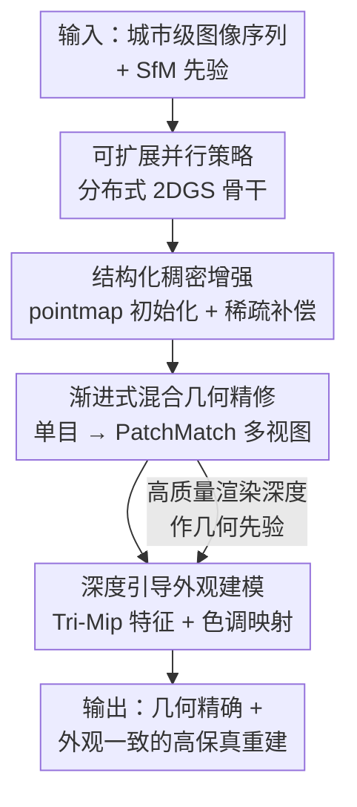

# MetroGS: Efficient and Stable Reconstruction of Geometrically Accurate High-Fidelity Large-Scale Scenes

**会议**: CVPR 2026  
**论文**: [CVF Open Access](https://openaccess.thecvf.com/content/CVPR2026/html/Chen_MetroGS_Efficient_and_Stable_Reconstruction_of_Geometrically_Accurate_High-Fidelity_Large-Scale_CVPR_2026_paper.html)  
**代码**: [项目页](https://m3phist0.github.io/MetroGS)  
**领域**: 3D视觉  
**关键词**: 大规模场景重建, 2D高斯泼溅, 几何重建, 外观解耦, 分布式训练

## 一句话总结
MetroGS 以分布式 2DGS 为骨干，配合「点云稠密增强 + 渐进式单目/多视图混合几何精修 + 深度引导外观建模」三件套，在城市级大规模场景上同时拿到更高的几何精度（F1）和渲染质量（PSNR），且训练时间只要 CityGSV2 的 25% 左右。

## 研究背景与动机
**领域现状**：3DGS 及其衍生方法（尤其是把 3D 椭球压成 2D surfel 的 2DGS、用平面高斯的 PGSR）在大规模场景重建里进展飞快，CityGS / CityGSV2 / CityGS-X 等用「分块并行训练」把 2DGS 扩到了城市级。但绝大多数工作的优化重心在**渲染质量**，几何重建的进步相对滞后。

**现有痛点**：作者指出三个具体短板。其一，初始点云在弱纹理 / 稀疏观测区域过于稀疏，导致局部结构恢复不准、表面出现空洞和伪影；其二，几何优化策略不成熟——只靠单视图约束（如单目深度）缺乏跨视图一致性，而多视图约束又常用单尺度光度约束或简单重投影误差，在结构多样的大场景里适应性差且算力开销大；其三，大规模数据集普遍存在光照 / 曝光不一致，模型被迫在优化中调和外观差异，反过来污染了几何一致性。

**核心矛盾**：在大规模条件下，**几何精度**与**渲染保真度 / 训练效率**之间存在张力——传统多视图一致性优化既贵又难稳定地兼顾两者，而外观变化又会和几何耦合在一起互相干扰。

**本文目标**：构建一个可扩展的框架，在城市级场景下既保几何精度、又保渲染质量，还要训练得快、训练得稳。拆成三个子问题：补稠密初始化、做高效又准确的几何精修、把外观从几何里解耦出来。

**切入角度**：作者观察到「初始采样不足」是几何质量的关键瓶颈之一，而高质量的渲染深度本身又能反过来当外观建模的几何先验。于是把「稠密化、几何精修、外观解耦」串成一条互相支撑的流水线。

**核心 idea**：以分布式 2DGS 为统一骨干，用 pointmap 模型补稠密初始化、用渐进式单目→PatchMatch 多视图深度精修拿准确几何、再用深度引导的 Tri-Mip 外观模块把光照/曝光从几何里剥离，实现高效稳定的大规模高保真重建。

## 方法详解

### 整体框架
MetroGS 的输入是城市级的图像序列，输出是几何精确、外观一致的高保真重建（mesh + 渲染）。整条流水线建立在一个**分布式 2DGS 骨干**上：先用 SfM 先验 + pointmap 模型生成高质量稠密初始点云，并在稠密化阶段加一个稀疏补偿优化进一步填补稀疏区；然后用「先单目、后多视图 PatchMatch」的渐进式混合策略精修几何深度；同时用一个深度引导的外观模块，借助已经优化好的渲染深度去查询 3D 一致的空间特征，把几何和外观解耦。四个组件围绕「同一份骨干表示」协同：稠密增强保证有料可优化，几何精修把料雕准，外观建模保证雕的过程不被光照干扰。

### 关键设计

**1. 可扩展并行策略：把 2DGS 做成高斯级分布式训练，撑起城市级规模**

大规模场景单卡塞不下，这是所有后续模块能跑起来的前提。MetroGS 借鉴 Grendel-GS 式并行思路，把 2DGS 扩成「高斯级（Gaussian-wise）分布式训练范式」：初始点云均匀分到多张 GPU 上做本地高斯初始化，训练用 multi-view batched 把图像也均匀分配到各设备；每个 worker 利用高斯泼溅的空间局部性，只抓取自己需要的高斯子集来通信，降低开销；动态稠密化期间通过周期性的高斯重分布维持负载均衡。消融里这一项把训练时间从 134 min 砍到 68 min（约 1.97× 加速）同时 F1 从 0.523 升到 0.532，说明它不只是工程加速，对最终质量也有正面作用。

**2. 结构化稠密增强：用 pointmap 补初始化、再用稀疏补偿补稠密化，根治稀疏区空洞**

针对「弱纹理/稀疏观测区初始点云太稀、表面出洞」的痛点，作者把它拆成初始化和稠密化两段分别治。初始化阶段先构建无向图像图 $G=(V,E)$，边权 $w_{ij}$ 是 SfM 估计的图像间特征匹配数，再按归一化割目标把图分成 $N$ 个簇（$N=$ GPU 数）：

$$\text{Ncut}(A_1,\dots,A_N)=\sum_{k=1}^{N}\frac{\text{Cut}(A_k,\bar{A_k})}{\text{Vol}(A_k)}$$

这样得到「簇内强连接、簇间弱连接」的划分，之后对各簇并行跑 pointmap 模型做稠密 3D 预测；簇内图像按匹配连通性排序、分 mini-batch 处理，每个 batch 后用像素索引在稠密 pointmap 与 SfM 重建之间建立一一对应，再估计一个相似变换 $T^*=\arg\min_{T\in\text{Sim}(3)}\lVert T\tilde{X}-\tilde{Y}\rVert_F^2$ 把稠密预测对齐到 SfM 坐标系，最后采样合并成统一的辅助点云。稠密化阶段再加一个稀疏补偿：按「贡献面积大且局部密度低」的双重判据挑要分裂的高斯 $G_{\text{split}}=\{G_i\mid S_i>S_{th}\wedge V_i<V_{th}\}$，其中 $S_i$ 是该高斯同时取得最大贡献权重与中值深度的累计面积，$V_i$ 是其所在体素内的高斯中心数（局部密度）。这条判据专挑「占地大却处在稀疏邻域」的高斯分裂，从而填补覆盖又不会过度稠密化。

**3. 渐进式混合几何精修：先轻量单目、后 PatchMatch 多视图，并用深度（而非光度）做多视图监督**

单目深度缺跨视图一致性、多视图光度约束又贵且单尺度，作者用两阶段渐进解决。第一阶段（单视图）用预训练深度估计模型拿单目深度先验，把估计的逆深度与稀疏 SfM 深度对齐后，用渲染逆深度与估计逆深度的 L1 损失 $L_d$ 监督，并保留 2DGS 的深度-法向一致性损失 $L_n$；同时观察到大尺度高斯会引入伪影、模糊细节、还吃显存，于是加一个尺度正则 $L_s=\frac{1}{|M|}\sum_{i\in M}\max(\max(s_i)-\tau_s,\epsilon)$ 限制最大高斯尺度，本阶段几何损失 $L^{(1)}_{geo}=\lambda_d L_d+\lambda_n L_n+\lambda_s L_s$。训练若干轮后进入第二阶段（混合多视图）：对每张图按 SfM 先验预设邻视图，用 PatchMatch 在图像与邻视图间精修渲染深度 $D_r$，并用多尺度 patch 迭代以适配不同尺度物体，再用与邻视图的重投影误差过滤得到可靠深度 $D_f$。过滤会误删有效区造成空洞，于是重新引入单目深度 $D_m$ 做补全——把单目深度分块、各块用最小二乘对齐到对应过滤深度 $s^*,t^*=\arg\min_{s,t}\sum_{p\in D_f}\lVert D_f(p)-(s\cdot D_m(p)+t)\rVert^2$，对齐误差低于阈值则保留，恢复出 $D_{mv}$。最终用深度监督 $L_{mv}=\frac{1}{|D_{mv}|}\sum_{p\in D_{mv}}|D_r(p)-D_{mv}(p)|$，本阶段损失 $L^{(2)}_{geo}=\lambda_{mv}L_{mv}+\lambda_n L_n$。关键在于：用**深度**而非直接光度做多视图一致性，渲染深度越练越好、精修深度随之改善，且精修深度图只在固定间隔更新，省了算力。

**4. 深度引导外观建模：用渲染深度查询 Tri-Mip 特征，实现几何—外观真解耦**

大场景光照/曝光不一致会逼模型在优化时调和外观、污染几何。已有外观方法大多不用几何信息，而 MetroGS 恰好有高质量渲染深度可当结构先验。作者用 Tri-Mip 结构存储场景的尺度自适应多分辨率 3D 特征（空间上保持跨视图一致）：给定渲染深度 $D_r$，用每个像素投影的 3D 坐标去查询 Tri-Mip 特征平面，得到结构对齐表示 $f_{Tri}(x)$；再给每张图配可学习外观嵌入 $l_i\in\mathbb{R}^d$ 捕捉全局光照/曝光，二者拼接后过一个轻量 MLP 色调映射器 $M(x)=F_\theta([f_{Tri}(x);l_i])$，用它调制渲染图 $I^r_i$ 得到色调/光照一致的最终结果 $I^t_i$，外观损失 $L_{app}=\lambda L_1(I^t_i,I_i)+(1-\lambda)L_{D\text{-}SSIM}(I^r_i,I_i)$。因为外观查询锚在准确深度上，外观就只需关注与几何无关的颜色/光照变化，从而把几何稳稳留给几何模块——这就是「深度引导」带来的真解耦。

### 损失函数 / 训练策略
几何与外观联合优化，总损失 $L_{total}=L_{geo}+L_{app}$，其中 $L_{geo}$ 随训练阶段在 $L^{(1)}_{geo}$（单视图）与 $L^{(2)}_{geo}$（多视图）间切换。实验在 4× RTX 3090 上进行，mesh 提取沿用 2DGS 的「中值深度 + TSDF 融合」。

## 实验关键数据

### 主实验
在真实城市数据集 GauU-Scene 的三个场景上，MetroGS 在大多数指标上排第一。相比 CityGSV2，平均 PSNR +0.88 dB、F1 +0.033。

| 场景 (GauU-Scene) | 指标 | MetroGS | CityGSV2 | 2DGS |
|------|------|------|----------|------|
| Russian Building | PSNR↑ / F1↑ | 24.94 / 0.585 | 24.12 / 0.544 | 23.77 / 0.531 |
| Residence | PSNR↑ / F1↑ | 24.51 / 0.494 | 23.57 / 0.467 | 22.24 / 0.458 |
| Modern Building | PSNR↑ / F1↑ | 27.07 / 0.524 | 25.84 / 0.492 | 25.77 / 0.485 |

在合成数据集 MatrixCity 上，F1 优势更明显（平均比 CityGSV2 高约 0.11），尤其是几何召回 R 大幅领先：

| 场景 (MatrixCity) | 指标 | MetroGS | CityGSV2 | CityGS-X |
|------|------|------|----------|----------|
| Aerial | F1↑ (P / R) | 0.677 (0.572 / 0.828) | 0.556 (0.441 / 0.752) | 0.581 (0.444 / 0.840) |
| Street | F1↑ (P / R) | 0.607 (0.480 / 0.828) | 0.503 (0.376 / 0.759) | OOM |

街景上 CityGS-X 直接 OOM，而 MetroGS 仍稳定输出，侧面印证分布式骨干的可扩展性。

### 消融实验
在 Russian Building 场景上逐组件消融（base 为定制 2DGS）：

| 配置 | PSNR↑ | F1↑ | #G(M) | T(min) | 说明 |
|------|-------|-----|-------|--------|------|
| Base | 23.88 | 0.523 | 4.55 | 134 | 定制 2DGS 基线 |
| Base + Para. | 24.35 | 0.532 | 7.30 | 68 | 加并行：F1↑且训练近 2× 提速 |
| w/o Ini. | 24.84 | 0.577 | 7.51 | 98 | 去 pointmap 初始化，F1 掉 0.008 |
| w/o Spa. | 24.88 | 0.583 | 8.02 | 104 | 去稀疏补偿，掉 0.002（影响较小） |
| w/o Geo. | 24.83 | 0.564 | 8.99 | 89 | 去整个几何精修，F1 掉最多（0.021） |
| w/o Mul. | 24.87 | 0.571 | 8.17 | 87 | 去多视图精修 |
| w/o Ali. | 24.86 | 0.580 | 8.18 | 101 | 去对齐&恢复操作 |
| w/o App. | 24.46 | 0.562 | 8.29 | 99 | 去外观建模，PSNR 掉 0.48 |
| w/o Tri. | 23.96 | 0.569 | 8.08 | 95 | 去 Tri-Mip，PSNR 进一步掉到 23.96 |
| Full Model | 24.94 | 0.585 | 8.20 | 106 | 完整模型 |

### 关键发现
- **几何精修（w/o Geo.）对 F1 贡献最大**：去掉整个模块 F1 从 0.585 掉到 0.564，是所有消融里几何指标下降最多的，证明渐进式深度精修是几何精度的主引擎。
- **pointmap 初始化 > 稀疏补偿**：去初始化（w/o Ini.）掉点明显，去稀疏补偿（w/o Spa.）只轻微下降，且两者掉点幅度都和最终重建高斯数的减少直接相关。
- **外观建模主要救渲染、且依赖几何**：去外观（w/o App.）PSNR 掉 0.48；再去 Tri-Mip（w/o Tri.）PSNR 进一步掉到 23.96，说明「外观建模要有几何感知」才管用，呼应深度引导的设计动机。
- **并行不止提速**：Base→Base+Para. 训练时间近乎砍半，F1 还小涨，效率与质量双赢。

## 亮点与洞察
- **「用深度而非光度做多视图一致性」很巧**：渲染深度会随训练自我改善，精修深度跟着变好，还能间隔更新省算力——把多视图约束从昂贵的光度优化换成更稳更省的深度监督。
- **几何与外观互为先验**：高质量渲染深度反哺外观查询，外观解耦又让几何不被光照污染，形成正反馈，是这篇最「啊哈」的闭环设计。
- **稀疏补偿的双判据可迁移**：「贡献面积大 × 局部密度低」这种挑高斯分裂的判据，可以借鉴到其他需要选择性稠密化的 GS 任务，避免无脑全局稠密化。
- **PatchMatch 多尺度 patch + 单目补全的组合拳**：先用严格几何一致性拿可靠深度、再用单目先验补回被误删的有效区，兼顾准确与完整，是处理过滤后空洞的实用配方。

## 局限与展望
- 整体框架由四个模块串成，组件较多、超参（多组 $\lambda$、$\tau_s$、$S_{th}$、$V_{th}$ 等阈值）也多，复现与调参成本不低。
- 依赖外部预训练模型（pointmap 模型、单目深度估计器），其质量会直接影响初始化与单目监督，论文未充分分析对这些先验的敏感性。⚠️ 以原文为准。
- 评测集中在 GauU-Scene 与合成 MatrixCity 两类城市级数据，对更大跨度地理范围或动态物体（行人/车流）场景的鲁棒性未涉及。
- 稀疏补偿在消融里增益较小（F1 仅 +0.002），其性价比相对其他模块偏低，是否值得保留可进一步权衡。

## 相关工作与启发
- **vs CityGSV2**：同样走分块/并行 + 2DGS 路线并建了大场景几何 benchmark，但只用相对简单的几何优化；MetroGS 用渐进式单目→PatchMatch 多视图精修把几何做准，且训练时间约为它的 25%，多数指标全面领先。
- **vs CityGS-X**：支持多 GPU 并行渲染、batch 级多任务联合优化几何与外观，但在 MatrixCity 街景上 OOM；MetroGS 的高斯级分布式骨干更省、更稳，街景仍能跑出 0.607 F1。
- **vs 2DGS / PGSR**：这些是对象级表面重建的基础表示，直接搬到大场景稳定性不足；MetroGS 在 2DGS 骨干上叠加针对大场景的稠密增强、几何精修与外观解耦。

## 评分
- 新颖性: ⭐⭐⭐⭐ 模块多为已有技术（pointmap/PatchMatch/Tri-Mip）的组合，但「深度引导外观解耦 + 渐进深度精修」的闭环设计有巧思
- 实验充分度: ⭐⭐⭐⭐ 两数据集多场景 + 细粒度逐组件消融，几何/渲染/效率三维度齐全
- 写作质量: ⭐⭐⭐⭐ 结构清晰、公式与图示到位，动机—方法—消融衔接顺畅
- 价值: ⭐⭐⭐⭐ 在大规模高保真重建上同时提质提速，对测绘/自动驾驶/AR-VR 等落地有实用价值

<!-- RELATED:START -->

## 相关论文

- [\[ICLR 2026\] UrbanGS: A Scalable and Efficient Architecture for Geometrically Accurate Large-Scene Reconstruction](../../ICLR2026/3d_vision/urbangs_a_scalable_and_efficient_architecture_for_geometrically_accurate_large-s.md)
- [\[CVPR 2026\] LATTICE: Democratize High-Fidelity 3D Generation at Scale](lattice_democratize_high-fidelity_3d_generation_at_scale.md)
- [\[CVPR 2026\] FSFSplatter: Geometrically Accurate Reconstruction with Free Sparse-view Images within 2 minutes](fsfsplatter_geometrically_accurate_reconstruction_with_free_sparse-view_images_w.md)
- [\[CVPR 2026\] CaT-GS: Efficient 3DGS Rendering for Large-Scale Scenes with Inter-frame Caching and Tile Scheduling](cat-gs_efficient_3dgs_rendering_for_large-scale_scenes_with_inter-frame_caching_.md)
- [\[CVPR 2026\] OLATverse: A Large-scale Real-world Object Dataset with Precise Lighting Control](olatverse_a_large-scale_real-world_object_dataset_with_precise_lighting_control.md)

<!-- RELATED:END -->
