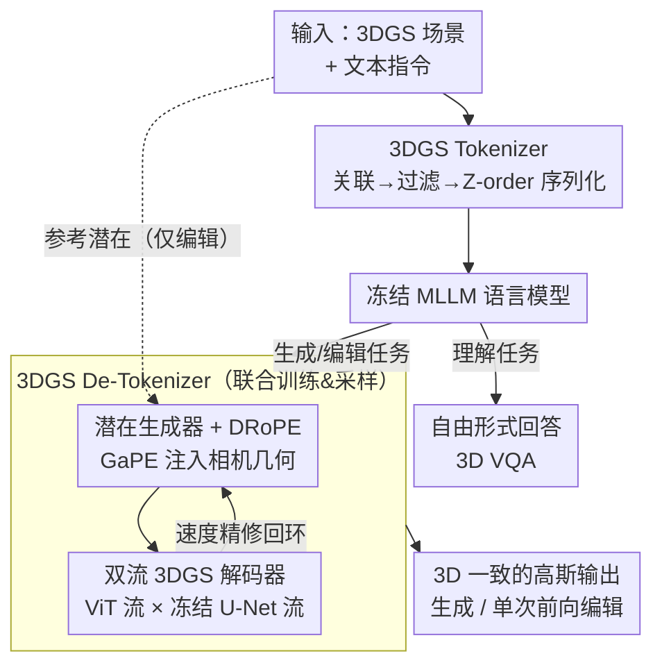

# MLLMSplat: A 2D MLLM-Powered Framework for 3D Gaussian Splatting Understanding, Generation, and Editing

**会议**: CVPR 2026  
**论文**: [CVF Open Access](https://openaccess.thecvf.com/content/CVPR2026/html/Xiu_MLLMSplat_A_2D_MLLM-Powered_Framework_for_3D_Gaussian_Splatting_Understanding_CVPR_2026_paper.html)  
**代码**: 无  
**领域**: 3D视觉 / 多模态VLM  
**关键词**: 3D Gaussian Splatting, 多模态大模型, 3DGS tokenizer, 潜在扩散, 前馈编辑

## 一句话总结
MLLMSplat 把一个现成的 2D 多模态大模型（OmniGen2）几乎不动权重地"接"到 3DGS 上——用免训练的 3DGS tokenizer 让它**理解**高斯场景，用一套双旋转位置编码 + 双流解码器把它的 2D 潜在扩散器**生成**成 3D 一致的高斯，再借一个新视角外推的代理任务把图像编辑能力迁移成单次前向的 3DGS **编辑**，在理解/生成/编辑三个任务上同时刷到 SOTA。

## 研究背景与动机

**领域现状**：3D Gaussian Splatting（3DGS）已经成为 3D 场景的主流表示，围绕它的理解、生成、编辑三条线都在快速发展；与此同时，2D 图像侧的多模态大模型（MLLM）已经能把"理解 + 生成 + 编辑"统一进一个模型里，效果惊艳。

**现有痛点**：3DGS 三条线却各自卡在低水位——理解还停在"算语言特征和文本查询的相似度做分割"这种**低层感知**，不支持复杂语言推理；生成是**低质量**的领域受限结果；编辑要靠 InstructPix2Pix 反复编辑多视角再优化底层高斯，是**低效率**的迭代流程。三者都远远落后于 2D 图像同行。

**核心矛盾**：想把 2D MLLM 这套成熟能力搬到 3DGS，会撞上三道墙：(1) 把 3DGS 渲染成多视图喂给 MLLM 自带 tokenizer，会丢掉 3DGS 的空间结构、跨视图特征不一致；而专门训一个 3DGS tokenizer 又昂贵且锁死在特定模型的 token 空间。(2) 现有把 2D 扩散器扩到 3DGS 的做法（拼接 raymap 等）会破坏 2D 生成先验、切断与自回归语言模型的连接、且 3D 一致性不够。(3) 没有大规模 3D 编辑数据集，前馈编辑模型训不起来。

**本文目标**：用**最小改动、最小训练成本**把 2D MLLM 适配到 3DGS，让它同时具备高层理解、高质量生成、高效率编辑。

**切入角度**：既然 MLLM 的"理解—生成—编辑"是统一的，只要解决前两个问题（怎么让它读懂 3DGS、怎么让它的扩散器输出 3D 一致的高斯），编辑能力理应能"白嫖"地迁移过来——无需任何 3D 编辑数据。

**核心 idea**：给 MLLM 装两个即插即用的"翻译插头"——一个 **3DGS tokenizer**（把高斯翻译成 MLLM 特征空间里的 token，免训练）和一个 **3DGS de-tokenizer**（把 MLLM 扩散出的潜在翻译回 3D 一致的高斯，非侵入式），两者一上，编辑能力自然解锁。

## 方法详解

### 整体框架
MLLMSplat 围绕一个冻结的 2D MLLM（OmniGen2，理解骨干是 Qwen2.5-VL-3B，生成骨干是类 FLUX 的 4B 扩散 Transformer）展开，只在两端各加一个轻量适配器。**理解侧**：3DGS tokenizer 把高斯场景渲染成多视图后，用渲染过程的"逆"把 2D 视觉特征聚合回每个高斯，再过滤、序列化成一维 token，连同文本 token 一起喂进语言模型，输出自由形式的回答。**生成侧**：3DGS de-tokenizer 把语言模型的条件交给扩散 Transformer，用 DRoPE（双旋转位置编码）保证多视图几何一致，扩散出多视图潜在后，再由一个双流 VAE 解码器解码成像素对齐的高斯（splatter image），生成器与解码器联合训练、联合采样。**编辑侧**：把输入 3DGS 的干净潜在作为参考一起喂给生成器，用一个"新视角外推"的代理任务微调，让模型在改动目标区域的同时保住未编辑区域的低层细节，一次前向出结果。

### 关键设计

**1. 免训练、模型无关的 3DGS Tokenizer：用渲染的逆把 2D 特征"灌"回高斯**

痛点很直接：直接把渲染图喂 MLLM 自带 tokenizer，特征是逐视图独立的，跨视图对不上，导致空间关系判断错误；但单独训一个 3DGS tokenizer 又贵又不通用。作者的做法是利用 3DGS 渲染本身就是可逆的加权过程，把 2D 特征反向聚合成视图一致的高斯特征，全程不训练。分三步：**关联**——回忆 alpha blending 渲染像素颜色 $C_k = \sum_{i=1}^{N} c_i \alpha_{ik}\prod_{j=1}^{i-1}(1-\alpha_{jk}) = \sum_{i=1}^{N} c_i w_{ik}$，其中 $w_{ik}$ 是高斯 $G_i$ 对该像素特征 $f_k$ 的贡献权重；于是每个高斯的最终特征就是各视图按贡献权重的加权平均 $g_i = \frac{\sum_k w_{ik} f_k}{\sum_k w_{ik}}$。**过滤与下采样**——把总贡献（即上式分母）低于阈值 $\tau$ 的高斯（对语义几乎无影响）剔掉，大幅减少数量；若仍超过 MLLM 上下文容量，用最远点采样（FPS）下采，距离同时考虑几何与语义：$d(G_i,G_j)=2-\mathrm{RBF}(\Delta\mu^\top\Sigma^{-1}\Delta\mu)-\frac{g_i^\top g_j}{\|g_i\|\|g_j\|}$，前项是 RBF 核变换后的马氏距离、后项是特征余弦不相似度。**序列化**——用 Z-order 空间填充曲线把高斯特征排成一维序列以保留空间局部性，再连同文本 token 送进语言模型。它的妙处在于：聚合后的特征是"一个高斯一个特征"的视图一致表示，比逐视图特征更能支撑整体场景理解，而且因为不碰 MLLM 权重，任何未来更强的 MLLM 都能直接受益。

**2. DRoPE / GaPE：把相机几何写进注意力的相对位置编码，而不破坏生成先验**

生成侧第一道墙是多视图一致性。扩散 Transformer 靠跨视图全局自注意力能多视图生成，但缺一致性；主流做法是把相机 raymap 沿通道拼到输入上，问题是这会让输入分布偏离预训练域、毁掉预训练能力、被迫大改权重。作者改成把相机几何当作注意力里的**相对位置编码**注入。MLLM 常用的多模态旋转位置编码（MRoPE）把位置拆成"单元级"（标记每个文本 token 或把一张图所有 token 当一个模态单元）和"单元内"（图内行列坐标）两部分；作者只替换单元级的 1D RoPE，换成几何感知位置编码（GaPE）。给定相机内参 $K_i$、外参 $[R_i\,|\,t_i]$，构造投影矩阵 $P_i=\begin{bmatrix}K_iR_i & K_it_i\\ 0 & 1\end{bmatrix}$，把 query/key 用几何矩阵变换后再做点积：$\langle q_i^{\text{GaPE}}, k_j^{\text{GaPE}}\rangle = \langle P_i^\top q_i, P_j^{-1} k_j\rangle = q_i^\top P_i P_j^{-1} k_j$。因为 $P_iP_j^{-1}$ 恰好刻画了相机 $i$ 与 $j$ 图像空间之间的变换，注意力分数就显式编码了两个视锥的几何关系。它是相对编码（对全局坐标系不变），且不引入任何额外可学参数；GaPE 只作用于**跨视图**注意力，文本相关和视图内注意力仍用 RoPE，而二者在视图内本就等价，于是两套位置编码统一进一次注意力计算（即 DRoPE 双空间），只需微调注意力层即可接入。这样生成器更忠实地继承了预训练生成先验、产出更 3D 一致的潜在——消融里去掉 DRoPE 改回拼 Plücker 坐标，FID 从 50.07 暴涨到 67.34，是掉点最狠的一项。

**3. 双流 3DGS 解码器 + 联合训练/采样的速度精修回环**

把 MLLM 基于 U-Net 的单图 VAE 解码器改成解码多视图 splatter image 并不平凡——前人只改首尾卷积层、再加跨视图注意力或塞个多视图 Transformer，既没用足预训练 VAE 的先验，跨视图几何一致性也不够。作者用**双流**结构：ViT 流对所有视图的潜在做自注意力，冻结的 U-Net 流则为每个视图独立抽多尺度特征，这些 patch 化特征在多个阶段通过交叉注意力注入 ViT 流，最后一个 DPT 头逐级反 patch、融合不同 ViT 阶段特征并上采样预测出 splatter image；ViT 流注意力用与扩散 Transformer 相同的位置编码（GaPE + 2D RoPE 按通道均分）。训练上走 Rectified Flow：潜在线性插值 $x_t = t x_1 + (1-t)x_0$，生成器预测瞬时速度 $u_t=G(x_t,t,y)$ 配真值速度 $v_t = x_1-x_0$ 做 $\mathcal{L}_{\text{latent}}$；同时由一步估计的干净潜在 $z_1 = x_t+(1-t)u_t$ 解码成高斯、再可微渲染出输入视角和插值新视角的图像 $\hat{I}=R(D(z_1,V_i),[V_i,V_n])$ 接渲染损失 $\mathcal{L}_{\text{render}}$，总目标 $\mathcal{L}=\mathbb{E}_t[\mathcal{L}_{\text{latent}}(u_t,v_t)+\omega(t)\mathcal{L}_{\text{render}}(\hat{I},I)]$，其中权重 $\omega(t)=(1-t)^\gamma$ 偏向低噪步、稳住高噪训练。采样时更巧：前期关掉解码器、用欧拉法积分 ODE；后期（50 步里第 30 步起）开启**自精修回环**——把解码出的高斯在输入视角渲染、再用 VAE 编码器重编码得到精修潜在 $\tilde{z}_1=E(R(D(z_1,V_i),V_i))$，据此算出修正速度 $\tilde{u}_t=\frac{\tilde{z}_1-x_t}{1-t}$ 替换原速度。因为中间步就有了显式 3DGS 表示（视角可控、3D 一致天然保证），它能把生成潜在里的视图不一致拉回去，减少鬼影和扭曲。消融去掉双流（w/o DualS）和去掉速度精修（w/o VelRe）FID 都明显变差。

**4. 用新视角外推当代理任务，把图像编辑能力零数据迁成 3DGS 编辑**

有了理解和生成，编辑本可直接做——读懂输入 3DGS + 指令，生成编辑后的 3DGS。但 tokenizer 主要抓高层语义，对未编辑区域的细粒度一致性保不住。作者额外把高斯的 VAE 特征（干净潜在）作为参考喂进生成器以维持低层视觉保真，并设计一个代理任务来微调生成器接纳这个额外输入：因为没有 3D 编辑数据集，作者把**新视角外推**重铸成文本编辑的代理——两者都要"在遵循 MLLM 条件的同时参考 VAE 特征"。训练时随机选参考视图、外推到目标视图，目标视图潜在加噪、参考视图保持干净，且参考视图被排除在损失计算和送入 3DGS 解码器之外；采样时把输入 3DGS 从扩散 Transformer 的条件相机同视角渲染、编码成全程保持干净的参考潜在。这套参考机制顺带还把编辑后 3DGS 的坐标系一致性也约束住了，使整套编辑塌缩成单次前向，省掉传统多视角反复编辑 + 优化的冗长流程。

### 损失函数 / 训练策略
$\mathcal{L}_{\text{latent}}$ 是潜在空间的 MSE；$\mathcal{L}_{\text{render}}$ 在图像空间组合 MSE 与 LPIPS（兼顾光度与感知保真）。训练分两步：先用干净潜在 $x_1$ 配 $\mathcal{L}_{\text{render}}$ 预训练解码器 $D$ 加速收敛，再联合微调生成器 $G$ 与解码器 $D$。冻结整个理解模块和大部分生成组件，只训扩散 Transformer 里的注意力层和新引入的 3DGS 解码器。关键超参：过滤阈值 $\tau=0.1$、衰减因子 $\gamma=2$、第 30/50 步激活自精修回环；训练数据为 RealEstate10K 与 DL3DV-10K 两个场景级数据集，文本提示由 LLaVA-Video-7B 生成。

## 实验关键数据

### 主实验

**3DGS 理解**（零样本 3D VQA，每场景约 150 万高斯）：

| 数据集 | 指标 | 自带 tokenizer | + 本文 tokenizer | 提升 |
|--------|------|----------------|------------------|------|
| ScanQA | CIDEr ↑ | 55.85 (Qwen2.5-VL-3B) | 62.69 | +6.84 |
| ScanQA | BLEU-4 ↑ | 4.53 (Qwen2.5-VL-3B) | 8.43 | +3.90 |
| ScanQA | CIDEr ↑ | 87.05 (LLaVA-Video-7B) | 93.71 | +6.66 |
| SQA3D | EM ↑ | 50.01 (LLaVA-Video-7B) | 53.49 | +3.48 |

> 同样 token 数下，免训练的 Gaussian tokenizer 在两个骨干上都稳定优于 MLLM 自带 tokenizer，且零额外训练成本、模型无关。

**3DGS 生成**（hold-out 文本提示）：

| 方法 | RealEstate10K FID ↓ | RealEstate10K CLIP ↑ | DL3DV-10K FID ↓ | DL3DV-10K CLIP ↑ |
|------|---------------------|----------------------|-----------------|-------------------|
| Director3D | 65.87 | 22.69 | 71.40 | 23.65 |
| SplatFlow | 82.91 | 19.91 | 84.74 | 21.48 |
| Prometheus | 63.40 | 23.36 | 64.18 | 24.51 |
| **本文** | **50.07** | **25.79** | **53.67** | **27.68** |

**3DGS 编辑**（5 类编辑操作 × 10 场景）：

| 方法 | CLIP-Sim ↑ | CLIP-Dir ↑ | 平均耗时 ↓ |
|------|-----------|-----------|-----------|
| DGE | 24.38 | 15.38 | 100s |
| **本文** | **26.91** | **22.40** | **25s** |

> 编辑不仅质量更高，单次前向把耗时从 100s 压到 25s（4×），且未编辑区域细节保持良好。

### 消融实验
（3DGS 生成，FID / CLIP）

| 配置 | RealEstate10K FID ↓ | RealEstate10K CLIP ↑ | 说明 |
|------|---------------------|----------------------|------|
| Full | 50.07 | 25.79 | 完整模型 |
| w/o DRoPE | 67.34 | 22.37 | 改回拼 Plücker 坐标的 MRoPE，掉点最狠 |
| w/o DualS | 53.69 | 24.91 | 双流退化为单流解码器 |
| w/o VelRe | 58.21 | 24.02 | 关掉采样期速度精修回环 |

### 关键发现
- **DRoPE 贡献最大**：去掉它 FID 从 50.07 劣化到 67.34，印证了"拼接相机嵌入会扰动预训练输入分布、迫使大改权重、丢掉预训练能力"的判断——把几何写进注意力相对编码才是关键。
- **速度精修比双流更重要**：w/o VelRe（58.21）比 w/o DualS（53.69）掉得更多，说明在中间采样步用显式 3DGS（视角可控、3D 一致）回拉潜在，比解码器本身的结构改进更能去鬼影/去扭曲。
- **小数据也能赢**：本文训练集更小却全面超过基线，说明价值在于高效迁移单图生成模型的强先验，而非堆数据。

## 亮点与洞察
- **"渲染可逆"是免训练 tokenizer 的支点**：alpha blending 的贡献权重 $w_{ik}$ 既能把 2D 特征加权回高斯（关联），又直接当作过滤的重要性分数（分母即总贡献），一个量复用两处，优雅且零训练。
- **把相机几何变成相对位置编码而非额外输入通道**，是本文最可迁移的思路：$P_iP_j^{-1}$ 显式刻画视锥间变换、对全局坐标系不变、零新增参数——任何想给预训练扩散器加几何条件又不想破坏先验的工作都能借鉴。
- **采样期的"生成器↔解码器"自精修回环**很巧：让中间步的显式 3DGS（天然 3D 一致）反过来纠正潜在生成器的速度预测，把"解码"从被动末端变成主动的一致性约束器。
- **用新视角外推当编辑的代理任务**，绕开了 3D 编辑数据缺失的死结——抓住"都要遵循 MLLM 条件 + 参考 VAE 特征"这一共性，零编辑数据就把 2D 编辑能力迁到 3D。

## 局限与展望
- **依赖渲染多视图作为输入**：理解侧要先渲 16 张图（640×480）再聚合，质量受渲染视角覆盖度影响；视角稀疏或被遮挡区域的高斯可能拿不到可靠特征。
- **token 容量与下采样的取舍**：超出 MLLM 上下文就得 FPS 下采，大场景（约 150 万高斯）下序列化/下采样可能损失细粒度语义，作者也坦承 tokenizer 偏高层语义、需要额外喂 VAE 特征才能保未编辑区域细节。
- **生成/编辑评测规模偏小**：生成只对三个前馈基线、编辑只在 10 场景 × 5 类操作且仅对比 DGE（作者称稀疏视角下只有 DGE 能产生可见编辑效果），覆盖面有限；缺少对更长指令、强几何改动的压力测试。
- **绑定特定 MLLM 栈**：实现基于 OmniGen2 + Qwen2.5-VL-3B + 类 FLUX 扩散器，de-tokenizer 的双流/位置编码改造与该栈耦合，换骨干需重做适配（tokenizer 则是模型无关的）。

## 相关工作与启发
- **vs Director3D / SplatFlow / Prometheus（前馈 text-to-3DGS）**: 它们把 2D 扩散器扩到 3DGS 时多用拼接 raymap/Plücker 坐标注入相机，破坏生成先验、3D 一致性不足；本文用 DRoPE 把几何写进注意力相对编码 + 双流解码 + 采样期速度精修，FID/CLIP 全面更优，且训练数据更小。
- **vs 3DGS 理解（特征蒸馏类，如 LangSplat 系）**: 它们把 CLIP/DINO/SAM 特征蒸馏进 3DGS，本质是"算与文本查询的相似度做分割"的低层感知；本文把 3DGS token 化进 MLLM 嵌入空间，支持自由形式语言推理（3D VQA），是高层理解。
- **vs DGE 等迭代编辑**: 传统方法靠 InstructPix2Pix 反复编辑多视角再优化底层高斯，慢且流程繁琐；本文借代理任务把编辑塌缩成单次前向，4× 提速且无需 3D 编辑数据集。

## 评分
- 新颖性: ⭐⭐⭐⭐⭐ 首个把 2D MLLM 系统性适配到 3DGS 理解/生成/编辑的统一框架，免训练 tokenizer + GaPE + 速度精修 + 编辑代理任务都很巧。
- 实验充分度: ⭐⭐⭐⭐ 三任务都验证且消融到位，但生成/编辑的基线与场景规模偏小。
- 写作质量: ⭐⭐⭐⭐⭐ 三个"关键问题"逐一推导，方法与动机衔接清晰，公式完整。
- 价值: ⭐⭐⭐⭐⭐ 提供了"用 MLLM 透镜推进 3DGS"的可复用范式，GaPE 与免训练 tokenizer 尤其易迁移。

<!-- RELATED:START -->

## 相关论文

- [\[CVPR 2026\] SketchFaceGS: Real-Time Sketch-Driven Face Editing and Generation with Gaussian Splatting](sketchfacegs_real-time_sketch-driven_face_editing_and_generation_with_gaussian_s.md)
- [\[CVPR 2026\] ExtrinSplat: Decoupling Geometry and Semantics for Open-Vocabulary Understanding in 3D Gaussian Splatting](extrinsplat_decoupling_geometry_and_semantics_for_open-vocabulary_understanding_.md)
- [\[CVPR 2026\] PoseMaster: A Unified 3D Native Framework for Stylized Pose Generation](posemaster_a_unified_3d_native_framework_for_stylized_pose_generation.md)
- [\[CVPR 2026\] Seele: A Unified Acceleration Framework for Real-Time Gaussian Splatting on Mobile Devices](seele_a_unified_acceleration_framework_for_real-time_gaussian_splatting_on_mobil.md)
- [\[CVPR 2026\] Urban-GS: A Unified 3D Gaussian Splatting Framework for Compact and High-Fidelity Aerial-to-Street Reconstruction](urban-gs_a_unified_3d_gaussian_splatting_framework_for_compact_and_high-fidelity.md)

<!-- RELATED:END -->
