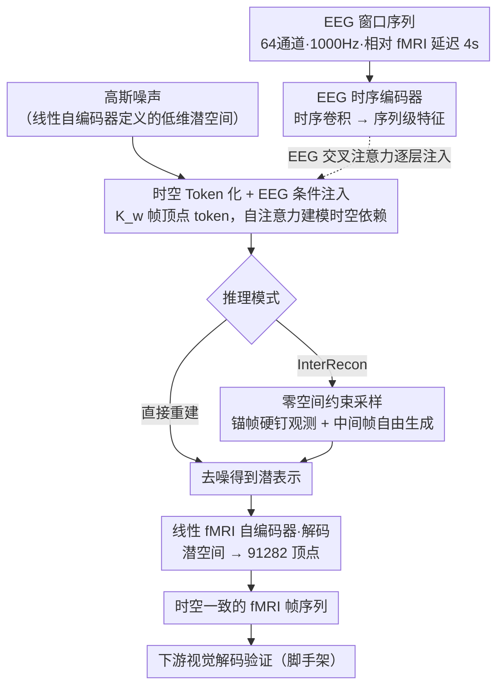

# Modeling Spatiotemporal Neural Frames for High Resolution Brain Dynamics

**会议**: CVPR 2026  
**arXiv**: [2603.24176](https://arxiv.org/abs/2603.24176)  
**代码**: 无  
**领域**: 3D视觉  
**关键词**: EEG转fMRI, 扩散模型, 时空建模, 中间帧重建, 视觉解码

## 一句话总结

提出基于扩散 Transformer 的 EEG 条件 fMRI 重建框架，将脑活动建模为时空神经帧序列而非独立快照，在皮层顶点级分辨率下实现时空一致的 fMRI 重建，并通过零空间采样支持中间帧插值，下游视觉解码任务验证了功能信息的保留。

## 研究背景与动机

1. **领域现状**：fMRI 提供高空间分辨率的皮层表征但采集成本高；EEG 提供毫秒级时间分辨率但空间精度低。EEG-to-fMRI 转换旨在利用两者互补性，从 EEG 推断 fMRI 级别的空间模式。
2. **现有痛点**：（1）ROI 级方法（如 NeuroBOLT）可建模时间连续性但空间分辨率低；（2）体素/皮层级方法（CNN-TC, CATD 等）有高空间保真度但逐帧独立重建，缺乏时间一致性；（3）评估仅依靠 MSE/SSIM 等低级指标，无法判断重建的 fMRI 是否保留功能性神经信息。
3. **核心矛盾**：高空间分辨率和时间连续性难以兼顾——独立重建保证空间精度但产生帧间伪影，序列建模保证时间连续但受限于空间粒度。
4. **本文目标** 如何在 91282 个皮层顶点的高空间分辨率下，重建时间上连续一致的 fMRI 帧序列。
5. **切入角度**：将脑活动建模为演化的时空神经帧（而非独立快照），用扩散 Transformer 同时建模顶点级空间细节和帧间时间依赖。
6. **核心 idea**：EEG 引导的扩散 Transformer 生成时空一致的 fMRI 序列，零空间约束采样实现中间帧重建。

## 方法详解

### 整体框架

输入：时间对齐的 EEG 窗口序列 $\mathbf{S}$（64 通道，1000Hz，相对 fMRI 延迟 4s）。输出：$K_w$ 帧的 fMRI 序列 $\mathbf{X} \in \mathbb{R}^{K_w \times N_v}$（$N_v=91282$ 个皮层顶点）。核心流程：EEG 经时序编码器提取特征 → 线性 fMRI 自编码器把顶点级帧压到低维潜空间 → 扩散 Transformer 在潜空间做 EEG 条件去噪 → 线性解码恢复顶点级 fMRI。推理时支持两种模式：直接重建，以及零空间约束的中间帧重建（InterRecon）；后者只换采样策略、复用同一套权重。

### 关键设计

**1. 时空 Token 化与 EEG 条件注入：把多帧当成一个序列，让自注意力自己学帧间依赖**

先前的体素/皮层级方法逐帧独立重建，每帧都是一次孤立的预测，帧与帧之间没有任何约束，结果就是相邻帧之间抖动、出现时间伪影。本文不再把每帧当成独立样本，而是把 $K_w$ 帧 fMRI 序列整体 token 化为 $(K_w \times N_v)$ 个顶点级 token，每个 token 额外带一个时间位置编码来标记它属于第几帧。这样一来，Transformer 的自注意力天然会在空间（同一帧内不同顶点）和时间（不同帧的同一顶点）两个方向上建立联系，帧间时间依赖不再需要额外的约束项去手工拼，而是从注意力里自然涌现。EEG 这一侧由时序卷积编码器抽成特征，在每个 Transformer 层通过交叉注意力注入到顶点 token，相当于在去噪的每一步都用 EEG 的毫秒级时间信息去引导空间结构往哪个方向演化。

**2. 零空间约束采样（InterRecon）：把"已知帧必须对得上"和"未知帧可以自由生成"在数学上解耦**

真实 fMRI 采集里经常有缺失或损坏的帧，而扩散模型直接生成又无法保证那些本该已知的锚帧和观测严格一致。本文把稀疏观测写成一个线性测量 $\mathbf{y} = \mathbf{A}\mathbf{X}$，其中 $\mathbf{A} = \text{diag}(m_1,...,m_{K_w})$ 用 0/1 掩码标出哪些帧是已知锚帧。关键在于每个反向扩散步骤里，把当前的去噪估计 $\mathbf{x}_{0|n}$ 拆成范围空间和零空间两部分：

$$\hat{\mathbf{x}}_{0|n} = \mathbf{A}^\dagger \mathbf{y} + (\mathbf{I} - \mathbf{A}^\dagger \mathbf{A})\mathbf{x}_{0|n}$$

前一项 $\mathbf{A}^\dagger \mathbf{y}$ 把锚帧硬钉在观测值上、保证完全匹配；后一项的投影 $(\mathbf{I} - \mathbf{A}^\dagger \mathbf{A})$ 只保留落在零空间里的那部分，也就是中间帧仍可由模型自由生成。举个具体场景：给定一段 10 帧序列、只保留第 1 帧和第 10 帧作为锚帧，采样时这两帧每一步都被拉回观测值，中间 8 帧则在 EEG 条件引导下逐步去噪生成，最终得到一条首尾对齐、中间连续的轨迹。整个过程不碰模型权重，用的就是直接重建那套检查点，只换了采样策略——所以它既是缺失帧补全的实用工具，又顺便变成时间一致性的内在检验：如果模型真学到了时间依赖，自由生成的中间帧就应该和锚帧自洽。

**3. 线性 fMRI 自编码器：用"线性"这个代价换零空间分解在潜空间里依然精确成立**

$N_v=91282$ 维的顶点级 fMRI 帧直接喂扩散 Transformer 太重，必须先降维。但降维这一步藏着陷阱：设计 2 的范围-零空间分解依赖 $\mathbf{A}^\dagger \mathbf{A}$ 这类线性投影，如果用常见的非线性自编码器把帧压到低维，投影 $(\mathbf{I} - \mathbf{A}^\dagger \mathbf{A})$ 在潜空间里就不再对应原始帧空间的同一个几何关系，分解会被破坏。本文因此刻意把编解码器都设成线性 MLP，把每帧映到一个远低于 9 万维的潜表示（$d \ll N_v$），并与扩散模型端到端一起训练。代价是表达能力受限，但换来的是零空间投影在压缩空间中仍然精确成立，让 InterRecon 可以直接在低维潜空间里做而不必回到 9 万维。

### 损失函数 / 训练策略

- 去噪分数匹配损失：$\mathcal{L}_{\text{diff}} = \mathbb{E}[\|\epsilon - \epsilon_\theta(\mathbf{x}^{(n)}, n, \mathbf{h}_\text{EEG})\|^2]$
- 扩散参数：1000 个时间步，线性噪声调度；推理用 DDIM 50 步
- 模型：6 层 Transformer，8 头注意力，隐藏维度 1024
- 训练：AdamW，lr=$1\times10^{-4}$，batch=32，200 epoch，单卡 A100
- 按受试者独立训练（within-subject），80/20 划分，测试集包含未见的视频片段

## 实验关键数据

### 主实验

动态 fMRI 帧重建（6 个受试者平均，10 帧长度，全脑区域）：

| 方法 | MSE ↓ | r ↑ | Cos ↑ |
|------|-------|-----|-------|
| CNN-TC | 0.315 | 0.804 | 0.824 |
| CNN-TAG | 0.309 | 0.810 | 0.829 |
| E2FNet | 0.297 | 0.819 | 0.836 |
| E2FGAN | 0.290 | 0.822 | 0.839 |
| **Ours** | **0.277** | **0.824** | **0.849** |

视觉皮层（V1）子区域，10 帧：MSE 0.193, r 0.834, Cos 0.887。

### 消融实验

中间帧重建（InterRecon）对比：

| 方法 | MSE ↓ | r ↑ | Cos ↑ |
|------|-------|-----|-------|
| Linear interpolation | 0.280 | 0.830 | 0.851 |
| Ours w/o null space | 0.272 | 0.839 | 0.852 |
| **Ours w/ null space** | **0.250** | **0.852** | **0.865** |

零空间约束带来全面提升：MSE 降低 8.1%，r 提升 1.5%，Cos 提升 1.5%。

### 关键发现

- **时间鲁棒性显著**：从 3 帧到 30 帧，本方法的全脑 MSE 仅从 0.282 变到 0.281，而 CNN-TC 从 0.302 恶化到 0.322。这证明时空联合建模有效捕捉长程时间依赖。
- **功能脑区表现更优**：视觉皮层和听觉皮层的重建指标显著优于全脑平均，符合电影观看任务下这些区域强烈驱动的神经科学预期。
- **下游视觉解码验证**：用 CineSync-f 解码器从重建 fMRI 生成视频，能恢复场景的粗略语义结构（人物、姿态、场景布局），证明重建保留了功能性神经表征。
- 零空间采样不需要重训练——使用与直接重建完全相同的模型检查点，仅改变采样策略。

## 亮点与洞察

- **时空帧范式转变**：将 fMRI 重建从"逐帧独立"转向"序列建模"，是概念上的重要转变。自注意力在时间和空间维度上的统一建模比先前的纯空间方法捕捉更完整的神经动态。
- **零空间采样的双重价值**：既是实用的缺失帧补全工具（真实 fMRI 预处理中的常见需求），又是时间一致性的内在评估方法——不需要额外指标就能验证模型是否学到了真正的时间依赖。
- **线性自编码器的巧妙约束**：用线性性换取数学性质保持是一个优雅的工程决策，使零空间分解在潜空间中精确成立。

## 局限与展望

- **受试者独立训练**：目前每个受试者单独训练模型，无法跨受试者泛化。跨受试者建模需要更强的解剖或功能对齐方法。
- **固定的 EEG-fMRI 延迟**：使用固定 4s 延迟，但真实血流动力学延迟因脑区和时间变化。可引入可学习的对齐模块。
- 线性自编码器的表达能力有限，可探索保持零空间分解性质的轻度非线性设计
- 下游视觉解码的定量评估较少，仅有定性可视化

## 相关工作与启发

- **vs NeuroBOLT**: ROI 级别建模自然有时间一致性但空间分辨率低（几百个脑区 vs 91282 个顶点）。本文填补了"高空间分辨率 + 时间一致性"的空白。
- **vs CATD**: 皮层级 fMRI 翻译模型但逐帧独立重建。本文证明序列化建模在全脑和功能脑区上均优于逐帧方法。
- **vs 图像扩散模型**: 借鉴了 DiT 和零空间扩散采样的思想，但应用于神经科学领域的高维时空数据，展示了扩散模型在科学数据建模中的潜力。

## 评分

- 新颖性: ⭐⭐⭐⭐ 将 fMRI 重建重新定义为时空序列生成问题，零空间采样用于中间帧重建且无需重训练
- 实验充分度: ⭐⭐⭐⭐ 多帧长度、多脑区、多基线、InterRecon、下游解码全面验证，但仅6个受试者且单一数据集
- 写作质量: ⭐⭐⭐⭐ 数学推导严谨，方法描述清楚，但对神经科学背景的读者可能偏向机器学习
- 价值: ⭐⭐⭐⭐ 为多模态神经影像联合建模提供了新范式，但应用场景相对小众

<!-- RELATED:START -->

## 相关论文

- [\[CVPR 2026\] LoG3D: Ultra-High-Resolution 3D Shape Modeling via Local-to-Global Partitioning](log3d_ultra-high-resolution_3d_shape_modeling_via_local-to-global_partitioning.md)
- [\[CVPR 2026\] Lighting in Motion: Spatiotemporal HDR Lighting Estimation](lighting_in_motion_spatiotemporal_hdr_lighting_estimation.md)
- [\[CVPR 2026\] Can Natural Image Autoencoders Compactly Tokenize fMRI Volumes for Long-Range Dynamics Modeling?](can_natural_image_autoencoders_compactly_tokenize_fmri_volumes_for_long-range_dy.md)
- [\[CVPR 2026\] LiteSense: Lifting Lightweight ToF with RGB for High-Resolution Metric Depth Estimation](litesense_lifting_lightweight_tof_with_rgb_for_high-resolution_metric_depth_esti.md)
- [\[CVPR 2026\] Turbo-GS: Accelerating 3D Gaussian Fitting for High-Resolution Radiance Fields](turbo-gs_accelerating_3d_gaussian_fitting_for_high-quality_radiance_fields.md)

<!-- RELATED:END -->
