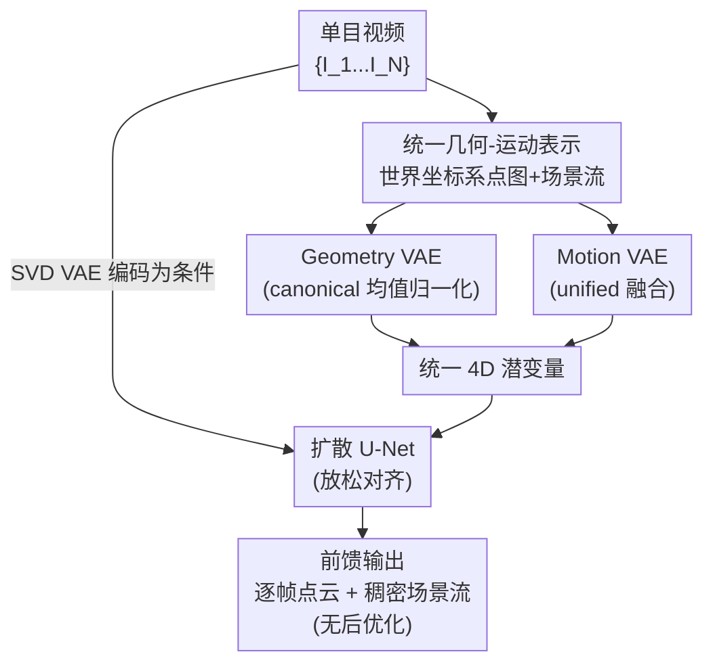

# MotionCrafter: Dense Geometry and Motion Reconstruction with a 4D VAE

**会议**: CVPR 2026  
**论文**: [CVF Open Access](https://openaccess.thecvf.com/content/CVPR2026/html/Zhu_MotionCrafter_Dense_Geometry_and_Motion_Reconstruction_with_a_4D_VAE_CVPR_2026_paper.html)  
**代码**: [项目页](https://ruijiezhu94.github.io/MotionCrafter_Page/)  
**领域**: 3D视觉  
**关键词**: 4D 重建, 场景流, 视频扩散先验, 点云, VAE 归一化

## 一句话总结
MotionCrafter 把单目视频的稠密几何（点云）与稠密运动（3D 场景流）放进同一个世界坐标系，用一个专门设计的 4D VAE 把二者编码成统一潜变量，再借预训练视频扩散模型的时空先验做前馈重建；它还反直觉地证明「4D 数据不必强行对齐到 RGB VAE 的分布」，最终几何/运动重建分别比 SOTA 提升 38.64% 和 25.0%，且全程无需任何后优化。

## 研究背景与动机

**领域现状**：从单目视频同时恢复动态场景的 4D 几何和稠密点运动，是视频理解、机器人、世界模型的共同底座。传统做法靠像素对应 + 逐场景迭代优化网格去拟合 RGB(D) 观测；深度学习时代则把任务拆成「动态几何重建」和「对应估计」两条线分头做。近来 St4RTrack、Dynamic Point Maps、Stereo4D 等前馈方法把 DUSt3R/MASt3R 这类静态重建网络扩展到动态场景，成为有希望的替代路线。

**现有痛点**：这些前馈方法大多是 DUSt3R 式的「成对帧」设计——一次只处理两帧，靠预测目标时刻相对参考帧的点图，再用后优化（post-optimization）把成对结果对齐拼成序列。这样做有两个硬伤：一是只能捕捉短程对应，长视频里的长程运动连贯性丢失；二是运动只在「首帧 ↔ 其它帧」之间建模，对视角变化引起的遮挡、以及后续帧里新出现的动态物体很不鲁棒。同时，几何重建和运动估计本是同源（都依赖多视几何里的像素对应），却被拆成两个独立子任务分头学，浪费了二者的相关性。

**核心矛盾**：一方面任务本身严重 ill-posed 且缺大规模带稠密几何+运动标注的野外数据；另一方面，想借预训练扩散模型的强先验来缓解数据稀缺，业界又普遍相信「必须把 3D 属性严格归一化到 $[-1,1]$、对齐原始 RGB VAE 的分布」才能继承先验——可世界坐标下的 3D 坐标是无界的 $(-\infty,+\infty)$，分布天然就和 $[0,255]$ 的自然图像不同，强行对齐反而损害重建。

**本文目标**：(1) 用一种表示把稠密几何与稠密运动统一起来联合建模；(2) 用一个能高效编码这种 4D 表示的 VAE，把视频扩散先验迁移过来；(3) 厘清「微调扩散模型时到底要不要严格对齐数据/潜空间」。

**切入角度**：作者主张要真正理解动态 3D 场景，必须在**同一个共享世界坐标系**里、对**整段视频**联合建模稠密几何和运动。把场景流也定义在世界坐标系里，能天然消掉相机自身运动的分量——静态背景点理想情况下场景流为零，动态物体的运动模式因此更容易学。

**核心 idea**：用「世界坐标系下点图 + 场景流」的统一 4D 表示替代「成对点图 + 后优化」，并用一个专门的 4D VAE 把它压进紧凑潜空间，前馈地接到预训练视频扩散模型上；同时放松「数据/潜空间必须对齐 RGB VAE」的约束，换成更贴合 3D 分布的归一化策略。

## 方法详解

### 整体框架
MotionCrafter 要解决的是：输入一段单目视频 $\{I_i\}_{i=1}^N$（每帧 $I_i\in\mathbb{R}^{H\times W\times 3}$），前馈输出每帧在世界坐标系下的视点无关点图 $X_i\in\mathbb{R}^{H\times W\times 3}$ 和相邻帧之间的 3D 场景流 $V_{i\to i+1}\in\mathbb{R}^{H\times W\times 3}$，即学一个网络 $f_\theta:\{I_i\}_{i=1}^N\to\{X_i,V_{i\to i+1}\}_{i=1}^N$（只预测前向流，末帧 $N$ 不监督流）。

整体分三层：(1) **统一 4D 表示**——把几何（点图）和运动（场景流）都放进以首帧为原点的世界坐标系；(2) **4D VAE**——由一个 Geometry VAE 和一个 Motion VAE 组成，把点图和场景流联合编码进一个统一 4D 潜变量，这是本文的核心创新；(3) **扩散 U-Net**——复用 Stable Video Diffusion（SVD）的预训练 VAE 把输入视频编码成条件潜变量，与 4D 潜变量按通道拼接后引导去噪，训练时只对 4D 潜变量加噪。整个 VAE 先两阶段训好后冻结，再训扩散 U-Net。关键反直觉点贯穿始终：**不强制 4D 潜变量分布对齐 SVD VAE 的原始分布**，这种「放松对齐」反而同时提升了 VAE 和 U-Net 的泛化。

### 关键设计

**1. 统一几何-运动表示：把点图和场景流都钉进同一个世界坐标系**

针对「成对帧 + 后优化」无法建模整段长程运动、且对遮挡敏感的痛点，作者像 DUSt3R 一样把首帧坐标系当世界坐标系：点图 $X_i$ 存每个像素的 3D 坐标 $(x,y,z)$，场景流 $V_i$ 存像素从第 $i$ 帧到 $i+1$ 帧的 3D 位移 $(\Delta x,\Delta y,\Delta z)$，两者都在世界系里。理想情况下形变点图 $X_i^d = X_i + V_i$ 应该空间对齐到下一帧点图 $X_{i+1}$，但由于视角变化，$X_i^d$ 和 $X_{i+1}$ 在像素空间并非一一对应（同一物理点在两帧的像素索引 $p_i$ vs $p_{i+1}$ 不同，甚至出画），所以不能在像素空间硬建对应——这正是作者用 VAE 编码到潜空间、绕开显式像素对应的理由。这种表示的好处是：**无相机**（在世界系定义几何+运动，省掉额外相机位姿估计）、**时序一致**（连续视频里几何和运动本就连贯，同坐标系联合更易学）、**运动建模更丰富**（场景流定义在每一对相邻帧之间，而非只对首帧，对视角遮挡更鲁棒、能捕捉后续新出现物体的运动）。因为运动直接在世界系，相机自运动被天然剥离，静态背景点理想场景流为零。

**2. 带修正归一化的 Geometry VAE：用均值归一化替代 max 归一化，放弃对齐 RGB 分布**

针对「3D 坐标无界、分布异于自然图像，强行 max 归一化到 $[-1,1]$ 反而损害重建」的痛点，作者对每段世界坐标点图序列改用 canonical（均值-尺度）归一化：

$$\hat{X}_i = \frac{X_i - \mu}{S},\quad \mu = \frac{1}{|D|}\sum_{d\in D} X_d,\quad S = \frac{1}{|D|}\sum_{d\in D}\lVert X_d - \mu\rVert_2 + \varepsilon$$

其中 $D$ 是点图序列里所有有效点，$\mu$ 是均值（把坐标中心化），$S$ 是到中心的平均距离（按场景尺度缩放），$\varepsilon$ 保数值稳定。它保持了点图的尺度不变性，同时对大尺度室外场景能更好保留细结构。和现有做法（冻结 VAE、只微调 decoder，如 Geo4D）不同，作者**微调整个 encoder-decoder**，给输入分布更大的灵活度。训练目标为

$$L_G = L_{point} + \lambda_d L_{depth} + \lambda_n L_{normal}$$

其中 $L_{point}$ 是点图重建 MSE，$L_{depth}$ 是投影深度图上的多尺度损失，$L_{normal}$ 约束表面法线一致——这里因为是世界坐标点云，作者把 GT 相机位姿和点云一起归一化，用尺度对齐后的相机参数把点云投影成深度图。作者还试过加 KL 散度把潜变量约束成标准高斯，结果 VAE 性能大跌，于是弃用。这条设计正面回答了核心问题：对 3D 属性而言，严格对齐扩散模型的输入/潜空间并非必要，放松后泛化反而更好。

**3. Motion VAE 与统一融合：把几何潜变量和运动潜变量拼成一个 4D 潜变量再解运动**

运动和几何本就相关，单独学运动是次优的。作者比较了三种融合：**no fusion**（几何/运动各编各的、不交互）、**offset fusion**（仿 LayerDiffuse，把运动潜变量当偏移加到几何潜变量上）、**unified fusion**（把几何与运动潜变量拼接成统一 4D 潜变量，喂给 Motion VAE 解码器重建场景流）。虽然在 VAE 阶段 unify 不是重建最优（separate 更好），但接到下游扩散 U-Net 后 unify 反而最优，说明紧耦合几何-运动表示对连贯 4D 建模更重要。训练 Motion VAE 时冻结 Geometry VAE 以保住其几何先验，目标为

$$L_M = \underbrace{\frac{1}{|D|}\sum_{d\in D}\lVert \hat{V}_d - V_d\rVert_2^2}_{\text{场景流重建}} + \lambda_{reg}\underbrace{\frac{1}{|N|}\sum_{n\in N}\lVert \hat{V}_n\rVert_2^2}_{\text{零流正则}}$$

第一项是有效像素 $D$ 上的场景流 MSE，第二项遵循 as-static-as-possible 假设、把全体像素 $N$ 的流往零拉（背景该不动）。两个 VAE 合成统一 4D VAE 后，几何与运动就被整进一个潜空间，实现高效的 4D 场景编解码。

**4. 渐进式两阶段训练 + EDM 双范式：先各自学好几何/运动先验，再冻结接扩散 U-Net**

为了既继承视频生成器先验、又稳住训练，作者用模块化的两阶段流程：先独立训 Geometry VAE（40k 步）抓几何；再冻结它训 Motion VAE（20k 步）、保住几何先验；收敛后合成统一 4D VAE 并冻结，最后训扩散 U-Net（40k 步）。U-Net 训练里几何监督用数据组 (1)+(2)、运动监督只用带稠密流标注的组 (2)。框架基于 EDM 预条件，支持确定性与去噪两种范式：确定性范式目标

$$L_{deterministic} = L_{latent} + \lambda_G L_G + \lambda_M L_M$$

其中 $L_{latent}$ 是潜空间扩散损失，含几何潜变量监督 $\frac{1}{N}\sum_N\lVert\hat{z}^G_i - z^G_i\rVert_2^2$ 和运动潜变量监督 $\frac{1}{N-1}\sum_{N-1}\lVert\hat{z}^M_i - z^M_i\rVert_2^2$（末帧丢弃运动潜变量，因只做前向流）；去噪范式则简化为 $L_{denoise}=L_{latent}$。实验发现确定性范式普遍更好，作为默认。VAE 与 U-Net 都用 SVD 预训练权重初始化，AdamW、学习率 1e-4，8×40GB GPU 约 3 天。

> 框架↔图↔关键设计对应：图中「统一几何-运动表示」「Geometry VAE」「Motion VAE」「扩散 U-Net」四个贡献节点分别对应设计 1/2/3/4（其中训练范式归入设计 4）；SVD VAE 编码条件、输入视频、输出为脚手架节点，不单列设计。

## 实验关键数据

### 主实验

**联合几何+运动重建（世界坐标系，Tab. 1）**：在 Kubric / Spring / VKITTI2 / Dynamic Replica / Point Odyssey 五个数据集上，几何用相对点误差 Relp↓ 和内点比 δp↑（阈值 0.25），运动用 EPE↓ 和 APD↑。对比方法多为 DUSt3R 式成对设计，需用 VGGT 预测的相机位姿转到世界系。MotionCrafter 平均几何提升 38.64%、运动提升 25.0%，几何与运动的平均 Rank 均为 1.0。

| 数据集 / 指标 | 本文 | ST4RTrack-P+VGGT | Zero-MSF+VGGT |
|--------|------|------|------|
| Kubric 几何 Relp↓ | **3.40** | 17.81 | 8.79 |
| Kubric 几何 δp↑ | **98.73** | 80.76 | 94.73 |
| Spring 几何 Relp↓ | **29.20** | 157.05 | 142.44 |
| Point Odyssey 几何 δp↑ | **94.90** | 71.66 | 78.27 |
| Spring 运动 EPE↓ | **5.61** | 441.84 | 7.78* |
| VKITTI2 运动 APD0.3↑ | **25.90** | 13.16 | 21.69* |
| 几何 / 运动 平均 Rank↓ | **1.0 / 1.0** | 3.4 / 4.8 | 4.6 / 2.4 |

值得注意：作者并未用 Dynamic Replica 和 Point Odyssey 的运动标注训练（非 zero-shot 的 Zero-MSF 用了），却在除一个可比指标外全面更好。

**纯几何重建（Tab. 2）**：在 Monkaa / Sintel / DDAD 上零样本测试，与相机中心方法（DepthPro、MoGe、GeoCrafter）和世界中心方法（MonST3R†、VGGT、Geo4D†、St4RTrack）比，†表示用了后优化。

| 数据集 / 指标 | 本文(无后优化) | VGGT | Geo4D† |
|--------|------|------|------|
| Monkaa Relp↓ | **25.88** | 34.54 | 28.04 |
| Monkaa δp↑ | **74.01** | 56.65 | 69.52 |
| Sintel Relp↓ | 32.46 | **26.83** | 34.61 |
| DDAD Relp↓ | 21.27 | **15.98** | 14.58 |
| 平均 Rank↓ | 2.67 | **2.33** | 2.33 |

本文在 Monkaa 取得 SOTA；Sintel/DDAD 上略逊于 VGGT，作者归因于自己是单模态设计（无相机射线、深度图）且室外训练数据规模有限，但全程不做后优化（不像 Geo4D†）。

### 消融实验

**Geometry VAE 归一化与训练方式（Tab. 3）**：在 Sintel/Monkaa 上同时报 VAE 和 U-Net 阶段的几何结果。

| 配置 | 训练方式 / 归一化 | Monkaa Relp↓ | Monkaa δp↑ |
|------|---------|------|------|
| VAE-1 | Original / Max | 23.78 | 67.33 |
| VAE-2 | From scratch / Max | 11.48 | 90.55 |
| VAE-3 | Finetune decoder / Max | 14.44 | 85.91 |
| VAE-4 | Finetune all / **Mean (本文)** | **5.03** | **99.13** |
| Unet-I | VAE-3 + Unet / Max | 33.66 | 56.42 |
| Unet-II | VAE-4 + Unet / Mean | **27.36** | **66.21** |

VAE-4（均值归一化 + 全量微调）远胜 max 归一化各变体；落到 U-Net 阶段（Unet-I vs Unet-II）平均带来 16.6% 的几何增益，证明放松对齐反而泛化更好。

**Motion VAE 融合策略（Tab. 4）**：在 Spring/Point Odyssey 上比 Original/Offset/Separate/Unify。

| 配置 | 融合方式 | Spring EPE↓ | Spring APD0.03↑ |
|------|---------|------|------|
| VAE-7 | Separate | **0.66** | **96.75** |
| VAE-8 | Unify | 0.88 | 94.78 |
| Unet-III | Separate | 6.37 | 65.94 |
| Unet-IV | Unify | **5.16** | **72.81** |

VAE 阶段 Separate 重建更优，但接到 U-Net 后 Unify 反而最好，印证「紧耦合几何-运动」对连贯 4D 建模更关键。

### 关键发现
- **放松对齐是反直觉的核心结论**：3D 属性不必强行归一化到 $[-1,1]$ 对齐 RGB VAE；均值归一化 + 全量微调既保住又增强了扩散模型的泛化，U-Net 几何平均 +16.6%。
- **VAE 重建最优 ≠ 下游最优**：无论几何归一化还是运动融合，VAE 阶段的最优配置（如 Separate）到了 U-Net 阶段都被另一个配置（Unify）反超，说明评估必须看下游而非只看 VAE 重建。
- **视频生成器确实自带有用先验**：用原始预训练 VAE 在室内场景已有合理重建能力，但室外大尺度变化下失效；VAE-2（从头训）次优反证了 SVD 预训练先验对稠密 4D 重建确实有益。

## 亮点与洞察
- **把场景流定义在世界坐标系里**是点睛之笔：相机自运动被天然剥离，静态背景理想流为零（再配合零流正则），动态物体的运动模式因此凸显、更易学，也免去显式相机位姿估计。
- **「VAE 最优不等于下游最优」这个观察很有迁移价值**：任何「预训练编码器 + 下游生成/预测」的两阶段系统，都应该按端到端下游指标选配置，而不是只盯中间重建质量。
- **挑战「必须对齐 RGB VAE 分布」的成见**：这条结论对所有想把扩散先验迁到非 RGB 模态（深度、法线、流、3D 属性）的工作都有启发——与其削足适履地塞进 $[-1,1]$，不如用贴合该模态的归一化 + 全量微调。

## 局限与展望
- 作者承认目前只做稠密几何+运动两种模态；已有工作表明融合相机参数、深度图、点轨迹、新视角等多模态能显著提升 3D 属性预测，多模态整合是明确的下一步。
- 室外大尺度场景上略逊于 VGGT，作者归因于单模态设计（无相机射线/深度）和室外训练数据规模有限——说明方法对训练数据的领域覆盖较敏感。
- 依赖合成数据训练运动（真实世界缺稠密场景流标注），野外真实动态场景的泛化仍待更系统验证；同时方法只预测前向流、末帧不监督，长视频累积漂移的鲁棒性值得进一步考察。⚠️ 后两点为笔者推断，以原文为准。

## 相关工作与启发
- **vs Geo4D**：Geo4D 也借视频生成器做 4D 点图重建，但只输出每帧独立点图、不建模点间稠密运动，且冻结 VAE 只微调 decoder、坚持对齐分布；本文统一建模几何+运动于一个 4D VAE，并证明不必对齐数据/潜空间。
- **vs St4RTrack / Dynamic Point Maps / Stereo4D**：它们是 DUSt3R 式成对帧设计，一次处理两帧、靠后优化拼序列，运动只对首帧建模；本文前馈处理整段序列、相邻帧间稠密建流、无后优化，长程连贯性与抗遮挡更好。
- **vs VGGT**：VGGT 是强力世界中心几何重建器（本文也用它的位姿帮基线转世界系），在 Sintel/DDAD 室外几何上更强；但 VGGT 不显式建模稠密点运动，本文以单模态换来了联合几何+运动能力。

## 评分
- 新颖性: ⭐⭐⭐⭐⭐ 统一 4D 表示 + 4D VAE + 「放松对齐」反直觉结论，三点都有分量。
- 实验充分度: ⭐⭐⭐⭐ 多数据集主结果 + 归一化/融合两组关键消融齐全，但室外几何偏弱、运动依赖合成数据。
- 写作质量: ⭐⭐⭐⭐⭐ 动机推导清晰，把「为什么不对齐」讲透，图表自洽。
- 价值: ⭐⭐⭐⭐⭐ 前馈无后优化、SOTA，且「扩散先验迁到非 RGB 模态」的洞察可广泛复用。

<!-- RELATED:START -->

## 相关论文

- [\[CVPR 2026\] Motion 3-to-4: 3D Motion Reconstruction for 4D Synthesis](motion_3-to-4_3d_motion_reconstruction_for_4d_synthesis.md)
- [\[CVPR 2026\] FE2E: From Editor to Dense Geometry Estimator](from_editor_to_dense_geometry_estimator.md)
- [\[CVPR 2026\] MoRe: Motion-aware Feed-forward 4D Reconstruction Transformer](more_motion-aware_feed-forward_4d_reconstruction_transformer.md)
- [\[CVPR 2026\] MotionScale: Reconstructing Appearance, Geometry, and Motion of Dynamic Scenes with Scalable 4D Gaussian Splatting](motionscale_reconstructing_appearance_geometry_and_motion_of_dynamic_scenes_with.md)
- [\[CVPR 2026\] GeoDiff4D: Geometry-Aware Diffusion for 4D Head Avatar Reconstruction](geodiff4d_geometry-aware_diffusion_for_4d_head_avatar_reconstruction.md)

<!-- RELATED:END -->
