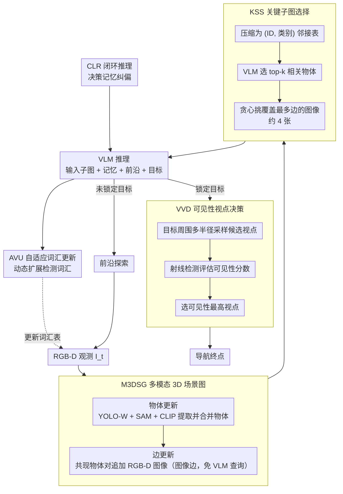

# MSGNav: Unleashing the Power of Multi-modal 3D Scene Graph for Zero-Shot Embodied Navigation

**会议**: CVPR 2026  
**arXiv**: [2511.10376](https://arxiv.org/abs/2511.10376)  
**代码**: 无  
**领域**: 3D Vision / Embodied Navigation  
**关键词**: 具身导航, 3D场景图, 零样本导航, 多模态场景图, 视点决策, VLM

## 一句话总结

提出多模态3D场景图（M3DSG），用动态分配的图像边替代传统文本关系边来保留视觉信息，构建零样本导航系统MSGNav，并提出可见性视点决策模块解决导航"最后一公里"问题，在GOAT-Bench和HM3D-ObjNav上取得SOTA。

---

## 研究背景与动机

具身导航（Embodied Navigation）要求智能体在未知环境中根据目标（类别/语言描述/参考图像）自主探索导航。传统RL方法泛化差、sim-to-real gap大，零样本方法因无需训练微调而更适合真实场景部署。

近期，基于显式3D场景图+LLM推理的零样本导航方法（如SG-Nav）表现不错，但传统3D场景图将物体关系过度抽象为纯文本标签（"top"、"beside"等），带来三个严重问题：

**构建代价高**：需频繁调用MLLM推断关系，token和时间开销巨大

**视觉信息不可逆丢失**：将丰富的视觉观测压缩为文本标签后，歧义增加且对感知错误敏感

**词汇表受限**：超出预设词汇的新类别无法表示，泛化能力受限

此外，作者还发现了一个被忽视的"最后一公里"（last-mile）问题：**知道目标位置不等于找到合适的导航终点视角**。现有方法通常选最近可通行点作为终点，但太近或被遮挡的视角会导致任务失败——统计显示3D-Mem有大量失败案例停在距目标0.25m~1.0m处。

**核心问题意识**：视觉信息对真实导航不可或缺，传统文本场景图的信息瓶颈和视点选择的盲区是当前性能提升的两大障碍。

---

## 方法详解

### 整体框架

这篇论文要解决两个零样本导航的老问题：传统 3D 场景图把物体关系压成纯文本标签（"top""beside"），既要频繁调 MLLM 推关系、又把视觉信息不可逆地丢掉、还受限于预设词汇；以及一个被忽视的"最后一公里"问题——知道目标在哪不等于找到一个看得见目标的好落脚点。

MSGNav 的整体流程是"增量构建场景图 → 高效推理 → 最优视点决策"。每个时间步 $t$，智能体接收 RGB-D 观测 $\mathcal{I}_t$ 增量更新场景图 $\mathbf{S}_t$；推理时先用 KSS 从膨胀的场景图里抠出目标相关子图喂给 VLM，由 VLM 定位目标或决定前沿探索方向；一旦锁定目标，再由 VVD 在目标周围挑一个可见性最高的视点作为导航终点。整套系统由 M3DSG、KSS、AVU、CLR、VVD 五个模块组成。

### 关键设计

**1. M3DSG 多模态 3D 场景图：用图像边代替文本边，既省 MLLM 调用又留住视觉**

传统场景图把物体关系抽象成文本标签，导致构建贵（每条关系都要查 MLLM）、视觉信息丢失、词汇受限。M3DSG 把场景图定义为 $\mathbf{S}=(\mathbf{O}, \mathbf{E})$，关键差异是每条边存的不是文本，而是一组记录物体对共现视觉上下文的 RGB-D 图像 $\mathbf{I}_j$。构建分两步：物体更新用 YOLO-W（开放词汇检测）+ SAM（实例掩码）+ CLIP（视觉嵌入）从每帧提取物体，每个物体记 ID、类别、3D 坐标、包围框、掩码、点云、视觉特征、房间位置共 8 个属性，新物体按空间+视觉相似性与已有物体匹配合并；边更新则对当前帧中距离小于阈值 $\theta$ 的共现物体对，把当前帧图像追加进对应边的图像集合，同时维护图像→物体对的反向映射 $\mathbf{H}$。整个边构建无需任何 VLM 查询，因此高效、保留原始视觉证据、并支持词汇无限扩展。

**2. KSS 关键子图选择：从膨胀的场景图里只抠出和目标相关的一小撮图像**

随探索推进场景图迅速膨胀，整图喂 VLM 既慢又贵。KSS 用"压缩-聚焦-剪枝"三步收缩：先把场景图简化成仅含 (ID, 类别) 的邻接表（Compress），输入 VLM 选出与目标最相关的 top-k 物体集 $\mathbf{O}^{rel}$（Focus），再用贪心动态分配算法逐步挑覆盖最多边的图像、借反向映射 $\mathbf{H}$ 高效求解这个集合覆盖问题（Pruning）。最终关键子图平均只需约 4 张图像就能表示目标相关上下文，token 开销下降超过 95%。

**3. AVU 自适应词汇更新：让 VLM 边走边把没见过的新类别补进词汇表**

预设词汇表（如 ScanNet-200）限制开放世界泛化。AVU 在探索过程中让 VLM 检视边图像、与现有物体对比后动态提议新词汇 $\hat{V}_t$，并入总词汇表 $V_t = V_{t-1} \cup \hat{V}_t$，实现词汇的渐进式扩展。

**4. CLR 闭环推理：用决策记忆避免反复犯同样的探索错误**

引入决策记忆 $\mathbf{M}$，把每步探索决策 $\mathcal{R}_t$ 存进历史动作库供后续参考，决策与词汇更新同时产出

$$\mathcal{R}_t, \hat{V}_t = \text{VLM}(\mathbf{S}^k, \mathbf{M}_t, \mathbf{F}, g, t)$$

通过记忆历史反馈形成闭环、避免重复错误决策。AVU 与 CLR 互补——AVU 提供额外感知信息补充 CLR 的严格决策，CLR 又过滤 AVU 引入的噪声感知。

**5. VVD 基于可见性的视点决策：解决"到了附近却看不见目标"的最后一公里**

现有方法常把最近可通行点当终点，但太近或被遮挡的视角会直接让任务失败。VVD 在目标物体 $\bar{o}$ 周围按多个半径 $\mathbf{R}$ 均匀采样候选视点，对每个候选视点 $\mathbf{v}_i$ 用射线检测评估它到目标点云 $\mathcal{PC}_{\bar{o}}$ 的可见性——沿视线采样点，检查是否所有采样点到最近场景点云的距离都大于遮挡阈值 $\tau$，可见性分数定义为目标点云中可见点的比例

$$S_{\mathbf{v}_i} = \frac{1}{|\mathcal{PC}_{\bar{o}}|} \sum_{\mathbf{p} \in \mathcal{PC}_{\bar{o}}} \mathbb{1}_{\mathcal{E}(\mathbf{v}_i, \mathbf{p})}$$

选分数最高的视点作为导航终点。

### 训练策略

零样本方法，无需任何训练或微调。使用GPT-4o（2024-08-06）作为VLM backbone，YOLO-W做开放词汇检测，SAM做实例分割，CLIP做视觉嵌入。GOAT-Bench成功距离阈值为0.25m，HM3D-ObjNav为1.0m。

---

## 实验关键数据

### 主实验：GOAT-Bench（多模态终身开放词汇导航）

| 方法 | 是否免训练 | SR(%) ↑ | SPL(%) ↑ |
|---|:---:|:---:|:---:|
| SenseAct-NN Skill Chain | ✗ | 29.5 | 11.3 |
| VLMnav | ✓ | 20.1 | 9.6 |
| DyNaVLM | ✓ | 25.5 | 10.2 |
| 3D-Mem | ✓ | 28.8 | 15.8 |
| TANGO | ✓ | 32.1 | 16.5 |
| MTU3D（训练方法SOTA） | ✗ | 47.2 | 27.7 |
| **MSGNav (Ours)** | **✓** | **52.0** | **29.6** |

MSGNav超越训练方法MTU3D +4.8% SR、+1.9% SPL，且无需任何训练。

### 主实验：HM3D-ObjNav

| 方法 | 是否免训练 | SR(%) ↑ | SPL(%) ↑ |
|---|:---:|:---:|:---:|
| SG-Nav | ✓ | 49.6 | 25.5 |
| VLFM | ✗ | 62.6 | 31.0 |
| DORAEMON | ✓ | 66.5 | 20.6 |
| WMNav | ✓ | 72.2 | 33.3 |
| **MSGNav (Ours)** | **✓** | **74.1** | **33.4** |

### 消融实验：各模块贡献（GOAT-Bench Val Unseen，首轮episode）

| M3DSG | VVD | AVU | CLR | Overall SR(%) | Overall SPL(%) |
|:---:|:---:|:---:|:---:|:---:|:---:|
| | | | | 28.8 | 20.2 |
| ✓ | | | | 43.8 (+15.0) | 28.0 (+7.8) |
| ✓ | ✓ | | | 56.3 (+12.5) | 34.7 (+6.7) |
| ✓ | ✓ | ✓ | | 55.3 | 36.7 |
| ✓ | ✓ | | ✓ | 53.2 | 32.9 |
| ✓ | ✓ | ✓ | ✓ | **60.0** | **37.0** |

- M3DSG 贡献最大（+15.0% SR），VVD次之（+12.5% SR）
- AVU和CLR单独使用效果有限甚至有退化，但**二者互补**：AVU提供额外感知信息补充CLR的严格决策，CLR过滤AVU引入的噪声感知

### 消融实验：场景图类型对比

| 场景图类型 | Overall SR(%) | Overall SPL(%) |
|---|:---:|:---:|
| Node-only（无关系边） | 51.8 | 31.2 |
| Traditional graph（文本边） | 56.2 | 32.7 |
| **M3DSG（图像边）** | **60.0** | **37.0** |

图像边相比文本边提升 **+3.8% SR, +4.3% SPL**，在Language和Image类目标上提升尤为显著。

### VVD模块在不同成功阈值下的效果

| 成功阈值 d(m) | w/o VVD SR(%) | w/ VVD SR(%) | 增益 |
|:---:|:---:|:---:|:---:|
| 0.25（标准） | 33.91 | 51.97 | +18.06 |
| 0.55 | 57.44 | 63.03 | +5.59 |
| 1.00 | 62.38 | 66.52 | +4.14 |

### 关键发现

1. M3DSG是最大增益模块，相比baseline 3D-Mem带来+15.0% SR提升
2. VVD在标准阈值0.25m下恢复约18%绝对SR，证实大量失败确实卡在最后一步视点选择
3. AVU与CLR互补——开放词汇扩展引入噪声，闭环推理可纠偏
4. 图像边相比文本边在Language和Image目标上优势显著
5. VVD可见性分数>0.6的视点始终靠近GT视点

---

## 亮点与洞察

- **图像边替代文本边**是一个简洁而高效的设计：既避免频繁MLLM推理调用，又保留丰富视觉上下文。"少即是多"——与其费力抽象为文本，不如让VLM自己从原始图像中理解关系
- **最后一公里问题的识别和形式化**很有价值。导航不仅是到达，更是到达一个"好的位置"，这在实际机器人部署中常被忽略
- **贪心子图选择算法**实现95%的token压缩，平均每次仅需4张图像，兼顾效率与信息量
- 零样本设定下超越训练型方法（52.0% vs 47.2%），展示了场景表示+VLM推理范式的巨大潜力
- 整体系统模块化程度高，各模块可独立消融验证，工程设计成熟

---

## 局限性与可改进方向

1. **推理效率瓶颈**：依赖VFMs和VLMs的在线推理（YOLO-W+SAM+CLIP+GPT-4o），实时部署仍困难。需探索更轻量的图构建和推理方案
2. **Last-mile未彻底解决**：VVD缓解但未消除该问题，放宽阈值后仍有提升空间。RL主动感知方向值得探索
3. **VLM依赖**：系统高度依赖GPT-4o的推理能力和API调用，成本高且受限于网络。补充材料中仅验证了Qwen-VL-Max
4. **图像边存储开销**：保留大量RGB-D图像的存储成本未被讨论，长时间探索可能带来内存压力
5. **仅在仿真环境验证**：缺乏真实物理环境的实验

---

## 相关工作与启发

- **3D-Mem**：强调原始图像对导航的价值，M3DSG在此基础上引入场景图结构来组织视觉信息
- **ConceptGraphs**（ICRA 2024）：传统的开放词汇3D场景图，使用文本关系边；M3DSG的对比实验清楚展示了图像边的优势
- **SG-Nav**：同样利用层级场景图进行导航，使用文本提示LLM，受限于文本关系表示
- **GOAT-Bench**（CVPR 2024）：多模态终身导航benchmark，定义了类别/语言/图像三种目标类型

**启发**：显式3D场景图+VLM推理已成为零样本导航的主流范式。M3DSG提示我们，表示的设计（图像 vs 文本）可能比模型选择更关键——在构建阶段保留原始感知数据，让VLM在推理阶段按需理解，是一个值得推广的设计原则。

---

## 评分

| 维度 | 分数 (1-5) | 说明 |
|---|:---:|---|
| 创新性 | 4 | 图像边替代文本边的想法简洁有效，最后一公里问题的形式化有新意 |
| 技术质量 | 4 | 模块设计合理，算法清晰，消融实验充分 |
| 实验充分度 | 4.5 | 两个benchmark + 全面消融 + 分类别分析 + VVD统计验证 |
| 写作质量 | 4 | 问题定义清晰，图表直观，逻辑流畅 |
| 实用性 | 3.5 | 推理效率仍受限于多个大模型的在线调用 |
| **综合** | **4.0** | 扎实的系统性工作，M3DSG设计巧妙且效果显著 |

<!-- RELATED:START -->

## 相关论文

- [\[CVPR 2026\] Multi-Scale Gaussian-Language Map for Zero-shot Embodied Navigation and Reasoning](multi-scale_gaussian-language_map_for_zero-shot_embodied_navigation_and_reasonin.md)
- [\[CVPR 2026\] GeoSAM2: Unleashing the Power of SAM2 for 3D Part Segmentation](geosam2_unleashing_the_power_of_sam2_for_3d_part_segmentation.md)
- [\[CVPR 2026\] Unleashing the Power of Chain-of-Prediction for Monocular 3D Object Detection](unleashing_the_power_of_chain-of-prediction_for_monocular_3d_object_detection.md)
- [\[CVPR 2026\] Zoo3D: Zero-Shot 3D Object Detection at Scene Level](zoo3d_zero-shot_3d_object_detection_at_scene_level.md)
- [\[CVPR 2026\] Multi-modal Frequency Decomposition Network for Semantic Scene Completion](multi-modal_frequency_decomposition_network_for_semantic_scene_completion.md)

<!-- RELATED:END -->
