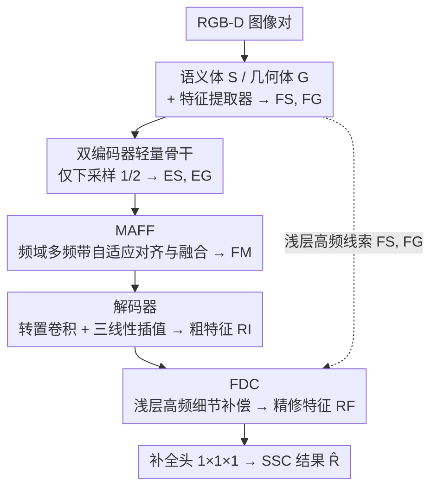

# Multi-modal Frequency Decomposition Network for Semantic Scene Completion

**会议**: CVPR 2026  
**论文**: [CVF Open Access](https://openaccess.thecvf.com/content/CVPR2026/html/Zuo_Multi-modal_Frequency_Decomposition_Network_for_Semantic_Scene_Completion_CVPR_2026_paper.html)  
**代码**: 无  
**领域**: 3D视觉  
**关键词**: 语义场景补全, 频域分解, RGB-D多模态融合, 细节补偿, 轻量网络

## 一句话总结
MFDNet 把 RGB-D 语义场景补全（SSC）的多模态融合从空间域搬到频域：用 MAFF 在多频带上自适应对齐并融合语义/几何特征、用 FDC 把浅层高频细节补回粗补全结果，从而在「模态对齐」和「细节保留」之间取得平衡，参数量减少 54.4% 的同时在 NYUv2 / NYUCAD 上刷到 SOTA。

## 研究背景与动机

**领域现状**：语义场景补全（Semantic Scene Completion, SSC）输入一对 RGB-D 图像，输出一个 3D 体素化的语义占据图（既有几何结构又有语义标签），是机器人导航、VR 等 3D 场景理解的核心技术。主流做法是：用 2D 语义分割网络处理 RGB、把像素级语义投影进 3D 得到语义体 $S$；用 TSDF 编码深度图得到几何体 $G$；然后在**空间域**用大量卷积 + 下采样提取高层特征并融合。

**现有痛点**：这套空间域 pipeline 有两层"错位"（misalignment）。其一是**原始数据本身就不准**：2D 分割图投影到 3D 的语义体与真实语义不一致，深度图受传感器限制也无法表示真实距离，两个模态在同一体素上经常一个标"free"、一个标"occupied"。其二是**特征学习放大错位**：卷积、下采样这类聚合上下文的操作会引入特征平滑与细节丢失，把本就不齐的多模态特征进一步抹平。

**核心矛盾**：空间域里「对齐语义」和「保留几何细节」是一对 trade-off——堆更多复杂操作能对齐语义，却会平滑掉几何细节；减少操作能保住几何，却又对不齐语义。两者无法同时满足。更糟的是，空间域把场景编码成一个整体特征，缺乏细粒度的信息解耦，跨模态对齐局部细节时会被无关的全局信息干扰。

**本文目标**：在轻量（少卷积、少下采样）的前提下，同时做到多模态对齐和细节保留。

**切入角度**：频率分解能把全局信息和局部细节解耦到不同频带（低频 ↔ 全局，高频 ↔ 局部细节）。如果在频域里融合，就能减轻空间域的信息纠缠，让跨模态对齐时只聚合相关频带的信息。

**核心 idea**：用频域的多频带分解 + 自适应融合（MAFF）做"全局对齐"，再用浅层高频补偿（FDC）做"局部细节补全"，形成一条 global-to-local 的对齐补全范式，替代空间域里"堆操作硬对齐"的老路。

## 方法详解

### 整体框架
MFDNet 是一个双编码器补全网络。给定一对 RGB-D，先做常规预处理：RGB 经预训练 2D 分割网络投影成语义体 $S\in\mathbb{R}^{H\times W\times D}$，深度图编码成几何体 $G$；语义体转 one-hot 后，两条特征提取器分别得到语义特征 $F_S$ 和几何特征 $F_G$。之后进入双编码器（各 4 个不同膨胀率的 DDR block），**只下采样到 1/2**（其它方法常用 1/4 甚至更小），在保细节和抓全局之间折中，得到编码特征 $E_S, E_G$。核心创新有两处：**MAFF** 把 $E_S, E_G$ 在频域做多频带自适应对齐与融合，得到融合特征 $F_M$；解码器（一层转置卷积 + 三线性插值）把 $F_M$ 升回全分辨率粗特征 $R_I$；**FDC** 再用浅层特征 $F_S, F_G$ 里的高频线索补偿 $R_I$ 的局部细节，得到精修特征 $R_F$；最后过 $1\times1\times1$ 卷积补全头输出 SSC 结果 $\hat R$。MAFF 从全局对齐、FDC 从局部补细节，二者串成 global-to-local 的对齐补全流程。

### 关键设计

**1. 双编码器轻量骨干：用克制的下采样守住几何细节**

这一步直接针对"特征学习放大错位"的痛点。既然下采样会平滑掉几何细节，那就**少下采样**：MFDNet 的两条编码器各由 4 个不同膨胀率的 DDR block 组成，第一个 block 负责把分辨率降到 1/2、通道翻倍，而其它 SSC 方法普遍降到 1/4 或更小。1/2 的下采样率是一个折中点——既能保留体素级局部细节，又能借膨胀卷积扩大感受野抓全局上下文。语义/几何各自走独立编码器（dual-encoder），是为了先把单模态特征学干净，再交给后面的 MAFF 精确融合，而不是一开始就把两个有错位的模态混在一起。正因为把"对齐"的重活交给了频域模块，骨干才敢用这么少的层数，整体保持 lightweight。

**2. MAFF：在频域按频带自适应对齐并融合多模态特征**

空间域融合的根本问题是全局信息和局部细节纠缠在一起，对齐时互相干扰。MAFF 把融合搬进频域来解耦。先对编码特征做 FFT 并 FFTShift（把低频移到频谱中心、高频推向边界，便于滤波）：$\tilde E_S = S(T(E_S)),\ \tilde E_G = S(T(E_G))$。然后用一组高斯低通滤波器 $\text{HLP}(\cdot)$ 的差分构造 $k$ 个频带滤波器——$T^0=\text{HLP}(\gamma_0)$、中间频带 $T^j=\text{HLP}(\gamma_j)-\text{HLP}(\gamma_{j-1})$、$T^{k-1}=1-\text{HLP}(\gamma_{k-2})$，把特征按频带切开（$\tilde A^i = \tilde E\odot T^i$），频带从低到高覆盖全局到局部。

关键在融合时的权重学习策略：**从整体特征学权重、再施加到各频带上**（即 overall-to-band）。具体地，$W_S^i = \alpha\cdot\sigma(\tilde E_S),\ W_G^i = \alpha\cdot\sigma(\tilde E_G)$（$\sigma$ 含卷积 + sigmoid，$\alpha$ 是缩放因子），再加权求和 $\tilde M_S=\sum_i W_S^i\odot \tilde A_S^i$、$\tilde M_G=\sum_i W_G^i\odot \tilde A_G^i$、$\tilde A_M=\tilde M_S+\tilde M_G$，最后 IFFT 回空间域得到融合特征 $F_M$。从整体学权重能建模**模态内的多频带依赖**（band 之间不是孤立的），同时校准模态内的不准；而两模态共享这套频域表示并相加，又建模了**模态间关系**、把高层特征对齐。消融里 overall-to-band 显著优于 band-to-band 和 overall-to-overall，验证了"整体指导、分带施权"这个组合的必要性。这也是与 FFNet 等频域方法的本质区别：FFNet 把高低频分开独立融合，破坏了模态内的多频带依赖，MFDNet 则保住了这种依赖。

**3. FDC：用浅层高频线索补偿粗特征丢失的局部细节**

MAFF 做的是全局对齐，但解码出的粗特征 $R_I$ 仍缺局部细节。FDC 的依据是"下采样前的浅层特征 $F_S, F_G$ 平滑程度低、保留更多细节线索"。它先用带 BN + 激活的卷积把 $F_S, F_G$ 调成 $\hat F_S,\hat F_G$，转到频域后用高通滤波器 $T_S=1-\text{HLP}(\gamma_S)$、$T_G=1-\text{HLP}(\gamma_G)$ 抽出高频分量 $\tilde A_S,\tilde A_G$。

补偿时的权重设计很讲究——**从粗特征 $R_I$（而不是从被抽取的浅层特征）学权重**：$\hat W_S=\beta\cdot\sigma(\tilde R_I),\ \hat W_G=\beta\cdot\sigma(\tilde R_I)$，再做残差式融合 $R_F = R_I + T(S(\tilde A_S\odot\hat W_S + \tilde A_G\odot\hat W_G))$。这与 MAFF 的权重来源刻意不同：MAFF 从整体编码特征学权重去校准模态内的不准；FDC 从 $R_I$ 学权重，是为了让网络"看着粗结果缺哪儿就补哪儿"，自适应地识别 $R_I$ 缺失的细节。残差形式还顺手建了一条额外的梯度回传通路，直接喂到浅层，增强网络捕捉场景细节的能力。消融显示"加权高频"优于"加权整体浅层特征"（整体浅层含太多冗余信息会分散网络注意力），权重从 $R_I$ 学也优于从浅层高频或整体浅层学。

### 损失函数 / 训练策略
为了让融合阶段的对齐更准，MAFF 引入了**辅助的语义/几何监督**：把加权后的频域特征 $\tilde M_S,\tilde M_G$ 转回空间域 $M_S,M_G$，各过一个预测头得到 3D 语义预测 $\hat P$ 和占据预测 $\hat Y$，监督为 $L_S=\text{CE}(\hat P,P)$、$L_G=\text{BCE}(\hat Y,Y)$（$P$ 由全分辨率 GT 下采样得到，$Y$ 由 $P$ 二值化得到）。最终结果 $\hat R$ 由 $L_{SSC}=\text{CE}(\hat R,R)$ 监督。总目标为

$$L_{total}=\lambda_S L_S + \lambda_G L_G + \lambda_{SSC} L_{SSC}.$$

这种分层监督让 MAFF 既能在模态内校准、又能跨模态对齐，是它有效的训练侧保障。

## 实验关键数据

数据集：NYUv2、NYUCAD；指标：场景补全 IoU（SC）、语义补全 mIoU（SSC）。

### 主实验
NYUv2 测试集上与各类方法对比（节选）：

| Domain | 方法 | IoU(%) | mIoU(%) |
|--------|------|--------|---------|
| Spatial | SISNet | 78.2 | 52.4 |
| Spatial | CVSformer | 73.7 | 52.6 |
| Spatial | SG-SSC | 74.3 | 54.6 |
| Spatial | AMMNet | 76.3 | 56.1 |
| Frequency | FFNet | 71.8 | 44.4 |
| Frequency | **MFDNet（本文）** | **77.1** | **57.0** |

mIoU 相比此前最好的 AMMNet 提升 0.9%，window 类从 42.8% → 46.2%、tvs 类从 52.4% → 54.8% 提升显著。NYUCAD 上 MFDNet 取得 IoU 87.6% / mIoU 69.7%，precision +1.2%、IoU +1.0%，floor、window 等类别提升明显。

参数量与融合策略对比（去掉判别器/FDC 做公平比较）：

| 方法 | IoU(%) | mIoU(%) | 参数(M) |
|------|--------|---------|---------|
| AMMNet† (无判别器) | 75.0 | 55.2 | 20.85 |
| Ours† (无 FDC) | 75.8 | 55.7 | 4.79 |
| AMMNet (完整) | 76.3 | 56.1 | 22.17 |
| **Ours (完整)** | **77.1** | **57.0** | **10.10** |

仅看融合模块，Ours† 比 AMMNet† 涨 0.8% IoU / 0.5% mIoU，参数却少 77.03%；完整模型从 22.17M 降到 10.10M（约 54.4% 削减），印证频域融合策略的高效。

### 消融实验

组件消融（NYUv2）：

| MAFF | FDC | IoU(%) | mIoU(%) | 说明 |
|------|-----|--------|---------|------|
| | | 75.2 | 54.5 | 加法融合基线 |
| ✓ | | 75.8 | 55.7 | +MAFF，跨模态互补更好 |
| | ✓ | 76.3 | 55.1 | +FDC，补回高频细节 |
| ✓ | ✓ | **77.1** | **57.0** | 完整模型 |

MAFF 内部权重策略（Table 2）：

| 域 | 权重学习 | IoU(%) | mIoU(%) |
|----|---------|--------|---------|
| 空间 | 无权重 | 76.3 | 55.1 |
| 空间 | overall-to-overall | 76.0 | 55.5 |
| 频域 | overall-to-overall | 76.4 | 56.1 |
| 频域 | band-to-band | 76.7 | 56.5 |
| 频域 | **overall-to-band** | **77.1** | **57.0** |

FDC 补偿成分（Table 3）：w/o 补偿 55.7 → overall 56.1 → 加权 overall 56.4 → high-freq 56.6 → **加权 high-freq 57.0**；FDC 权重来源（Table 4）：从高频自身学 56.3、从整体浅层学 56.1、**从粗特征 $R_I$ 学 57.0** 最优。

### 关键发现
- **MAFF 对 mIoU 贡献最大**：单加 MAFF 把 mIoU 从 54.5 拉到 55.7；FDC 单独加更利于 IoU（几何/补全完整度），两者互补，合起来 mIoU 才上 57.0。
- **频域 > 空间域、整带指导分带施权 > 其它策略**：把权重学习从空间搬到频域 mIoU +0.6（56.1 vs 55.5），overall-to-band 又比 band-to-band 高 0.5，说明"保留多频带依赖 + 整体指导"缺一不可。
- **FDC 必须从粗特征学权重**：从 $R_I$ 学权重（57.0）明显优于从浅层特征学（56.1–56.3），因为只有看着粗结果才知道"缺哪儿补哪儿"；且只补高频（而非整体浅层）能避免冗余信息干扰。t-SNE 显示语义/几何特征簇距离从 $d_1$（空间域）逐步缩小到 $d_4$，频谱分析显示 $R_F$ 比 $R_I$ 高频分量更丰富，从可视化侧印证了对齐与细节补偿。

## 亮点与洞察
- **把"对齐 vs 细节"的 trade-off 换成频域解耦**：传统思路在空间域靠堆操作硬对齐，本文洞察到低/高频天然对应全局/局部，于是用频带分解让对齐和保细节各管各的频段，这个视角迁移性很强——任何"全局对齐会牺牲局部细节"的多模态任务都可借鉴。
- **两个频域模块的权重来源刻意做反**：MAFF 从整体特征学权重（校准模态内 + 对齐模态间），FDC 从粗特征学权重（识别缺失细节）。同样是"频域 + 学权重"，但目标不同就让来源不同，这种"按目的设计权重来源"的思路很值得复用。
- **轻量是设计的副产品而非妥协**：因为把对齐的重活交给频域，骨干才敢只下采样 1/2、少堆卷积，结果参数砍半还涨点——"换个域做事"比"在原域里精打细算"更根本。
- **残差补偿顺带建了梯度捷径**：FDC 的 $R_F=R_I+(\cdot)$ 不仅补细节，还给浅层开了条额外回传通路，一举两得。

## 局限与展望
- **依赖预训练 2D 分割网络**：语义体来自现成的 2D 分割投影，分割质量会直接传导到补全结果，论文未讨论分割误差对最终性能的上限影响。
- **只在室内 NYUv2/NYUCAD 上验证**：SSC 还有室外/驾驶场景（如 SemanticKITTI），频域分解在更大尺度、更稀疏的室外体素上是否同样有效，缺乏验证。⚠️ 论文未给出室外结果，以原文为准。
- **频带数 $k$、各滤波器半径 $\gamma$ 等超参的敏感性**：论文给了滤波器构造方式，但没系统报告 $k$ 取多少最好、$\gamma$ 如何选，实际复现时这些可能需要调。
- **改进思路**：可探索可学习滤波器半径（而非固定 $\gamma$）、或把频带数做成自适应；也可把 FDC 的"看缺啥补啥"思路扩展到多尺度而非只在单一粗特征上补。

## 相关工作与启发
- **vs FFNet（频域 SSC）**: FFNet 也用可学习滤波器把 RGB-D 分到不同频带，但把高、低频**分开独立融合**，破坏了模态内的多频带依赖；且它把 2D 分割预测投影进 3D 后直接拼接，忽略深度不准带来的错位。MFDNet 用 overall-to-band 保住多频带依赖，并在频域统一对齐两模态，NYUv2 上 mIoU 57.0 vs FFNet 44.4，差距明显。
- **vs AMMNet（空间域校准）**: AMMNet 用 TSDF 校准语义特征、靠判别器+调制做融合，但忽略其它模态的不准，且参数量大（22.17M）。MFDNet 在频域做双向对齐，参数 10.10M 还涨点，公平比较下融合模块参数少 77%。
- **vs CleanerS / SG-SSC**: CleanerS 用蒸馏降 TSDF 噪声、SG-SSC 用语义引导融合，但 SG-SSC 的 2D→3D 投影又重新引入深度误差。MFDNet 不在空间域里"修补不准"，而是换到频域解耦，从根上减少跨模态干扰。

## 评分
- 新颖性: ⭐⭐⭐⭐ 把 SSC 的多模态对齐系统性搬到频域、并用"整体指导分带施权 + 粗特征引导高频补偿"两套互补机制，视角新且自洽。
- 实验充分度: ⭐⭐⭐⭐ 主结果 + 多组细粒度消融 + t-SNE/频谱可视化齐全；但只在室内两个数据集验证，缺室外场景。
- 写作质量: ⭐⭐⭐⭐ 动机（两类错位 + trade-off）讲得清楚，公式与模块对应明确。
- 价值: ⭐⭐⭐⭐ 参数减半还刷 SOTA，频域解耦思路对其它多模态对齐任务有迁移价值。

<!-- RELATED:START -->

## 相关论文

- [\[CVPR 2026\] Learning Spatial-Temporal Consistency for 3D Semantic Scene Completion](learning_spatial-temporal_consistency_for_3d_semantic_scene_completion.md)
- [\[CVPR 2026\] TGSFormer: Scalable Temporal Gaussian Splatting for Embodied Semantic Scene Completion](tgsformer_scalable_temporal_gaussian_splatting_for_embodied_semantic_scene_compl.md)
- [\[CVPR 2026\] Semantic Foam: Unifying Spatial and Semantic Scene Decomposition](semantic_foam_unifying_spatial_and_semantic_scene_decomposition.md)
- [\[CVPR 2026\] X-Part: High Fidelity And Structure Coherent Shape Decomposition And Completion](x-part_high_fidelity_and_structure_coherent_shape_decomposition_and_completion.md)
- [\[CVPR 2026\] MSGNav: Unleashing the Power of Multi-modal 3D Scene Graph for Zero-Shot Embodied Navigation](msgnav_unleashing_the_power_of_multi-modal_3d_scene_graph_for_zero-shot_embodied.md)

<!-- RELATED:END -->
