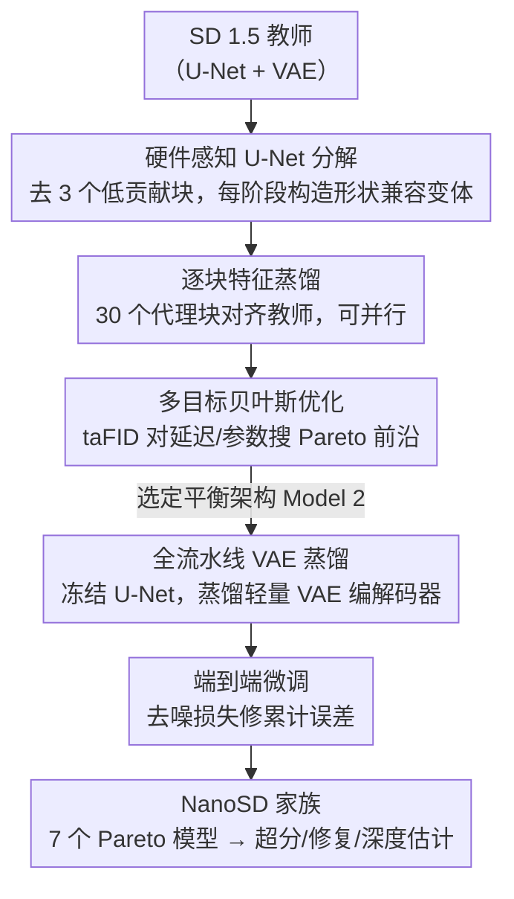

# NanoSD: Edge Efficient Foundation Model for Real Time Image Restoration

**会议**: CVPR2026  
**arXiv**: [2601.09823](https://arxiv.org/abs/2601.09823)  
**代码**: 待确认  
**领域**: 3D视觉  
**关键词**: 扩散模型蒸馏, 边缘部署, 图像修复, 超分辨率, 模型压缩, 多目标优化, Stable Diffusion

## 一句话总结

提出 NanoSD，通过对 SD 1.5 进行硬件感知的 U-Net 分解、逐块特征蒸馏和多目标贝叶斯优化，构建了一族 Pareto 最优的轻量扩散基础模型（130M–315M 参数，最快 12ms 推理），可作为 drop-in backbone 在超分、人脸修复、去模糊、单目深度估计等多任务上达到 SOTA 级表现。

## 研究背景与动机

**扩散模型的修复能力与部署矛盾**：SD 1.5 等潜在扩散模型拥有强大的生成先验，对图像修复极有价值，但其完整流水线（U-Net + VAE）计算量过大，无法在边缘设备上实时运行。

**现有轻量化方法局限于单任务**：已有的边缘高效方法（AdcSR、TinySR、PocketSR 等）主要针对超分辨率任务并使用有限数据集蒸馏，未能充分利用预训练 T2I 模型中的丰富先验知识，导致结构不合理或感知细节欠佳。

**理论计算量 ≠ 实际延迟**：NPU 针对特定算子模式（如 GEMM）优化，仅减少 FLOPs/GMACs 并不能保证实际延迟等比下降，需要从硬件角度重新审视架构设计。

**缺乏统一的条件机制支持**：不同修复任务需要不同的条件控制策略（LoRA、ControlNet、视觉提示等），已有轻量模型无法灵活兼容这些控制插件。

**潜在空间保持的重要性**：现有方法主要压缩去噪 U-Net 或缩短扩散轨迹，破坏了底层潜在流形，限制了跨任务泛化能力。

**端到端流水线未协同优化**：大部分工作只压缩 U-Net 而忽略 VAE 编码器-解码器的瘦身，整体流水线仍然笨重。

## 方法详解

### 整体框架

NanoSD 要解决的是一个很实际的矛盾：SD 1.5 的生成先验对图像修复极有价值，但完整的 U-Net+VAE 流水线太重，没法在边缘 NPU 上实时跑。它的思路不是手工砍网络，而是把 SD 1.5 拆成可替换的模块、为每个模块预先蒸馏出若干轻量变体，再用多目标搜索自动拼出一族 Pareto 最优的小模型。整条流水线分五步：先对 U-Net 做硬件感知分解、去掉贡献最小的深层块并为保留阶段构造形状兼容的变体；对每个变体做逐块特征蒸馏对齐到 SD 1.5 教师块；把模块选择编码为离散向量、用多目标贝叶斯优化搜出 Pareto 前沿；冻结选定的 U-Net 再蒸馏配套 VAE；最后端到端微调修掉累计误差，得到最终的 NanoSD。

### 关键设计

**1. 硬件感知 U-Net 分解：让 FLOPs 的节省真正落到延迟上**

NPU 是按 GEMM 等特定算子模式优化的，单纯减 FLOPs 并不等比降延迟，手工简化还容易破坏生成先验。NanoSD（Sec 3.1）先移除 SD 1.5 中贡献最小的 encoder-4、middle block、decoder-4，保留 3 个编码器 + 3 个解码器；再逐阶段检查原始模块结构（如 R-A-R-A），为每个阶段构造一批严格保持输入输出张量形状的变体（纯残差、减少注意力等）。形状兼容是关键——它保证任意模块组合都不需要插适配器，于是 6 个阶段各自的变体可以自由排列，撑起 4×4×4×8×8×8 = 32,768 种候选架构的搜索空间。

**2. 逐块特征蒸馏：用「分治」把全网络训练降成几十个小训练**

要在 32K 量级的架构空间里挑模型，逐个从头训显然不现实。NanoSD（Sec 3.2）改成以 SD 1.5 对应块为教师、对每个阶段的每种候选变体独立做 L2 特征匹配蒸馏：$\mathcal{L}_{\text{distill}}^{(i,j)} = \|O_S - O_T\|_2^2$。6 个阶段一共只需训练 3+3+3+7+7+7 = 30 个蒸馏代理块，而且这些训练彼此独立、可大规模并行，开销极低。组装时直接复用这些预训练块，整张候选网络无需再训，这正是它能高效遍历海量架构的根本原因。

**3. 多目标贝叶斯优化：在延迟/参数与质量之间搜 Pareto 前沿**

代理块准备好后，需要一个目标来衡量「哪种组合既快又像 SD 1.5」。NanoSD（Sec 3.4）定义教师对齐 FID（taFID）刻画与 SD 1.5 输出分布的偏离，分别和设备延迟、参数量组成两个双目标问题。它把离散的模块选择松弛到连续空间 $\mathbf{x} \in [0,1]^6$，用高斯过程建模目标，再通过最大化期望超体积改善（EHVI）采样下一个候选点。最终搜出 7 个 Pareto 最优架构，代表性的 Model 2（NanoSD-Prime）为 315M 参数、27ms 延迟、taFID=10——延迟与参数量并不正相关，正是这套多目标搜索才能同时照顾到两端。

**4. 全流水线 VAE 蒸馏：把压缩延伸到 VAE，而非只瘦身 U-Net**

之前的边缘方法几乎只压缩去噪 U-Net，VAE 编解码器原封不动，整条潜在扩散流水线仍然笨重，这也是它们破坏潜在流形、跨任务泛化差的根源。NanoSD（Sec 3.5 与补充材料）在搜出 Pareto U-Net 后将其冻结，再对 SD 1.5 的 VAE 编码器和解码器做特征匹配蒸馏：学生 VAE 改用固定 64 通道的 Tiny ResNet 块和浅层轻量上/下采样，替换教师里 64→128→256→512 的渐宽结构，编码器/解码器分别压到约 2M/1.3M 参数（FP16 下 10ms/8ms）。每个蒸馏 U-Net 配一个蒸馏 VAE 组成一个 NanoSD 候选，最后再用标准扩散去噪损失端到端微调，修掉逐块拼接带来的累计误差。正是这一步让「全流水线协同压缩」落到实处，也是它区别于只动 U-Net 的同类工作、得以保留完整潜在流形的关键。

### 一个完整示例：从 SD 1.5 到 NanoSD-Prime

以构造 NanoSD-Prime 为例走一遍流水线：SD 1.5 的 U-Net 先被分解、去掉 3 个低贡献块，6 个保留阶段各派生若干形状兼容变体，组合出 32,768 种候选；这些候选共享同一批 30 个预蒸馏代理块，因此无需逐个训练。贝叶斯优化在 taFID-延迟、taFID-参数两个平面上搜索，收敛到 7 个 Pareto 架构；从中选出 Model 2，冻结其 U-Net 后蒸馏 VAE、再端到端微调，最终得到 315M 参数、27ms NPU 延迟、taFID=10 的 NanoSD-Prime，生成质量与 SD 1.5 几乎一致。

### 损失函数 / 训练策略

- **块级蒸馏**：L2 特征匹配损失，逐阶段独立训练 30 个代理块
- **VAE 蒸馏**：冻结选定 U-Net 后，用标准特征匹配损失蒸馏 VAE 编解码器
- **端到端微调**：标准扩散去噪损失，修正模块拼接带来的累计误差

## 实验

### 主要结果

**超分辨率（DIV-2K Val）**：

| 方法 | PSNR↑ | SSIM↑ | LPIPS↓ | FID↓ | NIQE↓ | MUSIQ↑ | MACs(G) | Para.(M) |
|------|-------|-------|--------|------|-------|--------|---------|----------|
| Edge-SD-SR | 24.10 | 0.617 | 0.249 | 25.37 | - | 69.58 | - | 169 |
| AdcSR | 23.74 | 0.602 | 0.285 | 25.52 | 4.36 | 68.00 | 496 | 456 |
| TinySR | - | 0.572 | 0.279 | 22.94 | 4.15 | 69.90 | 427 | 341 |
| **Nano-S3Diff** | 23.13 | 0.573 | **0.278** | **22.34** | **4.09** | **70.44** | **285** | **318** |
| **Nano-OSEDiff** | **24.29** | **0.628** | 0.296 | 27.46 | 4.92 | 66.41 | 340 | 448 |

**人脸修复（CelebA-Test）**：

| 方法 | LPIPS↓ | NIQE↓ | MUSIQ↑ | FID↓ | LMD↓ | MACs(G) | Para.(M) |
|------|--------|-------|--------|------|------|---------|----------|
| OSDFace | 0.336 | 3.884 | 75.64 | 45.41 | 5.286 | 2465 | 1887 |
| **Nano-OSDFace** | 0.341 | 3.913 | **76.01** | 45.92 | **5.172** | **479** | **415** |

Nano-OSDFace 在 MACs 降低约 5 倍、参数量降低约 4.5 倍的情况下，MUSIQ 和 LMD 甚至优于原始 OSDFace。

### 消融与分析

- **Pareto 前沿分析**：7 个 NanoSD 变体覆盖 12ms–41ms 延迟和 130M–315M 参数范围；手工调优模型和 Segmind TinySD 均远离 Pareto 前沿，说明人工简化无法有效保留生成先验
- **延迟 vs 参数不一致**：Model 5 最低延迟（12ms/170M），Model 7 最少参数（27ms/130M），验证了参数量与延迟并非正相关的核心论点
- **多任务通用性**：同一个 NanoSD backbone 成功集成到 OSEDiff、S3Diff、OSDFace、DiffBIR、Diff-Plugin、Marigold 六种框架中，覆盖超分、人脸修复、去模糊/去雾/去雨/去雪、单目深度估计

### 关键发现

1. 逐块蒸馏 + 贝叶斯搜索组合可以在不进行全网络训练的情况下高效探索 32K 级搜索空间
2. NanoSD-Prime（Model 2）在 27ms NPU 延迟下实现了与 SD 1.5 几乎一致的生成质量（taFID=10）
3. 在深度估计上，Nano-Marigold 在 NYUv2 上 AbsRel=7.2、δ1=94.6，与 Marigold（5.5/96.4）差距可控

## 亮点

- 首次从全流水线角度（U-Net + VAE）协同压缩 SD 1.5，而非仅压缩去噪网络
- 块级蒸馏 + 组合搜索的"分治"策略极其高效：30 个代理块可组装 32K 种架构
- 严格的硬件感知设计：所有变体保持张量形状兼容，无需适配器
- 真正的多任务基础模型：同一 backbone 兼容 LoRA、ControlNet 等多种条件控制插件
- 实际部署验证：在 Qualcomm NPU 上 8bit 权重/16bit 激活实测 27ms

## 局限性

- 仅基于 SD 1.5 蒸馏，未探索 SDXL 或 SD3 等更新架构的压缩潜力
- taFID 作为搜索指标仅衡量与教师的分布偏离，不直接对应下游任务性能
- 深度估计任务上与全尺寸 Marigold 仍有明显差距（AbsRel 7.2 vs 5.5）
- 所有实验均在 Qualcomm NPU 上测量延迟，其他硬件平台（如 Apple ANE、联发科 APU）的适用性未验证
- VAE 蒸馏细节缺失在正文中，读者难以完整复现

## 相关工作

- **扩散模型修复**：StableSR、DiffBIR、Diff-Plugin、SeeSR 利用 T2I 先验但计算量巨大
- **单步扩散加速**：SinSR（双向蒸馏）、OSEDiff（变分分数蒸馏）、S3Diff（退化感知 LoRA）
- **架构压缩**：SnapFusion（模块贡献分析）、MobileDiff（Transformer 重定位）、SnapGen（深度可分离卷积）
- **边缘高效 SR**：AdcSR（对抗扩散压缩）、Edge-SD-SR（LR 条件机制）、TinySR（深度 U-Net 剪枝）、PocketSR（多层特征蒸馏）
- **Segmind TinySD**：手工简化 SD 1.5，但在 Pareto 前沿上远不如 NanoSD 系列

## 评分

- 新颖性: ⭐⭐⭐⭐ — 块级蒸馏 + 多目标贝叶斯搜索的全流水线协同压缩方案新颖
- 实验充分度: ⭐⭐⭐⭐⭐ — 覆盖 7 个修复任务、多个数据集、6 种集成框架，硬件实测
- 写作质量: ⭐⭐⭐⭐ — 框架图清晰，Pareto 分析充分，但 VAE 蒸馏细节不足
- 价值: ⭐⭐⭐⭐⭐ — 为边缘设备扩散模型部署提供了实用的通用基础模型方案

<!-- RELATED:START -->

## 相关论文

- [\[CVPR 2026\] Foundry: Distilling 3D Foundation Models for the Edge](foundry_distilling_3d_foundation_models_for_the_edge.md)
- [\[CVPR 2026\] ESAM++: Efficient Online 3D Perception on the Edge](esam_efficient_online_3d_perception_on_the_edge.md)
- [\[CVPR 2026\] DMAligner: Enhancing Image Alignment via Diffusion Model Based View Synthesis](dmaligner_enhancing_image_alignment_via_diffusion_model_based_view_synthesis.md)
- [\[AAAI 2026\] RTGaze: Real-Time 3D-Aware Gaze Redirection from a Single Image](../../AAAI2026/3d_vision/rtgaze_real-time_3d-aware_gaze_redirection_from_a_single_image.md)
- [\[CVPR 2026\] Unsupervised Multi-Scale Segmentation of 3D Subcellular World with Stable Diffusion Foundation Model](unsupervised_multi-scale_segmentation_of_3d_subcellular_world_with_stable_diffus.md)

<!-- RELATED:END -->
