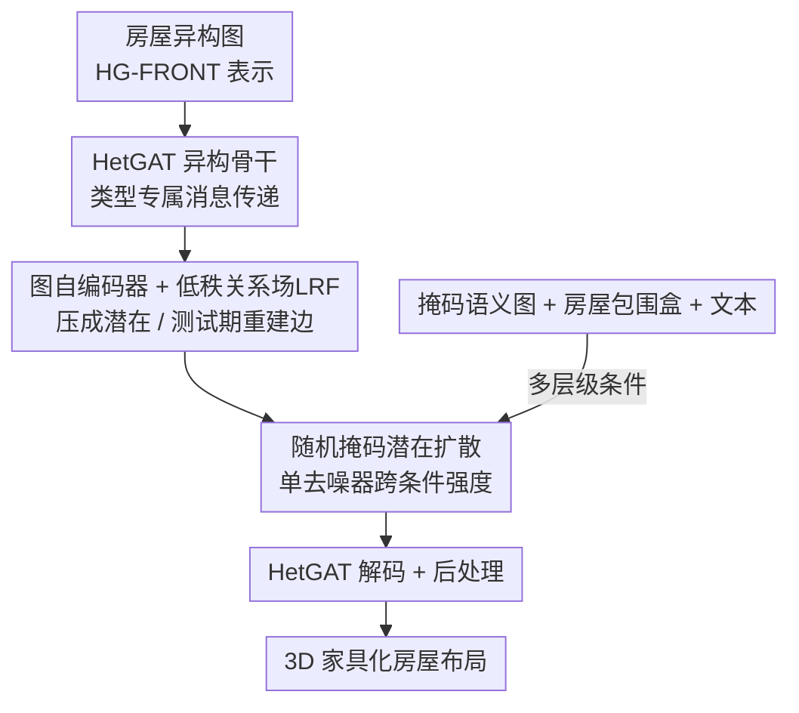

# Nestwork: Conditional 3D Furnished House Layout Generation through Latent Heterogeneous Graph Diffusion

**会议**: CVPR 2026  
**论文**: [CVF Open Access](https://openaccess.thecvf.com/content/CVPR2026/html/Miao_Nestwork_Conditional_3D_Furnished_House_Layout_Generation_through_Latent_Heterogeneous_CVPR_2026_paper.html)  
**代码**: 有（论文称 "Code available at: GitHub repository"，未给出具体地址，⚠️ 以原文为准）  
**领域**: 3D视觉 / 室内场景生成  
**关键词**: 3D 布局生成, 异构图扩散, 潜在扩散, 场景图条件, 家具摆放

## 一句话总结
Nestwork 把"房间 + 家具"整套住宅编码成一张**异构场景图**，在它的潜在空间上训练一个**带随机掩码**的扩散去噪器，让同一个模型既能从完整语义图、也能从只有拓扑/纯文本描述生成一栋**一次性成型、家具齐全**的 3D 住宅，并在 3D-FRONT 上把两阶段流水线的 FID 从 41.9 压到 7.3。

## 研究背景与动机
**领域现状**：用场景图来约束 3D 布局生成是一条很自然的路——用户能通过插入/删除/掩码节点和边来指定房间该怎么连、家具该放哪类，把几何细节交给模型推断。但现有方法按"空间尺度"把任务切开了：房屋级模型（HouseGAN、Graph2Plan、HouseDiffusion、GSDiff）只用房间图生成**没有家具**的 2D/多房间布局；房间级模型（GRAINS、SceneHGN、Graph-to-3D、DiffuScene）只在**单个房间内部**摆家具。

**现有痛点**：要生成"家具齐全的整栋住宅"，只能把这两类拼成多阶段流水线（如先 HouseDiffusion 出房间多边形、再 DiffuScene 逐房间填家具）。这种递归、解耦的管线会**误差累积**——上游房间形状一歪，下游就摆出稀疏、错位、不合理的家具，无法对"房间结构"和"家具摆放"做联合推理。

**核心矛盾**：把房间和家具塞进**同一张图**会撞上两个难点。其一，房间和家具的语义/几何天然异质——房间编码的是邻接、包含这类高层空间逻辑，家具携带的是细粒度几何属性和繁多类别；同构 GNN 对所有节点共享参数，既抓不住这种结构异质性，又容易过平滑。其二，生成器必须支持从"无标注拓扑"到"完整标注图"的**多档条件**，而且不能为每一档单独训练或搞分层调度；而现有扩散去噪骨干多建在 1D U-Net / Transformer 上，把节点当独立个体处理，缺乏显式的结构归纳偏置。

**本文目标**：用一个统一框架，直接在一张**扁平的、房屋尺度的异构图**上做生成，既保留类型敏感的关系推理，又支持灵活的掩码条件。

**核心 idea**：把整栋住宅表示成"房间 + 家具 + 多种空间关系"的异构图，用异构图注意力骨干（HetGAT）压进一个潜在空间，然后在潜在图上训练**一个**带 50% 随机掩码的扩散去噪器——同一个模型就能跨越"拓扑-only → 全标注"的整条条件强度谱，一次性解码出完整的 3D 住宅。

## 方法详解

### 整体框架
Nestwork 的输入是一张异构住宅图（房间节点、家具节点、虚拟房屋根节点 + 五类带类型的空间关系），输出是一栋家具齐全的 3D 住宅布局（每个节点的 3D 包围盒、朝向、类别、家具形状码）。整条管线分四步走：先用 **HetGAT 异构骨干**把这张图做类型专属的消息传递并由**图自编码器**压成节点级潜在码 $Z$；测试时编码器看不到几何边特征，于是解码器靠**低秩关系场（LRF）**从节点潜在码里重建出边表示；在这个潜在图上训练一个**带随机掩码的潜在扩散**去噪器，配合**多层级条件**（节点级掩码交叉注意力 + 房屋包围盒/文本的图级条件）；去噪后的潜在码经同一个解码器一次性还原成布局，最后做轻量后处理对齐房间边界、补上门窗（只影响可视化，不改指标）。

### 关键设计

**1. HG-FRONT 异构房屋图表示：把整栋住宅压进一张扁平类型图**

要做"房间-家具联合推理"，第一步是给整栋住宅找一个能同时容纳两种尺度的表示。Nestwork 把住宅写成异构图 $G=\langle V, E, T_V, T_E, X_V, X_E\rangle$：节点 $V = V_H \cup V_R \cup V_F$ 分别是虚拟房屋根、房间、家具三类，虚拟房屋节点聚合全局上下文并存住宅总包围盒。每个节点特征 $\mathbf{x}_u = [c; \mathbf{b}; o; \mathbf{s}]$ 包含类别 $c$、6 维包围盒 $\mathbf{b}$、离散朝向类 $o$ 和潜在形状码 $\mathbf{s}$（家具的 $\mathbf{s}$ 是 DeepSDF 隐码，房间的是按类别+包围盒条件化的可学习嵌入）。关键技巧是**所有包围盒都用局部坐标**：房间相对房屋根、家具相对其所属房间——这样"家具被房间包含"这种层级关系是**构造上强制满足**的，不用额外约束。边分五类：家具间 $E_{F\leftrightarrow F}$ 构成一个团（用户只需指定每个房间放哪几类、几件家具，房间内部空间关系交给模型推断），家具-房间 $E_{F\leftrightarrow R}$，按距离阈值区分的相邻/远离房间对 $E_{R\leftrightarrow R}^{\text{adj}}/E_{R\leftrightarrow R}^{\text{far}}$，以及房间-房屋 $E_{R\leftrightarrow H}$。基于此从 3D-FRONT 构建出 **HG-FRONT** 数据集（3,111 张高质量房屋图）。这张统一表示让"扩展房间级 VAE 到整栋住宅"成为可能，是后面所有模块的地基。

**2. HetGAT 异构图注意力骨干：让房间和家具走各自的消息通道**

同构 GNN 对房间和家具共享参数，抓不住异质结构还易过平滑。Nestwork 的骨干在标准 GAT 上叠了 EGAT 的边特征注意力和 HEAT 的类型专属变换，正好匹配"三类节点 + 五类关系"。每层先做类型专属投影：$h^{(l)}_u = W^{(n)}_{T_V(u)} h^{(l-1)}_u$，边特征 $e^{(l)}_{u\to v} = E^{(e)}_{T_E(u\to v)} \,\|\, f_{u\to v}$（编码器喂几何边属性、解码器喂学到的边嵌入、扩散去噪器只用边类型嵌入）。注意力打分把首尾节点和边表示拼起来过 LeakyReLU：$s^{(l)}_{uv,h} = \mathrm{LeakyReLU}(\mathbf{q}_h^\top [\mathbf{h}^{(l)}_u \| \mathbf{h}^{(l)}_v \| \mathbf{e}^{(l)}_{u\to v}])$，再在邻域上 softmax 归一化、多头聚合：

$$\mathbf{h}^{(l+1)}_u = \big\Vert_{h=1}^{H} \sigma\Big(\sum_{v\in\mathcal{N}(u)} \alpha^{(l)}_{uv,h}\, \mathbf{W}_h [\mathbf{h}^{(l)}_v \| \mathbf{e}^{(l)}_{u\to v}]\Big)$$

之所以有效，是因为类型专属的 $W^{(n)}_{T_V(u)}$ 让房间走"高层空间逻辑"通道、家具走"细粒度几何"通道，避免把两种异质语义混进同一组参数。这套骨干在编码器、解码器、去噪器里**三处复用**，是"异构"卖点的实际落点。

**3. 图自编码器 + 低秩关系场（LRF）：测试时没有几何边也能重建关系**

为给扩散提供紧凑连续的潜在空间，先预训练一个统一图自编码器：编码器把房屋图映成节点级潜在码 $Z=\{\mathbf{z}_u\}$（节点属性按 $\mathbf{h}^0_u = \text{MLP}(c)\|\text{MLP}(\mathbf{b})\|\text{MLP}(o)\|\text{MLP}(\mathbf{s})$ 嵌入，经 $L$ 层 HetGAT 后用两个 MLP 头出 $\boldsymbol{\mu}_u, \log\boldsymbol{\sigma}^2_u$ 并重参数化采样），解码器从 $Z$ 和拓扑图 $G_{\text{top}}$ 重建。由于解码器是**无条件**的，可以一次预训练、被所有扩散栈复用。

真正的痛点在解码端：测试时编码器拿不到真实几何边属性（相对距离、尺寸比等），可这些关系对"家具不撞、动线通畅"至关重要。LRF 就是用来从节点潜在码 $\mathbf{z}_u, \mathbf{z}_v$ 直接重建边嵌入 $\tilde{\mathbf{e}}_{u\to v}$ 的关系先验。它让每个节点对一个共享的关系槽字典 $D\in\mathbb{R}^{K\times d_s}$（$K=6$）做注意力：$\alpha_u = \text{softmax}(\text{MLP}(\mathbf{z}_u)D^\top/\tau_s)$（温度 $\tau_s=0.7$），再用可学习投影基 $\mathbf{U},\mathbf{V}\in\mathbb{R}^{d_s\times r}$（$r=32$）得 $\mathbf{a}_u=\alpha_u D\mathbf{U}$、$\mathbf{b}_v=\alpha_v D\mathbf{V}$，最后低秩双线性投影出边嵌入：

$$\tilde{\mathbf{e}}_{u\to v} := \text{MLP}\big([\mathbf{a}_u \,\|\, \mathbf{b}_v \,\|\, \alpha_u^\top \alpha_v]\big)$$

其中对齐项 $\alpha_u^\top\alpha_v$ 显式建模方向性和共现结构。秩 $r$ 的低秩分解把"任意节点对交互"正则成"经少量全局关系原型中转"，避免过拟合。训练前半段会**截断** $\tilde{\mathbf{e}}_{u\to v}$ 到编码器的梯度以稳优化，并用 $\ell_1$ 损失监督它重建真实边特征。总损失为 $\mathcal{L} = \mathcal{L}_{\text{rec}} + \lambda_{\text{KL}}\mathcal{L}_{\text{KL}} + \lambda_{\text{LRF}}\mathcal{L}_{\text{LRF}}$（$\lambda_{\text{KL}}=10^{-4}, \lambda_{\text{LRF}}=0.1$），其中 $\mathcal{L}_{\text{rec}}$ 含包围盒（smooth-$\ell_1$ + DIoU）、朝向/类别交叉熵、形状码 $\ell_1$。

**4. 随机掩码潜在扩散：一个去噪器吃下所有条件强度**

固定预训练的自编码器后，在潜在图 $G_0=(G_{\text{top}}, Z)$ 上做 DDPM：前向按线性噪声表 $Z_t=\sqrt{\bar\alpha_t}Z + \sqrt{1-\bar\alpha_t}\boldsymbol\epsilon$ 扰动节点潜在码，训练时间条件化的 HetGAT 去噪器 $\epsilon_\theta(G_t, t)$ 预测噪声（$\mathcal{L}_{\text{LD}}=\mathbb{E}\|\epsilon_\theta(G_t,t)-\boldsymbol\epsilon\|_2^2$）。关键不在扩散本身，而在**训练时用固定 50% 随机掩码节点标签**：这让同一个去噪器在训练中就见过从"几乎全标"到"几乎全空"的各种条件配置，测试时无需重训或分层调度，就能在 FullGraph / RoomGraph / Topology / RandMask 四种模式间无缝切换。相比把节点当独立个体的 1D U-Net/Transformer 去噪器，这里的 HetGAT 去噪器自带结构归纳偏置，在潜在图上去噪天然顾及邻接关系。

**5. 多层级条件：节点级语义补全 + 图级全局约束**

灵活控制需要同时注入"局部语义"和"全局上下文"。**节点级**：用掩码语义图 $\tilde{G}_{\text{sem}}$（拓扑同 $G_{\text{top}}$，只给部分节点标签，未标的填可学习 [MASK] token）；每个去噪层先 HetGAT 自注意力，再做一个交叉注意力块——以当前节点潜在码为 query、节点标签嵌入 $\mathbf{y}_v$ 为 key/value，在邻域内归一化注意力 $\alpha_{uv}=\text{softmax}(Q_u^\top K_v/\sqrt{d})$，得到的语义上下文 $\mathbf{c}_u=\sum_v \alpha_{uv}V_v$ 残差加回节点态。**图级**：几何嵌入 $\mathbf{g}_{\text{geom}}$ 来自房屋包围盒，可选文本嵌入 $\mathbf{g}_{\text{text}}$ 把掩码图序列化成结构化 prompt、过冻结 BERT(768D) 池化得到，二者线性组合 $\mathbf{g}=\alpha_{\text{geom}}\text{MLP}_{\text{geom}}(\mathbf{g}_{\text{geom}})+\alpha_{\text{text}}\text{MLP}_{\text{text}}(\mathbf{g}_{\text{text}})$，再残差加到交叉注意力输出上：$\mathbf{z}_u^{(t)} \leftarrow \mathbf{z}_u^{(t)} + \alpha_{\text{ca}}(\mathbf{c}_u + \mathbf{g})$。推理时若给的是自由文本，先用 LLM 解析器译成掩码邻接图 + 结构化 prompt（如"三间卧室 + 一个中央客厅"→可编辑掩码图），让不懂 CAD 的用户也能用自然语言驱动早期布局探索。

### 损失函数 / 训练策略
自编码器潜在维 128，训练 400 epoch；扩散模型训练 2000 epoch、200 个去噪步，单张 A100(40GB) 上跑。优化用 AdamW（weight decay 1e-4，初始 lr 1e-4，ReduceLROnPlateau）。条件扩散用固定 0.5 的随机节点标签掩码比训练一次，覆盖所有条件模式。

## 实验关键数据

数据集为 3D-FRONT（6,813 套专业设计住宅）派生的 HG-FRONT（3,111 张房屋图），70/15/15 划分。指标含 FID/KID（按类别上色渲染算）、掩码节点标签分布的 KL 散度、房间图约束满足率（Graph%）、家具碰撞率（Coll%）、可步行性（Walk%）、布局多样性（盒尺寸/位置/朝向标准差）。

### 主实验：一次成型 vs 两阶段流水线

| 模型 | FID ↓ | KID(×100) ↓ | Coll% ↓ | Graph% ↑ | Walk% ↑ | KL ↓ |
|------|-------|-------------|---------|----------|---------|------|
| 两阶段 (HouseDiffusion+DiffuScene) | 41.90 | 2.97 | 9.84 | 78.60 | 86.26 | 0.1823 |
| **Nestwork 一次成型** | **7.26** | **0.26** | 10.91 | **91.91** | **88.69** | **0.0317** |

> FID 直接降到约 1/6，图约束满足率 +13 个点。两阶段的碰撞率略低（9.84 vs 10.91，接近 GT 的 9.80%），但代价是严重的几何畸变和误差累积——上游房间形状一歪，家具就摆得稀疏错乱。

### 消融实验

| 配置 | FID ↓ | Coll% ↓ | Graph% ↑ | Walk% ↑ | 说明 |
|------|-------|---------|----------|---------|------|
| **Full** | **7.13** | **11.21** | **92.34** | **88.58** | 完整模型 |
| w/o 交叉注意力 (CA) | 76.35 | 69.28 | 55.02 | 91.13 | 换成线性投影注入，全面崩 |
| w/o LRF | 20.42 | 21.54 | 92.16 | 81.29 | 解码边特征改用 $[\mathbf{z}_u;\mathbf{z}_v]$ |

潜在先验消融：IID 先验 FID 24.64（多样性高但结构差）、自回归(AR)先验 FID 61.43（局部连贯但畸变、多样性低）、扩散先验(本文) FID 7.13——扩散先验在保真度和结构一致性上碾压另两者。骨干消融：HetGAT FID 7.13 优于 TripletGCN 7.50、SLN-Box 7.64，且 Graph% 92.34 远高于两者的 ~88。

### 关键发现
- **交叉注意力是命门**：去掉后 FID 从 7.13 暴涨到 76.35、碰撞率飙到 69.28%——它的高可步行性 + 高碰撞说明家具"塌缩"挤进了局部区域。掩码语义补全必须靠拓扑感知的条件注入，简单特征相加远远不够。
- **LRF 提供不可或缺的关系线索**：在没有真实几何边的测试场景，去掉 LRF 后碰撞率从 11.21% 翻到 21.54%、可步行性掉到 81.29%，证明从节点潜在码重建关系的设计确实补上了缺失的几何先验。
- **单模型跨四种条件强度都稳**：FullGraph/RoomGraph/Topology/RandMask 四模式 FID 在 6.96–7.75 之间、Graph% 都在 92 附近，靠的就是 50% 随机掩码训练。

## 亮点与洞察
- **"房间+家具"塞进一张扁平异构图**最巧：用局部坐标让层级包含关系构造上成立，用家具团边让用户只报类别数量、空间关系交给模型——把多阶段流水线的误差累积从根上消掉。
- **LRF 这个小模块解了一个很实际的工程难题**：训练能看到几何边、测试看不到，于是用"全局关系槽字典 + 低秩双线性"从节点码里凭空补出边表示，$\alpha_u^\top\alpha_v$ 对齐项还显式建了方向性，是可迁移到任何"测试期缺边特征"图任务的 trick。
- **一次掩码训练吃下整条条件谱**是省事的关键：不用为"全标/只给房间/纯拓扑/纯文本"各训一个模型，把灵活可控性和训练成本同时拿下。

## 局限与展望
- 作者承认：当前系统**不显式强制功能合理性**，生成布局仍可能有被堵住的动线，因此只适合早期创意构思、不能直接当最终设计——指向"可行性感知目标函数"的未来工作。
- 自己看到的：评估缺直接可比 baseline，主对比只能拼一个两阶段流水线，"FID 6→7"的横向比较受限于这套自建评测，跨数据集泛化未验证；HG-FRONT 只有 3,111 张图、且做了较强的房屋级过滤，规模和分布覆盖偏窄。
- 文本接口依赖外部 LLM 解析器把描述译成掩码图，解析质量直接影响生成，端到端可控性还有空间。
- 展望：扩到平面图/草图等多模态输入、支持交互式固定子图 inpainting。

## 相关工作与启发
- **vs HouseDiffusion / GSDiff（房屋级）**：它们只用房间图出无家具的 2D/多房间布局；本文把家具一并塞进同一张图、一次出 3D 家具化住宅，避免"出了房间还得另起一套流程摆家具"。
- **vs DiffuScene / Graph-to-3D（房间级）**：它们在单房间内摆家具、跨房间不连贯；本文在房屋尺度做联合推理，房间结构和家具摆放互相约束。
- **vs CHOrD（家具化房屋级）**：CHOrD 也从文本/平面图生成无碰撞 3D 布局，但全局条件化、不暴露显式的房间-家具图和掩码图控制；本文以扁平异构图 + 单遍潜在扩散支持掩码条件生成，可控性更细。
- **vs 同构图扩散（如基于 TripletGCN 的方法）**：它们共享参数、过平滑；本文用 HetGAT 做类型专属消息传递，骨干消融证明这对房屋尺度生成更有表达力。

## 评分
- 新颖性: ⭐⭐⭐⭐ 首个从扁平房屋尺度异构图、用单遍潜在扩散做掩码条件家具化住宅生成；HetGAT + LRF + 随机掩码组合有想法。
- 实验充分度: ⭐⭐⭐⭐ 主对比 + 骨干/先验/模块四组消融较完整，但缺乏可直接对比的同类 baseline、单数据集、无跨域验证。
- 写作质量: ⭐⭐⭐⭐ 公式与模块对应清晰，pipeline 讲得明白；部分指标定义需查附录。
- 价值: ⭐⭐⭐⭐ 室内设计/虚拟环境/MR 的早期布局工具很实用，HG-FRONT 数据集和 LRF trick 有复用价值，但功能可行性未保证限制了落地深度。

<!-- RELATED:START -->

## 相关论文

- [\[CVPR 2026\] NaTex: Seamless Texture Generation as Latent Color Diffusion](natex_seamless_texture_generation_as_latent_color_diffusion.md)
- [\[CVPR 2026\] Repurposing 3D Generative Model for Autoregressive Layout Generation](repurposing_3d_generative_model_for_autoregressive_layout_generation.md)
- [\[CVPR 2026\] ShapeR: Robust Conditional 3D Shape Generation from Casual Captures](shaper_robust_conditional_3d_shape_generation_from_casual_captures.md)
- [\[CVPR 2026\] MatLat: Material Latent Space for PBR Texture Generation](matlat_material_latent_space_for_pbr_texture_generation.md)
- [\[CVPR 2026\] Photo3D: Advancing Photorealistic 3D Generation through Structure-Aligned Detail Enhancement](photo3d_advancing_photorealistic_3d_generation_through_structure-aligned_detail_.md)

<!-- RELATED:END -->
